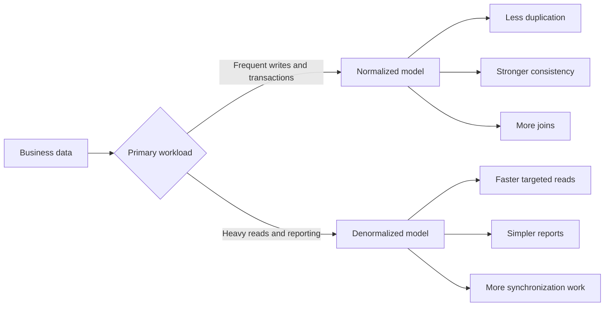
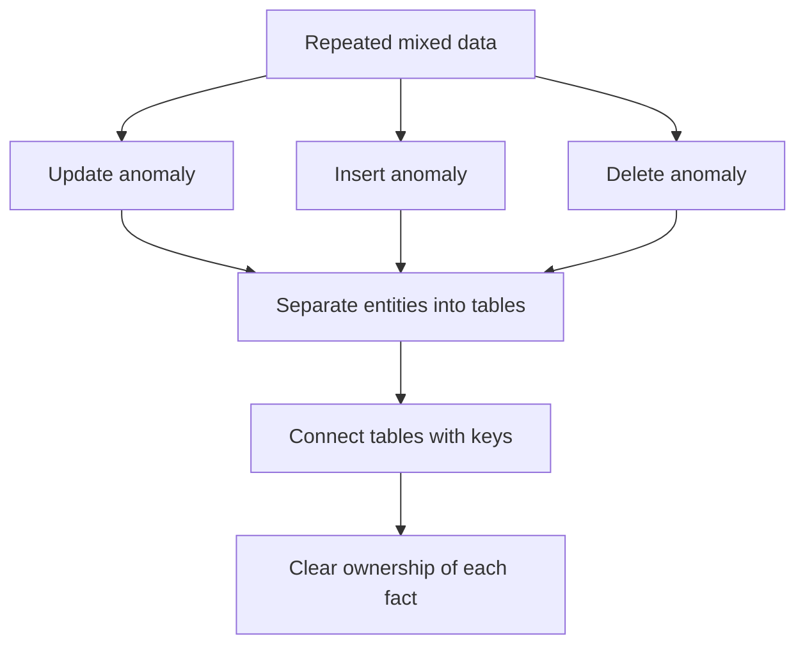
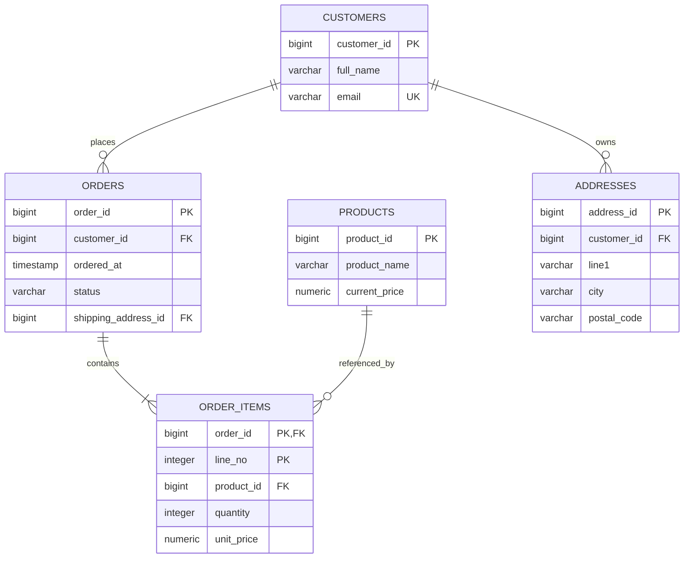
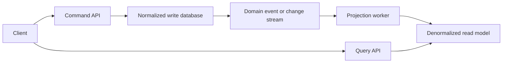
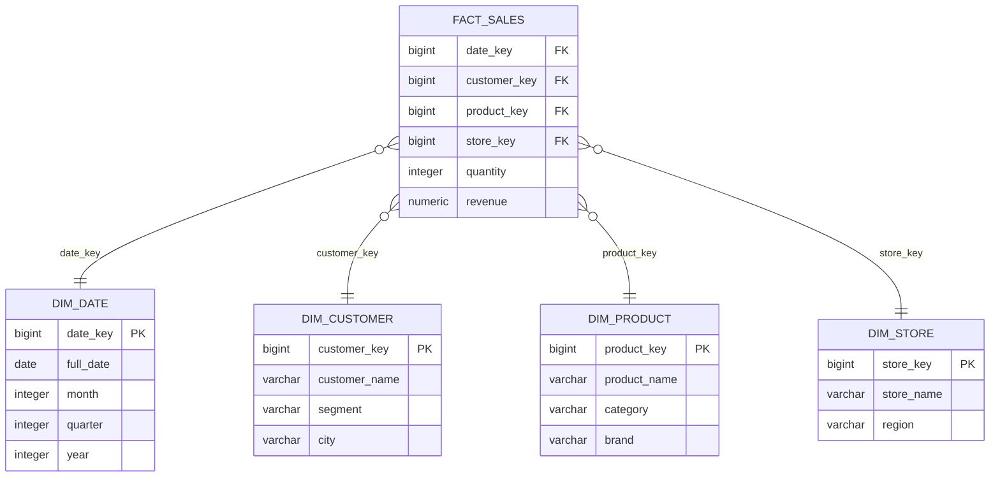
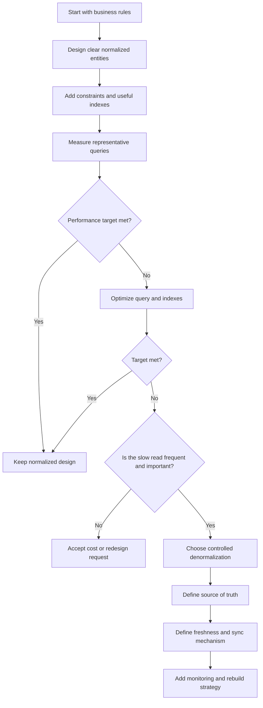

# Normalization vs Denormalization in Databases

> A practical, interview-focused guide for developers working with relational databases and SQL.

---

## Table of Contents

1. [Overview](#1-overview)
2. [The Core Idea](#2-the-core-idea)
3. [Why Database Design Matters](#3-why-database-design-matters)
4. [Data Anomalies](#4-data-anomalies)
5. [Keys and Functional Dependencies](#5-keys-and-functional-dependencies)
6. [Normalization](#6-normalization)
   - [First Normal Form — 1NF](#61-first-normal-form--1nf)
   - [Second Normal Form — 2NF](#62-second-normal-form--2nf)
   - [Third Normal Form — 3NF](#63-third-normal-form--3nf)
   - [BCNF](#64-boyce-codd-normal-form--bcnf)
   - [Higher Normal Forms](#65-higher-normal-forms)
7. [End-to-End Normalization Example](#7-end-to-end-normalization-example)
8. [Denormalization](#8-denormalization)
9. [Common Denormalization Techniques](#9-common-denormalization-techniques)
10. [Normalization vs Denormalization](#10-normalization-vs-denormalization)
11. [OLTP vs Analytics](#11-oltp-vs-analytics)
12. [Performance Considerations](#12-performance-considerations)
13. [Maintaining Consistency in Denormalized Data](#13-maintaining-consistency-in-denormalized-data)
14. [How to Choose](#14-how-to-choose)
15. [Practical Architecture Patterns](#15-practical-architecture-patterns)
16. [Best-Practice Checklist](#16-best-practice-checklist)
17. [Key Takeaways](#17-key-takeaways)
18. [References](#18-references)

---

# 1. Overview

**Normalization** and **denormalization** are two database-design approaches used to balance:

- Data correctness
- Storage efficiency
- Write simplicity
- Read performance
- Query complexity
- Operational scalability

Normalization organizes data so that each fact is stored in the most appropriate place, usually only once. Denormalization intentionally stores some repeated or precomputed data to make important reads faster or simpler.

Neither approach is universally better.

A healthy production system often uses:

- A **normalized transactional model** as the source of truth
- Carefully selected **denormalized read models**, summary tables, caches, or materialized views for expensive read paths

---

# 2. The Core Idea

## 2.1 Normalization

Normalization divides data into related tables and connects them using keys.

Its main goals are:

- Reduce unnecessary duplication
- Prevent inconsistent values
- Avoid insert, update, and delete anomalies
- Make data ownership clear
- Improve long-term maintainability

```text
Store each business fact in one logical place.
```

For example, a customer's email belongs in the `customers` table rather than being copied into every order row.

## 2.2 Denormalization

Denormalization intentionally introduces redundancy or precomputed values.

Its main goals are:

- Reduce joins
- Avoid repeated calculations
- Improve read latency
- Simplify reporting queries
- Support high-volume read workloads

```text
Duplicate or precompute selected data when the performance benefit justifies the consistency cost.
```

For example, an analytics table may store `customer_name`, `product_category`, and `daily_revenue` together so that a dashboard does not need several joins and aggregations on every request.

## 2.3 Simple Comparison



---

# 3. Why Database Design Matters

Poor table design can work with a small dataset and still become a serious problem later.

Consider a single table that stores orders, customers, and products together:

| order_id | customer_name | customer_email | product_name | unit_price | quantity |
|---:|---|---|---|---:|---:|
| 1001 | Asha Patel | asha@example.com | Keyboard | 60.00 | 1 |
| 1001 | Asha Patel | asha@example.com | Mouse | 25.00 | 2 |
| 1002 | Ravi Shah | ravi@example.com | Keyboard | 60.00 | 1 |

This design duplicates:

- Customer information for every purchased item
- Product information for every order containing that product

It creates several questions:

- What happens when Asha changes her email?
- What happens when the keyboard's current price changes?
- Can a product exist before it is ordered?
- What happens to product information if its last order is deleted?

Normalization gives each business entity a clear home.

---

# 4. Data Anomalies

An **anomaly** is an unexpected data problem caused by the way information is stored.

## 4.1 Update Anomaly

The same fact appears in multiple rows, but only some copies are updated.

```text
Before:
Order 1001 -> asha@example.com
Order 1005 -> asha@example.com
Order 1012 -> asha@example.com

Only one row is updated:
Order 1001 -> asha.patel@example.com
Order 1005 -> asha@example.com
Order 1012 -> asha@example.com
```

The database now contains conflicting email addresses for the same customer.

## 4.2 Insert Anomaly

A fact cannot be stored until an unrelated fact exists.

Example: A new product cannot be inserted because the table requires an `order_id`, even though nobody has purchased the product yet.

## 4.3 Delete Anomaly

Deleting one fact unintentionally removes another fact.

Example: Deleting the last order containing a product also removes the only stored copy of that product's name and price.

## 4.4 How Normalization Helps



---

# 5. Keys and Functional Dependencies

Normalization is based on relationships between attributes, not only on splitting large tables.

## 5.1 Primary Key

A **primary key** uniquely identifies a row.

```sql
CREATE TABLE customers (
    customer_id BIGINT PRIMARY KEY,
    full_name   VARCHAR(150) NOT NULL,
    email       VARCHAR(320) NOT NULL UNIQUE
);
```

Here, `customer_id` uniquely identifies each customer.

## 5.2 Candidate Key

A **candidate key** is any minimal set of columns that can uniquely identify a row.

For `customers`, possible candidate keys may be:

- `customer_id`
- `email`, when the business guarantees email uniqueness

One candidate key is selected as the primary key. Other candidate keys are normally protected with `UNIQUE` constraints.

## 5.3 Composite Key

A **composite key** uses multiple columns.

```sql
CREATE TABLE order_items (
    order_id   BIGINT NOT NULL,
    line_no    INTEGER NOT NULL,
    product_id BIGINT NOT NULL,
    quantity   INTEGER NOT NULL,
    PRIMARY KEY (order_id, line_no)
);
```

The combination `(order_id, line_no)` uniquely identifies an order line.

## 5.4 Functional Dependency

A functional dependency is written as:

```text
X -> Y
```

It means that a value of `X` determines exactly one value of `Y`.

Examples:

```text
customer_id -> customer_name, customer_email
product_id  -> product_name, current_price
order_id    -> customer_id, ordered_at, status
```

Functional dependencies help identify which columns belong together.

## 5.5 Determinant

The left side of a functional dependency is called the **determinant**.

In:

```text
product_id -> product_name
```

`product_id` is the determinant.

A strong normalized design ensures that important determinants are represented by candidate keys or are separated into appropriate tables.

---

# 6. Normalization

Normalization is usually applied as a sequence of normal forms.

Each normal form adds rules to reduce a particular kind of dependency problem.

For most day-to-day application design, developers should understand:

- 1NF
- 2NF
- 3NF
- The purpose of BCNF

Third Normal Form is a common practical target for transactional systems, although the correct design still depends on the domain and workload.

---

## 6.1 First Normal Form — 1NF

A table is in **First Normal Form** when:

- Each row is uniquely identifiable
- Each column stores one value for that row
- Repeating groups are removed
- Similar values are stored as rows rather than numbered columns

### Not in 1NF

```text
orders
+----------+-----------+-------------+-------------+-------------+
| order_id | customer  | product_1   | product_2   | product_3   |
+----------+-----------+-------------+-------------+-------------+
| 1001     | Asha      | Keyboard    | Mouse       | NULL        |
+----------+-----------+-------------+-------------+-------------+
```

Problems:

- The number of products is artificially limited
- Adding `product_4` requires a schema change
- Queries must inspect multiple product columns
- Product data cannot be constrained consistently

### 1NF Design

```text
orders
+----------+-------------+
| order_id | customer_id |
+----------+-------------+
| 1001     | 10          |
+----------+-------------+

order_items
+----------+---------+------------+
| order_id | line_no | product_id |
+----------+---------+------------+
| 1001     | 1       | 501        |
| 1001     | 2       | 502        |
+----------+---------+------------+
```

### SQL

```sql
CREATE TABLE orders (
    order_id    BIGINT PRIMARY KEY,
    customer_id BIGINT NOT NULL
);

CREATE TABLE order_items (
    order_id   BIGINT NOT NULL,
    line_no    INTEGER NOT NULL,
    product_id BIGINT NOT NULL,
    quantity   INTEGER NOT NULL CHECK (quantity > 0),
    PRIMARY KEY (order_id, line_no),
    FOREIGN KEY (order_id) REFERENCES orders(order_id)
);
```

### Practical Meaning

1NF does **not** mean that every value must be a string or that JSON is always forbidden. It means the table should have a clear relational structure and the database should not hide repeated business facts inside numbered columns or ambiguous multi-value fields.

A JSON column can be reasonable for optional, document-like attributes. It is usually a poor replacement for relational rows when individual elements must be joined, constrained, indexed, or updated independently.

---

## 6.2 Second Normal Form — 2NF

A table is in **Second Normal Form** when:

- It is already in 1NF
- Every non-key column depends on the **entire** candidate key
- There are no partial dependencies on only part of a composite key

> 2NF mainly matters when a table has a composite candidate key.

### Partial Dependency Example

Suppose the primary key is `(order_id, product_id)`:

| order_id | product_id | product_name | quantity |
|---:|---:|---|---:|
| 1001 | 501 | Keyboard | 1 |
| 1001 | 502 | Mouse | 2 |
| 1002 | 501 | Keyboard | 1 |

Dependencies:

```text
(order_id, product_id) -> quantity
product_id             -> product_name
```

`product_name` depends only on `product_id`, not on the whole composite key. Therefore, the table violates 2NF.

### 2NF Design

```sql
CREATE TABLE products (
    product_id   BIGINT PRIMARY KEY,
    product_name VARCHAR(200) NOT NULL
);

CREATE TABLE order_items (
    order_id   BIGINT NOT NULL,
    product_id BIGINT NOT NULL,
    quantity   INTEGER NOT NULL CHECK (quantity > 0),
    PRIMARY KEY (order_id, product_id),
    FOREIGN KEY (product_id) REFERENCES products(product_id)
);
```

Now:

```text
product_id             -> product_name
(order_id, product_id) -> quantity
```

Each fact is stored in the table whose key determines it.

---

## 6.3 Third Normal Form — 3NF

A table is in **Third Normal Form** when:

- It is already in 2NF
- Non-key columns do not depend transitively on the key through another non-key column

A common memory aid is:

```text
Every non-key attribute should depend on:
1. The key
2. The whole key
3. Nothing but the key
```

The phrase is useful for intuition, but actual normalization should still be based on functional dependencies and business rules.

### Transitive Dependency Example

Consider:

| order_id | customer_id | customer_name | customer_email | ordered_at |
|---:|---:|---|---|---|
| 1001 | 10 | Asha Patel | asha@example.com | 2026-07-20 |
| 1002 | 10 | Asha Patel | asha@example.com | 2026-07-21 |

Dependencies:

```text
order_id    -> customer_id, ordered_at
customer_id -> customer_name, customer_email
```

Therefore:

```text
order_id -> customer_id -> customer_name, customer_email
```

Customer details are transitively dependent on `order_id`. They belong in the `customers` table.

### 3NF Design

```sql
CREATE TABLE customers (
    customer_id BIGINT PRIMARY KEY,
    full_name   VARCHAR(150) NOT NULL,
    email       VARCHAR(320) NOT NULL UNIQUE
);

CREATE TABLE orders (
    order_id    BIGINT PRIMARY KEY,
    customer_id BIGINT NOT NULL,
    ordered_at  TIMESTAMP NOT NULL,
    FOREIGN KEY (customer_id) REFERENCES customers(customer_id)
);
```

### Important Domain Nuance

Normalization depends on what a column **means**.

For example:

- `customers.email` represents the customer's current email
- `orders.customer_email_snapshot` may represent the email used when the order was placed

These are different business facts. Storing both is not necessarily accidental duplication.

The snapshot value can be valid denormalization when historical accuracy requires it.

---

## 6.4 Boyce-Codd Normal Form — BCNF

BCNF is stricter than 3NF.

A relation is in BCNF when:

```text
For every non-trivial dependency X -> Y, X must be a superkey.
```

In simpler language:

> Every determinant must be capable of uniquely identifying a row.

Most straightforward application tables that are correctly designed in 3NF will also satisfy BCNF. Differences appear in less common designs containing overlapping candidate keys and unusual business constraints.

### Conceptual Example

Assume these business rules:

- A student can take multiple subjects
- Each subject is taught by one instructor
- An instructor teaches only one subject

A table containing:

```text
(student_id, subject, instructor)
```

may have dependencies such as:

```text
(student_id, subject) -> instructor
instructor            -> subject
```

`instructor` determines `subject`, but `instructor` may not uniquely identify the entire row because many students can have the same instructor. This indicates a BCNF issue and suggests separating the instructor-to-subject assignment.

BCNF is valuable when multiple candidate keys or unusual determinants are present.

---

## 6.5 Higher Normal Forms

Higher normal forms address more specialized dependency patterns.

| Normal form | Main concern | Typical relevance |
|---|---|---|
| 4NF | Independent multi-valued dependencies | Tables mixing two unrelated one-to-many relationships |
| 5NF | Join dependencies | Complex decompositions where facts can be reconstructed from smaller relations |
| 6NF | Extremely fine-grained temporal decomposition | Specialized temporal or analytical systems |

### 4NF Intuition

Suppose a consultant can have:

- Multiple skills
- Multiple office locations

If skills and locations are independent, storing every combination creates artificial multiplication:

| consultant_id | skill | office |
|---:|---|---|
| 7 | Python | Ahmedabad |
| 7 | Python | Mumbai |
| 7 | SQL | Ahmedabad |
| 7 | SQL | Mumbai |

A better design is:

```text
consultant_skills(consultant_id, skill)
consultant_offices(consultant_id, office)
```

This separates two independent multi-valued facts.

For normal application development, 3NF or BCNF is usually enough. Higher forms are useful when the domain naturally contains more complex dependencies.

---

# 7. End-to-End Normalization Example

Consider an unnormalized order record:

```text
order_id: 1001
customer: Asha Patel
email: asha@example.com
products: Keyboard x 1, Mouse x 2
shipping_city: Ahmedabad
```

## 7.1 Unnormalized Table

```sql
CREATE TABLE order_data_bad (
    order_id       BIGINT PRIMARY KEY,
    customer_name  VARCHAR(150),
    customer_email VARCHAR(320),
    product_1      VARCHAR(200),
    quantity_1     INTEGER,
    product_2      VARCHAR(200),
    quantity_2     INTEGER,
    shipping_city  VARCHAR(100)
);
```

This table mixes:

- Customer facts
- Order facts
- Address facts
- Product facts
- Order-line facts

## 7.2 Move Repeating Products to Rows — 1NF

```text
orders(order_id, customer_name, customer_email, shipping_city)
order_items(order_id, product_id, product_name, quantity)
```

The repeating product columns are gone.

## 7.3 Remove Partial Dependencies — 2NF

In `order_items`, `product_name` depends on `product_id`, not on the whole order-line key.

Move product facts into `products`:

```text
products(product_id, product_name, current_price)
order_items(order_id, line_no, product_id, quantity, unit_price)
```

## 7.4 Remove Transitive Dependencies — 3NF

Customer details depend on `customer_id`, not directly on `order_id`.

Final core model:



## 7.5 SQL Schema

```sql
CREATE TABLE customers (
    customer_id BIGINT GENERATED ALWAYS AS IDENTITY PRIMARY KEY,
    full_name   VARCHAR(150) NOT NULL,
    email       VARCHAR(320) NOT NULL UNIQUE
);

CREATE TABLE addresses (
    address_id  BIGINT GENERATED ALWAYS AS IDENTITY PRIMARY KEY,
    customer_id BIGINT NOT NULL,
    line1       VARCHAR(200) NOT NULL,
    city        VARCHAR(100) NOT NULL,
    postal_code VARCHAR(20) NOT NULL,
    FOREIGN KEY (customer_id) REFERENCES customers(customer_id)
);

CREATE TABLE products (
    product_id    BIGINT GENERATED ALWAYS AS IDENTITY PRIMARY KEY,
    product_name  VARCHAR(200) NOT NULL,
    current_price NUMERIC(12, 2) NOT NULL CHECK (current_price >= 0)
);

CREATE TABLE orders (
    order_id            BIGINT GENERATED ALWAYS AS IDENTITY PRIMARY KEY,
    customer_id         BIGINT NOT NULL,
    shipping_address_id BIGINT NOT NULL,
    ordered_at          TIMESTAMP NOT NULL DEFAULT CURRENT_TIMESTAMP,
    status              VARCHAR(30) NOT NULL,
    FOREIGN KEY (customer_id) REFERENCES customers(customer_id),
    FOREIGN KEY (shipping_address_id) REFERENCES addresses(address_id)
);

CREATE TABLE order_items (
    order_id   BIGINT NOT NULL,
    line_no    INTEGER NOT NULL,
    product_id BIGINT NOT NULL,
    quantity   INTEGER NOT NULL CHECK (quantity > 0),
    unit_price NUMERIC(12, 2) NOT NULL CHECK (unit_price >= 0),
    PRIMARY KEY (order_id, line_no),
    FOREIGN KEY (order_id) REFERENCES orders(order_id),
    FOREIGN KEY (product_id) REFERENCES products(product_id)
);
```

## 7.6 Why `unit_price` Belongs in `order_items`

At first glance, storing both:

```text
products.current_price
order_items.unit_price
```

may look redundant.

They represent different facts:

- `products.current_price`: the price currently offered
- `order_items.unit_price`: the price charged for this specific order line

When the product price changes tomorrow, historical orders must not change. Therefore, `unit_price` is a valid transaction snapshot, not a normalization error.

## 7.7 Querying the Normalized Model

```sql
SELECT
    o.order_id,
    o.ordered_at,
    c.full_name,
    p.product_name,
    oi.quantity,
    oi.unit_price,
    oi.quantity * oi.unit_price AS line_total
FROM orders AS o
JOIN customers AS c
    ON c.customer_id = o.customer_id
JOIN order_items AS oi
    ON oi.order_id = o.order_id
JOIN products AS p
    ON p.product_id = oi.product_id
WHERE o.order_id = 1001
ORDER BY oi.line_no;
```

The query contains joins, but the model gives each fact one clear owner and preserves consistency.

---

# 8. Denormalization

Denormalization intentionally stores derived, copied, or combined data to optimize a known workload.

It should normally happen **after**:

1. The correct normalized model is understood
2. The slow query or workload is measured
3. Indexes and query improvements are considered
4. The consistency model is explicitly defined

## 8.1 Why Denormalize?

Common reasons include:

- A dashboard repeatedly joins large tables
- Aggregations scan millions of rows
- Read latency is more important than immediate consistency
- A distributed service cannot perform cross-service joins efficiently
- Historical snapshots must remain unchanged
- Analytics tools work better with star-schema or flattened data
- A public API needs a stable read representation

## 8.2 What Denormalization Costs

Denormalization introduces additional responsibilities:

- More storage
- More complex writes
- Synchronization logic
- Risk of stale data
- Possible conflicting values
- Backfill and rebuild procedures
- More operational monitoring

The central trade-off is:

```text
Faster or simpler reads
            vs
More expensive consistency management
```

## 8.3 Controlled vs Accidental Duplication

**Controlled denormalization** has:

- A documented source of truth
- A clear refresh or synchronization mechanism
- Defined acceptable staleness
- Tests and monitoring
- A rebuild strategy

**Accidental duplication** has:

- Multiple writable copies
- No clear owner
- No consistency rule
- Manual correction when values disagree

The first can be a sound architecture. The second becomes technical debt.

---

# 9. Common Denormalization Techniques

## 9.1 Copying Frequently Read Attributes

A read-heavy order list may store a customer-name snapshot:

```sql
ALTER TABLE orders
ADD COLUMN customer_name_snapshot VARCHAR(150);
```

Possible purposes:

- Avoid a join in a critical read path
- Preserve the name shown when the order was placed
- Keep order history independent of later profile changes

The business meaning must be explicit. Is it:

- A historical snapshot that should never change?
- A cached copy that should follow the customer record?

These require different update rules.

---

## 9.2 Storing Precomputed Totals

Without denormalization:

```sql
SELECT
    order_id,
    SUM(quantity * unit_price) AS total_amount
FROM order_items
WHERE order_id = 1001
GROUP BY order_id;
```

Denormalized design:

```sql
ALTER TABLE orders
ADD COLUMN total_amount NUMERIC(14, 2) NOT NULL DEFAULT 0;
```

Benefits:

- Fast order-list queries
- Fast sorting by total
- Less repeated aggregation

Costs:

- Every insert, update, or deletion of an order item must update the total
- Concurrent updates must be handled transactionally
- A repair job may be needed if values drift

A safe transaction can update both the line and total together:

```sql
BEGIN;

INSERT INTO order_items (
    order_id,
    line_no,
    product_id,
    quantity,
    unit_price
)
VALUES (1001, 3, 503, 1, 40.00);

UPDATE orders
SET total_amount = total_amount + 40.00
WHERE order_id = 1001;

COMMIT;
```

The exact approach depends on whether line items can later be edited, deleted, discounted, taxed, or refunded.

---

## 9.3 Summary Tables

A dashboard may require daily sales totals:

```sql
CREATE TABLE daily_sales_summary (
    sales_date       DATE PRIMARY KEY,
    order_count      BIGINT NOT NULL,
    gross_revenue    NUMERIC(16, 2) NOT NULL,
    average_order_value NUMERIC(16, 2) NOT NULL,
    refreshed_at     TIMESTAMP NOT NULL
);
```

Instead of scanning all orders for every page load, a scheduled process updates the summary.

This works well when:

- The dashboard tolerates delayed data
- The metric definition is stable
- Raw transactions remain the source of truth

---

## 9.4 Materialized Views

A normal view stores a query definition and executes the underlying query when accessed. A materialized view stores the query result and can be refreshed later.

```sql
CREATE MATERIALIZED VIEW product_sales_summary AS
SELECT
    oi.product_id,
    p.product_name,
    SUM(oi.quantity) AS units_sold,
    SUM(oi.quantity * oi.unit_price) AS revenue
FROM order_items AS oi
JOIN products AS p
    ON p.product_id = oi.product_id
GROUP BY oi.product_id, p.product_name;
```

Add an index for lookup performance:

```sql
CREATE UNIQUE INDEX product_sales_summary_product_id_idx
    ON product_sales_summary (product_id);
```

Refresh when appropriate:

```sql
REFRESH MATERIALIZED VIEW product_sales_summary;
```

Materialized views are useful when:

- The source query is expensive
- Results are read frequently
- Some staleness is acceptable
- Rebuilding or refreshing has a manageable cost

They are less suitable when every request requires fully current data and refresh overhead is high.

---

## 9.5 Read Models and CQRS

In Command Query Responsibility Segregation, writes and reads use different models.



The write model focuses on:

- Business rules
- Transactions
- Referential integrity
- Correct state changes

The read model focuses on:

- Fast lookup
- API-specific response shapes
- Search
- Sorting and filtering
- Prejoined or precomputed data

This approach is powerful but adds eventual consistency, event handling, replay, monitoring, and operational complexity. It should be used when the workload justifies it.

---

## 9.6 Star Schema

Analytics systems commonly use a star schema:



Dimension tables intentionally group descriptive attributes that may have been spread across several normalized operational tables.

This makes analytical queries easier:

```sql
SELECT
    d.year,
    p.category,
    SUM(f.revenue) AS revenue
FROM fact_sales AS f
JOIN dim_date AS d
    ON d.date_key = f.date_key
JOIN dim_product AS p
    ON p.product_key = f.product_key
GROUP BY d.year, p.category
ORDER BY d.year, revenue DESC;
```

A star schema is not usually a replacement for the transactional database. It is a workload-specific model populated from operational sources.

---

## 9.7 Caches and Search Indexes

Not all denormalized data must live in the main relational database.

Examples:

- Redis object cache
- Elasticsearch/OpenSearch document index
- API response cache
- Data warehouse tables
- Key-value read store

A search document may combine:

```json
{
  "product_id": 501,
  "name": "Mechanical Keyboard",
  "category": "Accessories",
  "brand": "ExampleTech",
  "average_rating": 4.6,
  "available_stock": 82
}
```

This structure is excellent for search and filtering, but the relational database may remain the authoritative system for product and inventory updates.

---

# 10. Normalization vs Denormalization

| Area | Normalization | Denormalization |
|---|---|---|
| Main objective | Correctness and maintainability | Read speed and query simplicity |
| Data duplication | Minimized | Intentionally introduced |
| Data consistency | Easier to enforce | Requires synchronization |
| Write operations | Usually simpler and localized | May update multiple representations |
| Read operations | May require joins and aggregation | Often fewer joins and calculations |
| Storage usage | Usually lower | Usually higher |
| Schema clarity | Strong entity boundaries | Workload-specific shapes |
| Update anomalies | Reduced | Possible when controls are weak |
| Best fit | OLTP and source-of-truth data | Reporting, analytics, caches, read models |
| Freshness | Usually immediate | May be immediate or eventually consistent |
| Recovery | Restore authoritative tables | May require projection rebuilds or refreshes |

## 10.1 The Practical Balance

A common production arrangement is:

```text
Normalized transactional schema
        |
        +--> indexes for common queries
        |
        +--> views for reusable query logic
        |
        +--> materialized views for expensive reads
        |
        +--> summary tables for dashboards
        |
        +--> search index for full-text search
        |
        +--> warehouse/star schema for analytics
```

The normalized model protects the meaning of the data. Denormalized models optimize specific access patterns.

---

# 11. OLTP vs Analytics

## 11.1 OLTP Systems

Online Transaction Processing systems handle operational activities such as:

- Creating an order
- Updating inventory
- Recording a payment
- Changing an account setting
- Booking a ticket

Typical characteristics:

- Many small reads and writes
- Strong transaction requirements
- Concurrent users
- Low-latency point lookups
- Frequent state changes

A normalized model is generally a strong starting point.

## 11.2 Analytical Systems

Analytical workloads include:

- Revenue dashboards
- Cohort analysis
- Trend reporting
- Business intelligence
- Machine-learning feature extraction

Typical characteristics:

- Fewer writes
- Large scans
- Aggregations over many rows
- Historical analysis
- Dimension-based grouping

Denormalized star schemas, columnar stores, materialized views, and summary tables are common.

## 11.3 Hybrid Systems

Modern applications frequently contain both workloads.

Avoid forcing one physical model to serve every need.


The transactional database handles correct writes. The analytical platform handles large read workloads without overloading production transactions.

---

# 12. Performance Considerations

## 12.1 More Joins Do Not Automatically Mean Bad Design

A join is a normal relational operation. Modern database engines can execute well-indexed joins efficiently.

A normalized schema should not be flattened only because a query contains three or four joins.

Before denormalizing, inspect:

- Query execution plan
- Row counts and selectivity
- Missing or unsuitable indexes
- Unnecessary columns
- Filters applied too late
- Large sorts or hash operations
- Repeated queries that could be cached
- Network and application-level N+1 queries

## 12.2 Index Foreign Keys and Access Paths Appropriately

Example indexes:

```sql
CREATE INDEX orders_customer_id_idx
    ON orders (customer_id);

CREATE INDEX order_items_product_id_idx
    ON order_items (product_id);

CREATE INDEX orders_customer_date_idx
    ON orders (customer_id, ordered_at DESC);
```

Indexes improve many reads but add storage and write overhead. They should match real query patterns.

## 12.3 Select Only Required Columns

Avoid unnecessary data transfer:

```sql
-- Less efficient when the application needs only three columns
SELECT *
FROM orders;

-- Better aligned with the use case
SELECT order_id, ordered_at, status
FROM orders
WHERE customer_id = 10
ORDER BY ordered_at DESC;
```

## 12.4 Use Execution Plans

In PostgreSQL-compatible syntax:

```sql
EXPLAIN ANALYZE
SELECT
    o.order_id,
    c.full_name,
    SUM(oi.quantity * oi.unit_price) AS total_amount
FROM orders AS o
JOIN customers AS c
    ON c.customer_id = o.customer_id
JOIN order_items AS oi
    ON oi.order_id = o.order_id
WHERE o.ordered_at >= TIMESTAMP '2026-07-01 00:00:00'
GROUP BY o.order_id, c.full_name;
```

Measure before changing the schema. The actual bottleneck may be a missing index, inaccurate statistics, an oversized result set, or application behavior rather than normalization itself.

## 12.5 Compare Total System Cost

A denormalized read may be faster, but evaluate the full cost:

```text
Read benefit
- Lower query latency
- Fewer joins
- Less CPU per request

Write and operational cost
- More write operations
- Synchronization jobs
- Event processing
- Rebuild procedures
- Drift detection
- Additional tests and alerts
```

A local query optimization can create global system complexity.

---

# 13. Maintaining Consistency in Denormalized Data

When the same logical fact exists in multiple places, decide which copy is authoritative.

## 13.1 Single Source of Truth

Example:

```text
Authoritative value: customers.full_name
Read projection: customer_order_summary.customer_name
```

Only the authoritative value should normally be edited directly.

## 13.2 Same-Transaction Updates

Use one database transaction when all copies live in the same database and must remain immediately consistent.

```sql
BEGIN;

UPDATE customers
SET full_name = 'Asha P. Patel'
WHERE customer_id = 10;

UPDATE customer_order_summary
SET customer_name = 'Asha P. Patel'
WHERE customer_id = 10;

COMMIT;
```

This provides strong consistency but increases coupling and write work.

## 13.3 Database Triggers

A trigger can update derived data automatically.

Advantages:

- Runs close to the data
- Covers writes from multiple applications
- Can preserve atomicity

Trade-offs:

- Hidden write behavior
- Harder debugging
- Risk of complex trigger chains
- Database-specific implementation

Use triggers for focused invariants, not as an invisible application layer.

## 13.4 Asynchronous Events

A service writes authoritative data and publishes an event:

```json
{
  "event_type": "CustomerNameChanged",
  "customer_id": 10,
  "new_name": "Asha P. Patel",
  "occurred_at": "2026-07-27T10:30:00Z"
}
```

Projection consumers update denormalized read models.

This provides scalability and service independence, but introduces eventual consistency.

The implementation should address:

- Idempotency
- Duplicate events
- Event ordering
- Retry and dead-letter handling
- Schema evolution
- Projection rebuilds
- Observability

## 13.5 Scheduled Refresh

For dashboards, a periodic refresh may be enough:

```text
Every 15 minutes:
1. Recompute daily metrics
2. Replace or upsert summary rows
3. Record refreshed_at
4. Alert if refresh fails
```

The UI should expose freshness when it matters.

## 13.6 Reconciliation

For important derived values, run a comparison job:

```sql
SELECT
    o.order_id,
    o.total_amount AS stored_total,
    SUM(oi.quantity * oi.unit_price) AS calculated_total
FROM orders AS o
JOIN order_items AS oi
    ON oi.order_id = o.order_id
GROUP BY o.order_id, o.total_amount
HAVING o.total_amount <> SUM(oi.quantity * oi.unit_price);
```

This detects drift between stored totals and source rows.

---

# 14. How to Choose

Use a workload-driven process rather than choosing from theory alone.



## 14.1 Prefer Normalization When

- Data changes frequently
- Strong consistency is required
- Multiple workflows update the same entities
- Business rules are still evolving
- Storage duplication would be large
- The database is the authoritative transactional system
- Joins perform acceptably with proper indexes

## 14.2 Consider Denormalization When

- A measured read path is too slow
- The same expensive aggregation runs repeatedly
- Read volume is much higher than write volume
- Some staleness is acceptable
- Cross-service joins are impractical
- A stable API or search document needs a flattened shape
- Analytics requires dimension-oriented modeling
- Historical snapshots are business requirements

## 14.3 Questions to Answer Before Denormalizing

1. What exact query or workload is slow?
2. What latency or throughput target must be met?
3. Is the query plan understood?
4. Can an index, partitioning strategy, cache, or query rewrite solve it?
5. Which table remains the source of truth?
6. How stale may the copy become?
7. How will updates be propagated?
8. How will failures and retries work?
9. Can the denormalized representation be rebuilt?
10. How will drift be detected?

---

# 15. Practical Architecture Patterns

## 15.1 Normalized Core with Indexed Queries

Use when the relational database can meet the workload directly.

```text
API -> normalized tables -> indexed joins -> response
```

This is the simplest option operationally and should be the default starting point for many applications.

## 15.2 Normalized Core with Materialized Reporting View

Use when an expensive report can tolerate refresh delay.

```text
Normalized tables -> materialized view -> reporting API
```

Good for:

- Product sales summaries
- Monthly account totals
- Leaderboards
- Dashboard widgets

## 15.3 Normalized Core with Cache

Use when the same data is requested repeatedly and invalidation is manageable.

```text
Request -> cache
           | miss
           v
      normalized database
```

The database schema remains correct while the cache absorbs repeated reads.

## 15.4 Transactional Database with Search Index

Use when search requirements exceed normal relational lookup patterns.

```text
Normalized database -> change stream -> search index
Application search ------------------> search index
```

Good for:

- Full-text search
- Faceted filtering
- Typo tolerance
- Ranking

The search index is a projection, not normally the transaction authority.

## 15.5 Operational Database with Analytics Warehouse

Use when production transactions and business intelligence have very different workload shapes.

```text
OLTP database -> CDC/ETL -> warehouse -> star schema -> BI
```

This prevents analytical scans from competing with customer-facing transactions.

## 15.6 Microservice-Owned Data with API Composition

Each service owns a normalized model for its domain:

```text
Customer Service -> customer data
Order Service    -> order data
Catalog Service  -> product data
```

A gateway may compose results for low-volume requests. For high-volume reads, an event-driven denormalized projection may be more efficient.

The key rule is that ownership must remain clear. A copied customer name in the order read model does not make the Order Service the authoritative owner of customer identity.

---

# 16. Best-Practice Checklist

## Data Modeling

- Define entities from business meaning, not from one UI screen
- Give every table a stable key
- Use foreign keys where the architecture allows them
- Protect candidate keys with `UNIQUE` constraints
- Use `NOT NULL`, `CHECK`, and appropriate data types
- Separate current values from historical snapshots
- Normalize transactional data to a practical level, commonly 3NF

## Query and Performance Work

- Test with realistic data volume and distribution
- Inspect execution plans
- Index actual filter, join, and ordering patterns
- Avoid selecting unused columns
- Remove application-level N+1 queries
- Cache repeated reads before redesigning the source model unnecessarily

## Denormalization

- Denormalize for a measured and important workload
- Document the source of truth
- Define maximum acceptable staleness
- Prefer one-way projection from authority to read model
- Make consumers idempotent when using events
- Provide a refresh or rebuild procedure
- Monitor lag, failures, and drift
- Keep derived columns semantically clear with names such as `*_snapshot`, `*_cached`, or `*_total`

---

# 17. Key Takeaways

1. **Normalization protects correctness.** It reduces duplication and prevents update, insert, and delete anomalies.

2. **1NF removes repeating groups.** Store repeating business facts as rows, not numbered columns.

3. **2NF removes partial dependencies.** A non-key attribute must depend on the whole composite key.

4. **3NF removes transitive dependencies.** Non-key facts should not depend on other non-key facts.

5. **Denormalization is intentional optimization.** It trades simpler or faster reads for additional consistency and operational work.

6. **Joins are not automatically a problem.** First measure query plans and add suitable indexes.

7. **A duplicated value may represent a different fact.** `current_price` and `price_at_purchase` are not interchangeable.

8. **Keep a clear source of truth.** Denormalized copies should usually be projections, snapshots, summaries, or caches.

9. **Use different models for different workloads.** A normalized OLTP schema and a denormalized analytical schema can coexist.

10. **Choose based on evidence.** Start with correctness, measure real workloads, and denormalize only where the benefit justifies the complexity.

---

# 18. References

The concepts and implementation notes in this guide align with current official database and architecture documentation available in July 2026:

1. [Microsoft Learn — Description of database normalization basics](https://learn.microsoft.com/en-us/office/troubleshoot/access/database-normalization-description)
2. [Oracle Database Data Warehousing Guide — Data warehouse logical design](https://docs.oracle.com/en/database/oracle/oracle-database/26/dwhsg/data-warehouse-logical-design.html)
3. [PostgreSQL 18 Documentation — Data Definition](https://www.postgresql.org/docs/current/ddl.html)
4. [PostgreSQL 18 Documentation — Indexes](https://www.postgresql.org/docs/current/indexes.html)
5. [PostgreSQL 18 Documentation — Materialized Views](https://www.postgresql.org/docs/current/rules-materializedviews.html)
6. [PostgreSQL 18 Documentation — CREATE MATERIALIZED VIEW](https://www.postgresql.org/docs/current/sql-creatematerializedview.html)
7. [Microsoft Learn — CQRS pattern](https://learn.microsoft.com/en-us/azure/architecture/patterns/cqrs)
8. [Microsoft Learn — Star schema guidance](https://learn.microsoft.com/en-us/power-bi/guidance/star-schema)

---

> **Final perspective:** Normalize to model the truth clearly. Denormalize to serve a proven workload efficiently. The strongest database designs do both deliberately.
