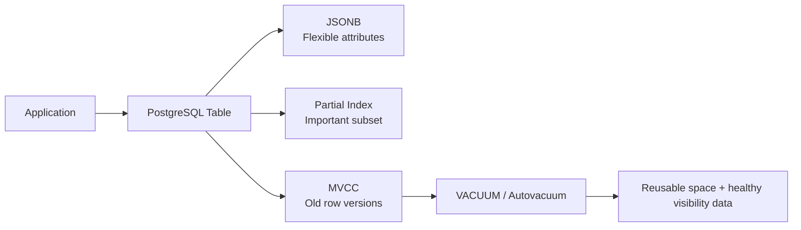
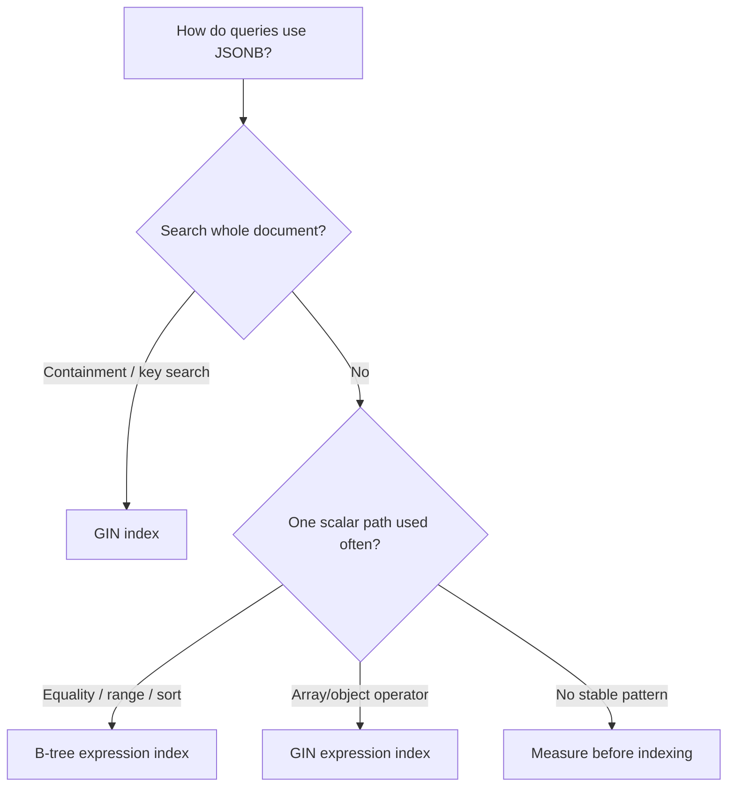
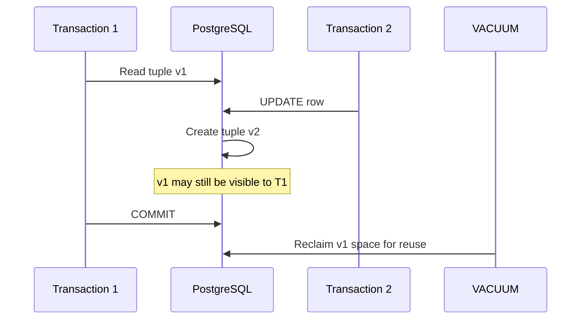

# PostgreSQL Specifics: JSONB, Partial Indexes, and VACUUM

> PostgreSQL-specific features that are useful in normal backend development and commonly discussed in interviews: **JSONB** for flexible data, **partial indexes** for selective indexing, and **VACUUM** for MVCC maintenance.

> **Production baseline:** PostgreSQL 18.6

## Index

1. [Big Picture](#1-big-picture)
2. [JSONB](#2-jsonb)
3. [Partial Indexes](#3-partial-indexes)
4. [VACUUM and Autovacuum](#4-vacuum-and-autovacuum)
5. [How They Work Together](#5-how-they-work-together)
6. [Practical Example](#6-practical-example)
7. [Quick Revision](#7-quick-revision)

---

# 1. Big Picture

These three features solve different PostgreSQL problems:

```text
JSONB         -> store flexible or semi-structured data
Partial index -> index only the rows important to a query
VACUUM        -> clean old row versions created by MVCC
```



A good PostgreSQL design normally combines relational columns with these features rather than replacing relational modeling with them.

---

# 2. JSONB

## 2.1 What JSONB Is

PostgreSQL supports both `json` and `jsonb`.

- `json` stores the original JSON text.
- `jsonb` stores a parsed binary representation.
- `jsonb` is usually better when the application needs to **filter, search, update, or index** JSON data.

### JSON vs JSONB

| Area | `json` | `jsonb` |
|---|---|---|
| Storage | Original input text | Parsed binary form |
| Whitespace | Preserved | Not preserved |
| Object key order | Preserved | Not preserved |
| Duplicate keys | Preserved in input | Last value wins |
| Query processing | Reparsed when processed | Faster to process |
| GIN indexing | Not the normal choice | Strong native support |
| Typical use | Preserve exact input | Application/query data |

### Practical rule

Use `jsonb` for flexible application data.

Use normal typed columns for fields that are central to the relational model, such as:

- IDs and foreign keys
- status
- money
- timestamps
- fields used in joins
- uniqueness rules
- values frequently sorted or aggregated

---

## 2.2 A Good Hybrid Design

Suppose products have common fields but category-specific attributes:

```sql
CREATE TABLE products (
    id          bigint GENERATED ALWAYS AS IDENTITY PRIMARY KEY,
    sku         text NOT NULL,
    name        text NOT NULL,
    category    text NOT NULL,
    price       numeric(12, 2) NOT NULL,
    is_active   boolean NOT NULL DEFAULT true,
    attributes  jsonb NOT NULL DEFAULT '{}'::jsonb,
    created_at  timestamptz NOT NULL DEFAULT now(),
    updated_at  timestamptz NOT NULL DEFAULT now(),

    CONSTRAINT products_attributes_object
        CHECK (jsonb_typeof(attributes) = 'object')
);
```

Example `attributes` value:

```json
{
  "brand": "Acme",
  "color": "black",
  "storage_gb": 256,
  "features": ["5g", "wireless-charging"]
}
```

This is better than putting the entire product inside one JSONB column because PostgreSQL can still enforce normal relational constraints on important fields.

---

## 2.3 Reading and Filtering JSONB

### `->` returns JSON/JSONB

```sql
SELECT attributes -> 'features'
FROM products;
```

### `->>` returns text

```sql
SELECT attributes ->> 'brand'
FROM products;
```

### Nested path

```sql
SELECT attributes #>> '{dimensions,width_cm}'
FROM products;
```

### Containment with `@>`

```sql
SELECT *
FROM products
WHERE attributes @> '{"brand": "Acme"}'::jsonb;
```

### Key existence with `?`

```sql
SELECT *
FROM products
WHERE attributes ? 'brand';
```

### JSONPath

```sql
SELECT *
FROM products
WHERE attributes @? '$.features[*] ? (@ == "5g")';
```

### Numeric values need the correct SQL type

`->>` returns text, so cast before numeric comparison:

```sql
SELECT *
FROM products
WHERE (attributes ->> 'storage_gb')::integer >= 256;
```

This is important because text comparison and numeric comparison are different operations.

---

## 2.4 Updating JSONB

Use `jsonb_set()` when only one path needs to change:

```sql
UPDATE products
SET attributes = jsonb_set(
        attributes,
        '{color}',
        '"green"'::jsonb,
        true
    ),
    updated_at = now()
WHERE id = 100;
```

Other useful operations:

```sql
-- Merge top-level values
UPDATE products
SET attributes = attributes || '{"warranty_years": 2}'::jsonb
WHERE id = 100;

-- Remove a key
UPDATE products
SET attributes = attributes - 'temporary_flag'
WHERE id = 100;
```

### Important MVCC point

PostgreSQL does not modify the stored row in place. An `UPDATE` creates a new tuple version.

So even a small logical JSONB change can create storage and index work, especially when the JSON document is large.

For frequently changing business fields, a normal column may be a better design.

---

## 2.5 JSONB Indexing

Choose the index from the query shape.



### General GIN index

```sql
CREATE INDEX products_attributes_gin_idx
ON products
USING gin (attributes);
```

The default `jsonb_ops` operator class supports:

- `?`
- `?|`
- `?&`
- `@>`
- `@?`
- `@@`

### `jsonb_path_ops`

```sql
CREATE INDEX products_attributes_path_idx
ON products
USING gin (attributes jsonb_path_ops);
```

`jsonb_path_ops` supports:

- `@>`
- `@?`
- `@@`

It does **not** support key-existence operators such as `?`, `?|`, and `?&`.

It is often smaller and more specific for containment-heavy workloads.

### Expression index for one scalar path

If the application often filters by brand:

```sql
CREATE INDEX products_brand_idx
ON products ((attributes ->> 'brand'));
```

Query:

```sql
SELECT *
FROM products
WHERE attributes ->> 'brand' = 'Acme';
```

For a frequently queried scalar value, this B-tree expression index is usually more focused than indexing the entire JSONB document with GIN.

### Typed expression index

```sql
CREATE INDEX products_storage_idx
ON products (((attributes ->> 'storage_gb')::integer));
```

The query should use the same expression:

```sql
SELECT *
FROM products
WHERE (attributes ->> 'storage_gb')::integer >= 256;
```

---

# 3. Partial Indexes

## 3.1 Core Idea

A partial index stores entries only for rows that satisfy its `WHERE` predicate.

```sql
CREATE INDEX index_name
ON table_name (column_name)
WHERE condition;
```

Example:

```sql
CREATE INDEX products_active_sku_idx
ON products (sku)
WHERE is_active = true;
```

```text
products table
┌────┬───────────┬───────────┐
│ id │ sku       │ is_active │
├────┼───────────┼───────────┤
│ 1  │ PHONE-001 │ true      │ -> indexed
│ 2  │ PHONE-002 │ false     │ -> skipped
│ 3  │ LAPTOP-01 │ true      │ -> indexed
└────┴───────────┴───────────┘
```

This can produce a smaller index and reduce index maintenance when only a small subset of rows is queried frequently.

---

## 3.2 When Partial Indexes Are Useful

Common development cases include:

- active records
- soft-deleted records
- pending jobs
- unprocessed events
- rows where an optional value is not null
- subset-specific uniqueness rules

Example for soft deletion:

```sql
CREATE INDEX users_live_email_idx
ON users (email)
WHERE deleted_at IS NULL;
```

The idea works best when the indexed subset is meaningfully smaller than the full table.

---

## 3.3 Partial Unique Indexes

A partial unique index enforces uniqueness only inside a subset.

Example: only one active product may use a SKU:

```sql
CREATE UNIQUE INDEX products_active_sku_uidx
ON products (sku)
WHERE is_active = true;
```

Another common pattern is one active subscription per customer:

```sql
CREATE UNIQUE INDEX subscriptions_one_active_uidx
ON subscriptions (customer_id)
WHERE status = 'ACTIVE';
```

This is safer than an application-level “check, then insert” because the database itself enforces the rule during concurrent writes.

---

## 3.4 Predicate Matching Matters

PostgreSQL can use a partial index only when the planner can determine that the query condition implies the index predicate.

Index:

```sql
CREATE INDEX products_active_brand_idx
ON products ((attributes ->> 'brand'))
WHERE is_active = true;
```

Matching query:

```sql
SELECT *
FROM products
WHERE is_active = true
  AND attributes ->> 'brand' = 'Acme';
```

Query without the predicate:

```sql
SELECT *
FROM products
WHERE attributes ->> 'brand' = 'Acme';
```

The second query cannot rely on the partial index because inactive products are absent from that index.

### Parameterized-query consideration

Predicate matching happens at planning time. Generic parameterized conditions can prevent PostgreSQL from proving that a partial-index predicate applies.

For important ORM or prepared queries, inspect the actual generated SQL and execution plan.

---

## 3.5 Do Not Use Volatile Time Predicates

A moving predicate such as this is not a suitable partial-index definition:

```sql
-- Do not design a partial index like this
WHERE created_at >= now() - interval '30 days'
```

Index membership must be based on a stable predicate.

For rolling time windows, consider:

- partitioning
- a stable business flag
- periodically rebuilt indexes, when operationally justified

---

# 4. VACUUM and Autovacuum

## 4.1 Why PostgreSQL Needs VACUUM

PostgreSQL uses **MVCC — Multi-Version Concurrency Control**.

When a row is updated, PostgreSQL normally creates a new tuple version instead of immediately overwriting the old one.

```text
Before UPDATE
Tuple v1 -> status = ACTIVE

After UPDATE
Tuple v1 -> old version
Tuple v2 -> status = INACTIVE
```

The old tuple cannot be removed while another transaction might still need to see it.

When no active transaction needs that version anymore, it becomes a **dead tuple**.



VACUUM is responsible for important maintenance work:

- reclaiming dead-tuple space for reuse
- cleaning dead index entries
- maintaining the visibility map
- supporting efficient index-only scans
- freezing old tuples to protect against transaction ID wraparound

---

## 4.2 Standard VACUUM vs VACUUM FULL

### Standard VACUUM

```sql
VACUUM products;
```

Standard `VACUUM`:

- reclaims dead space for reuse inside PostgreSQL
- normally does not shrink the table file on disk
- can run alongside normal reads and writes
- is the normal maintenance operation

### VACUUM FULL

```sql
VACUUM (FULL) products;
```

`VACUUM FULL`:

- rewrites the table into a compact file
- can return unused space to the operating system
- requires an `ACCESS EXCLUSIVE` lock
- blocks normal access while the table is rewritten
- requires temporary extra disk space

Use `VACUUM FULL` only when reclaiming significant physical disk space is worth the operational impact. It is not routine maintenance.

---

## 4.3 VACUUM ANALYZE

```sql
VACUUM (ANALYZE) products;
```

This performs both:

- `VACUUM` -> storage/MVCC maintenance
- `ANALYZE` -> refresh planner statistics

Use only `ANALYZE` when statistics need refreshing but vacuuming is not necessary:

```sql
ANALYZE products;
```

This is useful after unusual bulk loads or large data changes.

---

## 4.4 Autovacuum

In normal production systems, PostgreSQL automatically performs vacuuming and analyzing through **autovacuum**.

Keep it enabled unless there is a carefully designed maintenance strategy.

The simplified update/delete trigger is:

```text
vacuum threshold =
    autovacuum_vacuum_threshold
    + autovacuum_vacuum_scale_factor × table size
```

PostgreSQL 18 defaults include:

```text
autovacuum_vacuum_threshold     = 50
autovacuum_vacuum_scale_factor  = 0.2
autovacuum_analyze_threshold    = 50
autovacuum_analyze_scale_factor = 0.1
```

PostgreSQL 18 also has:

```text
autovacuum_vacuum_max_threshold = 100000000
```

Large or high-churn tables may need more aggressive **per-table** settings.

Example:

```sql
ALTER TABLE products SET (
    autovacuum_vacuum_scale_factor = 0.02,
    autovacuum_vacuum_threshold = 1000,
    autovacuum_analyze_scale_factor = 0.01,
    autovacuum_analyze_threshold = 1000
);
```

Do not copy these values blindly; tune from table size, write rate, storage performance, and observed dead tuples.

---

## 4.5 Long Transactions Can Block Cleanup

VACUUM cannot remove an old tuple version if an active snapshot may still need it.

Common causes:

- long-running transactions
- sessions left `idle in transaction`
- long analytical queries
- replication slots retaining old transaction visibility

Check old transactions:

```sql
SELECT
    pid,
    usename,
    state,
    xact_start,
    now() - xact_start AS transaction_age,
    query
FROM pg_stat_activity
WHERE xact_start IS NOT NULL
ORDER BY xact_start;
```

Keeping transactions short is an application-level PostgreSQL performance practice, not only a DBA concern.

---

## 4.6 Visibility Map and Index-Only Scans

An index may contain all columns needed by a query, but PostgreSQL still needs to know whether the referenced heap tuple is visible.

VACUUM maintains the **visibility map**, which marks heap pages whose tuples are known to be visible to all transactions.

```text
Index entry
    |
    v
Visibility map says page is all-visible?
    |
    +-- Yes -> heap visit may be skipped
    |
    +-- No  -> PostgreSQL checks the heap tuple
```

That is why healthy vacuuming can improve the effectiveness of index-only scans.

---

## 4.7 Useful Monitoring

Check dead tuples and recent maintenance:

```sql
SELECT
    relname,
    n_live_tup,
    n_dead_tup,
    last_autovacuum,
    last_autoanalyze
FROM pg_stat_user_tables
ORDER BY n_dead_tup DESC;
```

Check vacuum progress:

```sql
SELECT
    pid,
    relid::regclass AS table_name,
    phase,
    heap_blks_total,
    heap_blks_scanned,
    heap_blks_vacuumed
FROM pg_stat_progress_vacuum;
```

A high dead-tuple count is a signal to investigate workload, autovacuum behavior, and long-running transactions. It does not automatically mean `VACUUM FULL` is required.

---

# 5. How They Work Together

Using the `products` table:

```text
Product INSERT
    |
    v
JSONB attributes stored
    |
    v
Active-row partial indexes updated
    |
    v
Product UPDATE
    |
    +--> new tuple version created by MVCC
    |
    +--> JSONB/index entries may need maintenance
    |
    v
Old tuple eventually becomes dead
    |
    v
Autovacuum reclaims reusable space
```

The important connection is:

- **JSONB** gives schema flexibility.
- **Partial indexes** keep important query paths small.
- **MVCC** makes writes concurrency-friendly by creating row versions.
- **VACUUM** cleans obsolete versions so that high-write tables remain healthy.

---

# 6. Practical Example

## 6.1 Insert Products

```sql
INSERT INTO products (sku, name, category, price, attributes)
VALUES
(
    'PHONE-001',
    'Acme Phone Pro',
    'phone',
    799.00,
    '{
      "brand": "Acme",
      "color": "black",
      "storage_gb": 256,
      "features": ["5g", "wireless-charging"]
    }'
),
(
    'PHONE-002',
    'Zen Phone Mini',
    'phone',
    499.00,
    '{
      "brand": "Zen",
      "color": "blue",
      "storage_gb": 128,
      "features": ["5g"]
    }'
);
```

## 6.2 Add Query-Specific Indexes

Containment-heavy JSONB search:

```sql
CREATE INDEX products_attributes_gin_idx
ON products
USING gin (attributes jsonb_path_ops);
```

Active brand search:

```sql
CREATE INDEX products_active_brand_idx
ON products ((attributes ->> 'brand'))
WHERE is_active = true;
```

Subset uniqueness:

```sql
CREATE UNIQUE INDEX products_active_sku_uidx
ON products (sku)
WHERE is_active = true;
```

## 6.3 Query Active Acme Products

```sql
SELECT id, sku, name
FROM products
WHERE is_active = true
  AND attributes ->> 'brand' = 'Acme';
```

Inspect the actual plan:

```sql
EXPLAIN (ANALYZE, BUFFERS)
SELECT id, sku, name
FROM products
WHERE is_active = true
  AND attributes ->> 'brand' = 'Acme';
```

For a very small table, PostgreSQL may still choose a sequential scan because it is cheaper. An index existing does not mean PostgreSQL must use it.

## 6.4 Update JSONB

```sql
UPDATE products
SET attributes = jsonb_set(
        attributes,
        '{color}',
        '"green"'::jsonb,
        true
    ),
    updated_at = now()
WHERE sku = 'PHONE-001';
```

This creates a new tuple version under MVCC. Later, autovacuum can reclaim the obsolete tuple when no transaction needs it.

---

# 7. Quick Revision

| Concept | Remember |
|---|---|
| `json` | Preserves original JSON text |
| `jsonb` | Parsed, queryable, indexable JSON |
| `->` | Returns JSON/JSONB |
| `->>` | Returns text |
| `@>` | JSONB containment |
| `?` | Top-level key/array-element existence |
| GIN `jsonb_ops` | Flexible JSONB indexing, including key existence |
| GIN `jsonb_path_ops` | Smaller/specific for containment and JSONPath; no `?`, `?|`, `?&` |
| Expression B-tree | Best for one scalar JSON path used for equality/range/sort |
| Partial index | Indexes only rows matching a stable predicate |
| Partial unique index | Enforces uniqueness only within that subset |
| MVCC | Updates create new row versions |
| VACUUM | Reclaims dead tuple space for reuse and maintains visibility/freezing data |
| VACUUM FULL | Rewrites and shrinks table; blocking and expensive |
| Autovacuum | Background automatic VACUUM/ANALYZE maintenance |
| Long transaction | Can prevent old tuple cleanup |

## Final mental model

```text
Use JSONB for flexibility,
use partial indexes for selective performance,
and let autovacuum keep MVCC storage healthy.
```
