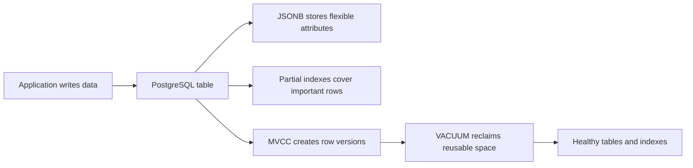
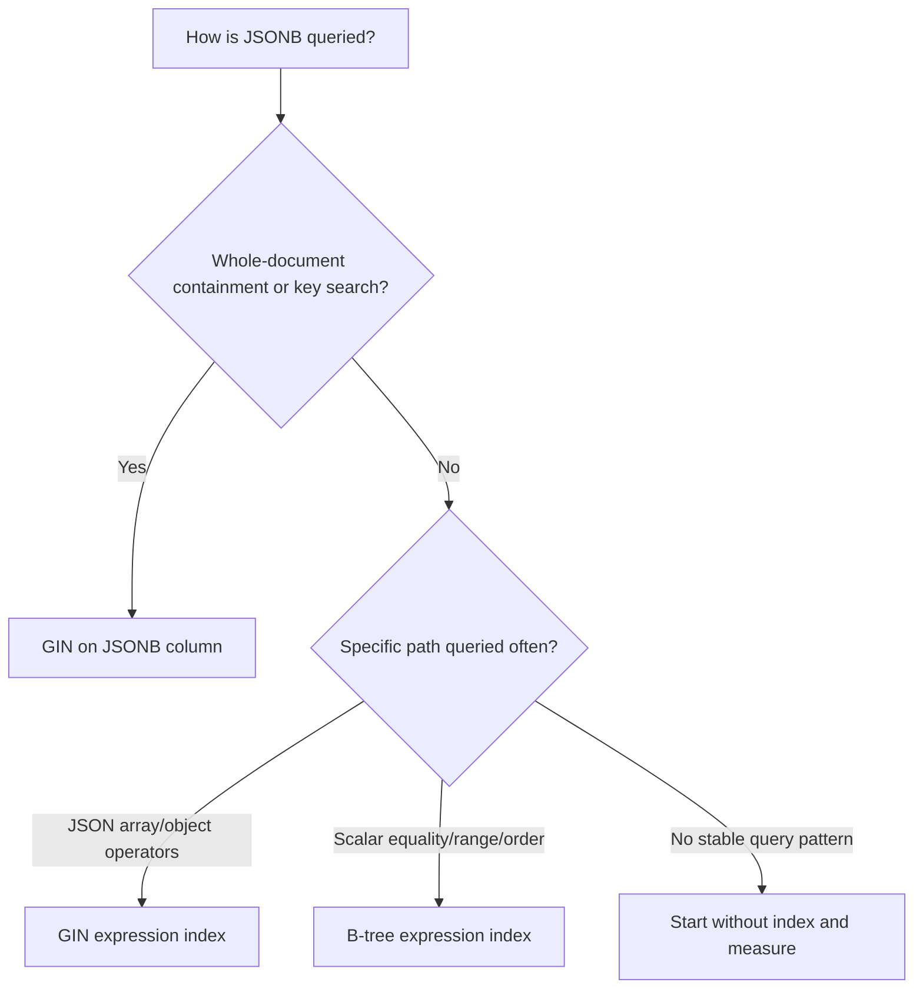
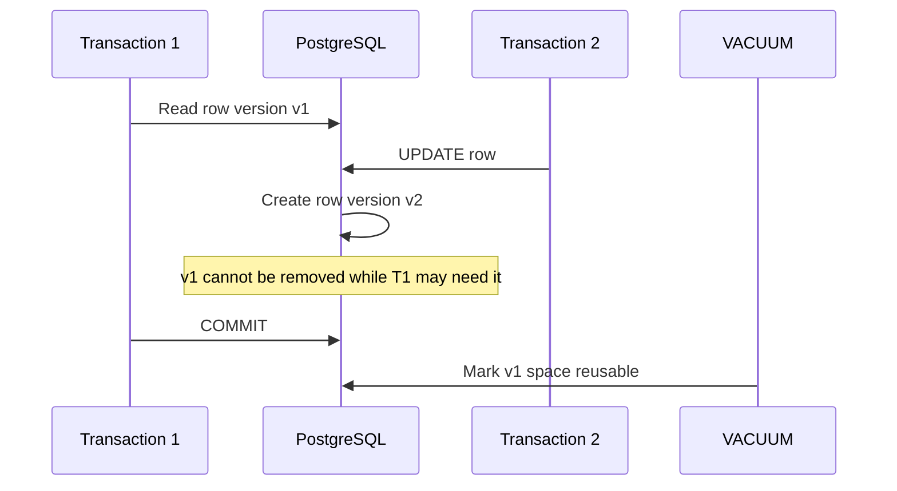
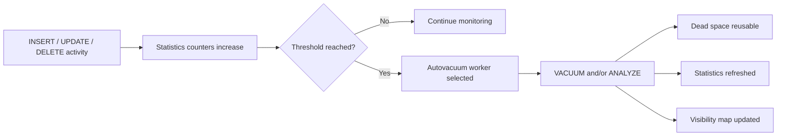
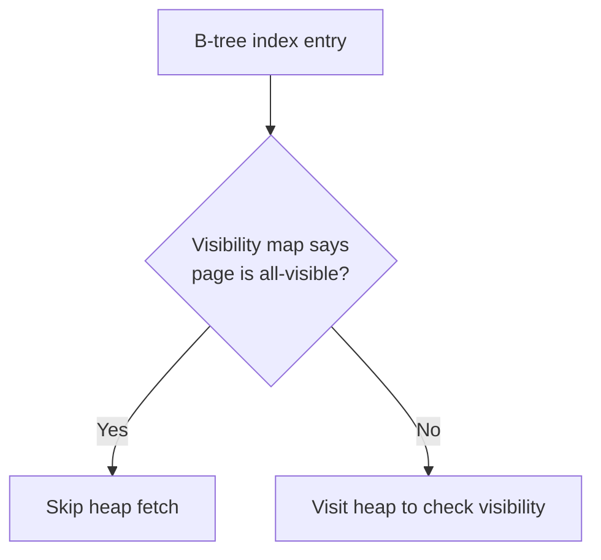
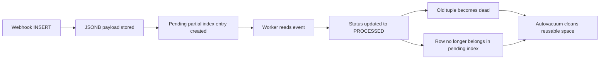

# PostgreSQL Specifics: JSONB, Partial Indexes, and VACUUM

> **Topic:** Databases & SQL  
> **Level:** Intermediate developer (3+ years of experience)  
> **Production baseline:** PostgreSQL 18.4  
> **Verified on:** July 27, 2026

PostgreSQL is more than a traditional relational database. It combines relational modeling, document-style JSON storage, advanced indexing, and an MVCC-based storage engine. Three PostgreSQL-specific areas appear frequently in real development work:

1. **JSONB** for flexible, queryable document data.
2. **Partial indexes** for indexing only the rows that matter.
3. **VACUUM** for cleaning dead row versions and keeping MVCC healthy.

These features solve different problems, but they are closely connected. JSONB workloads often need specialized indexes, partial indexes can reduce index size and write overhead, and VACUUM maintains the table and index structures affected by frequent updates.

---

# 1. Big Picture

Consider an e-commerce application that stores products, orders, payments, and webhook events.

- Product specifications differ between categories, so some attributes may be stored in **JSONB**.
- Most queries target active products or incomplete orders, so **partial indexes** can avoid indexing historical rows.
- Products and orders are updated frequently. PostgreSQL creates new row versions instead of overwriting rows in place, so **VACUUM** must clean obsolete versions.



A useful mental model is:

```text
JSONB          = flexible data representation
Partial index  = selective query acceleration
VACUUM         = storage and MVCC maintenance
```

---

# 2. JSONB

## 2.1 JSON vs JSONB

PostgreSQL provides two JSON data types:

- `json`
- `jsonb`

Both accept valid JSON input, but they store it differently.

| Area | `json` | `jsonb` |
|---|---|---|
| Storage | Original JSON text | Decomposed binary representation |
| Input cost | Lower | Slightly higher because PostgreSQL parses and converts it |
| Read/query cost | Must reparse text | Usually faster to process |
| Whitespace | Preserved | Not preserved |
| Object key order | Preserved | Not preserved as input formatting |
| Duplicate keys | Preserved in input text | Only the last value is retained |
| Containment operators | Limited | Supported |
| GIN indexing | Not normally used | Strong native support |
| Typical application use | Preserve exact original JSON | Queryable application data |

Example:

```sql
SELECT '{"name": "A", "name": "B"}'::json;

SELECT '{"name": "A", "name": "B"}'::jsonb;
```

Conceptually, the `jsonb` result becomes:

```json
{
  "name": "B"
}
```

### Practical rule

Use `jsonb` for most application data that must be searched, filtered, updated, or indexed.

Use `json` when preserving the exact incoming text, key order, whitespace, or duplicate keys is a real requirement.

---

## 2.2 When JSONB Is a Good Fit

JSONB works well when the data has a stable core schema but also contains flexible attributes.

### Good examples

- Product category-specific attributes
- External API payloads
- Webhook request bodies
- Audit metadata
- Feature configuration
- User preferences
- Event payloads
- Integration-specific fields

Example product data:

```json
{
  "brand": "Acme",
  "color": "black",
  "dimensions": {
    "width_cm": 20,
    "height_cm": 10
  },
  "tags": ["portable", "wireless"]
}
```

### Use normal columns when the field is relationally important

A field usually belongs in a normal typed column when it is:

- Required for most rows
- Frequently filtered or sorted
- Used in joins
- Part of a foreign key
- Part of a uniqueness rule
- Used in financial or business calculations
- Expected to have a consistent type

A good hybrid table design is:

```sql
CREATE TABLE products (
    id           bigint GENERATED ALWAYS AS IDENTITY PRIMARY KEY,
    sku          text NOT NULL UNIQUE,
    name         text NOT NULL,
    category_id  bigint NOT NULL REFERENCES categories(id),
    price        numeric(12, 2) NOT NULL,
    is_active    boolean NOT NULL DEFAULT true,
    attributes   jsonb NOT NULL DEFAULT '{}'::jsonb,
    created_at   timestamptz NOT NULL DEFAULT now(),
    updated_at   timestamptz NOT NULL DEFAULT now()
);
```

Here:

- `sku`, `price`, and `category_id` remain strongly typed.
- Category-specific attributes go into `attributes`.

### Avoid the “everything in JSONB” model

This structure is technically possible but usually weak:

```sql
CREATE TABLE products (
    id bigint GENERATED ALWAYS AS IDENTITY PRIMARY KEY,
    data jsonb NOT NULL
);
```

It makes constraints, joins, statistics, data validation, and query optimization harder.

---

## 2.3 Table Design

### Default value

Use an empty JSON object when the field represents properties:

```sql
attributes jsonb NOT NULL DEFAULT '{}'::jsonb
```

Use an empty array when the field represents a list:

```sql
tags jsonb NOT NULL DEFAULT '[]'::jsonb
```

### Basic validation with constraints

Ensure the top-level JSON value is an object:

```sql
ALTER TABLE products
ADD CONSTRAINT products_attributes_must_be_object
CHECK (jsonb_typeof(attributes) = 'object');
```

Ensure a key has an expected JSON type when present:

```sql
ALTER TABLE products
ADD CONSTRAINT products_weight_must_be_number
CHECK (
    NOT (attributes ? 'weight_kg')
    OR jsonb_typeof(attributes -> 'weight_kg') = 'number'
);
```

Require a key:

```sql
ALTER TABLE products
ADD CONSTRAINT products_brand_required
CHECK (attributes ? 'brand');
```

### Generated columns for important JSON values

When a JSON value becomes frequently queried, expose it as a generated column:

```sql
ALTER TABLE products
ADD COLUMN brand text
GENERATED ALWAYS AS (attributes ->> 'brand') STORED;

CREATE INDEX products_brand_idx ON products (brand);
```

This gives the value a clearer relational shape while preserving the source JSONB document.

---

## 2.4 Reading JSONB Values

Assume this row:

```json
{
  "brand": "Acme",
  "color": "black",
  "dimensions": {
    "width_cm": 20,
    "height_cm": 10
  },
  "tags": ["portable", "wireless"]
}
```

### `->` returns JSON/JSONB

```sql
SELECT attributes -> 'dimensions'
FROM products;
```

Result:

```json
{"width_cm": 20, "height_cm": 10}
```

### `->>` returns text

```sql
SELECT attributes ->> 'brand'
FROM products;
```

Result:

```text
Acme
```

### Nested traversal

```sql
SELECT attributes -> 'dimensions' ->> 'width_cm'
FROM products;
```

Or use a path:

```sql
SELECT attributes #>> '{dimensions,width_cm}'
FROM products;
```

### Convert text to the required SQL type

`->>` returns text, so numeric comparison should cast it:

```sql
SELECT *
FROM products
WHERE (attributes ->> 'weight_kg')::numeric > 5;
```

Without a cast, PostgreSQL performs text comparison, which is not the same as numeric comparison.

### Array element access

```sql
SELECT attributes -> 'tags' ->> 0 AS first_tag
FROM products;
```

### Expand objects and arrays

```sql
SELECT key, value
FROM products
CROSS JOIN LATERAL jsonb_each(attributes)
WHERE id = 100;
```

```sql
SELECT tag
FROM products
CROSS JOIN LATERAL jsonb_array_elements_text(attributes -> 'tags') AS tag;
```

`LATERAL` allows each row's JSONB value to be expanded into a set of rows.

---

## 2.5 Filtering JSONB Data

### Containment: `@>`

Find products whose attributes contain a specific key/value pair:

```sql
SELECT id, sku, name
FROM products
WHERE attributes @> '{"brand": "Acme"}'::jsonb;
```

Nested containment:

```sql
SELECT id, name
FROM products
WHERE attributes @> '{
  "dimensions": {
    "width_cm": 20
  }
}'::jsonb;
```

Array containment:

```sql
SELECT id, name
FROM products
WHERE attributes @> '{"tags": ["wireless"]}'::jsonb;
```

### Key existence: `?`

```sql
SELECT *
FROM products
WHERE attributes ? 'brand';
```

This checks for a top-level key or a top-level array string element.

### Any key exists: `?|`

```sql
SELECT *
FROM products
WHERE attributes ?| ARRAY['brand', 'manufacturer'];
```

### All keys exist: `?&`

```sql
SELECT *
FROM products
WHERE attributes ?& ARRAY['brand', 'color'];
```

### JSONPath: `@?`

Find products with a tag equal to `wireless`:

```sql
SELECT *
FROM products
WHERE attributes @? '$.tags[*] ? (@ == "wireless")';
```

### JSONPath predicate: `@@`

```sql
SELECT *
FROM products
WHERE attributes @@ '$.dimensions.width_cm > 15';
```

### SQL/JSON query functions

PostgreSQL also supports SQL/JSON path functions. For example:

```sql
SELECT jsonb_path_query(
    attributes,
    '$.tags[*]'
)
FROM products;
```

The path begins with `$`, which represents the current JSON document.

---

## 2.6 Updating JSONB Data

PostgreSQL does not modify a JSONB document in place at the storage level. An `UPDATE` creates a new row version under MVCC.

### Replace the entire document

```sql
UPDATE products
SET attributes = '{
  "brand": "Acme",
  "color": "blue"
}'::jsonb
WHERE id = 100;
```

### Add or replace a key with `jsonb_set`

```sql
UPDATE products
SET attributes = jsonb_set(
    attributes,
    '{color}',
    '"blue"'::jsonb,
    true
)
WHERE id = 100;
```

The fourth argument controls whether a missing final key may be created.

### Update a nested value

```sql
UPDATE products
SET attributes = jsonb_set(
    attributes,
    '{dimensions,width_cm}',
    '25'::jsonb,
    true
)
WHERE id = 100;
```

### Merge top-level objects with `||`

```sql
UPDATE products
SET attributes = attributes || '{
  "color": "green",
  "warranty_years": 2
}'::jsonb
WHERE id = 100;
```

For duplicate top-level keys, the right-hand value replaces the left-hand value.

### Remove a key

```sql
UPDATE products
SET attributes = attributes - 'temporary_flag'
WHERE id = 100;
```

### Remove a nested path

```sql
UPDATE products
SET attributes = attributes #- '{dimensions,height_cm}'
WHERE id = 100;
```

### Prevent lost updates

Two concurrent transactions can both read the same JSONB document, modify different keys in application code, and then overwrite each other.

Prefer a single SQL expression that changes only the intended path:

```sql
UPDATE products
SET attributes = jsonb_set(
    attributes,
    '{last_checked_at}',
    to_jsonb(now()),
    true
)
WHERE id = 100;
```

For stronger application-level optimistic locking, use a version column:

```sql
UPDATE products
SET attributes = $1,
    version = version + 1
WHERE id = $2
  AND version = $3;
```

The application checks whether exactly one row was updated.

---

## 2.7 JSONB Indexing

JSONB supports multiple indexing strategies. The correct index depends on the query shape.



### General-purpose GIN index

```sql
CREATE INDEX products_attributes_gin_idx
ON products
USING gin (attributes);
```

This is useful for operators such as:

- `?`
- `?|`
- `?&`
- `@>`
- `@?`
- `@@`

Example:

```sql
SELECT *
FROM products
WHERE attributes @> '{"brand": "Acme"}'::jsonb;
```

### Verify the plan

```sql
EXPLAIN (ANALYZE, BUFFERS)
SELECT *
FROM products
WHERE attributes @> '{"brand": "Acme"}'::jsonb;
```

A typical indexed plan may contain:

```text
Bitmap Heap Scan
  -> Bitmap Index Scan on products_attributes_gin_idx
```

GIN indexes commonly produce bitmap scans because multiple index entries may match a document.

---

## 2.8 GIN Operator Classes

PostgreSQL provides two important JSONB GIN operator classes.

### Default: `jsonb_ops`

```sql
CREATE INDEX products_attributes_ops_idx
ON products
USING gin (attributes);
```

Equivalent explicit form:

```sql
CREATE INDEX products_attributes_ops_idx
ON products
USING gin (attributes jsonb_ops);
```

Supports:

- Key existence: `?`, `?|`, `?&`
- Containment: `@>`
- JSONPath: `@?`, `@@`

Use it when the application has varied JSONB query patterns, especially key-existence queries.

### Specialized: `jsonb_path_ops`

```sql
CREATE INDEX products_attributes_path_idx
ON products
USING gin (attributes jsonb_path_ops);
```

Supports:

- `@>`
- `@?`
- `@@`

It does **not** support the key-existence operators `?`, `?|`, and `?&`.

Its index is often smaller and more specific for containment-heavy workloads.

### Comparison

| Area | `jsonb_ops` | `jsonb_path_ops` |
|---|---|---|
| Default | Yes | No |
| `?`, `?|`, `?&` | Supported | Not supported |
| `@>` | Supported | Supported |
| `@?`, `@@` | Supported | Supported |
| Index size | Usually larger | Usually smaller |
| Flexibility | Higher | Lower |
| Typical use | Mixed JSONB searches | Containment/path-heavy searches |

### Selection rule

```text
Need key-existence operators?  -> jsonb_ops
Mostly containment/JSONPath?   -> consider jsonb_path_ops
Unsure?                        -> begin with jsonb_ops, measure real queries
```

Avoid creating both operator classes automatically. Each extra index consumes disk, memory, maintenance time, and write I/O.

---

## 2.9 Expression and Scalar Indexes

A full-column GIN index is not always the best solution.

### GIN expression index for one JSON path

Suppose queries frequently search tags:

```sql
SELECT *
FROM products
WHERE attributes -> 'tags' ? 'wireless';
```

Create an index on exactly that expression:

```sql
CREATE INDEX products_tags_gin_idx
ON products
USING gin ((attributes -> 'tags'));
```

The query expression should match the indexed expression.

### B-tree expression index for scalar equality

```sql
CREATE INDEX products_brand_idx
ON products ((attributes ->> 'brand'));
```

Query:

```sql
SELECT *
FROM products
WHERE attributes ->> 'brand' = 'Acme';
```

### Typed scalar index for range queries

```sql
CREATE INDEX products_weight_idx
ON products (((attributes ->> 'weight_kg')::numeric));
```

Query:

```sql
SELECT *
FROM products
WHERE (attributes ->> 'weight_kg')::numeric BETWEEN 5 AND 10;
```

The indexed cast and query cast should match.

### Partial expression index

Index the brand only for active products:

```sql
CREATE INDEX active_products_brand_idx
ON products ((attributes ->> 'brand'))
WHERE is_active = true;
```

Query:

```sql
SELECT *
FROM products
WHERE is_active = true
  AND attributes ->> 'brand' = 'Acme';
```

This combines JSONB extraction with a partial index.

---

## 2.10 JSONB Design and Performance

### 1. JSONB is flexible, not schema-free

The schema still exists; it is simply enforced through application code, constraints, generated columns, indexes, and conventions.

### 2. Large JSONB updates can be expensive

A small logical change can create a new row version and may rewrite a large value, including TOAST-managed storage. Frequently changing fields may belong in normal columns or child tables.

### 3. Every JSONB index increases write cost

On inserts and updates, PostgreSQL must maintain each affected index. GIN indexes are powerful but can be comparatively expensive to update.

### 4. Prefer query-specific indexes

A narrow expression index can be smaller and cheaper than a broad GIN index when the application repeatedly queries one path.

### 5. Extract strongly typed business fields

Do not leave `status`, `customer_id`, `created_at`, `amount`, or join keys buried in JSONB merely for convenience.

### 6. Keep JSON documents reasonably atomic

One JSONB document should represent data normally updated together. Independent, high-frequency sub-entities often deserve their own rows.

### 7. Measure with real plans

Use:

```sql
EXPLAIN (ANALYZE, BUFFERS)
...
```

Also inspect index usage:

```sql
SELECT
    schemaname,
    relname AS table_name,
    indexrelname AS index_name,
    idx_scan,
    idx_tup_read,
    idx_tup_fetch
FROM pg_stat_user_indexes
WHERE relname = 'products'
ORDER BY idx_scan DESC;
```

---

# 3. Partial Indexes

## 3.1 Core Idea

A partial index contains entries only for rows that satisfy an index predicate.

General syntax:

```sql
CREATE INDEX index_name
ON table_name (indexed_columns)
WHERE predicate;
```

Example:

```sql
CREATE INDEX active_products_sku_idx
ON products (sku)
WHERE is_active = true;
```

```text
Table rows:
┌────┬──────────┬───────────┐
│ id │ sku      │ is_active │
├────┼──────────┼───────────┤
│ 1  │ SKU-001  │ true      │  -> indexed
│ 2  │ SKU-002  │ false     │  -> not indexed
│ 3  │ SKU-003  │ true      │  -> indexed
└────┴──────────┴───────────┘
```

Benefits:

- Smaller index
- Less index storage
- Better cache efficiency
- Lower maintenance cost for excluded rows
- Faster targeted queries in suitable workloads

A partial index is most useful when the indexed subset is significantly smaller than the full table and is queried frequently.

---

## 3.2 Common Use Cases

### Active rows

```sql
CREATE INDEX active_users_email_idx
ON users (email)
WHERE status = 'ACTIVE';
```

### Soft-deleted rows

```sql
CREATE INDEX customers_not_deleted_email_idx
ON customers (email)
WHERE deleted_at IS NULL;
```

### Pending jobs

```sql
CREATE INDEX jobs_ready_idx
ON jobs (priority DESC, available_at)
WHERE status = 'PENDING';
```

Query:

```sql
SELECT *
FROM jobs
WHERE status = 'PENDING'
  AND available_at <= now()
ORDER BY priority DESC, available_at
LIMIT 100;
```

### Unprocessed events

```sql
CREATE INDEX webhook_events_unprocessed_idx
ON webhook_events (created_at)
WHERE processed_at IS NULL;
```

### Rows with non-null optional data

```sql
CREATE INDEX users_phone_idx
ON users (phone_number)
WHERE phone_number IS NOT NULL;
```

### Recent or time-based subsets

Be careful with time-based predicates. Index predicates must use immutable expressions. A predicate such as this is not suitable:

```sql
-- Not a valid stable partial-index design:
WHERE created_at >= now() - interval '30 days'
```

`now()` changes over time, while index membership is decided when rows are inserted or updated. Use a stable business flag, partitioning, or periodically rebuilt indexes instead.

---

## 3.3 Partial Unique Indexes

A partial unique index enforces uniqueness only within the indexed subset.

### Unique email for non-deleted users

```sql
CREATE UNIQUE INDEX users_live_email_unique_idx
ON users (lower(email))
WHERE deleted_at IS NULL;
```

This allows an old soft-deleted account and a new active account to use the same email, while preventing two current accounts from sharing it.

### Only one active subscription per customer

```sql
CREATE UNIQUE INDEX subscriptions_one_active_per_customer_idx
ON subscriptions (customer_id)
WHERE status = 'ACTIVE';
```

### Only one primary address per user

```sql
CREATE UNIQUE INDEX addresses_one_primary_per_user_idx
ON addresses (user_id)
WHERE is_primary = true;
```

Partial unique indexes are valuable because they encode business rules directly in the database and remain safe under concurrency.

An application-level “check then insert” is not enough because two transactions can pass the check simultaneously. A unique index resolves that race at the database level.

---

## 3.4 Predicate Matching

PostgreSQL can use a partial index only when it can determine during planning that the query condition implies the index predicate.

Index:

```sql
CREATE INDEX orders_pending_created_idx
ON orders (created_at)
WHERE status = 'PENDING';
```

Query that can use it:

```sql
SELECT *
FROM orders
WHERE status = 'PENDING'
  AND created_at < now() - interval '5 minutes';
```

Query that cannot safely use it:

```sql
SELECT *
FROM orders
WHERE created_at < now() - interval '5 minutes';
```

The second query may return orders with any status, but the index contains only pending orders.

### Keep predicate syntax consistent

Index:

```sql
CREATE INDEX orders_unbilled_idx
ON orders (order_number)
WHERE billed IS NOT TRUE;
```

Prefer matching query syntax:

```sql
SELECT *
FROM orders
WHERE billed IS NOT TRUE
  AND order_number = 5001;
```

PostgreSQL recognizes some simple logical implications, but it is not a general-purpose theorem prover. Semantically equivalent but differently written expressions may not always match as expected.

### Parameterized queries

A generic prepared predicate may prevent the planner from proving that a partial index applies.

Example index:

```sql
CREATE INDEX tasks_open_idx
ON tasks (created_at)
WHERE status = 'OPEN';
```

Generic query:

```sql
SELECT *
FROM tasks
WHERE status = $1
ORDER BY created_at;
```

Because `$1` could represent any status, a generic plan cannot always assume the partial predicate is satisfied.

This behavior depends on custom versus generic plan selection, but the safe design principle is to test the real prepared query path used by the application.

Use:

```sql
EXPLAIN (ANALYZE, BUFFERS)
SELECT *
FROM tasks
WHERE status = 'OPEN'
ORDER BY created_at;
```

Also test the actual ORM-generated or prepared SQL.

---

## 3.5 Partial Indexes with JSONB

Partial indexes and JSONB can be combined in several ways.

### Partial GIN index

Index JSONB attributes only for active products:

```sql
CREATE INDEX active_products_attributes_gin_idx
ON products
USING gin (attributes jsonb_path_ops)
WHERE is_active = true;
```

Query:

```sql
SELECT *
FROM products
WHERE is_active = true
  AND attributes @> '{"brand": "Acme"}'::jsonb;
```

### Partial expression index

```sql
CREATE INDEX pending_orders_payment_provider_idx
ON orders ((metadata ->> 'payment_provider'))
WHERE status = 'PENDING';
```

Query:

```sql
SELECT *
FROM orders
WHERE status = 'PENDING'
  AND metadata ->> 'payment_provider' = 'stripe';
```

### Partial unique JSONB-derived value

```sql
CREATE UNIQUE INDEX active_integrations_external_id_idx
ON integrations ((config ->> 'external_account_id'))
WHERE is_active = true;
```

This can enforce uniqueness for a JSONB-derived value within active integrations.

Before doing this, ensure the value has consistent type and presence. A generated column plus a normal unique partial index may be clearer for important identifiers.

---

## 3.6 Partial Index vs Other Options

| Requirement | Usually prefer |
|---|---|
| Query a small, stable subset repeatedly | Partial index |
| Query most rows across many values | Full index |
| Filter and sort by multiple columns | Composite index |
| Enforce uniqueness for a subset | Partial unique index |
| Separate very large data ranges | Partitioning |
| Many category-specific partial indexes | Usually composite index or partitioning |
| One common JSON scalar path | Expression B-tree index |
| Broad JSON containment search | GIN index |

### Do not use many partial indexes as manual partitioning

This pattern is usually weak:

```sql
CREATE INDEX events_type_a_idx ON events (created_at) WHERE event_type = 'A';
CREATE INDEX events_type_b_idx ON events (created_at) WHERE event_type = 'B';
CREATE INDEX events_type_c_idx ON events (created_at) WHERE event_type = 'C';
```

A composite index may be simpler:

```sql
CREATE INDEX events_type_created_idx
ON events (event_type, created_at);
```

For very large, naturally separated data, use declarative partitioning.

### Recheck data distribution

A partial index created when 2% of rows were pending may become less useful if 60% of rows later remain pending. Index design should follow current data distribution and workload, not old assumptions.

Useful size query:

```sql
SELECT
    indexrelname,
    pg_size_pretty(pg_relation_size(indexrelid)) AS index_size,
    idx_scan
FROM pg_stat_user_indexes
WHERE relname = 'orders'
ORDER BY pg_relation_size(indexrelid) DESC;
```

---

# 4. VACUUM

## 4.1 Why PostgreSQL Needs VACUUM

PostgreSQL uses Multi-Version Concurrency Control, or MVCC.

An `UPDATE` normally creates a new row version instead of overwriting the existing version immediately. A `DELETE` marks a row version as deleted but cannot immediately remove it if another transaction might still need to see it.

```text
Initial row:

Tuple v1: status = PENDING

After UPDATE:

Tuple v1: status = PENDING   <- old/dead when no transaction needs it
Tuple v2: status = PAID      <- current/live version
```



VACUUM performs several important maintenance tasks:

1. Reclaims dead row-version space for reuse.
2. Cleans dead index entries.
3. Updates the visibility map.
4. Supports index-only scans.
5. Helps prevent transaction ID wraparound.
6. Can update planner statistics when used with `ANALYZE`.

### Dead tuples

A dead tuple is an old row version that is no longer visible to any transaction.

Common causes:

- `UPDATE`
- `DELETE`
- Rolled-back modifications
- High-churn queue/status tables
- Repeated updates to JSONB documents

### Long-running transactions delay cleanup

VACUUM cannot remove a row version that may still be visible to an old transaction snapshot.

Examples:

- A connection left `idle in transaction`
- A long-running report
- An old replication slot retaining required history
- Long-running logical decoding activity

---

## 4.2 Standard VACUUM

Run standard VACUUM:

```sql
VACUUM products;
```

Verbose output:

```sql
VACUUM (VERBOSE) products;
```

Important behavior:

- It marks dead-row space reusable inside PostgreSQL.
- It normally does not shrink the operating-system file.
- It can run while normal `SELECT`, `INSERT`, `UPDATE`, and `DELETE` operations continue.
- It generates I/O and consumes resources.
- It cannot run inside an explicit transaction block.

### Space reuse vs file shrink

```text
Before VACUUM:
[Live][Dead][Live][Dead][Free?]

After standard VACUUM:
[Live][Reusable][Live][Reusable][Free?]

Operating-system file size usually remains similar.
New rows can reuse the reusable space.
```

Standard VACUUM is routine maintenance. Its goal is usually stable space reuse, not minimum file size.

---

## 4.3 VACUUM FULL

```sql
VACUUM (FULL) products;
```

`VACUUM FULL` rewrites the table into a new compact physical file.

Characteristics:

- Can return more disk space to the operating system
- Requires an `ACCESS EXCLUSIVE` lock
- Blocks normal access to the table while running
- Requires temporary extra disk space for the rewritten copy
- Rebuilds associated indexes as part of the rewrite process
- Is much more disruptive than standard VACUUM

Use it for exceptional situations, such as a one-time deletion of most rows where the table will remain permanently smaller.

Do not use it as normal scheduled maintenance.

### Alternatives for severe bloat

Depending on the environment, consider:

- Better autovacuum tuning
- `REINDEX CONCURRENTLY` for index-specific bloat
- Online rewrite tools such as `pg_repack`, where operational policy permits
- Partition rotation or dropping old partitions
- Creating a replacement table and controlled cutover

---

## 4.4 VACUUM ANALYZE

```sql
VACUUM (ANALYZE) products;
```

This combines:

- `VACUUM`: dead-row and visibility maintenance
- `ANALYZE`: planner statistics collection

Run only ANALYZE when cleanup is not needed but statistics should be refreshed:

```sql
ANALYZE products;
```

Accurate statistics help PostgreSQL estimate:

- Row counts
- Value frequencies
- Null fractions
- Value distributions
- Correlation
- Join cardinality

Poor estimates can produce inefficient plans even when the correct index exists.

After a large bulk load, consider:

```sql
ANALYZE products;
```

After a large batch of updates/deletes, consider:

```sql
VACUUM (ANALYZE) products;
```

Autovacuum normally handles both automatically, but manual execution is useful after unusual bulk operations.

---

## 4.5 Autovacuum

Autovacuum is PostgreSQL's background maintenance system. It launches workers that automatically run `VACUUM` and `ANALYZE` when table activity crosses configured thresholds.



Keep autovacuum enabled in normal production systems.

Disabling ordinary autovacuum does not remove all automatic protection: PostgreSQL can still force anti-wraparound vacuuming when necessary.

### Inspect important settings

```sql
SHOW autovacuum;
SHOW autovacuum_max_workers;
SHOW autovacuum_naptime;
SHOW autovacuum_vacuum_threshold;
SHOW autovacuum_vacuum_scale_factor;
SHOW autovacuum_vacuum_max_threshold;
SHOW autovacuum_analyze_threshold;
SHOW autovacuum_analyze_scale_factor;
SHOW autovacuum_freeze_max_age;
```

Do not copy tuning values blindly. Table size, update rate, storage speed, workload shape, and service-level requirements all matter.

---

## 4.6 Autovacuum Trigger Logic

For update/delete-driven vacuuming, the simplified PostgreSQL 18 trigger threshold is:

```text
vacuum trigger = min(
    autovacuum_vacuum_threshold
    + autovacuum_vacuum_scale_factor × table tuple count,
    autovacuum_vacuum_max_threshold
)
```

Default PostgreSQL 18 settings include:

```text
autovacuum_vacuum_threshold      = 50
autovacuum_vacuum_scale_factor   = 0.2
autovacuum_vacuum_max_threshold  = 100,000,000
```

For a table with 1,000,000 estimated tuples:

```text
50 + 0.2 × 1,000,000 = 200,050 changed tuples
```

That may be too late for a high-write production table.

For a table with 500,000,000 tuples:

```text
50 + 0.2 × 500,000,000 = 100,000,050
```

The default maximum threshold caps the trigger around 100,000,000 updated/deleted tuples.

### Analyze trigger

Simplified formula:

```text
analyze trigger = autovacuum_analyze_threshold
                + autovacuum_analyze_scale_factor × table tuple count
```

PostgreSQL 18 defaults:

```text
autovacuum_analyze_threshold    = 50
autovacuum_analyze_scale_factor = 0.1
```

### Insert-triggered vacuuming

PostgreSQL can also trigger vacuum activity based on inserts, which is important for freezing and visibility-map maintenance on insert-heavy tables.

Relevant settings:

```sql
SHOW autovacuum_vacuum_insert_threshold;
SHOW autovacuum_vacuum_insert_scale_factor;
```

PostgreSQL 18 defaults:

```text
autovacuum_vacuum_insert_threshold    = 1000
autovacuum_vacuum_insert_scale_factor = 0.2
```

The insert scale factor is based on unfrozen table pages, not simply the total tuple count.

### Per-table tuning

For a high-write orders table:

```sql
ALTER TABLE orders SET (
    autovacuum_vacuum_scale_factor = 0.02,
    autovacuum_vacuum_threshold = 1000,
    autovacuum_analyze_scale_factor = 0.01,
    autovacuum_analyze_threshold = 1000
);
```

Inspect table-specific options:

```sql
SELECT relname, reloptions
FROM pg_class
WHERE relname = 'orders';
```

Reset options:

```sql
ALTER TABLE orders RESET (
    autovacuum_vacuum_scale_factor,
    autovacuum_vacuum_threshold,
    autovacuum_analyze_scale_factor,
    autovacuum_analyze_threshold
);
```

---

## 4.7 Transaction ID Wraparound

PostgreSQL transaction IDs are finite 32-bit values. MVCC depends on comparing transaction ages correctly.

Without freezing, sufficiently old rows could eventually be interpreted incorrectly after transaction IDs wrap around.

VACUUM protects the database by freezing old row versions so they remain visible to current and future transactions.

```text
Normal transaction IDs increase:

... 100, 101, 102, ... very large value ... wrap to beginning

VACUUM FREEZE marks sufficiently old tuples as permanently old/visible,
preventing age comparison from making old data appear to be in the future.
```

Check database-level transaction age:

```sql
SELECT
    datname,
    age(datfrozenxid) AS xid_age
FROM pg_database
ORDER BY xid_age DESC;
```

Check table-level age:

```sql
SELECT
    c.oid::regclass AS table_name,
    age(c.relfrozenxid) AS xid_age,
    c.relfrozenxid
FROM pg_class AS c
WHERE c.relkind IN ('r', 'm')
ORDER BY xid_age DESC
LIMIT 20;
```

Manual freeze operation:

```sql
VACUUM (FREEZE, VERBOSE) large_static_table;
```

Do not treat `VACUUM FREEZE` as a universal performance command. It is primarily related to tuple freezing and transaction-age management.

Anti-wraparound autovacuum can run even when autovacuum is otherwise disabled. Preventing it from completing is dangerous.

---

## 4.8 Visibility Map and Index-Only Scans

PostgreSQL indexes do not normally store tuple visibility information. During a normal index scan, PostgreSQL may need to visit the table heap to confirm that each matching row is visible to the current transaction.

VACUUM maintains a visibility map that records pages whose tuples are all visible.



When enough heap pages are marked all-visible, PostgreSQL may use an index-only scan efficiently.

Example covering index:

```sql
CREATE INDEX orders_customer_created_cover_idx
ON orders (customer_id, created_at DESC)
INCLUDE (status, total_amount);
```

Query:

```sql
SELECT created_at, status, total_amount
FROM orders
WHERE customer_id = 1001
ORDER BY created_at DESC
LIMIT 20;
```

Check the plan:

```sql
EXPLAIN (ANALYZE, BUFFERS)
SELECT created_at, status, total_amount
FROM orders
WHERE customer_id = 1001
ORDER BY created_at DESC
LIMIT 20;
```

A plan may show:

```text
Index Only Scan using orders_customer_created_cover_idx
Heap Fetches: 0
```

A high number of heap fetches can indicate that many relevant pages are not all-visible, often because of recent writes or delayed vacuuming.

---

## 4.9 Monitoring VACUUM

### Table health statistics

```sql
SELECT
    schemaname,
    relname,
    n_live_tup,
    n_dead_tup,
    last_vacuum,
    last_autovacuum,
    vacuum_count,
    autovacuum_count,
    last_analyze,
    last_autoanalyze
FROM pg_stat_user_tables
ORDER BY n_dead_tup DESC;
```

The values are estimates and should be interpreted with workload context.

### Dead-tuple ratio

```sql
SELECT
    schemaname,
    relname,
    n_live_tup,
    n_dead_tup,
    round(
        100.0 * n_dead_tup
        / NULLIF(n_live_tup + n_dead_tup, 0),
        2
    ) AS dead_tuple_percent,
    last_autovacuum
FROM pg_stat_user_tables
ORDER BY dead_tuple_percent DESC NULLS LAST;
```

A high ratio is a signal to investigate, not automatic proof that `VACUUM FULL` is required.

### Current VACUUM progress

```sql
SELECT
    pid,
    datname,
    relid::regclass AS table_name,
    phase,
    heap_blks_total,
    heap_blks_scanned,
    heap_blks_vacuumed,
    index_vacuum_count,
    num_dead_item_ids
FROM pg_stat_progress_vacuum;
```

### Running autovacuum sessions

```sql
SELECT
    pid,
    datname,
    state,
    wait_event_type,
    wait_event,
    query_start,
    query
FROM pg_stat_activity
WHERE backend_type = 'autovacuum worker';
```

### Long-running transactions

```sql
SELECT
    pid,
    usename,
    application_name,
    state,
    xact_start,
    now() - xact_start AS transaction_age,
    wait_event_type,
    wait_event,
    query
FROM pg_stat_activity
WHERE xact_start IS NOT NULL
ORDER BY xact_start;
```

Pay special attention to:

```text
state = 'idle in transaction'
```

### Replication slots retaining old data

```sql
SELECT
    slot_name,
    slot_type,
    active,
    xmin,
    catalog_xmin,
    restart_lsn
FROM pg_replication_slots;
```

Old `xmin` or `catalog_xmin` values can delay tuple cleanup.

### Table and index sizes

```sql
SELECT
    c.oid::regclass AS relation,
    pg_size_pretty(pg_relation_size(c.oid)) AS table_size,
    pg_size_pretty(pg_indexes_size(c.oid)) AS indexes_size,
    pg_size_pretty(pg_total_relation_size(c.oid)) AS total_size
FROM pg_class AS c
WHERE c.oid = 'orders'::regclass;
```

Large size alone does not prove bloat. Compare expected live data, churn, dead tuples, free space, and long-term size trends.

---

## 4.10 Tuning High-Write Tables

High-write tables often need more aggressive table-specific settings than database defaults.

Typical examples:

- Job queues
- Session tables
- Webhook events
- Order status tables
- Frequently updated inventory
- Tables with large, frequently changed JSONB documents

### Tune earlier vacuum triggers

```sql
ALTER TABLE jobs SET (
    autovacuum_vacuum_scale_factor = 0.01,
    autovacuum_vacuum_threshold = 500,
    autovacuum_analyze_scale_factor = 0.02,
    autovacuum_analyze_threshold = 500
);
```

### Consider fillfactor for update-heavy tables

```sql
ALTER TABLE jobs SET (fillfactor = 80);
```

A lower fillfactor leaves free room on heap pages for future row versions. This can support HOT updates when indexed columns are not changed.

After changing fillfactor, existing pages are not automatically rewritten. The setting mainly affects future writes unless the table is rebuilt.

### HOT updates

A Heap-Only Tuple update may avoid creating new entries in regular indexes when:

- No indexed column is changed.
- The new row version fits on the same heap page.

JSONB affects HOT eligibility when the JSONB column is indexed. Updating an indexed JSONB value generally requires corresponding index maintenance.

### Keep transactions short

Application practices matter:

- Commit or roll back promptly.
- Avoid waiting for network calls inside a transaction.
- Avoid user interaction while holding a transaction open.
- Set an appropriate `idle_in_transaction_session_timeout`.

Example:

```sql
ALTER ROLE application_user
SET idle_in_transaction_session_timeout = '60s';
```

Choose a timeout that matches application behavior.

### Batch large deletes

Instead of deleting tens of millions of rows in one transaction, controlled batches can reduce lock duration, WAL spikes, replication lag, and cleanup pressure.

For time-series data, partitioning and dropping an old partition is usually more efficient than deleting every old row.

---

# 5. How the Three Features Work Together

Consider a webhook table:

```sql
CREATE TABLE webhook_events (
    id             bigint GENERATED ALWAYS AS IDENTITY PRIMARY KEY,
    provider       text NOT NULL,
    external_id    text,
    event_type     text NOT NULL,
    payload        jsonb NOT NULL,
    status         text NOT NULL DEFAULT 'PENDING',
    attempts       integer NOT NULL DEFAULT 0,
    received_at    timestamptz NOT NULL DEFAULT now(),
    processed_at   timestamptz
);
```

### JSONB role

`payload` stores provider-specific event data whose structure differs across integrations.

### Partial index role

Workers mostly query pending events:

```sql
CREATE INDEX webhook_pending_queue_idx
ON webhook_events (received_at)
WHERE status = 'PENDING';
```

The index remains small if most events become processed.

### JSONB expression index role

Suppose Stripe events are frequently searched by customer identifier:

```sql
CREATE INDEX stripe_pending_customer_idx
ON webhook_events ((payload #>> '{data,object,customer}'))
WHERE provider = 'stripe'
  AND status = 'PENDING';
```

### VACUUM role

Every status update creates a new row version:

```sql
UPDATE webhook_events
SET status = 'PROCESSED',
    processed_at = now()
WHERE id = $1;
```

As events move from `PENDING` to `PROCESSED`:

- Old row versions become dead.
- Entries leave the pending partial index.
- Table and index cleanup becomes necessary.
- Autovacuum must keep pace with worker throughput.



This is a common PostgreSQL production pattern: flexible JSON input, a small operational subset, and high row-version churn.

---

# 6. Practical End-to-End Example

## 6.1 Create a Product Catalog

```sql
CREATE TABLE catalog_products (
    id          bigint GENERATED ALWAYS AS IDENTITY PRIMARY KEY,
    sku         text NOT NULL,
    name        text NOT NULL,
    category    text NOT NULL,
    is_active   boolean NOT NULL DEFAULT true,
    attributes  jsonb NOT NULL DEFAULT '{}'::jsonb,
    created_at  timestamptz NOT NULL DEFAULT now(),
    updated_at  timestamptz NOT NULL DEFAULT now(),
    CONSTRAINT catalog_products_attributes_object
        CHECK (jsonb_typeof(attributes) = 'object')
);
```

## 6.2 Insert Sample Data

```sql
INSERT INTO catalog_products (sku, name, category, attributes)
VALUES
(
    'PHONE-001',
    'Acme Phone Pro',
    'phone',
    '{
      "brand": "Acme",
      "color": "black",
      "storage_gb": 256,
      "features": ["5g", "wireless-charging"]
    }'
),
(
    'LAPTOP-001',
    'Acme Developer Laptop',
    'laptop',
    '{
      "brand": "Acme",
      "ram_gb": 32,
      "storage_gb": 1024,
      "features": ["backlit-keyboard", "usb-c"]
    }'
),
(
    'PHONE-002',
    'Zen Phone Mini',
    'phone',
    '{
      "brand": "Zen",
      "color": "blue",
      "storage_gb": 128,
      "features": ["5g"]
    }'
);
```

## 6.3 Add Indexes Based on Queries

General JSON containment search:

```sql
CREATE INDEX catalog_products_attributes_gin_idx
ON catalog_products
USING gin (attributes jsonb_path_ops);
```

Active product SKU uniqueness:

```sql
CREATE UNIQUE INDEX catalog_products_active_sku_uidx
ON catalog_products (sku)
WHERE is_active = true;
```

Brand search only for active products:

```sql
CREATE INDEX catalog_products_active_brand_idx
ON catalog_products ((attributes ->> 'brand'))
WHERE is_active = true;
```

## 6.4 Query the Catalog

Containment query:

```sql
SELECT sku, name
FROM catalog_products
WHERE attributes @> '{"features": ["5g"]}'::jsonb;
```

Active Acme products:

```sql
SELECT sku, name
FROM catalog_products
WHERE is_active = true
  AND attributes ->> 'brand' = 'Acme';
```

Numeric JSON value:

```sql
SELECT sku, name
FROM catalog_products
WHERE (attributes ->> 'storage_gb')::integer >= 256;
```

For frequent numeric range queries, add a matching typed expression index:

```sql
CREATE INDEX catalog_products_storage_gb_idx
ON catalog_products (((attributes ->> 'storage_gb')::integer));
```

## 6.5 Update a JSONB Attribute

```sql
UPDATE catalog_products
SET attributes = jsonb_set(
        attributes,
        '{color}',
        '"green"'::jsonb,
        true
    ),
    updated_at = now()
WHERE sku = 'PHONE-001';
```

This creates a new row version and makes the old row version eligible for cleanup when no transaction needs it.

## 6.6 Inspect the Plan

```sql
EXPLAIN (ANALYZE, BUFFERS)
SELECT sku, name
FROM catalog_products
WHERE is_active = true
  AND attributes ->> 'brand' = 'Acme';
```

For a tiny table, PostgreSQL may correctly choose a sequential scan because reading the whole table is cheaper than using an index. Index usage becomes meaningful with realistic volume and selectivity.

## 6.7 Inspect Table Maintenance

```sql
SELECT
    relname,
    n_live_tup,
    n_dead_tup,
    last_autovacuum,
    last_autoanalyze
FROM pg_stat_user_tables
WHERE relname = 'catalog_products';
```

Manual maintenance after a large test load:

```sql
VACUUM (ANALYZE, VERBOSE) catalog_products;
```

---

# 7. Production Checklist

## JSONB

- [ ] Keep core relational fields in typed columns.
- [ ] Use JSONB for truly flexible or integration-specific attributes.
- [ ] Add `CHECK` constraints for top-level type and critical keys.
- [ ] Choose indexes from real query patterns.
- [ ] Use `jsonb_ops` when key-existence operators are needed.
- [ ] Consider `jsonb_path_ops` for containment-heavy workloads.
- [ ] Use B-tree expression indexes for scalar equality, range, and ordering.
- [ ] Use generated columns when a JSON field becomes central to the schema.
- [ ] Remember that JSONB updates create new row versions.
- [ ] Measure storage, write cost, and query plans.

## Partial indexes

- [ ] Ensure the indexed subset is meaningfully smaller than the table.
- [ ] Keep the predicate stable and aligned with application queries.
- [ ] Test actual prepared and ORM-generated SQL.
- [ ] Use partial unique indexes for subset-specific business rules.
- [ ] Avoid volatile time expressions in predicates.
- [ ] Do not create many partial indexes as a substitute for partitioning.
- [ ] Re-evaluate selectivity as data distribution changes.
- [ ] Monitor `idx_scan` and index size.

## VACUUM

- [ ] Keep autovacuum enabled.
- [ ] Monitor high-churn tables separately.
- [ ] Tune large or busy tables with per-table settings.
- [ ] Investigate long-running and idle transactions.
- [ ] Monitor replication slots that retain old snapshots.
- [ ] Use standard VACUUM for routine maintenance.
- [ ] Use `VACUUM FULL` only for exceptional table shrinking.
- [ ] Run `ANALYZE` after unusual bulk loads.
- [ ] Track transaction ID age.
- [ ] Watch whether index-only scans still require many heap fetches.

---

# 8. Quick Revision Summary

## JSONB

```text
json  = original text representation
jsonb = parsed binary representation optimized for processing and indexing
```

Important operators:

```text
->    return JSON/JSONB
->>   return text
#>    return JSON/JSONB by path
#>>   return text by path
@>    contains
?     top-level key/element exists
?|    any listed key exists
?&    all listed keys exist
@?    JSONPath exists/matches
@@    JSONPath predicate result
```

Important indexing choices:

```text
GIN jsonb_ops       = flexible, supports key existence and containment
GIN jsonb_path_ops  = smaller/focused, containment and JSONPath only
B-tree expression   = scalar equality/range/sort
GIN expression      = repeated search within one JSON path
```

## Partial index

```text
A partial index stores entries only for rows satisfying a WHERE predicate.
```

Best fits:

```text
active rows
pending jobs
unprocessed events
non-deleted records
subset-specific uniqueness
```

The query condition must imply the index predicate.

## VACUUM

```text
UPDATE/DELETE -> old row versions -> dead tuples -> VACUUM -> reusable space
```

```text
VACUUM          = routine cleanup and visibility maintenance
VACUUM ANALYZE  = cleanup plus planner statistics
VACUUM FULL     = blocking table rewrite and file shrink
Autovacuum      = automatic VACUUM/ANALYZE based on activity thresholds
```

VACUUM also protects against transaction ID wraparound and improves the effectiveness of index-only scans through the visibility map.

---

# 9. Official References

This guide was checked against the PostgreSQL 18 current documentation and release information available on July 27, 2026.

- PostgreSQL versioning policy: <https://www.postgresql.org/support/versioning/>
- PostgreSQL 18 JSON types: <https://www.postgresql.org/docs/current/datatype-json.html>
- PostgreSQL JSON functions and operators: <https://www.postgresql.org/docs/current/functions-json.html>
- PostgreSQL partial indexes: <https://www.postgresql.org/docs/current/indexes-partial.html>
- PostgreSQL routine vacuuming: <https://www.postgresql.org/docs/current/routine-vacuuming.html>
- PostgreSQL `VACUUM` command: <https://www.postgresql.org/docs/current/sql-vacuum.html>
- PostgreSQL vacuum configuration: <https://www.postgresql.org/docs/current/runtime-config-vacuum.html>
- PostgreSQL monitoring statistics: <https://www.postgresql.org/docs/current/monitoring-stats.html>
- PostgreSQL progress reporting: <https://www.postgresql.org/docs/current/progress-reporting.html>

---

**End of document**
