# Replication, Sharding & Partitioning

> A practical, interview-focused guide to three database-scaling techniques that look similar but solve different problems.

## In Short

- **Replication** keeps copies of the same data on multiple nodes. It is mainly used for **high availability, disaster recovery, and read scaling**.
- **Partitioning** splits one logical table into smaller physical partitions. It mainly improves **manageability** and can improve query performance through **partition pruning**.
- **Sharding** distributes different subsets of data across independent database nodes. It is mainly used to scale **data size and write workload horizontally**.
- Primary–replica replication does **not** increase the write capacity of the primary.
- The most important decision in sharding is the **shard key** because it controls data distribution, traffic distribution, and query locality.
- Replication lag can cause **stale reads**, so consistency-sensitive reads may need to go to the primary.
- These techniques can be combined: **shard by tenant, replicate each shard, and partition large tables inside each shard**.
- Sharding usually comes last because it makes joins, transactions, uniqueness, routing, and operations more complex.

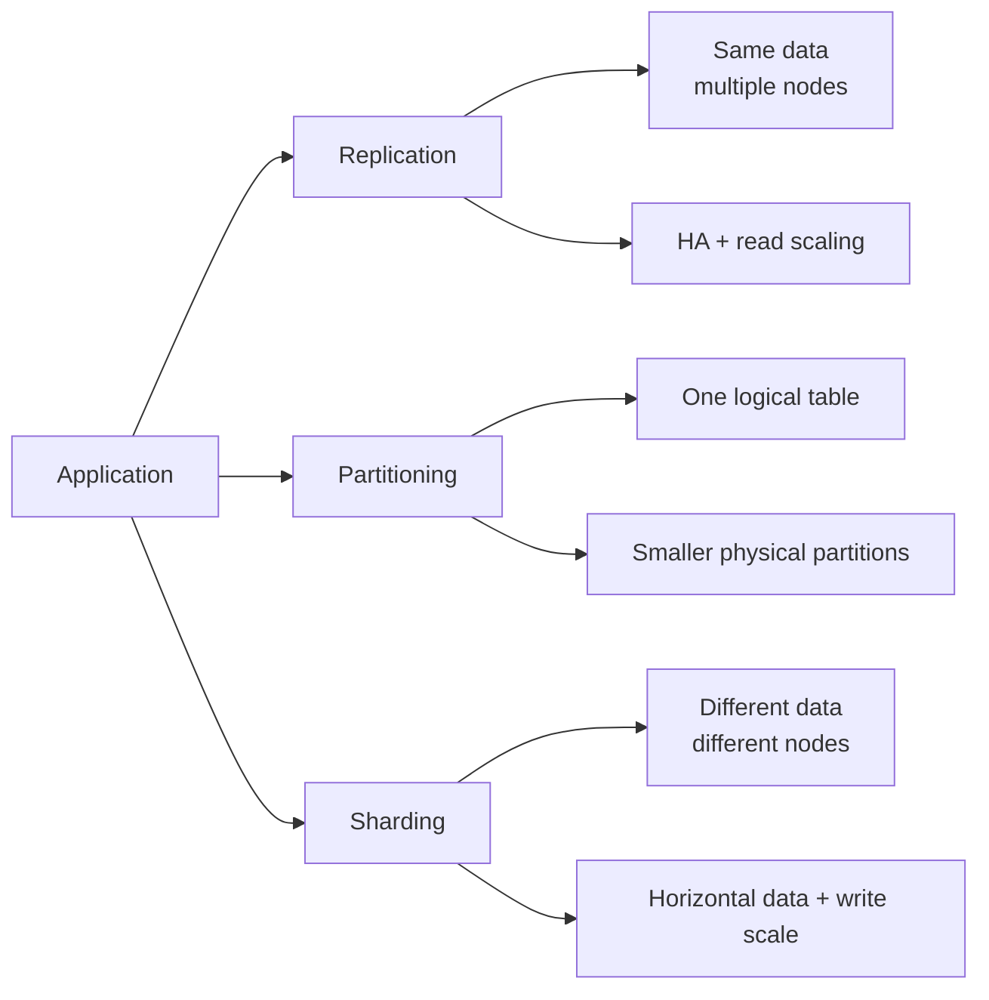

---

# 1. Big Picture

The easiest way to remember the difference is to ask **what is being distributed**.

| Technique | Main Goal | Data Placement | Typical Result |
|---|---|---|---|
| **Replication** | Availability and read scaling | Same rows copied to multiple nodes | More copies |
| **Partitioning** | Manage a large table | Rows divided into physical table partitions | Smaller storage units |
| **Sharding** | Horizontal scale | Different rows stored on different database nodes | More ownership units |

### Mental Model

```text
Replication  → "Where are the copies?"
Partitioning → "Which partition contains this row?"
Sharding     → "Which database node owns this row?"
```

A production system can use all three at the same time.

```text
tenant_id decides the shard
        ↓
each shard has primary + replica
        ↓
large audit tables are partitioned by month
```

---

# 2. Replication

Replication maintains copies of database changes on one or more additional nodes.

A common relational setup is **primary–replica replication**:

- The **primary** accepts writes.
- The **replicas** receive changes from the primary.
- Replicas may serve read-only traffic.
- A replica can be promoted if the primary fails.

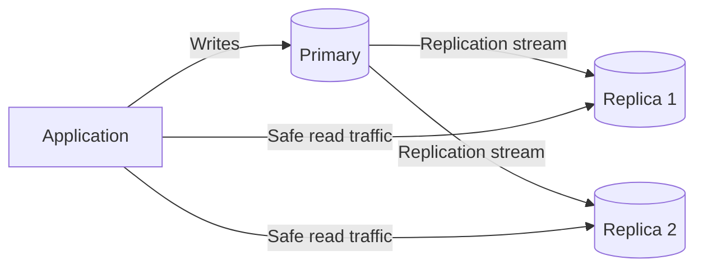

## 2.1 Why Replication Is Used

Replication is commonly used for:

- **High availability** — another node can take over after failure.
- **Read scaling** — read-only queries can be distributed across replicas.
- **Disaster recovery** — replicas can be placed in another availability zone or region.
- **Workload isolation** — reporting or backup work can run away from the primary.

Replication is **not a backup**. A bad `DELETE`, corrupted application write, or unwanted schema change can also replicate to the replicas.

### Write Scaling Note

With normal primary–replica architecture:

```text
Writes → Primary only
Reads  → Primary or replicas
```

Adding more replicas therefore does not increase the write capacity of the primary.

Multi-primary systems can accept writes on more than one node, but they introduce much harder conflict resolution and consistency rules.

---

## 2.2 How Replication Works

A simplified PostgreSQL-style flow looks like this:

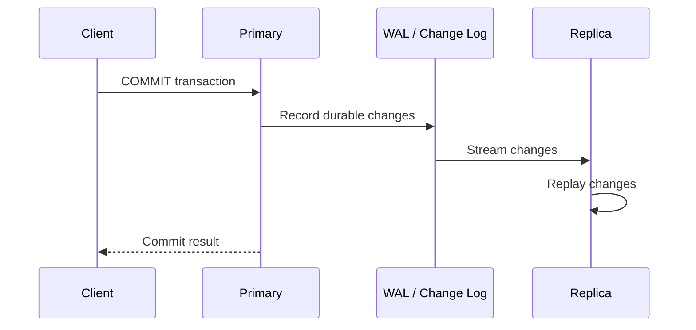

Relational databases commonly replicate from a change log:

- PostgreSQL → **WAL**
- MySQL → **binary log**
- SQL Server → **transaction log**

The exact point at which the client receives success depends on the replication mode.

---

## 2.3 Asynchronous vs Synchronous Replication

### Asynchronous Replication

The primary can acknowledge a commit without waiting for a replica.

```text
Client → Primary → Success
                  ↓
             Replica later
```

**Benefits**

- Lower write latency
- Replica slowdown does not normally block every commit

**Trade-off**

A primary can fail before its latest committed changes reach a replica. A failover may therefore lose recently acknowledged writes.

### Synchronous Replication

The primary waits for the required standby acknowledgment before reporting success.

```text
Client
  ↓
Primary
  ↓
Synchronous Replica
  ↓
Primary returns success
```

**Benefits**

- Stronger durability across nodes
- Lower risk of losing acknowledged transactions during failover

**Trade-offs**

- Higher commit latency
- A slow synchronous replica can affect application writes
- Cross-region synchronous replication can add significant network latency

### Semi-Synchronous Replication

Some systems provide a middle ground. For example, MySQL can wait until at least one replica has received and durably logged the transaction without requiring that the replica has already executed it.

| Mode | Wait for Replica? | Write Latency | Failover Data-Loss Risk |
|---|---:|---:|---:|
| Asynchronous | No | Lowest | Highest |
| Semi-synchronous | Partial acknowledgment | Medium | Lower |
| Synchronous | Required acknowledgment | Highest | Lowest when correctly configured |

---

## 2.4 Physical vs Logical Replication

### Physical Replication

Physical replication copies low-level database changes such as WAL records.

**Common use:** high availability and standby databases.

```text
Primary storage/WAL
        ↓
Replica replays low-level changes
```

### Logical Replication

Logical replication sends higher-level data changes such as inserts, updates, and deletes.

**Common use:**

- Selected-table replication
- Data migration
- Version upgrades
- Integration pipelines
- Analytics copies

```text
INSERT / UPDATE / DELETE
          ↓
   Logical change stream
          ↓
      Subscriber
```

In PostgreSQL, logical replication uses a **publisher/subscriber** model and can replicate a selected subset of data.

---

## 2.5 Replication Lag and Stale Reads

Replication lag is the delay between a change being committed on the primary and becoming visible on a replica.

Example:

```text
1. User updates profile name.
2. Primary commits successfully.
3. Application immediately reads from a replica.
4. Replica has not replayed the change yet.
5. User sees the old name.
```

This is a **stale read**.

### Practical Read Routing

Send consistency-sensitive reads to the primary:

- Payment confirmation
- Inventory reservation
- Permission changes
- Account balance
- Anything immediately dependent on a previous write

Replicas are usually safer for stale-tolerant workloads:

- Reports
- Search indexing
- Product/catalog browsing
- Background jobs
- Dashboards where a small delay is acceptable

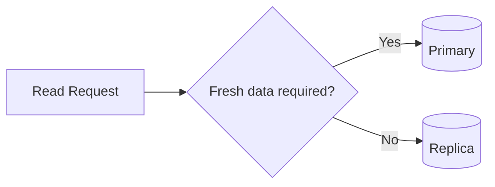

---

## 2.6 Failover

Failover promotes a replica when the primary becomes unavailable.

A reliable failover design must handle:

- Failure detection
- Replica promotion
- Application reconnection
- Preventing two writable primaries
- Reconfiguring remaining replicas
- Rejoining or rebuilding the old primary

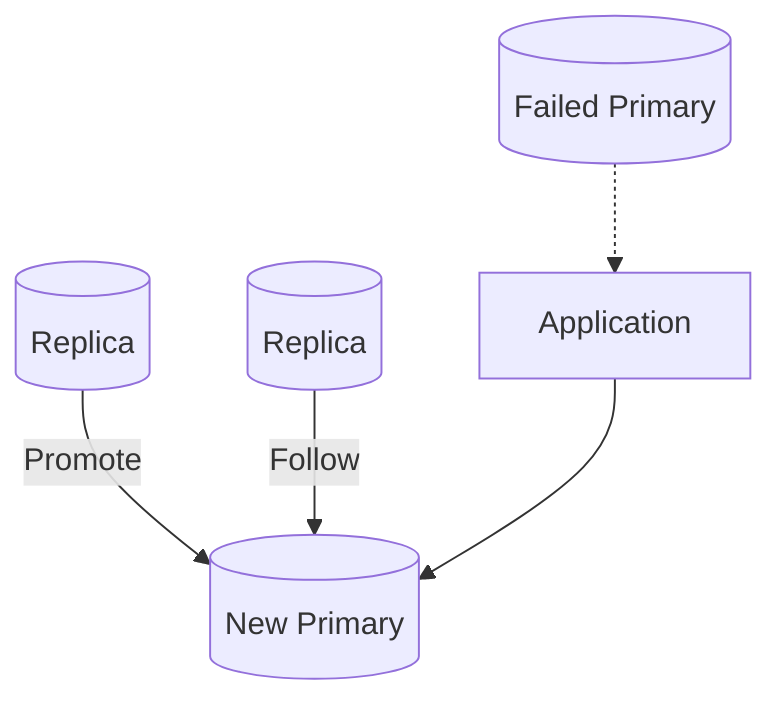

The dangerous failure mode is **split-brain**, where two nodes accept writes as primary. Production systems use fencing, quorum, consensus, or a trusted cluster manager to prevent it.

---

# 3. Partitioning

Partitioning divides a large logical table into smaller physical tables called **partitions**.

The application normally continues querying the parent table.

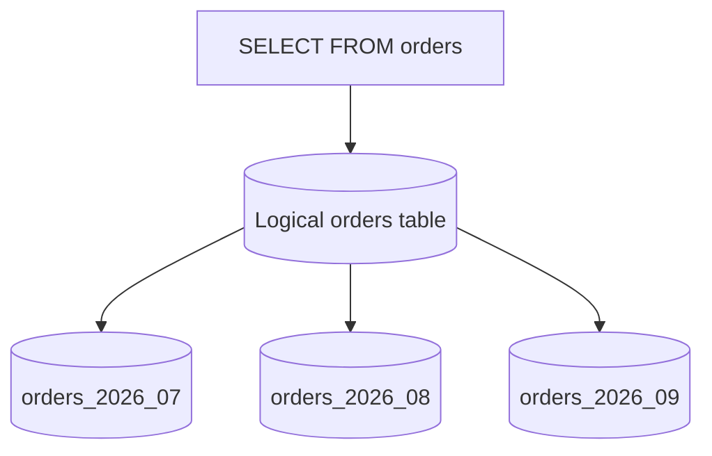

Partitioning is useful when:

- One table becomes very large
- Queries normally access a predictable subset of rows
- Old data must be removed or archived by period
- Indexes and maintenance on one giant table become expensive

Partitioning is **not automatically faster**. The important performance feature is **partition pruning**.

---

## 3.1 Common Partitioning Strategies

### Range Partitioning

Rows are grouped by ranges.

```text
July 2026   → orders_2026_07
August 2026 → orders_2026_08
September   → orders_2026_09
```

Common for:

- Orders
- Transactions
- Audit logs
- Time-series data

### List Partitioning

Rows are grouped by explicit values.

```text
IN → customers_india
US → customers_usa
EU → customers_europe
```

Useful for region, business unit, category, or regulatory grouping.

### Hash Partitioning

The database hashes a key and places rows into buckets.

```text
hash(customer_id) % 4

0 → partition_0
1 → partition_1
2 → partition_2
3 → partition_3
```

Useful when even distribution matters more than human-readable boundaries.

| Strategy | Best Fit | Main Trade-off |
|---|---|---|
| Range | Time/range queries and retention | Current range can become hot |
| List | Known regions/categories | New values require handling |
| Hash | Even distribution | Harder range-based lifecycle operations |

> **Vertical partitioning** is different: it separates columns into multiple tables, usually to keep frequently read rows narrow. Declarative database partitioning normally refers to horizontal row partitioning.

---

## 3.2 Partition Pruning

Partition pruning allows the optimizer to skip partitions that cannot contain matching rows.

Assume `orders` is partitioned by `order_date`.

```sql
SELECT order_id, customer_id, total_amount
FROM orders
WHERE order_date >= DATE '2026-07-01'
  AND order_date <  DATE '2026-08-01';
```

The database can potentially scan only:

```text
orders_2026_07
```

instead of:

```text
orders_2026_01
orders_2026_02
orders_2026_03
...
orders_2026_07
...
```

### Important Rule

Queries benefit most when filters align with the partition key and boundaries.

Prefer:

```sql
WHERE created_at >= TIMESTAMP '2026-07-01 00:00:00'
  AND created_at <  TIMESTAMP '2026-08-01 00:00:00'
```

rather than hiding the key inside unnecessary expressions.

Use `EXPLAIN` or `EXPLAIN ANALYZE` to confirm that unrelated partitions are actually being pruned.

---

## 3.3 PostgreSQL Range Partitioning Example

Create the logical parent table:

```sql
CREATE TABLE orders (
    order_id      BIGINT GENERATED ALWAYS AS IDENTITY,
    customer_id   BIGINT NOT NULL,
    order_date    DATE NOT NULL,
    status        VARCHAR(30) NOT NULL,
    total_amount  NUMERIC(12, 2) NOT NULL,
    PRIMARY KEY (order_id, order_date)
) PARTITION BY RANGE (order_date);
```

Create monthly partitions:

```sql
CREATE TABLE orders_2026_07
PARTITION OF orders
FOR VALUES FROM ('2026-07-01') TO ('2026-08-01');

CREATE TABLE orders_2026_08
PARTITION OF orders
FOR VALUES FROM ('2026-08-01') TO ('2026-09-01');
```

Insert through the parent:

```sql
INSERT INTO orders (
    customer_id,
    order_date,
    status,
    total_amount
)
VALUES (
    501,
    DATE '2026-07-27',
    'CONFIRMED',
    249.99
);
```

PostgreSQL routes the row to the matching partition.

Verify pruning:

```sql
EXPLAIN (ANALYZE, BUFFERS)
SELECT order_id, status, total_amount
FROM orders
WHERE order_date >= DATE '2026-07-01'
  AND order_date <  DATE '2026-08-01'
  AND customer_id = 501;
```

### Operational Value

For time-based data, dropping or detaching an old partition is usually much simpler than deleting millions of rows one by one.

```text
Create future partition
        ↓
Write active data
        ↓
Query recent partitions
        ↓
Archive / detach old partition
        ↓
Drop when retention allows
```

Avoid creating unnecessarily tiny partitions. Too many partitions increase planning and operational overhead.

---

# 4. Sharding

Sharding distributes different subsets of a logical dataset across independent database nodes.

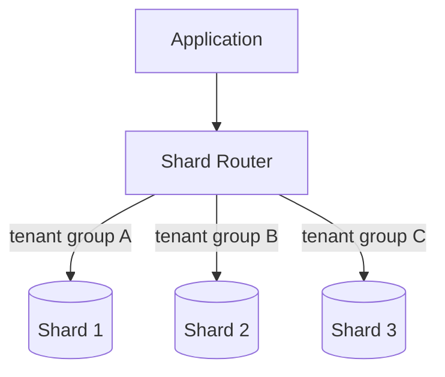

Sharding becomes relevant when a single writable database node is reaching limits such as:

- Write throughput
- CPU
- Memory
- Storage size
- Disk I/O
- Index size
- Maintenance window
- Tenant-isolation requirements

Unlike partitioning, sharding normally means **independent ownership on different database nodes**.

---

## 4.1 Shard Routing

Every request needs a deterministic answer to:

> Which shard owns this data?

A simple strategy might be:

```text
shard_number = hash(tenant_id) % number_of_shards
```

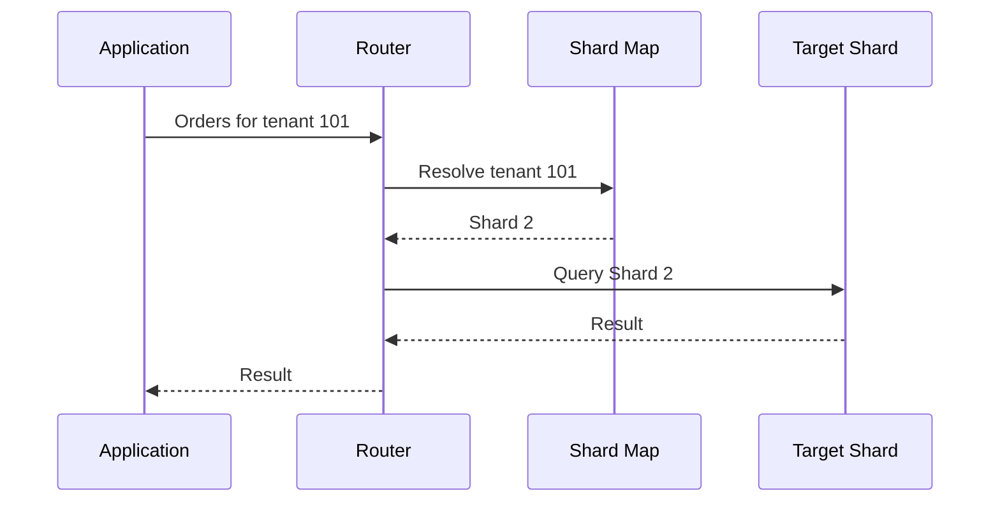

Routing may live in:

- Application data-access code
- A proxy
- Middleware
- A distributed database coordinator

Keep shard-routing rules centralized so different services do not disagree about data ownership.

---

## 4.2 Common Sharding Strategies

### Range-Based Sharding

```text
Shard 1 → customer_id 1–1,000,000
Shard 2 → customer_id 1,000,001–2,000,000
Shard 3 → customer_id 2,000,001–3,000,000
```

**Good:** simple routing and range queries  
**Risk:** sequential IDs can push most new writes to the newest shard.

### Hash-Based Sharding

```text
hash(customer_id) % N → shard
```

**Good:** usually better distribution  
**Risk:** range queries may touch many shards, and changing shard count can move a lot of data.

### Directory-Based Sharding

```text
tenant_101 → shard_3
tenant_102 → shard_1
tenant_103 → shard_3
```

**Good:** flexible placement and easier tenant migration  
**Risk:** the shard map becomes critical infrastructure.

### Geography-Based Sharding

```text
India users → India shard
EU users    → EU shard
US users    → US shard
```

Useful for latency and data-residency requirements, but global workflows become harder.

### Tenant-Based Sharding

```text
tenant_id → shard
```

This is a natural fit for many SaaS systems because most requests already belong to one tenant.

---

## 4.3 Choosing a Shard Key

The shard key determines both **data distribution** and **request distribution**.

A strong shard key normally has:

1. **High cardinality** — many distinct values
2. **Even data distribution**
3. **Even traffic distribution**
4. **Query locality** — common requests identify one shard
5. **Stability** — the value rarely changes
6. **Business locality** — related data stays together

### Good SaaS Choice

```text
shard key = tenant_id
```

Then a tenant's related records can live together:

```text
Tenant 101
├── users
├── orders
├── invoices
├── permissions
└── audit events
```

This keeps most reads, joins, and transactions local to one shard.

### Weak Choice Example

```text
shard key = created_at
```

If all new writes target the newest time range, one shard can become a hotspot.

### Data Skew vs Traffic Skew

These are different problems:

```text
Data skew:
Shard A stores 70% of rows.

Traffic skew:
Shard B stores 20% of rows but receives 80% of requests.
```

A shard key must be evaluated against **both**.

---

## 4.4 Single-Shard vs Scatter-Gather Queries

### Single-Shard Query

```sql
SELECT order_id, status, total_amount
FROM orders
WHERE tenant_id = 101
  AND order_id = 98765;
```

Because `tenant_id` is available, the router can directly choose one shard.

```text
Request → tenant_id 101 → Shard 2 → Result
```

### Scatter-Gather Query

```sql
SELECT COUNT(*)
FROM orders
WHERE status = 'FAILED';
```

If the query does not include the shard key, it may need to run on every shard.

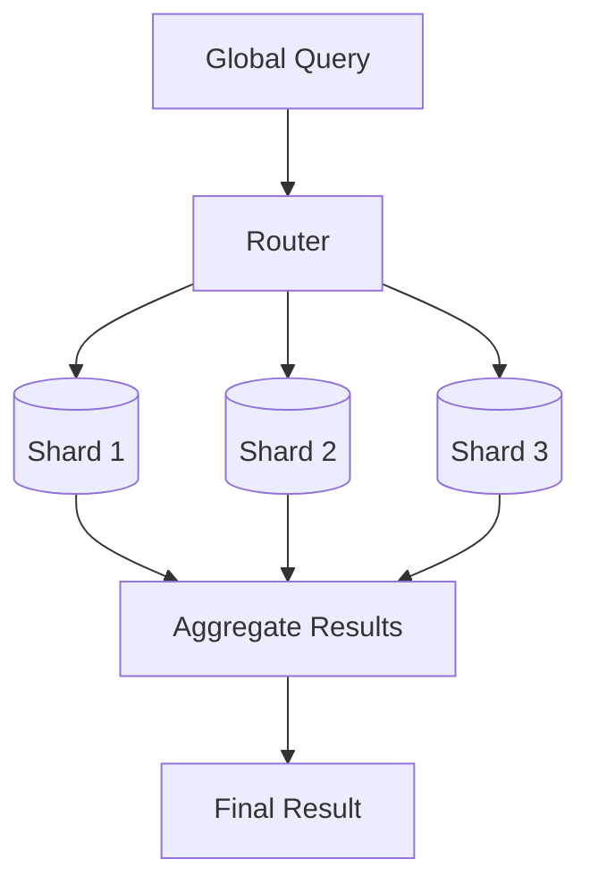

Scatter-gather is more expensive because:

- More nodes participate
- More network traffic is required
- Results must be merged
- Latency can be limited by the slowest shard

---

## 4.5 Cross-Shard Operations

This is the main cost of sharding.

### Cross-Shard Joins

If related rows are placed on different shards, the database or application may need to fetch data from multiple nodes and combine it.

### Cross-Shard Transactions

Example:

```text
Shard A → debit account 100
Shard B → credit account 200
```

Maintaining atomicity across both shards is much harder than a normal local transaction.

Possible distributed approaches include:

- Two-phase commit
- Saga workflow
- Transactional outbox
- Idempotent operations
- Compensating actions

The best design is often to keep frequently modified data in the **same shard**.

### Global Constraints

Sharding also complicates:

- Global uniqueness
- Foreign keys across shards
- Global sequence numbers
- Database-wide aggregates

Common approaches include globally safe identifiers such as UUIDs/ULIDs and application-level or dedicated services for constraints that must span shards.

---

## 4.6 Rebalancing and Resharding

Eventually one shard may become too large or too busy.

A typical online resharding flow is:

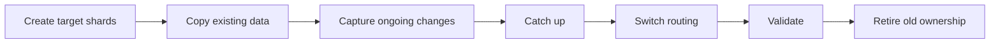

A safe migration needs:

- Data copy
- Change capture during migration
- Controlled routing cutover
- Consistency validation
- Idempotent retries
- Rollback strategy

### Virtual Buckets

Instead of mapping keys directly to physical shards:

```text
hash(tenant_id) % 1024 → virtual bucket
virtual bucket → physical shard
```

Rebalancing can then move selected buckets between physical shards without redefining ownership for every row.

---

# 5. How the Three Work Together

Use one practical SaaS example.

Assume an application stores orders and audit events for many tenants.

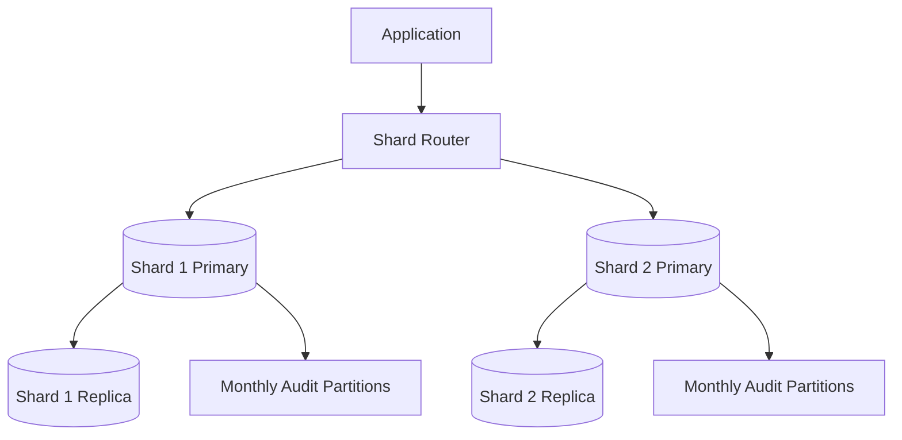

## Request Flow

```text
1. Request contains tenant_id = 101.
2. Router maps tenant 101 to Shard 2.
3. The write goes to Shard 2 primary.
4. The primary replicates the change to its replica.
5. If the target table is partitioned, PostgreSQL routes the row to the
   correct monthly partition.
```

Each layer solves a different problem:

| Layer | Responsibility |
|---|---|
| **Sharding** | Chooses which database group owns the tenant |
| **Replication** | Protects that shard and can serve safe read traffic |
| **Partitioning** | Organizes a very large table inside that shard |

This combined design is common because the techniques are complementary rather than alternatives.

---

# 6. Choosing the Right Technique

Start with the actual bottleneck instead of choosing a distributed architecture too early.

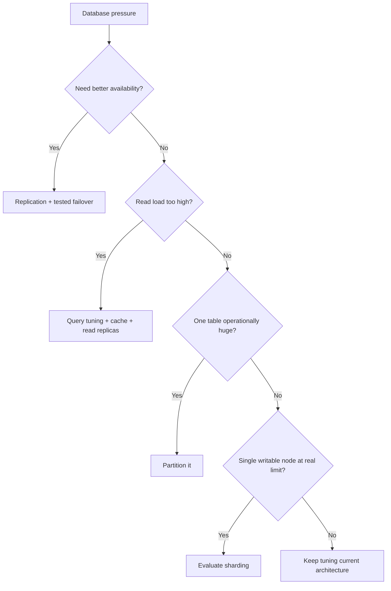

## Practical Scaling Order

```text
1. Measure the bottleneck
2. Fix inefficient queries
3. Add correct indexes
4. Use connection pooling
5. Add caching where useful
6. Scale the database vertically when reasonable
7. Add replication for HA/read scale
8. Partition very large tables
9. Archive cold data
10. Shard when one writable node is still the limiting factor
```

Sharding should normally be a measured decision, not a default design for an application that may become large someday.

---

# 7. Operational Best Practices

## Replication

- Monitor replica health and replication lag.
- Route consistency-sensitive reads to the primary.
- Test failover before calling the system highly available.
- Protect against split-brain.
- Monitor retained WAL/binlogs and replication slots.
- Keep independent backups.

## Partitioning

- Choose a partition key that appears in common filters.
- Align boundaries with retention and query windows.
- Automate future partition creation.
- Verify pruning with `EXPLAIN`.
- Avoid unnecessarily large partition counts.
- Monitor default partitions when used.

## Sharding

- Prefer stable, high-cardinality shard keys.
- Keep related data and transactions on the same shard.
- Minimize request-time scatter-gather queries.
- Monitor per-shard CPU, storage, latency, and traffic.
- Plan resharding before a shard becomes full.
- Keep the shard map strongly controlled.
- Design migrations and retries to be idempotent.
- Provide high availability for every shard independently.

---

# 8. Final Mental Model

```text
REPLICATION
Same data, more copies

Primary
 ├── Replica A
 └── Replica B


PARTITIONING
One logical table, smaller physical sections

orders
 ├── orders_2026_07
 ├── orders_2026_08
 └── orders_2026_09


SHARDING
Different data, different database owners

Shard 1 → Tenants A–H
Shard 2 → Tenants I–P
Shard 3 → Tenants Q–Z
```

The most useful interview-level distinction is:

> **Replication duplicates data ownership for availability/read scale, partitioning organizes a large table into manageable physical units, and sharding distributes data ownership across database nodes for horizontal scale.**

---

# 9. References

Checked against current official documentation available in August 2026:

- PostgreSQL 18 — Table Partitioning: https://www.postgresql.org/docs/18/ddl-partitioning.html
- PostgreSQL 18 — High Availability, Load Balancing, and Replication: https://www.postgresql.org/docs/18/high-availability.html
- PostgreSQL 18 — Log-Shipping Standby Servers: https://www.postgresql.org/docs/18/warm-standby.html
- PostgreSQL 18 — Logical Replication: https://www.postgresql.org/docs/18/logical-replication.html
- MySQL 8.4 — Semi-Synchronous Replication: https://dev.mysql.com/doc/refman/8.4/en/replication-semisync.html
- MySQL 8.4 — Partitioning: https://dev.mysql.com/doc/refman/8.4/en/partitioning.html
- MongoDB — Sharding: https://www.mongodb.com/docs/manual/sharding/
- MongoDB — Shard Keys: https://www.mongodb.com/docs/manual/core/sharding-shard-key/
- Vitess — Sharding Concepts: https://vitess.io/docs/
