# Replication, Sharding & Partitioning

> A practical guide to three database-scaling techniques that sound similar but solve different problems.

---

## Index

1. [The Big Picture](#1-the-big-picture)
2. [Replication](#2-replication)
   - [How Replication Works](#21-how-replication-works)
   - [Replication Topologies](#22-replication-topologies)
   - [Synchronous vs Asynchronous Replication](#23-synchronous-vs-asynchronous-replication)
   - [Physical vs Logical Replication](#24-physical-vs-logical-replication)
   - [Read Scaling and Consistency](#25-read-scaling-and-consistency)
   - [Failover and Replication Lag](#26-failover-and-replication-lag)
3. [Partitioning](#3-partitioning)
   - [Horizontal vs Vertical Partitioning](#31-horizontal-vs-vertical-partitioning)
   - [Range, List and Hash Partitioning](#32-range-list-and-hash-partitioning)
   - [Partition Pruning](#33-partition-pruning)
   - [PostgreSQL Partitioning Example](#34-postgresql-partitioning-example)
   - [Partition Lifecycle Management](#35-partition-lifecycle-management)
4. [Sharding](#4-sharding)
   - [How Sharding Works](#41-how-sharding-works)
   - [Sharding Strategies](#42-sharding-strategies)
   - [Choosing a Shard Key](#43-choosing-a-shard-key)
   - [Routing Queries](#44-routing-queries)
   - [Cross-Shard Operations](#45-cross-shard-operations)
   - [Rebalancing and Resharding](#46-rebalancing-and-resharding)
5. [Replication vs Partitioning vs Sharding](#5-replication-vs-partitioning-vs-sharding)
6. [How They Work Together](#6-how-they-work-together)
7. [Practical Architecture Examples](#7-practical-architecture-examples)
8. [Choosing the Right Technique](#8-choosing-the-right-technique)
9. [Operational Monitoring](#9-operational-monitoring)
10. [Best Practices](#10-best-practices)
11. [Final Mental Model](#11-final-mental-model)
12. [References](#12-references)

---

# 1. The Big Picture

Replication, partitioning and sharding all involve placing data in more than one physical location. The difference is **why** and **how** the data is divided.

| Technique | Main Purpose | What Happens to Data? |
|---|---|---|
| **Replication** | Availability and read scaling | The same data is copied to multiple database nodes |
| **Partitioning** | Manage a large table efficiently | One table is split into smaller physical sections |
| **Sharding** | Scale data and writes across servers | Different subsets of data are stored on different database nodes |

A simple mental model:

```text
Replication = Copy the data
Partitioning = Split a table
Sharding    = Split the database across servers
```

## Core Architecture View

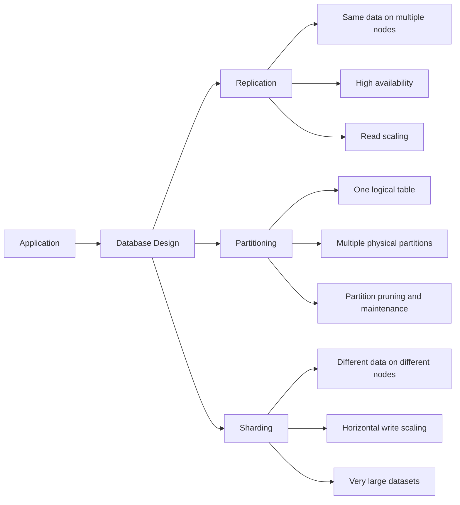

These techniques are not mutually exclusive. A production system may use all three:

- The application data is sharded by `tenant_id`.
- Each shard has a primary and two replicas.
- Large event tables inside every shard are partitioned by month.

---

# 2. Replication

Replication keeps copies of database data on multiple nodes.

The node that accepts writes is commonly called the **primary**, **leader** or **source**. Nodes receiving copied changes are commonly called **replicas**, **followers** or **standbys**.

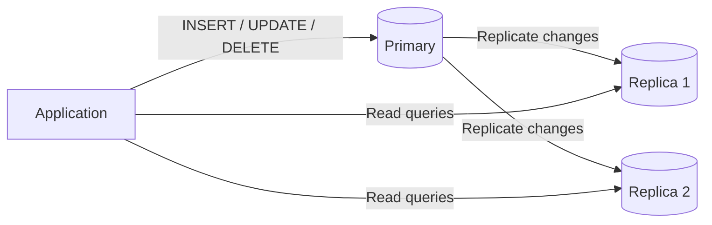

## Why Replication Is Used

Replication commonly provides:

- **High availability:** a replica can be promoted if the primary fails.
- **Read scaling:** read-only traffic can be distributed across replicas.
- **Disaster recovery:** a copy may be maintained in another availability zone or region.
- **Maintenance flexibility:** backups and analytical queries can run on replicas.
- **Data distribution:** selected data can be copied to reporting or integration systems.

Replication does **not automatically scale write throughput** when all writes still go to one primary.

---

## 2.1 How Replication Works

A typical replication flow is:

1. A client commits a transaction on the primary.
2. The primary records the change in a durable change log.
3. Replicas receive the log records or logical row changes.
4. Each replica replays or applies those changes.
5. Read traffic may be served from replicas after the changes are applied.

Examples of database change logs include:

- PostgreSQL Write-Ahead Log, or WAL
- MySQL binary log, or binlog
- SQL Server transaction log

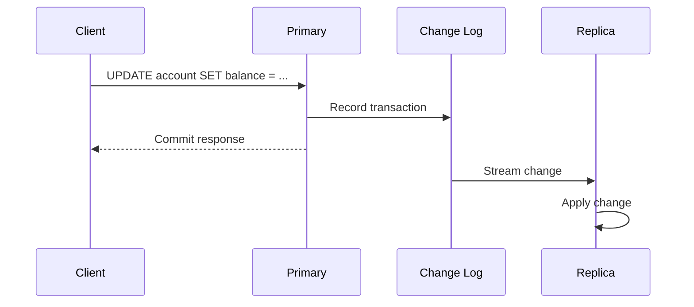

The exact commit timing depends on whether replication is synchronous or asynchronous.

---

## 2.2 Replication Topologies

### Primary–Replica

One primary accepts writes and one or more replicas receive changes.

```text
                  ┌─────────────┐
Writes ──────────▶│   Primary   │
                  └──────┬──────┘
                         │
              ┌──────────┴──────────┐
              ▼                     ▼
       ┌─────────────┐       ┌─────────────┐
Reads  │  Replica A  │       │  Replica B  │
       └─────────────┘       └─────────────┘
```

This is the most common topology for relational databases.

### Cascading Replication

A replica forwards changes to another replica.

```text
Primary ──▶ Replica A ──▶ Replica B
```

This reduces the number of direct replication connections to the primary, but Replica B may have more lag.

### Multi-Primary

Multiple nodes accept writes.

```text
Primary A ◀────────▶ Primary B
```

This can improve regional write availability, but conflict handling becomes significantly more complex. The system must define what happens when two nodes modify the same record concurrently.

### Multi-Region Replication

Copies are placed in different regions.

```text
India Primary ───────▶ Singapore Replica
       │
       └─────────────▶ Europe Replica
```

This improves disaster recovery and regional reads, but network latency affects replication delay and synchronous commit latency.

---

## 2.3 Synchronous vs Asynchronous Replication

### Asynchronous Replication

The primary confirms the commit without waiting for a replica to acknowledge it.

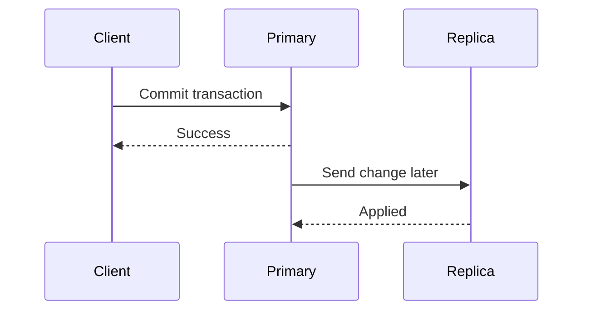

**Advantages**

- Lower write latency
- Primary can continue if replicas are temporarily unavailable
- Suitable when small replication delays are acceptable

**Trade-off**

If the primary fails before the latest changes reach a replica, recently acknowledged transactions may be lost during failover.

### Synchronous Replication

The primary waits for acknowledgment from one or more replicas before reporting success.

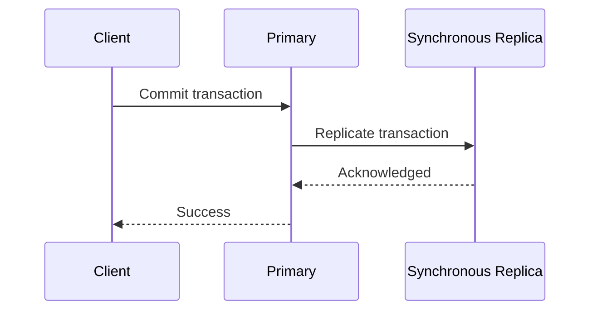

**Advantages**

- Stronger durability across nodes
- Lower risk of data loss during primary failure

**Trade-offs**

- Higher write latency
- Slow or unavailable synchronous replicas can delay commits
- Cross-region synchronous replication may be expensive in latency

### Semi-Synchronous Replication

Semi-synchronous replication sits between the two models. The source waits for at least one replica acknowledgment, but the exact acknowledgment point may not mean the transaction is already visible to queries on that replica.

| Mode | Commit Waits for Replica? | Typical Latency | Data-Loss Risk During Failover |
|---|---:|---:|---:|
| Asynchronous | No | Lowest | Highest of the three |
| Semi-synchronous | Partially | Medium | Lower |
| Synchronous | Yes | Highest | Lowest when configured correctly |

---

## 2.4 Physical vs Logical Replication

### Physical Replication

Physical replication copies low-level storage changes or database log records.

**Characteristics**

- Usually replicates the whole database cluster or instance
- Replica structure closely matches the primary
- Efficient for high availability
- Often requires compatible database versions and storage formats
- Commonly used for hot standby replicas

```text
Primary storage changes
        │
        ▼
WAL / transaction log
        │
        ▼
Standby replays low-level changes
```

### Logical Replication

Logical replication copies higher-level changes such as inserted, updated and deleted rows.

**Characteristics**

- Can replicate selected tables
- Can support data filtering in systems that provide the feature
- Useful for migrations, integrations and analytics pipelines
- May support replication between different major versions
- Schema changes often require separate coordination

```text
INSERT order...
UPDATE customer...
DELETE session...
        │
        ▼
Logical change stream
        │
        ▼
Subscriber applies row-level changes
```

| Area | Physical Replication | Logical Replication |
|---|---|---|
| Replication unit | Storage/log-level changes | Tables or row-level changes |
| Typical purpose | HA and full standby | Migration, integration, selective replication |
| Schema flexibility | Low | Higher, but schemas must remain compatible |
| Cross-version use | Usually limited | Often more practical |
| Replicate subset | Usually no | Often yes |

---

## 2.5 Read Scaling and Consistency

An application may send writes to the primary and reads to replicas.

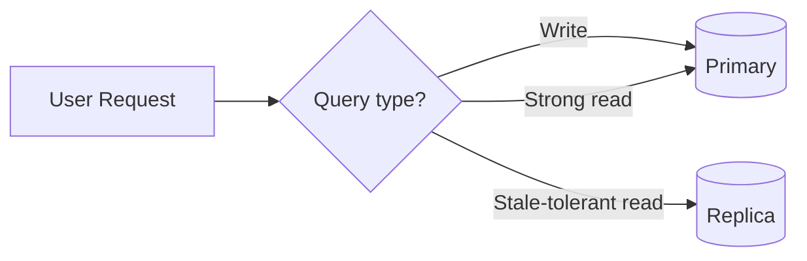

This introduces an important problem: **read-after-write consistency**.

### Example

1. A user changes their profile name.
2. The write succeeds on the primary.
3. The application immediately reads from a lagging replica.
4. The old name is returned.

This is called a **stale read**.

### Common Solutions

- Read from the primary after a user performs a write.
- Use session stickiness for a short period.
- Wait until a replica reaches the required log position.
- Route consistency-sensitive queries to the primary.
- Use replicas only for workloads where small delays are acceptable.

Good replica workloads include:

- Product catalog browsing
- Reports
- Search indexing
- Dashboard data with delayed freshness
- Background jobs

Primary reads are safer for:

- Payment confirmation
- Inventory reservation
- Permission changes
- Account balance checks
- Workflows that immediately depend on a previous write

---

## 2.6 Failover and Replication Lag

### Failover

Failover promotes a replica to become the new primary after the current primary becomes unavailable.

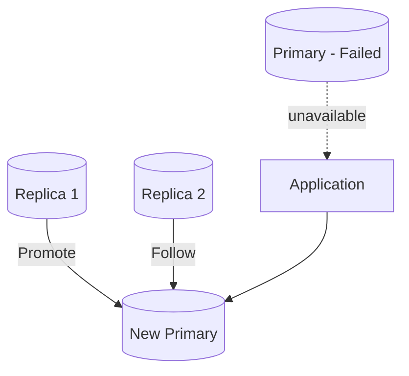

A reliable failover process must handle:

- Failure detection
- Leader election or promotion
- Client connection redirection
- Prevention of two writable primaries
- Recovery of the old primary
- Replica reconfiguration
- Validation of possible data loss

### Split-Brain

Split-brain happens when two nodes both believe they are the primary and accept conflicting writes.

Prevent it with:

- Quorum-based election
- Fencing the old primary
- Reliable consensus or cluster management
- A single authoritative routing layer
- Careful network-partition handling

### Replication Lag

Replication lag is the delay between a change being committed on the primary and applied on the replica.

Lag may increase because of:

- Heavy write traffic
- Long-running transactions
- Slow network links
- Replica CPU or disk pressure
- Locks on the replica
- Large schema changes
- A replica applying changes with insufficient parallelism

Monitor both:

- **Time lag:** approximately how many seconds behind
- **Position lag:** difference in WAL, binlog or log sequence position

A replica showing low time lag can still be unsafe if monitoring is inaccurate or replication is stopped. Monitor replication state as well as the lag value.

---

# 3. Partitioning

Partitioning divides a logically large table into smaller physical pieces called **partitions**.

The application normally queries the parent table as if it were one table.

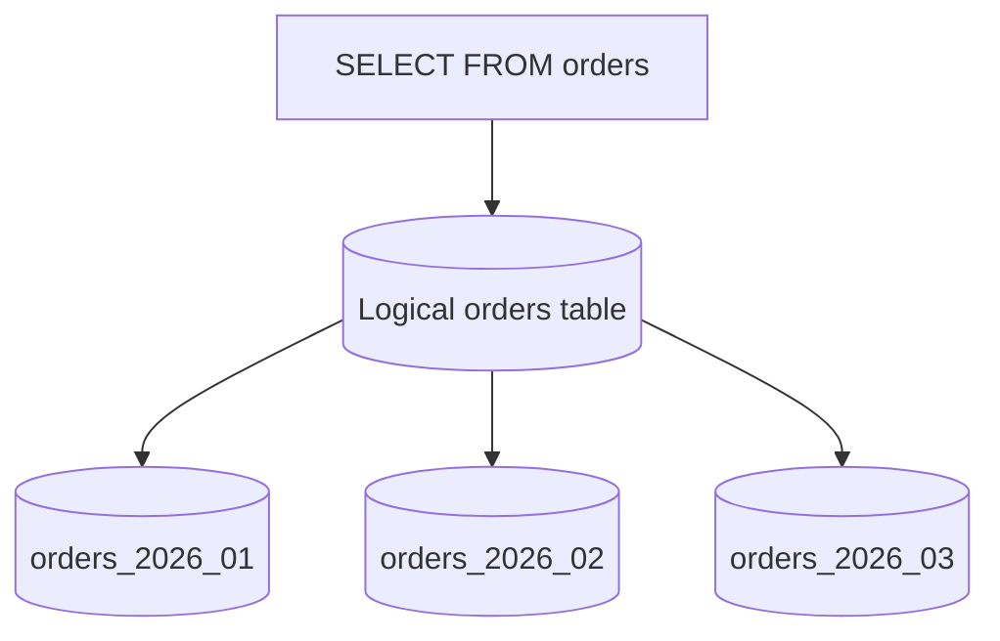

Partitioning usually happens inside one logical database system. It improves table management and may improve queries when the database can avoid scanning irrelevant partitions.

## Why Partition a Table?

Partitioning is useful when:

- A table is very large.
- Queries usually access a predictable subset of rows.
- Old data must be archived or deleted regularly.
- Data is naturally grouped by date, region, tenant or category.
- Different groups of data need different storage policies.
- Indexes on a single huge table are becoming difficult to maintain.

Partitioning is not automatically faster. Queries improve mainly when the partition key matches access patterns and the optimizer can perform partition pruning.

---

## 3.1 Horizontal vs Vertical Partitioning

### Horizontal Partitioning

Rows are divided based on a key.

```text
orders_2026_h1 → rows from January to June
orders_2026_h2 → rows from July to December
```

Each partition has the same columns but different rows.

```text
┌──────────┬────────────┬───────────┐
│ order_id │ order_date │ amount    │
├──────────┼────────────┼───────────┤
│ 101      │ 2026-01-10 │ 120.00    │ ──▶ Partition: 2026 Q1
│ 102      │ 2026-05-02 │ 350.00    │ ──▶ Partition: 2026 Q2
│ 103      │ 2026-09-15 │ 210.00    │ ──▶ Partition: 2026 Q3
└──────────┴────────────┴───────────┘
```

### Vertical Partitioning

Columns are divided into separate tables, usually sharing the same identifier.

```text
users
- user_id
- name
- email

user_profiles
- user_id
- biography
- avatar
- preferences_json
```

Vertical partitioning is useful when:

- Some columns are large and rarely needed.
- Frequently accessed rows should remain narrow.
- Sensitive columns need stricter access controls.
- Different column groups have different storage or access patterns.

This guide mainly focuses on **horizontal table partitioning**, because that is what SQL databases usually mean by declarative partitioning.

---

## 3.2 Range, List and Hash Partitioning

### Range Partitioning

Rows are assigned based on value ranges.

Common keys:

- Date and timestamp
- Numeric identifiers
- Sequential business periods

```text
orders_2026_01: 2026-01-01 <= order_date < 2026-02-01
orders_2026_02: 2026-02-01 <= order_date < 2026-03-01
```

**Best for**

- Time-series data
- Audit logs
- Orders
- Transactions
- Events

**Strength**

Old partitions can be archived or removed efficiently.

**Risk**

A “current” partition can become a write hotspot while old partitions receive little traffic.

### List Partitioning

Rows are assigned using explicit values.

```text
customers_india  → country_code = 'IN'
customers_usa    → country_code = 'US'
customers_europe → country_code IN ('DE', 'FR', 'IT', ...)
```

**Best for**

- Regions
- Business units
- Product categories
- Regulatory boundaries

**Risk**

New values may not have a valid partition unless a default partition exists or DDL is updated.

### Hash Partitioning

The database hashes a key and distributes rows by remainder.

```text
hash(customer_id) % 4

Remainder 0 → partition_0
Remainder 1 → partition_1
Remainder 2 → partition_2
Remainder 3 → partition_3
```

**Best for**

- Even row distribution
- Keys without meaningful ranges
- Reducing concentration on a single partition

**Trade-off**

Hash boundaries do not match human-readable business ranges, so operations such as deleting “all data before January” are less convenient.

### Comparison

| Type | Distribution Rule | Strong Use Case | Main Concern |
|---|---|---|---|
| Range | Value interval | Time-series and lifecycle management | Uneven traffic or hotspot |
| List | Explicit values | Region or category | New/unmapped values |
| Hash | Hash remainder | Even distribution | Harder range-based maintenance |

---

## 3.3 Partition Pruning

Partition pruning means the optimizer excludes partitions that cannot contain matching rows.

Assume `orders` is partitioned by `order_date`.

```sql
SELECT order_id, customer_id, total_amount
FROM orders
WHERE order_date >= DATE '2026-07-01'
  AND order_date <  DATE '2026-08-01';
```

The database may scan only the July 2026 partition.

```text
Without pruning:
Query → Scan Jan + Feb + Mar + ... + Jul + Aug + ...

With pruning:
Query → Scan Jul only
```

Partition pruning works best when:

- The query filters directly on the partition key.
- Data types match.
- Predicates are simple enough for the optimizer.
- Partition boundaries match normal query ranges.

A partitioned table can still perform badly when every query touches all partitions.

### Good Predicate

```sql
WHERE created_at >= TIMESTAMP '2026-07-01 00:00:00'
  AND created_at <  TIMESTAMP '2026-08-01 00:00:00'
```

### Less Helpful Predicate

```sql
WHERE EXTRACT(MONTH FROM created_at) = 7
```

The second form may make pruning harder depending on the database and partition expression. Prefer filtering in a form aligned with partition boundaries.

---

## 3.4 PostgreSQL Partitioning Example

The following example uses range partitioning by month.

```sql
CREATE TABLE orders (
    order_id      BIGINT GENERATED ALWAYS AS IDENTITY,
    customer_id   BIGINT NOT NULL,
    order_date    DATE NOT NULL,
    status        VARCHAR(30) NOT NULL,
    total_amount  NUMERIC(12, 2) NOT NULL,
    PRIMARY KEY (order_id, order_date)
) PARTITION BY RANGE (order_date);
```

Create monthly partitions:

```sql
CREATE TABLE orders_2026_07
PARTITION OF orders
FOR VALUES FROM ('2026-07-01') TO ('2026-08-01');

CREATE TABLE orders_2026_08
PARTITION OF orders
FOR VALUES FROM ('2026-08-01') TO ('2026-09-01');
```

Create indexes on frequently queried columns:

```sql
CREATE INDEX idx_orders_2026_07_customer
    ON orders_2026_07 (customer_id);

CREATE INDEX idx_orders_2026_08_customer
    ON orders_2026_08 (customer_id);
```

Insert through the parent table:

```sql
INSERT INTO orders (
    customer_id,
    order_date,
    status,
    total_amount
)
VALUES (
    501,
    DATE '2026-07-27',
    'CONFIRMED',
    249.99
);
```

PostgreSQL routes the row to the matching partition.

Query the parent table:

```sql
SELECT order_id, status, total_amount
FROM orders
WHERE order_date >= DATE '2026-07-01'
  AND order_date <  DATE '2026-08-01'
  AND customer_id = 501;
```

Inspect the execution plan:

```sql
EXPLAIN (ANALYZE, BUFFERS)
SELECT order_id, status, total_amount
FROM orders
WHERE order_date >= DATE '2026-07-01'
  AND order_date <  DATE '2026-08-01'
  AND customer_id = 501;
```

Confirm that unrelated partitions are not scanned.

### Default Partition

A default partition can capture rows that do not match existing boundaries.

```sql
CREATE TABLE orders_default
PARTITION OF orders DEFAULT;
```

A default partition prevents immediate insert failures, but it should be monitored. Rows accumulating there often indicate missing partition creation or invalid data.

---

## 3.5 Partition Lifecycle Management

Time-based partitioning should be treated as an automated lifecycle.

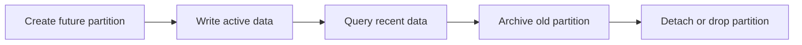

### Recommended Automation

Before each period begins:

1. Create future partitions.
2. Create required indexes.
3. Apply privileges.
4. Apply constraints.
5. Verify monitoring detects missing partitions.

For old periods:

1. Stop or verify writes to the partition.
2. Detach the partition if it must remain queryable separately.
3. Export or archive it when required.
4. Drop it when retention rules allow.

Dropping an old partition is usually much faster and operationally simpler than deleting millions of individual rows.

### Partition Count

More partitions are not always better.

Too many partitions can increase:

- Planning overhead
- Metadata size
- Maintenance complexity
- Schema-change time
- Operational risk

Choose a granularity that matches:

- Query windows
- Data volume
- Retention rules
- Maintenance frequency

For example:

- Daily partitions for very high-volume event streams
- Monthly partitions for order or audit tables
- Yearly partitions for lower-volume historical records

---

# 4. Sharding

Sharding distributes different subsets of data across multiple independent database nodes.

Each node stores only part of the total dataset.

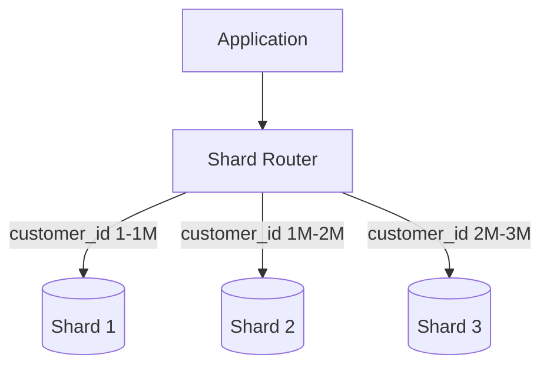

Sharding is a form of horizontal data distribution, but it normally crosses database-server boundaries.

## Why Sharding Is Used

Sharding becomes relevant when a single database node cannot comfortably handle:

- Total data size
- Write throughput
- Index size
- Active working set
- Storage IOPS
- CPU load
- Maintenance windows
- Tenant isolation requirements

Sharding adds major operational and application complexity. It should generally follow simpler scaling options such as:

- Query optimization
- Correct indexing
- Connection pooling
- Caching
- Read replicas
- Hardware scaling
- Table partitioning
- Archiving cold data

---

## 4.1 How Sharding Works

A sharded system needs a deterministic way to answer:

> Which shard owns this row?

A shard mapping function may look like:

```text
shard = hash(tenant_id) % number_of_shards
```

Example:

```text
hash(tenant_101) % 4 = 2
```

The router sends that tenant’s request to Shard 2.

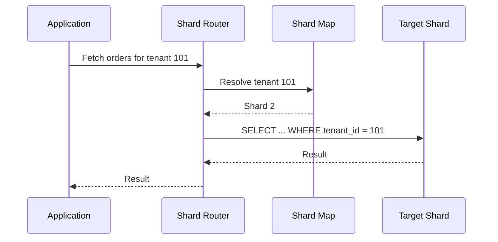

The routing logic may live in:

- Application code
- A database proxy
- A distributed database coordinator
- Middleware such as a sharding platform
- A service-specific data-access layer

---

## 4.2 Sharding Strategies

### Range-Based Sharding

Assign continuous key ranges to shards.

```text
Shard 1 → customer_id 1 to 1,000,000
Shard 2 → customer_id 1,000,001 to 2,000,000
Shard 3 → customer_id 2,000,001 to 3,000,000
```

**Advantages**

- Simple routing
- Efficient range queries
- Easy to understand

**Trade-offs**

- Sequential keys can create a hotspot on the newest shard.
- Uneven ranges can produce uneven data volume.
- Rebalancing may require moving large key ranges.

### Hash-Based Sharding

Hash the shard key to distribute rows.

```text
shard_number = hash(customer_id) % 4
```

**Advantages**

- Usually produces more even distribution
- Reduces sequential-key hotspots

**Trade-offs**

- Range queries may require contacting many shards.
- Changing the shard count can move large amounts of data unless consistent hashing or virtual buckets are used.

### Directory-Based Sharding

Maintain a lookup table that maps a key to a shard.

```text
tenant_101 → shard_3
tenant_102 → shard_1
tenant_103 → shard_3
```

**Advantages**

- Flexible placement
- A tenant can be moved independently
- Useful for tenant isolation and custom placement

**Trade-offs**

- The directory becomes critical infrastructure.
- Routing adds a metadata lookup.
- Mapping updates must be strongly controlled.

### Geography-Based Sharding

Route data based on region.

```text
India customers  → India shard
EU customers     → EU shard
US customers     → US shard
```

**Advantages**

- Lower regional latency
- Supports data-residency requirements
- Limits some cross-region traffic

**Trade-offs**

- Global users and cross-region workflows are harder.
- Geographic load may be uneven.
- Moving a customer between regions is operationally complex.

### Tenant-Based Sharding

Use `tenant_id` as the main routing key.

```text
Tenant A → Shard 1
Tenant B → Shard 2
Tenant C → Shard 1
```

This is common in SaaS systems because most requests already belong to one tenant.

---

## 4.3 Choosing a Shard Key

The shard key is one of the most important design decisions in a distributed database.

A strong shard key should provide:

1. **High cardinality**  
   It should have many distinct values.

2. **Even distribution**  
   Data and traffic should spread across shards.

3. **Query locality**  
   Most queries should identify one shard.

4. **Write distribution**  
   Writes should not concentrate on one node.

5. **Stability**  
   The value should rarely change.

6. **Business alignment**  
   Related records should often live together.

### Good SaaS Example

```text
shard_key = tenant_id
```

Related data can include:

- Users
- Orders
- Invoices
- Permissions
- Audit events

All records for a tenant can be routed to one shard.

### Potentially Weak Example

```text
shard_key = created_at
```

Most new writes target the latest time range, causing a hot shard.

### Compound Shard Key

A compound key can improve distribution while preserving locality.

```text
(tenant_id, hashed_entity_id)
```

This may be useful when a single tenant is too large for one shard, but it makes tenant-wide queries more distributed.

### Shard-Key Evaluation Table

| Question | Why It Matters |
|---|---|
| Does every common request contain the key? | Enables single-shard routing |
| Are values evenly distributed? | Prevents storage imbalance |
| Is traffic evenly distributed? | Prevents hot shards |
| Can the key change? | Moving rows across shards is expensive |
| Are joins usually within the same key? | Keeps joins local |
| Can one key value become extremely large? | Prevents one tenant/entity from outgrowing a shard |

Data distribution and traffic distribution are different. Tenants may occupy equal storage but receive very different request volumes.

---

## 4.4 Routing Queries

### Single-Shard Query

The query contains the shard key.

```sql
SELECT order_id, status, total_amount
FROM orders
WHERE tenant_id = 101
  AND order_id = 98765;
```

The router can send it directly to the correct shard.

```text
Request → Resolve tenant_id 101 → Shard 2 → Execute
```

### Scatter-Gather Query

The query does not contain the shard key.

```sql
SELECT COUNT(*)
FROM orders
WHERE status = 'FAILED';
```

The router may need to:

1. Send the query to every shard.
2. Collect partial results.
3. Combine them.
4. Return the final count.

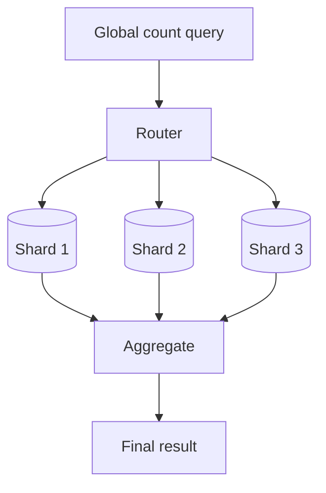

Scatter-gather queries are more expensive because latency is affected by the slowest participating shard.

### Routing Layer Responsibilities

A routing layer may manage:

- Shard-key extraction
- Shard-map lookup
- Connection pools per shard
- Retries
- Timeouts
- Read/write splitting
- Replica selection
- Result aggregation
- Resharding transitions

Keep routing logic centralized rather than duplicating inconsistent rules throughout the application.

---

## 4.5 Cross-Shard Operations

Sharding makes operations across shard boundaries more difficult.

### Cross-Shard Join

Suppose customers are on one shard and orders are distributed differently.

```sql
SELECT c.name, o.total_amount
FROM customers c
JOIN orders o ON o.customer_id = c.customer_id;
```

If related records are on different shards, the system may need to move data over the network or execute multiple queries and join results outside the database.

### Cross-Shard Transaction

A transfer between accounts on different shards may require a distributed transaction.

```text
Shard A: debit account 100
Shard B: credit account 200
```

Possible approaches include:

- Two-phase commit
- Saga pattern
- Transactional outbox
- Idempotent retries
- Compensating actions
- A dedicated ledger service
- Designing ownership so the operation remains on one shard

### Prefer Local Transactions

The best sharding design keeps most transactions within one shard.

```text
Good:
tenant_id 101 users + orders + invoices → same shard

Difficult:
users sharded by user_id
orders sharded by order_date
invoices sharded by region
```

Co-locate data that is frequently read or modified together.

### Global Constraints

Database-wide constraints become harder:

- Globally unique identifiers
- Foreign keys across shards
- Unique email addresses
- Global sequence numbers
- Aggregate limits
- Referential integrity

Common solutions:

- UUID, ULID or Snowflake-style identifiers
- A central uniqueness service
- Application-level validation
- A globally replicated lookup table
- Reserving ID ranges per shard

---

## 4.6 Rebalancing and Resharding

As data grows, an existing shard may become too large or too busy.

Resharding changes the distribution.

```text
Before:
Shard A → 50%
Shard B → 50%

After:
Shard A → 25%
Shard B → 25%
Shard C → 25%
Shard D → 25%
```

### Typical Online Resharding Flow

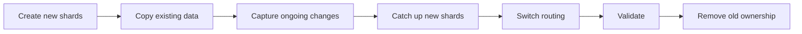

A safe resharding process normally needs:

- Snapshot or bulk copy
- Change-data capture during migration
- Dual-read or validation phase
- Controlled routing cutover
- Rollback strategy
- Duplicate-write protection
- Data consistency checks

### Virtual Buckets

Instead of mapping every row directly to a physical shard, map rows to many logical buckets.

```text
hash(tenant_id) % 1024 → virtual bucket
virtual bucket → physical shard
```

To rebalance, move selected buckets rather than changing the hashing rule for every row.

```text
Buckets 0-255   → Shard A
Buckets 256-511 → Shard B
Buckets 512-767 → Shard C
Buckets 768-1023→ Shard D
```

This gives more controlled data movement.

---

# 5. Replication vs Partitioning vs Sharding

| Area | Replication | Partitioning | Sharding |
|---|---|---|---|
| Main goal | Availability and read scale | Large-table performance and manageability | Horizontal data and write scale |
| Data placement | Same data copied | One table divided into pieces | Different subsets on different nodes |
| Number of servers | Usually multiple | Often one database system | Multiple database nodes |
| Write scaling | Usually no | Limited and database-dependent | Yes, when writes distribute well |
| Read scaling | Yes | Can reduce scanned data | Yes, when queries target shards |
| Failure recovery | Major benefit | Not its primary purpose | Requires per-shard HA |
| Query complexity | Moderate read routing | Usually transparent to SQL | Often significant |
| Cross-data joins | Normal on primary | Usually normal | Difficult across shards |
| Key decision | Sync mode and topology | Partition key and boundaries | Shard key and routing |
| Common risk | Lag and stale reads | Too many or poorly chosen partitions | Hot shards and distributed operations |

## One-Line Difference

```text
Replication answers: “Where are the copies?”

Partitioning answers: “Which physical partition contains this row?”

Sharding answers: “Which database server owns this row?”
```

---

# 6. How They Work Together

A scalable database architecture often layers the techniques.

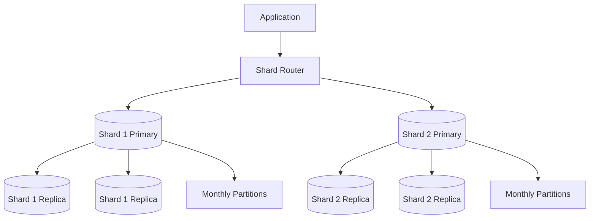

### Responsibility of Each Layer

- **Sharding:** selects the database group that owns the tenant or entity.
- **Replication:** protects each shard and optionally scales reads.
- **Partitioning:** organizes large tables inside each shard.

### Request Flow

```text
1. Request contains tenant_id = 101.
2. Router maps tenant 101 to Shard 2.
3. Write is sent to Shard 2 primary.
4. Shard 2 primary replicates the change to its replicas.
5. The row is stored in the correct monthly partition.
```

Each layer solves a different bottleneck.

---

# 7. Practical Architecture Examples

## 7.1 Growing E-Commerce Application

### Initial Stage

```text
Application → One PostgreSQL database
```

Use:

- Correct indexes
- Query optimization
- Connection pooling
- Backups

### Read-Heavy Stage

```text
Application → Primary + Read Replicas
```

Use replication for:

- Catalog reads
- Reporting
- Non-critical dashboards

Keep checkout and inventory reads on the primary when fresh state is required.

### Large Orders Table

Partition `orders` by month:

```text
orders_2026_07
orders_2026_08
orders_2026_09
```

Benefits:

- Recent-order queries scan fewer partitions.
- Old data can be archived by partition.
- Retention operations become easier.

### Very Large Scale

Shard by `customer_id` or a stable account identifier:

```text
hash(customer_id) → shard
```

Keep customer-owned data together where possible.

---

## 7.2 Multi-Tenant SaaS Platform

Use `tenant_id` as the primary routing key.

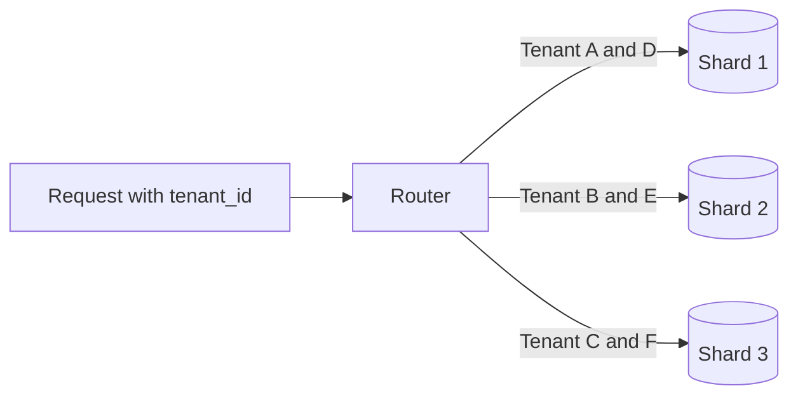

Inside every shard:

- Partition audit events by month.
- Replicate to a standby.
- Route strongly consistent tenant reads to the primary.
- Route safe reporting reads to a replica.

### Why This Works

Most business operations are tenant-local:

```sql
SELECT *
FROM invoices
WHERE tenant_id = :tenant_id
  AND invoice_id = :invoice_id;
```

The application already knows the tenant, so routing is efficient.

### Large Tenant Handling

A very large tenant may eventually require:

- A dedicated shard
- Sub-sharding by entity
- A compound shard key
- Tenant migration using directory-based routing

---

## 7.3 Event and Audit Platform

Event tables grow quickly and are normally queried by time range.

A practical design:

```text
Shard by tenant_id
Partition each shard by event_date
Replicate each shard for availability
```

Example query:

```sql
SELECT event_type, actor_id, occurred_at
FROM audit_events
WHERE tenant_id = 101
  AND occurred_at >= TIMESTAMP '2026-07-01 00:00:00'
  AND occurred_at <  TIMESTAMP '2026-08-01 00:00:00';
```

This request:

1. Routes to one shard using `tenant_id`.
2. Prunes partitions using `occurred_at`.
3. May run on a replica when slight staleness is acceptable.

---

# 8. Choosing the Right Technique

Use the smallest technique that directly solves the current bottleneck.

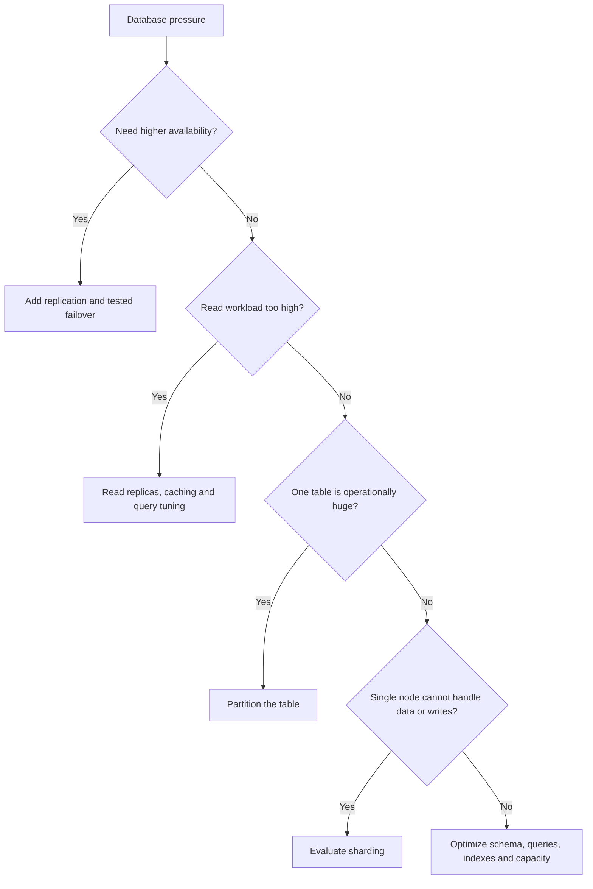

## Decision Guide

### Choose Replication When

- Downtime must be reduced.
- A standby is needed for failover.
- Read traffic exceeds primary capacity.
- Disaster recovery requires another copy.
- Reporting should be isolated from the primary.

### Choose Partitioning When

- One table contains a very large number of rows.
- Queries commonly filter by date, tenant or region.
- Data retention is period-based.
- Old data must be archived efficiently.
- Index and maintenance operations need smaller units.

### Choose Sharding When

- A single node is reaching write, CPU, memory, storage or I/O limits.
- Data volume cannot fit comfortably on one node.
- Workloads can be divided by a stable key.
- Most requests can target one shard.
- The organization can operate distributed database infrastructure.

## Scaling Order

A practical progression is:

```text
1. Measure the bottleneck
2. Fix inefficient queries and indexes
3. Use connection pooling
4. Add caching where appropriate
5. Scale the database server vertically
6. Add replicas for HA and read scaling
7. Partition very large tables
8. Archive cold data
9. Shard only when one writable node remains the real limit
```

Do not choose sharding only because the dataset may become large in the future. Choose it when measurements and growth projections justify the added complexity.

---

# 9. Operational Monitoring

Scaling architecture is only reliable when monitored.

## Replication Metrics

Monitor:

- Replica connection state
- Replication lag in time and log position
- WAL or binlog retention
- Replication-slot growth
- Apply errors
- Replica replay throughput
- Failover readiness
- Read traffic per replica
- Replica disk and CPU usage

### Important Alert

A disconnected replica may cause retained logs to grow until the primary disk fills. Monitor both replica health and retained-log volume.

## Partitioning Metrics

Monitor:

- Rows and storage per partition
- Missing future partitions
- Rows entering a default partition
- Partition-pruning behavior
- Query-plan time
- Index size per partition
- Retention and archival jobs
- Long-running operations blocking detach or drop

## Sharding Metrics

Monitor both cluster-wide and per-shard values:

- Storage per shard
- Read and write throughput
- CPU, memory and disk I/O
- Connection count
- Query latency
- Error rate
- Hot keys or hot tenants
- Scatter-gather query count
- Cross-shard transaction count
- Rebalancing progress
- Shard-map availability
- Data-distribution skew

### Data Skew vs Traffic Skew

```text
Data skew:
Shard A stores 70% of rows.

Traffic skew:
Shard B stores 20% of rows but receives 80% of requests.
```

Both can overload a shard and require different solutions.

---

# 10. Best Practices

## Replication

- Use replication for availability only after failover is tested.
- Define acceptable recovery point and recovery time objectives.
- Route consistency-sensitive reads to the primary.
- Monitor log retention so a broken replica cannot fill primary storage.
- Use fencing or quorum controls to prevent split-brain.
- Keep backups even when replicas exist; replication is not a backup.
- Test promotion, application reconnection and old-primary recovery.

## Partitioning

- Choose a partition key used in common query filters.
- Align partition boundaries with retention and reporting periods.
- Automate creation of future partitions.
- Verify pruning with the query execution plan.
- Keep indexes focused on actual access patterns.
- Avoid excessively fine partition granularity.
- Monitor the default partition.
- Test schema changes across all partitions.

## Sharding

- Prefer a stable, high-cardinality shard key.
- Design for query locality.
- Co-locate data used in the same transaction.
- Avoid global joins in request-time paths.
- Use globally safe identifiers.
- Keep a strongly controlled shard map.
- Plan resharding before the first shard becomes full.
- Make migration and retry operations idempotent.
- Operate high availability separately for every shard.
- Design dashboards to reveal per-shard imbalance, not only cluster averages.

## General Principle

```text
Replication increases copies.
Partitioning increases physical table units.
Sharding increases independent database ownership units.

Every increase also increases operational responsibility.
```

---

# 11. Final Mental Model

Consider an `orders` system.

### Replication

```text
Primary orders database
        │
        ├── Replica A: same orders
        └── Replica B: same orders
```

**Purpose:** availability and read scale.

### Partitioning

```text
One logical orders table
        │
        ├── orders_2026_07
        ├── orders_2026_08
        └── orders_2026_09
```

**Purpose:** manage and query a large table efficiently.

### Sharding

```text
Shard 1: customers A–H
Shard 2: customers I–P
Shard 3: customers Q–Z
```

**Purpose:** distribute data and writes across database servers.

### Combined Production Design

```text
Application
   │
   ▼
Shard router
   │
   ├── Shard 1 primary ──▶ replicas
   │      └── monthly table partitions
   │
   ├── Shard 2 primary ──▶ replicas
   │      └── monthly table partitions
   │
   └── Shard 3 primary ──▶ replicas
          └── monthly table partitions
```

The most important distinction is:

> **Replication duplicates ownership, partitioning organizes storage, and sharding distributes ownership.**

---

# 12. References

The concepts and examples in this guide were checked against current official documentation available in July 2026:

- [PostgreSQL 18 — Table Partitioning](https://www.postgresql.org/docs/18/ddl-partitioning.html)
- [PostgreSQL 18 — High Availability, Load Balancing and Replication](https://www.postgresql.org/docs/18/high-availability.html)
- [PostgreSQL 18 — Log-Shipping Standby Servers and Streaming Replication](https://www.postgresql.org/docs/18/warm-standby.html)
- [PostgreSQL 18 — Logical Replication](https://www.postgresql.org/docs/18/logical-replication.html)
- [MySQL 8.4 — Replication](https://dev.mysql.com/doc/refman/8.4/en/replication.html)
- [MySQL 8.4 — Semi-Synchronous Replication](https://dev.mysql.com/doc/refman/8.4/en/replication-semisync.html)
- [MySQL 8.4 — Partitioning](https://dev.mysql.com/doc/refman/8.4/en/partitioning.html)
- [MongoDB — Sharding](https://www.mongodb.com/docs/manual/sharding/)
- [MongoDB — Shard Keys](https://www.mongodb.com/docs/manual/core/sharding-shard-key/)
- [Vitess — Sharding Guidelines](https://vitess.io/docs/25.0/user-guides/vschema-guide/sharding-guidelines/)

---

**End of guide**
