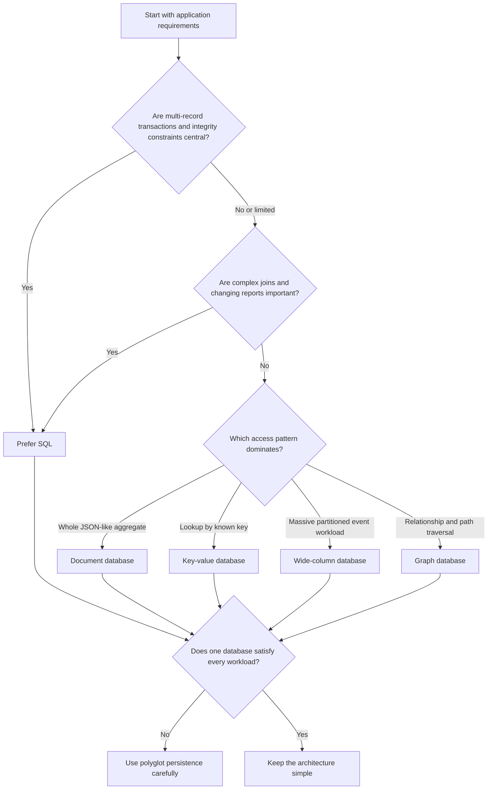
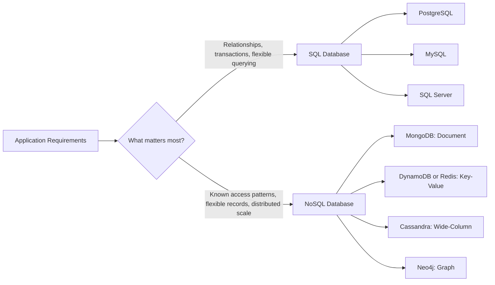
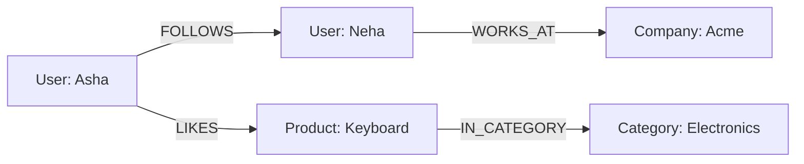
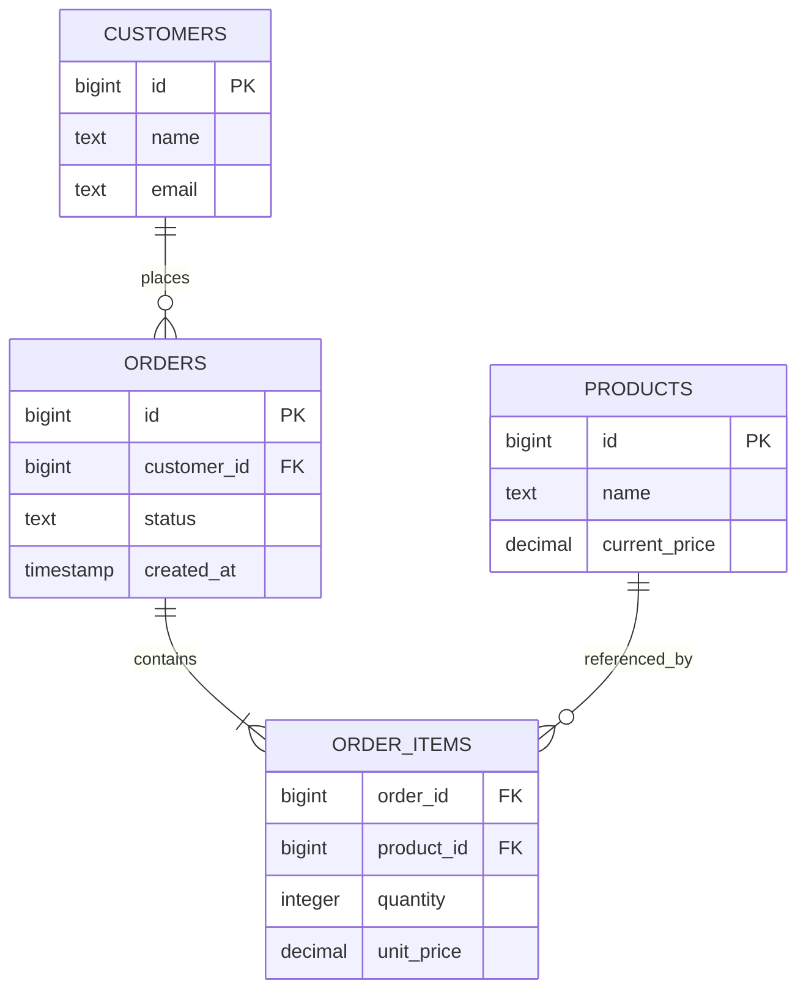
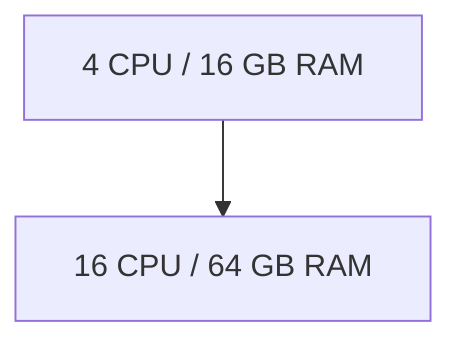
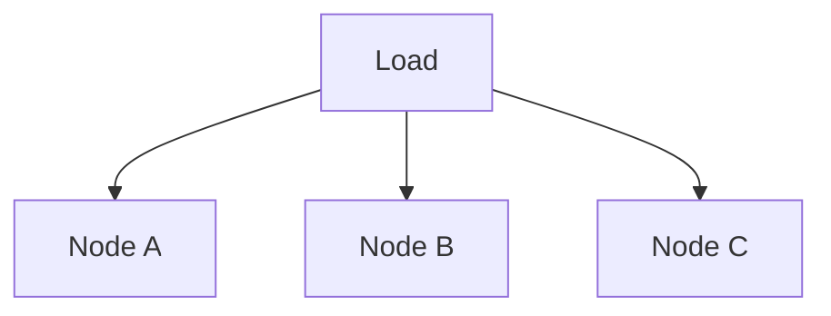
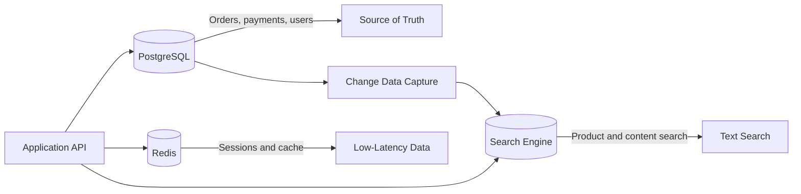

# SQL vs NoSQL — When to Use Each

> “Which database is the best?”
>
> “Which database model matches this application's data, access patterns, consistency requirements, and scale?”

## In short

- **SQL is the safe default** for business systems: related tables, transactions across several rows, database-enforced constraints, and ad hoc joins and reporting when the questions keep changing.
- **NoSQL is a category, not one model** — document, key-value, wide-column, and graph stores solve different problems, so choose the model rather than the label.
- Document stores fit aggregates read and written together; key-value fits lookups by a known key; wide-column fits partitioned write-heavy event data; graph fits multi-hop relationship traversal.
- **NoSQL is not schema-free or transaction-free** — MongoDB is atomic per document and supports costlier multi-document transactions, DynamoDB makes you choose eventual or strong reads, and Cassandra tunes consistency per operation.
- **SQL scales too**, through read replicas, partitioning, caching, sharding, and distributed SQL; NoSQL scale still depends on a partition key that spreads traffic instead of creating hot partitions.
- Duplicated data is often intentional in NoSQL, because an order-time snapshot of a product name and price is correct business behavior, not a modeling mistake.
- Polyglot persistence is normal, but one system must own each business fact, and every extra database adds synchronization, backup, monitoring, and cost.



**Interview answer:** I choose NoSQL when a specific non-relational model matches the workload better than tables do — a document store when the application reads and writes a whole aggregate such as an order or a profile, a key-value store when access is by a known key such as a session or a cart, a wide-column store for high-volume partitioned event data, and a graph database when multi-hop relationships are the actual query. I stay relational when correctness depends on multi-record transactions, integrity constraints, or reporting that will keep changing, which covers most business systems. In practice I start with PostgreSQL and add a specialized store only when a demonstrated workload justifies the extra operational complexity.

**Gotcha:** Treating “NoSQL” as a single decision — key-value, document, wide-column, and graph stores solve different problems, and picking one for scale the system does not have usually ends with joins re-implemented in application code.

---

# 1. The Big Picture

An **SQL database** stores data mainly in related tables. Relationships are represented using primary keys, foreign keys, and joins.

A **NoSQL database** uses a non-relational model such as documents, key-value pairs, wide-column rows, or graphs. It usually designs data around the application's most important access patterns.



The important point is that **NoSQL is a broad category**. MongoDB, Redis, DynamoDB, Cassandra, and Neo4j solve different kinds of problems even though all are called NoSQL databases.

---

# 2. What Is an SQL Database?

SQL databases are usually relational database management systems, also called **RDBMSs**.

They organize data into tables with defined columns and relationships.

## 2.1 Relational Data Model

Consider an e-commerce application:

`customers`

| id | name |
|---|---|
| 1 | Asha Patel |

`orders`

| id | customer_id | status |
|---|---|---|
| 501 | 1 | PAID |

`orders.customer_id` references `customers.id`.

The relationship can be queried using a join:

```sql
SELECT
    o.id AS order_id,
    c.name AS customer_name,
    o.status
FROM orders AS o
JOIN customers AS c
    ON c.id = o.customer_id
WHERE o.status = 'PAID';
```

The database can enforce rules such as:

- Every order must reference an existing customer.
- An email address must be unique.
- A payment amount cannot be negative.
- Multiple related changes must either all succeed or all fail.

## 2.2 Main Strengths

SQL databases are especially strong when an application needs:

- Clear relationships between entities
- ACID transactions
- Strong integrity constraints
- Joins and ad hoc queries
- Reporting and aggregation
- A stable and understandable data model
- Mature operational tooling

SQL databases are not limited to rigid, old-style schemas. Modern relational databases can also support JSON, full-text search, partitioning, replication, and horizontal-scaling solutions.

## 2.3 Common SQL Databases

| Database | Common Use |
|---|---|
| PostgreSQL | General-purpose applications, financial systems, SaaS, analytics, geospatial data |
| MySQL | Web applications, content platforms, e-commerce |
| Microsoft SQL Server | Enterprise systems, Microsoft-based environments, reporting |
| Oracle Database | Large enterprise and regulated systems |
| SQLite | Embedded applications, mobile apps, local storage, testing |

---

# 3. What Is a NoSQL Database?

NoSQL means **non-relational** or, informally, “not only SQL.” It does not describe one single storage model.

NoSQL systems often focus on one or more of these goals:

- Flexible or application-shaped records
- Very high read or write throughput
- Horizontal distribution across machines or regions
- Low-latency access through predictable keys
- Specialized relationship or graph traversal
- Availability during partial distributed-system failures

## 3.1 Document Databases

A document database stores records as JSON-like documents.

Example:

```json
{
  "_id": "order-501",
  "customer": {
    "id": "customer-1",
    "name": "Asha Patel"
  },
  "status": "PAID",
  "items": [
    {
      "product_id": "P101",
      "name": "Mechanical Keyboard",
      "quantity": 1,
      "unit_price": 89.99
    }
  ],
  "shipping_address": {
    "city": "Ahmedabad",
    "country": "India"
  }
}
```

Related data that is normally split across several SQL tables may be embedded in one document.

**Good fit:**

- Product catalogs with different attributes
- Content management systems
- User profiles and preferences
- Applications where one aggregate is usually read together

**Examples:** MongoDB, Couchbase

## 3.2 Key-Value Databases

A key-value database retrieves a value through a unique key.

```text
Key:   session:9f82a
Value: {"user_id": 42, "expires_at": "2026-07-27T18:00:00Z"}
```

The access pattern is usually simple: `GET`, `SET`, and `DELETE` against that key.

**Good fit:**

- Caching
- Session storage
- Shopping carts
- Feature flags
- Rate-limiting counters
- High-scale lookups by known keys

**Examples:** Redis, Amazon DynamoDB

> DynamoDB supports more than basic key-value access, but partition-key-driven access remains central to its design.

## 3.3 Wide-Column Databases

Wide-column databases store distributed rows identified by partition and clustering keys. Their tables are normally designed around known queries rather than normalized relationships.

**Good fit:**

- High-volume event data
- Device telemetry
- Time-series-like workloads
- Large-scale write-heavy systems
- Workloads requiring multi-node or multi-region availability

**Examples:** Apache Cassandra, ScyllaDB, Google Cloud Bigtable

A Cassandra-style model might create separate tables for separate queries:

```sql
CREATE TABLE events_by_device (
    device_id text,
    event_date date,
    event_time timestamp,
    event_type text,
    payload text,
    PRIMARY KEY ((device_id, event_date), event_time)
) WITH CLUSTERING ORDER BY (event_time DESC);
```

This table is optimized for:

> “Give me the latest events for one device on one date.”

It is not intended for arbitrary joins across many entities.

## 3.4 Graph Databases

Graph databases model data as nodes and relationships.



**Good fit:**

- Social relationships
- Fraud detection
- Recommendation paths
- Identity and access relationships
- Network and dependency analysis

**Examples:** Neo4j, Amazon Neptune

---

# 4. SQL vs NoSQL: Core Differences

| Area | SQL | NoSQL |
|---|---|---|
| Primary model | Related tables | Documents, key-value, wide-column, or graph |
| Schema | Usually explicitly defined | Often flexible, application-shaped, or query-driven |
| Relationships | Foreign keys and joins | Embedding, references, duplicated views, or graph edges |
| Transactions | Usually a central strength | Varies by product; may be item-, document-, partition-, or multi-record based |
| Querying | Strong ad hoc querying using SQL | Often optimized for predefined access patterns |
| Integrity | Constraints can be enforced by the database | Frequently shared between database design and application logic |
| Scaling | Commonly vertical first; horizontal options also exist | Frequently designed for horizontal distribution |
| Data duplication | Usually reduced through normalization | Often intentional for fast reads |
| Best fit | Complex business data and relationships | Specialized access patterns, flexible aggregates, or distributed scale |
| Examples | PostgreSQL, MySQL, SQL Server | MongoDB, DynamoDB, Cassandra, Redis, Neo4j |

These are tendencies, not absolute rules. Modern SQL databases can scale horizontally, and many NoSQL databases support transactions and schema validation.

---

# 5. When SQL Is Usually the Better Choice

Choose SQL when the application's correctness depends on relationships and coordinated updates.

## 5.1 Financial or Transactional Workflows

Examples:

- Banking ledger
- Payment processing
- Subscription billing
- Order and inventory updates
- Insurance policy and claim processing

A money transfer normally requires multiple changes to behave as one unit:

```sql
BEGIN;

UPDATE accounts
SET balance = balance - 500.00
WHERE id = 101
  AND balance >= 500.00;

UPDATE accounts
SET balance = balance + 500.00
WHERE id = 202;

INSERT INTO transfers (
    from_account_id,
    to_account_id,
    amount,
    status
)
VALUES (101, 202, 500.00, 'COMPLETED');

COMMIT;
```

If one step fails, the transaction can be rolled back.

## 5.2 Highly Related Business Data

SQL is a natural fit when the system contains relationships such as:

```text
Customer
  ├── Orders
  │     ├── Order Items
  │     ├── Payments
  │     └── Shipments
  ├── Addresses
  └── Support Tickets
```

Foreign keys and joins keep these relationships explicit and queryable.

## 5.3 Reporting and Ad Hoc Analysis

SQL is useful when business users may ask changing questions:

- Revenue by region and month
- Customers with failed payments and open support tickets
- Products with decreasing sales but increasing returns
- Average claim settlement time by policy type

These queries are difficult to predict completely before the system is built. SQL provides flexibility for new joins, filters, aggregates, window functions, and common table expressions.

## 5.4 Data Integrity Is a Core Requirement

SQL databases can enforce rules directly:

```sql
CREATE TABLE users (
    id BIGSERIAL PRIMARY KEY,
    email TEXT NOT NULL UNIQUE,
    age INTEGER CHECK (age >= 18),
    created_at TIMESTAMPTZ NOT NULL DEFAULT NOW()
);
```

The rules apply regardless of which application, service, or script writes to the database.

## 5.5 The Access Patterns Are Still Evolving

A relational model is often safer when a product is early and future query requirements are not fully known.

SQL allows teams to ask new questions without creating a separate table or duplicated projection for every access pattern.

---

# 6. When NoSQL Is Usually the Better Choice

Choose a NoSQL database when its specific data model directly matches the workload.

## 6.1 Records Have Different Shapes

A product catalog may contain very different attributes:

```json
{
  "type": "laptop",
  "brand": "ExampleTech",
  "ram_gb": 32,
  "cpu": "12-core",
  "ports": ["USB-C", "HDMI"]
}
```

```json
{
  "type": "shoe",
  "brand": "ExampleWear",
  "size": 9,
  "material": "leather",
  "color": "brown"
}
```

A document database can store these variations naturally while still allowing validation rules.

## 6.2 Data Is Commonly Read as One Aggregate

Suppose an application usually loads an entire user profile at once:

```json
{
  "user_id": "U1001",
  "name": "Asha",
  "preferences": {
    "language": "en",
    "theme": "light"
  },
  "notification_channels": ["email", "push"],
  "saved_addresses": [
    {"type": "home", "city": "Ahmedabad"}
  ]
}
```

Keeping the aggregate together can reduce joins and network round trips.

## 6.3 Access Is Primarily Through Known Keys

Examples:

- Find session by session ID
- Find shopping cart by customer ID
- Find device state by device ID
- Find an idempotency result by request key

A key-value database can provide a simple and efficient model for these lookups.

## 6.4 The Workload Requires Large Distributed Throughput

A wide-column or managed key-value database may fit when the workload includes:

- Millions of events or telemetry records
- Predictable partition-key-based queries
- Continuous high write throughput
- Geographic distribution
- Availability during node or network failures

The database must still be designed carefully. A poor partition key can create hot partitions even in a horizontally scalable system.

## 6.5 Relationships Are the Primary Query

Use a graph database when the main question is about paths and relationships:

```text
Which accounts are connected to this suspicious payment?
Which employees can indirectly access this resource?
Which products are frequently connected through user behavior?
```

A graph database can traverse these relationships more naturally than repeatedly joining many relational tables.

---

# 7. Decision Flow

The decision flow at the top of this note narrows a workload down to one model. A useful default is:

> Start with a relational database when requirements are uncertain. Add a specialized NoSQL system only when a clear workload justifies the operational complexity.

---

# 8. Practical Use Cases

| Use Case | Likely Starting Choice | Why |
|---|---|---|
| Banking ledger | SQL | Transactions, auditability, consistency, constraints |
| E-commerce orders and payments | SQL | Related entities and coordinated updates |
| Product catalog with varying attributes | Document database or SQL with JSON support | Flexible product structures |
| User sessions | Key-value database | Fast lookup by session key and expiration support |
| Application cache | Key-value database | Low-latency temporary storage |
| IoT telemetry | Wide-column or time-series database | High write throughput and partitioned time-based access |
| Social connection traversal | Graph database | Relationship and path queries |
| CMS articles | Document database or SQL | Aggregate-oriented content structure |
| Internal business application | SQL | Reporting, joins, integrity, evolving requirements |
| Shopping cart | Key-value/document database | Read and update one customer's cart as an aggregate |
| Search | Search engine alongside primary database | Text relevance and inverted indexes |
| Audit/event stream | Event store, log platform, or wide-column database | Append-heavy, chronological access |

The word **starting** matters. Final selection depends on throughput, team experience, managed services, compliance, latency targets, cost, and failure requirements.

---

# 9. Data Modeling Example

Consider an order containing customer details and several products.

## 9.1 SQL Model



SQL tables:

```sql
CREATE TABLE customers (
    id BIGSERIAL PRIMARY KEY,
    name TEXT NOT NULL,
    email TEXT NOT NULL UNIQUE
);

CREATE TABLE products (
    id BIGSERIAL PRIMARY KEY,
    name TEXT NOT NULL,
    current_price NUMERIC(12, 2) NOT NULL CHECK (current_price >= 0)
);

CREATE TABLE orders (
    id BIGSERIAL PRIMARY KEY,
    customer_id BIGINT NOT NULL REFERENCES customers(id),
    status TEXT NOT NULL,
    created_at TIMESTAMPTZ NOT NULL DEFAULT NOW()
);

CREATE TABLE order_items (
    order_id BIGINT NOT NULL REFERENCES orders(id),
    product_id BIGINT NOT NULL REFERENCES products(id),
    quantity INTEGER NOT NULL CHECK (quantity > 0),
    unit_price NUMERIC(12, 2) NOT NULL CHECK (unit_price >= 0),
    PRIMARY KEY (order_id, product_id)
);
```

### Benefits

- Customer and product data have one primary source of truth.
- Constraints protect integrity.
- Orders can be joined with customers, items, products, and payments.
- Reporting is flexible.

### Trade-off

Loading a complete order may require joins, though proper indexes and query design normally handle this well.

## 9.2 Document Model

```json
{
  "_id": "order-501",
  "customer_id": "customer-1",
  "customer_snapshot": {
    "name": "Asha Patel",
    "email": "asha@example.com"
  },
  "status": "PAID",
  "items": [
    {
      "product_id": "product-101",
      "name": "Mechanical Keyboard",
      "quantity": 1,
      "unit_price": 89.99
    },
    {
      "product_id": "product-205",
      "name": "USB-C Cable",
      "quantity": 2,
      "unit_price": 12.50
    }
  ],
  "created_at": "2026-07-27T10:30:00Z"
}
```

### Benefits

- One read can return the complete order.
- Historical names and prices can be stored as order-time snapshots.
- The document closely matches the API response.

### Trade-off

- Customer or product information may be duplicated.
- Updating duplicated data everywhere can be difficult.
- Cross-order analytics may require aggregation pipelines or a separate analytical system.

The duplication is not automatically bad. In an order, preserving the product name and price at purchase time is often correct business behavior.

---

# 10. Transactions and Consistency

A common oversimplification is:

> SQL supports transactions, while NoSQL does not.

That is no longer accurate.

Many NoSQL databases support transactions, but the **scope, performance characteristics, consistency options, and recommended modeling approach differ by product**.

## 10.1 SQL Transaction Model

Relational databases commonly support transactions across several rows and tables, so creating an order, reserving inventory, recording a payment, and updating a customer balance can commit or roll back as one unit. The guarantees behind that are covered in [ACID Properties](acid-properties.md), and the concurrency trade-offs in [Transaction Isolation Levels](transaction-isolation-levels.md).

This model is valuable when several related changes must remain consistent.

## 10.2 MongoDB Transaction Model

MongoDB guarantees atomicity for a single document. It also supports multi-document transactions across collections, databases, and shards.

However, MongoDB's own guidance emphasizes that distributed transactions have a greater cost than single-document operations and should not replace appropriate document modeling.

A good MongoDB design therefore tries to keep data that changes together inside the same document when practical.

## 10.3 DynamoDB Consistency

DynamoDB supports eventually consistent and strongly consistent reads for supported table and index operations. It also supports transactional operations across multiple items.

The application's design must explicitly choose the required read and write behavior rather than assuming every read has the same consistency level.

## 10.4 Cassandra Consistency

Cassandra is designed for distributed availability and partitioned scale. Its consistency is tunable through read and write consistency levels.

The data model and chosen consistency levels must match the business requirement. A globally distributed activity feed may tolerate delayed convergence; a financial balance usually requires stricter coordination.

## 10.5 Practical Consistency Rule

Ask this question for every important operation:

> What happens if a user reads slightly old data for a short period?

- If the result is only a briefly outdated feed count, eventual consistency may be acceptable.
- If the result can cause duplicate payment, overselling, or incorrect authorization, stronger coordination is normally required.

---

# 11. Scaling SQL and NoSQL

## 11.1 Vertical Scaling

Vertical scaling means using a larger machine:



It is operationally simple but has practical and financial limits.

## 11.2 Horizontal Scaling

Horizontal scaling means distributing work across machines:



NoSQL systems are often designed around partitioning from the beginning. This is useful, but the application must work within the database's partitioning and query model.

SQL databases can also scale horizontally through approaches such as:

- Read replicas
- Table partitioning
- Connection pooling
- Caching
- Sharding
- Distributed SQL systems
- Separating transactional and analytical workloads

Therefore, “SQL cannot scale” is incorrect. The more useful question is:

> How much scaling complexity does this workload require, and which database handles that complexity most naturally?

## 11.3 Partition-Key Design

In distributed NoSQL systems, the partition key is a major architectural decision.

A good partition key:

- Distributes traffic across partitions
- Matches primary read patterns
- Avoids one very hot customer, tenant, date, or device
- Keeps related data together without creating unbounded partitions

A risky key such as `partition_key = current_date` sends all of today's writes to one partition, while combining fields, such as `partition_key = device_id + event_date`, spreads them.

The correct design depends on traffic distribution and query requirements. The mechanics are covered in [Replication, Sharding and Partitioning](replication-sharding-partitioning.md) and [DynamoDB Keys and Single-Table Design](dynamodb-keys-single-table.md).

---

# 12. Query Patterns and Indexing

SQL design often starts from entities and relationships, then adds indexes for important queries.

NoSQL design commonly starts from access patterns:

```text
1. Get profile by user ID
2. Get latest 20 orders by customer
3. Get order by order ID
4. Get today's events by device
```

The schema is then shaped around those operations.

## SQL Example

```sql
CREATE INDEX idx_orders_customer_created
ON orders (customer_id, created_at DESC);
```

Query:

```sql
SELECT id, status, created_at
FROM orders
WHERE customer_id = 42
ORDER BY created_at DESC
LIMIT 20;
```

## DynamoDB-Style Example

```text
PK = CUSTOMER#42
SK = ORDER#2026-07-27T10:30:00Z#501
```

Query:

```text
Partition key = CUSTOMER#42
Sort key begins with ORDER#
Scan direction = descending
Limit = 20
```

Both models can serve the same access pattern. The difference is that SQL keeps broader query flexibility, while the NoSQL model usually makes the intended access path explicit in the key design.

---

# 13. Using SQL and NoSQL Together

Real production systems often use **polyglot persistence**: different storage technologies for different workloads.

Example architecture:



Possible responsibilities:

| Component | Responsibility |
|---|---|
| PostgreSQL | Orders, users, payments, inventory, source-of-truth data |
| Redis | Cache, sessions, rate limits, temporary counters |
| Search engine | Full-text search and relevance ranking |
| Document database | Flexible content or profile aggregates |
| Wide-column database | High-volume device or event data |
| Data warehouse | Historical analytics and BI reporting |

## Important Design Principle

Do not make every database an independent source of truth for the same business fact.

Define:

- Which system owns the data
- How updates are propagated
- Whether propagation is synchronous or asynchronous
- How retries and duplicate events are handled
- What consistency delay is acceptable
- How data is rebuilt after failure

Adding another database can improve one workload but also adds deployment, monitoring, backup, security, and data-synchronization complexity.

---

# 14. Practical Selection Checklist

Before selecting a database, answer the following.

## Data Structure

- Are the entities strongly related?
- Does one record contain a variable set of fields?
- Is the data naturally a document, graph, time series, or key-value entry?

## Query Requirements

- Are joins required?
- Will reporting requirements change frequently?
- Are queries mostly predictable key-based lookups?
- Is relationship traversal the main operation?

## Consistency Requirements

- Must several records update atomically?
- Can users temporarily read old data?
- What is the effect of duplicate or reordered events?
- Is strong consistency required across regions?

## Scale and Performance

- What are the expected reads and writes per second?
- Is the workload read-heavy, write-heavy, or balanced?
- Is traffic evenly distributed?
- Is multi-region operation required?
- What are the latency objectives?

## Operational Requirements

- Does the team know how to operate the database?
- Is a managed service available?
- How will backup, restore, monitoring, and upgrades work?
- What are the compliance and data-residency requirements?
- What is the total cost, not only the initial infrastructure cost?

---

# 15. Best Practices

## 15.1 Start from Business Invariants

Identify facts that must always remain true:

- A payment must not be recorded twice.
- Inventory must not become negative.
- A user cannot access another tenant's records.
- An order total must match its items and adjustments.

Select a data model that can protect these invariants reliably.

## 15.2 Design from Real Access Patterns

Write down important operations before finalizing the schema:

```text
Operation: Get latest orders for customer
Frequency: 500 requests/second
Expected rows: 20
Consistency: Read-after-write preferred
Latency target: p95 below 100 ms
```

This makes database selection measurable rather than preference-based.

## 15.3 Prefer the Simplest Sufficient Architecture

A single PostgreSQL database with good indexes may be enough for a large number of business applications.

Do not add MongoDB, Redis, Cassandra, or a graph database only because the architecture appears more modern. Add a specialized system when it solves a demonstrated requirement.

## 15.4 Treat Flexible Schema as Controlled Flexibility

A document database does not remove the need for schema design.

Define:

- Required fields
- Data types
- Document version
- Validation rules
- Migration strategy
- Maximum document or item size
- Indexes and access patterns

## 15.5 Test with Production-Like Distribution

Average test data can hide real problems. Test:

- Large tenants
- Popular keys
- Uneven traffic
- High-cardinality and low-cardinality fields
- Large documents or rows
- Peak write bursts
- Failover and retry behavior

## 15.6 Measure Before Splitting the Data Layer

Use query plans, slow-query logs, metrics, tracing, and load tests before replacing a database or introducing another one.

Many performance issues come from missing indexes, inefficient queries, excessive network calls, or poor connection management rather than the SQL or NoSQL category itself.

---

# 16. References

The following official documentation was used to verify current product behavior and terminology:

1. [PostgreSQL Documentation — SQL Language](https://www.postgresql.org/docs/current/sql.html)
2. [PostgreSQL Documentation — Concurrency Control](https://www.postgresql.org/docs/current/mvcc.html)
3. [PostgreSQL Documentation — Data Definition and Constraints](https://www.postgresql.org/docs/current/ddl.html)
4. [MongoDB Documentation — Data Modeling Best Practices](https://www.mongodb.com/docs/manual/data-modeling/best-practices/)
5. [MongoDB Documentation — Transactions](https://www.mongodb.com/docs/manual/core/transactions/)
6. [Amazon DynamoDB — Core Components](https://docs.aws.amazon.com/amazondynamodb/latest/developerguide/HowItWorks.CoreComponents.html)
7. [Amazon DynamoDB — Read Consistency](https://docs.aws.amazon.com/amazondynamodb/latest/developerguide/HowItWorks.ReadConsistency.html)
8. [Apache Cassandra Documentation — Architecture Overview](https://cassandra.apache.org/doc/stable/cassandra/architecture/overview.html)
9. [Apache Cassandra Documentation — Guarantees](https://cassandra.apache.org/doc/stable/cassandra/architecture/guarantees.html)
10. [Apache Cassandra Documentation — Data Modeling](https://cassandra.apache.org/doc/latest/cassandra/developing/data-modeling/index.html)
