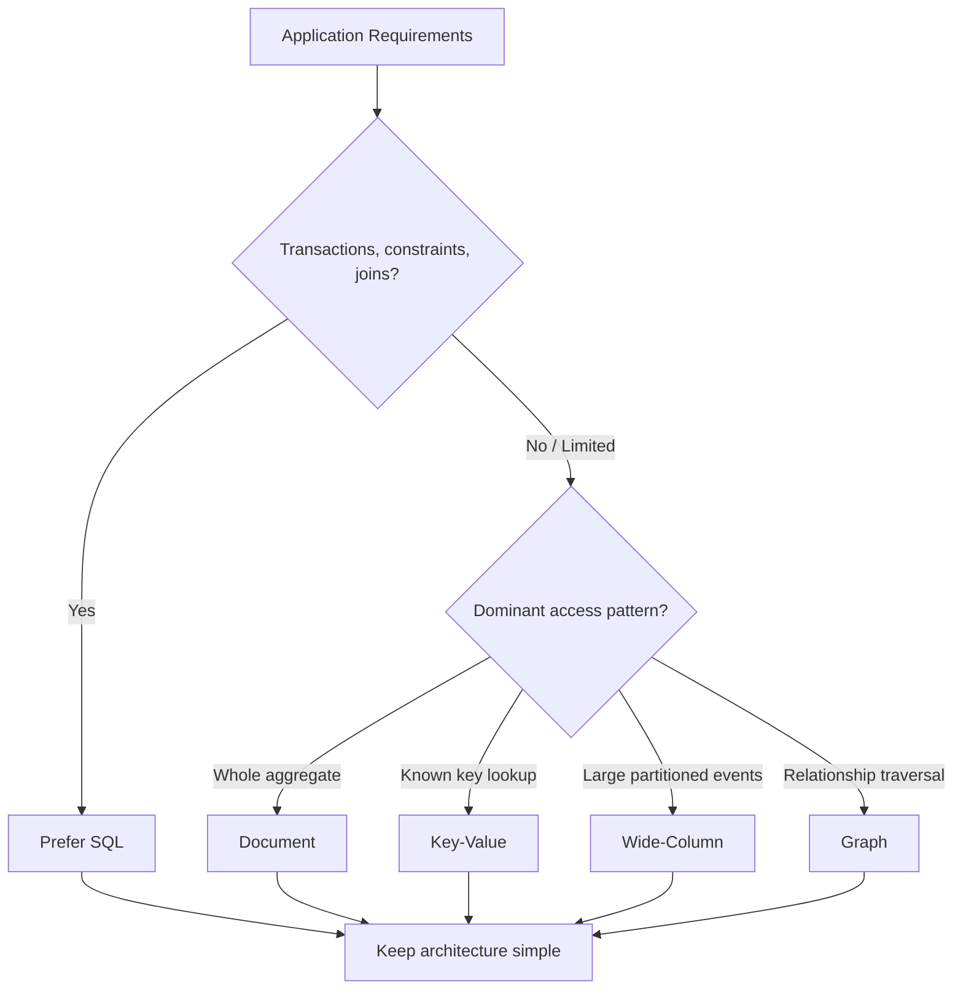
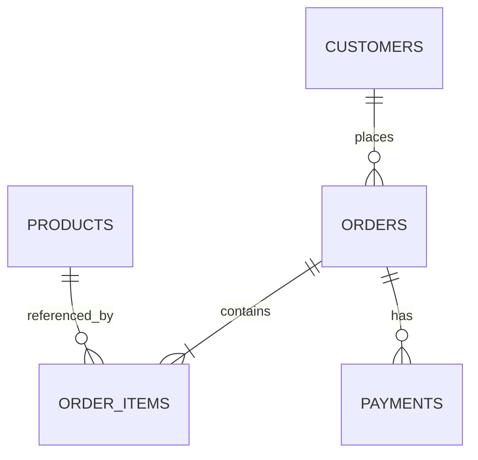
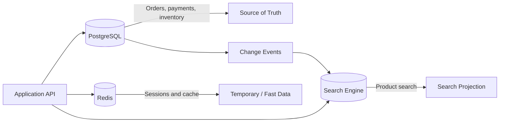

# SQL vs NoSQL — When to Use Each

SQL vs NoSQL is not about which database is universally better. The useful question is:

> **Which data model best matches the application's relationships, access patterns, consistency needs, and scale?**

## In Short

- **Start with SQL for most business applications** when data is relational, transactions matter, constraints protect correctness, and queries may change over time.
- **NoSQL is a category, not one database model.** Document, key-value, wide-column, and graph databases solve different problems.
- Use a **document database** when data is naturally handled as one JSON-like aggregate.
- Use a **key-value database** when access is mainly by a known key, such as sessions, carts, or cached values.
- Use a **wide-column database** for very large, partition-oriented, write-heavy workloads with predictable queries.
- Use a **graph database** when multi-hop relationships and path traversal are the main problem.
- **NoSQL does not mean schema-free or transaction-free.** Modern NoSQL systems can provide validation, transactions, and different consistency options.
- **SQL can also scale** using indexes, read replicas, partitioning, caching, sharding, and distributed SQL.
- In real systems, SQL and NoSQL are often used together, but each business fact should have a clear **source of truth**.



---

# 1. The Big Picture

## 1.1 SQL Database

A **SQL database** usually means a relational database management system (**RDBMS**).

Data is stored in tables and relationships are represented with:

- Primary keys
- Foreign keys
- Constraints
- Joins

Common examples:

- PostgreSQL
- MySQL
- Microsoft SQL Server
- Oracle Database
- SQLite

SQL is especially useful when the database must protect relationships and business rules.

---

## 1.2 NoSQL Database

**NoSQL** refers to non-relational database models. It does not describe one common architecture.

The main models are:

| NoSQL Model | Best For | Common Examples |
|---|---|---|
| Document | JSON-like aggregates and flexible records | MongoDB, Couchbase |
| Key-value | Fast lookup by known key | Redis, DynamoDB |
| Wide-column | Large distributed, partition-oriented workloads | Cassandra, ScyllaDB |
| Graph | Relationship and path traversal | Neo4j, Amazon Neptune |

The important point is:

> **Choose the NoSQL model because it matches the workload, not simply because the application needs to scale.**

---

# 2. SQL: Why and When to Use It

Consider an e-commerce application with customers, orders, products, payments, and inventory.

These entities have clear relationships:



## 2.1 Strong Relationships

SQL naturally represents related business data.

```sql
CREATE TABLE customers (
    id BIGSERIAL PRIMARY KEY,
    name TEXT NOT NULL,
    email TEXT NOT NULL UNIQUE
);

CREATE TABLE orders (
    id BIGSERIAL PRIMARY KEY,
    customer_id BIGINT NOT NULL REFERENCES customers(id),
    status TEXT NOT NULL,
    created_at TIMESTAMPTZ NOT NULL DEFAULT NOW()
);
```

The foreign key prevents an order from referencing a customer that does not exist.

---

## 2.2 Transactions

SQL databases are a strong fit when several changes must succeed or fail together.

Example: placing an order may require:

1. Creating the order
2. Reducing inventory
3. Recording payment information

```sql
BEGIN;

INSERT INTO orders (customer_id, status)
VALUES (42, 'PAID');

UPDATE products
SET stock = stock - 1
WHERE id = 101
  AND stock > 0;

COMMIT;
```

If an operation fails, the transaction can be rolled back.

This is important for:

- Payments
- Banking
- Inventory
- Billing
- Insurance policies and claims
- Subscription systems

---

## 2.3 Constraints and Data Integrity

SQL databases can enforce rules directly in the database.

```sql
CREATE TABLE products (
    id BIGSERIAL PRIMARY KEY,
    name TEXT NOT NULL,
    price NUMERIC(12, 2) NOT NULL CHECK (price >= 0),
    sku TEXT NOT NULL UNIQUE
);
```

These rules apply regardless of whether data is written by an API, background worker, admin tool, or script.

---

## 2.4 Flexible Queries and Reporting

SQL is useful when future queries are not fully known.

For example:

```sql
SELECT
    c.name,
    COUNT(o.id) AS total_orders
FROM customers AS c
JOIN orders AS o
    ON o.customer_id = c.id
WHERE o.created_at >= CURRENT_DATE - INTERVAL '30 days'
GROUP BY c.id, c.name
ORDER BY total_orders DESC;
```

This flexibility is valuable for:

- Admin dashboards
- Reporting
- Analytics
- New product requirements
- Ad hoc investigation

---

# 3. NoSQL: Main Models and Their Use Cases

## 3.1 Document Database

A document database stores related data in JSON-like documents.

Using the same e-commerce example:

```json
{
  "_id": "order-501",
  "customer_id": "customer-42",
  "status": "PAID",
  "items": [
    {
      "product_id": "product-101",
      "name": "Mechanical Keyboard",
      "quantity": 1,
      "unit_price": 89.99
    }
  ],
  "shipping_address": {
    "city": "Ahmedabad",
    "country": "India"
  }
}
```

### Good Fit

- Product catalogs with different attributes
- User profiles and preferences
- CMS content
- Aggregates usually read and updated together

### Important Point

Duplicated data is not always bad.

For an order, storing the product name and price at purchase time creates a useful **historical snapshot** even if the product later changes.

---

## 3.2 Key-Value Database

A key-value database retrieves data using a known key.

```text
Key:
session:9f82a

Value:
{"user_id": 42, "expires_at": "2026-08-19T18:00:00Z"}
```

### Good Fit

- Sessions
- Caching
- Shopping carts
- Rate-limit counters
- Feature flags
- Idempotency keys

The strength is simple, predictable, low-latency access.

---

## 3.3 Wide-Column Database

Wide-column databases are usually designed around **known queries and partition keys** rather than normalized relationships.

Example access pattern:

> Get the newest events for one device on one day.

A Cassandra-style table could be designed directly for that query:

```sql
CREATE TABLE events_by_device (
    device_id text,
    event_date date,
    event_time timestamp,
    event_type text,
    payload text,
    PRIMARY KEY ((device_id, event_date), event_time)
) WITH CLUSTERING ORDER BY (event_time DESC);
```

### Good Fit

- Device telemetry
- Large event workloads
- High write throughput
- Distributed time-oriented data
- Predictable partition-based queries

---

## 3.4 Graph Database

Graph databases model **nodes and relationships** directly.

Example:

```text
User
  └── PLACED ──> Order
                  └── CONTAINS ──> Product
                                      └── SIMILAR_TO ──> Product
```

### Good Fit

- Fraud networks
- Social connections
- Recommendation paths
- Identity and access relationships
- Network dependency analysis

Use a graph database when relationship traversal is the core query, not merely because relationships exist.

---

# 4. SQL vs NoSQL: Core Differences

| Area | SQL | NoSQL |
|---|---|---|
| Data model | Related tables | Document, key-value, wide-column, graph |
| Schema | Usually explicitly defined | Often flexible or access-pattern driven |
| Relationships | Foreign keys and joins | Embedding, references, duplication, graph edges |
| Transactions | Central strength | Support and scope vary by database |
| Querying | Strong ad hoc querying | Usually optimized for known access patterns |
| Integrity | Strong database constraints | Often split between database design and application logic |
| Scaling | Vertical and horizontal approaches | Many systems are designed for horizontal distribution |
| Duplication | Usually reduced through normalization | Often intentional for read efficiency |
| Typical fit | Business systems and complex relationships | Specialized workloads and access patterns |

These are **general tendencies**, not absolute rules.

Modern SQL databases support JSON, partitioning, replication, and advanced indexing. Modern NoSQL databases can support schema validation, transactions, secondary indexes, and stronger consistency options.

---

# 5. Transactions, Consistency, and CAP

## 5.1 Do Not Use the Old Shortcut

Avoid this oversimplification:

```text
SQL = ACID
NoSQL = BASE
```

It is too broad for modern databases.

For example:

- MongoDB writes are atomic at the single-document level and it also supports multi-document transactions.
- DynamoDB supports transactional operations and both eventually consistent and strongly consistent reads for supported operations.
- Cassandra provides tunable consistency for distributed reads and writes.

The real question is:

> **What consistency guarantee does this operation require, and what does the selected database provide?**

---

## 5.2 Practical Consistency Example

For an e-commerce system:

**Possibly acceptable to be briefly stale:**

- Product view count
- Recommendation score
- Recently viewed products

**Usually requires stronger coordination:**

- Payment status
- Inventory reservation
- Authorization
- Account balance
- Preventing duplicate order processing

Consistency should be chosen from the business consequence of stale or conflicting data.

---

## 5.3 CAP Theorem in Context

CAP applies when a distributed system experiences a **network partition**.

During that partition, a distributed database must make a trade-off between:

- **Consistency (C):** every client sees a sufficiently consistent view
- **Availability (A):** every request receives a non-error response
- **Partition tolerance (P):** the system continues operating despite network separation

Partition tolerance is unavoidable for a truly distributed system, so the practical discussion is usually about behavior during a partition.

> **CAP is not a rule that says SQL is CP and NoSQL is AP.** Actual behavior depends on the specific database and configuration.

---

# 6. Scaling and Access Patterns

## 6.1 SQL Can Scale

SQL systems commonly scale using:

- Correct indexes
- Query optimization
- Connection pooling
- Read replicas
- Caching
- Table partitioning
- Sharding
- Separating transactional and analytical workloads
- Distributed SQL where appropriate

For many applications, a well-designed PostgreSQL system can handle substantial workloads before another primary database is needed.

---

## 6.2 NoSQL Still Requires Good Partition Design

Horizontal scalability does not remove data-modeling problems.

A distributed database needs partition keys that:

- Spread traffic
- Match common queries
- Avoid hot partitions
- Keep partitions within reasonable size
- Avoid concentrating all writes on one tenant, device, or time value

Example:

```text
Risky:
PK = current_date

Better for device events:
PK = device_id#event_date
```

The second key spreads traffic across devices while still grouping events useful to the query.

---

## 6.3 SQL Often Starts from Relationships; NoSQL Often Starts from Queries

A simplified design difference is:

```text
SQL:
Entities -> Relationships -> Constraints -> Indexes -> Queries

NoSQL:
Access Patterns -> Partition/Document Design -> Indexes -> Queries
```

Both approaches still require understanding real application queries.

---

# 7. One Practical Architecture

A common e-commerce architecture can use more than one storage technology without making every database a source of truth.



### Responsibilities

| Component | Responsibility |
|---|---|
| PostgreSQL | Orders, customers, payments, inventory |
| Redis | Sessions, cache, temporary counters |
| Search engine | Product text search and ranking |

The key rule is:

> **Each important business fact should have a clearly defined owner.**

If PostgreSQL owns an order, Redis or a search index should normally contain derived or temporary copies rather than become competing authorities for that same order.

This approach is called **polyglot persistence**.

---

# 8. When to Choose SQL

SQL is usually the better starting choice when:

- Data has many relationships.
- Multi-row or multi-table transactions are important.
- Database constraints should protect business rules.
- Reporting and ad hoc queries are common.
- Requirements are still evolving.
- The team needs one simple, reliable source of truth.
- A relational model naturally represents the domain.

Typical examples:

- ERP systems
- SaaS applications
- Payments and billing
- E-commerce orders
- Insurance systems
- CRM applications
- Internal business software

---

# 9. When to Choose NoSQL

Choose a specific NoSQL model when its strengths clearly match the workload.

### Document

Choose when:

- One aggregate is normally read/written together.
- Records can legitimately have different shapes.
- JSON-like application data maps naturally to documents.

### Key-Value

Choose when:

- Access is mainly by one known key.
- Very fast lookup and expiry behavior are important.

### Wide-Column

Choose when:

- The workload is extremely large and distributed.
- Writes are heavy.
- Queries are predictable and partition-oriented.

### Graph

Choose when:

- Multi-hop relationship traversal is the main workload.

Do not choose NoSQL only because of vague requirements such as “future scalability.”

---

# 10. Practical Selection Checklist

Before choosing a database, answer these questions.

## Data

- Are entities strongly related?
- Is the data naturally tabular, document-shaped, graph-shaped, or key-value?
- Is duplication acceptable or useful?

## Queries

- Are joins common?
- Will reporting requirements keep changing?
- Are lookups mostly predictable?
- Is graph/path traversal central?

## Consistency

- Must multiple records change atomically?
- Can users temporarily read stale data?
- What happens if an event is duplicated or processed twice?
- Does the operation require strong read-after-write behavior?

## Scale

- What are the expected reads and writes per second?
- Is traffic evenly distributed?
- Can one customer or key become extremely hot?
- Is multi-region operation required?

## Operations

- Does the team understand the database?
- Is a managed service available?
- How will backup and restore work?
- How will it be monitored?
- What operational complexity does another database add?

---

# 11. Best Practices

## 11.1 Start with Business Invariants

Identify rules that must always remain true.

Examples:

- A payment must not be charged twice.
- Inventory must not become negative.
- An order must belong to a valid customer.
- A user must not access another tenant's data.

Choose a database model that protects these rules reliably.

---

## 11.2 Prefer the Simplest Sufficient Architecture

Do not introduce MongoDB, Redis, Cassandra, or a graph database simply because each is popular.

A relational database with good schema design and indexes is enough for many production applications.

Add another database when a **measured workload or required data model** justifies it.

---

## 11.3 Treat Flexible Schema as Controlled Flexibility

A document database still needs schema design.

Define:

- Required fields
- Types
- Validation
- Indexes
- Document versions
- Migration strategy
- Maximum record size
- Expected access patterns

Flexible schema should reduce unnecessary rigidity, not remove data discipline.

---

## 11.4 Measure Before Changing Database Technology

Before replacing SQL with NoSQL, check:

- Query plans
- Missing indexes
- Slow-query logs
- Network round trips
- Connection pooling
- Cache effectiveness
- Load-test results
- Hot keys or partitions

Many database performance problems come from poor queries or modeling rather than from choosing SQL instead of NoSQL.

---

# 12. Final Takeaway

Use this mental model:

```text
Need relationships + transactions + constraints + flexible querying?
    -> Start with SQL.

Need a specialized access pattern?
    -> Choose the NoSQL model that directly matches it.

Need both?
    -> Keep one clear source of truth and add specialized stores carefully.
```

For a typical backend business application, **PostgreSQL is a strong default**. Move to or add NoSQL when the application's real access patterns, scale, or data model provide a clear reason.

---

# 13. References

Current behavior and terminology were checked against official documentation in August 2026.

1. [PostgreSQL 18 Documentation](https://www.postgresql.org/docs/current/)
2. [PostgreSQL — JSON Types](https://www.postgresql.org/docs/current/datatype-json.html)
3. [PostgreSQL — Constraints](https://www.postgresql.org/docs/current/ddl-constraints.html)
4. [PostgreSQL — Concurrency Control](https://www.postgresql.org/docs/current/mvcc.html)
5. [MongoDB — Atomicity and Transactions](https://www.mongodb.com/docs/manual/core/write-operations-atomicity/)
6. [MongoDB — Transactions](https://www.mongodb.com/docs/manual/core/transactions/)
7. [Amazon DynamoDB — Core Components](https://docs.aws.amazon.com/amazondynamodb/latest/developerguide/HowItWorks.CoreComponents.html)
8. [Amazon DynamoDB — Read Consistency](https://docs.aws.amazon.com/amazondynamodb/latest/developerguide/HowItWorks.ReadConsistency.html)
9. [Amazon DynamoDB — Transactions](https://docs.aws.amazon.com/amazondynamodb/latest/developerguide/transaction-apis.html)
10. [Apache Cassandra — Architecture Overview](https://cassandra.apache.org/doc/latest/cassandra/architecture/overview.html)
11. [Apache Cassandra — Guarantees](https://cassandra.apache.org/doc/latest/cassandra/architecture/guarantees.html)
12. [Apache Cassandra — Data Modeling](https://cassandra.apache.org/doc/latest/cassandra/developing/data-modeling/intro.html)
