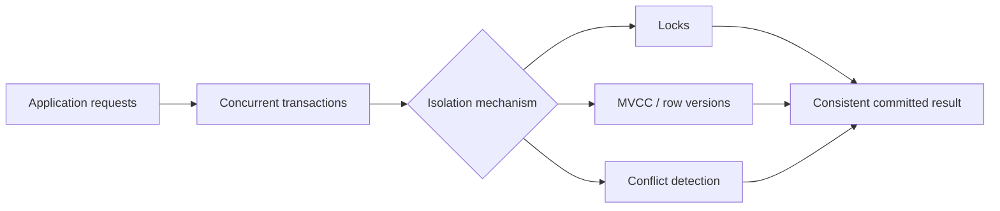
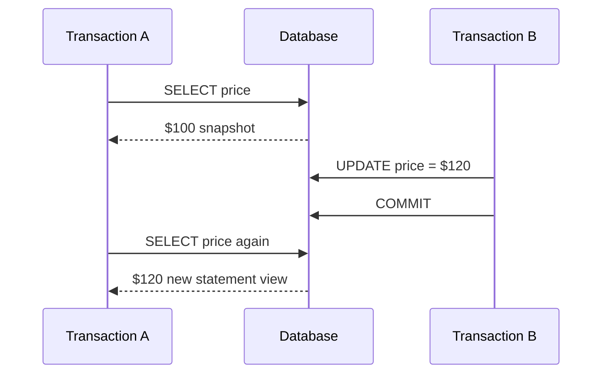
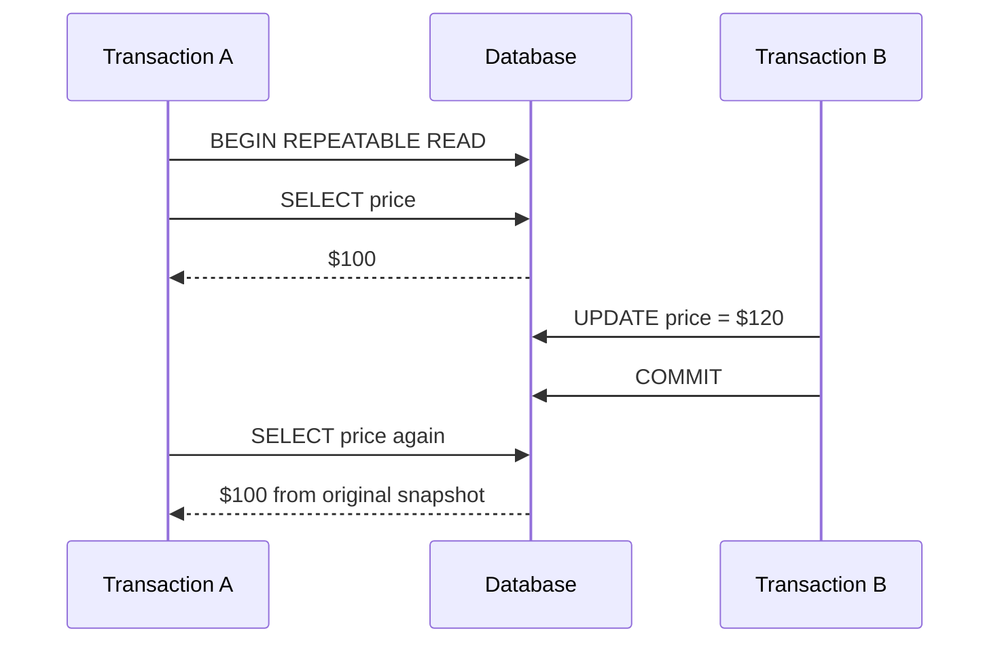
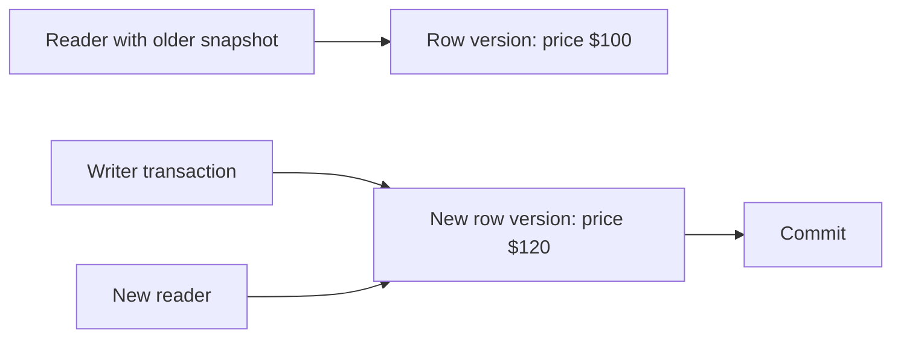
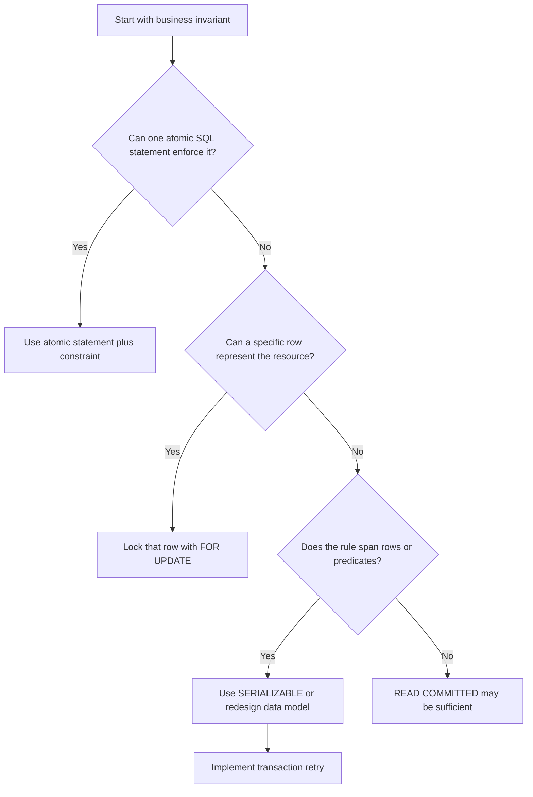

# Transaction Isolation Levels

> **Topic:** Databases & SQL  
> **Level:** Intermediate developer  
> **Purpose:** Understand how concurrent database transactions interact, which anomalies each isolation level prevents, and how to choose the right level in production.

---

# 1. Why Transaction Isolation Exists

Modern applications execute many database operations concurrently.

For example, at the same moment:

- Two customers may try to buy the last product.
- Two API requests may update the same account balance.
- A reporting query may read data while another transaction changes it.
- Two workers may claim the same queued job.

Concurrency improves throughput, but it also creates correctness risks.

Consider an account with a balance of **$1,000**. Two requests execute at nearly the same time:

```text
Transaction A withdraws $200
Transaction B withdraws $300
```

Without correct concurrency control, both transactions may read `$1,000`, independently calculate a new balance, and overwrite each other.

```text
Expected final balance: $500
Possible incorrect result: $700 or $800
```

A transaction isolation level defines how much one transaction is protected from the intermediate or concurrent activity of other transactions.

---

# 2. Isolation in ACID

A database transaction is commonly described through the **ACID** properties:

| Property | Meaning |
|---|---|
| **Atomicity** | All operations succeed together or are rolled back together. |
| **Consistency** | A transaction moves the database from one valid state to another valid state. |
| **Isolation** | Concurrent transactions should not produce incorrect interactions. |
| **Durability** | Once committed, changes survive crashes according to the database's durability guarantees. |

Isolation does **not** always mean that transactions literally run one after another.

Instead, the database may use locks, row versions, conflict detection, or a combination of these techniques to make concurrent execution behave safely.



---

# 3. A Simple Mental Model

Imagine each transaction is a developer editing shared data.

- At a weak isolation level, developers can see more of each other's ongoing work.
- At a stronger isolation level, each developer sees a more stable view.
- At the strongest level, the final result must be equivalent to some serial, one-at-a-time execution order.

```text
Lower isolation
    More concurrency
    Fewer waits or aborts
    More anomalies possible

Higher isolation
    Stronger correctness guarantees
    More locking, versioning, validation, or retries
    Potentially lower throughput for conflicting workloads
```

The goal is not always to choose the strongest level everywhere. The goal is to choose the weakest level that still guarantees correctness for the business operation.

---

# 4. Concurrency Anomalies

Isolation levels are easier to understand when you first understand the anomalies they are designed to prevent.

---

## 4.1 Dirty Read

A dirty read occurs when one transaction reads data written by another transaction that has not committed.

### Example

Initial balance:

```text
account.balance = $1,000
```

Timeline:

```text
Transaction A                       Transaction B
-------------                       -------------
BEGIN
UPDATE balance = $0
                                    BEGIN
                                    SELECT balance  --> reads $0
ROLLBACK
                                    Uses $0 in business logic
```

Transaction B used a value that never became part of the committed database state.

### Why it is dangerous

The application may:

- display values that later disappear;
- make decisions based on rolled-back data;
- send incorrect notifications;
- calculate totals from data that never officially existed.

Dirty reads are permitted only by `READ UNCOMMITTED` in the standard model.

---

## 4.2 Non-Repeatable Read

A non-repeatable read occurs when a transaction reads the same row twice and receives different committed values because another transaction updated the row between those reads.

### Example

```text
Transaction A                       Transaction B
-------------                       -------------
BEGIN
SELECT price --> $100
                                    BEGIN
                                    UPDATE price = $120
                                    COMMIT
SELECT price --> $120
COMMIT
```

Transaction A does not have a stable view of the row.

### Typical impact

A service may validate a value early in a transaction but use a different value later.

---

## 4.3 Phantom Read

A phantom read occurs when a transaction repeats a predicate-based query and sees a different set of rows because another transaction inserted, deleted, or changed rows matching the predicate.

### Example

```sql
SELECT COUNT(*)
FROM bookings
WHERE room_id = 10
  AND booking_date = DATE '2026-08-15';
```

Timeline:

```text
Transaction A                       Transaction B
-------------                       -------------
Query returns 4 rows
                                    Inserts another matching booking
                                    COMMIT
Same query returns 5 rows
```

The new matching row is called a **phantom**.

### Row change vs phantom

- A **non-repeatable read** changes the value of an existing row.
- A **phantom read** changes which rows satisfy a query condition.

---

## 4.4 Lost Update

A lost update occurs when two transactions read the same value, calculate new values independently, and one update overwrites the other.

### Example

Initial stock:

```text
stock = 10
```

```text
Transaction A                       Transaction B
-------------                       -------------
Reads stock = 10                    Reads stock = 10
Calculates 10 - 2 = 8               Calculates 10 - 3 = 7
Writes stock = 8                    Writes stock = 7
COMMIT                              COMMIT
```

Expected stock:

```text
10 - 2 - 3 = 5
```

Actual stock:

```text
7
```

Transaction A's update was lost.

### Important nuance

The classic SQL isolation table focuses on dirty reads, non-repeatable reads, phantoms, and serialization anomalies. Lost updates are still extremely important in real applications, but exact protection varies by database and by how the update is written.

This is unsafe:

```sql
SELECT stock FROM products WHERE id = 101;
-- Application calculates a new value.
UPDATE products SET stock = 7 WHERE id = 101;
```

This is usually safer because the calculation happens atomically in the database:

```sql
UPDATE products
SET stock = stock - 3
WHERE id = 101
  AND stock >= 3;
```

Then check that exactly one row was updated.

---

## 4.5 Write Skew

Write skew can happen when two transactions read the same consistent snapshot, update different rows, and together violate a cross-row business rule.

### Example: doctors on call

Business rule:

```text
At least one doctor must remain on call.
```

Initial data:

```text
Alice: on_call = true
Bob:   on_call = true
```

Concurrent transactions:

```text
Transaction A                         Transaction B
-------------                         -------------
Reads Alice=true, Bob=true            Reads Alice=true, Bob=true
Sets Alice=false                      Sets Bob=false
COMMIT                                COMMIT
```

Final state:

```text
Alice: false
Bob:   false
```

Each transaction updated a different row, so ordinary row-level write conflict detection may not notice the business-rule violation.

Write skew is a major reason why **snapshot isolation is not automatically equivalent to serializable isolation**.

---

## 4.6 Serialization Anomaly

A serialization anomaly means the final result of concurrent transactions cannot be explained by any valid serial order.

Serializable isolation aims to guarantee:

```text
Concurrent result = result of some one-at-a-time transaction order
```

For two transactions, acceptable serial outcomes are:

```text
A then B
```

or:

```text
B then A
```

If the concurrent outcome is impossible under both orders, a serialization anomaly occurred.

---

# 5. The Four Standard Isolation Levels

The traditional SQL model defines four named levels:

1. `READ UNCOMMITTED`
2. `READ COMMITTED`
3. `REPEATABLE READ`
4. `SERIALIZABLE`

Each stronger level provides at least the guarantees of the previous level, conceptually. Real database implementations may provide stronger guarantees than the minimum required by the standard.

---

## 5.1 Read Uncommitted

`READ UNCOMMITTED` is the weakest standard isolation level.

### What it allows

A transaction may read changes made by another transaction before those changes are committed.

```sql
SET TRANSACTION ISOLATION LEVEL READ UNCOMMITTED;
```

### Possible anomalies

- Dirty reads
- Non-repeatable reads
- Phantom reads
- Other inconsistent observations

### Practical use

It is rarely appropriate for correctness-sensitive application logic.

Possible use cases are limited to approximate monitoring or diagnostics where inconsistent values are acceptable. Even there, database-specific alternatives are often better.

### Important database difference

Some databases accept the syntax but internally provide stronger behavior. For example, PostgreSQL treats `READ UNCOMMITTED` as `READ COMMITTED`.

---

## 5.2 Read Committed

`READ COMMITTED` prevents dirty reads.

Each statement sees only committed data, but two statements inside the same transaction may see different committed states.

```sql
SET TRANSACTION ISOLATION LEVEL READ COMMITTED;
```

### Snapshot scope

A useful mental model is:

```text
New committed view for each statement
```



### Prevents

- Dirty reads

### May allow

- Non-repeatable reads
- Phantom reads
- Multi-statement business logic anomalies

### Typical use

`READ COMMITTED` is a common default because it provides a good balance between concurrency and consistency.

It works well when:

- each SQL statement is independently correct;
- updates use atomic SQL expressions;
- critical rows are explicitly locked;
- unique constraints and other database constraints enforce invariants.

---

## 5.3 Repeatable Read

`REPEATABLE READ` gives a transaction a more stable view of previously read data.

```sql
SET TRANSACTION ISOLATION LEVEL REPEATABLE READ;
```

### Snapshot scope

In MVCC-based implementations, the mental model is often:

```text
One stable snapshot for the transaction
```



### Prevents

At minimum:

- Dirty reads
- Non-repeatable reads

### Phantoms and implementation differences

The SQL-standard minimum permits phantom reads at `REPEATABLE READ`. However, real databases vary:

- PostgreSQL's `REPEATABLE READ` uses a transaction-level snapshot and prevents the standard phantom-read phenomenon, but serialization anomalies can still occur.
- MySQL InnoDB uses consistent snapshots and, for locking range operations, next-key or gap locking that can prevent certain phantom inserts.
- SQL Server's lock-based `REPEATABLE READ` holds shared locks on rows read but does not automatically protect all matching gaps, so phantom rows can still appear.

### Main limitation

A stable snapshot is not enough to guarantee that concurrent transactions preserve every multi-row invariant. Write skew can still be possible depending on the implementation.

---

## 5.4 Serializable

`SERIALIZABLE` is the strongest standard isolation level.

```sql
SET TRANSACTION ISOLATION LEVEL SERIALIZABLE;
```

Its goal is to make committed concurrent transactions behave as though they ran one at a time in some order.

### Guarantees

It prevents serialization anomalies for successfully committed transactions.

### How databases may achieve it

A database may use:

- strict range and predicate locking;
- serializable snapshot isolation;
- dependency tracking;
- validation at commit time;
- transaction aborts when a safe serial order cannot be guaranteed.

### Important production behavior

`SERIALIZABLE` does not necessarily mean every transaction waits until it can commit.

A database may abort one transaction with a serialization failure or deadlock error. The application must retry the **entire transaction**.

```text
BEGIN transaction
    Read data
    Validate conditions
    Write data
COMMIT

If serialization failure:
    Roll back
    Wait briefly with jitter
    Retry the complete transaction
```

### Appropriate use cases

- financial ledger operations;
- capacity or booking rules spanning multiple rows;
- allocation algorithms;
- workflows with complex read-then-write invariants;
- operations where an impossible concurrent state must never commit.

---

# 6. Isolation-Level Comparison

## 6.1 Standard conceptual comparison

| Isolation level | Dirty read | Non-repeatable read | Phantom read | Serialization anomaly |
|---|---:|---:|---:|---:|
| `READ UNCOMMITTED` | Possible | Possible | Possible | Possible |
| `READ COMMITTED` | Prevented | Possible | Possible | Possible |
| `REPEATABLE READ` | Prevented | Prevented | Possible by standard minimum | Possible |
| `SERIALIZABLE` | Prevented | Prevented | Prevented | Prevented for committed transactions |

> This table describes the standard conceptual model. A database may provide stronger behavior than the minimum for a named level.

## 6.2 Practical trade-off

| Level | Consistency | Concurrency | Typical cost | Common use |
|---|---|---|---|---|
| `READ UNCOMMITTED` | Very low | Very high | Inconsistent reads | Rare diagnostics only |
| `READ COMMITTED` | Moderate | High | Re-checking or locking may be needed | General OLTP APIs |
| `REPEATABLE READ` | Strong snapshot stability | Medium to high | Version retention or longer locks | Reports, multi-step reads, selected workflows |
| `SERIALIZABLE` | Strongest | Workload-dependent | Blocking or retryable aborts | Critical invariants |

---

# 7. How Databases Implement Isolation

The isolation-level name describes a guarantee, not one universal implementation.

Two databases can expose the same isolation level while using different internal mechanisms.

---

## 7.1 Lock-Based Concurrency Control

A lock-based system controls access to data using locks such as:

- **Shared lock:** used for reading.
- **Exclusive lock:** used for writing.
- **Update lock:** helps coordinate a read that may become a write.
- **Range or predicate lock:** protects a search range from matching inserts or changes.

```text
Reader acquires shared lock
Writer needs exclusive lock
Incompatible locks cause blocking
```

### Strengths

- Direct protection against conflicting operations.
- Easy mental model for `SELECT ... FOR UPDATE`.
- Range locks can protect predicate-based invariants.

### Costs

- Blocking and lock waits.
- Deadlocks.
- Lock memory usage.
- Reduced concurrency for long transactions.

---

## 7.2 Multiversion Concurrency Control (MVCC)

MVCC stores or reconstructs multiple versions of a row.

A reader can see an older committed version while another transaction updates the current version.

```text
Row version history

Version 1: price = $100, visible to older snapshot
Version 2: price = $120, visible after writer commits
```



### Strengths

- Readers often do not block writers.
- Writers often do not block ordinary readers.
- Stable snapshots are efficient for many read-heavy workloads.

### Costs

- Old row versions must be retained and cleaned up.
- Long-running transactions can delay cleanup.
- Update conflicts and serialization failures still exist.
- Snapshot consistency does not automatically protect all business invariants.

---

## 7.3 Snapshot Isolation

Snapshot isolation normally gives a transaction a consistent view of data from a particular point in time.

It commonly prevents:

- dirty reads;
- non-repeatable reads;
- ordinary phantom changes within the snapshot.

However, snapshot isolation may still allow write skew because two transactions can update different rows after reading the same snapshot.

```text
Snapshot isolation
    Stable transaction view
    Write-write conflict detection
    Write skew may still be possible

Serializable isolation
    Stable or controlled view
    Also prevents impossible cross-transaction outcomes
```

SQL Server exposes a level explicitly named `SNAPSHOT`. PostgreSQL's `REPEATABLE READ` has snapshot-like behavior, while PostgreSQL's `SERIALIZABLE` adds conflict monitoring to detect dangerous dependency patterns.

---

# 8. Practical SQL Examples

## 8.1 Generic transaction syntax

Exact syntax varies, but the common form is:

```sql
BEGIN;

SET TRANSACTION ISOLATION LEVEL SERIALIZABLE;

-- Read and write operations

COMMIT;
```

Some databases require the isolation level to be selected before the first statement that accesses data.

---

## 8.2 Lost-update-safe inventory decrement

### Weak read-modify-write approach

```sql
BEGIN;

SELECT stock
FROM products
WHERE id = 101;

-- Application reads 10 and calculates 10 - 3 = 7.

UPDATE products
SET stock = 7
WHERE id = 101;

COMMIT;
```

Two concurrent transactions can overwrite each other.

### Atomic conditional update

```sql
UPDATE products
SET stock = stock - 3
WHERE id = 101
  AND stock >= 3;
```

Application logic:

```text
affected_rows = 1  -> purchase reserved

affected_rows = 0  -> insufficient stock or product missing
```

This approach often works correctly at `READ COMMITTED` because the database performs the condition check and update as one atomic statement.

---

## 8.3 Pessimistic locking with `SELECT ... FOR UPDATE`

Use a locking read when the application must read a row, calculate a change, and ensure another writer cannot modify that row first.

```sql
BEGIN;

SELECT balance
FROM accounts
WHERE id = 42
FOR UPDATE;

UPDATE accounts
SET balance = balance - 200
WHERE id = 42
  AND balance >= 200;

COMMIT;
```

Conceptually:

```text
Transaction A locks account 42
Transaction B attempts to lock account 42
Transaction B waits or fails according to configured behavior
Transaction A commits
Transaction B continues using the current committed row
```

### Variants

Database support differs, but common variants include:

```sql
FOR UPDATE NOWAIT
```

Fail immediately when the row is already locked.

```sql
FOR UPDATE SKIP LOCKED
```

Skip locked rows. This is useful for worker queues but must be used only when skipping is valid for the workflow.

---

## 8.4 Optimistic concurrency control

Add a version column:

```sql
CREATE TABLE documents (
    id          BIGINT PRIMARY KEY,
    content     TEXT NOT NULL,
    version     INTEGER NOT NULL DEFAULT 1
);
```

Read the record:

```sql
SELECT id, content, version
FROM documents
WHERE id = 10;
```

Update only if the version is unchanged:

```sql
UPDATE documents
SET content = 'new content',
    version = version + 1
WHERE id = 10
  AND version = 7;
```

Interpret the result:

```text
1 affected row -> update succeeded
0 affected rows -> another transaction changed the record
```

The application can reload, merge, reject, or retry.

This is common for APIs, ORMs, and user-edited records.

---

## 8.5 Preventing duplicate reservations with a constraint

Suppose one seat can be booked only once for an event.

Use a database constraint:

```sql
CREATE TABLE seat_bookings (
    event_id BIGINT NOT NULL,
    seat_no  VARCHAR(20) NOT NULL,
    user_id  BIGINT NOT NULL,
    PRIMARY KEY (event_id, seat_no)
);
```

Then both concurrent requests may attempt:

```sql
INSERT INTO seat_bookings (event_id, seat_no, user_id)
VALUES (501, 'A-10', 9001);
```

Only one can satisfy the primary-key constraint.

This is usually safer than:

```text
Check whether seat is free
Then insert
```

because the check and insert are separate operations unless protected by locking or serializable isolation.

---

## 8.6 Protecting a range-based rule

Business rule:

```text
A room may have at most 10 active bookings for a date.
```

A simple pattern is:

```sql
BEGIN;

SELECT COUNT(*)
FROM bookings
WHERE room_id = 10
  AND booking_date = DATE '2026-08-15'
  AND status = 'ACTIVE';

-- If count < 10, insert booking.

INSERT INTO bookings (...)
VALUES (...);

COMMIT;
```

At `READ COMMITTED`, two transactions can both count 9 and both insert, producing 11 bookings.

Possible solutions include:

- run the operation at `SERIALIZABLE` and retry serialization failures;
- lock a parent row representing the room/date capacity;
- maintain a capacity row and atomically increment it conditionally;
- redesign the data model so a database constraint can represent the rule.

A parent-row locking design:

```sql
BEGIN;

SELECT booked_count, capacity
FROM room_inventory
WHERE room_id = 10
  AND booking_date = DATE '2026-08-15'
FOR UPDATE;

UPDATE room_inventory
SET booked_count = booked_count + 1
WHERE room_id = 10
  AND booking_date = DATE '2026-08-15'
  AND booked_count < capacity;

-- Insert the booking only when the update affected one row.

COMMIT;
```

---

## 8.7 Retrying a serializable transaction

Pseudocode:

```python
MAX_ATTEMPTS = 4

for attempt in range(MAX_ATTEMPTS):
    try:
        with database.transaction(isolation="serializable"):
            execute_complete_business_operation()
        break
    except SerializationFailure:
        if attempt == MAX_ATTEMPTS - 1:
            raise

        sleep(exponential_backoff_with_jitter(attempt))
```

The retry must re-run the entire transaction because every read and decision may have depended on the old snapshot.

The operation should also be idempotent when external side effects are involved.

---

# 9. Database-Specific Behavior

Isolation names are not perfectly portable. Always verify the behavior of the exact database engine and version used by the application.

---

## 9.1 PostgreSQL

Current PostgreSQL documentation describes these practical behaviors:

- Default isolation level: `READ COMMITTED`.
- `READ UNCOMMITTED` behaves like `READ COMMITTED`.
- `READ COMMITTED` uses a new snapshot for each command.
- `REPEATABLE READ` uses a transaction-level snapshot and prevents the standard dirty-read, non-repeatable-read, and phantom-read phenomena, but serialization anomalies remain possible.
- `SERIALIZABLE` adds monitoring for dangerous read/write dependency patterns and may abort a transaction with a serialization failure.

### PostgreSQL syntax

```sql
BEGIN TRANSACTION ISOLATION LEVEL REPEATABLE READ;

SELECT *
FROM orders
WHERE customer_id = 100;

COMMIT;
```

or:

```sql
BEGIN;
SET TRANSACTION ISOLATION LEVEL SERIALIZABLE;
-- statements
COMMIT;
```

### PostgreSQL application requirement

Handle errors such as serialization failures and retry the complete transaction.

---

## 9.2 MySQL InnoDB

Current MySQL InnoDB documentation exposes all four standard isolation levels.

- Default isolation level: `REPEATABLE READ`.
- Consistent non-locking reads use MVCC snapshots.
- In `REPEATABLE READ`, ordinary consistent reads within a transaction use the snapshot established by the first consistent read.
- Locking reads and modifying statements use locks.
- Range scans may use gap locks or next-key locks, particularly under `REPEATABLE READ`, to prevent conflicting inserts into scanned ranges.

### MySQL syntax

```sql
SET SESSION TRANSACTION ISOLATION LEVEL READ COMMITTED;

START TRANSACTION;
-- statements
COMMIT;
```

For the next transaction:

```sql
SET TRANSACTION ISOLATION LEVEL SERIALIZABLE;
START TRANSACTION;
-- statements
COMMIT;
```

### Important MySQL nuance

A transaction can mix:

- snapshot-based non-locking reads; and
- current-state locking reads or writes.

This can surprise developers who assume every statement sees the same type of view.

---

## 9.3 SQL Server and Azure SQL

SQL Server supports:

- `READ UNCOMMITTED`
- `READ COMMITTED`
- `REPEATABLE READ`
- `SNAPSHOT`
- `SERIALIZABLE`

Default `READ COMMITTED` behavior depends on database configuration:

- With `READ_COMMITTED_SNAPSHOT OFF`, SQL Server uses shared locks for reads.
- With `READ_COMMITTED_SNAPSHOT ON`, it uses row versioning to provide statement-level consistent snapshots.
- Azure SQL Database and SQL database in Microsoft Fabric use `READ_COMMITTED_SNAPSHOT ON` by default according to current Microsoft documentation.

### SQL Server syntax

```sql
SET TRANSACTION ISOLATION LEVEL SERIALIZABLE;
BEGIN TRANSACTION;

-- statements

COMMIT TRANSACTION;
```

### Enabling snapshot isolation

```sql
ALTER DATABASE application_db
SET ALLOW_SNAPSHOT_ISOLATION ON;
```

Then:

```sql
SET TRANSACTION ISOLATION LEVEL SNAPSHOT;
BEGIN TRANSACTION;
-- statements
COMMIT TRANSACTION;
```

### Important distinction

`READ_COMMITTED_SNAPSHOT` changes how `READ COMMITTED` is implemented. It does not make `READ COMMITTED` a transaction-level snapshot; each statement still gets its own view.

---

## 9.4 Oracle Database

Current Oracle documentation describes `READ COMMITTED` as the default behavior and supports `SERIALIZABLE` for read-write transaction isolation. Oracle also supports read-only transactions.

- `READ COMMITTED` provides statement-level read consistency.
- `SERIALIZABLE` extends consistency across the transaction and may reject a conflicting update.
- Oracle uses multiversion consistency so readers generally see committed versions rather than uncommitted changes.

### Oracle syntax

```sql
SET TRANSACTION ISOLATION LEVEL SERIALIZABLE;
```

or at session scope:

```sql
ALTER SESSION SET ISOLATION_LEVEL = SERIALIZABLE;
```

The transaction-setting statement must be placed according to Oracle's transaction rules, normally before other transactional work.

---

## 9.5 SQLite

SQLite's concurrency model differs from client-server databases.

According to SQLite documentation:

- Transactions are serializable in the normal configuration because writes are serialized.
- In rollback-journal mode, readers may be temporarily blocked while changes are written.
- In WAL mode, readers and writers can operate concurrently, and readers observe snapshot isolation.
- `PRAGMA read_uncommitted` has limited effect and dirty reads require shared-cache conditions that are uncommon and generally discouraged.

SQLite is highly suitable for embedded and local workloads, but its single-writer model should be considered for write-heavy concurrency.

---

## 9.6 Default-level summary

| Database | Common/default behavior | Important note |
|---|---|---|
| PostgreSQL | `READ COMMITTED` | `READ UNCOMMITTED` maps to `READ COMMITTED`. |
| MySQL InnoDB | `REPEATABLE READ` | Uses MVCC plus record, gap, and next-key locks depending on operation. |
| SQL Server | `READ COMMITTED` | Locking or row-versioned behavior depends on `READ_COMMITTED_SNAPSHOT`. |
| Azure SQL Database | `READ COMMITTED` with row versioning by default | Each statement receives its own consistent view. |
| Oracle Database | `READ COMMITTED` | Statement-level consistency; `SERIALIZABLE` is also supported. |
| SQLite | Serializable writes; snapshot reads in WAL mode | Writes are serialized by SQLite's architecture. |

> Defaults and implementation details can change across products, deployment types, or configuration. Check the documentation and actual database settings in production.

---

# 10. Selecting the Right Isolation Level

Choose based on the invariant being protected, not only on query type.

## 10.1 Decision guide



## 10.2 Typical recommendations

### General CRUD APIs

Start with the database default, commonly `READ COMMITTED`, and combine it with:

- primary keys;
- unique constraints;
- foreign keys;
- check constraints;
- atomic updates;
- optimistic version checks.

### Account or inventory update

Prefer atomic conditional SQL:

```sql
UPDATE accounts
SET balance = balance - 200
WHERE id = 42
  AND balance >= 200;
```

Use row locks when multiple related statements are unavoidable.

### Long analytical read

A repeatable snapshot may be useful when all queries in a report must see the same logical point in time.

Be careful: long snapshots can retain old row versions and increase cleanup pressure.

### Cross-row invariant

Use one of:

- `SERIALIZABLE` with retries;
- explicit locking of a shared parent or coordination row;
- an advisory lock where appropriate;
- a schema redesign that converts the rule into a constraint.

### Worker queue

A common pattern is:

```sql
SELECT id
FROM jobs
WHERE status = 'PENDING'
ORDER BY created_at
FOR UPDATE SKIP LOCKED
LIMIT 1;
```

Then mark the selected job as running in the same transaction.

`SKIP LOCKED` improves worker concurrency, but skipped rows are intentionally not a globally consistent result set.

---

# 11. Correctness Patterns Beyond Isolation

Isolation is only one part of concurrency-safe application design.

---

## 11.1 Database constraints

Constraints are often the strongest and simplest protection.

```sql
ALTER TABLE users
ADD CONSTRAINT users_email_unique UNIQUE (email);
```

```sql
ALTER TABLE accounts
ADD CONSTRAINT non_negative_balance CHECK (balance >= 0);
```

A transaction isolation level controls interactions. A constraint defines which final states are allowed.

Use both when needed.

---

## 11.2 Atomic statements

Prefer:

```sql
UPDATE counters
SET value = value + 1
WHERE id = 1;
```

Instead of:

```text
SELECT value
Increment in application
UPDATE with calculated value
```

Fewer round trips and fewer read/write gaps usually mean fewer concurrency risks.

---

## 11.3 Pessimistic locking

Pessimistic locking assumes conflicts are likely.

```sql
SELECT ... FOR UPDATE;
```

Use it when:

- the transaction is short;
- the locked resource is clear;
- conflict probability is high;
- waiting is acceptable.

---

## 11.4 Optimistic locking

Optimistic locking assumes conflicts are uncommon.

Common implementation:

```text
version column
updated_at check
ETag / If-Match at the HTTP layer
```

Use it when:

- records are read much more often than updated;
- user edits may take a long time;
- blocking a row during user interaction would be unacceptable.

---

## 11.5 Idempotency

A retried transaction or API request must not create duplicate external effects.

Example:

```sql
CREATE TABLE payment_requests (
    idempotency_key VARCHAR(100) PRIMARY KEY,
    payment_id      BIGINT NOT NULL,
    created_at      TIMESTAMP NOT NULL
);
```

The same idempotency key should map to the same logical operation.

This is especially important when retrying after:

- serialization failures;
- deadlocks;
- connection timeouts;
- uncertain commit outcomes.

---

## 11.6 Transactional outbox

Avoid sending a message directly in the middle of a transaction:

```text
Update database
Send message to broker
Commit database
```

A failure between these steps can create inconsistent outcomes.

Instead, write the domain change and an outbox record in the same database transaction:

```sql
BEGIN;

UPDATE orders
SET status = 'PAID'
WHERE id = 501;

INSERT INTO outbox_events (event_type, aggregate_id, payload)
VALUES ('OrderPaid', 501, '{...}');

COMMIT;
```

A separate publisher safely sends pending outbox events.

---

# 12. Performance and Operational Considerations

## 12.1 Stronger does not always mean slower in the same way

The cost depends on:

- contention pattern;
- transaction duration;
- read/write ratio;
- indexes;
- lock granularity;
- MVCC cleanup;
- database implementation;
- probability of serialization retries.

A `SERIALIZABLE` workload with low contention may perform well. A poorly indexed `READ COMMITTED` transaction that locks thousands of rows may perform badly.

---

## 12.2 Keep transactions short

Do not hold a database transaction open while:

- waiting for user input;
- calling a slow external API;
- uploading a file;
- performing CPU-heavy work;
- sleeping or polling unnecessarily.

Long transactions can cause:

- lock contention;
- deadlocks;
- old-version retention;
- table bloat;
- delayed vacuum or cleanup;
- larger rollback work;
- reduced connection-pool capacity.

---

## 12.3 Indexes affect locking

A query without a useful index may scan and lock more rows or ranges than expected.

Example:

```sql
SELECT *
FROM orders
WHERE customer_id = 100
FOR UPDATE;
```

An index on `customer_id` helps the database locate and lock only the relevant rows more efficiently.

```sql
CREATE INDEX orders_customer_id_idx
ON orders (customer_id);
```

The exact locking effect remains database-specific.

---

## 12.4 Deadlocks are normal operational events

A deadlock occurs when transactions wait on each other in a cycle.

```text
Transaction A holds row 1 and waits for row 2
Transaction B holds row 2 and waits for row 1
```

The database usually aborts one transaction.

Reduce deadlocks by:

- locking resources in a consistent order;
- keeping transactions short;
- indexing queries correctly;
- touching fewer rows;
- retrying the complete transaction when the error is retryable.

---

## 12.5 Monitor the real system

Useful production signals include:

- transaction latency;
- lock-wait duration;
- deadlock count;
- serialization-failure count;
- retry count;
- long-running transaction count;
- oldest active transaction age;
- blocked sessions;
- MVCC version-store or cleanup pressure;
- rollback rate.

Isolation problems are often workload-dependent and may not appear in single-user tests.

---

# 13. Production Best Practices

## 13.1 Define the invariant first

Do not begin with:

```text
Which isolation level should this endpoint use?
```

Begin with:

```text
Which database states must never be committed?
```

Examples:

- account balance must not become negative;
- one email must belong to at most one user;
- a seat must not be sold twice;
- booked capacity must not exceed available capacity;
- at least one approver must remain active.

---

## 13.2 Put enforceable rules in the database

Prefer database-enforced rules when possible:

- `PRIMARY KEY`
- `UNIQUE`
- `FOREIGN KEY`
- `CHECK`
- exclusion constraints where supported
- atomic conditional updates

Application checks alone are vulnerable to race conditions.

---

## 13.3 Use explicit locking only for a clear resource

A row lock is effective when a specific row represents the resource being changed.

For a predicate such as "all bookings overlapping this time range," locking only existing rows may not block a new matching row. You may need range locking, serializable isolation, an exclusion constraint, or a coordination row.

---

## 13.4 Retry only recognized transient failures

Typical retryable categories include:

- serialization failure;
- deadlock victim;
- certain lock timeouts, depending on business behavior;
- transient connection failures when commit outcome is known or safely handled.

Do not blindly retry:

- unique-constraint violations representing a real business conflict;
- invalid input;
- authorization errors;
- permanent database errors.

---

## 13.5 Re-run the entire transaction

After a serialization failure or deadlock, do not retry only the final `UPDATE`.

All reads and decisions made inside the old transaction may now be invalid.

```text
Incorrect retry:
    Retry only COMMIT or final UPDATE

Correct retry:
    Begin new transaction
    Re-read data
    Re-evaluate conditions
    Re-run writes
    Commit
```

---

## 13.6 Test concurrency deliberately

A normal unit test often runs operations sequentially and misses race conditions.

Create tests with:

- two or more independent database connections;
- barriers that pause transactions at controlled points;
- repeated execution;
- assertions about final committed state;
- expected blocking, conflicts, or retry behavior.

Example test structure:

```text
Connection A begins
Connection B begins
A reads state
B reads state
Release both writers together
Wait for commits or expected failures
Assert final invariant
```

---

## 13.7 Do not assume ORM transactions solve concurrency automatically

An ORM can make transaction boundaries easier, but correctness still depends on:

- isolation level;
- generated SQL;
- locking clauses;
- constraints;
- retry behavior;
- transaction scope;
- database-specific semantics.

Always inspect the SQL and understand the database guarantee.

---

# 14. Interview-Relevant Summary

## 14.1 Core definition

A transaction isolation level controls which concurrent changes a transaction can observe and which concurrency anomalies are permitted.

## 14.2 The four levels

```text
READ UNCOMMITTED
    Can read uncommitted data

READ COMMITTED
    Reads only committed data
    Usually a new view per statement

REPEATABLE READ
    Provides a stable view for repeated reads
    Exact phantom behavior is database-specific

SERIALIZABLE
    Committed outcome must match some serial order
    May require blocking or transaction retries
```

## 14.3 Most important practical insight

Isolation-level names are not enough.

You must know:

1. the business invariant;
2. the database engine's exact behavior;
3. whether the operation uses ordinary reads, locking reads, or writes;
4. whether constraints can enforce the rule;
5. how the application handles deadlocks and serialization failures.

## 14.4 Quick selection summary

```text
Simple independent statements
    READ COMMITTED + constraints + atomic SQL

Stable multi-query report
    REPEATABLE READ / snapshot-style transaction

Read-modify-write on a known row
    SELECT ... FOR UPDATE or optimistic version check

Cross-row or predicate invariant
    SERIALIZABLE, coordination locking, or schema redesign

High-contention critical workflow
    Short transaction + deterministic lock order + retry strategy
```

## 14.5 Final mental model


The best solution is usually not "increase the isolation level everywhere." It is a combination of correct schema design, atomic SQL, targeted locking, appropriate isolation, short transactions, and reliable retry handling.

---

# 15. Official References

The database-specific notes in this guide were checked against current official documentation in July 2026.

1. PostgreSQL 18 — Transaction Isolation  
   https://www.postgresql.org/docs/current/transaction-iso.html

2. PostgreSQL 18 — `SET TRANSACTION`  
   https://www.postgresql.org/docs/current/sql-set-transaction.html

3. PostgreSQL 18 — Data Consistency Checks at the Application Level  
   https://www.postgresql.org/docs/current/applevel-consistency.html

4. MySQL Reference Manual — InnoDB Transaction Isolation Levels  
   https://dev.mysql.com/doc/refman/9.7/en/innodb-transaction-isolation-levels.html

5. Microsoft Learn — `SET TRANSACTION ISOLATION LEVEL`  
   https://learn.microsoft.com/en-us/sql/t-sql/statements/set-transaction-isolation-level-transact-sql

6. Microsoft Learn — Transaction Locking and Row Versioning Guide  
   https://learn.microsoft.com/en-us/sql/relational-databases/sql-server-transaction-locking-and-row-versioning-guide

7. Oracle AI Database 26 — Data Concurrency and Consistency  
   https://docs.oracle.com/en/database/oracle/oracle-database/26/cncpt/data-concurrency-and-consistency.html

8. Oracle AI Database 26 — `SET TRANSACTION`  
   https://docs.oracle.com/en/database/oracle/oracle-database/26/sqlrf/SET-TRANSACTION.html

9. SQLite — Isolation in SQLite  
   https://www.sqlite.org/isolation.html

---

**End of document**
