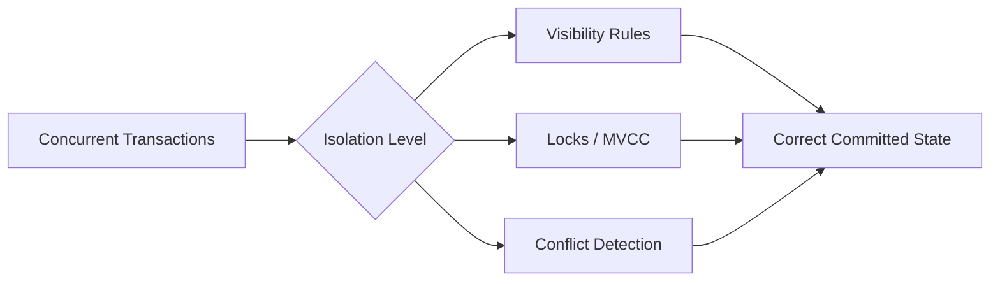
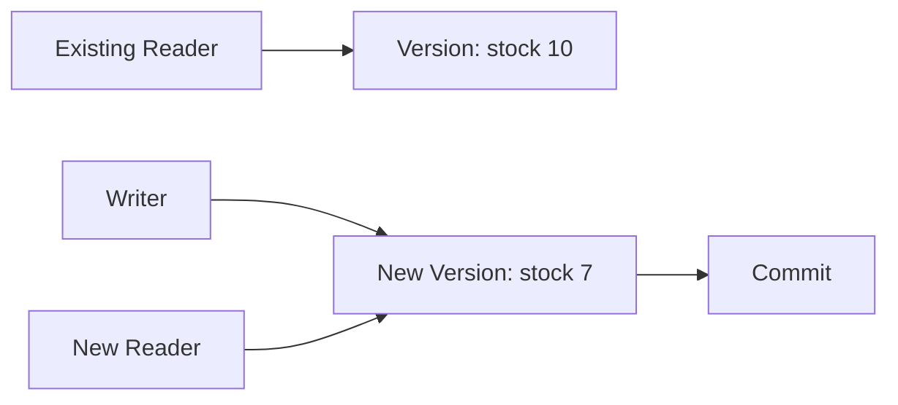
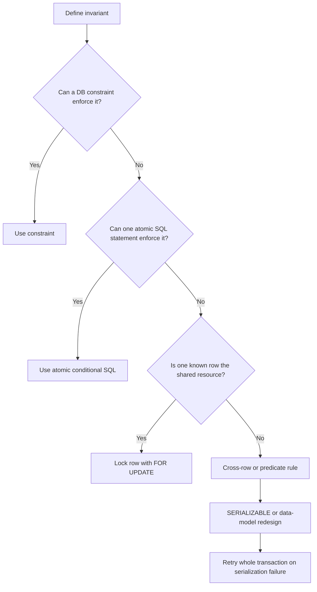

# Transaction Isolation Levels

> Transaction isolation controls how concurrent transactions see and affect each other's data. The goal is to keep data correct without unnecessarily reducing concurrency.

## In short

- The four standard levels are `READ UNCOMMITTED`, `READ COMMITTED`, `REPEATABLE READ`, and `SERIALIZABLE`.
- Stronger isolation prevents more concurrency anomalies, but can increase blocking, conflict detection, or retries.
- The key anomalies to understand are **dirty read**, **non-repeatable read**, **phantom read**, **lost update**, and **write skew**.
- Isolation level names describe guarantees; exact behavior differs by database engine.
- In normal backend development, start with the database default, enforce rules with constraints and atomic SQL, and use row locks or `SERIALIZABLE` only when the business invariant requires them.
- A serialization failure is normally handled by retrying the **entire transaction**.



---

# 1. Why Isolation Exists

Real applications execute many requests at the same time.

Examples:

- two users buy the last available item;
- two API requests update the same account balance;
- multiple workers claim pending jobs;
- one transaction reads data while another transaction changes it.

Consider an inventory row:

```text
stock = 10

Transaction A reads 10 and subtracts 2 -> 8
Transaction B reads 10 and subtracts 3 -> 7
```

If both write their calculated value independently, the final value may become `7` or `8` instead of the correct value `5`.

Isolation and concurrency-control mechanisms exist to prevent this type of incorrect interaction.

---

# 2. Important Concurrency Anomalies

## 2.1 Dirty Read

A transaction reads data written by another transaction **before it commits**.

```text
Transaction A                 Transaction B
-------------                 -------------
UPDATE balance = 0
                              SELECT balance -> 0
ROLLBACK
```

Transaction B used a value that never became committed data.

---

## 2.2 Non-Repeatable Read

The same row is read twice in one transaction, but another committed transaction changes it between the reads.

```text
Transaction A                 Transaction B
-------------                 -------------
SELECT price -> 100
                              UPDATE price = 120
                              COMMIT
SELECT price -> 120
```

The transaction does not have a stable view of that row.

---

## 2.3 Phantom Read

A transaction repeats a predicate-based query and gets a different set of matching rows because another transaction inserted, deleted, or changed matching data.

```sql
SELECT COUNT(*)
FROM bookings
WHERE room_id = 10
  AND booking_date = DATE '2026-08-15';
```

The first query may return `4`, another transaction inserts a matching booking, and the same query later returns `5`.

**Difference:**

- Non-repeatable read -> an existing row changes.
- Phantom read -> the set of rows matching a condition changes.

---

## 2.4 Lost Update

Two transactions read the same value, calculate independently, and one write overwrites the other.

```text
Initial stock = 10

A reads 10 -> writes 8
B reads 10 -> writes 7

Expected = 5
Possible final value = 7
```

A common fix is to avoid application-side read-modify-write logic and use an atomic SQL update:

```sql
UPDATE products
SET stock = stock - 3
WHERE id = 101
  AND stock >= 3;
```

Then check whether exactly one row was updated.

---

## 2.5 Write Skew

Two transactions read the same consistent state but update **different rows**, and together violate a multi-row business rule.

Example rule:

> At least one doctor must remain on call.

```text
Initial state
Alice = on call
Bob   = on call

Transaction A sees both -> sets Alice off
Transaction B sees both -> sets Bob off

Final state
Alice = off
Bob   = off
```

There may be no direct row-level write conflict because each transaction changed a different row.

This is why **snapshot isolation is not automatically serializable isolation**.

---

# 3. The Four Standard Isolation Levels

| Isolation level | Dirty read | Non-repeatable read | Phantom read | General idea |
|---|---:|---:|---:|---|
| `READ UNCOMMITTED` | Possible | Possible | Possible | Weakest isolation |
| `READ COMMITTED` | Prevented | Possible | Possible | Fresh committed view per statement in common implementations |
| `REPEATABLE READ` | Prevented | Prevented | Possible by SQL-standard minimum | More stable transaction view |
| `SERIALIZABLE` | Prevented | Prevented | Prevented | Result must match some serial execution order |

> This is the **standard conceptual model**. Real databases may provide stronger behavior at a given named level.

## 3.1 READ UNCOMMITTED

`READ UNCOMMITTED` is the weakest standard level.

It may allow a transaction to read another transaction's uncommitted changes.

```sql
SET TRANSACTION ISOLATION LEVEL READ UNCOMMITTED;
```

It is rarely suitable for business logic where correctness matters.

---

## 3.2 READ COMMITTED

`READ COMMITTED` prevents dirty reads.

A useful mental model is:

```text
Each statement sees committed data,
but two statements in the same transaction may see different committed states.
```

This level is common for general CRUD and OLTP workloads because it provides good concurrency while still avoiding dirty reads.

Use it safely with:

- database constraints;
- atomic updates;
- optimistic version checks;
- targeted `SELECT ... FOR UPDATE` locks when required.

---

## 3.3 REPEATABLE READ

`REPEATABLE READ` provides a more stable view for the transaction.

In MVCC-based databases, it often behaves like a transaction-level snapshot for ordinary reads.

```text
Transaction starts
    |
    |-- SELECT price -> 100
    |
Other transaction changes price to 120 and commits
    |
    |-- SELECT price -> still 100 from the transaction snapshot
```

The SQL standard still allows phantom reads at this level, but some databases provide stronger behavior.

A stable snapshot still does not guarantee every cross-row business invariant. Write skew may remain possible depending on the implementation.

---

## 3.4 SERIALIZABLE

`SERIALIZABLE` is the strongest standard isolation level.

The committed result must be equivalent to transactions running one at a time in some valid order.

```text
Concurrent execution
        |
        v
Equivalent to either
A -> B
or
B -> A
```

Databases may implement this with locks, range/predicate protection, dependency tracking, validation, or transaction aborts.

A serializable transaction can fail because the database cannot safely place it in a serial order. The application must then retry the **whole transaction**.

```python
for attempt in range(MAX_ATTEMPTS):
    try:
        with transaction(isolation="serializable"):
            run_complete_business_operation()
        break
    except SerializationFailure:
        retry_with_backoff(attempt)
```

Use bounded retries and make external side effects idempotent.

---

# 4. Practical Example: Reserving Inventory

Suppose a product has only `3` units left and two requests arrive together.

A weak design is:

```sql
SELECT stock FROM products WHERE id = 101;
-- calculate new stock in application code
UPDATE products SET stock = 0 WHERE id = 101;
```

Two transactions can read the same old stock value and overwrite each other.

## Better approach: atomic conditional update

```sql
UPDATE products
SET stock = stock - 2
WHERE id = 101
  AND stock >= 2;
```

Application logic:

```text
affected_rows = 1 -> reservation succeeded
affected_rows = 0 -> not enough stock
```

For a single-row invariant, this is often simpler and more scalable than increasing the isolation level for the whole transaction.

## When multiple statements must coordinate

Lock the row first:

```sql
BEGIN;

SELECT stock
FROM products
WHERE id = 101
FOR UPDATE;

-- perform related checks and updates

COMMIT;
```

A concurrent transaction trying to lock the same row normally waits, fails immediately with a database-specific `NOWAIT` option, or can skip it with `SKIP LOCKED` where supported.

`SKIP LOCKED` is especially useful for queue workers, but it intentionally returns an incomplete view of currently locked rows.

---

# 5. Locks, MVCC, and Isolation

Isolation level is the guarantee. **Locks and MVCC are implementation mechanisms.**

## 5.1 Lock-based control

Common lock concepts include:

- shared/read locks;
- exclusive/write locks;
- row locks;
- range or predicate locks.

Locks can block conflicting operations and may cause deadlocks.

## 5.2 MVCC

**MVCC (Multiversion Concurrency Control)** keeps multiple row versions so a reader can often continue reading an older committed version while another transaction writes a newer one.



Benefits:

- readers often do not block writers;
- writers often do not block normal readers;
- stable snapshots are practical.

But MVCC does **not** eliminate write conflicts, deadlocks, serialization failures, or every multi-row anomaly.

---

# 6. Database-Specific Behavior

Isolation names are not perfectly portable. Always verify the exact database and configuration used by the application.

| Database | Common/default behavior | Important detail |
|---|---|---|
| **PostgreSQL** | `READ COMMITTED` | `READ UNCOMMITTED` behaves as `READ COMMITTED`; `REPEATABLE READ` uses a stable transaction snapshot and also prevents the standard phantom-read phenomenon; `SERIALIZABLE` can abort with serialization failure. |
| **MySQL InnoDB** | `REPEATABLE READ` | Uses MVCC for consistent reads. Locking and modifying statements can use record, gap, and next-key locks depending on the query and isolation level. |
| **SQL Server** | `READ COMMITTED` | With `READ_COMMITTED_SNAPSHOT OFF`, reads commonly use shared locks; with it `ON`, `READ COMMITTED` uses statement-level row versioning. Azure SQL Database enables RCSI by default. |
| **Oracle Database** | `READ COMMITTED` | Provides statement-level read consistency; `SERIALIZABLE` extends the consistent view across the transaction and can reject conflicting updates. |
| **SQLite** | Serializable transactions by default | Writes are serialized. In WAL mode, readers can operate on a stable snapshot while a writer commits separately. |

### PostgreSQL example

```sql
BEGIN TRANSACTION ISOLATION LEVEL REPEATABLE READ;

SELECT *
FROM orders
WHERE customer_id = 100;

COMMIT;
```

### MySQL example

```sql
SET SESSION TRANSACTION ISOLATION LEVEL READ COMMITTED;
START TRANSACTION;

-- statements

COMMIT;
```

### SQL Server example

```sql
SET TRANSACTION ISOLATION LEVEL SERIALIZABLE;
BEGIN TRANSACTION;

-- statements

COMMIT TRANSACTION;
```

---

# 7. Choosing the Right Isolation Strategy

Start from the **business invariant**, not from the isolation-level name.



## General CRUD APIs

Usually start with the database default and combine it with:

- primary keys;
- unique constraints;
- foreign keys;
- check constraints;
- atomic updates;
- short transactions.

## Single-row balance or inventory changes

Prefer atomic conditional SQL:

```sql
UPDATE accounts
SET balance = balance - 200
WHERE id = 42
  AND balance >= 200;
```

## Multi-row or predicate-based invariant

Examples:

- capacity must not exceed 10 bookings;
- at least one approver must remain active;
- overlapping reservations must never coexist.

Consider:

- `SERIALIZABLE` with retries;
- a shared coordination/parent row protected with `FOR UPDATE`;
- a database constraint where the engine supports one that models the rule;
- redesigning the data model so the invariant becomes easier to enforce atomically.

---

# 8. Production Best Practices

## 8.1 Keep transactions short

Do not keep a transaction open while waiting for:

- user input;
- HTTP/API calls;
- file uploads;
- long CPU work;
- unnecessary sleeps.

Long transactions increase lock contention, version retention, deadlock risk, and connection-pool pressure.

## 8.2 Prefer database-enforced invariants

Use `PRIMARY KEY`, `UNIQUE`, `FOREIGN KEY`, `CHECK`, exclusion constraints where supported, and atomic conditional updates whenever possible.

Application-side "check then write" logic can race under concurrency.

## 8.3 Lock resources in a consistent order

If one transaction locks account A then B while another locks B then A, a deadlock can occur.

```text
Transaction 1: lock A -> wait for B
Transaction 2: lock B -> wait for A
```

Use a consistent lock order and keep the transaction small.

## 8.4 Retry recognized transient transaction failures

Common retry candidates include serialization failures and deadlock-victim errors.

Retry the complete transaction because previous reads and decisions may no longer be valid.

Do not blindly retry permanent business errors such as a genuine unique-constraint conflict.

## 8.5 Test with real concurrency

Sequential unit tests usually cannot expose race conditions.

Useful concurrency tests use:

- separate database connections;
- barriers or controlled pauses;
- simultaneous writes;
- assertions on the final committed invariant;
- expected blocking, conflict, or retry behavior.

---

# 9. Interview-Focused Recap

```text
READ UNCOMMITTED
    -> dirty reads possible

READ COMMITTED
    -> no dirty reads
    -> statements may see different committed states

REPEATABLE READ
    -> stable repeated reads
    -> exact phantom/write-skew behavior is database-specific

SERIALIZABLE
    -> strongest standard guarantee
    -> committed result must match a valid serial order
    -> blocking or retryable transaction aborts may occur
```

The most practical way to reason about isolation is:

1. Define the state that must never be committed.
2. Enforce it with a constraint if possible.
3. Prefer one atomic SQL statement over read-modify-write logic.
4. Lock a clear shared row when several statements must coordinate.
5. Use `SERIALIZABLE` for cross-row or predicate invariants that cannot otherwise be safely represented.
6. Keep transactions short and design retryable operations carefully.

That approach is usually more useful in production than simply choosing the strongest isolation level everywhere.
