# AWS Core Services: EC2, S3, RDS, ECS, ECR, SQS and CloudWatch

> **Category:** AWS, Docker & DevOps  
> **Level:** Intermediate developer (3+ years)  
> **Last reviewed:** July 30, 2026  
> **Purpose:** Build a practical understanding of commonly used AWS services and how they work together in production systems.

---

# 1. AWS Core Services at a Glance

These services solve different parts of a production application.

| Service | Main Responsibility | Simple Meaning | Common Use |
|---|---|---|---|
| **EC2** | Compute | A virtual server | Run APIs, workers, databases or custom software |
| **S3** | Object storage | A highly durable file store | Images, videos, documents, backups and static assets |
| **RDS** | Relational database | A managed SQL database | PostgreSQL, MySQL, MariaDB, SQL Server, Oracle and Db2 |
| **ECR** | Container registry | Private storage for Docker/OCI images | Store versioned application images |
| **ECS** | Container orchestration | Runs and manages containers | Deploy web APIs, workers and scheduled jobs |
| **SQS** | Asynchronous messaging | A managed message queue | Decouple APIs from background processing |
| **CloudWatch** | Monitoring | Metrics, logs, alarms and dashboards | Observe application and infrastructure health |

## 1.1 A Simple Mental Model

```text
EC2       = Where a virtual machine runs
S3        = Where files and objects are stored
RDS       = Where relational application data is stored
ECR       = Where container images are stored
ECS       = How containers are deployed and maintained
SQS       = How components communicate asynchronously
CloudWatch = How the system is observed
```

## 1.2 Compute, Storage, Database and Operations

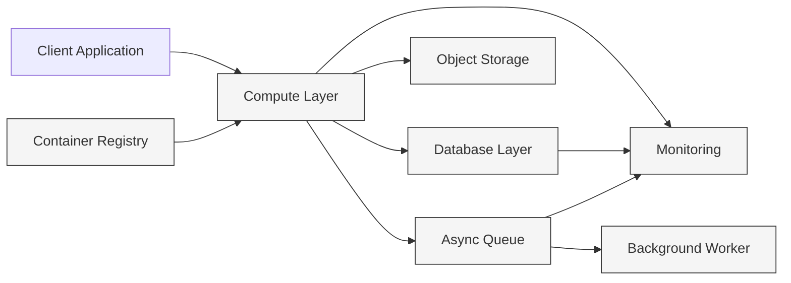

AWS service mapping:

```text
Compute Layer       → EC2 or ECS
Database Layer      → RDS
Object Storage      → S3
Async Queue         → SQS
Container Registry  → ECR
Monitoring          → CloudWatch
```

---

# 2. How the Services Work Together

A common production architecture uses the services as follows:

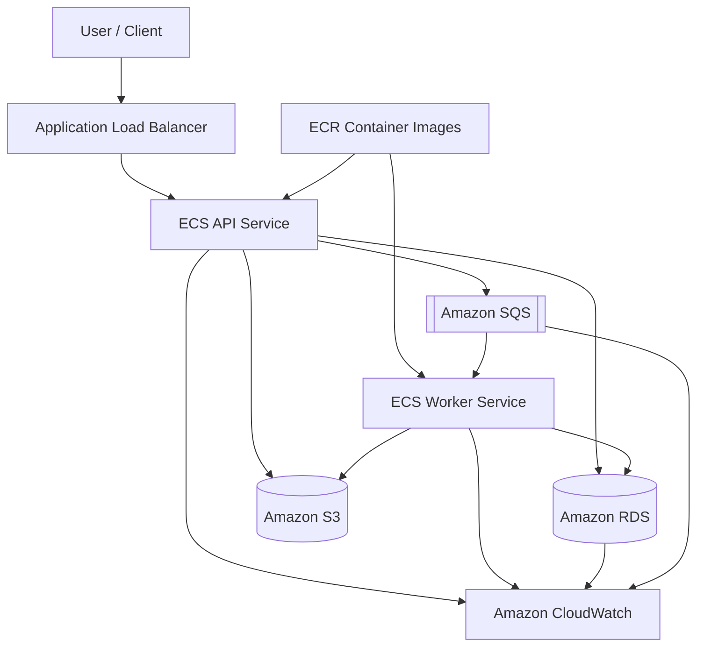

### Example Request Flow

Suppose a user uploads a restaurant menu for OCR processing:

1. The API runs as an **ECS service**.
2. The container image used by ECS is stored in **ECR**.
3. The uploaded file is saved in **S3**.
4. The API creates an OCR job message in **SQS**.
5. A background worker receives the message from SQS.
6. The worker downloads the file from S3 and performs OCR.
7. Structured restaurant and menu data is saved in **RDS**.
8. Logs, errors, queue depth and resource metrics are sent to **CloudWatch**.
9. ECS can increase the number of workers when the SQS backlog grows.

This design keeps the user-facing API responsive because expensive OCR work happens asynchronously.

---

# 3. Amazon EC2 — Virtual Servers

## 3.1 What Is EC2?

Amazon Elastic Compute Cloud, or **EC2**, provides resizable virtual machines called **instances**.

An EC2 instance behaves like a remote server on which you can install:

- Linux or Windows
- Python, Node.js, Java or .NET
- Nginx or Apache
- Docker
- Application servers
- Background workers
- Databases, when a self-managed database is required

AWS manages the physical data centre and hardware. You manage the instance operating system, packages, runtime, application and most instance-level security configuration.

## 3.2 Core EC2 Concepts

| Concept | Meaning |
|---|---|
| **AMI** | Template containing the operating system and optional preinstalled software |
| **Instance type** | CPU, memory, network and hardware configuration |
| **EBS volume** | Persistent block storage commonly attached to an instance |
| **Security group** | Stateful virtual firewall controlling inbound and outbound traffic |
| **Key pair** | Public/private key pair commonly used for SSH access |
| **Elastic IP** | Static public IPv4 address that can be associated with a resource |
| **User data** | Startup script executed during instance initialization |
| **IAM role** | Temporary AWS permissions assigned to the instance |
| **Auto Scaling Group** | Maintains and scales a group of EC2 instances |
| **Load balancer** | Distributes requests across healthy instances |

## 3.3 EC2 Instance Lifecycle

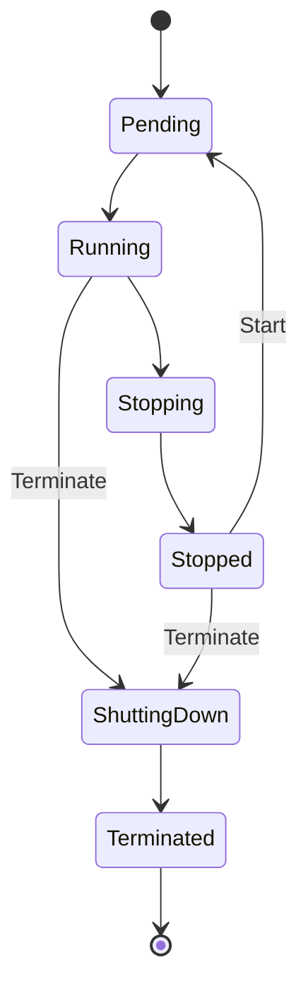

### Stop vs Terminate

| Action | Compute Billing | EBS Root Data | Can Start Again? |
|---|---:|---|---|
| **Stop** | Instance compute charge stops | Usually retained | Yes |
| **Reboot** | Continues | Retained | Instance remains active |
| **Terminate** | Stops | Depends on delete-on-termination setting | No |

Other resources, such as EBS volumes, snapshots, Elastic IP addresses and data transfer, can still generate charges even when an instance is stopped.

## 3.4 Common Instance Families

| Family Type | Suitable For |
|---|---|
| **General purpose** | Web servers, APIs, development environments |
| **Compute optimized** | CPU-heavy processing, encoding, batch jobs |
| **Memory optimized** | In-memory databases, analytics, memory-heavy services |
| **Storage optimized** | High local-storage throughput and I/O workloads |
| **Accelerated computing** | GPU, machine learning and specialized hardware workloads |

Select an instance based on actual application measurements rather than only CPU count.

## 3.5 EC2 Purchasing Models

| Model | Best Use |
|---|---|
| **On-Demand** | Variable workloads, short projects and initial production deployment |
| **Savings Plans** | Predictable compute usage with a longer commitment |
| **Reserved Instances** | Certain predictable EC2 requirements and reservation use cases |
| **Spot Instances** | Fault-tolerant workloads that can handle interruption |
| **Dedicated Hosts/Instances** | Compliance, licensing or physical-isolation requirements |

### Practical Choice

- Use **On-Demand** when workload usage is uncertain.
- Use **Savings Plans** after measuring a stable usage baseline.
- Use **Spot** for retryable workers, CI runners and batch processing.
- Avoid using Spot as the only capacity for a critical API unless the architecture handles interruption.

## 3.6 Security Groups

A security group is **stateful**:

- If inbound traffic is allowed, response traffic is automatically allowed.
- Rules allow traffic; they do not create explicit deny rules.
- A security group can reference another security group.

Example:

```text
Internet
   |
   v
ALB Security Group
Inbound: 443 from 0.0.0.0/0
   |
   v
Application Security Group
Inbound: 8000 only from ALB Security Group
   |
   v
RDS Security Group
Inbound: 5432 only from Application Security Group
```

Avoid opening application and database ports to the whole internet.

## 3.7 EC2 Auto Scaling

An **Auto Scaling Group (ASG)** helps maintain the desired number of instances and can add or remove instances according to load.

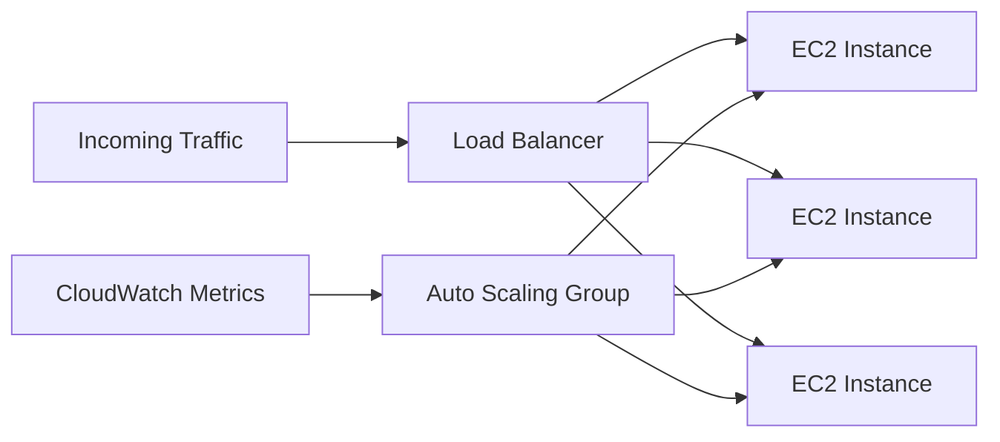

Important values:

- **Minimum capacity:** Lowest number of instances
- **Desired capacity:** Number currently requested
- **Maximum capacity:** Highest allowed number
- **Scaling policy:** Rule that changes desired capacity
- **Health check:** Detects unhealthy instances that should be replaced

Common policies:

- Target average CPU utilization
- Request count per load-balancer target
- Memory-based custom metric
- Scheduled scaling
- Predictive scaling

## 3.8 Practical EC2 Example

Launch a Docker-based API on an EC2 instance:

```bash
# Connect to the instance
ssh -i app-key.pem ec2-user@<public-ip>

# Install and start Docker
sudo dnf install -y docker
sudo systemctl enable --now docker

# Allow the current user to run Docker
sudo usermod -aG docker ec2-user

# Run an application container
docker run -d \
  --name api \
  -p 8000:8000 \
  --restart unless-stopped \
  <account-id>.dkr.ecr.<region>.amazonaws.com/my-api:1.0.0
```

For production, prefer automated provisioning through Infrastructure as Code and a managed deployment approach rather than manually modifying servers.

## 3.9 When EC2 Is a Good Choice

Use EC2 when you need:

- Full operating-system control
- Custom kernel or system packages
- Long-running workloads
- Specialized instance hardware
- Software that is difficult to containerize
- Predictable workloads where direct instance management is acceptable

Consider ECS with Fargate when the workload is already containerized and you do not want to manage server capacity.

## 3.10 EC2 Best Practices

- Place public load balancers in public subnets and application instances in private subnets.
- Use IAM roles instead of storing access keys on instances.
- Use AWS Systems Manager Session Manager where possible instead of exposing SSH.
- Use an Auto Scaling Group rather than relying on one manually created server.
- Create reusable AMIs or startup automation.
- Patch the operating system regularly.
- Encrypt EBS volumes and snapshots.
- Back up persistent data; do not treat an instance as permanent.
- Store application files in S3 and relational data in RDS rather than on an instance filesystem.
- Monitor CPU, status checks, disk, memory and application health.

### Interview Focus

Understand the difference between:

- EC2 instance and AMI
- EC2 and ECS
- Security group and network ACL
- EBS and instance-store storage
- Stop and terminate
- Vertical scaling and horizontal scaling
- On-Demand, Savings Plans and Spot capacity

---

# 4. Amazon S3 — Object Storage

## 4.1 What Is S3?

Amazon Simple Storage Service, or **S3**, is an object-storage service.

S3 stores data as:

```text
Bucket
└── Object
    ├── Key
    ├── Data
    └── Metadata
```

Example:

```text
Bucket: restaurant-assets-prod
Object key: menus/restaurant-101/menu-2026-07.pdf
```

S3 is not a normal attached disk and should not be treated like a traditional filesystem. Applications interact with it through AWS APIs, SDKs, CLI commands or HTTP-based access.

## 4.2 Core S3 Concepts

| Concept | Meaning |
|---|---|
| **Bucket** | Top-level container for objects |
| **Object** | Data stored in a bucket |
| **Key** | Full object name or path-like identifier |
| **Prefix** | Shared beginning of object keys |
| **Metadata** | Information associated with an object |
| **Version ID** | Identifier for an object version |
| **Lifecycle rule** | Automatically transitions or expires objects |
| **Storage class** | Cost and access model for stored objects |
| **Pre-signed URL** | Time-limited URL that grants access to a specific operation |
| **Bucket policy** | Resource policy defining access to a bucket and its objects |

## 4.3 S3 Data Consistency

S3 provides strong read-after-write consistency for object writes and deletes.

After a successful write:

- A subsequent read returns the latest object.
- A subsequent list operation reflects the update.
- A reader sees either the old object or new object during a concurrent overwrite, not a partially written object.

This simplifies application design because an application generally does not need a custom delay after uploading an object before reading it.

## 4.4 Storage Classes

| Storage Class | Typical Use |
|---|---|
| **S3 Standard** | Frequently accessed production data |
| **S3 Intelligent-Tiering** | Access patterns are unknown or change over time |
| **S3 Standard-IA** | Infrequently accessed data requiring multi-AZ resilience |
| **S3 One Zone-IA** | Re-creatable, infrequently accessed data in one AZ |
| **S3 Glacier Instant Retrieval** | Archived data requiring millisecond access |
| **S3 Glacier Flexible Retrieval** | Archives that can wait for retrieval |
| **S3 Glacier Deep Archive** | Lowest-cost long-term archival use cases |
| **S3 Express One Zone** | High-performance, latency-sensitive single-AZ workloads |

Storage classes can have minimum storage durations and retrieval charges. Do not choose only by storage price.

## 4.5 S3 Versioning

Versioning preserves multiple versions of an object.

```text
reports/result.json
├── Version 1
├── Version 2
└── Version 3
```

Benefits:

- Recover from accidental overwrite
- Recover from accidental deletion
- Maintain object history
- Improve data protection

A normal delete in a versioned bucket commonly creates a **delete marker**. Permanent removal requires deleting a specific version.

Versioning increases storage consumption, so combine it with lifecycle rules.

## 4.6 Lifecycle Rules

Lifecycle rules automate storage management.

Example policy:

```text
Day 0     → Store in S3 Standard
Day 30    → Move to Standard-IA
Day 90    → Move to Glacier Flexible Retrieval
Day 365   → Delete, when business retention permits
```

Common uses:

- Move old logs to archival storage
- Delete temporary uploads
- Remove incomplete multipart uploads
- Expire old non-current object versions
- Reduce storage cost automatically

## 4.7 S3 Encryption

All S3 buckets have default encryption, and new objects are encrypted using server-side encryption with S3-managed keys unless another supported encryption option is configured.

Common options:

| Option | Key Management |
|---|---|
| **SSE-S3** | Amazon S3 manages the encryption keys |
| **SSE-KMS** | AWS KMS manages keys and provides additional control and auditing |
| **DSSE-KMS** | Dual-layer server-side encryption with AWS KMS keys |
| **Client-side encryption** | Application encrypts before upload |

Use SSE-KMS when key-level access control, separation of duties or detailed key auditing is required.

## 4.8 Pre-Signed Upload Flow

Applications should usually avoid routing large file bytes through the API server.

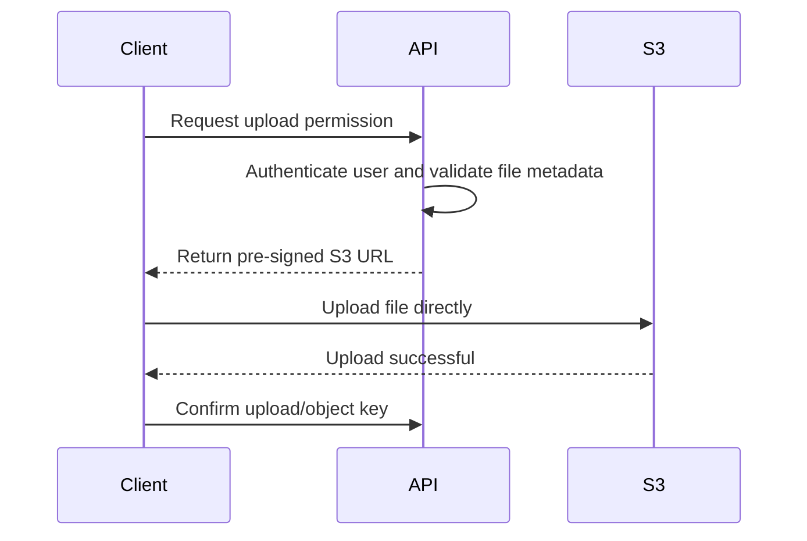

Benefits:

- Reduces API server bandwidth
- Improves upload scalability
- Keeps the bucket private
- Provides time-limited, operation-specific access

## 4.9 Practical S3 CLI Examples

```bash
# Upload a file
aws s3 cp ./menu.pdf s3://restaurant-assets-prod/menus/menu.pdf

# Download a file
aws s3 cp s3://restaurant-assets-prod/menus/menu.pdf ./menu.pdf

# Synchronize a directory
aws s3 sync ./static/ s3://my-static-assets/

# List objects
aws s3 ls s3://restaurant-assets-prod/menus/

# Remove an object
aws s3 rm s3://restaurant-assets-prod/menus/menu.pdf
```

## 4.10 S3 Security Best Practices

- Enable and retain **Block Public Access** unless public access is deliberately required.
- Prefer IAM roles and bucket policies over long-lived access keys.
- Grant access only to required prefixes and operations.
- Use pre-signed URLs for controlled temporary upload or download.
- Enable versioning for important data.
- Add lifecycle rules to control old versions and temporary objects.
- Use SSE-KMS when business requirements need customer-managed keys.
- Log and monitor sensitive data access where required.
- Do not place secrets or credentials in publicly accessible objects.
- Validate file type, size and content before downstream processing.

## 4.11 When S3 Is a Good Choice

Use S3 for:

- Images, videos and documents
- User uploads
- Static website assets
- Application logs and exports
- Data lakes
- Database backups and snapshots
- Machine-learning datasets
- Generated reports
- Long-term archives

Do not use S3 as a direct replacement for:

- A transactional relational database
- Low-latency block storage attached to an operating system
- A shared filesystem requiring full filesystem semantics

### Interview Focus

Understand:

- Object storage vs block storage
- Bucket vs object vs key
- Versioning and delete markers
- Lifecycle rules
- Storage classes
- Bucket policy vs IAM policy
- Public access blocking
- Pre-signed URLs
- SSE-S3 vs SSE-KMS
- Strong consistency

---

# 5. Amazon RDS — Managed Relational Databases

## 5.1 What Is RDS?

Amazon Relational Database Service, or **RDS**, is a managed service for relational database engines.

Supported engine families include:

- PostgreSQL
- MySQL
- MariaDB
- Oracle
- Microsoft SQL Server
- IBM Db2

Amazon Aurora is a relational database service compatible with MySQL and PostgreSQL, but it has its own architecture and documentation.

AWS handles much of the infrastructure work:

- Server provisioning
- Storage setup
- Backups
- Patching support
- Monitoring integrations
- Hardware replacement
- Multi-AZ failover mechanisms

You still manage:

- Schema design
- Queries and indexes
- Database users and privileges
- Application connection handling
- Capacity selection
- Performance tuning
- Data-retention requirements

## 5.2 Core RDS Concepts

| Concept | Meaning |
|---|---|
| **DB instance** | Managed database compute and memory |
| **DB engine** | PostgreSQL, MySQL and other supported database software |
| **DB instance class** | Database CPU and memory configuration |
| **Storage type** | Database storage performance and capacity option |
| **Parameter group** | Engine configuration values |
| **Option group** | Additional engine-specific capabilities |
| **Subnet group** | Subnets in which RDS can place database resources |
| **Automated backup** | Managed backup supporting restoration and point-in-time recovery |
| **Snapshot** | User-controlled database backup |
| **Multi-AZ** | High-availability database deployment |
| **Read replica** | Asynchronous copy used primarily for read scaling |

## 5.3 Single-AZ, Multi-AZ and Read Replicas

### Single-AZ

```text
Application → One RDS DB instance
```

Suitable for:

- Development
- Testing
- Non-critical environments
- Workloads where longer recovery is acceptable

### Multi-AZ DB Instance Deployment

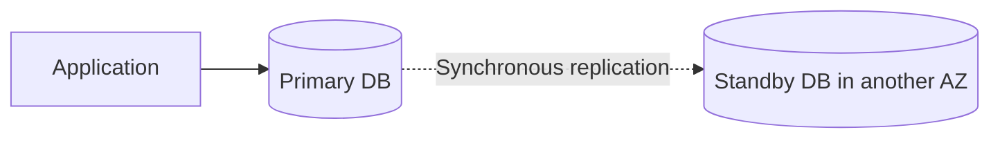

Purpose:

- High availability
- Automatic failover support
- Data redundancy across Availability Zones

Important distinction:

> A standby in a traditional Multi-AZ DB instance deployment does not serve application read traffic.

### Multi-AZ DB Cluster Deployment

A Multi-AZ DB cluster has a writer and readable DB instances across Availability Zones. It combines high availability with the ability to serve read traffic from reader instances.

### Read Replica

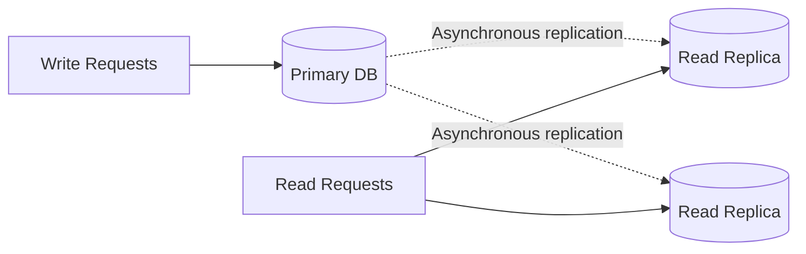

Purpose:

- Scale read-heavy workloads
- Run reports separately
- Reduce load on the primary database
- Support certain cross-Region disaster-recovery designs

Because replication is asynchronous, replicas can have replication lag.

## 5.4 Multi-AZ vs Read Replica

| Area | Multi-AZ | Read Replica |
|---|---|---|
| Primary purpose | High availability | Read scaling |
| Replication | Commonly synchronous for standby architecture | Asynchronous |
| Read traffic | Depends on deployment type; traditional single-standby instance does not serve reads | Yes |
| Failover | Managed failover capability | Replica can be promoted, but it is not the same mechanism |
| Data freshness | Designed for HA consistency | Can have replication lag |

Do not describe a read replica as a replacement for Multi-AZ high availability.

## 5.5 RDS Backups

### Automated Backups

- Created and managed by RDS
- Controlled through a backup-retention period
- Support point-in-time recovery within the available retention window
- Continue according to service configuration and engine capabilities

### Manual Snapshots

- Created explicitly
- Retained until deleted
- Useful before risky changes or for longer retention
- Can be copied according to supported Region and account workflows

A snapshot restores to a new database resource; it is not an in-place rollback of the current instance.

## 5.6 RDS Connection Flow

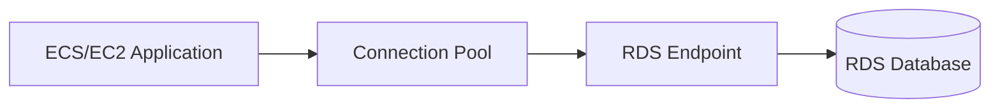

Applications should use the DNS endpoint instead of a fixed database IP address because failover can change the underlying host.

## 5.7 Connection Pooling

Creating a new database connection for every request is expensive.

Use:

- Application-level connection pooling
- Framework-supported persistent connections
- A managed proxy when appropriate
- Safe pool sizes based on database capacity

Example calculation:

```text
10 application tasks × 20 connections per task
= up to 200 database connections
```

Scaling application containers without controlling pool size can overload the database.

## 5.8 Practical PostgreSQL Connection Example

```text
postgresql://app_user:<password>@mydb.cluster-or-instance-endpoint:5432/app_db
```

Production recommendations:

- Retrieve credentials from a secrets-management system.
- Require encrypted database connections.
- Do not commit credentials to source control.
- Restrict the RDS security group to application security groups.
- Use separate users for application, migrations and reporting where appropriate.

## 5.9 RDS Performance Practices

- Create indexes based on real query patterns.
- Use `EXPLAIN` or `EXPLAIN ANALYZE` carefully.
- Monitor CPU, connections, free storage, latency and IOPS.
- Avoid unbounded queries.
- Use pagination.
- Eliminate N+1 query patterns.
- Tune connection pools.
- Scale vertically when compute or memory is insufficient.
- Use read replicas for suitable read-heavy workloads.
- Archive large binary files to S3 instead of storing them directly in the relational database.
- Test database changes against production-like data volumes.

## 5.10 RDS Security Best Practices

- Put databases in private subnets.
- Set public accessibility to false unless there is a justified requirement.
- Restrict inbound traffic through security-group references.
- Encrypt database storage.
- Encrypt client connections in transit.
- Store credentials securely and rotate them.
- Apply least-privilege database permissions.
- Enable backups and test restoration.
- Use Multi-AZ for important production databases.
- Monitor failed connections, resource saturation and suspicious patterns.

## 5.11 When RDS Is a Good Choice

Use RDS when:

- Data is relational
- Transactions are important
- SQL queries and joins are needed
- Referential integrity matters
- A managed database is preferred over operating the database manually

EC2-hosted databases may be considered when the required database configuration is unsupported by RDS or full host-level control is essential. This introduces significantly more operational responsibility.

### Interview Focus

Understand:

- RDS vs database on EC2
- Multi-AZ vs read replica
- Automated backups vs snapshots
- Vertical database scaling vs read scaling
- Connection pooling
- Private subnet placement
- Database endpoint behavior during failover
- Why application files usually belong in S3, not RDS

---

# 6. Amazon ECR — Container Image Registry

## 6.1 What Is ECR?

Amazon Elastic Container Registry, or **ECR**, is a managed registry for Docker and Open Container Initiative images and artifacts.

```text
Source Code
   |
   v
Docker Build
   |
   v
Container Image
   |
   v
Amazon ECR Repository
   |
   v
ECS Deployment
```

Each AWS account has a private ECR registry in supported Regions. Inside the registry, teams create repositories for their applications.

Example repository URI:

```text
123456789012.dkr.ecr.ap-south-1.amazonaws.com/orders-api
```

Example image references:

```text
123456789012.dkr.ecr.ap-south-1.amazonaws.com/orders-api:1.4.2
123456789012.dkr.ecr.ap-south-1.amazonaws.com/orders-api:git-a1b2c3d
123456789012.dkr.ecr.ap-south-1.amazonaws.com/orders-api@sha256:<digest>
```

## 6.2 Core ECR Concepts

| Concept | Meaning |
|---|---|
| **Registry** | Account- and Region-level container registry |
| **Repository** | Logical collection of related images |
| **Image** | Built container image |
| **Tag** | Human-readable reference, such as `1.4.2` |
| **Digest** | Immutable content-based image identifier |
| **Repository policy** | Resource policy controlling repository access |
| **Lifecycle policy** | Automatically archives or expires matching images |
| **Image scanning** | Detects known software vulnerabilities |
| **Replication** | Copies images across supported Regions or accounts |

## 6.3 Image Build and Push Flow

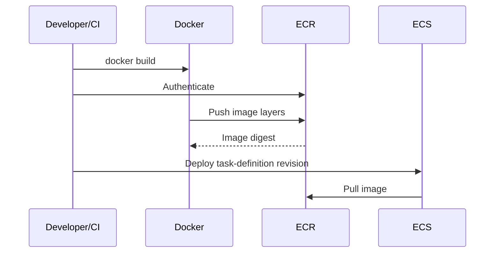

## 6.4 Practical ECR Commands

```bash
AWS_REGION="ap-south-1"
AWS_ACCOUNT_ID="123456789012"
REPOSITORY="orders-api"
IMAGE_TAG="git-a1b2c3d"

# Authenticate Docker to ECR
aws ecr get-login-password --region "$AWS_REGION" \
  | docker login \
      --username AWS \
      --password-stdin \
      "$AWS_ACCOUNT_ID.dkr.ecr.$AWS_REGION.amazonaws.com"

# Build the image
docker build -t "$REPOSITORY:$IMAGE_TAG" .

# Tag the image for ECR
docker tag \
  "$REPOSITORY:$IMAGE_TAG" \
  "$AWS_ACCOUNT_ID.dkr.ecr.$AWS_REGION.amazonaws.com/$REPOSITORY:$IMAGE_TAG"

# Push the image
docker push \
  "$AWS_ACCOUNT_ID.dkr.ecr.$AWS_REGION.amazonaws.com/$REPOSITORY:$IMAGE_TAG"
```

## 6.5 Tags vs Digests

A tag is convenient but can be mutable.

```text
orders-api:latest
```

A digest identifies exact image content.

```text
orders-api@sha256:abcd...
```

Production practices:

- Use unique tags such as a Git commit SHA or semantic version.
- Enable tag immutability for release tags.
- Deploy by immutable tag or digest where strict reproducibility is required.
- Do not rely only on `latest`.
- Keep a traceable relationship between source commit, CI build and image.

## 6.6 Image Scanning

ECR supports image vulnerability scanning.

- **Basic scanning** focuses on operating-system vulnerabilities.
- **Enhanced scanning** integrates with Amazon Inspector and can continuously evaluate operating-system and programming-language package vulnerabilities.

Scanning does not automatically fix a vulnerable image. The normal remediation flow is:

```text
Finding detected
      |
      v
Update base image or dependency
      |
      v
Rebuild image
      |
      v
Run tests
      |
      v
Push a new immutable image
      |
      v
Deploy new task revision
```

## 6.7 Lifecycle Policies

Without cleanup, every build can remain in ECR and increase storage cost.

Example strategy:

```text
Keep:
- All production release images
- Last 20 development images
- Images currently referenced by active deployments

Expire:
- Untagged images older than 7 days
- Old branch images after 30 days
```

Always preview lifecycle-policy effects before enabling deletion or archival rules.

## 6.8 ECR Best Practices

- Use separate repositories or namespaces for clear application ownership.
- Use IAM roles for CI systems and ECS task execution.
- Enable vulnerability scanning.
- Use immutable, traceable release tags.
- Apply lifecycle policies.
- Restrict cross-account access.
- Encrypt repositories according to requirements.
- Use replication for supported disaster-recovery or multi-account deployment strategies.
- Keep base images minimal and patched.
- Avoid placing credentials or secrets inside image layers.

### Interview Focus

Understand:

- ECR vs ECS
- Registry vs repository
- Image tag vs digest
- Mutable vs immutable tags
- Image scanning
- Lifecycle policies
- How ECS authenticates and pulls an image
- Why secrets must not be baked into images

---

# 7. Amazon ECS — Container Orchestration

## 7.1 What Is ECS?

Amazon Elastic Container Service, or **ECS**, is a managed container-orchestration service.

ECS decides:

- Which infrastructure runs a container
- How many copies should run
- How failed tasks are replaced
- How deployments are rolled out
- How containers connect to networks and load balancers
- How applications receive IAM permissions
- How tasks scale

ECS is not an image registry. Images are commonly stored in ECR.

## 7.2 Core ECS Concepts

| Concept | Meaning |
|---|---|
| **Cluster** | Logical grouping of ECS capacity and workloads |
| **Task definition** | Versioned blueprint describing containers and runtime configuration |
| **Task** | Running instance of a task definition |
| **Service** | Maintains a desired number of tasks |
| **Container definition** | Image, ports, environment, logs, health check and resource settings |
| **Capacity provider** | Strategy defining the infrastructure used to run tasks |
| **Task role** | AWS permissions used by application code inside a task |
| **Task execution role** | Permissions ECS uses for actions such as pulling images and sending logs |
| **Service Auto Scaling** | Changes the desired number of service tasks |
| **Standalone task** | One-time or manually started task not maintained as a service |

## 7.3 ECS Hierarchy

```text
ECS Cluster
├── API Service
│   ├── Task 1
│   │   └── API Container
│   ├── Task 2
│   │   └── API Container
│   └── Task 3
│       └── API Container
│
└── Worker Service
    ├── Worker Task 1
    └── Worker Task 2
```

## 7.4 Task Definition

A task definition is similar to a deployment blueprint.

It commonly defines:

- Container image
- CPU and memory
- Port mappings
- Environment variables
- Secret references
- Log configuration
- Health checks
- Task role
- Execution role
- Network mode
- Storage configuration
- Startup dependencies between containers

Simplified example:

```json
{
  "family": "orders-api",
  "networkMode": "awsvpc",
  "requiresCompatibilities": ["FARGATE"],
  "cpu": "512",
  "memory": "1024",
  "executionRoleArn": "arn:aws:iam::<account-id>:role/ecsTaskExecutionRole",
  "taskRoleArn": "arn:aws:iam::<account-id>:role/ordersApiTaskRole",
  "containerDefinitions": [
    {
      "name": "api",
      "image": "<account-id>.dkr.ecr.<region>.amazonaws.com/orders-api:<tag>",
      "essential": true,
      "portMappings": [
        {
          "containerPort": 8000,
          "protocol": "tcp"
        }
      ],
      "logConfiguration": {
        "logDriver": "awslogs",
        "options": {
          "awslogs-group": "/ecs/orders-api",
          "awslogs-region": "<region>",
          "awslogs-stream-prefix": "api"
        }
      }
    }
  ]
}
```

A task definition is revisioned:

```text
orders-api:1
orders-api:2
orders-api:3
```

A new application deployment normally registers a new revision and updates the ECS service to use it.

## 7.5 ECS Service

An ECS service keeps the requested number of tasks running.

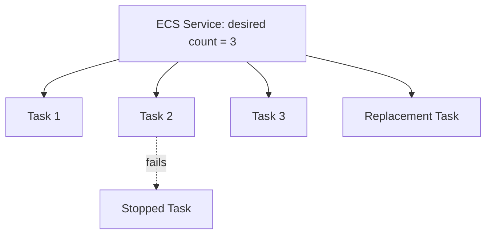

If a service task stops unexpectedly, the ECS scheduler starts another task based on the task definition.

## 7.6 ECS Compute Options

### AWS Fargate

AWS manages the server infrastructure.

You define:

- Container image
- CPU
- Memory
- Network
- IAM permissions
- Desired task count

Advantages:

- No EC2 host management
- Strong workload isolation
- Simple scaling
- Good default for many containerized services

Trade-offs:

- Less host-level control
- Cost can be higher than well-utilized EC2 capacity
- Available CPU/memory combinations and platform constraints must be considered

### ECS on EC2

Containers run on EC2 instances registered with the ECS cluster.

Advantages:

- Host-level control
- Access to broader instance choices and specialized hardware
- Potentially lower cost at stable, high utilization
- Supports certain daemon and host-integrated workloads

Trade-offs:

- You manage instance patching and capacity
- You must ensure enough cluster capacity exists
- Bin-packing and host utilization matter
- Instance scaling and task scaling must work together

### ECS Managed Instances

ECS also provides a managed-instances option that reduces some underlying EC2 infrastructure operations while retaining access to EC2 instance types. For most interview discussions, clearly explain the widely used Fargate and EC2 models first.

## 7.7 ECS on EC2 vs Fargate

| Area | ECS on EC2 | ECS with Fargate |
|---|---|---|
| Server management | Customer manages EC2 capacity | AWS manages infrastructure |
| Host access | Available | Not available |
| Scaling layers | Scale EC2 capacity and ECS tasks | Scale ECS tasks |
| Cost model | EC2 capacity and related resources | Requested task CPU, memory, storage and runtime |
| Custom host requirements | Strong fit | Limited |
| Operational simplicity | More responsibility | Simpler |
| Best for | Stable scale, specialized hosts, host control | APIs, workers, microservices and teams avoiding server management |

## 7.8 Task Role vs Execution Role

This distinction is frequently important.

### Task Execution Role

Used by ECS infrastructure for actions such as:

- Pulling images from ECR
- Sending container logs to CloudWatch
- Retrieving supported secret references during task startup

### Task Role

Used by application code inside the container.

Examples:

- Read objects from an S3 prefix
- Send messages to SQS
- Write custom metrics
- Access another AWS service

```text
ECS Platform
   |
   └── Execution Role
       ├── Pull image from ECR
       └── Send logs to CloudWatch

Application Container
   |
   └── Task Role
       ├── Read/write S3
       └── Send/receive SQS
```

Do not grant application permissions through the execution role when the task role is the correct place.

## 7.9 ECS Networking

With `awsvpc` network mode, each task receives an elastic network interface and can have security-group rules.

Typical flow:

```text
Internet
   |
Application Load Balancer
   |
ECS Task Security Group
   |
RDS Security Group
```

For a public API:

- The load balancer can be public.
- ECS tasks can remain in private subnets.
- The load balancer forwards traffic to task ports.
- Tasks access ECR, logs and other AWS services through appropriate network paths.
- Outbound internet access may use NAT or service endpoints, depending on design.

## 7.10 ECS Deployment Flow

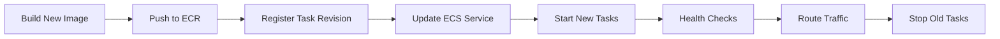

A deployment should fail safely when new tasks do not become healthy.

## 7.11 ECS Auto Scaling

Common scaling metrics:

- CPU utilization
- Memory utilization
- Application Load Balancer request count
- Custom application metric
- SQS backlog per worker task

For queue workers:

```text
Backlog per task = Number of visible SQS messages / Running worker tasks
```

Scaling only on CPU can be ineffective for I/O-heavy workers. Queue depth may represent workload more accurately.

## 7.12 ECS Best Practices

- Use immutable image tags or digests.
- Use separate task and execution roles.
- Run tasks in private subnets when possible.
- Configure container and load-balancer health checks.
- Set realistic CPU and memory reservations or limits.
- Send structured logs to CloudWatch.
- Use graceful shutdown handling.
- Set deployment minimum and maximum healthy percentages appropriately.
- Store secrets outside task definitions and source code.
- Use Service Auto Scaling.
- Use multiple Availability Zones.
- Add a rollback strategy.
- Keep containers stateless; store persistent data in RDS, S3 or another managed data service.

### Interview Focus

Understand:

- Cluster, service, task and task definition
- ECS vs ECR
- ECS vs EC2
- Fargate vs ECS on EC2
- Service task vs standalone task
- Task role vs task execution role
- Rolling deployment
- Health checks
- Service Auto Scaling
- Why production containers should be stateless

---

# 8. Amazon SQS — Message Queues

## 8.1 What Is SQS?

Amazon Simple Queue Service, or **SQS**, is a managed message queue used to decouple system components.

Without a queue:

```text
API → Calls OCR service directly → User waits
```

With SQS:

```text
API → Adds job to queue → Returns quickly
Queue → Worker processes job independently
```

## 8.2 Core SQS Concepts

| Concept | Meaning |
|---|---|
| **Producer** | Sends messages |
| **Queue** | Stores messages until they are consumed or expire |
| **Consumer** | Receives and processes messages |
| **Visibility timeout** | Period during which a received message is hidden from other consumers |
| **Receipt handle** | Token used to delete or change visibility of a received message |
| **Long polling** | Waits for messages to reduce empty responses |
| **Dead-letter queue** | Holds messages that repeatedly fail processing |
| **Retention period** | How long an unprocessed message remains in the queue |
| **Delay queue** | Delays availability of newly sent messages |
| **Message group** | FIFO mechanism for preserving order within a group |
| **Deduplication ID** | FIFO mechanism used to prevent duplicate insertion |

## 8.3 SQS Message Lifecycle

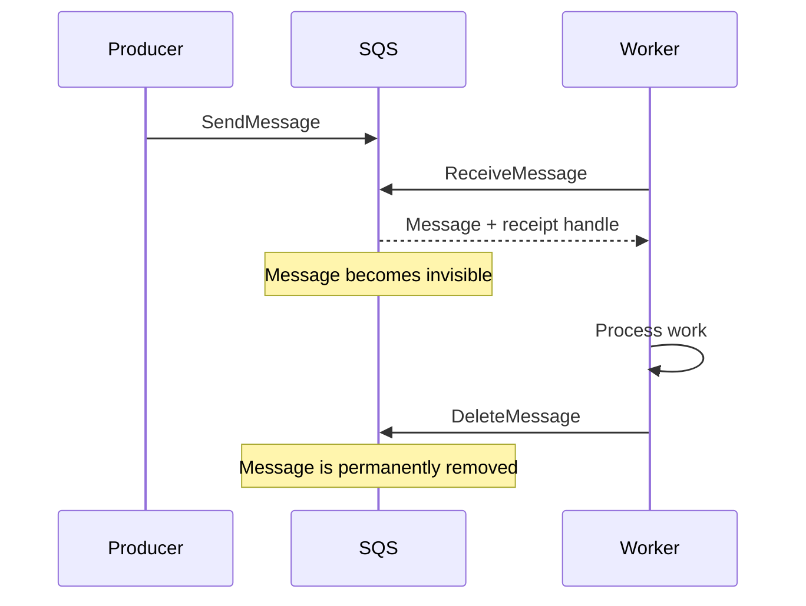

Critical detail:

> Receiving a message does not remove it. The consumer must delete it after successful processing.

If the worker fails before deletion, the message becomes visible after the visibility timeout and can be processed again.

## 8.4 Standard vs FIFO Queues

| Area | Standard Queue | FIFO Queue |
|---|---|---|
| Throughput | Very high | Optimized for ordered workflows; throughput model differs |
| Delivery | At least once | SQS prevents introduced duplicates under FIFO semantics |
| Ordering | Best effort | Strict within message groups |
| Duplicate possibility | Yes | Queue deduplication is supported |
| Naming | Any valid queue name | Name ends with `.fifo` |
| Use case | Most background jobs and event buffering | Ordering-sensitive or duplicate-intolerant workflows |

Even with FIFO, make the consumer idempotent. A worker can complete an external side effect and crash before deleting the message, which can cause the operation to run again.

## 8.5 Visibility Timeout

Suppose:

```text
Visibility timeout = 30 seconds
Actual processing time = 2 minutes
```

At 30 seconds, the message may become visible and another worker can receive it while the first worker is still processing.

Solutions:

- Set a visibility timeout longer than normal processing time.
- Extend visibility while processing long jobs.
- Design handlers to be idempotent.
- Track and alert on repeated receives.

A visibility timeout should not be treated as the maximum job runtime without considering retries and worker behavior.

## 8.6 Dead-Letter Queue

A dead-letter queue, or **DLQ**, stores messages that exceed the configured receive count.

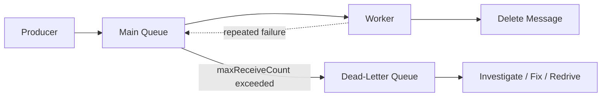

DLQ benefits:

- Isolates poison messages
- Prevents endless retry loops
- Supports debugging
- Enables controlled redrive after a fix
- Provides a clear operational alarm target

Configure CloudWatch alarms when a DLQ receives messages.

## 8.7 Long Polling

Long polling waits for a message for a configured duration rather than immediately returning an empty response.

Benefits:

- Fewer empty receive requests
- Lower request cost
- Better consumer efficiency

Example:

```bash
aws sqs receive-message \
  --queue-url "<queue-url>" \
  --wait-time-seconds 20 \
  --max-number-of-messages 10
```

## 8.8 Idempotent Consumer Pattern

An idempotent consumer produces the same final result when the same message is processed more than once.

```text
Message ID: payment-job-101
```

Possible implementation:

1. Start a database transaction.
2. Check whether `payment-job-101` was completed.
3. If completed, return successfully.
4. Apply the business operation.
5. Record the idempotency key.
6. Commit.
7. Delete the SQS message.

Use a business-safe unique key, not only an in-memory flag.

## 8.9 Practical SQS Commands

```bash
# Send a message
aws sqs send-message \
  --queue-url "<queue-url>" \
  --message-body '{"job_id":"job-101","object_key":"menus/menu.pdf"}'

# Receive messages with long polling
aws sqs receive-message \
  --queue-url "<queue-url>" \
  --wait-time-seconds 20 \
  --max-number-of-messages 10 \
  --attribute-names All \
  --message-attribute-names All

# Delete after successful processing
aws sqs delete-message \
  --queue-url "<queue-url>" \
  --receipt-handle "<receipt-handle>"
```

## 8.10 SQS Message Design

Good message:

```json
{
  "event_type": "menu.ocr.requested",
  "event_version": 1,
  "job_id": "job-101",
  "restaurant_id": "restaurant-22",
  "s3_bucket": "restaurant-assets-prod",
  "s3_key": "menus/job-101/menu.pdf",
  "created_at": "2026-07-30T15:30:00Z"
}
```

Recommendations:

- Include a schema or event version.
- Include correlation and idempotency identifiers.
- Keep messages small.
- Store large payloads in S3 and send the object reference.
- Do not include secrets.
- Validate the message before processing.
- Support backward-compatible schema changes.

The current SQS maximum message-size setting supports up to 1 MiB. Large objects should still generally be placed in S3.

## 8.11 SQS Best Practices

- Use long polling.
- Delete only after successful processing.
- Configure an appropriate visibility timeout.
- Extend visibility for long-running jobs.
- Use exponential backoff and jitter.
- Add a DLQ.
- Alarm on DLQ depth and oldest-message age.
- Make consumers idempotent.
- Scale workers based on backlog.
- Avoid placing large files directly in messages.
- Use server-side encryption when required.
- Limit queue permissions to specific producers and consumers.

### Interview Focus

Understand:

- Producer, queue and consumer
- Standard vs FIFO
- At-least-once delivery
- Visibility timeout
- Receipt handle
- Long polling
- DLQ and redrive
- Idempotent consumer
- Why a received message remains in the queue
- How SQS helps decouple microservices

---

# 9. Amazon CloudWatch — Monitoring and Observability

## 9.1 What Is CloudWatch?

Amazon CloudWatch provides observability for AWS resources and applications.

Its major capabilities include:

- Metrics
- Logs
- Alarms
- Dashboards
- Application and infrastructure monitoring
- Container monitoring
- Custom metrics
- Log queries
- Agent-based collection of operating-system and application telemetry
- OpenTelemetry integration

## 9.2 Metrics, Logs and Alarms

```text
Metrics    = Numeric measurements over time
Logs       = Detailed event records
Alarms     = Automated evaluation of metric or log conditions
Dashboards = Visual operational views
```

Example:

```text
Metric: CPUUtilization = 92%
Log:    "Database connection timeout"
Alarm:  CPU > 80% for 5 minutes
Action: Notify operations or trigger automation
```

## 9.3 CloudWatch Metrics

A metric has:

- Namespace
- Metric name
- Dimensions
- Timestamp
- Value
- Unit
- Statistic

Example:

```text
Namespace: AWS/EC2
Metric: CPUUtilization
Dimension: InstanceId=i-0123456789
Statistic: Average
Period: 300 seconds
```

Many AWS services publish metrics automatically.

For EC2:

- Basic monitoring commonly publishes many metrics at 5-minute intervals.
- Detailed monitoring provides 1-minute intervals for supported metrics.
- Operating-system metrics such as memory and disk-space usage generally require an agent or custom collection.

## 9.4 Useful Metrics by Service

### EC2

- `CPUUtilization`
- `StatusCheckFailed`
- Network input/output
- Disk operations
- Custom memory and disk-space metrics

### RDS

- CPU utilization
- Database connections
- Freeable memory
- Free storage space
- Read/write latency
- Read/write IOPS
- Replica lag
- Database load through relevant monitoring tools

### ECS

- CPU utilization
- Memory utilization
- Running task count
- Pending task count
- Deployment health
- Container Insights metrics when enabled

### SQS

- Approximate number of visible messages
- Approximate number of not-visible messages
- Approximate age of oldest message
- Messages sent, received and deleted
- Empty receives
- DLQ message count

### S3

- Bucket-size and object-count storage metrics
- Request metrics when enabled
- Error rates
- Data-transfer and storage analysis through related AWS capabilities

## 9.5 CloudWatch Logs Structure

```text
Log Group
└── Log Stream
    ├── Log Event
    ├── Log Event
    └── Log Event
```

Example:

```text
Log group: /ecs/orders-api
Log stream: api/orders-api-task-id
```

A good structured log:

```json
{
  "timestamp": "2026-07-30T15:30:00Z",
  "level": "ERROR",
  "service": "orders-api",
  "request_id": "req-123",
  "user_id": "user-45",
  "event": "order_creation_failed",
  "error_type": "DatabaseTimeout",
  "duration_ms": 3012
}
```

Structured JSON logs are easier to query than unstructured text.

## 9.6 CloudWatch Logs Insights

Logs Insights allows interactive queries over log data.

Example query:

```text
fields @timestamp, @message
| filter level = "ERROR"
| sort @timestamp desc
| limit 50
```

Latency analysis:

```text
fields @timestamp, request_id, duration_ms
| filter duration_ms > 1000
| stats count() as slow_requests,
        avg(duration_ms) as average_ms,
        max(duration_ms) as maximum_ms
  by bin(5m)
```

## 9.7 CloudWatch Alarms

An alarm evaluates a metric or supported query result against a condition.

Alarm states:

```text
OK
ALARM
INSUFFICIENT_DATA
```

Example:

```text
Metric: CPUUtilization
Condition: Greater than 80%
Period: 5 minutes
Evaluation: 3 out of 3 periods
```

This is usually safer than alarming on one temporary spike.

Useful production alarms:

- Load-balancer 5xx error rate
- High application latency
- No healthy targets
- ECS service running-task count below desired
- RDS low free storage
- RDS high connections
- RDS replica lag
- SQS oldest-message age
- Messages in a DLQ
- EC2 status-check failure
- Application error-rate threshold

## 9.8 Dashboards

A dashboard should answer operational questions:

- Is the application available?
- Is latency acceptable?
- Are errors increasing?
- Is the database saturated?
- Is a queue backlog growing?
- Did a deployment change behavior?
- Is resource usage near a limit?

Example dashboard layout:

```text
+----------------------------------------------------+
| Requests | Error Rate | p95 Latency | Healthy Tasks|
+----------------------------------------------------+
| ECS CPU  | ECS Memory | RDS CPU     | DB Connections|
+----------------------------------------------------+
| SQS Depth| Oldest Msg | DLQ Messages| Worker Count  |
+----------------------------------------------------+
| Recent Deployments and Important Alarms             |
+----------------------------------------------------+
```

## 9.9 CloudWatch Agent

The CloudWatch agent can collect metrics, logs and traces from:

- EC2 instances
- On-premises servers
- Containerized applications

Common uses:

- Memory utilization
- Disk-space usage
- Application log files
- Process metrics
- Additional system telemetry

CloudWatch cannot infer every operating-system metric from the hypervisor, so agent configuration is often required.

## 9.10 CloudWatch vs CloudTrail

A practical distinction:

| Service | Main Question |
|---|---|
| **CloudWatch** | Is the system healthy and performing correctly? |
| **CloudTrail** | Who called an AWS API, what action was performed and when? |

CloudWatch is primarily operational monitoring. CloudTrail is primarily API activity and audit history.

## 9.11 Observability Best Practices

- Emit structured JSON logs.
- Include request, trace, job and user correlation IDs where appropriate.
- Avoid logging passwords, tokens and sensitive personal data.
- Set log-retention periods intentionally.
- Create alarms for user impact, not only infrastructure utilization.
- Monitor latency percentiles such as p95 and p99.
- Alert on queue age, not only queue count.
- Build dashboards around service-level indicators.
- Test alarms and notification routes.
- Add deployment identifiers to logs and metrics.
- Use consistent metric and log naming.
- Create runbooks linked from alarms or dashboards.

### Interview Focus

Understand:

- Metrics vs logs vs alarms
- Namespace and dimensions
- Basic vs detailed EC2 monitoring
- Why memory metrics need an agent
- Alarm evaluation periods
- Log groups and log streams
- Logs Insights
- CloudWatch vs CloudTrail
- Queue and database metrics that reveal bottlenecks

---

# 10. End-to-End Docker Deployment Flow

This section combines Docker, ECR, ECS, RDS, S3, SQS and CloudWatch.

## 10.1 CI/CD Architecture

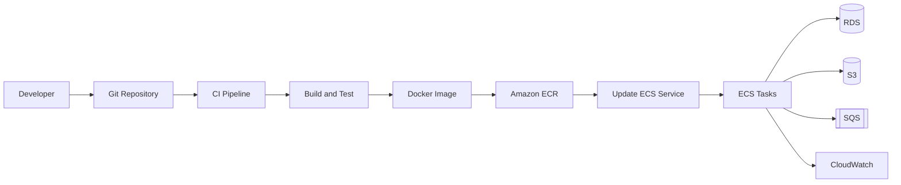

## 10.2 Deployment Steps

### Step 1: Build

```bash
docker build -t orders-api:"$GIT_SHA" .
```

### Step 2: Test

```bash
docker run --rm orders-api:"$GIT_SHA" pytest
```

### Step 3: Push to ECR

```bash
docker push \
  "$AWS_ACCOUNT_ID.dkr.ecr.$AWS_REGION.amazonaws.com/orders-api:$GIT_SHA"
```

### Step 4: Register a New ECS Task Revision

Update the task definition image:

```text
...amazonaws.com/orders-api:<git-sha>
```

Then register a new revision.

### Step 5: Update the ECS Service

```bash
aws ecs update-service \
  --cluster production \
  --service orders-api \
  --task-definition orders-api:<revision>
```

### Step 6: ECS Rolling Deployment

ECS:

1. Starts new tasks.
2. Waits for task and load-balancer health checks.
3. Routes traffic to healthy tasks.
4. Stops old tasks according to deployment settings.

### Step 7: Monitor

Check:

- Deployment status
- Running and desired task counts
- Application error rate
- p95 latency
- Database connections
- SQS backlog
- Container logs
- Alarm state

### Step 8: Roll Back

A practical rollback updates the service to a previous known-good task-definition revision or image.

```bash
aws ecs update-service \
  --cluster production \
  --service orders-api \
  --task-definition orders-api:<previous-revision>
```

Database migrations must be designed so that application rollback remains possible. Backward-compatible migrations are safer than destructive changes deployed together with application code.

---

# 11. Security and Networking Best Practices

## 11.1 Recommended Network Layout

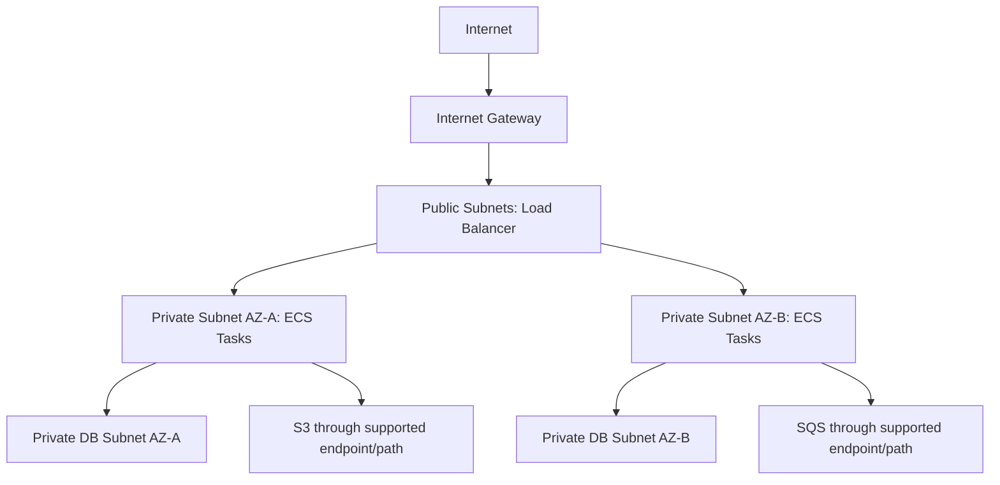

Key ideas:

- Public subnets contain resources that must receive direct internet routing, such as a public load balancer.
- Application tasks commonly run in private subnets.
- RDS runs in private database subnets.
- Security groups allow only required traffic.
- VPC endpoints can provide private access to supported AWS services and reduce dependency on public internet paths.
- NAT gateways may be used when private resources need general outbound internet access, but they add cost.

## 11.2 IAM Role Strategy

```text
CI Role
├── Push images to selected ECR repositories
├── Register ECS task definitions
└── Update selected ECS services

ECS Execution Role
├── Pull image from ECR
├── Write logs to CloudWatch
└── Read startup secrets when configured

API Task Role
├── PutObject to selected S3 prefix
└── SendMessage to selected SQS queue

Worker Task Role
├── GetObject from selected S3 prefix
├── Receive/DeleteMessage from selected SQS queue
└── PutObject for generated results
```

Apply least privilege:

- Restrict actions.
- Restrict resources.
- Restrict object prefixes when possible.
- Separate roles by service responsibility.
- Avoid wildcard permissions unless justified.

## 11.3 Secrets

Do not place secrets in:

- Dockerfiles
- Image layers
- Git repositories
- Plain task-definition environment values
- User-data scripts
- Public S3 objects
- Application logs

Use an approved secret store and grant access through IAM roles.

## 11.4 Encryption

Use encryption:

- **In transit:** TLS for user, service and database connections
- **At rest:** S3, EBS, RDS, ECR and SQS options according to requirements
- **Key control:** AWS KMS when customer-managed key policy and audit capabilities are required

## 11.5 Shared Responsibility

AWS secures the cloud infrastructure. Customers remain responsible for areas such as:

- Identity and access
- Data classification
- Application vulnerabilities
- Operating-system security on EC2
- Network configuration
- Container-image vulnerabilities
- Database users and SQL security
- Logging and alerting
- Backup and recovery requirements

The exact boundary depends on the service. Fargate removes more host-management responsibility than ECS on EC2, but the application and its permissions remain the customer's responsibility.

---

# 12. Reliability and Scaling Strategy

## 12.1 Remove Single Points of Failure

Weak design:

```text
Internet → One EC2 instance → One Single-AZ database
```

Improved design:

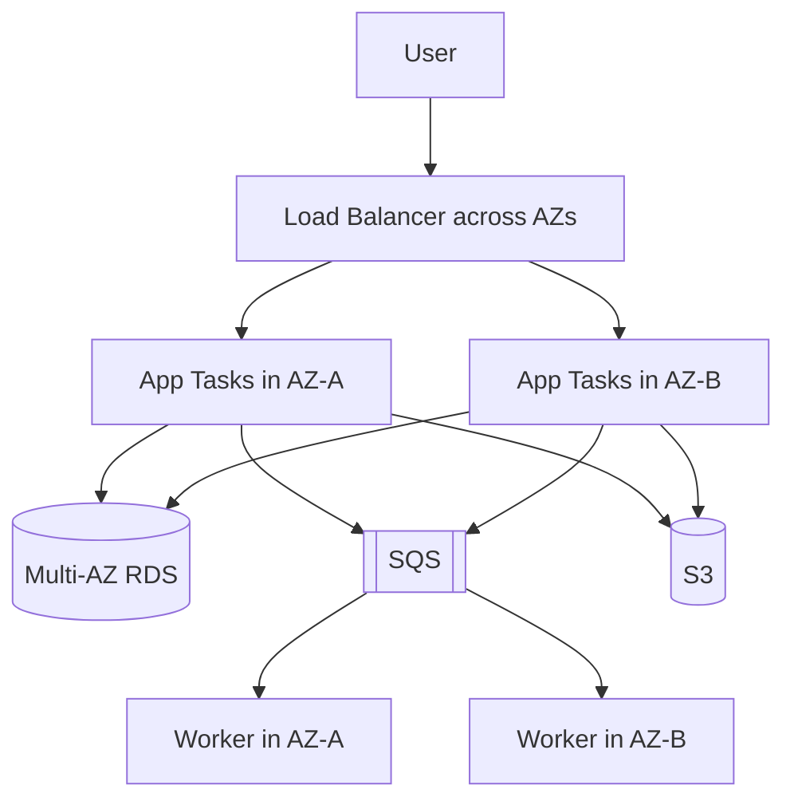

## 12.2 Scaling by Layer

| Layer | Scaling Method |
|---|---|
| EC2 | Auto Scaling Group |
| ECS API | Service Auto Scaling based on CPU, memory or request count |
| ECS worker | Scale based on SQS backlog or oldest-message age |
| RDS | Larger instance, storage/IOPS changes, read replicas or architecture changes |
| S3 | Managed scaling; application request patterns still matter |
| SQS | Managed queue scaling; consumers must scale and process safely |
| CloudWatch | Add metrics, alarms and dashboards as the system grows |

## 12.3 Graceful Degradation

During a dependency problem:

- Keep accepting non-critical asynchronous work into SQS when safe.
- Return clear errors when operations cannot be completed.
- Apply timeouts to network calls.
- Use retries only for transient errors.
- Add exponential backoff and jitter.
- Use circuit-breaking patterns where appropriate.
- Avoid retry storms.
- Preserve idempotency.

## 12.4 Backup Is Not Disaster Recovery by Itself

A complete recovery strategy defines:

- **RPO:** Maximum acceptable data loss
- **RTO:** Maximum acceptable recovery time
- Backup frequency
- Restore procedure
- Region and account strategy
- Dependency recovery order
- Secret and configuration recovery
- DNS and traffic-switching procedure
- Regular recovery testing

---

# 13. Cost-Optimization Checklist

## 13.1 EC2

- Right-size based on CPU, memory, network and I/O.
- Stop or schedule non-production instances.
- Use Auto Scaling.
- Use Savings Plans for stable measured usage.
- Use Spot for interruption-tolerant workloads.
- Delete unused EBS volumes and snapshots.
- Review Elastic IP and data-transfer charges.
- Prefer current-generation instances when suitable.

## 13.2 S3

- Use lifecycle rules.
- Expire old object versions.
- Abort incomplete multipart uploads.
- Use Intelligent-Tiering for changing access patterns.
- Avoid unnecessary cross-Region transfer.
- Review request and retrieval charges.
- Compress appropriate data.

## 13.3 RDS

- Right-size instance class and storage.
- Stop eligible non-production databases during unused periods, while understanding service limitations.
- Delete unused snapshots according to retention policy.
- Tune expensive queries before increasing instance size.
- Control connection counts.
- Use read replicas only when they solve a measured requirement.
- Review Multi-AZ cost against environment criticality.

## 13.4 ECR

- Apply lifecycle policies.
- Delete obsolete untagged images.
- Avoid retaining every temporary CI image forever.
- Use efficient multi-stage Docker builds.
- Keep image layers small.

## 13.5 ECS

- Set realistic CPU and memory.
- Scale down idle non-production services.
- Use Fargate for operational simplicity where it is cost-effective.
- Use EC2 capacity when stable utilization and operational maturity justify it.
- Avoid oversized task definitions.
- Monitor pending tasks and unused capacity.

## 13.6 SQS

- Use long polling.
- Batch send, receive and delete operations where appropriate.
- Prevent runaway retries.
- Use DLQs to isolate failures.
- Delete successfully processed messages.
- Keep message payloads small.

## 13.7 CloudWatch

- Set log-retention periods.
- Avoid high-cardinality custom metric designs without review.
- Filter noisy logs before ingestion where appropriate.
- Review unused dashboards and alarms.
- Query only required log ranges.
- Balance observability detail with cost.

---

# 14. Service Selection Summary

## 14.1 Compute Selection

| Requirement | Preferred Starting Point |
|---|---|
| Full server and operating-system control | EC2 |
| Containerized application with minimal server operations | ECS with Fargate |
| Containerized application using managed EC2 capacity options | ECS Managed Instances, after feature and workload evaluation |
| Containerized application requiring custom EC2 hosts | ECS on EC2 |
| One-off container job | ECS standalone task |
| Long-running scalable container API | ECS service |

## 14.2 Storage Selection

| Requirement | Service |
|---|---|
| Images, documents, videos and exports | S3 |
| Attached virtual disk for EC2 | EBS |
| Relational transactional data | RDS |
| Docker/OCI images | ECR |
| Temporary asynchronous work | SQS |

## 14.3 Availability and Scaling Selection

| Requirement | AWS Feature |
|---|---|
| Replace unhealthy virtual servers | EC2 Auto Scaling |
| Maintain desired container count | ECS service |
| Scale container count | ECS Service Auto Scaling |
| Database high availability | RDS Multi-AZ |
| Scale database reads | RDS read replica |
| Buffer traffic spikes | SQS |
| Archive old objects | S3 lifecycle |
| Detect failures | CloudWatch alarms |

## 14.4 Common Confusions

| Confusion | Correct Understanding |
|---|---|
| ECR vs ECS | ECR stores images; ECS runs containers |
| EC2 vs ECS | EC2 is virtual-machine compute; ECS orchestrates containers |
| Multi-AZ vs read replica | Multi-AZ is mainly HA; a read replica is mainly read scaling |
| S3 vs EBS | S3 is object storage; EBS is block storage |
| SQS receive vs delete | Receive hides a message; delete removes it |
| Task role vs execution role | Task role is for application code; execution role is for ECS startup/platform actions |
| Metrics vs logs | Metrics are numeric time series; logs are detailed events |
| CloudWatch vs CloudTrail | CloudWatch monitors health; CloudTrail records AWS API activity |

---

# 15. Key Takeaways

1. **EC2** provides virtual machines and maximum server control.
2. **S3** stores durable objects such as files, backups and static assets.
3. **RDS** operates managed relational databases and supports backups, high availability and read scaling.
4. **ECR** stores versioned container images.
5. **ECS** deploys and maintains containers using Fargate, EC2 or other supported capacity options.
6. **SQS** decouples application components and absorbs workload spikes.
7. **CloudWatch** provides metrics, logs, alarms and dashboards.
8. Use **IAM roles**, private networking and least privilege.
9. Use **Multi-AZ**, multiple application tasks and queues to improve resilience.
10. Use **immutable deployments**, health checks, monitoring and rollback plans.
11. Keep application containers stateless.
12. Store large files in S3, relational data in RDS and job messages in SQS.
13. Make queue consumers idempotent.
14. Scale each layer using a metric that represents its real bottleneck.
15. Evaluate architecture against the AWS Well-Architected pillars: operational excellence, security, reliability, performance efficiency, cost optimization and sustainability.

---

# 16. Official AWS References

The following official AWS documentation was used to review the service behavior described in this guide:

## EC2

- [What is Amazon EC2?](https://docs.aws.amazon.com/AWSEC2/latest/UserGuide/concepts.html)
- [What is Amazon EC2 Auto Scaling?](https://docs.aws.amazon.com/autoscaling/ec2/userguide/what-is-amazon-ec2-auto-scaling.html)
- [Use Elastic Load Balancing with an Auto Scaling group](https://docs.aws.amazon.com/autoscaling/ec2/userguide/autoscaling-load-balancer.html)
- [Basic and detailed monitoring in CloudWatch](https://docs.aws.amazon.com/AmazonCloudWatch/latest/monitoring/cloudwatch-metrics-basic-detailed.html)

## S3

- [What is Amazon S3?](https://docs.aws.amazon.com/AmazonS3/latest/userguide/Welcome.html)
- [S3 storage classes](https://docs.aws.amazon.com/AmazonS3/latest/userguide/storage-class-intro.html)
- [S3 Versioning](https://docs.aws.amazon.com/AmazonS3/latest/userguide/Versioning.html)
- [S3 lifecycle rules](https://docs.aws.amazon.com/AmazonS3/latest/userguide/intro-lifecycle-rules.html)
- [Default bucket encryption](https://docs.aws.amazon.com/AmazonS3/latest/userguide/bucket-encryption.html)
- [S3 security best practices](https://docs.aws.amazon.com/AmazonS3/latest/userguide/security-best-practices.html)

## RDS

- [What is Amazon RDS?](https://docs.aws.amazon.com/AmazonRDS/latest/UserGuide/Welcome.html)
- [Multi-AZ deployments](https://docs.aws.amazon.com/AmazonRDS/latest/UserGuide/Concepts.MultiAZ.html)
- [RDS read replicas](https://docs.aws.amazon.com/AmazonRDS/latest/UserGuide/USER_ReadRepl.html)
- [RDS automated backups](https://docs.aws.amazon.com/AmazonRDS/latest/UserGuide/USER_WorkingWithAutomatedBackups.html)

## ECR

- [What is Amazon ECR?](https://docs.aws.amazon.com/AmazonECR/latest/userguide/what-is-ecr.html)
- [ECR private repositories](https://docs.aws.amazon.com/AmazonECR/latest/userguide/Repositories.html)
- [ECR image scanning](https://docs.aws.amazon.com/AmazonECR/latest/userguide/image-scanning.html)
- [ECR tag immutability](https://docs.aws.amazon.com/AmazonECR/latest/userguide/image-tag-mutability.html)
- [ECR lifecycle policies](https://docs.aws.amazon.com/AmazonECR/latest/userguide/LifecyclePolicies.html)

## ECS

- [What is Amazon ECS?](https://docs.aws.amazon.com/AmazonECS/latest/developerguide/Welcome.html)
- [Architect an ECS solution](https://docs.aws.amazon.com/AmazonECS/latest/developerguide/ecs-configuration.html)
- [ECS task definitions](https://docs.aws.amazon.com/AmazonECS/latest/developerguide/task_definitions.html)
- [ECS services](https://docs.aws.amazon.com/AmazonECS/latest/developerguide/ecs_services.html)
- [AWS Fargate for ECS](https://docs.aws.amazon.com/AmazonECS/latest/developerguide/AWS_Fargate.html)

## SQS

- [What is Amazon SQS?](https://docs.aws.amazon.com/AWSSimpleQueueService/latest/SQSDeveloperGuide/welcome.html)
- [SQS standard queues](https://docs.aws.amazon.com/AWSSimpleQueueService/latest/SQSDeveloperGuide/standard-queues.html)
- [SQS FIFO queues](https://docs.aws.amazon.com/AWSSimpleQueueService/latest/SQSDeveloperGuide/sqs-fifo-queues.html)
- [SQS visibility timeout](https://docs.aws.amazon.com/AWSSimpleQueueService/latest/SQSDeveloperGuide/sqs-visibility-timeout.html)
- [SQS dead-letter queues](https://docs.aws.amazon.com/AWSSimpleQueueService/latest/SQSDeveloperGuide/sqs-dead-letter-queues.html)
- [SQS long polling](https://docs.aws.amazon.com/AWSSimpleQueueService/latest/SQSDeveloperGuide/sqs-short-and-long-polling.html)

## CloudWatch

- [What is Amazon CloudWatch?](https://docs.aws.amazon.com/AmazonCloudWatch/latest/monitoring/WhatIsCloudWatch.html)
- [CloudWatch metrics](https://docs.aws.amazon.com/AmazonCloudWatch/latest/monitoring/working_with_metrics.html)
- [CloudWatch Logs](https://docs.aws.amazon.com/AmazonCloudWatch/latest/logs/WhatIsCloudWatchLogs.html)
- [CloudWatch alarms](https://docs.aws.amazon.com/AmazonCloudWatch/latest/monitoring/CloudWatch_Alarms.html)
- [CloudWatch dashboards](https://docs.aws.amazon.com/AmazonCloudWatch/latest/monitoring/CloudWatch_Dashboards.html)
- [CloudWatch agent](https://docs.aws.amazon.com/AmazonCloudWatch/latest/monitoring/Install-CloudWatch-Agent.html)

## Architecture

- [AWS Well-Architected Framework](https://docs.aws.amazon.com/wellarchitected/latest/framework/welcome.html)
- [AWS Well-Architected pillars](https://docs.aws.amazon.com/wellarchitected/latest/framework/the-pillars-of-the-framework.html)

---

> **Revision note:** AWS services evolve continuously. Confirm current Region availability, quotas, pricing and feature support in official AWS documentation before making a production architecture decision.
