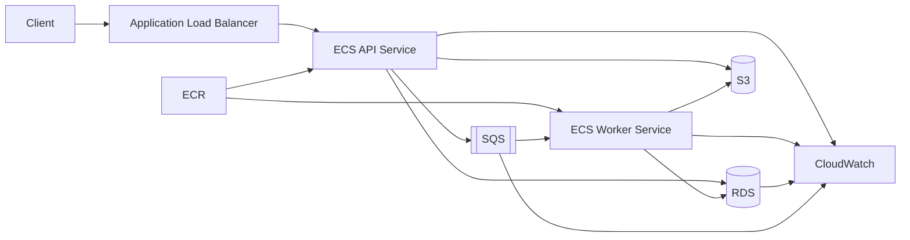
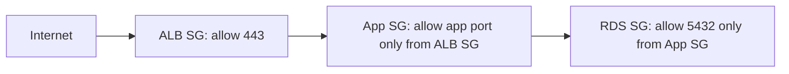
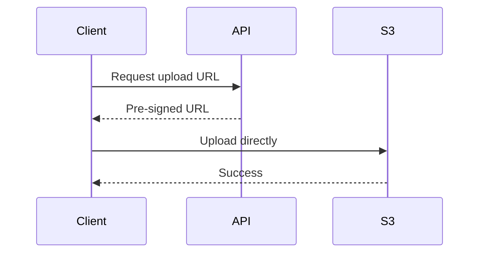
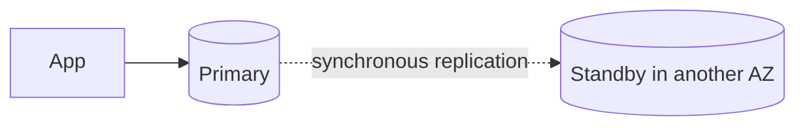
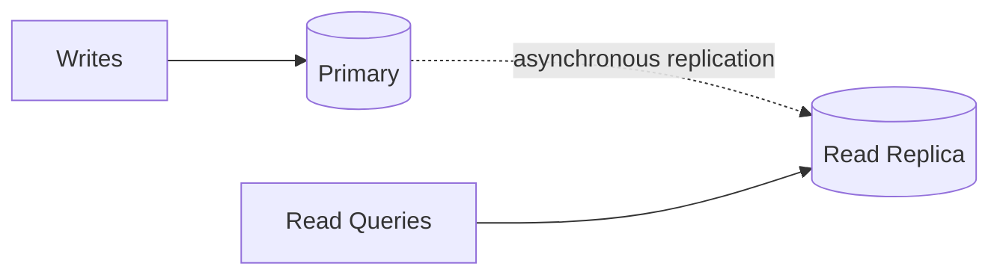
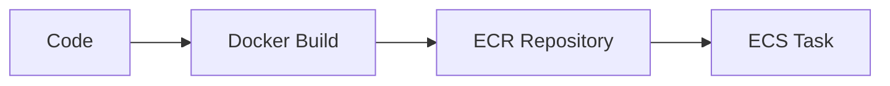
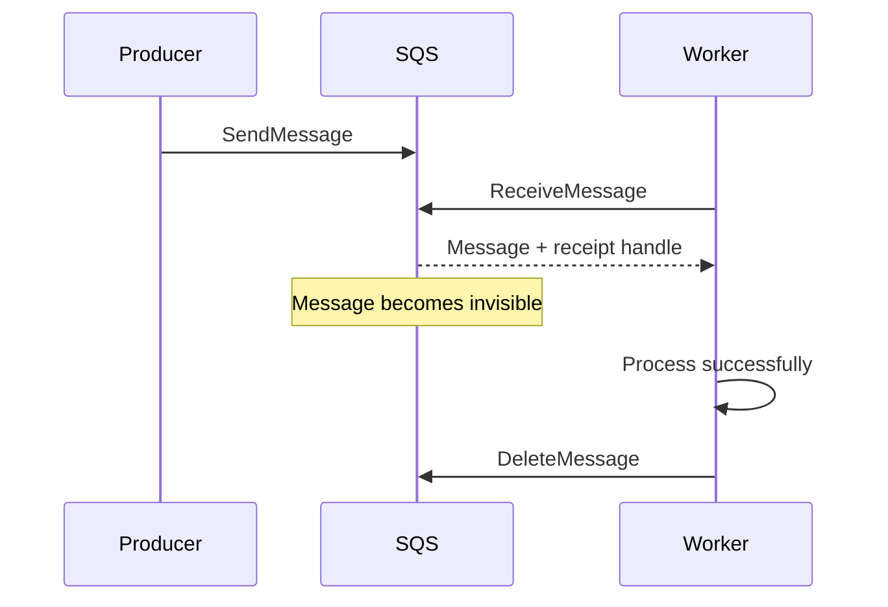
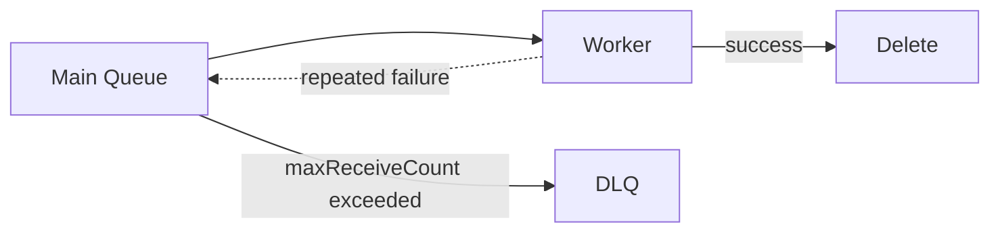
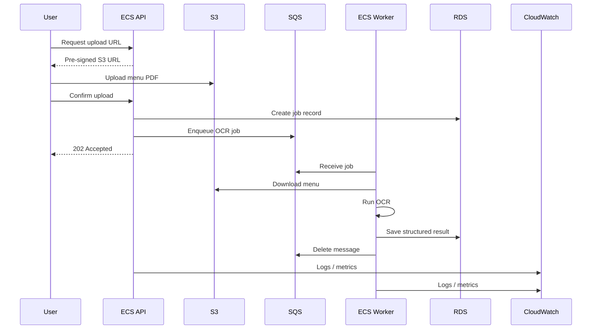

# AWS Core Services: EC2, S3, RDS, ECS, ECR, SQS and CloudWatch

> A practical, interview-focused guide to the AWS services most backend developers use in normal production systems.

## In short

- **EC2** = virtual machines when you need server/OS control.
- **S3** = object storage for files, uploads, backups and static assets.
- **RDS** = managed relational databases such as PostgreSQL and MySQL.
- **ECR** = private registry that stores container images.
- **ECS** = runs and manages containers; **Fargate** is the simplest common option when you do not want to manage hosts.
- **SQS** = message queue for background work and service decoupling.
- **CloudWatch** = metrics, logs, alarms and dashboards for AWS workloads.

The most important production pattern is:



---

# Index

1. AWS Core Services at a Glance
2. Amazon EC2 — Virtual Machines
3. Amazon S3 — Object Storage
4. Amazon RDS — Managed Relational Databases
5. Amazon ECR — Container Registry
6. Amazon ECS — Container Orchestration
7. Amazon SQS — Message Queue
8. Amazon CloudWatch — Monitoring and Observability
9. End-to-End Production Example
10. Service Selection and Production Best Practices
11. Official AWS References

---

# 1. AWS Core Services at a Glance

Each service solves a different part of the application architecture.

| Service | Responsibility | Common Developer Use |
|---|---|---|
| **EC2** | Compute | Run APIs, workers, custom software or self-managed services |
| **S3** | Object storage | Files, images, documents, backups and exports |
| **RDS** | Relational database | PostgreSQL/MySQL transactional application data |
| **ECR** | Container registry | Store versioned Docker/OCI images |
| **ECS** | Container orchestration | Run APIs, workers and scheduled container tasks |
| **SQS** | Asynchronous messaging | Background jobs and decoupled processing |
| **CloudWatch** | Observability | Metrics, logs, alarms and dashboards |

A useful mental model is:

```text
Code -> Docker Image -> ECR -> ECS
                         |
                         +-> API -> RDS
                                -> S3
                                -> SQS -> Worker

All runtime services -> CloudWatch
```

---

# 2. Amazon EC2 — Virtual Machines

## 2.1 What EC2 Is

**Amazon Elastic Compute Cloud (EC2)** provides virtual machines called **instances**.

You choose the operating system, instance size and networking, then install and run your application just like on a normal server.

Typical use cases:

- Backend APIs
- Long-running workers
- Docker hosts
- CI runners
- Specialized CPU/GPU workloads
- Software that needs OS-level configuration

## 2.2 Core Concepts

| Concept | Meaning |
|---|---|
| **AMI** | Machine image used to launch an instance |
| **Instance type** | CPU, memory, networking and hardware profile |
| **EBS** | Persistent block storage attached to EC2 |
| **Security group** | Stateful firewall for instance traffic |
| **IAM role** | Temporary AWS permissions for the instance |
| **User data** | Startup/bootstrap script |
| **Auto Scaling Group** | Maintains and scales a group of instances |

## 2.3 Stop vs Terminate

- **Stop**: shuts down compute; the instance can normally be started again and EBS data is retained.
- **Terminate**: removes the instance permanently; attached storage behavior depends on its delete-on-termination setting.

Stopping an instance does not guarantee zero cost because resources such as EBS volumes and public IPv4 addresses can still be billed.

## 2.4 Security Group Pattern

Security groups are **stateful**. A common production rule chain is:



Do not expose application or database ports to the whole internet unless there is a specific requirement.

## 2.5 When EC2 Is the Right Choice

Choose EC2 when you need:

- Full OS or host control
- Custom kernel/system packages
- Specialized EC2 hardware
- Long-running software that does not fit a serverless/container model

For a normal containerized API, ECS with Fargate is usually simpler operationally.

**Interview focus:** understand EC2 vs ECS, AMI vs instance, EBS vs S3, security groups, Auto Scaling, and On-Demand vs Spot capacity.

---

# 3. Amazon S3 — Object Storage

## 3.1 What S3 Is

**Amazon Simple Storage Service (S3)** stores data as objects.

```text
Bucket
└── Key -> Object data + metadata
```

Example:

```text
Bucket: restaurant-assets-prod
Key: menus/restaurant-101/menu.pdf
```

S3 is **not a normal filesystem** and is not block storage. Applications access it using AWS APIs, SDKs, CLI commands or HTTP-based access.

## 3.2 Important Behavior

S3 provides **strong read-after-write consistency** for object PUT and DELETE operations in all AWS Regions. After a successful write, subsequent GET and LIST operations see the updated data.

All S3 buckets also have server-side encryption enabled by default; new objects use **SSE-S3** unless another supported encryption configuration is chosen.

## 3.3 Features Developers Commonly Use

### Versioning

Keeps multiple versions of an object and helps recover from accidental overwrite or deletion.

### Lifecycle Rules

Automatically transition or delete objects based on age.

```text
S3 Standard -> Standard-IA -> Glacier -> Expire
```

### Pre-Signed URLs

Give a client temporary permission to upload or download a specific object without making the bucket public.



This avoids sending large file bytes through your API server.

## 3.4 Practical Best Practices

- Keep **Block Public Access** enabled unless public access is intentional.
- Prefer IAM roles over long-lived AWS keys.
- Use pre-signed URLs for direct uploads/downloads.
- Enable versioning for important data.
- Add lifecycle rules so old versions and temporary files do not grow forever.
- Use **SSE-KMS** when you need stronger key-level control and auditability.
- Store large files in S3, not in relational database columns.

**Interview focus:** object vs block storage, bucket/key/object, versioning, lifecycle rules, pre-signed URLs, SSE-S3 vs SSE-KMS, and strong consistency.

---

# 4. Amazon RDS — Managed Relational Databases

## 4.1 What RDS Is

**Amazon Relational Database Service (RDS)** is a managed relational database service supporting engines such as PostgreSQL, MySQL, MariaDB, SQL Server, Oracle and Db2.

AWS manages much of the infrastructure work, including provisioning, backups and failover mechanisms. You still own schema design, queries, indexes, users, connection handling and capacity decisions.

## 4.2 Multi-AZ vs Read Replica

This distinction is especially important.

### Multi-AZ DB Instance



Purpose: **high availability and failover**.

A traditional Multi-AZ DB instance standby does **not** serve application read traffic.

### Multi-AZ DB Cluster

RDS also supports Multi-AZ DB clusters with one writer and two readable instances across three Availability Zones. This gives high availability and read capacity from the reader instances.

### Read Replica



Purpose: **read scaling** and workload offloading. Replication is asynchronous, so replica lag is possible.

## 4.3 Connection Pooling

Opening a new database connection for every request is expensive.

Example:

```text
10 ECS tasks x 20 DB connections each = 200 connections
```

As application tasks scale, the database can become overloaded even when CPU looks healthy. Use framework connection pooling or RDS Proxy where it is appropriate.

## 4.4 Production Best Practices

- Keep RDS in private subnets.
- Allow DB traffic only from the application security group.
- Use encrypted connections and encrypted storage.
- Store credentials in a secret-management system.
- Enable backups and test restoration.
- Use Multi-AZ for important production databases.
- Use read replicas only when read load actually needs scaling.
- Monitor CPU, connections, free storage, latency and IOPS.
- Store files in S3 instead of RDS.

**Interview focus:** RDS vs DB on EC2, Multi-AZ vs read replica, backups vs snapshots, connection pooling, vertical scaling vs read scaling.

---

# 5. Amazon ECR — Container Registry

## 5.1 What ECR Is

**Amazon Elastic Container Registry (ECR)** is a managed private registry for Docker/OCI images.

Typical flow:



ECR **stores images**; ECS **runs containers**.

## 5.2 Tag vs Digest

A tag is human-friendly:

```text
orders-api:1.4.2
orders-api:git-a1b2c3d
```

A digest identifies exact image content:

```text
orders-api@sha256:...
```

Production releases should use unique, traceable tags or digests instead of relying only on `latest`.

## 5.3 Scanning and Lifecycle

ECR supports basic image scanning, while **enhanced scanning** integrates with Amazon Inspector and can identify operating-system and programming-language package vulnerabilities.

Lifecycle policies help expire old or untagged images so CI builds do not accumulate forever.

## 5.4 Practical Best Practices

- Use immutable release tags or image digests.
- Enable vulnerability scanning.
- Apply lifecycle policies.
- Keep base images small and patched.
- Never bake secrets into Docker image layers.
- Keep a traceable relationship between Git commit, CI build and image version.

**Interview focus:** ECR vs ECS, registry vs repository, tag vs digest, image immutability, vulnerability scanning and lifecycle policies.

---

# 6. Amazon ECS — Container Orchestration

## 6.1 What ECS Is

**Amazon Elastic Container Service (ECS)** runs and manages containerized applications.

Main hierarchy:

```text
ECS Cluster
├── API Service
│   ├── Task 1
│   └── Task 2
└── Worker Service
    ├── Task 1
    └── Task 2
```

| Concept | Meaning |
|---|---|
| **Cluster** | Logical grouping of ECS workloads/capacity |
| **Task definition** | Versioned blueprint for containers |
| **Task** | Running copy of a task definition |
| **Service** | Keeps a desired number of tasks running |
| **Standalone task** | One-off task not continuously maintained |

## 6.2 ECS Compute Options

### Fargate

AWS manages the underlying servers. You mainly define the image, CPU, memory, networking and task count.

Best starting point for common APIs and workers when you want minimal infrastructure management.

### ECS on EC2

You manage EC2 capacity and ECS runs containers on those instances.

Use it when you need host control, specialized host configuration or want to optimize stable large-scale capacity yourself.

### ECS Managed Instances

A newer ECS compute option that keeps access to EC2 instance types and capabilities while AWS handles provisioning, scaling, patching and maintenance of the underlying infrastructure.

For interviews, explain **Fargate** and **ECS on EC2** first because they remain the clearest core comparison, then mention Managed Instances as the managed-EC2 option.

## 6.3 Task Role vs Execution Role

This is one of the most useful ECS distinctions.

```text
ECS Platform
└── Task Execution Role
    ├── Pull image from ECR
    ├── Send logs to CloudWatch
    └── Fetch supported startup secrets

Application Container
└── Task Role
    ├── Read/write S3
    ├── Send/receive SQS
    └── Call other AWS APIs
```

Application permissions belong on the **task role**, not the execution role.

## 6.4 Deployment and Scaling

A normal deployment is:

```text
Build image -> Push ECR -> Register task definition revision
-> Update ECS service -> Start healthy new tasks -> Stop old tasks
```

Common scaling signals:

- CPU or memory for APIs
- ALB request count
- SQS backlog per worker
- Custom business/application metrics

For queue workers, backlog is often more meaningful than CPU because a worker may be I/O-bound.

## 6.5 Practical Best Practices

- Run stateless containers.
- Keep tasks in private subnets when possible.
- Use health checks.
- Send structured logs to CloudWatch.
- Use separate task and execution roles.
- Use immutable image versions.
- Configure graceful shutdown.
- Scale services across multiple Availability Zones.
- Keep secrets outside source code and image layers.

**Interview focus:** cluster/service/task/task-definition, ECS vs EC2, ECS vs ECR, Fargate vs EC2, service vs standalone task, task role vs execution role.

---

# 7. Amazon SQS — Message Queue

## 7.1 What SQS Is

**Amazon Simple Queue Service (SQS)** decouples producers from consumers.

Without a queue:

```text
API -> OCR processing -> User waits
```

With SQS:

```text
API -> SQS -> return response
        |
        v
      Worker -> OCR processing
```

The API stays responsive even when the background work is slow.

## 7.2 Message Lifecycle



Receiving a message does **not** remove it. The consumer deletes it only after successful processing.

If the worker fails before deletion, the message can become visible again after the **visibility timeout**.

## 7.3 Standard vs FIFO

| Area | Standard | FIFO |
|---|---|---|
| Delivery | At least once | Exactly-once processing semantics within FIFO deduplication behavior |
| Ordering | Best effort | Strict within a message group |
| Typical use | Most background jobs | Ordering-sensitive workflows |
| Duplicate handling | Consumer must expect duplicates | SQS deduplication prevents SQS-introduced duplicates within its rules |

Even with FIFO, application handlers should remain idempotent when they trigger external side effects. A worker can complete a payment/API call and crash before acknowledging the queue operation.

## 7.4 Visibility Timeout and DLQ

If processing normally takes 2 minutes but visibility is only 30 seconds, another worker may receive the same message while the first is still working.

Set a realistic visibility timeout or extend it for long-running jobs.

Use a **Dead-Letter Queue (DLQ)** for messages that repeatedly fail.



## 7.5 Message Design

Keep messages small and pass references to large data.

```json
{
  "event_type": "menu.ocr.requested",
  "event_version": 1,
  "job_id": "job-101",
  "s3_bucket": "restaurant-assets-prod",
  "s3_key": "menus/job-101/menu.pdf"
}
```

SQS supports messages up to **1 MiB**. For larger payloads, store the content in S3 and send the object reference.

## 7.6 Practical Best Practices

- Use long polling.
- Delete messages only after success.
- Configure a suitable visibility timeout.
- Use a DLQ.
- Make consumers idempotent.
- Add retry backoff and jitter.
- Scale workers using queue backlog or oldest-message age.
- Keep secrets and large files out of messages.

**Interview focus:** Standard vs FIFO, at-least-once delivery, visibility timeout, receipt handle, long polling, DLQ, idempotency and worker scaling.

---

# 8. Amazon CloudWatch — Monitoring and Observability

## 8.1 What CloudWatch Is

**Amazon CloudWatch** provides monitoring and observability for AWS resources and applications.

The four concepts developers use most are:

- **Metrics** — numeric time-series values
- **Logs** — detailed events and application output
- **Alarms** — rules that react to metric conditions
- **Dashboards** — visual operational views

## 8.2 Useful Signals

| Service | Useful Signals |
|---|---|
| **EC2** | CPU, status checks, network; memory/disk via CloudWatch Agent |
| **ECS** | CPU, memory, running/pending tasks, deployment health |
| **RDS** | CPU, connections, free storage, latency, IOPS, replica lag |
| **SQS** | Visible messages, oldest-message age, DLQ depth |
| **S3** | Storage metrics and request metrics when enabled |

EC2 does not expose every operating-system metric automatically. The **CloudWatch Agent** can collect memory, disk and additional system/application telemetry.

## 8.3 Structured Logging

Prefer JSON logs:

```json
{
  "level": "ERROR",
  "service": "orders-api",
  "request_id": "req-123",
  "event": "order_creation_failed",
  "duration_ms": 3012
}
```

This is easier to filter and query than unstructured text.

## 8.4 Alarm on User Impact

Do not monitor only CPU.

Useful alarms include:

- High 5xx error rate
- High p95/p99 latency
- No healthy ALB targets
- ECS running tasks below desired count
- RDS low free storage or high connection count
- SQS oldest-message age growing
- Messages appearing in a DLQ

## 8.5 CloudWatch vs CloudTrail

- **CloudWatch:** Is the system healthy and performing correctly?
- **CloudTrail:** Who called an AWS API, what action occurred and when?

**Interview focus:** metrics vs logs vs alarms, dimensions, CloudWatch Agent, Logs Insights, useful service metrics and CloudWatch vs CloudTrail.

---

# 9. End-to-End Production Example

Use one example to connect all seven services: a user uploads a restaurant menu and the system performs OCR in the background.

## 9.1 Request Flow



## 9.2 Where Each Service Fits

- **ECR** stores the API and worker Docker images.
- **ECS** runs the API and worker containers.
- **S3** stores the uploaded PDF.
- **RDS** stores job metadata and OCR results.
- **SQS** buffers OCR jobs and separates request handling from slow processing.
- **CloudWatch** tracks logs, errors, queue age and runtime health.
- **EC2** may still be used when the workload needs host-level control or specialized hardware; otherwise ECS can run on Fargate or another ECS compute option.

This architecture is easy to explain in an interview because every service has one clear responsibility.

---

# 10. Service Selection and Production Best Practices

## 10.1 Fast Selection Guide

| Requirement | Start With |
|---|---|
| Full virtual-machine/OS control | **EC2** |
| Normal containerized API with minimal host management | **ECS + Fargate** |
| Managed ECS with access to broader EC2 capabilities | **ECS Managed Instances** |
| Containerized workload requiring self-managed hosts | **ECS on EC2** |
| Files and user uploads | **S3** |
| Relational transactional data | **RDS** |
| Private container images | **ECR** |
| Background/asynchronous work | **SQS** |
| Metrics, logs and alarms | **CloudWatch** |

## 10.2 Common Architecture Distinctions

| Pair | Correct Mental Model |
|---|---|
| **EC2 vs ECS** | EC2 provides virtual machines; ECS orchestrates containers |
| **ECR vs ECS** | ECR stores images; ECS runs containers |
| **S3 vs EBS** | S3 is object storage; EBS is block storage attached to compute |
| **Multi-AZ vs Read Replica** | Multi-AZ is primarily HA; read replicas are primarily read scaling |
| **Task Role vs Execution Role** | Task role is for app code; execution role is for ECS platform/startup actions |
| **SQS Receive vs Delete** | Receive hides a message; delete permanently removes it |
| **CloudWatch vs CloudTrail** | CloudWatch monitors operation; CloudTrail records AWS API activity |

## 10.3 Production Baseline

For most backend applications:

1. Put the **ALB** in public subnets.
2. Keep **ECS tasks and RDS** in private subnets.
3. Use security-group references such as `ALB -> API -> RDS`.
4. Use **IAM roles**, not long-lived access keys.
5. Keep application containers stateless.
6. Store files in **S3** and relational data in **RDS**.
7. Put slow/retryable work on **SQS**.
8. Store immutable container versions in **ECR**.
9. Monitor latency, errors, queue age and database pressure in **CloudWatch**.
10. Design deployments and database changes so rollback remains possible.

A good architecture should also be reviewed against the AWS Well-Architected pillars: **operational excellence, security, reliability, performance efficiency, cost optimization and sustainability**.

---

# 11. Official AWS References

Reviewed against current AWS documentation as of **August 20, 2026**.

- [Amazon EC2 User Guide](https://docs.aws.amazon.com/AWSEC2/latest/UserGuide/concepts.html)
- [Amazon S3 User Guide](https://docs.aws.amazon.com/AmazonS3/latest/userguide/)
- [S3 Default Encryption](https://docs.aws.amazon.com/AmazonS3/latest/userguide/bucket-encryption.html)
- [Amazon RDS User Guide](https://docs.aws.amazon.com/AmazonRDS/latest/UserGuide/Welcome.html)
- [RDS Multi-AZ Deployments](https://docs.aws.amazon.com/AmazonRDS/latest/UserGuide/Concepts.MultiAZ.html)
- [RDS Read Replicas](https://docs.aws.amazon.com/AmazonRDS/latest/UserGuide/USER_ReadRepl.html)
- [Amazon ECR User Guide](https://docs.aws.amazon.com/AmazonECR/latest/userguide/what-is-ecr.html)
- [Amazon ECS Developer Guide](https://docs.aws.amazon.com/AmazonECS/latest/developerguide/Welcome.html)
- [Amazon ECS Managed Instances](https://docs.aws.amazon.com/AmazonECS/latest/developerguide/ManagedInstances.html)
- [ECS Task Execution IAM Role](https://docs.aws.amazon.com/AmazonECS/latest/developerguide/task_execution_IAM_role.html)
- [Amazon SQS Developer Guide](https://docs.aws.amazon.com/AWSSimpleQueueService/latest/SQSDeveloperGuide/welcome.html)
- [SQS FIFO Exactly-Once Processing](https://docs.aws.amazon.com/AWSSimpleQueueService/latest/SQSDeveloperGuide/FIFO-queues-exactly-once-processing.html)
- [Amazon CloudWatch User Guide](https://docs.aws.amazon.com/AmazonCloudWatch/latest/monitoring/WhatIsCloudWatch.html)
- [CloudWatch Agent](https://docs.aws.amazon.com/AmazonCloudWatch/latest/monitoring/Install-CloudWatch-Agent.html)
- [AWS Well-Architected Framework](https://docs.aws.amazon.com/wellarchitected/latest/framework/welcome.html)

> **Revision note:** AWS features, quotas, pricing and Region availability change over time. Re-check official AWS documentation before production architecture decisions.
