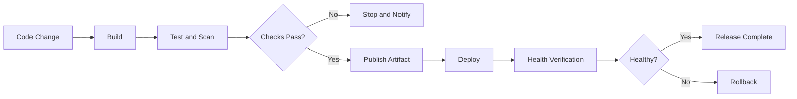
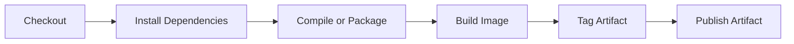
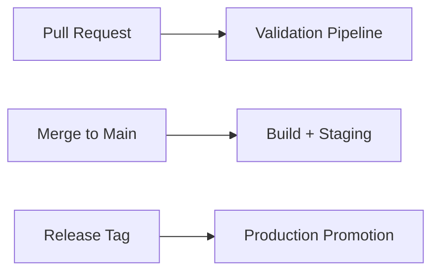
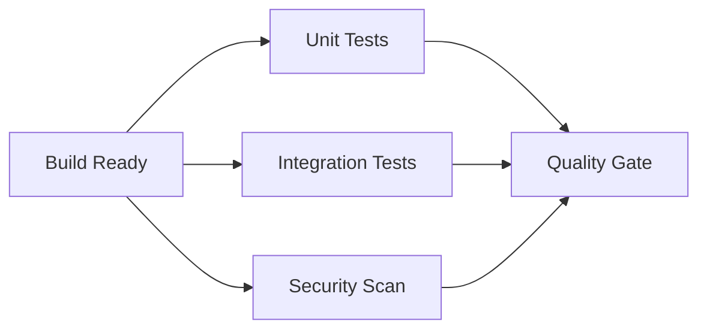
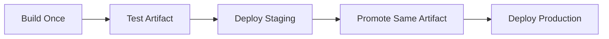
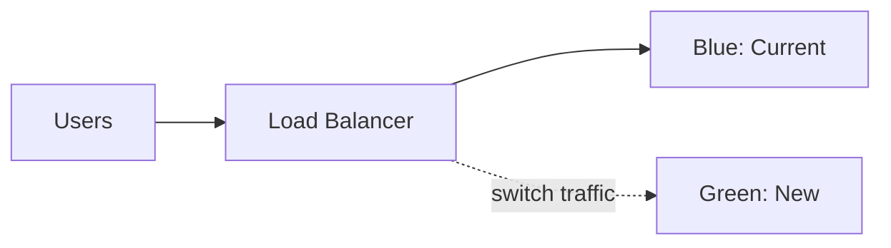
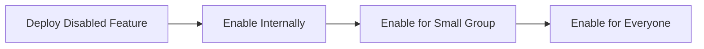
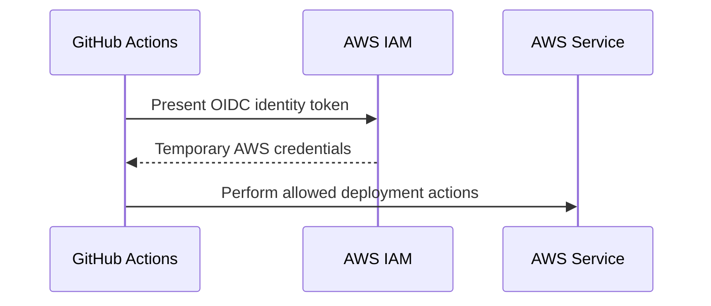
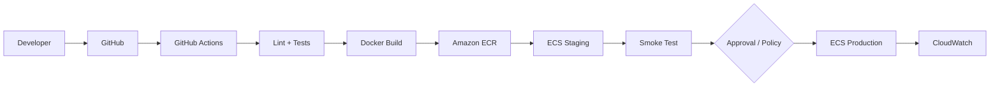
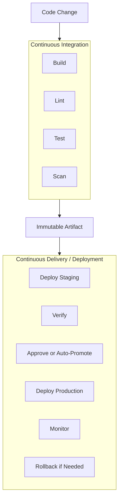

# CI/CD Pipeline Concepts: Build → Test → Deploy

> Practical CI/CD concepts used in day-to-day development and technical interviews.

## In short

- **CI (Continuous Integration)** automatically validates code changes using build, lint, tests, and security checks.
- **Continuous Delivery** keeps a tested release ready for production, but production normally has a **manual approval**.
- **Continuous Deployment** automatically releases every change that passes the required gates.
- A reliable pipeline follows **build once, promote the same artifact**. Do not rebuild separately for staging and production.
- Run **fast checks first**: lint → unit tests → integration tests → security checks → deployment.
- Use an **immutable artifact** such as a Docker image identified by a commit SHA or image digest.
- Choose deployment strategies based on risk: **rolling, blue/green, canary, or linear**.
- A deployment is not successful only because the command finished; verify **health, error rate, latency, and smoke tests**.
- Database changes should remain backward compatible during rollout. The common approach is **expand-and-contract**.
- Rollback must be designed and tested before production incidents happen.



---

# Index

1. [What Is CI/CD?](#1-what-is-cicd)
2. [CI vs Continuous Delivery vs Continuous Deployment](#2-ci-vs-continuous-delivery-vs-continuous-deployment)
3. [Core Pipeline: Build → Test → Deploy](#3-core-pipeline-build--test--deploy)
4. [Pipeline Building Blocks](#4-pipeline-building-blocks)
5. [Testing Strategy](#5-testing-strategy)
6. [Artifacts and Environment Promotion](#6-artifacts-and-environment-promotion)
7. [Deployment Strategies](#7-deployment-strategies)
8. [Database Migrations](#8-database-migrations)
9. [CI/CD Security](#9-cicd-security)
10. [Practical Example: FastAPI → Docker → ECR → ECS](#10-practical-example-fastapi--docker--ecr--ecs)
11. [Failure Handling and Rollback](#11-failure-handling-and-rollback)
12. [Observability and Delivery Metrics](#12-observability-and-delivery-metrics)
13. [AWS Services Used in CI/CD](#13-aws-services-used-in-cicd)
14. [Key Takeaways](#14-key-takeaways)

---

# 1. What Is CI/CD?

A **CI/CD pipeline** is an automated path that moves a code change from a repository to a running environment.

A normal flow looks like:

```text
Developer
   │
   ▼
Git Push / Pull Request
   │
   ▼
Build → Test → Scan → Artifact
   │
   ▼
Staging
   │
   ▼
Approval / Policy Gate
   │
   ▼
Production
   │
   ▼
Monitor → Rollback if required
```

The main goals are:

- **Repeatability** — deployment does not depend on one developer's local machine.
- **Fast feedback** — broken changes are detected early.
- **Traceability** — every deployment maps to a commit and artifact.
- **Safety** — tests, approvals, health checks, and rollback reduce release risk.
- **Automation** — routine steps happen consistently.

A pipeline is effectively **release process as code**.

---

# 2. CI vs Continuous Delivery vs Continuous Deployment

These three terms are related, but they describe different levels of automation.

## 2.1 Continuous Integration

Developers merge small changes frequently, and every change is automatically validated.

```text
Commit → Build → Lint → Test → Scan → Feedback
```

Typical CI work:

- Install dependencies
- Compile or package code
- Run linting and type checks
- Run unit and integration tests
- Run security scans
- Build an artifact or Docker image

The main goal is to catch integration problems quickly.

## 2.2 Continuous Delivery

The application is always kept in a deployable state.

```text
Commit → CI → Staging → Manual Approval → Production
```

Production release is intentionally controlled by a person or business process.

This is common when a team has:

- Compliance requirements
- Release windows
- Change-management approvals
- Business sign-off before production

## 2.3 Continuous Deployment

Every change that passes all required checks is automatically released.

```text
Commit → CI → Automated Gates → Production
```

There is no manual production approval.

This requires strong automated testing, observability, progressive rollout, and reliable rollback.

## 2.4 Quick Difference

| Concept | Automated validation | Automatic production release |
|---|---:|---:|
| Continuous Integration | Yes | No |
| Continuous Delivery | Yes | Usually no |
| Continuous Deployment | Yes | Yes |

---

# 3. Core Pipeline: Build → Test → Deploy

## 3.1 Build

The build stage converts source code into something deployable.

Examples:

- Python app → wheel or Docker image
- Java app → JAR
- React app → static production bundle
- Service → OCI/Docker container image

A good build should be reproducible and traceable.

Typical flow:



Useful practices:

- Lock dependency versions.
- Use clean runners.
- Pin important build-tool versions.
- Use fixed base-image versions or digests.
- Avoid depending on software manually installed on a developer machine.

## 3.2 Test

The test stage decides whether the change is safe enough to continue.

Common checks:

- Formatting
- Linting
- Type checking
- Unit tests
- Integration tests
- API or contract tests
- Dependency vulnerability scanning
- Secret scanning
- Container scanning

The pipeline should stop immediately when a required gate fails.

## 3.3 Deploy

Deployment changes the state of a runtime environment.

Examples:

- Update an ECS service.
- Apply a Kubernetes deployment.
- Publish a Lambda version.
- Upload frontend files to S3/CloudFront.
- Deploy an application revision to EC2.

Deployment should always include **verification**, not only execution.

---

# 4. Pipeline Building Blocks

## 4.1 Trigger

A **trigger** starts the workflow.

Common triggers:

- Pull request opened or updated
- Push to a branch
- Merge to `main`
- Git tag creation
- Manual execution
- Scheduled workflow
- External webhook

A common design is:



## 4.2 Stage, Job, Step, and Runner

| Term | Meaning |
|---|---|
| **Stage** | Logical pipeline section such as Build, Test, Staging, Production |
| **Job** | Group of related work executed on one runner |
| **Step** | Individual command or reusable action inside a job |
| **Runner / Agent** | Machine or container executing the job |
| **Environment** | Deployment target such as staging or production |
| **Gate** | Rule that must pass before the next stage starts |

Example:

```text
Test Stage
└── test job
    ├── checkout step
    ├── install step
    ├── lint step
    └── pytest step
```

## 4.3 Gates

Typical gates include:

- All required tests passed
- Coverage meets an agreed threshold
- No critical vulnerability
- Staging smoke tests passed
- Required production approval
- CloudWatch alarms remain healthy

A production approval should apply to a **specific artifact**, not simply "whatever is currently on the branch."

---

# 5. Testing Strategy

A CI pipeline should provide fast feedback without making developers wait unnecessarily.

## 5.1 Test Pyramid

```text
            ┌──────────────┐
            │     E2E      │  Few and slow
            ├──────────────┤
            │ Integration  │  Fewer
            ├──────────────┤
            │ Unit Tests   │  Many and fast
            └──────────────┘
```

A practical execution order is:

```text
Lint
  ↓
Unit Tests
  ↓
Integration Tests
  ↓
Security Checks
  ↓
E2E / Smoke Tests
```

Independent jobs can run in parallel:



## 5.2 Flaky Tests

A flaky test sometimes passes and sometimes fails without a relevant code change.

Do not hide flaky behavior with unlimited retries.

Prefer:

1. Record the failure.
2. Use a small bounded retry only for known transient cases.
3. Fix the root cause.
4. Keep retry behavior visible in reports.

---

# 6. Artifacts and Environment Promotion

An **artifact** is the output produced by the build.

Examples:

- Docker image
- JAR or WAR
- Python wheel
- ZIP package
- Frontend build bundle

## 6.1 Build Once, Promote Many

The preferred model is:



Avoid:

```text
Build for staging → Test → Rebuild for production
```

A second build may use a different dependency, base image, or build environment. Production would then receive something different from what staging tested.

## 6.2 Tags vs Digests

A Docker tag is readable:

```text
api:1.8.0
api:git-a7c31e2
```

A digest identifies exact image content:

```text
api@sha256:4d1c...
```

Use tags for humans and a commit SHA or digest for exact deployment identity.

## 6.3 Environment Configuration

The application artifact should remain the same across environments.

Environment-specific values should come from runtime configuration:

- Database URL
- Log level
- API endpoints
- Feature flags
- Secrets

Common stores include:

- AWS Secrets Manager
- AWS Systems Manager Parameter Store
- Kubernetes ConfigMaps and Secrets
- Runtime environment variables

---

# 7. Deployment Strategies

Deployment strategy determines how the new version replaces the old one.

## 7.1 Rolling

Instances or containers are replaced gradually.

```text
Step 1: Old  Old  Old  New
Step 2: Old  Old  New  New
Step 3: Old  New  New  New
Step 4: New  New  New  New
```

**Best when:** infrastructure cost matters and the application can safely run old and new versions together.

## 7.2 Blue/Green

Two environments exist temporarily:



After green is validated, traffic moves from blue to green.

**Best when:** fast rollback and strong release isolation are important.

## 7.3 Canary

A small percentage of production traffic reaches the new version first.

```text
95% old / 5% new
        ↓
Observe metrics
        ↓
0% old / 100% new
```

**Best when:** you want to limit blast radius and validate with real traffic.

## 7.4 Linear

Traffic moves in equal increments.

```text
90/10 → 80/20 → 70/30 → ... → 0/100
```

**Best when:** you want gradual validation at several checkpoints.

## 7.5 Comparison

| Strategy | Main benefit | Main trade-off |
|---|---|---|
| Rolling | Low additional cost | Old and new versions coexist |
| Blue/Green | Very fast traffic rollback | Temporary duplicate capacity |
| Canary | Small initial blast radius | Requires traffic control and observability |
| Linear | Gradual controlled rollout | Release takes longer |

### AWS note for 2026

Amazon ECS now supports **rolling, blue/green, linear, and canary** deployment strategies natively. For new ECS designs, native ECS deployment strategies are usually simpler than adding CodeDeploy only for traffic shifting.

## 7.6 Feature Flags

Feature flags separate **deployment** from **feature release**.



This lets you deploy code without exposing the feature immediately.

---

# 8. Database Migrations

Database changes are difficult because old and new application versions may run at the same time.

A breaking migration such as renaming or deleting a column can break old containers during a rolling or canary deployment.

## 8.1 Expand-and-Contract

Use backward-compatible changes across releases.

```text
Release 1 — Expand
Add new column
Keep old column
Application supports both

Release 2 — Migrate
Backfill data
Switch reads/writes to new column

Release 3 — Contract
Remove old application usage
Remove old column later
```

The key idea is simple:

> **Application rollback does not automatically undo a database migration.**

For production, prefer forward-compatible changes and delayed destructive migrations.

---

# 9. CI/CD Security

A CI/CD system can modify production, so it is part of the production security boundary.

## 9.1 Secrets

Never commit:

- AWS access keys
- Database passwords
- API tokens
- Private keys
- Production `.env` files

Use a secret manager and inject secrets only into jobs that need them.

## 9.2 Prefer OIDC and Short-Lived Credentials

For GitHub Actions → AWS, prefer OpenID Connect.



Benefits:

- No long-lived AWS key in GitHub
- Credentials expire automatically
- IAM trust can restrict repository, branch, or environment
- Permissions follow least privilege

## 9.3 Protect the Pipeline

Use:

- Protected branches
- Required pull-request reviews
- Required status checks
- Protected production environments
- Separate staging and production roles
- `CODEOWNERS` for workflow and infrastructure files
- Restricted permissions for pull requests from forks

For stronger supply-chain security, pin third-party actions to immutable commit SHAs after validating them.

---

# 10. Practical Example: FastAPI → Docker → ECR → ECS

Consider a FastAPI service deployed to Amazon ECS using Fargate.

## 10.1 Architecture



## 10.2 GitHub Actions Example

The versions below reflect the current major action versions available in 2026. For production supply-chain hardening, pin validated actions to immutable commit SHAs.

```yaml
name: CI and Deploy

on:
  push:
    branches: [main]
  workflow_dispatch:

permissions:
  contents: read
  id-token: write

concurrency:
  group: production-deployment
  cancel-in-progress: false

env:
  AWS_REGION: ap-south-1
  ECR_REPOSITORY: interview-api
  ECS_CLUSTER: interview-cluster
  ECS_SERVICE: interview-api-service
  ECS_TASK_DEFINITION: infrastructure/ecs-task-definition.json
  CONTAINER_NAME: api

jobs:
  test:
    runs-on: ubuntu-latest

    steps:
      - uses: actions/checkout@v6

      - uses: actions/setup-python@v6
        with:
          python-version: "3.14"
          cache: pip

      - name: Install dependencies
        run: pip install -r requirements.txt -r requirements-dev.txt

      - name: Lint
        run: ruff check .

      - name: Test
        run: pytest

  deploy:
    needs: test
    runs-on: ubuntu-latest
    environment: production

    steps:
      - uses: actions/checkout@v6

      - name: Configure AWS credentials with OIDC
        uses: aws-actions/configure-aws-credentials@v6
        with:
          role-to-assume: ${{ secrets.AWS_DEPLOY_ROLE_ARN }}
          aws-region: ${{ env.AWS_REGION }}

      - name: Login to ECR
        id: ecr
        uses: aws-actions/amazon-ecr-login@v2

      - name: Build and push image
        id: image
        env:
          REGISTRY: ${{ steps.ecr.outputs.registry }}
          IMAGE_TAG: ${{ github.sha }}
        run: |
          IMAGE_URI="$REGISTRY/$ECR_REPOSITORY:$IMAGE_TAG"
          docker build -t "$IMAGE_URI" .
          docker push "$IMAGE_URI"
          echo "uri=$IMAGE_URI" >> "$GITHUB_OUTPUT"

      - name: Render ECS task definition
        id: task
        uses: aws-actions/amazon-ecs-render-task-definition@v1
        with:
          task-definition: ${{ env.ECS_TASK_DEFINITION }}
          container-name: ${{ env.CONTAINER_NAME }}
          image: ${{ steps.image.outputs.uri }}

      - name: Deploy to ECS
        uses: aws-actions/amazon-ecs-deploy-task-definition@v2
        with:
          task-definition: ${{ steps.task.outputs.task-definition }}
          service: ${{ env.ECS_SERVICE }}
          cluster: ${{ env.ECS_CLUSTER }}
          wait-for-service-stability: true
```

### What matters in this example

- `test` must pass before deployment.
- The image is tagged with the Git commit SHA.
- GitHub uses OIDC instead of a long-lived AWS access key.
- `environment: production` can apply GitHub deployment protection rules.
- Production deployments are serialized with `concurrency`.
- ECS waits for service stability before the workflow finishes.

A more mature pipeline would first deploy this same image to staging, run smoke tests, then promote the exact image digest to production.

---

# 11. Failure Handling and Rollback

A pipeline must define what happens when a stage fails.

## 11.1 Fail Fast

Run inexpensive validation before expensive work:

```text
Format → Lint → Unit → Integration → Build → Deploy
```

Do not start deployment after a basic validation failure.

## 11.2 Rollback Options

| Option | How it works |
|---|---|
| Redeploy previous artifact | Deploy the last known-good image/digest |
| Blue/green switch | Move traffic back to the previous revision |
| ECS rollback | Use deployment failure detection and rollback |
| Feature flag | Disable the problematic feature without replacing the whole release |

Amazon ECS can use deployment health checks and CloudWatch alarms to detect a failed rollout and roll back when rollback is configured.

## 11.3 When Rollback Is Risky

Automatic rollback may not be safe when:

- A destructive database migration already ran.
- The release changed external data formats.
- Business transactions were partially processed.
- Failure signals are ambiguous.

In those cases, a **forward fix** may be safer.

Rollback procedures should be tested in staging and periodically exercised.

---

# 12. Observability and Delivery Metrics

A successful deployment should be verified using real runtime signals.

## 12.1 Post-Deployment Signals

Watch:

- HTTP 5xx rate
- Request latency
- CPU and memory
- Container restarts
- Failed health checks
- Queue backlog
- Database errors
- Critical business transaction success rate

Useful application endpoints:

```text
/health/live   → Is the process alive?
/health/ready  → Can the service safely receive traffic?
```

A post-deployment smoke test should cover only a few critical journeys, such as login, a basic database read, or a core API request.

## 12.2 Delivery Metrics

Common software-delivery metrics include:

| Metric | Meaning |
|---|---|
| Deployment frequency | How often production is released |
| Lead time for changes | Time from code change to production |
| Change failure rate | Percentage of releases causing failure |
| Mean time to restore | Time needed to recover service |
| Pipeline duration | Total workflow execution time |
| Flaky test rate | Frequency of inconsistent test failures |

The first four are commonly associated with DORA-style delivery performance.

---

# 13. AWS Services Used in CI/CD

You do not need every AWS service in every pipeline.

| Need | AWS Service | Typical purpose |
|---|---|---|
| Pipeline orchestration | **CodePipeline** | Connect source, build, approval, and deploy stages |
| Build and test | **CodeBuild** | Run managed build jobs |
| Container registry | **Amazon ECR** | Store Docker/OCI images |
| Container runtime | **Amazon ECS** | Run containerized services |
| Kubernetes | **Amazon EKS** | Run Kubernetes workloads |
| Serverless | **AWS Lambda** | Deploy functions |
| Secrets | **Secrets Manager** | Store sensitive values |
| Configuration | **Parameter Store** | Store runtime configuration |
| Monitoring | **CloudWatch** | Metrics, logs, alarms |
| Infrastructure as Code | **CloudFormation / CDK** | Provision infrastructure |

### Current AWS details worth remembering

- CodeBuild supports **Python 3.14** in supported managed build images.
- ECS supports **rolling, blue/green, linear, and canary** strategies.
- ECS can use **CloudWatch alarms** for deployment failure detection and rollback.
- ECR can scan container images; enhanced scanning integrates with Amazon Inspector.

---

# 14. Key Takeaways

For interviews and normal development, remember these ideas:

1. **CI validates changes; CD releases validated changes.**
2. **Continuous delivery normally has a production approval; continuous deployment does not.**
3. **Build once and promote the same immutable artifact across environments.**
4. **Run cheap tests first and stop the pipeline on required gate failures.**
5. **Use tags for readability and digests/commit SHAs for exact release identity.**
6. **Choose rolling, blue/green, canary, or linear based on risk, cost, and rollback needs.**
7. **Use feature flags to separate deploying code from releasing features.**
8. **Keep database migrations backward compatible during multi-version rollouts.**
9. **Use short-lived credentials, least privilege, protected environments, and reviewed pipeline code.**
10. **A deployment is complete only after health verification, observability checks, and a usable rollback path.**



---

# References

Reviewed against current official documentation and project releases as of August 20, 2026:

- GitHub Actions setup-python: https://github.com/actions/setup-python
- GitHub Actions checkout releases: https://github.com/actions/checkout/releases
- GitHub deployments and environments: https://docs.github.com/en/actions/reference/workflows-and-actions/deployments-and-environments
- AWS configure-aws-credentials: https://github.com/aws-actions/configure-aws-credentials
- AWS Amazon ECR login action: https://github.com/aws-actions/amazon-ecr-login
- AWS ECS render task definition action: https://github.com/aws-actions/amazon-ecs-render-task-definition
- AWS ECS deploy task definition action: https://github.com/aws-actions/amazon-ecs-deploy-task-definition
- AWS CodeBuild runtime versions: https://docs.aws.amazon.com/codebuild/latest/userguide/runtime-versions.html
- AWS CodeBuild buildspec reference: https://docs.aws.amazon.com/codebuild/latest/userguide/build-spec-ref.html
- Amazon ECS deployment strategies: https://docs.aws.amazon.com/AmazonECS/latest/developerguide/ecs_service-options.html
- Amazon ECS deployment alarms: https://docs.aws.amazon.com/AmazonECS/latest/developerguide/deployment-alarm-failure.html
- Amazon ECR image scanning: https://docs.aws.amazon.com/AmazonECR/latest/userguide/image-scanning.html
