# CI/CD Pipeline Concepts: Build → Test → Deploy

> Practical CI/CD concepts used in day-to-day development and technical interviews

## In short

- **CI**, **continuous delivery**, and **continuous deployment** are not the same thing — the difference is who presses the button: CI validates every change, delivery keeps validated changes releasable behind a manual approval, deployment ships them to production automatically once checks pass.
- **Build once, promote the same artifact** through every environment instead of rebuilding per environment — a rebuild can pick up a newer dependency or base image, so what reaches production is no longer exactly what passed the tests.
- The **test pyramid**: many fast, isolated unit tests at the base, fewer integration tests exercising real components together, and a small number of slow, high-confidence end-to-end tests at the top — run the cheap checks first.
- Four deployment strategies trade safety for cost differently: **recreate** (simple, causes downtime), **rolling** (gradual, no full outage but old and new versions coexist), **blue-green** (fast rollback, needs duplicate capacity), and **canary** (limits blast radius, needs traffic splitting and observability); **feature flags** decouple deploying code from releasing it to users.
- **Gates** — passing tests, a coverage floor, no critical vulnerabilities, a manual approval — decide whether the pipeline may continue; a production approval should target a specific artifact digest, not "whatever is on the branch right now."
- **Rollback** is only real once it has been exercised: redeploy the last known-good artifact, switch blue/green traffic back, trip the ECS deployment circuit breaker, or disable a feature flag — a rollback procedure nobody has run is an assumption, not a safety net.
- Database migrations need the **expand-and-contract** pattern (add the column, backfill, switch reads, remove the old column later) because old and new application versions run against the same schema mid-rollout, and application rollback does not undo a migration.

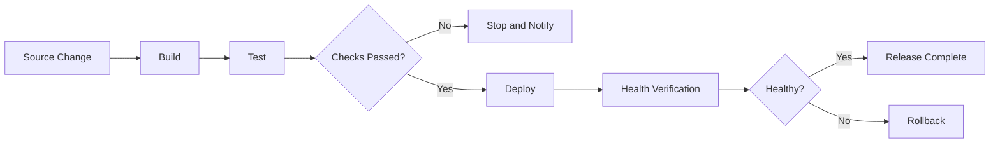

**Interview answer:** A CI/CD pipeline automates moving a code change from commit to a running environment: build produces an immutable artifact, test decides whether it is safe to proceed, and deploy releases that same tested artifact using a strategy such as rolling, blue-green, or canary. CI, continuous delivery, and continuous deployment differ only in how much of that path runs without a human — delivery stops at a manual approval before production, deployment does not. What makes it trustworthy in practice is gates that block on real signals, promoting one build artifact everywhere instead of rebuilding it per environment, and a rollback path that has actually been exercised rather than just documented.

**Gotcha:** Rebuilding the artifact separately for staging and production "to be safe." A rebuild between the two can pick up a newer dependency or base image, so the code that passed every test in staging is not byte-identical to what reaches production — build once, then promote and deploy that exact same artifact everywhere.

---

# 1. What Is a CI/CD Pipeline?

A **CI/CD pipeline** is an automated workflow that takes a software change from source code to a running environment. A typical pipeline pushes the code, compiles or packages the application, runs automated checks and tests, creates a versioned artifact or Docker image, deploys it to an environment, and verifies application health.

The main purpose is to make software delivery:

- Repeatable
- Fast
- Testable
- Traceable
- Safer than manual deployment

Without a pipeline, deployment knowledge often lives in shell history, local machines, or manual checklists. With a pipeline, the release process becomes code that can be reviewed and repeated.

---

# 2. CI, Continuous Delivery, and Continuous Deployment

These terms are related but not identical.

## 2.1 Continuous Integration — CI

**Continuous Integration** means developers merge small code changes frequently, and every change is automatically validated: `Commit → Build → Test → Feedback`.

Typical CI activities include:

- Installing dependencies
- Compiling code
- Running linting and formatting checks
- Running unit and integration tests
- Performing security scans
- Building an application artifact or Docker image

The primary goal of CI is to detect integration problems early.

## 2.2 Continuous Delivery

**Continuous Delivery** means the application is always kept in a deployable state, but production deployment may require a manual approval: `Commit → Build → Test → Staging → Manual Approval → Production`.

This approach is common when:

- Production changes require business approval
- The organization has compliance requirements
- Releases must happen during approved deployment windows
- A release manager controls production promotion

## 2.3 Continuous Deployment

**Continuous Deployment** automatically deploys every change that passes all required checks: `Commit → Build → Test → Production`.

There is no manual approval gate. This requires strong automated tests, observability, safe rollout methods, and reliable rollback.

## 2.4 Quick Comparison

| Concept | What is automated? | Production approval |
|---|---|---|
| Continuous Integration | Build and validation | Not applicable |
| Continuous Delivery | Build, test, and release preparation | Usually manual |
| Continuous Deployment | Build, test, and production deployment | Automatic |

---

# 3. The Core Pipeline: Build → Test → Deploy

The simplest useful pipeline contains three logical stages — build, test, and deploy — with a gate after each of the first two: a failed test stops the pipeline, and a failed post-deploy health check triggers a rollback instead of completing the release.

## 3.1 Build

The build stage converts source code into a deployable output.

Examples:

- Java source → JAR file
- TypeScript source → JavaScript bundle
- Python application → packaged wheel or Docker image
- React source → static production files
- Application source → Docker/OCI image

## 3.2 Test

The test stage checks whether the change is safe enough to move forward.

Examples:

- Unit tests
- Integration tests
- API tests
- Static analysis
- Dependency scanning
- Container vulnerability scanning

## 3.3 Deploy

The deploy stage releases the validated artifact into an environment.

Examples:

- Push static files to Amazon S3
- Update an Amazon ECS service
- Update a Kubernetes deployment in Amazon EKS
- Publish a Lambda function version
- Install an application revision on EC2 instances

---

# 4. Important CI/CD Building Blocks

A pipeline is more than three commands. Several supporting concepts make it reliable.

## 4.1 Trigger

A trigger starts the pipeline.

Common triggers are:

- Push to a branch
- Pull request creation or update
- Git tag creation
- Manual execution
- Scheduled execution
- Another pipeline or workflow
- External webhook event

A common setup is:

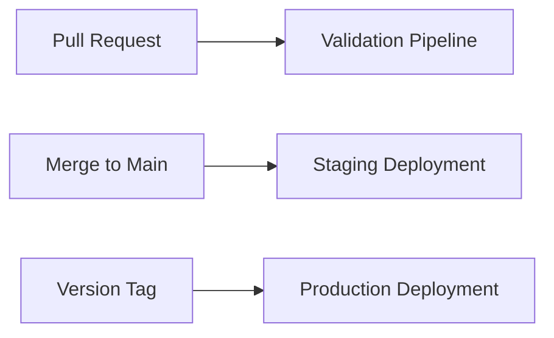

## 4.2 Pipeline Vocabulary

| Term | Meaning |
|---|---|
| **Stage** | A logical section of the pipeline — Build, Test, Staging, Approval, Production — containing one or more jobs that run sequentially or in parallel. |
| **Job** | A group of related steps executed on the same runner or build environment, e.g. `unit-tests`, `integration-tests`, `build-image`, `deploy-staging`. |
| **Step** | A single command or reusable action inside a job, e.g. `checkout-source`, `install-dependencies`, `run-tests`, `build-image`. |
| **Runner (build agent)** | The machine or container that executes a job — managed by GitHub Actions, GitLab, or another CI provider; an AWS CodeBuild environment; a self-hosted EC2 instance; or a Kubernetes-based runner. A clean, temporary runner improves repeatability because the build cannot depend on undeclared software from a developer machine. |
| **Environment** | A deployment target with its own configuration (`Development → Test → Staging → Production`). Application code should remain the same; environment-specific values should come from configuration, parameter stores, secrets, or deployment manifests. |

## 4.3 Artifact

An **artifact** is the immutable output produced by a build.

Examples:

- `.jar`, `.war`, `.zip`, or `.whl` file
- Frontend build directory
- Test report
- Infrastructure plan
- Docker image

The same tested artifact should be promoted across environments instead of rebuilding it separately for staging and production — build once, test once, promote that same artifact.

## 4.4 Gate

A gate controls whether execution may continue.

Examples:

- All tests must pass
- No critical vulnerability is allowed
- Code coverage must be at least 80%
- Manual production approval is required
- CloudWatch alarms must remain healthy

---

# 5. Build Stage

The build stage creates the output that later stages will validate and deploy.

## 5.1 Typical Build Flow

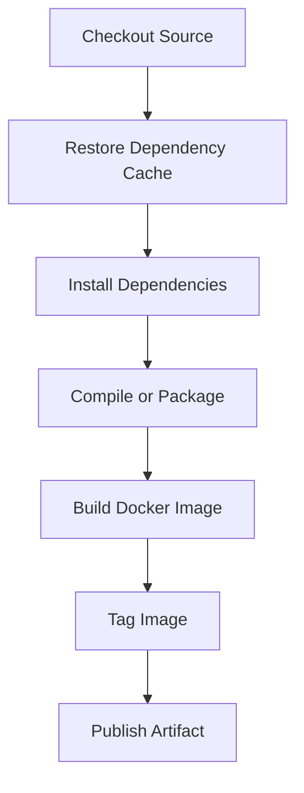

## 5.2 Build Responsibilities

A well-designed build stage normally handles:

1. Source checkout
2. Dependency installation
3. Compilation or packaging
4. Artifact generation
5. Artifact versioning
6. Publishing to an artifact repository or container registry

## 5.3 Artifact Versioning

Every artifact should be traceable to its source revision, using an image tag such as `api:1.8.0`, `api:git-a7c31e2`, or `api:release-2026-07-30`. Avoid depending only on the `latest` tag because it does not clearly identify the deployed code — a practical approach combines a human-readable tag (`1.8.0`), an immutable tag (the Git commit SHA), and a deployment reference (the image digest).

## 5.4 Reproducible Builds

The same commit should produce functionally equivalent output whenever it is built.

Use:

- Locked dependency versions
- Fixed base image versions or digests, e.g. `FROM python:3.13.5-slim`
- Versioned build tools
- Clean build environments
- Explicit build commands

For stronger immutability, pin the base image by digest after establishing an update process.

## 5.5 Build Cache

Caching can reduce pipeline duration significantly.

Commonly cached data:

- Python package downloads
- npm package cache
- Maven or Gradle dependencies
- Docker BuildKit layers

Cache only reusable inputs. Do not allow cache data to become the source of truth for the release artifact.

---

# 6. Test Stage

The test stage should give fast and trustworthy feedback.

## 6.1 Test Pyramid in CI/CD

```text
              ┌───────────────┐
              │ End-to-End    │  Few, slower, high confidence
              ├───────────────┤
              │ Integration   │  API, database, service behavior
              ├───────────────┤
              │ Unit Tests    │  Many, fast, isolated
              └───────────────┘
```

A pipeline normally runs fast tests first. Expensive tests run only after basic validation succeeds — `Lint → Unit Tests → Integration Tests → End-to-End Tests`.

## 6.2 Common Quality Checks

### Static Checks

- Linting
- Formatting verification
- Type checking
- Static code analysis

### Automated Tests

- Unit tests
- Integration tests
- Contract tests
- API tests
- End-to-end tests
- Smoke tests

### Security Checks

- Dependency vulnerability scanning
- Secret scanning
- Static application security testing
- Container image scanning
- Infrastructure-as-code scanning

## 6.3 Parallel Testing

Independent tests can run in parallel.

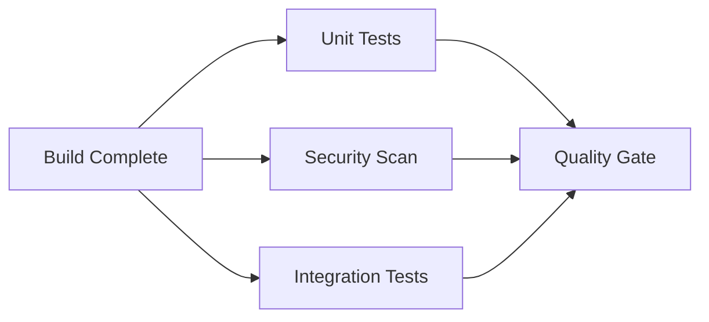

This reduces total pipeline duration, but the next stage must wait for all required jobs.

## 6.4 Test Reports

Pipeline systems should retain useful outputs such as:

- JUnit XML reports
- Code coverage reports
- Browser screenshots
- Playwright traces
- Security scan reports
- Application logs from failed tests

A failed pipeline should explain what failed, not only display a red status.

## 6.5 Flaky Tests

A flaky test passes and fails without a relevant code change. Flaky tests reduce trust in the pipeline.

A reasonable policy is:

- Record and investigate flaky behavior
- Temporarily isolate a known flaky test if required
- Do not use unlimited automatic retries
- Fix the root cause

Retries can hide real problems, so they should be limited and observable.

---

# 7. Deploy Stage

Deployment changes the state of a runtime environment.

## 7.1 Deployment Inputs

A deployment normally needs:

- An immutable artifact or image
- Environment configuration
- Credentials or a temporary cloud identity
- Deployment manifest or infrastructure definition
- Health-check rules
- Rollback strategy

## 7.2 Typical Deployment Flow

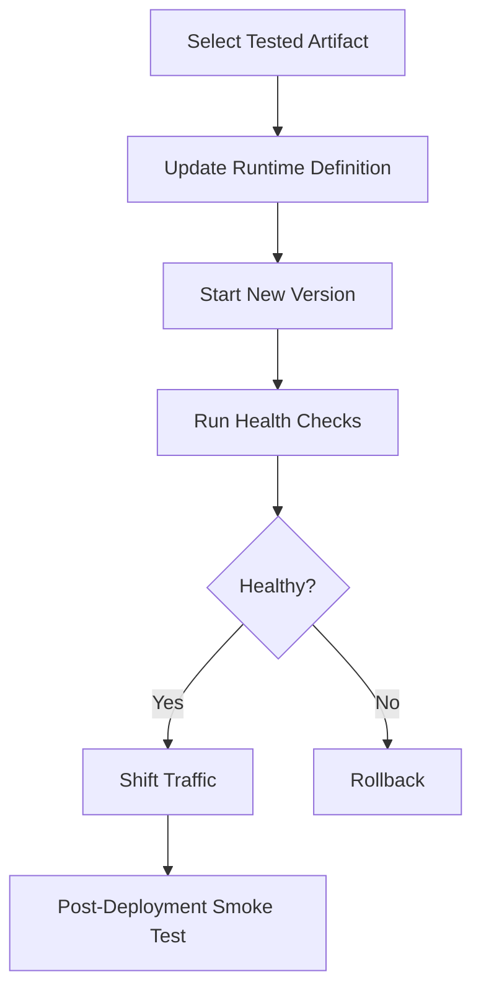

## 7.3 Health Checks

Deployment success should not mean that a command returned exit code `0`. The application must also be healthy.

Health checks may validate:

- Process is running
- Container is healthy
- HTTP health endpoint returns success
- Application can connect to required dependencies
- Error rate is below a threshold
- Latency remains acceptable

Useful endpoints are often separated: `/health/live` (is the process alive?) and `/health/ready` (can it receive traffic safely?).

## 7.4 Smoke Tests

Smoke tests run after deployment and validate a few critical journeys.

Examples:

- Login endpoint responds
- User can fetch a profile
- Basic database read succeeds
- A critical business API returns expected status

Smoke tests are not a replacement for the full test suite. They confirm that the deployed system works in the target environment.

---

# 8. Deployment Strategies

The deployment strategy controls how the new version replaces the old version.

## 8.1 Recreate Deployment

The old application is stopped before the new version starts.

```text
Old Version:  ████████ → OFF
New Version:             → ████████
```

Use it for non-critical internal systems or development environments.

## 8.2 Rolling Deployment

Instances or containers are replaced gradually.

| Step | Instance 1 | Instance 2 | Instance 3 | Instance 4 |
|---|---|---|---|---|
| Step 1 | Old | Old | Old | New |
| Step 2 | Old | Old | New | New |
| Step 3 | Old | New | New | New |
| Step 4 | New | New | New | New |

The application and database changes must remain compatible during the rollout.

## 8.3 Blue/Green Deployment

Two complete environments are maintained:

- **Blue:** current production
- **Green:** new version

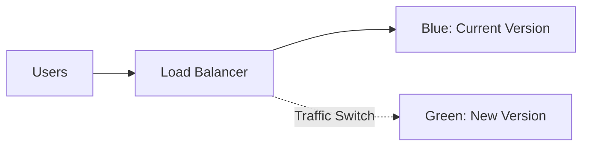

After validating green, traffic is switched from blue to green.

## 8.4 Canary Deployment

A small percentage of traffic is sent to the new version first, with metrics monitored at each step.

| Stage | Old | New |
|---|---|---|
| Initial | 95% | 5% |
| Next | 75% | 25% |
| Next | 50% | 50% |
| Final | 0% | 100% |

## 8.5 Comparing the Strategies

The four strategies above trade safety, speed, and infrastructure cost differently:

| Strategy | Advantages | Trade-offs |
|---|---|---|
| Recreate | Simple, low infrastructure cost | Usually causes downtime |
| Rolling | Lower additional infrastructure cost, usually no complete outage | Old and new versions run together temporarily; rollback may take time |
| Blue/Green | Fast rollback by switching traffic back, strong isolation between versions | Requires temporary duplicate capacity; database compatibility still matters |
| Canary | Limits the impact of defects, tests the new version using real traffic | Requires traffic splitting and strong observability; both versions must work safely at once |

## 8.6 Feature Flags

Feature flags separate **deployment** from **feature release**.

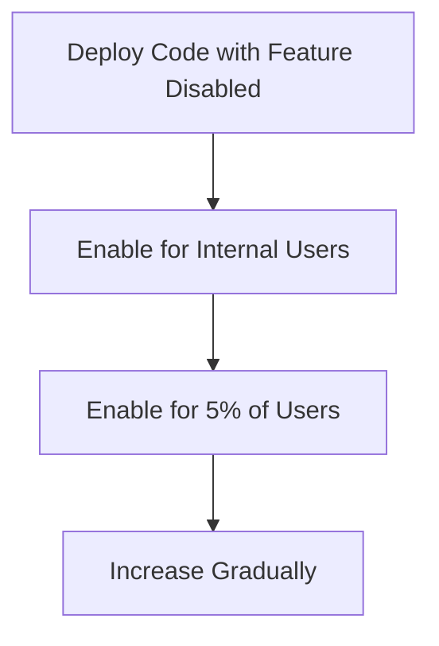

This allows a team to deploy code safely without immediately exposing the feature to everyone.

---

# 9. Environment Promotion

A mature pipeline promotes an artifact through multiple environments.

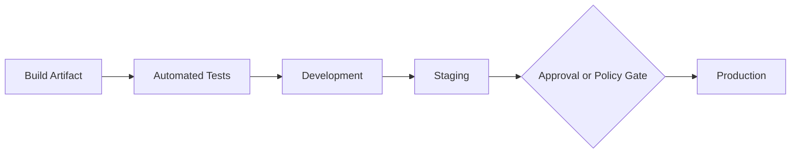

## 9.1 Build Once, Promote Many

Do not rebuild the application separately for every environment. A bad flow builds for staging, tests, then rebuilds for production before deploying; the preferred flow builds once, tests that artifact, deploys the same artifact to staging, then promotes it to production. A rebuild can introduce differences caused by dependency updates, base image changes, or build configuration.

## 9.2 Configuration Per Environment

Keep environment-specific settings outside the image.

Examples:

- Database URL
- Log level
- Feature flag configuration
- External API endpoint
- Secrets

Use services such as:

- AWS Systems Manager Parameter Store
- AWS Secrets Manager
- Runtime environment variables
- Kubernetes ConfigMaps and Secrets

## 9.3 Approval Gates

Production deployment may require approval after staging verification. The approval should apply to a specific artifact version — for example, approve image digest `sha256:abc...` for production — not simply to the current branch state.

---

# 10. Docker in a CI/CD Pipeline

Docker creates a consistent application package containing the application and its runtime dependencies. Layers, cache invalidation and multi-stage builds are covered in depth in [Docker Images & Builds](docker-images-builds.md).

## 10.1 Docker Pipeline Flow

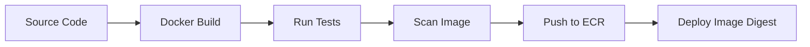

## 10.2 Multi-Stage Dockerfile Example

The build stage contains build tools. The runtime stage contains only what is required to run the application.

```dockerfile
# ---------- Build stage ----------
FROM python:3.13-slim AS builder

WORKDIR /app

COPY requirements.txt .
RUN pip install --no-cache-dir --prefix=/install -r requirements.txt

# ---------- Runtime stage ----------
FROM python:3.13-slim AS runtime

ENV PYTHONDONTWRITEBYTECODE=1 \
    PYTHONUNBUFFERED=1

WORKDIR /app

COPY --from=builder /install /usr/local
COPY . .

RUN useradd --create-home appuser
USER appuser

EXPOSE 8000

CMD ["gunicorn", "app.main:app", "-k", "uvicorn.workers.UvicornWorker", "--bind", "0.0.0.0:8000"]
```

Benefits:

- Smaller final image
- Fewer unnecessary tools in production
- Reduced attack surface
- Clear separation between build and runtime dependencies

## 10.3 Docker Layer Cache

Place stable instructions before frequently changing instructions:

```dockerfile
# Better: the dependency layer stays cached across builds
COPY requirements.txt .
RUN pip install -r requirements.txt
COPY . .

# Worse: any source-code change invalidates the dependency layer below it
COPY . .
RUN pip install -r requirements.txt
```

## 10.4 Image Tags and Digests

Tags can be changed to point to another image; digests identify exact image content — for example, tag `api:1.8.0` versus digest `api@sha256:4d1c...`. Use tags for readability and digests for exact deployment identity when practical.

## 10.5 Image Scanning

Scan the final image before production deployment.

A practical policy may be:

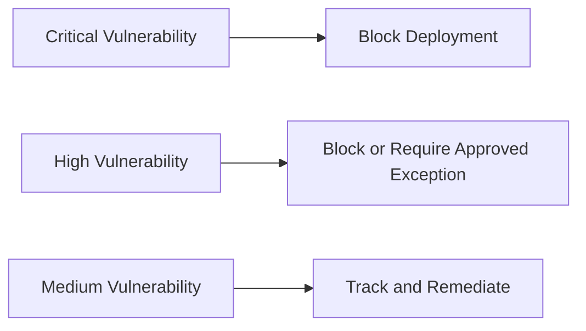

The policy should account for whether the vulnerable package is used, whether a fix is available, and the risk of the target environment.

---

# 11. CI/CD on AWS

AWS provides managed services for different pipeline responsibilities. Each service is introduced in [AWS Core Services](aws-core-services.md).

## 11.1 Main AWS Services

| Pipeline need | AWS service | Purpose |
|---|---|---|
| Pipeline orchestration | AWS CodePipeline | Connects source, build, test, approval, and deployment actions |
| Build and test | AWS CodeBuild | Runs commands in managed build environments using a build specification |
| Container registry | Amazon ECR | Stores Docker and OCI images |
| EC2/ECS/Lambda deployment | AWS CodeDeploy | Automates supported deployment workflows and traffic shifting |
| Container runtime | Amazon ECS | Runs and manages containerized applications |
| Kubernetes runtime | Amazon EKS | Managed Kubernetes control plane |
| Serverless runtime | AWS Lambda | Runs functions without managing servers |
| Infrastructure as code | AWS CloudFormation / AWS CDK | Creates and updates infrastructure |
| Secrets | AWS Secrets Manager | Stores and rotates secrets |
| Configuration | Systems Manager Parameter Store | Stores hierarchical configuration values |
| Monitoring | Amazon CloudWatch | Metrics, logs, alarms, and dashboards |
| Events | Amazon EventBridge | Reacts to pipeline, scan, and deployment events |

## 11.2 AWS CodePipeline Concepts

A CodePipeline pipeline contains stages, and each stage contains actions.

```text
Pipeline
├── Source Stage
│   └── Source Action
├── Build Stage
│   ├── Build Action
│   └── Test Action
├── Approval Stage
│   └── Manual Approval Action
└── Deploy Stage
    └── Deploy Action
```

Common CodePipeline action categories include:

- Source
- Build
- Test
- Deploy
- Approval
- Invoke

## 11.3 AWS CodeBuild

CodeBuild downloads the source, starts a build environment, and executes commands defined in a `buildspec.yml` file or in the project configuration, using four phases: `install`, `pre_build`, `build`, and `post_build`.

## 11.4 Amazon ECR

Amazon ECR stores versioned container images.

Typical image flow:

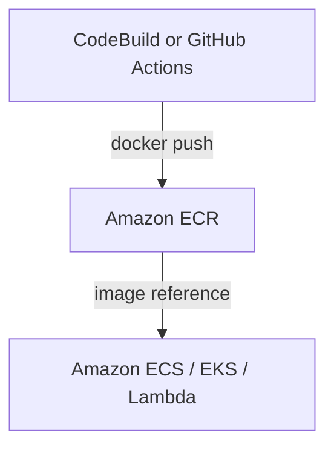

ECR can perform image vulnerability scanning. Enhanced scanning integrates with Amazon Inspector and can continuously update findings as new vulnerabilities are discovered.

## 11.5 Amazon ECS Deployment

For an ECS service, a pipeline normally:

1. Pushes the new image to ECR
2. Creates a new ECS task definition revision
3. Updates the ECS service
4. Starts new tasks
5. Checks task and load-balancer health
6. Stops old tasks after the new deployment becomes healthy

ECS rolling deployments can use a deployment circuit breaker to mark a failed deployment and automatically roll back to the last completed deployment.

---

# 12. Practical AWS + Docker Pipeline

Consider a FastAPI application deployed to Amazon ECS using AWS Fargate.

## 12.1 Architecture

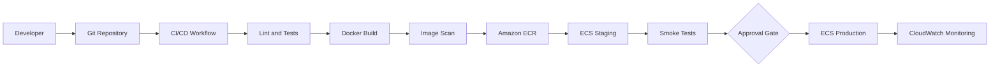

This covers the full path from a developer's push to production monitoring; the two pipelines below zoom into its pull-request and release-promotion edges.

## 12.2 Pull Request Pipeline

Runs when a pull request is opened or updated.

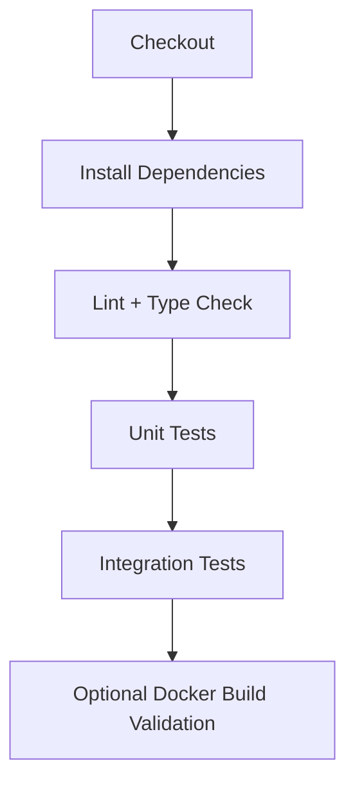

It should not deploy untrusted pull-request code to production.

## 12.3 Production Release Pipeline

Triggered by an approved release tag or manual promotion.

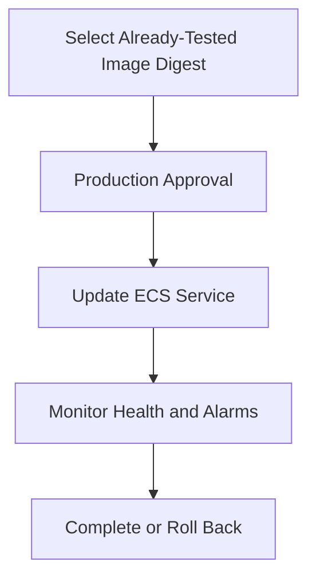

---

# 13. GitHub Actions Example: Docker to Amazon ECS

The following workflow demonstrates the important structure. Resource names and IAM configuration must be adapted for the project.

```yaml
name: Build, Test and Deploy

on:
  push:
    branches: [main]
  workflow_dispatch:

permissions:
  contents: read
  id-token: write

concurrency:
  group: production-deployment
  cancel-in-progress: false

env:
  AWS_REGION: ap-south-1
  ECR_REPOSITORY: interview-api
  ECS_CLUSTER: interview-cluster
  ECS_SERVICE: interview-api-service
  ECS_TASK_DEFINITION: infrastructure/ecs-task-definition.json
  CONTAINER_NAME: api

jobs:
  test:
    runs-on: ubuntu-latest

    steps:
      - name: Checkout source
        uses: actions/checkout@v4

      - name: Set up Python
        uses: actions/setup-python@v5
        with:
          python-version: "3.13"
          cache: pip

      - name: Install dependencies
        run: pip install -r requirements.txt -r requirements-dev.txt

      - name: Lint
        run: ruff check .

      - name: Run tests
        run: pytest --junitxml=test-results.xml --cov=app

      - name: Upload test report
        if: always()
        uses: actions/upload-artifact@v4
        with:
          name: test-results
          path: test-results.xml

  build-and-deploy:
    needs: test
    runs-on: ubuntu-latest
    environment: production

    steps:
      - name: Checkout source
        uses: actions/checkout@v4

      - name: Configure temporary AWS credentials through OIDC
        uses: aws-actions/configure-aws-credentials@v4
        with:
          role-to-assume: ${{ secrets.AWS_DEPLOY_ROLE_ARN }}
          aws-region: ${{ env.AWS_REGION }}

      - name: Log in to Amazon ECR
        id: login-ecr
        uses: aws-actions/amazon-ecr-login@v2

      - name: Build and push image
        id: build-image
        env:
          REGISTRY: ${{ steps.login-ecr.outputs.registry }}
          IMAGE_TAG: ${{ github.sha }}
        run: |
          IMAGE_URI="$REGISTRY/$ECR_REPOSITORY:$IMAGE_TAG"
          docker build --pull -t "$IMAGE_URI" .
          docker push "$IMAGE_URI"
          echo "image=$IMAGE_URI" >> "$GITHUB_OUTPUT"

      - name: Render task definition
        id: task-definition
        uses: aws-actions/amazon-ecs-render-task-definition@v1
        with:
          task-definition: ${{ env.ECS_TASK_DEFINITION }}
          container-name: ${{ env.CONTAINER_NAME }}
          image: ${{ steps.build-image.outputs.image }}

      - name: Deploy to Amazon ECS
        uses: aws-actions/amazon-ecs-deploy-task-definition@v2
        with:
          task-definition: ${{ steps.task-definition.outputs.task-definition }}
          service: ${{ env.ECS_SERVICE }}
          cluster: ${{ env.ECS_CLUSTER }}
          wait-for-service-stability: true
```

## 13.1 What This Workflow Demonstrates

- The test job must pass before deployment starts.
- The image is tagged with the Git commit SHA.
- AWS authentication uses temporary OIDC credentials rather than a long-lived access key.
- A GitHub environment can protect production with approval rules.
- `concurrency` prevents overlapping production deployments.
- The ECS deployment waits for service stability.

## 13.2 Recommended Production Improvements

Add the following according to project needs:

- Pin third-party actions to immutable commit SHAs
- Generate a software bill of materials
- Sign the container image
- Scan the pushed image and enforce a severity policy
- Deploy to staging before production
- Use an exact ECR image digest for promotion
- Add post-deployment smoke tests
- Connect CloudWatch alarms to rollback logic

---

# 14. AWS CodeBuild Example

CodeBuild commonly reads commands from `buildspec.yml` at the repository root.

```yaml
version: 0.2

env:
  variables:
    AWS_DEFAULT_REGION: ap-south-1
    ECR_REPOSITORY: interview-api

phases:
  install:
    runtime-versions:
      python: 3.13
    commands:
      - python --version
      - pip install -r requirements.txt -r requirements-dev.txt

  pre_build:
    commands:
      - ruff check .
      - pytest --junitxml=reports/test-results.xml --cov=app
      - ACCOUNT_ID=$(aws sts get-caller-identity --query Account --output text)
      - ECR_URI="$ACCOUNT_ID.dkr.ecr.$AWS_DEFAULT_REGION.amazonaws.com/$ECR_REPOSITORY"
      - IMAGE_TAG="${CODEBUILD_RESOLVED_SOURCE_VERSION:0:12}"
      - aws ecr get-login-password --region "$AWS_DEFAULT_REGION" | docker login --username AWS --password-stdin "$ACCOUNT_ID.dkr.ecr.$AWS_DEFAULT_REGION.amazonaws.com"

  build:
    commands:
      - docker build --pull -t "$ECR_URI:$IMAGE_TAG" .

  post_build:
    commands:
      - docker push "$ECR_URI:$IMAGE_TAG"
      - printf '[{"name":"api","imageUri":"%s"}]' "$ECR_URI:$IMAGE_TAG" > imagedefinitions.json

reports:
  pytest_reports:
    files:
      - reports/test-results.xml
    file-format: JUNITXML

artifacts:
  files:
    - imagedefinitions.json
```

## 14.1 Phase Meaning

| Phase | Typical use |
|---|---|
| `install` | Configure language runtime and install tools |
| `pre_build` | Authenticate, lint, and run tests |
| `build` | Compile or build the Docker image |
| `post_build` | Push artifacts and generate deployment metadata |

The `imagedefinitions.json` file can be passed to a later ECS deploy action in CodePipeline.

---

# 15. Database Migrations in CI/CD

Database migrations are one of the most sensitive deployment concerns.

## 15.1 Migration Challenges

During a rolling or canary deployment, old and new application versions may use the same database simultaneously, and a breaking schema change can make one version fail. For example: rename a database column, deploy the new application — the old containers still expect the old column, so requests fail during the rollout.

## 15.2 Expand-and-Contract Pattern

Use backward-compatible changes in separate releases.

```text
Release 1 — Expand
- Add the new column
- Keep the old column
- Application supports both

Release 2 — Migrate
- Backfill data
- Start reading from the new column

Release 3 — Contract
- Remove old application usage
- Remove the old column later
```

## 15.3 Migration Execution Options

A migration may run as:

- A dedicated pipeline job
- A one-time ECS task
- A Kubernetes Job
- A deployment hook

Avoid allowing every application replica to run the same migration during startup unless the migration tool provides reliable locking and the design intentionally supports it.

## 15.4 Rollback Limitation

Application rollback does not always reverse a database migration safely.

Prefer forward-compatible and forward-fix strategies for production databases. Destructive migrations should be delayed until the old application version is no longer needed.

---

# 16. Secrets and AWS Authentication

## 16.1 Never Store Secrets in Source Code

Do not commit:

- AWS access keys
- Database passwords
- API tokens
- Private keys
- `.env` files containing production secrets

Use a managed secret store and inject values only where required.

## 16.2 Prefer Short-Lived Credentials

For GitHub Actions to AWS, OpenID Connect can exchange the workflow identity for temporary AWS credentials.

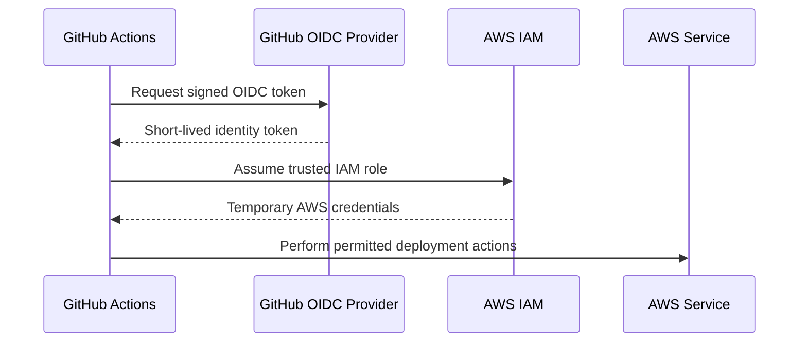

Benefits:

- No long-lived AWS key stored in GitHub
- Credentials expire automatically
- IAM trust can be restricted by repository, branch, or environment claims
- Permissions can follow least privilege

## 16.3 Separate Roles by Responsibility

Use different roles for different activities.

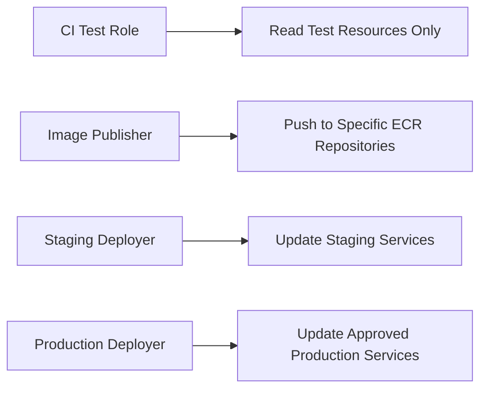

The build role should not automatically have administrator access.

---

# 17. Pipeline Security

CI/CD systems are part of the production security boundary because they can modify application code and infrastructure.

## 17.1 Least Privilege

Grant only the actions and resources required by each job.

For example, an ECS deploy role may need permission to:

- Register a task definition
- Update a specific ECS service
- Pass specific task roles
- Read the required ECR image

It should not receive unrestricted access to every AWS service.

## 17.2 Protect Production Environments

Use:

- Protected branches
- Required pull-request review
- Required status checks
- Environment approvals
- Restricted production deploy branches or tags
- Deployment concurrency controls

## 17.3 Protect Workflow Definitions

A change to the pipeline can be as powerful as a change to application code. Require review for paths such as `.github/workflows/**`, `buildspec.yml`, `Dockerfile`, and `infrastructure/**`, using repository ownership rules such as `CODEOWNERS` for sensitive paths.

## 17.4 Third-Party Actions and Dependencies

For stronger supply-chain security:

- Prefer trusted publishers
- Pin actions to an immutable commit SHA
- Review action source and permissions
- Keep dependencies updated
- Generate dependency and image inventories
- Scan build outputs

## 17.5 Untrusted Pull Requests

Pull requests from forks may contain malicious code. Do not expose production secrets or highly privileged credentials to untrusted code.

Separate pull-request validation from privileged deployment workflows.

---

# 18. Failure Handling and Rollback

A pipeline must define what happens when each stage fails.

## 18.1 Fail Fast

Run inexpensive checks early — `Formatting → Lint → Unit Tests → Integration Tests → Build → Deploy`. There is no benefit in starting an expensive deployment workflow when basic validation has already failed.

## 18.2 Rollback Options

| Option | How it works |
|---|---|
| Redeploy previous artifact | Store the last known good version and deploy it again — e.g. roll back from `api@sha256:new` to `api@sha256:previous-good`. |
| Blue/green traffic switch | Move traffic back to the blue environment. |
| ECS automatic rollback | Enable the ECS deployment circuit breaker with rollback, or use deployment alarms, so a failed rollout returns to the last completed deployment. |
| Feature flag disablement | If the issue is isolated to a new feature, disable it without rolling back the full deployment. |

## 18.3 Automatic vs Manual Rollback

Automatic rollback is useful when reliable signals exist, such as:

- New tasks cannot start
- Health checks fail
- Error rate crosses a defined threshold
- Latency exceeds a safe threshold

Manual rollback may be safer when:

- The failure signal is ambiguous
- Database changes make rollback risky
- Business data may be affected

## 18.4 Rollback Must Be Tested

A rollback procedure that has never been exercised is only an assumption.

Test rollback in staging and during controlled production exercises.

---

# 19. Pipeline Performance and Reliability

A slow pipeline encourages developers to batch changes or bypass checks.

## 19.1 Improve Pipeline Speed

Use:

- Dependency caching
- Docker layer caching
- Parallel jobs
- Test splitting
- Smaller build contexts
- Multi-stage Docker builds
- Conditional jobs for unaffected components
- Prebuilt, controlled build images

## 19.2 Avoid Unnecessary Rebuilds

In a monorepo, run only affected pipelines when practical.

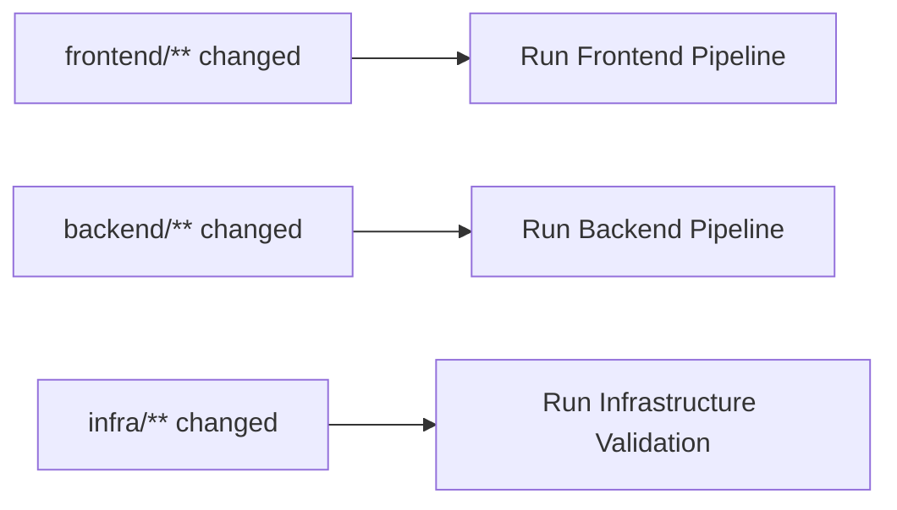

Shared changes should still trigger all dependent components.

## 19.3 Pipeline Concurrency

Multiple commits can create overlapping deployments. A production deployment should generally be serialized — a running deployment finishes before the next one starts, and later commits wait or cancel rather than racing it, to prevent conflicting updates.

For validation pipelines, canceling an older run after a newer commit arrives can save resources.

For production deployments, canceling an active deployment may be unsafe, so use a deliberate concurrency policy.

## 19.4 Retry Policy

Retry transient operations such as:

- Temporary network failure
- Rate limiting
- Registry timeout

Do not repeatedly retry deterministic failures such as:

- Compilation error
- Failed assertion
- Invalid configuration
- Missing file

Use bounded retries with backoff and clear logs.

---

# 20. Observability and Useful Metrics

The pipeline and deployed application should both be observable.

## 20.1 Pipeline Metrics

Useful measurements include:

| Metric | Meaning |
|---|---|
| Pipeline duration | Time from trigger to completion |
| Queue time | Time waiting for a runner |
| Success rate | Percentage of successful executions |
| Failure rate by stage | Where failures occur most often |
| Flaky test rate | Tests that fail inconsistently |
| Deployment frequency | How often production is released |
| Lead time for changes | Time from code change to production |
| Mean time to restore | Time to recover from a production failure |
| Change failure rate | Percentage of deployments causing failure or rollback |

The last four are commonly associated with software delivery performance.

## 20.2 Deployment Signals

Monitor after deployment:

- HTTP error rate
- Request latency
- CPU and memory
- Container restarts
- Failed health checks
- Queue backlog
- Database connection errors
- Business transaction success rate

## 20.3 Notifications

Send actionable notifications with:

- Pipeline name
- Failed stage and job
- Commit and author
- Artifact or image version
- Environment
- Direct link to logs
- Rollback status

Avoid sending alerts that only say “deployment failed” without context.

---

# 21. Common Pipeline Designs

## 21.1 Basic Team Pipeline

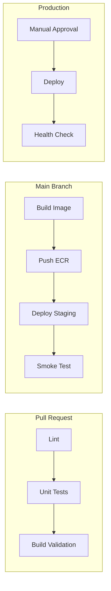

This is suitable for many small and medium application teams.

## 21.2 Mature Production Pipeline

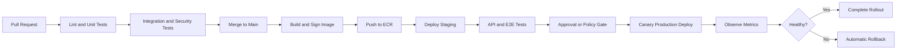

## 21.3 AWS-Native Pipeline

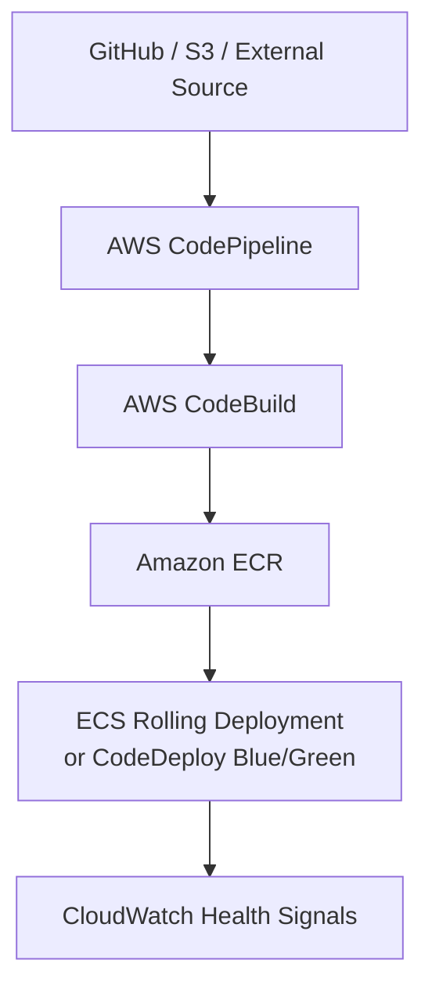

## 21.4 GitHub-Orchestrated AWS Pipeline

```mermaid
flowchart TD
    A[GitHub Actions] --> B[Test on Managed Runner]
    B --> C[Authenticate to AWS Using OIDC]
    C --> D[Build Docker Image]
    D --> E[Push Image to ECR]
    E --> F[Render ECS Task Definition]
    F --> G[Update ECS Service]
```

Both designs are valid. The choice depends on team familiarity, compliance, integration needs, cost, and operational ownership.

---

# 22. Key Interview Takeaways

A few principles that do not fit neatly into the bullets above:

- Keep changes small and integrate frequently.
- Keep environment configuration outside the artifact.
- Use short-lived cloud credentials and least-privilege roles.
- Separate untrusted pull-request validation from privileged deployment.
- Treat pipeline code as production code.

The CI boundary ends at an immutable artifact; everything after that is CD:

```mermaid
flowchart TD
    A[Code Change] --> CI
    subgraph CI[Continuous Integration]
        B[Build]
        C[Lint]
        D[Test]
        E[Scan]
    end
    CI --> F[Immutable Artifact]
    F --> CD
    subgraph CD["Continuous Delivery / Deployment"]
        G[Deploy to Staging]
        H[Verify]
        I[Approve or Automatically Promote]
        J[Deploy Safely to Production]
        K[Monitor and Roll Back When Required]
    end
```

---

# 23. References

The concepts and examples in this guide were reviewed against current official documentation:

- AWS CodePipeline concepts: <https://docs.aws.amazon.com/codepipeline/latest/userguide/concepts.html>
- AWS CodePipeline execution behavior: <https://docs.aws.amazon.com/codepipeline/latest/userguide/concepts-how-it-works.html>
- AWS CodeBuild build specification reference: <https://docs.aws.amazon.com/codebuild/latest/userguide/build-spec-ref.html>
- AWS CodeDeploy deployment configurations: <https://docs.aws.amazon.com/codedeploy/latest/userguide/deployment-configurations.html>
- Amazon ECS deployment circuit breaker: <https://docs.aws.amazon.com/AmazonECS/latest/developerguide/deployment-circuit-breaker.html>
- Amazon ECR image scanning: <https://docs.aws.amazon.com/AmazonECR/latest/userguide/image-scanning.html>
- Docker multi-stage builds: <https://docs.docker.com/build/building/multi-stage/>
- Docker build cache optimization: <https://docs.docker.com/build/cache/optimize/>
- GitHub Actions workflows: <https://docs.github.com/en/actions/concepts/workflows-and-actions/workflows>
- GitHub Actions deployments and environments: <https://docs.github.com/en/actions/reference/workflows-and-actions/deployments-and-environments>
- GitHub OIDC with AWS: <https://docs.github.com/actions/deployment/security-hardening-your-deployments/configuring-openid-connect-in-amazon-web-services>

---

> **Summary:** A strong CI/CD pipeline does not merely automate deployment. It creates a controlled path where every change is built consistently, tested at appropriate levels, released as an identifiable artifact, deployed through a safe strategy, and verified with real operational signals.
