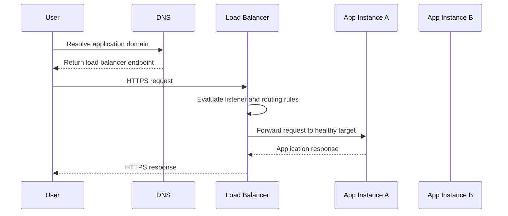
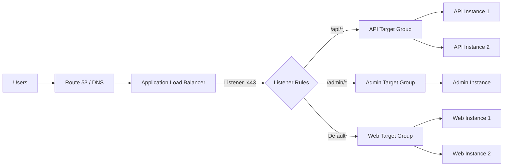
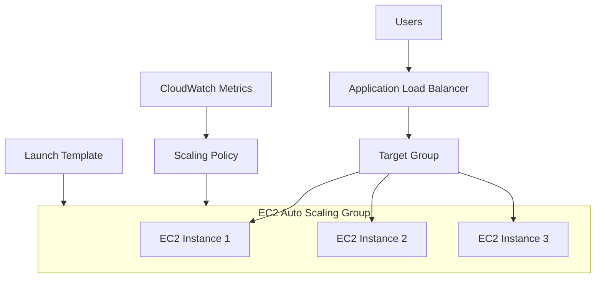
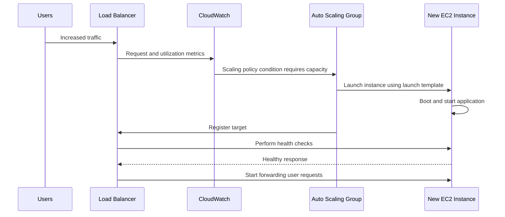
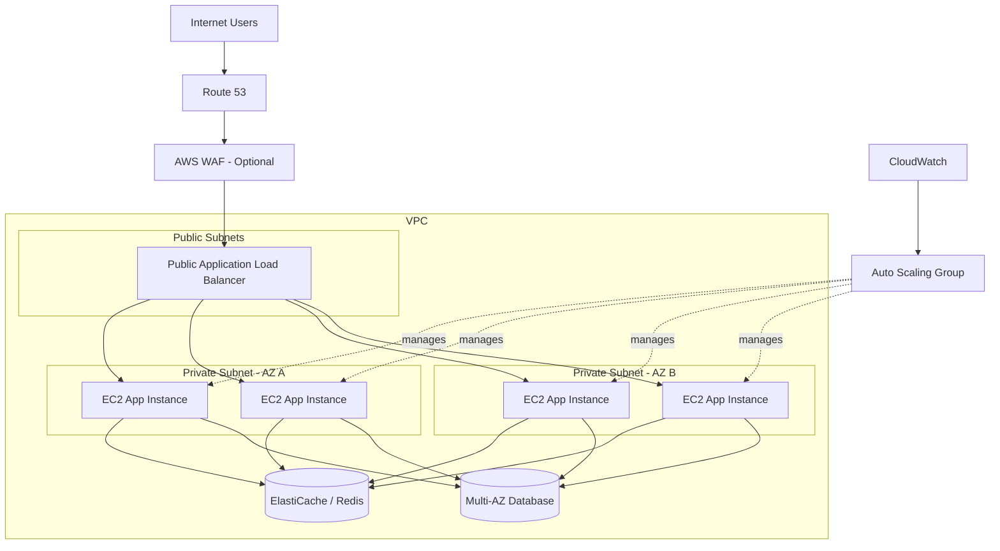
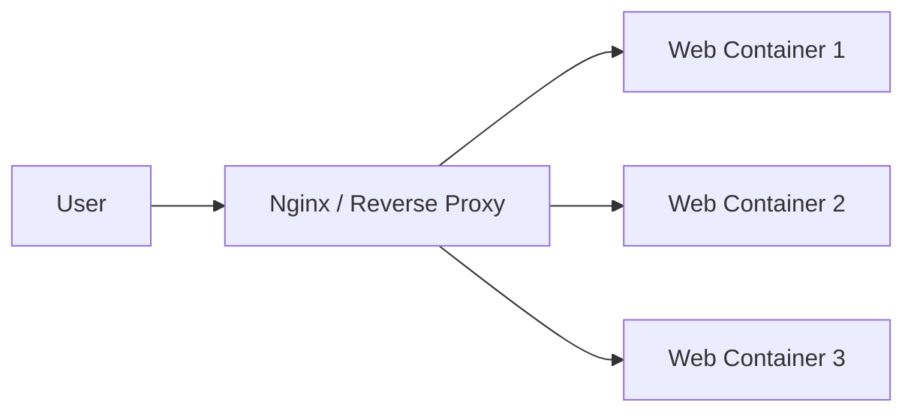
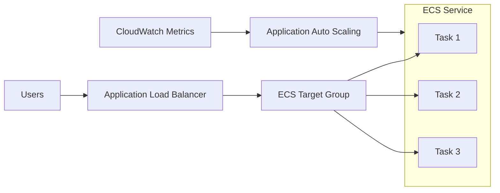

# Load Balancing and Auto Scaling — Basics

> **Category:** AWS, Docker & DevOps  
> **Level:** Intermediate developer (3+ years)  
> **Purpose:** Build a practical understanding of how production applications distribute traffic, remain available, and adjust capacity as demand changes.  
> **Last reviewed:** July 2026

---

## Learning Goals

By the end of this guide, you should be able to:

- Explain the difference between **load balancing** and **auto-scaling**.
- Understand how an AWS load balancer sends traffic to healthy targets.
- Select between **Application Load Balancer**, **Network Load Balancer**, and **Gateway Load Balancer**.
- Understand the structure and lifecycle of an **EC2 Auto Scaling Group**.
- Select a suitable scaling policy and metric.
- Design a basic highly available architecture across multiple Availability Zones.
- Understand how the same ideas apply to Docker containers and Amazon ECS.

---

# Index

## Main Sections

1. [The Big Picture](#1-the-big-picture)
2. [Load Balancing Fundamentals](#2-load-balancing-fundamentals)
3. [AWS Elastic Load Balancing](#3-aws-elastic-load-balancing)
4. [Auto-Scaling Fundamentals](#4-auto-scaling-fundamentals)
5. [Amazon EC2 Auto Scaling](#5-amazon-ec2-auto-scaling)
6. [Load Balancer and Auto Scaling Together](#6-load-balancer-and-auto-scaling-together)
7. [Practical AWS Architecture](#7-practical-aws-architecture)
8. [Scaling Policies and Metrics](#8-scaling-policies-and-metrics)
9. [Health Checks and Graceful Traffic Handling](#9-health-checks-and-graceful-traffic-handling)
10. [Docker and Container Scaling](#10-docker-and-container-scaling)
11. [Monitoring and Troubleshooting](#11-monitoring-and-troubleshooting)
12. [Cost and Capacity Planning](#12-cost-and-capacity-planning)
13. [Practical Design Scenarios](#13-practical-design-scenarios)
14. [Production Best Practices](#14-production-best-practices)
15. [Quick Revision Summary](#15-quick-revision-summary)
16. [Official References](#16-official-references)

---

# 1. The Big Picture

## 1.1 Why Applications Need Scaling

A single server has limited:

- CPU
- Memory
- Network bandwidth
- Disk throughput
- Maximum number of connections
- Availability

When traffic increases, one server may become slow or unavailable.

A production system usually solves this by running multiple application instances and placing a load balancer in front of them.

```text
Without scaling

Users ─────► One Server
                 │
                 ├── Limited capacity
                 ├── Single point of failure
                 └── Maintenance causes downtime
```

```text
With load balancing and auto-scaling

                    ┌──► Application Instance 1
Users ─► Load       ├──► Application Instance 2
         Balancer ──┼──► Application Instance 3
                    └──► New instances when required
```

---

## 1.2 Vertical Scaling vs Horizontal Scaling

### Vertical Scaling

Vertical scaling means increasing the capacity of one machine.

```text
2 vCPU, 4 GB RAM
        │
        ▼
8 vCPU, 32 GB RAM
```

Examples:

- Changing an EC2 instance from `t3.medium` to `m7i.2xlarge`
- Increasing database memory
- Adding more CPU to a virtual machine

### Horizontal Scaling

Horizontal scaling means adding more machines or containers.

```text
1 instance
    │
    ▼
4 instances
```

### Comparison

| Area | Vertical Scaling | Horizontal Scaling |
|---|---|---|
| Main action | Increase machine size | Add more machines |
| Downtime risk | May require restart | Usually supports gradual scaling |
| Maximum capacity | Limited by largest machine | Can grow across many instances |
| Application requirement | Can support stateful apps more easily | Works best with stateless apps |
| Fault tolerance | Still one machine unless replicated | Multiple instances improve availability |
| Cloud-native suitability | Moderate | High |

Most web applications use **horizontal scaling** for the application layer.

---

## 1.3 Scalability vs Availability vs Elasticity

These terms are related but not identical.

### Scalability

The system can handle more load by adding resources.

### Availability

The system remains accessible even when some components fail.

### Elasticity

The system automatically adds and removes resources based on demand.

```text
Load Balancer       → improves traffic distribution and availability
Auto Scaling        → improves elasticity and capacity management
Multiple AZs        → improves fault tolerance
Monitoring          → provides signals for scaling and recovery
```

---

# 2. Load Balancing Fundamentals

## 2.1 What Is a Load Balancer?

A load balancer is a component that receives client traffic and distributes it across multiple backend targets.

Targets may include:

- Virtual machines
- EC2 instances
- Docker containers
- ECS tasks
- Kubernetes pods
- IP addresses
- Lambda functions, in supported AWS configurations

The client communicates with one public endpoint, while the load balancer decides which healthy backend should process each request.

---

## 2.2 Main Responsibilities

A load balancer commonly performs the following work:

1. Accept client connections.
2. Select a backend target.
3. Forward the request.
4. Check target health.
5. Stop sending traffic to unhealthy targets.
6. Resume traffic when a target becomes healthy.
7. Terminate TLS/SSL when configured.
8. Apply routing rules.
9. Collect traffic and performance metrics.

---

## 2.3 Basic Request Flow



---

## 2.4 Layer 4 vs Layer 7 Load Balancing

The Open Systems Interconnection model is commonly used to describe the level at which a load balancer operates.

### Layer 4 — Transport Layer

Layer 4 routing uses connection information such as:

- Source IP
- Destination IP
- TCP or UDP port
- Protocol

The load balancer does not need to understand the HTTP URL or headers.

Typical use cases:

- TCP applications
- UDP workloads
- Very high-throughput services
- Low-latency network traffic
- TLS passthrough
- Gaming and streaming protocols

### Layer 7 — Application Layer

Layer 7 routing understands application-level details such as:

- HTTP method
- Host name
- URL path
- Headers
- Query parameters
- Cookies

Typical use cases:

- Web applications
- REST APIs
- Microservices
- Host-based routing
- Path-based routing
- Authentication integrations

### Comparison

| Area | Layer 4 | Layer 7 |
|---|---|---|
| Main information | IP, port and protocol | HTTP request details |
| Routing intelligence | Lower | Higher |
| HTTP path routing | No | Yes |
| Protocol examples | TCP, UDP, TLS | HTTP, HTTPS, gRPC |
| Typical AWS service | Network Load Balancer | Application Load Balancer |
| Performance overhead | Lower | Slightly higher due to request inspection |

---

## 2.5 Common Load-Balancing Algorithms

These are general industry algorithms. Managed cloud load balancers may choose or optimize their internal distribution behavior differently.

### Round Robin

Requests are distributed sequentially.

```text
Request 1 → Server A
Request 2 → Server B
Request 3 → Server C
Request 4 → Server A
```

Suitable when backend servers have similar capacity and requests require similar work.

### Least Connections

Traffic is sent to the server with the fewest active connections.

Suitable when request duration varies significantly.

### Weighted Distribution

More traffic is sent to servers with higher assigned weights.

```text
Server A weight: 70
Server B weight: 30
```

Useful during:

- Canary releases
- Blue/green deployments
- Gradual migration
- Mixed-capacity infrastructure

### Hash-Based Routing

A value such as client IP or session identifier is hashed to select a target.

Useful when the same client should generally reach the same backend.

---

## 2.6 Health Checks

The load balancer periodically sends a request to each registered target.

Example:

```http
GET /health HTTP/1.1
Host: app.internal
```

A healthy response may be:

```http
HTTP/1.1 200 OK
Content-Type: application/json

{"status": "healthy"}
```

The load balancer uses configurable values such as:

- Health-check protocol
- Health-check port
- Health-check path
- Check interval
- Timeout
- Healthy threshold
- Unhealthy threshold
- Expected status-code range

A failed health check should remove the target from traffic rotation, not necessarily destroy it immediately.

---

## 2.7 Sticky Sessions

Sticky sessions, also called **session affinity**, try to route a user to the same backend target for a period of time.

```text
User A → Server 1 → Server 1 → Server 1
User B → Server 2 → Server 2 → Server 2
```

Sticky sessions can be useful for legacy applications that keep session state in process memory.

However, they create challenges:

- Uneven traffic distribution
- Session loss when a target fails
- Difficult deployments
- Reduced scaling flexibility

A more scalable design stores shared session state in:

- Redis
- A database
- A signed client-side cookie
- An external session service

The application instances should ideally remain stateless.

---

## 2.8 TLS Termination

A load balancer can terminate HTTPS traffic.

```text
Client ──HTTPS──► Load Balancer ──HTTP or HTTPS──► Application
```

Benefits include:

- Central certificate management
- Reduced cryptographic work on application instances
- Consistent TLS policy
- Integration with AWS Certificate Manager
- Easier certificate rotation

For sensitive production systems, traffic from the load balancer to the target can also use HTTPS.

---

# 3. AWS Elastic Load Balancing

AWS Elastic Load Balancing distributes incoming traffic across healthy targets in one or more Availability Zones. The managed load balancer adjusts its own capacity as traffic changes.

AWS provides these current load-balancer families:

- Application Load Balancer
- Network Load Balancer
- Gateway Load Balancer
- Classic Load Balancer for legacy workloads

---

## 3.1 Core AWS Components

### Load Balancer

The managed entry point that accepts traffic.

### Listener

A listener checks for incoming connections on a configured protocol and port.

Examples:

```text
HTTP  : 80
HTTPS : 443
TCP   : 5432
TLS   : 443
```

### Listener Rule

A rule determines where traffic should be forwarded.

Example:

```text
IF path starts with /api/
THEN forward to API target group
```

### Target Group

A logical collection of backend targets.

Targets may include:

- EC2 instances
- IP addresses
- ECS tasks
- Lambda functions for supported ALB use cases
- Another ALB as an NLB target in a supported architecture

### Target

The actual backend application endpoint.

### Health Check

The mechanism used to determine whether a target can receive traffic.

---

## 3.2 Component Diagram



---

## 3.3 Application Load Balancer

An Application Load Balancer, or ALB, is designed mainly for HTTP and HTTPS workloads.

### Important Capabilities

- Layer 7 routing
- Host-based routing
- Path-based routing
- Header and query-string conditions
- HTTP-to-HTTPS redirects
- WebSocket support
- HTTP/2 support
- gRPC support
- TLS termination
- Target groups
- Integration with AWS WAF
- Authentication integration for supported identity providers
- Weighted forwarding between target groups

### Path-Based Routing Example

```text
/api/*       → API service
/images/*    → Image service
/admin/*     → Admin service
/*           → Frontend service
```

### Host-Based Routing Example

```text
api.example.com     → API target group
admin.example.com   → Admin target group
shop.example.com    → Store target group
```

### Suitable Workloads

- Websites
- REST APIs
- Django, FastAPI, Node.js and Java web applications
- ECS services
- Kubernetes ingress through an AWS integration
- Microservice applications

---

## 3.4 Network Load Balancer

A Network Load Balancer, or NLB, operates mainly at Layer 4.

### Important Capabilities

- TCP traffic
- UDP traffic
- TLS traffic
- Very high connection volume
- Low-latency routing
- Static IP support
- Elastic IP support for internet-facing configurations
- Preserving source IP in supported configurations
- AWS PrivateLink integration

### Suitable Workloads

- Non-HTTP protocols
- Real-time communication
- High-throughput TCP services
- Applications that require static IP addresses
- PrivateLink endpoint services
- TLS passthrough requirements

---

## 3.5 Gateway Load Balancer

A Gateway Load Balancer, or GWLB, is used to deploy and scale virtual network appliances.

Typical appliances include:

- Firewalls
- Intrusion detection systems
- Intrusion prevention systems
- Deep packet inspection appliances
- Network monitoring appliances

It is not normally used as the public HTTP entry point for a web application.

---

## 3.6 Classic Load Balancer

Classic Load Balancer is the previous-generation AWS load balancer.

For new applications, prefer:

- ALB for HTTP/HTTPS application traffic
- NLB for TCP/UDP/TLS traffic
- GWLB for network appliances

Use Classic Load Balancer mainly when maintaining a legacy architecture that specifically depends on it.

---

## 3.7 AWS Load Balancer Selection

| Requirement | Recommended Choice |
|---|---|
| HTTP or HTTPS web application | ALB |
| REST API with path routing | ALB |
| Multiple microservices behind one endpoint | ALB |
| gRPC service | ALB |
| TCP or UDP application | NLB |
| Static public IP requirement | NLB |
| Extremely high connection throughput | NLB |
| AWS PrivateLink provider service | NLB |
| Firewall or packet-inspection fleet | GWLB |
| Existing legacy integration | Possibly Classic Load Balancer |

---

## 3.8 Internet-Facing vs Internal Load Balancer

### Internet-Facing

Receives requests from clients over the internet.

```text
Internet → Public Load Balancer → Private Application Instances
```

The application targets do not need public IP addresses.

### Internal

Receives traffic only through private networking.

```text
Frontend Service → Internal Load Balancer → Backend Service
```

Typical uses:

- Internal APIs
- Service-to-service communication
- Administrative applications
- Private enterprise systems

---

## 3.9 Multi-AZ Deployment

A highly available load balancer should use subnets in at least two Availability Zones.

```text
                         ┌────────────────────────────┐
                         │ Application Load Balancer  │
                         └─────────────┬──────────────┘
                                       │
                   ┌───────────────────┴───────────────────┐
                   │                                       │
          Availability Zone A                     Availability Zone B
          ┌─────────────────┐                     ┌─────────────────┐
          │ App Instance A1 │                     │ App Instance B1 │
          │ App Instance A2 │                     │ App Instance B2 │
          └─────────────────┘                     └─────────────────┘
```

If one target or Availability Zone has a problem, healthy capacity in another zone can continue processing requests.

---

# 4. Auto-Scaling Fundamentals

## 4.1 What Is Auto-Scaling?

Auto-scaling automatically adjusts compute capacity according to workload demand or a predefined schedule.

```text
Low traffic  → remove unnecessary capacity
High traffic → add capacity
Failure      → replace unhealthy capacity
```

Auto-scaling has two major goals:

1. Maintain enough capacity to serve users reliably.
2. Avoid paying for unnecessary idle capacity.

---

## 4.2 Scale Out and Scale In

### Scale Out

Add more instances or containers.

```text
2 instances → 4 instances
```

Scale out when:

- CPU is consistently high
- Requests per target increase
- Queue length grows
- Latency rises due to capacity pressure
- A predictable traffic event is approaching

### Scale In

Remove instances or containers.

```text
4 instances → 2 instances
```

Scale in when:

- Traffic decreases
- Utilization remains below the target
- Scheduled peak time ends
- Extra capacity is no longer required

Scale-in decisions should be more conservative than scale-out decisions because removing capacity too quickly can create instability.

---

## 4.3 Reactive vs Proactive Scaling

### Reactive Scaling

Capacity changes after a metric shows that demand has changed.

Example:

```text
Average CPU > 65% → add instances
```

### Proactive Scaling

Capacity is added before expected demand arrives.

Example:

```text
Every weekday at 8:45 AM → increase desired capacity to 10
```

Predictive scaling also uses historical patterns to forecast future capacity requirements.

---

## 4.4 Desired Capacity Model

Most auto-scaling systems use three important limits.

```text
Minimum Capacity ≤ Desired Capacity ≤ Maximum Capacity
```

Example:

| Setting | Value | Meaning |
|---|---:|---|
| Minimum | 2 | Never run fewer than two instances |
| Desired | 4 | Current intended number of instances |
| Maximum | 12 | Never scale beyond twelve instances |

The desired value changes as scaling policies run.

---

# 5. Amazon EC2 Auto Scaling

## 5.1 What Is an Auto Scaling Group?

An Auto Scaling Group, or ASG, manages a group of EC2 instances as one logical capacity pool.

An ASG can:

- Launch instances
- Terminate instances
- Maintain minimum capacity
- Replace unhealthy instances
- Scale according to CloudWatch metrics
- Scale according to a schedule
- Distribute instances across Availability Zones
- Register instances with load-balancer target groups

---

## 5.2 Main Components

### Launch Template

Defines how new EC2 instances should be created.

A launch template commonly includes:

- AMI
- Instance type
- Security groups
- IAM instance profile
- Storage
- SSH key, when required
- User data
- Network configuration
- Instance tags
- Purchase options

### Auto Scaling Group

Defines:

- Minimum capacity
- Desired capacity
- Maximum capacity
- Availability Zones or subnets
- Target groups
- Health-check settings
- Scaling policies
- Instance maintenance behavior
- Termination policies

### Scaling Policy

Defines when and how desired capacity should change.

### CloudWatch Metric

Provides the data used for scaling decisions.

---

## 5.3 Basic EC2 Auto Scaling Architecture



---

## 5.4 Instance Lifecycle

A simplified instance lifecycle is:

```text
Launch
  │
  ▼
Pending
  │
  ▼
InService
  │
  ├── Scale-in selected
  ├── Health check failure
  └── Manual termination
  │
  ▼
Terminating
  │
  ▼
Terminated
```

Lifecycle hooks can pause selected transitions so that custom work can run.

Examples:

- Install or warm application data before serving traffic
- Download configuration
- Register with an external monitoring system
- Finish in-progress work before termination
- Upload final logs

---

## 5.5 Health-Check Types

### EC2 Health Check

Detects infrastructure-level problems reported by EC2.

Examples:

- Host failure
- Instance failure
- System status-check failure

### Elastic Load Balancing Health Check

Detects whether the application target is healthy from the load balancer's perspective.

Examples:

- Application process stopped
- Health endpoint returns `500`
- Application port is not accepting traffic
- Dependency check fails

For an ASG behind a load balancer, enabling load-balancer health checks allows unhealthy application instances to be replaced, not merely removed from traffic.

---

## 5.6 Automatic Replacement

Suppose the desired capacity is three.

```text
Desired capacity: 3
Running healthy:  3
```

One instance becomes unhealthy.

```text
Running healthy:  2
Unhealthy:        1
```

The ASG can terminate the unhealthy instance and launch a replacement.

```text
Running healthy:  3
```

This is self-healing behavior, even when no traffic-based scale-out is required.

---

# 6. Load Balancer and Auto Scaling Together

## 6.1 Different Responsibilities

| Component | Primary Responsibility |
|---|---|
| Load Balancer | Distribute incoming traffic |
| Target Group | Maintain the set of traffic destinations |
| Health Check | Decide which targets can receive traffic |
| Auto Scaling Group | Maintain and adjust EC2 capacity |
| Scaling Policy | Decide when capacity should change |
| CloudWatch | Collect metrics and trigger scaling logic |

A load balancer does not normally launch EC2 instances.

An Auto Scaling Group does not decide which individual request should go to which instance.

They work together.

---

## 6.2 Scale-Out Flow



---

## 6.3 Scale-In Flow

```text
1. Workload decreases.
2. Scaling policy reduces desired capacity.
3. ASG selects an instance for termination.
4. Target is deregistered from the target group.
5. Load balancer stops sending new requests to that target.
6. Existing requests are allowed to finish during the configured drain period.
7. Instance shuts down and is terminated.
```

This graceful process helps avoid dropping active requests.

---

## 6.4 Dynamic Registration

When the ASG launches an instance:

1. The instance starts from the launch template.
2. The application starts.
3. The ASG registers the instance with the target group.
4. The load balancer performs health checks.
5. Only after the target becomes healthy does it receive traffic.

When an instance is terminated, it is deregistered automatically.

---

# 7. Practical AWS Architecture

## 7.1 Typical Highly Available Web Application



---

## 7.2 Network Placement

A common setup is:

### Public Subnets

- Internet-facing load balancer
- NAT Gateway, when private instances require outbound internet access

### Private Subnets

- Application EC2 instances
- ECS tasks
- Internal services
- Databases
- Caches

The application instances usually do not need public IP addresses.

---

## 7.3 Security-Group Flow

A clean security-group relationship is:

```text
Internet
   │
   │ HTTPS 443
   ▼
ALB Security Group
   │
   │ Application port, allowed only from ALB security group
   ▼
Application Security Group
   │
   │ Database port, allowed only from application security group
   ▼
Database Security Group
```

Example:

| Security Group | Inbound Rule |
|---|---|
| ALB SG | TCP 443 from approved internet sources |
| App SG | TCP 8000 from ALB SG |
| DB SG | TCP 5432 from App SG |

Avoid opening the application port directly to the whole internet when the application should only receive traffic through the load balancer.

---

## 7.4 Stateless Application Design

Horizontal scaling works best when every instance can handle any request.

Avoid storing important runtime state only on one instance.

### Avoid

```text
User session → local process memory
Uploaded file → local container filesystem
Scheduled task lock → local variable
```

### Prefer

```text
User session → Redis or signed cookie
Uploaded file → Amazon S3
Persistent data → Database
Task queue → SQS, RabbitMQ or managed queue
Shared cache → ElastiCache
```

---

## 7.5 Example Health Endpoint

A lightweight FastAPI health endpoint:

```python
from fastapi import FastAPI, Response, status

app = FastAPI()


@app.get("/health")
async def health_check(response: Response) -> dict[str, str]:
    application_ready = True

    if not application_ready:
        response.status_code = status.HTTP_503_SERVICE_UNAVAILABLE
        return {"status": "unhealthy"}

    return {"status": "healthy"}
```

A Django example:

```python
from django.http import JsonResponse


def health_check(request):
    return JsonResponse({"status": "healthy"}, status=200)
```

The endpoint should be fast and predictable. Do not perform a large business workflow during every health check.

---

# 8. Scaling Policies and Metrics

## 8.1 Target Tracking Scaling

Target tracking tries to keep a selected metric near a target value.

Example:

```text
Keep average ASG CPU utilization near 50%.
```

Behavior:

```text
Current CPU = 78% → scale out
Current CPU = 25% → eventually scale in
Current CPU = 51% → maintain capacity
```

This is usually the best starting point because it behaves similarly to a thermostat.

### Common Target Metrics

- Average CPU utilization
- Application Load Balancer request count per target
- Custom CloudWatch metric
- Average ECS service CPU
- Average ECS service memory

---

## 8.2 Step Scaling

Step scaling changes capacity by different amounts depending on how far a metric is from its threshold.

Example:

| CPU Level | Action |
|---|---|
| 60% to 70% | Add 1 instance |
| 70% to 85% | Add 2 instances |
| Above 85% | Add 4 instances |

Step scaling is useful when you understand workload behavior and need more direct control.

---

## 8.3 Simple Scaling

Simple scaling performs one scaling adjustment and then waits for a cooldown period.

It is easier to understand but less flexible than target tracking or step scaling.

For most modern EC2 Auto Scaling use cases, begin with target tracking unless a specific requirement calls for another policy.

---

## 8.4 Scheduled Scaling

Scheduled scaling changes capacity at known times.

Example:

```text
Monday–Friday at 8:30 AM:
Minimum = 6
Desired = 8

Monday–Friday at 8:00 PM:
Minimum = 2
Desired = 2
```

Suitable for:

- Office-hour applications
- Planned campaigns
- Payroll processing
- Daily batch workloads
- Known sale events
- Scheduled examinations or registrations

Scheduled scaling does not react to unexpected traffic by itself. It is often combined with dynamic scaling.

---

## 8.5 Predictive Scaling

Predictive scaling analyzes historical patterns and forecasts required capacity.

Suitable when traffic has repeatable patterns such as:

- Daily peaks
- Weekly business cycles
- Regular media events
- Repeated batch workloads

Predictive and dynamic scaling can be combined:

```text
Predictive scaling → prepare capacity before demand
Dynamic scaling    → respond to unexpected changes
```

---

## 8.6 Selecting the Correct Metric

A useful scaling metric should generally change in proportion to the workload.

### CPU Utilization

Good when:

- Requests are CPU-intensive
- All instances have similar capacity
- CPU pressure closely represents workload

Weak when:

- Application waits mainly on external APIs
- Work is memory-bound
- Traffic is mostly I/O-bound
- CPU remains low while latency increases

### Request Count Per Target

Good when:

- Each request requires similar work
- Application runs behind an ALB
- You know approximately how many requests one target can process

Example:

```text
Safe capacity per target: 1,000 requests/minute
Target value:             700 requests/minute
```

This leaves operational headroom.

### Queue Depth

Good for asynchronous workers.

Example metric:

```text
Messages available / active workers
```

If 10,000 messages exist but only two workers are running, CPU may not immediately show the true backlog. Queue depth is more directly connected to the work waiting to be processed.

### Latency

Latency is useful for alerting, but it may be a difficult primary scaling metric because it can increase for reasons unrelated to compute capacity.

Examples:

- Slow database
- Third-party API delay
- Lock contention
- Network issue

### Memory Utilization

Useful for memory-heavy applications, though EC2 memory metrics normally require an agent or custom metric because standard EC2 metrics do not provide operating-system memory utilization automatically.

### Business Metrics

Examples:

- Active video-processing jobs
- Documents waiting for OCR
- Orders waiting for validation
- Concurrent game sessions
- Number of active websocket connections

A business metric can be more accurate than CPU when it directly describes demand.

---

## 8.7 Metric Selection Guide

| Workload | Strong Starting Metric |
|---|---|
| CPU-heavy API | Average CPU |
| Standard web API | ALB request count per target |
| Async workers | Queue messages per worker |
| Memory-heavy service | Memory utilization |
| WebSocket service | Active connections |
| Scheduled batch job | Queue depth plus scheduled scaling |
| Predictable daily traffic | Predictive plus target tracking |
| Unpredictable public traffic | Target tracking with sufficient maximum capacity |

---

## 8.8 Instance Warmup

New instances require time to:

- Boot the operating system
- Run user data
- Pull application artifacts
- Start containers
- Connect to dependencies
- Warm caches
- Pass health checks

During warmup, the scaling system should avoid treating partially initialized capacity as fully available.

Measure actual startup time. Do not guess.

For container workloads, image size and image-pull time can materially affect scale-out speed.

---

## 8.9 Cooldown and Stabilization

Scaling systems need protection from rapid repeated changes.

Without stabilization:

```text
Scale out → metric falls → scale in → metric rises → scale out
```

This is called **thrashing** or **flapping**.

Useful controls include:

- Instance warmup
- Scaling cooldown
- Conservative scale-in
- Multiple evaluation periods
- Minimum capacity
- Appropriate health thresholds
- ECS scaling stabilization behavior
- Kubernetes stabilization windows in Kubernetes environments

Scale out quickly enough to protect users, but scale in carefully.

---

# 9. Health Checks and Graceful Traffic Handling

## 9.1 A Good Health Check

A production health endpoint should answer a clear question:

> Can this target safely receive traffic?

A useful design separates:

### Liveness

Is the process running?

```text
/live
```

### Readiness

Is the application ready to serve requests?

```text
/ready
```

The load balancer should normally use a readiness-style check.

---

## 9.2 Avoid Overloading the Health Endpoint

Do not make every health check perform:

- A full database report
- A third-party API call
- A large file operation
- A heavy cache rebuild
- Multiple slow dependency checks

A dependency failure should only fail readiness when the application truly cannot serve useful traffic without that dependency.

---

## 9.3 Deregistration Delay and Connection Draining

When a target is removed:

1. Stop sending new requests.
2. Allow active requests to complete.
3. Terminate the process after a grace period.

```text
New requests       → another healthy target
Existing requests  → allowed to finish
Target termination → after drain period
```

This is important for:

- File uploads
- Report generation requests
- Long API calls
- Streaming responses
- Graceful deployments

The application shutdown timeout should align with the load balancer's deregistration behavior and the orchestrator's termination grace period.

---

## 9.4 Slow Start

A newly healthy target may not immediately be ready for full traffic.

It may still be:

- Warming application caches
- Establishing database pools
- Loading machine-learning models
- Compiling templates
- Initializing runtime components

A gradual traffic ramp can protect such targets where the selected load-balancer configuration supports it.

---

## 9.5 Health Threshold Example

```text
Health-check interval:   15 seconds
Timeout:                  5 seconds
Healthy threshold:       2 checks
Unhealthy threshold:     3 checks
```

Approximate detection behavior:

```text
Healthy registration: around 30 seconds after successful checks
Unhealthy detection: up to around 45 seconds, plus timing variation
```

Choose values based on application recovery behavior and tolerance for false failures.

---

# 10. Docker and Container Scaling

## 10.1 Docker Does Not Automatically Mean Auto-Scaling

Docker packages and runs an application in containers.

Docker alone does not automatically provide:

- Multi-host scheduling
- Automatic scaling from metrics
- Cloud load balancing
- Cross-host service discovery
- Automatic node provisioning

Those capabilities come from an orchestrator or cloud platform such as:

- Amazon ECS
- Amazon EKS
- Kubernetes
- Docker Swarm
- Nomad
- A custom platform

---

## 10.2 Manual Docker Compose Scaling

A service can be scaled manually:

```bash
docker compose up -d --scale web=3
```

Example Compose service:

```yaml
services:
  web:
    build: .
    expose:
      - "8000"
    environment:
      APP_ENV: production
```

This creates multiple containers for the `web` service.

Important limitations:

- It is manual scaling, not metric-based auto-scaling.
- A fixed host-port mapping such as `8000:8000` cannot be reused by multiple containers on the same host.
- A reverse proxy or orchestrator is needed to distribute external traffic.
- Scaling only on one machine does not protect against that machine failing.

---

## 10.3 Local Reverse-Proxy Example



A simplified Nginx configuration:

```nginx
upstream web_backend {
    server web1:8000;
    server web2:8000;
    server web3:8000;
}

server {
    listen 80;

    location / {
        proxy_pass http://web_backend;
        proxy_set_header Host $host;
        proxy_set_header X-Forwarded-For $proxy_add_x_forwarded_for;
        proxy_set_header X-Forwarded-Proto $scheme;
    }
}
```

For dynamic container replicas, use service discovery or an orchestrator rather than maintaining backend addresses manually.

---

## 10.4 Docker Swarm

Docker Swarm supports replicated services and an ingress routing mesh.

Example:

```bash
docker service create \
  --name web \
  --replicas 3 \
  --publish published=80,target=8000 \
  my-web-image:latest
```

Manual scaling:

```bash
docker service scale web=6
```

Swarm distributes service tasks across nodes and can route published traffic to active service containers. An external load balancer can also be placed in front of the Swarm nodes.

Swarm service scaling is still based on desired replicas unless additional automation changes that desired count.

---

## 10.5 Amazon ECS with an Application Load Balancer

A common container architecture is:



The ECS service:

- Maintains the desired task count
- Replaces failed tasks
- Registers tasks with the load balancer
- Deregisters stopped tasks
- Can scale task count automatically

---

## 10.6 ECS Scaling Layers

For ECS on Fargate:

```text
Service Auto Scaling → changes number of ECS tasks
AWS Fargate          → provides underlying compute automatically
```

For ECS on EC2:

```text
Service Auto Scaling → changes number of ECS tasks
Cluster Auto Scaling → changes number of EC2 container instances
```

Both layers must have enough capacity.

Example failure:

```text
ECS wants 20 tasks
EC2 cluster has room for only 10
Result: remaining tasks stay pending
```

---

## 10.7 ECS Target-Tracking Example

Conceptual policy:

```text
Minimum tasks: 2
Maximum tasks: 20
Target metric: ECSServiceAverageCPUUtilization
Target value: 50%
```

Another useful metric for an ALB-backed service is:

```text
ALBRequestCountPerTarget
```

This scales based on the average request load handled by each target.

---

## 10.8 Kubernetes Equivalent

The equivalent concepts are:

| AWS / General Concept | Kubernetes Concept |
|---|---|
| Application replicas | Pods |
| Stable service endpoint | Service |
| HTTP routing entry point | Ingress or Gateway |
| Pod auto-scaling | Horizontal Pod Autoscaler |
| Node auto-scaling | Cluster Autoscaler or managed node auto-scaling |
| Health checks | Liveness, readiness and startup probes |
| Desired task count | Replica count |

Pod scaling and node scaling are different layers, similar to ECS service scaling and ECS cluster capacity scaling.

---

# 11. Monitoring and Troubleshooting

## 11.1 Important Load-Balancer Metrics

Useful CloudWatch metrics include:

- Request count
- Request count per target
- Target response time
- Healthy host count
- Unhealthy host count
- Target connection errors
- Load-balancer-generated HTTP errors
- Target-generated HTTP errors
- Active connections
- New connections
- Processed bytes

Metric names and availability depend on the load-balancer type.

---

## 11.2 Important Auto Scaling Metrics

Useful signals include:

- Number of instances in service
- Desired capacity
- Pending instances
- Terminating instances
- Average CPU utilization
- Network throughput
- Request count per target
- Custom business metrics
- Scaling activity failures

---

## 11.3 Logs to Collect

### Application Load Balancer

- Access logs
- Connection logs where applicable
- AWS WAF logs if WAF is enabled
- CloudTrail management events

### Application

- Request logs
- Error logs
- Startup logs
- Shutdown logs
- Health-check logs
- Correlation or request IDs

### Auto Scaling

- Scaling activity history
- Lifecycle hook status
- EC2 system logs
- User-data or cloud-init logs
- CloudWatch alarms

---

## 11.4 Common Symptom: Targets Stay Unhealthy

Check:

1. Is the application listening on the expected port?
2. Is it bound to `0.0.0.0`, not only `127.0.0.1`?
3. Does the target security group allow traffic from the load balancer security group?
4. Is the health-check path correct?
5. Does the health endpoint return an accepted status code?
6. Is the target group using the correct protocol?
7. Is the application startup slower than the health thresholds allow?
8. Is a dependency causing readiness to fail?
9. Are network ACLs blocking traffic?
10. Is the container port correctly mapped in ECS?

---

## 11.5 Common Symptom: Auto Scaling Does Not Launch Instances

Check:

- Maximum capacity has not already been reached
- Scaling policy is enabled
- CloudWatch metric has data
- Alarm state is correct
- Launch template is valid
- AMI is available
- Subnets have free IP addresses
- EC2 service quotas permit more instances
- IAM service-linked role is valid
- The selected instance type is available
- User-data failure is not causing immediate health-check replacement

---

## 11.6 Common Symptom: Auto Scaling Launches Too Late

Possible causes:

- Metric period is too long
- Too many alarm evaluation periods
- Instance startup is slow
- Docker image is too large
- User data performs lengthy installation
- Minimum capacity is too low
- Scaling metric does not reflect demand early enough
- Maximum capacity is too low
- No scheduled or predictive preparation exists for known peaks

Possible improvements:

- Bake dependencies into the AMI or container image
- Keep images smaller
- Increase minimum capacity
- Use request count or queue depth instead of delayed CPU signals
- Configure scheduled scaling for known events
- Load test to measure real startup and saturation points

---

## 11.7 Common Symptom: Frequent Scale-Out and Scale-In

Possible causes:

- Target value is too aggressive
- Scale-in is too fast
- Workload is highly bursty
- Warmup is incorrect
- Metric period is too short for the workload
- Health checks are unstable
- Minimum capacity is too low

Use a stable metric, appropriate warmup, and more conservative scale-in behavior.

---

# 12. Cost and Capacity Planning

## 12.1 Minimum Capacity Is a Reliability Decision

Setting minimum capacity to zero or one may save money, but can increase:

- Cold-start delay
- Risk during instance failure
- Deployment risk
- Impact of Availability Zone problems
- Recovery time

For a production multi-AZ web application, minimum capacity is commonly at least two, with capacity distributed across zones. The exact value depends on the workload's availability objective.

---

## 12.2 Maximum Capacity Is a Safety Boundary

Maximum capacity protects against:

- Unexpected cost growth
- Runaway scaling
- Downstream overload
- Account quota pressure

However, a maximum that is too low prevents the system from handling legitimate traffic.

Choose it using:

- Load-test results
- Per-instance capacity
- Traffic forecast
- Cost limit
- Database and dependency capacity
- EC2 service quotas

---

## 12.3 Capacity Formula

A simple starting estimate:

```text
Required instances =
Peak requests per second
────────────────────────────
Safe requests per second per instance
```

Example:

```text
Peak demand:                    2,400 requests/second
Safe capacity per instance:      300 requests/second

Required baseline capacity = 2,400 / 300 = 8 instances
```

Add headroom:

```text
8 × 1.25 = 10 instances
```

This formula is only useful when validated with realistic load testing.

---

## 12.4 Keep Dependency Capacity in Mind

Scaling the application tier may move the bottleneck elsewhere.

```text
More application instances
          │
          ▼
More database connections
More cache connections
More outbound API calls
More queue consumers
More log volume
```

Confirm that dependencies can support the maximum application capacity.

---

## 12.5 EC2 Purchase Options

An ASG can be designed around:

- On-Demand Instances
- Reserved capacity or Savings Plans for predictable baseline usage
- Spot Instances for interruptible capacity
- Mixed instance types

A common pattern is:

```text
Stable baseline → On-Demand or covered usage
Burst capacity  → mixture that may include Spot
```

Use Spot only when the application can tolerate interruptions and the scaling design maintains sufficient reliable capacity.

---

# 13. Practical Design Scenarios

## 13.1 Public REST API

### Requirements

- HTTPS
- Multiple API instances
- Path routing
- Automatic scale-out
- No server-side local sessions

### Design

```text
Route 53
   ↓
Application Load Balancer
   ↓
Target Group
   ↓
EC2 Auto Scaling Group across 2+ AZs
   ↓
RDS / ElastiCache / S3
```

### Scaling Metric

Start with:

- ALB request count per target, or
- Average CPU if CPU strongly represents request load

---

## 13.2 Background OCR Workers

### Requirements

- Documents enter a queue
- Workers process documents asynchronously
- Traffic is not direct HTTP traffic

### Design

```text
API → S3 + Queue → Worker Auto Scaling Group → Database
```

### Scaling Metric

Use queue backlog per worker instead of ALB request count.

```text
Backlog per worker =
Visible queue messages / running workers
```

A load balancer may not be needed for the worker tier.

---

## 13.3 WebSocket Application

### Requirements

- Long-lived connections
- Many concurrent users
- Graceful connection handling

### Design Considerations

- Choose an LB that supports the protocol and required behavior
- Scale on active connections or another workload-specific metric
- Use shared state or a message broker
- Configure long-enough idle timeouts
- Handle graceful termination carefully
- Avoid relying only on request rate

---

## 13.4 Predictable Office-Hour Application

### Traffic Pattern

```text
Low usage: 8 PM–8 AM
High usage: 9 AM–6 PM
```

### Policy Combination

```text
Scheduled scaling:
Increase minimum capacity before 9 AM
Reduce minimum capacity after 7 PM

Target tracking:
Respond to unexpected demand during the day
```

---

## 13.5 Flash Sale

### Requirements

- Large, known traffic event
- Sudden burst
- High business impact

### Approach

- Load test before the event
- Increase minimum capacity in advance
- Use scheduled scaling
- Keep dynamic scaling enabled
- Increase relevant service quotas
- Validate database capacity
- Use caching and CDN where appropriate
- Set a realistic maximum capacity
- Monitor errors, latency and saturation in real time

Do not rely only on reactive scaling when instances require several minutes to become ready.

---

# 14. Production Best Practices

## 14.1 Architecture

- Deploy application capacity across at least two Availability Zones.
- Keep application instances in private subnets when possible.
- Use a load balancer as the controlled application entry point.
- Make application instances stateless.
- Store files in object storage rather than local instance disks.
- Store sessions in a shared system when server-side sessions are required.

## 14.2 Load Balancer

- Use ALB for HTTP/HTTPS routing and NLB for transport-level requirements.
- Redirect HTTP to HTTPS.
- Manage certificates centrally.
- Use health checks that represent readiness.
- Configure deregistration delay for graceful shutdown.
- Review idle timeout for long-running connections.
- Protect public endpoints with appropriate network controls and AWS WAF where relevant.
- Enable and retain access logs according to operational and compliance needs.

## 14.3 Auto Scaling

- Define realistic minimum, desired and maximum capacity.
- Use a launch template as the repeatable instance definition.
- Start with target tracking for straightforward dynamic scaling.
- Use scheduled scaling for known traffic windows.
- Use predictive scaling where historical patterns are meaningful.
- Measure application warmup.
- Scale in more conservatively than scale out.
- Use lifecycle hooks when startup or shutdown requires controlled work.
- Test unhealthy-instance replacement.

## 14.4 Metrics

- Scale on a metric that is proportional to demand.
- Do not assume CPU is always the correct signal.
- Use queue depth for worker systems.
- Use requests per target for many ALB-backed APIs.
- Publish custom metrics when infrastructure metrics do not represent business workload.
- Set alarms for high latency, target errors, unhealthy hosts and failed scaling activities.

## 14.5 Deployment

- Make startup automated and repeatable.
- Avoid downloading large dependencies during every boot.
- Prefer prebuilt AMIs or container images.
- Ensure new instances pass readiness checks before receiving traffic.
- Use rolling, blue/green or canary deployment strategies.
- Confirm old targets drain before termination.

## 14.6 Testing

- Perform load testing with production-like request patterns.
- Test sudden traffic bursts.
- Test gradual traffic growth.
- Test instance failure.
- Test Availability Zone impact where practical.
- Test scale-out time from alarm to healthy target.
- Test scale-in while long-running requests are active.
- Verify the database and cache under maximum application capacity.

---

# 15. Quick Revision Summary

## Load Balancing

```text
Purpose:
Distribute traffic across healthy targets.

Key concepts:
Listener → Rule → Target Group → Target → Health Check
```

## Auto-Scaling

```text
Purpose:
Adjust compute capacity and replace unhealthy resources.

Key concepts:
Launch Template → Auto Scaling Group → Scaling Policy → Metric
```

## Combined Flow

```text
Users
  ↓
Load Balancer
  ↓
Healthy Targets
  ↓
Auto Scaling Group adds/removes capacity
  ↑
CloudWatch metrics and scaling policies
```

## AWS Selection

```text
ALB  → HTTP/HTTPS, Layer 7, path and host routing
NLB  → TCP/UDP/TLS, Layer 4, high throughput, static IP needs
GWLB → firewalls and virtual network appliances
```

## Scaling Policies

```text
Target tracking → keep a metric near a target
Step scaling    → different actions for different threshold ranges
Scheduled       → scale at known times
Predictive      → forecast repeating demand patterns
```

## Most Important Design Principle

> A load balancer distributes work among available targets. Auto-scaling changes how many targets are available. Reliable systems combine both with health checks, monitoring, multi-AZ deployment and stateless application design.

---

# 16. Official References

The following official documentation was used to verify the current AWS and Docker concepts in this guide:

1. [AWS — What is Elastic Load Balancing?](https://docs.aws.amazon.com/elasticloadbalancing/latest/userguide/what-is-load-balancing.html)
2. [AWS — Application Load Balancer](https://docs.aws.amazon.com/elasticloadbalancing/latest/application/introduction.html)
3. [AWS — Network Load Balancer](https://docs.aws.amazon.com/elasticloadbalancing/latest/network/introduction.html)
4. [AWS — Gateway Load Balancer](https://docs.aws.amazon.com/elasticloadbalancing/latest/gateway/introduction.html)
5. [AWS — EC2 Auto Scaling scaling methods](https://docs.aws.amazon.com/autoscaling/ec2/userguide/scaling-overview.html)
6. [AWS — Target tracking scaling policies](https://docs.aws.amazon.com/autoscaling/ec2/userguide/as-scaling-target-tracking.html)
7. [AWS — Step and simple scaling](https://docs.aws.amazon.com/autoscaling/ec2/userguide/as-scaling-simple-step.html)
8. [AWS — Scheduled scaling](https://docs.aws.amazon.com/autoscaling/ec2/userguide/ec2-auto-scaling-scheduled-scaling.html)
9. [AWS — Predictive scaling](https://docs.aws.amazon.com/autoscaling/ec2/userguide/predictive-scaling-policy-overview.html)
10. [AWS — ECS service load balancing](https://docs.aws.amazon.com/AmazonECS/latest/developerguide/service-load-balancing.html)
11. [AWS — ECS service auto scaling](https://docs.aws.amazon.com/AmazonECS/latest/developerguide/service-auto-scaling.html)
12. [Docker — Compose scaling](https://docs.docker.com/reference/cli/docker/compose/scale/)
13. [Docker — Swarm routing mesh](https://docs.docker.com/engine/swarm/ingress/)
14. [AWS Well-Architected — Use automation when obtaining or scaling resources](https://docs.aws.amazon.com/wellarchitected/latest/reliability-pillar/rel_adapt_to_changes_autoscale_adapt.html)

---

*End of guide.*
