# Load Balancing and Auto Scaling — Basics

> Understand how production applications distribute traffic, stay available during failures, and automatically adjust compute capacity as demand changes.

## Index

1. [Big Picture](#1-big-picture)
2. [Load Balancing Fundamentals](#2-load-balancing-fundamentals)
3. [AWS Elastic Load Balancing](#3-aws-elastic-load-balancing)
4. [EC2 Auto Scaling](#4-ec2-auto-scaling)
5. [Load Balancer + Auto Scaling Together](#5-load-balancer--auto-scaling-together)
6. [Scaling Policies and Metrics](#6-scaling-policies-and-metrics)
7. [Health Checks and Graceful Traffic Handling](#7-health-checks-and-graceful-traffic-handling)
8. [Containers: ECS and Kubernetes](#8-containers-ecs-and-kubernetes)
9. [Practical Production Example](#9-practical-production-example)
10. [Monitoring, Cost, and Best Practices](#10-monitoring-cost-and-best-practices)

## In Short

- **Vertical scaling** makes one machine bigger; **horizontal scaling** adds more machines. Web applications usually prefer horizontal scaling because it improves both capacity and fault tolerance.
- A **load balancer** decides **which healthy target** receives a request.
- **Auto Scaling** decides **how many compute instances** should exist.
- **ALB** is the normal choice for HTTP/HTTPS applications, REST APIs, microservices, WebSockets, and gRPC.
- **NLB** is used for TCP/UDP/TLS workloads, very high connection volume, low latency, static IP requirements, and PrivateLink.
- An **Auto Scaling Group (ASG)** maintains `minimum`, `desired`, and `maximum` capacity.
- For most normal workloads, start with **target tracking scaling**.
- A load balancer can remove an unhealthy target from traffic, but an ASG replaces an application-unhealthy EC2 instance only when **Elastic Load Balancing health checks are enabled for the ASG**.
- Horizontal scaling works best when application instances are **stateless**.

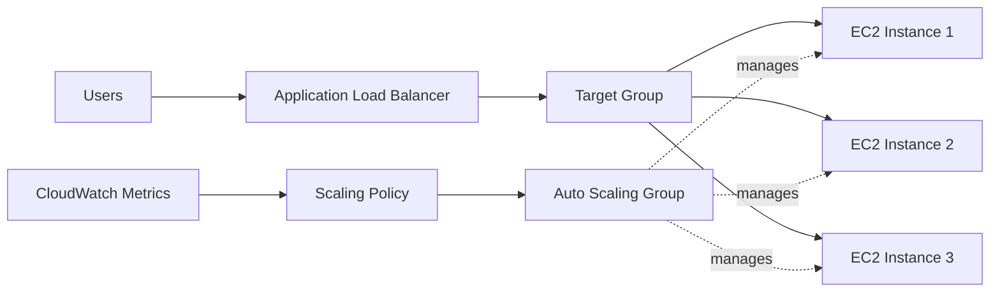

---

# 1. Big Picture

## 1.1 Why Scaling Is Needed

A single application server has limited:

- CPU
- Memory
- Network bandwidth
- Disk throughput
- Connection capacity
- Availability

It is also a **single point of failure**.

A common production design therefore runs multiple application instances behind a load balancer.

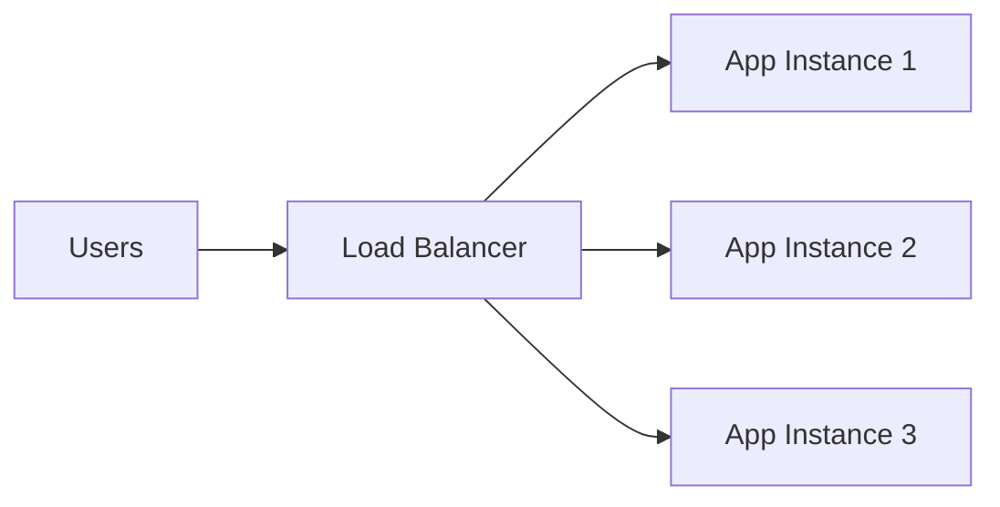

If one instance fails, traffic can continue to healthy instances. If demand increases, more instances can be added.

## 1.2 Vertical vs Horizontal Scaling

### Vertical Scaling

Increase the capacity of one machine.

```text
t3.medium → m7i.large → m7i.2xlarge
```

Useful when:

- The application is difficult to distribute.
- A database needs more CPU or memory.
- The workload is strongly stateful.

Main limitation: one machine still has a maximum size and may remain a single failure point.

### Horizontal Scaling

Add more machines or containers.

```text
2 instances → 4 instances → 8 instances
```

Useful for:

- Web APIs
- Microservices
- Background workers
- Containerized applications

### Comparison

| Area | Vertical Scaling | Horizontal Scaling |
|---|---|---|
| Main action | Increase machine size | Add more machines |
| Capacity limit | Limited by largest machine | Can grow across many nodes |
| Fault tolerance | Does not automatically improve it | Naturally supports redundancy |
| Application design | Easier for stateful apps | Best with stateless apps |
| Cloud-native use | Common for some data tiers | Preferred for app tiers |

## 1.3 Scalability, Availability, and Elasticity

These terms are related but different:

- **Scalability** — the system can handle more load by adding resources.
- **Availability** — the system remains accessible when components fail.
- **Elasticity** — resources automatically grow and shrink with demand.

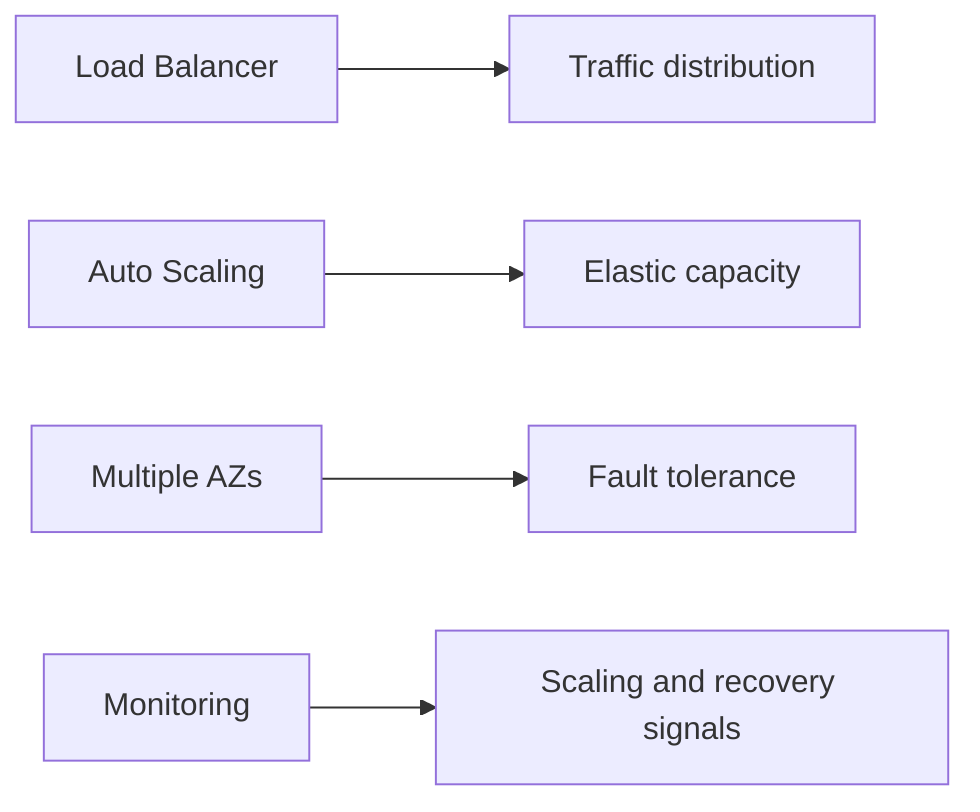

---

# 2. Load Balancing Fundamentals

## 2.1 What Is a Load Balancer?

A load balancer receives client traffic through one endpoint and distributes that traffic across multiple backend targets.

Typical targets include:

- EC2 instances
- ECS tasks
- Kubernetes workloads
- IP addresses
- Lambda functions in supported ALB configurations

The client does not need to know which application instance processes the request.

## 2.2 Basic Request Flow

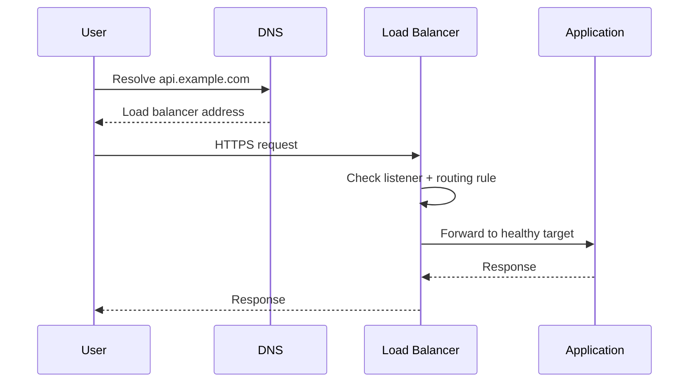

The load balancer normally performs:

1. Accept the connection.
2. Evaluate listener and routing rules.
3. Select a healthy target.
4. Forward the request.
5. Monitor target health.
6. Stop sending requests to unhealthy targets.
7. Optionally terminate TLS.
8. Publish metrics and logs.

## 2.3 Layer 4 vs Layer 7

### Layer 4 — Transport Layer

Works mainly with connection-level information such as:

- IP address
- Port
- TCP/UDP protocol

Typical workloads:

- TCP services
- UDP services
- TLS passthrough
- High-throughput network applications

AWS example: **Network Load Balancer (NLB)**.

### Layer 7 — Application Layer

Understands HTTP-level information such as:

- Host
- Path
- Headers
- Query string
- HTTP method

Typical workloads:

- Websites
- REST APIs
- Microservices
- gRPC
- HTTP routing

AWS example: **Application Load Balancer (ALB)**.

| Area | Layer 4 | Layer 7 |
|---|---|---|
| Main information | IP, port, protocol | HTTP request details |
| Path routing | No | Yes |
| Host routing | No | Yes |
| Typical AWS service | NLB | ALB |
| Common protocols | TCP, UDP, TLS | HTTP, HTTPS, gRPC |

## 2.4 Target Selection Algorithms

For general load-balancing concepts, common strategies include round robin, least-connections-style routing, weighted distribution, and hashing.

For **AWS ALB target groups**, the important routing algorithms are:

- `round_robin`
- `least_outstanding_requests`
- `weighted_random`

### Round Robin

Requests are spread across healthy targets in turn.

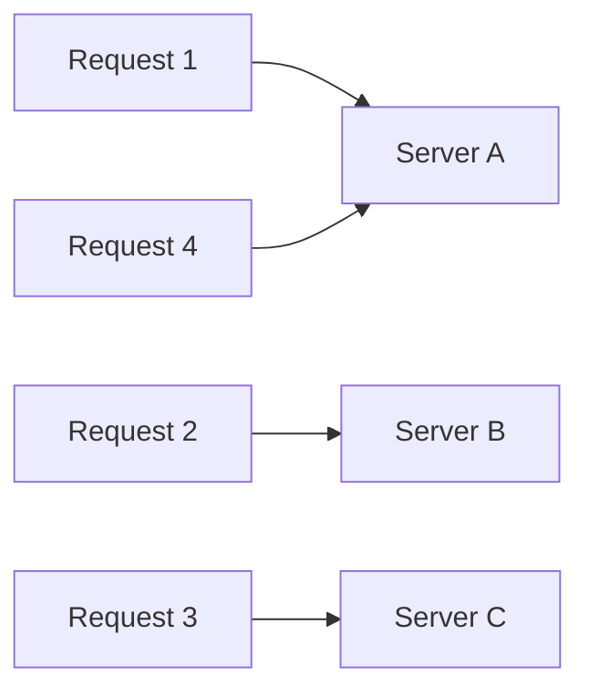

### Least Outstanding Requests

The request is sent to the target with the fewest requests currently in progress.

Useful when request processing time varies.

### Weighted Routing

At the listener-rule level, ALB can forward traffic across multiple target groups using weights.

Example:

```text
Target Group A = 90%
Target Group B = 10%
```

This is useful for:

- Canary deployment
- Blue/green deployment
- Gradual migration

## 2.5 Health Checks

A load balancer periodically checks registered targets.

Example:

```http
GET /ready HTTP/1.1
Host: app.internal
```

Expected result:

```http
HTTP/1.1 200 OK
```

Important health-check settings include:

- Protocol
- Port
- Path
- Interval
- Timeout
- Healthy threshold
- Unhealthy threshold
- Accepted status codes

A failed load-balancer health check removes the target from traffic. It does **not automatically mean the EC2 instance will be terminated**.

## 2.6 Sticky Sessions

Sticky sessions, or **session affinity**, try to send a user back to the same backend target.

```text
User A → Server 1 → Server 1 → Server 1
```

They can help older applications that keep session data in process memory, but they reduce scaling flexibility.

Prefer shared or client-side state where possible:

```text
Session state   → Redis / database / signed cookie
Uploaded files  → S3
Persistent data → Database
```

The application servers can then remain stateless.

## 2.7 TLS Termination

A load balancer can terminate HTTPS:

```text
Client --HTTPS--> Load Balancer --HTTP/HTTPS--> Application
```

Benefits:

- Central certificate management
- AWS Certificate Manager integration
- Consistent TLS policy
- Less certificate management on individual instances

For sensitive systems, traffic from the load balancer to the application can also use HTTPS.

---

# 3. AWS Elastic Load Balancing

AWS Elastic Load Balancing provides four load-balancer families:

- Application Load Balancer
- Network Load Balancer
- Gateway Load Balancer
- Classic Load Balancer for legacy workloads

## 3.1 Core Components

| Component | Purpose |
|---|---|
| Load Balancer | Managed traffic entry point |
| Listener | Accepts traffic on a protocol and port |
| Listener Rule | Decides what action to perform |
| Target Group | Logical collection of backend targets |
| Target | Actual backend endpoint |
| Health Check | Determines whether a target can receive traffic |

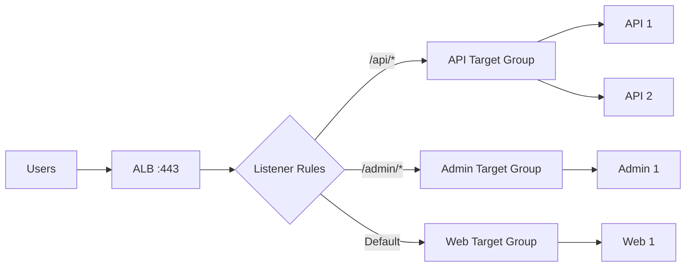

## 3.2 Application Load Balancer — ALB

ALB is the normal choice for HTTP/HTTPS applications.

Important capabilities:

- Layer 7 routing
- Host-based routing
- Path-based routing
- Header and query-string conditions
- HTTP → HTTPS redirects
- TLS termination
- WebSocket support
- HTTP/2 support
- gRPC support
- Weighted forwarding
- AWS WAF integration
- Authentication integrations
- Target groups and health checks

Example:

```text
api.example.com/*     → API target group
admin.example.com/*   → Admin target group
example.com/images/*  → Image target group
```

Use ALB for:

- Django
- FastAPI
- Node.js
- Java/Spring APIs
- ECS services
- Microservices
- Browser-facing web applications

## 3.3 Network Load Balancer — NLB

NLB is designed mainly for transport-level workloads.

Important capabilities:

- TCP
- UDP
- TLS
- High connection volume
- Low-latency routing
- Static IP addresses
- Elastic IP support for internet-facing configurations
- Source IP preservation in supported configurations
- AWS PrivateLink integration

Use NLB when the requirement is about **network protocol or connection behavior**, rather than HTTP routing.

## 3.4 Gateway Load Balancer — GWLB

GWLB is used for fleets of virtual network appliances such as:

- Firewalls
- Intrusion detection/prevention systems
- Deep packet inspection appliances
- Network monitoring appliances

It is not the normal public entry point for a REST API.

## 3.5 Classic Load Balancer — CLB

Classic Load Balancer is the previous-generation service.

For new systems, normally choose:

- ALB for HTTP/HTTPS
- NLB for TCP/UDP/TLS
- GWLB for network appliances

Use CLB mainly when maintaining a legacy architecture that already depends on it.

## 3.6 Quick Selection Guide

| Requirement | Choice |
|---|---|
| Web application | ALB |
| REST API | ALB |
| Path/host routing | ALB |
| gRPC | ALB |
| WebSockets | ALB |
| TCP/UDP service | NLB |
| Static public IP | NLB |
| PrivateLink provider service | NLB |
| Firewall appliance fleet | GWLB |
| Legacy integration | Possibly CLB |

## 3.7 Internet-Facing vs Internal

### Internet-Facing

```text
Internet → Public ALB/NLB → Private application targets
```

The backend EC2 instances usually do not need public IP addresses.

### Internal

```text
Frontend service → Internal ALB/NLB → Internal backend service
```

Used for:

- Internal APIs
- Service-to-service communication
- Enterprise systems
- Private administrative services

## 3.8 Multi-AZ Design

For high availability, deploy the application across multiple Availability Zones.

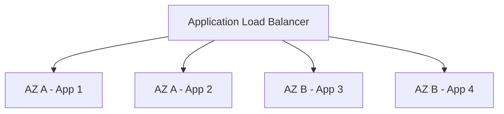

A failure in one instance—or even one Availability Zone—should not take down the entire application.

---

# 4. EC2 Auto Scaling

## 4.1 What Is an Auto Scaling Group?

An **Auto Scaling Group (ASG)** manages EC2 instances as one capacity pool.

It can:

- Launch instances
- Terminate instances
- Maintain minimum capacity
- Maintain desired capacity
- Enforce maximum capacity
- Replace unhealthy instances
- Distribute instances across Availability Zones
- Attach instances to load-balancer target groups
- Change capacity using scaling policies

## 4.2 Minimum, Desired, and Maximum

```text
Minimum Capacity ≤ Desired Capacity ≤ Maximum Capacity
```

Example:

| Setting | Value | Meaning |
|---|---:|---|
| Minimum | 2 | Never intentionally run below 2 |
| Desired | 4 | Current target capacity |
| Maximum | 10 | Do not scale above 10 |

Scaling policies normally change the **desired capacity** while respecting minimum and maximum boundaries.

## 4.3 Launch Template

A launch template describes how new instances should be created.

Common settings:

- AMI
- Instance type
- Security groups
- IAM instance profile
- Storage
- User data
- Network settings
- Tags
- Purchase options

The key idea is **repeatability**: every new instance should be created from the same controlled definition.

## 4.4 Scale Out vs Scale In

### Scale Out

Add capacity.

```text
2 instances → 4 instances
```

Typical signals:

- High CPU
- High requests per target
- Growing queue backlog
- Capacity-related latency
- Known upcoming traffic event

### Scale In

Remove unnecessary capacity.

```text
4 instances → 2 instances
```

Scale-in should usually be more conservative because removing capacity too quickly can cause flapping and user impact.

## 4.5 Health Checks and Replacement

By default, an ASG primarily uses EC2 health information.

That means this can happen:

```text
OS is running
Application process is broken
ALB marks target unhealthy
ASG still sees EC2 as healthy
```

To allow the ASG to react to load-balancer health, enable **Elastic Load Balancing health checks** on the ASG.

Then:

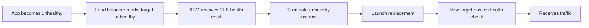

## 4.6 Instance Warmup and Health-Check Grace Period

A new instance needs time to:

- Boot
- Run user data
- Start containers/processes
- Establish connections
- Warm caches
- Pass health checks

Configure warmup and grace periods based on **measured startup time**, not guesswork.

If the grace period is too short, healthy-but-still-starting instances can be repeatedly replaced.

---

# 5. Load Balancer + Auto Scaling Together

These services solve different problems.

| Component | Main Responsibility |
|---|---|
| Load Balancer | Decide where each request goes |
| Target Group | Maintain traffic destinations |
| Health Check | Decide whether a target can receive traffic |
| Auto Scaling Group | Maintain the required number of instances |
| Scaling Policy | Decide when desired capacity changes |
| CloudWatch | Provide metrics and alarms |

## 5.1 Scale-Out Flow

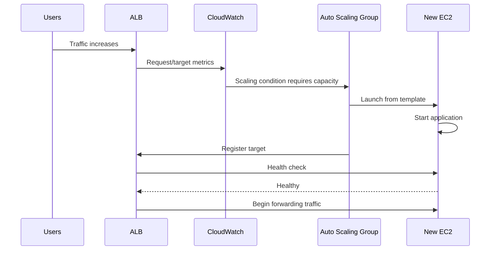

## 5.2 Scale-In Flow

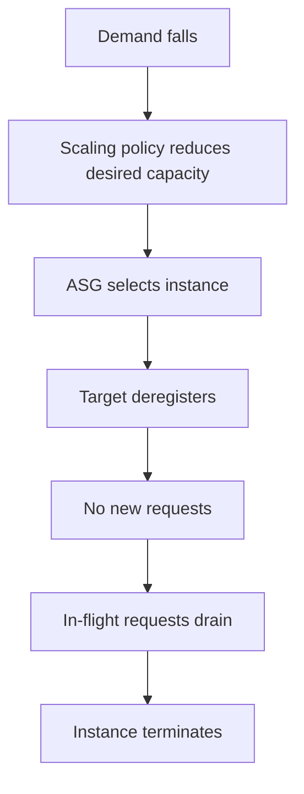

This is why **deregistration delay and graceful application shutdown** matter.

## 5.3 The Relationship to Remember

```text
Load Balancer → Which healthy target?

Auto Scaling → How many targets?
```

They meet through the **target group**.

---

# 6. Scaling Policies and Metrics

## 6.1 Target Tracking

Target tracking tries to keep a metric near a configured target value.

Example:

```text
Target average CPU = 50%
```

Conceptually:

```text
CPU too high → scale out
CPU near target → maintain
CPU well below target → eventually scale in
```

This is usually the best starting policy for normal EC2 Auto Scaling workloads.

Strong target-tracking metrics include:

- Average CPU utilization
- ALB request count per target
- Supported predefined metrics
- Custom CloudWatch metrics

## 6.2 Step Scaling

Step scaling changes capacity differently depending on how far a metric has crossed a threshold.

Example:

| CPU | Action |
|---|---|
| 60–70% | Add 1 instance |
| 70–85% | Add 2 instances |
| > 85% | Add 4 instances |

Use it when workload behavior is well understood and you need direct control.

## 6.3 Scheduled Scaling

Scheduled scaling changes capacity at known times.

Example:

```text
Weekdays 08:30 → desired = 8
Weekdays 20:00 → desired = 2
```

Useful for:

- Office-hour systems
- Planned campaigns
- Batch processing
- Known registrations/exams
- Predictable sales events

Scheduled scaling handles expected demand; dynamic scaling should still handle unexpected demand.

## 6.4 Predictive Scaling

Predictive scaling analyzes historical CloudWatch data to forecast future capacity requirements.

It is useful when traffic has repeatable patterns such as:

- Daily business-hour peaks
- Weekly usage cycles
- Regular processing windows

It is commonly combined with dynamic scaling:

```text
Predictive scaling → prepare capacity before expected demand
Target tracking    → react to unexpected demand
```

## 6.5 Choose a Metric That Represents Demand

CPU is not always the best metric.

### CPU

Good for CPU-heavy applications.

Weak when the application spends most of its time waiting on:

- Database I/O
- External APIs
- Network calls
- Locks

### Request Count Per Target

Strong for many ALB-backed APIs when request cost is reasonably consistent.

Example:

```text
Measured safe capacity = 1,000 requests/minute/instance
Scaling target         = 700 requests/minute/instance
```

The gap leaves operational headroom.

### Queue Backlog

Strong for asynchronous workers.

```text
Backlog per worker = queued messages / active workers
```

This usually describes worker demand better than HTTP metrics.

### Memory

Useful for memory-heavy services.

For EC2, operating-system memory utilization generally requires the CloudWatch agent or a custom metric.

### Business Metrics

Sometimes the best metric is application-specific:

- OCR jobs waiting
- Active WebSocket connections
- Video-processing jobs
- Orders awaiting processing
- Documents awaiting validation

## 6.6 Metric Selection Guide

| Workload | Good Starting Metric |
|---|---|
| CPU-heavy API | Average CPU |
| Standard ALB-backed API | Request count per target |
| Queue workers | Backlog per worker |
| Memory-heavy service | Memory utilization |
| WebSocket service | Active connections/custom metric |
| Predictable traffic | Predictive + target tracking |
| Known event | Scheduled + target tracking |

---

# 7. Health Checks and Graceful Traffic Handling

## 7.1 Liveness vs Readiness

A useful production design separates:

- **Liveness** — is the process alive?
- **Readiness** — can it safely receive traffic?

Example:

```text
/live   → process is running
/ready  → application is ready for real requests
```

The load balancer should normally use a readiness-style endpoint.

## 7.2 Keep Health Checks Lightweight

Avoid doing heavy work in every health request.

Do not make `/ready` perform:

- Large database queries
- Full reports
- Third-party API calls
- File processing
- Expensive cache rebuilds

Only fail readiness for a dependency when that dependency truly prevents the application from serving useful traffic.

## 7.3 FastAPI Example

```python
from fastapi import FastAPI, Response, status

app = FastAPI()

@app.get("/ready")
async def readiness(response: Response) -> dict[str, str]:
    application_ready = True

    if not application_ready:
        response.status_code = status.HTTP_503_SERVICE_UNAVAILABLE
        return {"status": "not-ready"}

    return {"status": "ready"}
```

The endpoint should be:

- Fast
- Stable
- Predictable
- Safe to call frequently

## 7.4 Deregistration Delay

When a target is removed:

1. Stop new requests from reaching it.
2. Allow existing requests to complete.
3. Shut down the application gracefully.
4. Terminate the instance or task.

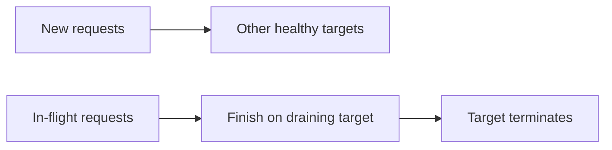

This is especially important for:

- File uploads
- Long-running API calls
- Streaming responses
- Report generation
- WebSockets

## 7.5 Avoid Scaling Flapping

Without stabilization:

```text
Scale out → metric drops → scale in → metric rises → scale out
```

Useful protections:

- Correct instance warmup
- Conservative scale-in
- Suitable evaluation periods
- Realistic minimum capacity
- Stable health thresholds
- Suitable cooldown/stabilization behavior

---

# 8. Containers: ECS and Kubernetes

## 8.1 Docker Is Not Auto Scaling

Docker packages and runs containers, but Docker alone does not provide production multi-host auto scaling.

For example:

```bash
docker compose up -d --scale web=3
```

This creates multiple containers, but:

- Scaling is manual.
- It is usually limited to one Docker host.
- External traffic still needs a reverse proxy/load balancer.
- Host failure can still take down all replicas.

Production auto scaling normally comes from an orchestrator or cloud platform.

## 8.2 ECS with ALB

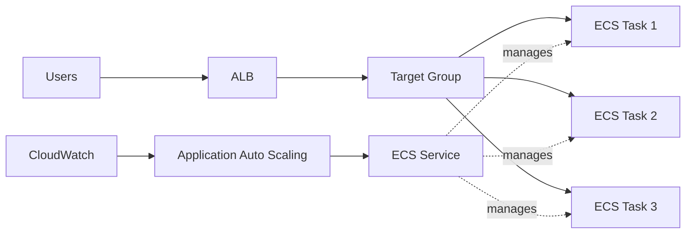

The ECS service can:

- Maintain desired task count
- Replace failed tasks
- Register/deregister tasks with the load balancer
- Scale task count using Application Auto Scaling

### ECS on Fargate

```text
Service Auto Scaling → number of ECS tasks
Fargate              → underlying compute managed by AWS
```

### ECS on EC2

```text
Service Auto Scaling → number of ECS tasks
Cluster capacity     → number/capacity of EC2 container instances
```

Both layers must have enough capacity.

## 8.3 Kubernetes Equivalent

| General / AWS Concept | Kubernetes |
|---|---|
| App replica | Pod |
| Stable service endpoint | Service |
| HTTP entry point | Ingress / Gateway |
| App auto scaling | Horizontal Pod Autoscaler |
| Node scaling | Cluster/node autoscaling |
| Health checking | Liveness/readiness/startup probes |
| Desired count | Replica count |

The important idea is the same: **application replica scaling and underlying machine scaling are different layers**.

---

# 9. Practical Production Example

Consider a FastAPI application that must:

- Serve HTTPS traffic
- Run across multiple Availability Zones
- Automatically scale
- Keep sessions out of local memory
- Store uploaded files safely
- Use PostgreSQL
- Remain available if one EC2 instance fails

## 9.1 Architecture

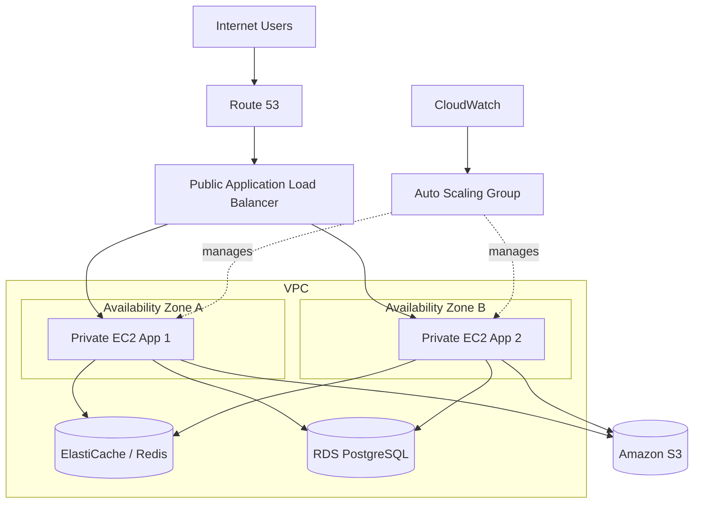

## 9.2 Network Placement

| Subnet | Typical Resources |
|---|---|
| Public | Internet-facing ALB, NAT Gateway if required |
| Private | Application EC2 instances, databases, caches |

Application EC2 instances normally do not need public IP addresses.

## 9.3 Security-Group Flow

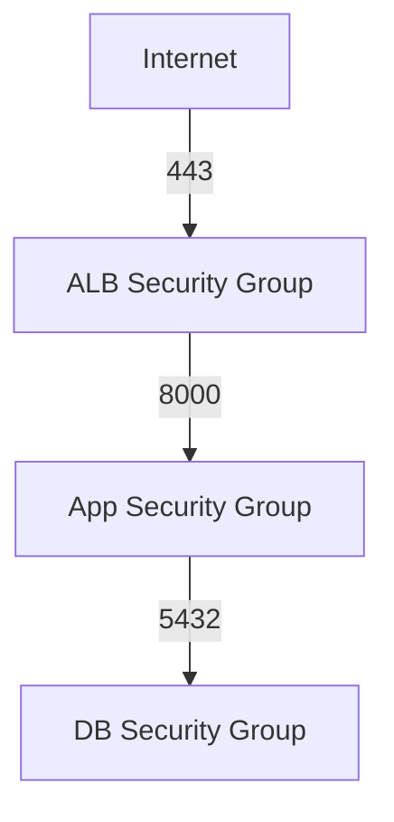

Example:

| Security Group | Inbound Access |
|---|---|
| ALB SG | HTTPS 443 from approved internet sources |
| App SG | App port 8000 only from ALB SG |
| DB SG | PostgreSQL 5432 only from App SG |

Do not expose the application port directly to the internet when all traffic should go through the ALB.

## 9.4 Stateless Application Design

Avoid:

```text
Session → local process memory
Files   → local EC2 disk
Shared task state → local variable
```

Prefer:

```text
Session         → Redis or signed cookie
Uploaded files  → S3
Persistent data → RDS/PostgreSQL
Async work      → SQS/RabbitMQ/managed queue
Shared cache    → ElastiCache
```

Now any healthy application instance can handle any request.

## 9.5 Scaling Configuration

A sensible starting point might be:

```text
Minimum instances = 2
Desired instances = 2
Maximum instances = 10
Policy            = Target tracking
Metric            = ALBRequestCountPerTarget or CPU
```

The exact values must come from load testing and real workload measurements.

---

# 10. Monitoring, Cost, and Best Practices

## 10.1 Important Metrics

For an ALB-backed application, watch:

- Request count
- Request count per target
- Target response time
- Healthy host count
- Unhealthy host count
- Target connection errors
- HTTP 4xx/5xx patterns
- Active connections

For scaling, also watch:

- Desired capacity
- In-service instances
- Pending instances
- Scaling activity failures
- CPU/network/custom workload metrics

## 10.2 Common Troubleshooting Flow

If targets remain unhealthy, check:

1. Is the application listening on the expected port?
2. Is it bound to `0.0.0.0` instead of only `127.0.0.1`?
3. Does the app security group allow traffic from the ALB security group?
4. Is the health-check path correct?
5. Does the health endpoint return an accepted status?
6. Is the target-group protocol correct?
7. Does application startup take longer than the health settings allow?
8. Are network ACLs blocking traffic?
9. For containers, is the correct container port registered?

If Auto Scaling does not launch capacity, check:

- Maximum capacity
- Scaling policy/alarm state
- Metric availability
- Launch template validity
- Subnet IP capacity
- EC2 quotas
- IAM/service-linked role
- Instance-type availability
- Startup/user-data failure

## 10.3 Capacity Planning

A simple starting estimate:

```text
Required instances =
Peak requests per second
------------------------
Safe requests per second per instance
```

Example:

```text
Peak demand                  = 2,400 requests/sec
Safe per-instance throughput = 300 requests/sec

2,400 / 300 = 8 instances
```

Add headroom:

```text
8 × 1.25 = 10 instances
```

This only becomes meaningful after realistic load testing.

## 10.4 Scaling Can Move the Bottleneck

Adding application instances increases pressure on downstream systems.

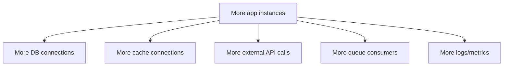

The maximum application capacity must remain safe for the database, cache, queues, APIs, and account quotas.

## 10.5 Production Best Practices

### Architecture

- Run production application capacity across at least two Availability Zones.
- Keep backend instances in private subnets where practical.
- Make application instances stateless.
- Store files in object storage instead of local instance disks.
- Store shared sessions in Redis/database when server-side sessions are required.

### Load Balancer

- Use ALB for HTTP/HTTPS application routing.
- Use NLB for transport-level requirements.
- Redirect HTTP to HTTPS.
- Use readiness-oriented health checks.
- Configure graceful deregistration.
- Review idle timeout for long-lived connections.
- Use AWS WAF where appropriate.
- Enable operational logging.

### Auto Scaling

- Set realistic minimum, desired, and maximum capacity.
- Use launch templates.
- Start with target tracking.
- Add scheduled scaling for known traffic windows.
- Use predictive scaling when historical patterns are meaningful.
- Measure startup/warmup time.
- Scale in more carefully than scale out.
- Test unhealthy-instance replacement.

### Deployment

- Make startup automated and repeatable.
- Prefer prebuilt AMIs or container images.
- Avoid large installation/download work on every boot.
- Do not send traffic until readiness checks pass.
- Drain old targets before termination.
- Use rolling, blue/green, or canary deployments where appropriate.

### Testing

Test:

- Gradual traffic growth
- Sudden traffic spikes
- Instance failure
- Scale-out time
- Scale-in with active requests
- Multi-AZ behavior
- Database/cache capacity at maximum application scale

---

# Final Mental Model

```text
                ┌──────────────────────┐
Users ─────────▶│     Load Balancer    │
                │ Which target handles │
                │ this request?        │
                └──────────┬───────────┘
                           │
                     Target Group
                           │
           ┌───────────────┼───────────────┐
           ▼               ▼               ▼
       Instance 1      Instance 2      Instance 3
           ▲               ▲               ▲
           └───────────────┼───────────────┘
                           │
                ┌──────────┴───────────┐
                │  Auto Scaling Group  │
                │ How many instances   │
                │ should exist?        │
                └──────────────────────┘
```

Remember the separation of responsibilities:

- **Load balancer:** route traffic to healthy targets.
- **Target group:** connect the load balancer to application targets.
- **Health checks:** determine whether targets can receive traffic.
- **Auto Scaling Group:** maintain and adjust EC2 capacity.
- **Scaling policy:** change desired capacity based on demand.
- **CloudWatch:** provide the metrics used for monitoring and scaling.

For most production web APIs, a strong default architecture is:

```text
Route 53
   ↓
Application Load Balancer
   ↓
Target Group
   ↓
Auto Scaling Group across 2+ AZs
   ↓
Stateless application instances
   ↓
Shared database / cache / object storage
```
