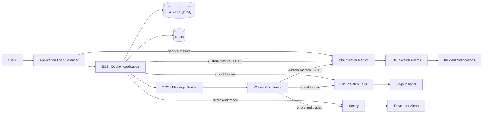

# Monitoring & Logging with CloudWatch and Sentry

> **Category:** AWS, Docker & DevOps  
> **Level:** Intermediate developer (3+ years)  
> **Last reviewed:** July 2026  
> **Goal:** Understand how to monitor infrastructure, centralize logs, detect application errors, trace slow requests, and build actionable production alerts.

---

# 1. Why Monitoring and Logging Matter

A production application can fail even when the code works correctly on a developer machine.

Common production problems include:

- CPU or memory exhaustion
- Containers restarting repeatedly
- Slow database queries
- Increased API latency
- Failed background tasks
- Third-party API timeouts
- Unexpected exceptions
- Disk space exhaustion
- Traffic spikes
- Deployment regressions

Monitoring and logging help answer different questions:

| Question | Best Signal |
|---|---|
| Is the system healthy? | Metrics |
| What exactly happened? | Logs |
| Which request or service was slow? | Traces |
| Which code line failed? | Sentry error event |
| Should the team be notified? | Alarm or alert |
| Did a deployment introduce the issue? | Release tracking |

A mature production system does not collect data only for historical analysis. It turns telemetry into **actionable signals**.

```text
Application activity
        │
        ├── Metrics ──> Health and trends
        ├── Logs ─────> Detailed event history
        ├── Traces ───> Request flow and latency
        └── Errors ───> Stack trace and code context
                         │
                         ▼
                  Alerts and response
```

---

# 2. Observability Fundamentals

**Monitoring** tells us whether predefined conditions are healthy or unhealthy.

**Observability** is the broader ability to understand an internal system state from the telemetry it produces, including conditions that were not predicted in advance.

A practical observability setup normally uses four types of data.

## 2.1 Metrics

A metric is a numeric measurement collected over time.

Examples:

- CPU utilization: `72%`
- API request count: `4,500 requests/minute`
- Error rate: `2.3%`
- Queue depth: `8,200 messages`
- P95 response time: `780 ms`
- Available memory: `1.4 GB`

Metrics are efficient for:

- Dashboards
- Threshold-based alerts
- Trend analysis
- Capacity planning
- Service-level objectives

A metric normally contains:

```text
Metric name + timestamp + value + dimensions
```

Example:

```text
Name: api_request_duration
Value: 245
Unit: milliseconds
Dimensions:
  environment=production
  service=payments-api
  endpoint=/payments
  method=POST
```

Dimensions make metrics filterable, but excessive high-cardinality dimensions can increase cost and complexity.

Avoid using values such as `user_id`, `request_id`, or random UUIDs as metric dimensions.

---

## 2.2 Logs

A log is a timestamped record of an event.

Example:

```json
{
  "timestamp": "2026-07-30T13:42:10.456Z",
  "level": "ERROR",
  "service": "payment-api",
  "environment": "production",
  "request_id": "req-82c4",
  "message": "Payment provider request failed",
  "provider": "stripe",
  "status_code": 504,
  "duration_ms": 30005
}
```

Logs are useful for:

- Debugging failures
- Auditing application behavior
- Inspecting request details
- Searching specific error codes
- Investigating incidents
- Building log-derived metrics

A good log explains an event without requiring a developer to reproduce the issue.

---

## 2.3 Traces

A trace represents the complete journey of one request across services.

A trace contains multiple **spans**. Each span represents one operation.

```text
POST /checkout                            1,250 ms
│
├── Validate request                         8 ms
├── Query PostgreSQL                        42 ms
├── Call inventory-service                 105 ms
├── Call payment-provider                  920 ms
└── Publish order-created event             35 ms
```

Tracing helps identify:

- Slow downstream services
- Expensive database queries
- Network latency
- Repeated calls
- Dependency bottlenecks
- Errors across microservices

Metrics may show that latency increased. Traces help explain **where the time was spent**.

---

## 2.4 Events and Alerts

An event represents a meaningful state change, such as:

- A deployment completed
- An EC2 instance stopped
- A container restarted
- A new Sentry issue appeared
- An alarm moved to the `ALARM` state

An alert is a notification generated when a rule or condition is matched.

```text
Telemetry
   │
   ▼
Evaluation rule
   │
   ├── Healthy ──> No notification
   │
   └── Breached ─> Alert
                    │
                    ├── Email
                    ├── Slack / Teams
                    ├── PagerDuty
                    ├── Incident platform
                    └── Automated action
```

The objective is not to alert on every error. The objective is to alert when human attention or automated remediation is required.

---

# 3. Amazon CloudWatch Overview

Amazon CloudWatch is AWS's monitoring and observability service.

It can collect and work with:

- AWS service metrics
- Custom application metrics
- Infrastructure metrics
- Application and system logs
- Traces and application signals
- Dashboards
- Metric and composite alarms
- Cross-account observability data

CloudWatch is especially useful for infrastructure and AWS-native workloads.

```text
AWS Resources
EC2 | ECS | EKS | Lambda | RDS | ALB | SQS
                  │
                  ▼
          Amazon CloudWatch
     ┌────────┬────────┬─────────┐
     │Metrics │ Logs   │ Traces  │
     └────────┴────────┴─────────┘
                  │
         ┌────────┴─────────┐
         ▼                  ▼
     Dashboards           Alarms
```

---

## 3.1 CloudWatch Metrics

Many AWS services automatically publish metrics to CloudWatch.

Examples:

| AWS Service | Common Metrics |
|---|---|
| EC2 | CPU utilization, network traffic, status checks |
| RDS | CPU, connections, free storage, read/write latency |
| Application Load Balancer | Request count, target response time, HTTP 4xx/5xx |
| ECS | CPU and memory utilization |
| Lambda | Invocations, errors, throttles, duration, concurrency |
| SQS | Visible messages, oldest message age, sent/received count |
| ElastiCache | CPU, memory, evictions, cache hits/misses |
| API Gateway | Count, latency, integration latency, 4xx/5xx |

CloudWatch receives metrics through two main paths:

1. **AWS-vended metrics** generated by AWS services.
2. **Custom metrics** published by applications through CloudWatch APIs or OpenTelemetry-compatible telemetry pipelines.

### Metric terminology

| Term | Meaning |
|---|---|
| Namespace | Logical group of metrics |
| Metric name | Name of the measurement |
| Dimension | Key-value metadata used to filter a metric |
| Statistic | Aggregation such as Average, Sum, Minimum, Maximum |
| Period | Time window used for aggregation |
| Resolution | Frequency at which metric data is stored |
| Unit | Seconds, bytes, count, percent, and so on |

Example custom namespace:

```text
MyCompany/Payments
```

Example custom metrics:

```text
PaymentSuccessCount
PaymentFailureCount
PaymentProcessingTime
```

### Custom metric example with Boto3

```python
import boto3

cloudwatch = boto3.client("cloudwatch", region_name="ap-south-1")

cloudwatch.put_metric_data(
    Namespace="MyCompany/Payments",
    MetricData=[
        {
            "MetricName": "PaymentProcessingTime",
            "Dimensions": [
                {"Name": "Environment", "Value": "production"},
                {"Name": "Provider", "Value": "stripe"},
            ],
            "Value": 420,
            "Unit": "Milliseconds",
        }
    ],
)
```

For high-throughput systems, avoid calling `PutMetricData` synchronously for every request. Prefer batching, Embedded Metric Format, StatsD, OpenTelemetry, or an agent/collector-based approach.

### High-resolution metrics

CloudWatch supports standard-resolution and high-resolution custom metrics.

High-resolution metrics are useful when sub-minute visibility is necessary, but they can create more data and additional cost. Use them for genuinely fast-changing operational signals, not for every business counter.

---

## 3.2 CloudWatch Logs

CloudWatch Logs centralizes logs from applications, servers, containers, and AWS services.

Core structure:

```text
Log Group
└── Log Stream
    ├── Log Event
    ├── Log Event
    └── Log Event
```

### Log group

A log group represents a logical application or resource category.

Examples:

```text
/aws/ecs/payment-api
/aws/lambda/order-processor
/company/production/nginx
/company/production/celery
```

### Log stream

A stream normally represents one source instance.

Examples:

- ECS task
- Container
- EC2 instance
- Lambda execution environment
- Application process

### Log event

A log event contains:

- Timestamp
- Message
- Optional detected fields

### Retention

Set an explicit retention period for each log group.

Do not leave every log group with indefinite retention unless there is a business, security, or compliance requirement.

A practical policy may look like:

| Environment | Suggested Retention |
|---|---:|
| Local | Local rotation only |
| Development | 7–14 days |
| Staging | 14–30 days |
| Production application logs | 30–90 days |
| Security or audit logs | Based on compliance policy |
| Archived long-term logs | Export or deliver to durable storage |

The correct value depends on legal, operational, and compliance requirements.

---

## 3.3 CloudWatch Logs Insights

CloudWatch Logs Insights is used to interactively search and analyze CloudWatch log data.

A basic query:

```sql
fields @timestamp, @message
| sort @timestamp desc
| limit 50
```

### Find recent errors

```sql
fields @timestamp, level, service, request_id, message
| filter level = "ERROR"
| sort @timestamp desc
| limit 100
```

### Count errors by service

```sql
fields service, level
| filter level = "ERROR"
| stats count(*) as error_count by service
| sort error_count desc
```

### Calculate API latency percentiles

```sql
fields endpoint, duration_ms
| filter event_type = "http_request"
| stats
    count(*) as requests,
    avg(duration_ms) as avg_ms,
    pct(duration_ms, 95) as p95_ms,
    pct(duration_ms, 99) as p99_ms
  by endpoint
| sort p95_ms desc
```

### Find logs for one request

```sql
fields @timestamp, service, level, message, request_id
| filter request_id = "req-82c4"
| sort @timestamp asc
```

### Detect new patterns

CloudWatch Logs Insights supports commands for parsing, pattern analysis, aggregation, comparison, and visualization. Pattern and comparison capabilities are useful during incidents because they help identify unusual or newly appearing log structures.

### Query discipline

Keep the time range as narrow as possible.

A narrow time range:

- Returns results faster
- Scans less data
- Reduces query cost
- Makes incident analysis easier

---

## 3.4 CloudWatch Alarms

A CloudWatch alarm evaluates a metric or metric expression over time.

Alarm states:

| State | Meaning |
|---|---|
| `OK` | Condition is not breaching |
| `ALARM` | Condition is breaching |
| `INSUFFICIENT_DATA` | CloudWatch does not have enough data |

Example alarm:

```text
Metric: ALB HTTPCode_Target_5XX_Count
Condition: Sum >= 20
Period: 5 minutes
Evaluation periods: 2
Action: Notify production incident channel
```

This means the alert fires only when the rule is breached for the configured evaluation behavior, instead of reacting to one isolated failure.

### Static alarm

Uses a fixed threshold.

```text
CPUUtilization > 80%
```

### Anomaly detection alarm

Uses the historical behavior of a metric to identify unusual values.

Useful when:

- Traffic changes by time of day
- A fixed threshold is too simple
- Normal usage has seasonal patterns

### Composite alarm

Combines multiple alarms.

Example:

```text
HighLatencyAlarm AND High5xxAlarm
```

Composite alarms reduce noise when one metric by itself is not enough to indicate a real incident.

### Log-based alarm flow

```text
Application log
      │
      ▼
CloudWatch Log Group
      │
      ▼
Metric Filter
      │
      ▼
CloudWatch Metric
      │
      ▼
CloudWatch Alarm
      │
      ▼
SNS / Incident notification
```

Example metric filter idea:

```text
Count logs where:
level = ERROR
and service = payment-api
```

Prefer application-native metrics for important business signals when possible. Log-derived metrics are useful, but tightly coupling alerting to free-form log text is fragile.

---

## 3.5 CloudWatch Dashboards

CloudWatch dashboards provide a visual operational view.

A production dashboard may include:

```text
┌───────────────────────────────────────────────┐
│ Requests/min | Error rate | P95 latency       │
├───────────────────────────────────────────────┤
│ ECS CPU      | ECS memory | Running task count│
├───────────────────────────────────────────────┤
│ DB latency   | Connections| Free storage      │
├───────────────────────────────────────────────┤
│ Queue depth  | Oldest msg | Worker failures   │
└───────────────────────────────────────────────┘
```

Good dashboards answer a specific operational question.

Examples:

- Is the customer-facing API healthy?
- Is the asynchronous processing pipeline keeping up?
- Did the new deployment affect latency?
- Is database capacity becoming a risk?

Avoid dashboards containing dozens of unrelated graphs without clear operational purpose.

---

## 3.6 CloudWatch Agent

The CloudWatch agent can collect metrics, logs, and traces from:

- EC2 instances
- On-premises servers
- Containerized applications
- Supported operating systems, including Linux and Windows

It is commonly used to collect metrics not available through basic EC2 monitoring, such as:

- Memory utilization
- Disk usage
- Swap usage
- Process metrics
- Additional network or system metrics
- Application log files

### Important distinction

EC2 publishes CPU-related metrics by default, but operating-system memory and disk-usage metrics normally require an agent or another telemetry collector.

### Simplified agent flow

```text
EC2 host
├── System metrics
├── Application logs
└── Traces
       │
       ▼
CloudWatch Agent
       │
       ├── CloudWatch Metrics
       ├── CloudWatch Logs
       └── Trace destination
```

A CloudWatch agent configuration is JSON and can contain sections such as:

```text
agent
metrics
logs
traces
```

Store and distribute the configuration consistently, for example through infrastructure automation or AWS Systems Manager Parameter Store.

---

## 3.7 Application Signals and OpenTelemetry

CloudWatch Application Signals provides an application-centric view of services and their dependencies.

It can help with:

- Service health
- Request volume
- Faults and errors
- Latency
- Service dependencies
- Performance against service-level objectives
- Root-cause analysis

OpenTelemetry is an open standard for generating and exporting:

- Metrics
- Logs
- Traces

A modern architecture can instrument applications with OpenTelemetry and route telemetry to CloudWatch or another compatible backend.

```text
Application
    │
    ▼
OpenTelemetry SDK / Collector
    │
    ├── Metrics
    ├── Logs
    └── Traces
           │
           ▼
      CloudWatch
```

OpenTelemetry reduces vendor-specific instrumentation and is especially useful in environments containing multiple languages or observability backends.

---

# 4. Sentry Overview

Sentry is a developer-focused debugging and application monitoring platform.

It is strongest when developers need to understand:

- Which exception occurred
- Which code path failed
- How many users or requests are affected
- Which release introduced the problem
- What happened immediately before the error
- Whether the same issue is repeating
- Which transaction or operation is slow

Sentry can work with error monitoring, tracing, performance data, logs, release information, and other debugging context depending on the selected SDK and product configuration.

```text
Application
    │
    ▼
Sentry SDK
    │
    ├── Exception
    ├── Stack trace
    ├── Request context
    ├── Breadcrumbs
    ├── Tags
    ├── Release
    └── Trace data
           │
           ▼
        Sentry
           │
           ├── Issue grouping
           ├── Ownership
           ├── Alerts
           └── Debugging workflow
```

---

## 4.1 Error Monitoring

When an unhandled exception occurs, the Sentry SDK can capture an event containing information such as:

- Exception type
- Exception message
- Stack trace
- Source file and line
- HTTP request details
- Environment
- Release version
- Runtime information
- Tags
- Breadcrumbs
- User or tenant context, when intentionally configured
- Related trace information

Sentry groups similar events into an **issue**.

Without grouping, 50,000 repeated exceptions could appear as 50,000 separate alerts. With grouping, developers can see one issue with event count, affected users, first seen time, and last seen time.

### Example issue

```text
Issue: TimeoutError in payment_provider.py
Events: 2,483
First seen: After release 2026.07.30.2
Environment: production
Affected endpoint: POST /payments
Primary tag: provider=stripe
```

---

## 4.2 Tracing and Performance Monitoring

Sentry tracing helps identify slow operations.

A transaction may represent:

- HTTP request
- Background job
- Scheduled task
- Queue consumer
- Frontend page load
- Database-heavy operation

Example:

```text
POST /orders                           1.8 s
├── Authentication                     12 ms
├── PostgreSQL query                   70 ms
├── Inventory API                     310 ms
├── Payment provider                 1,300 ms
└── Publish event                      40 ms
```

Tracing is useful for connecting an exception with the operation in which it occurred.

### Sampling

Capturing every trace in a busy production system can create unnecessary volume.

Use a production sampling strategy based on:

- Environment
- Endpoint
- Error status
- Transaction type
- Traffic volume
- Business criticality

Example:

```python
def traces_sampler(sampling_context: dict) -> float:
    transaction_context = sampling_context.get("transaction_context", {})
    name = transaction_context.get("name", "")

    if name.startswith("healthcheck"):
        return 0.0

    if name.startswith("POST /payments"):
        return 0.5

    return 0.1
```

Errors and traces are different data types. A low trace sampling rate should not be treated as permission to ignore critical exception capture.

---

## 4.3 Releases and Environments

Always identify the deployed release.

Good release identifiers include:

```text
Git commit SHA
Docker image digest
Semantic version
CI/CD build number
```

Example:

```text
payment-api@2026.07.30.2
```

Use consistent environment names:

```text
development
staging
production
```

Avoid accidental variations:

```text
prod
production
Production
live
```

Consistent release and environment metadata allows developers to answer:

- Did the issue start after a deployment?
- Does it occur only in production?
- Is the fix already deployed?
- Which version generated the event?

---

## 4.4 Breadcrumbs, Tags, and Context

### Breadcrumbs

Breadcrumbs are a timeline of actions leading to an error.

Example:

```text
12:10:02 User opened checkout
12:10:04 Cart loaded
12:10:06 Coupon validated
12:10:08 Payment request started
12:10:38 Payment provider timed out
12:10:38 TimeoutError captured
```

### Tags

Tags are searchable key-value fields.

Good tags:

```text
environment=production
service=payment-api
region=ap-south-1
provider=stripe
tenant_tier=enterprise
```

Avoid uncontrolled high-cardinality tags unless there is a clear debugging need.

### Context

Context adds structured details that are useful for debugging.

Example:

```python
sentry_sdk.set_context(
    "payment",
    {
        "provider": "stripe",
        "currency": "INR",
        "retry_count": 2,
    },
)
```

Do not attach passwords, tokens, full card details, session cookies, or unnecessary personal data.

---

# 5. CloudWatch vs Sentry

CloudWatch and Sentry overlap in some areas, but they solve different primary problems.

| Area | CloudWatch | Sentry |
|---|---|---|
| Main strength | AWS infrastructure and operational telemetry | Application errors and developer debugging |
| AWS service metrics | Excellent | Not the primary purpose |
| EC2/ECS/RDS monitoring | Excellent | Limited without custom integration |
| Centralized infrastructure logs | Excellent | Possible for application logs, but not its core historical role |
| Exception grouping | Basic through logs | Excellent |
| Stack traces and code context | Requires application log details | Excellent |
| Release regression visibility | Possible with custom dimensions/events | Built for release-aware issue tracking |
| Distributed tracing | Available through AWS observability features and OpenTelemetry | Strong developer-oriented tracing |
| Alarm actions | Strong AWS integration | Strong issue and workflow alerts |
| Best user | DevOps, SRE, platform and operations teams | Application developers |
| Typical question | “Is the AWS system healthy?” | “Why did this code fail?” |

### Recommended approach

Use both when the application is important enough to require infrastructure and code-level visibility.

```text
CloudWatch
├── AWS resource health
├── Central logs
├── Infrastructure metrics
├── Operational alarms
└── Capacity and service dashboards

Sentry
├── Application exceptions
├── Stack traces
├── Issue grouping
├── Release regressions
├── Error ownership
└── Developer-focused traces
```

Do not send every piece of telemetry to every platform without a reason. Define which tool is the source of truth for each signal.

---

# 6. Recommended Production Architecture

A common AWS and Docker architecture:



### Responsibility model

| Layer | Tool | Responsibility |
|---|---|---|
| AWS infrastructure | CloudWatch Metrics | Resource health and capacity |
| Container output | CloudWatch Logs | Centralized operational logs |
| Request flow | OpenTelemetry / CloudWatch / Sentry | Latency and dependency analysis |
| Application exceptions | Sentry | Stack trace, issue grouping, release context |
| Operational paging | CloudWatch alarms | Service health and availability |
| Developer notification | Sentry alerts | New or regressed code issues |
| Incident investigation | Both | Correlated infrastructure and code analysis |

---

# 7. Logging Docker Containers to CloudWatch

A containerized application should normally write logs to:

```text
STDOUT
STDERR
```

The container platform or logging driver is responsible for collecting and forwarding them.

Avoid writing only to internal container files because containers are disposable.

```text
Application
   │
   ├── STDOUT: informational logs
   └── STDERR: errors
          │
          ▼
Docker logging driver
          │
          ▼
CloudWatch Logs
```

---

## 7.1 Docker Compose with the awslogs Driver

The Docker `awslogs` logging driver sends container output to CloudWatch Logs.

```yaml
services:
  api:
    image: my-company/payment-api:2026.07.30.2
    environment:
      APP_ENV: production
      AWS_REGION: ap-south-1
    logging:
      driver: awslogs
      options:
        awslogs-region: ap-south-1
        awslogs-group: /company/production/payment-api
        awslogs-stream: api-{{.ID}}
        awslogs-create-group: "true"
        mode: non-blocking
        max-buffer-size: 4m
```

### Required permissions

The Docker host or runtime credentials need relevant CloudWatch Logs permissions, commonly including actions such as:

```text
logs:CreateLogStream
logs:PutLogEvents
```

Creating log groups dynamically additionally requires permission such as:

```text
logs:CreateLogGroup
```

In production, it is often cleaner to create log groups through infrastructure as code and apply retention, encryption, and tags explicitly.

### Blocking vs non-blocking

Docker logging is blocking by default.

With non-blocking delivery, the application is less likely to block because the logging destination is slow or unavailable. However, logs can be dropped when the buffer is full.

This is a trade-off:

```text
Blocking mode
+ Better delivery pressure
- Application may block under logging backpressure

Non-blocking mode
+ Protects application responsiveness
- May drop logs when the buffer is full
```

For high-volume production applications, treat logging as a bounded resource. Avoid producing unbounded debug output.

---

## 7.2 Amazon ECS and Fargate

For ECS and Fargate, configure the `awslogs` driver in the task definition.

```json
{
  "family": "payment-api",
  "containerDefinitions": [
    {
      "name": "api",
      "image": "123456789012.dkr.ecr.ap-south-1.amazonaws.com/payment-api:2026.07.30.2",
      "essential": true,
      "portMappings": [
        {
          "containerPort": 8000,
          "protocol": "tcp"
        }
      ],
      "logConfiguration": {
        "logDriver": "awslogs",
        "options": {
          "awslogs-region": "ap-south-1",
          "awslogs-group": "/aws/ecs/payment-api",
          "awslogs-stream-prefix": "ecs"
        }
      }
    }
  ]
}
```

For ECS, ensure the **task execution role** has the permissions required to deliver container logs.

The resulting stream naming commonly follows the configured prefix and task/container information.

### FireLens

For advanced routing, transformation, filtering, or delivery to multiple destinations, ECS FireLens can be used with Fluent Bit or Fluentd.

Use FireLens when you require features such as:

- Multiple log destinations
- Log enrichment
- Filtering before delivery
- Custom parsing
- Vendor-neutral routing

Do not introduce a complex log router when the simple `awslogs` driver fully satisfies the requirement.

---

## 7.3 Docker Log Rotation

When logs remain on the Docker host, configure rotation.

Docker's default `json-file` driver can otherwise consume significant disk space.

Example daemon configuration:

```json
{
  "log-driver": "json-file",
  "log-opts": {
    "max-size": "10m",
    "max-file": "3"
  }
}
```

Or configure it per Compose service:

```yaml
services:
  api:
    image: my-company/payment-api:latest
    logging:
      driver: json-file
      options:
        max-size: "10m"
        max-file: "3"
```

Logging configuration changes normally apply to newly created containers. Recreate existing containers after changing the logging driver or rotation policy.

---

# 8. Structured Application Logging

Structured logs are easier to search and aggregate than free-form text.

### Weak log

```text
Something failed
```

### Better log

```text
Payment failed for order 12098 because provider returned timeout
```

### Best structured log

```json
{
  "timestamp": "2026-07-30T13:42:10.456Z",
  "level": "ERROR",
  "event": "payment_provider_failed",
  "message": "Payment provider request timed out",
  "service": "payment-api",
  "environment": "production",
  "release": "2026.07.30.2",
  "request_id": "req-82c4",
  "trace_id": "2ac045d9ef3c4fc5",
  "order_id": "ord-12098",
  "provider": "stripe",
  "duration_ms": 30005,
  "retryable": true
}
```

### Recommended common fields

| Field | Purpose |
|---|---|
| `timestamp` | Event time in UTC |
| `level` | Severity |
| `message` | Human-readable explanation |
| `event` | Stable machine-readable event name |
| `service` | Application or service name |
| `environment` | Development, staging, production |
| `release` | Deployed version |
| `request_id` | Correlates one request |
| `trace_id` | Connects logs to a distributed trace |
| `user_id` | Optional and privacy-reviewed |
| `tenant_id` | Useful in multi-tenant systems |
| `duration_ms` | Operation duration |
| `error_type` | Exception class or error category |

### Log levels

| Level | Use |
|---|---|
| `DEBUG` | Detailed development diagnostics |
| `INFO` | Normal meaningful application activity |
| `WARNING` | Unexpected condition that is recoverable |
| `ERROR` | Operation failed and requires investigation |
| `CRITICAL` | Severe system-level failure |

Do not log normal behavior as `ERROR`, because error metrics and alerts will become noisy.

### Python JSON logging example

```python
import json
import logging
import sys
from datetime import datetime, timezone


class JsonFormatter(logging.Formatter):
    def format(self, record: logging.LogRecord) -> str:
        payload = {
            "timestamp": datetime.now(timezone.utc).isoformat(),
            "level": record.levelname,
            "logger": record.name,
            "message": record.getMessage(),
        }

        for field in (
            "service",
            "environment",
            "release",
            "request_id",
            "trace_id",
            "event",
            "duration_ms",
        ):
            value = getattr(record, field, None)
            if value is not None:
                payload[field] = value

        if record.exc_info:
            payload["exception"] = self.formatException(record.exc_info)

        return json.dumps(payload, default=str)


handler = logging.StreamHandler(sys.stdout)
handler.setFormatter(JsonFormatter())

logger = logging.getLogger("payment-api")
logger.setLevel(logging.INFO)
logger.handlers = [handler]
logger.propagate = False

logger.info(
    "Payment request completed",
    extra={
        "service": "payment-api",
        "environment": "production",
        "release": "2026.07.30.2",
        "request_id": "req-82c4",
        "event": "payment_completed",
        "duration_ms": 420,
    },
)
```

### Stable event names

Use stable event identifiers for queries and metrics.

Good:

```text
event=payment_failed
event=order_created
event=webhook_signature_invalid
```

Fragile:

```text
message contains "payment could not complete today"
```

Messages can evolve for readability. Stable event names should remain consistent for dashboards and searches.

---

# 9. Using Sentry in Python Applications

Install the Sentry Python SDK:

```bash
pip install sentry-sdk
```

Store the DSN in a secret-management solution or environment variable.

```bash
SENTRY_DSN="https://examplePublicKey@o0.ingest.sentry.io/0"
SENTRY_ENVIRONMENT="production"
APP_RELEASE="2026.07.30.2"
```

Never hard-code production secrets in source control.

---

## 9.1 Django

A basic Django setup:

```python
# settings.py

import os
import sentry_sdk

sentry_sdk.init(
    dsn=os.getenv("SENTRY_DSN"),
    environment=os.getenv("SENTRY_ENVIRONMENT", "development"),
    release=os.getenv("APP_RELEASE"),
    send_default_pii=False,
    traces_sample_rate=0.1,
)
```

Sentry's Python SDK integrations can automatically connect with supported frameworks and libraries.

### Production recommendations

- Initialize Sentry once during application startup.
- Set `environment`.
- Set `release`.
- Keep `send_default_pii=False` unless a reviewed requirement exists.
- Configure tracing intentionally.
- Filter known non-actionable exceptions.
- Use a `before_send` hook for redaction and event control.
- Verify source-code integration and release mapping in CI/CD.

### Filtering events

```python
from typing import Any


def before_send(
    event: dict[str, Any],
    hint: dict[str, Any],
) -> dict[str, Any] | None:
    exception = hint.get("exc_info")

    if exception:
        _, error, _ = exception

        # Example: ignore a known client-disconnect exception.
        if error.__class__.__name__ == "ClientDisconnectedError":
            return None

    request = event.get("request", {})
    headers = request.get("headers", {})

    for sensitive_header in ("Authorization", "Cookie", "X-Api-Key"):
        if sensitive_header in headers:
            headers[sensitive_header] = "[Filtered]"

    return event
```

Filtering should be narrow and documented. Do not hide real production failures simply to reduce alert volume.

---

## 9.2 FastAPI

Basic FastAPI setup:

```python
import os

import sentry_sdk
from fastapi import FastAPI


sentry_sdk.init(
    dsn=os.getenv("SENTRY_DSN"),
    environment=os.getenv("SENTRY_ENVIRONMENT", "development"),
    release=os.getenv("APP_RELEASE"),
    send_default_pii=False,
    traces_sample_rate=0.1,
)

app = FastAPI()


@app.get("/health")
async def health() -> dict[str, str]:
    return {"status": "ok"}


@app.get("/debug-sentry")
async def debug_sentry() -> None:
    raise RuntimeError("Sentry verification error")
```

Use a verification endpoint only temporarily in a controlled non-production environment, or protect it carefully. Remove it after validating the integration.

### Attach request context

```python
from fastapi import Request
import sentry_sdk


@app.middleware("http")
async def sentry_request_context(request: Request, call_next):
    request_id = request.headers.get("x-request-id", "unknown")

    with sentry_sdk.configure_scope() as scope:
        scope.set_tag("request_id", request_id)
        scope.set_tag("service", "payment-api")

    response = await call_next(request)
    response.headers["x-request-id"] = request_id
    return response
```

For concurrent applications, use the SDK's current isolation and scope APIs according to the installed SDK version. The central design principle is that request-specific context must not leak between concurrent requests.

---

## 9.3 Celery Workers

Celery errors occur outside the web request process, so worker initialization matters.

```python
import os
import sentry_sdk


sentry_sdk.init(
    dsn=os.getenv("SENTRY_DSN"),
    environment=os.getenv("SENTRY_ENVIRONMENT", "development"),
    release=os.getenv("APP_RELEASE"),
    send_default_pii=False,
    traces_sample_rate=0.1,
)
```

For a standalone Celery deployment, initialize the SDK in the worker application startup path.

Attach useful task context:

```python
from celery import shared_task
import sentry_sdk


@shared_task(
    bind=True,
    autoretry_for=(TimeoutError,),
    retry_backoff=True,
    max_retries=5,
)
def process_invoice(self, invoice_id: str) -> None:
    sentry_sdk.set_tag("task_name", self.name)
    sentry_sdk.set_context(
        "invoice",
        {
            "invoice_id": invoice_id,
            "retry_count": self.request.retries,
        },
    )

    # Processing logic...
```

Avoid sending complete message bodies when they may contain credentials or sensitive customer information.

---

## 9.4 Manual Error Capture

Unhandled exceptions are usually captured automatically by supported integrations.

Use manual capture when:

- An exception is caught and not re-raised
- A failure is represented by a returned error result
- You need to report a meaningful non-exception event

### Capture an exception

```python
import sentry_sdk


try:
    charge_customer()
except PaymentProviderError as exc:
    sentry_sdk.capture_exception(exc)
    raise
```

### Capture a message

```python
sentry_sdk.capture_message(
    "Payment provider fallback activated",
    level="warning",
)
```

Do not send a Sentry event for every expected validation failure. Expected business errors should normally be represented through structured logs and metrics.

---

# 10. Correlation IDs and End-to-End Debugging

A correlation ID connects data across services and tools.

Without correlation:

```text
CloudWatch: Payment failed
Sentry: TimeoutError
Worker log: Retry started
```

With correlation:

```text
request_id=req-82c4
trace_id=2ac045d9ef3c4fc5
```

Now the same incident can be followed across:

- Load balancer or gateway
- API container
- Database operation
- Downstream service
- Queue message
- Worker
- CloudWatch logs
- Sentry event
- Distributed trace

### Request ID middleware example

```python
import uuid
from contextvars import ContextVar

from fastapi import FastAPI, Request


request_id_var: ContextVar[str] = ContextVar(
    "request_id",
    default="unknown",
)

app = FastAPI()


@app.middleware("http")
async def request_id_middleware(request: Request, call_next):
    request_id = request.headers.get("x-request-id") or str(uuid.uuid4())
    token = request_id_var.set(request_id)

    try:
        response = await call_next(request)
        response.headers["x-request-id"] = request_id
        return response
    finally:
        request_id_var.reset(token)
```

### Propagation

Forward the request ID to downstream services:

```python
headers = {
    "x-request-id": request_id,
}
```

Include it in queue messages:

```json
{
  "event": "invoice.generate",
  "request_id": "req-82c4",
  "invoice_id": "inv-9102"
}
```

Add it to logs and Sentry tags.

### Trace IDs

When OpenTelemetry or another tracing system is used, prefer standard trace context propagation rather than creating an unrelated tracing format.

Request IDs remain useful for support and human communication, while trace IDs connect the formal distributed trace.

---

# 11. Monitoring the Four Golden Signals

A practical service dashboard should cover four essential signals.

## 11.1 Latency

How long does the operation take?

Monitor:

- P50
- P95
- P99
- Dependency latency
- Database latency
- Queue processing time

Do not rely only on average latency. Averages can hide a poor experience for a smaller but important percentage of users.

---

## 11.2 Traffic

How much demand is reaching the system?

Monitor:

- Requests per second
- Jobs per minute
- Messages published
- Active users
- Concurrent connections
- Data processed

Traffic gives context to other signals.

An error count of 100 has different meaning at:

```text
1,000 total requests  -> 10% error rate
1,000,000 requests    -> 0.01% error rate
```

---

## 11.3 Errors

How often is the system failing?

Monitor:

- HTTP 5xx rate
- Failed background tasks
- Unhandled exceptions
- Dependency failures
- Database errors
- Authentication failures
- Business-operation failures

Prefer rates for service-level alerts:

```text
error_rate = failed_requests / total_requests
```

Absolute counts remain useful for low-traffic critical workflows.

---

## 11.4 Saturation

How close is the system to its limit?

Monitor:

- CPU
- Memory
- Disk
- Database connections
- Thread pools
- Queue depth
- Worker concurrency
- Rate-limit usage
- File descriptors

Saturation often predicts an incident before customers see failures.

```text
Queue depth rising
        │
        ▼
Worker capacity insufficient
        │
        ▼
Processing delay increases
        │
        ▼
Oldest message age breaches SLO
```

---

# 12. Alert Design

A good alert is:

- Actionable
- Owned
- Prioritized
- Low-noise
- Linked to investigation context
- Tested
- Based on customer or system impact

### Alert severity

| Severity | Meaning | Example |
|---|---|---|
| Critical | Active major customer impact | Payment success rate below target |
| High | Significant degradation | API P95 above threshold with 5xx increase |
| Medium | Requires investigation during working hours | Queue backlog rising |
| Low | Informational or trend | Disk utilization approaching planning level |

### Weak alert

```text
CPU > 80% for 1 minute
```

This may fire during normal short-lived bursts.

### Better alert

```text
CPU > 85% for 15 minutes
AND
P95 latency > 1 second
```

This is closer to customer impact.

### Multi-window thinking

Use short windows for fast detection and longer windows for confirmation.

Example:

```text
Fast signal:
Error rate > 5% for 5 minutes

Slow signal:
Error rate > 1% for 30 minutes
```

### Alert content template

```text
Title: Payment API elevated failure rate

Environment: production
Region: ap-south-1
Service: payment-api
Observed: 6.4% failures
Threshold: 2% for 10 minutes
Started: 13:40 UTC
Release: 2026.07.30.2

Links:
- CloudWatch dashboard
- Logs Insights saved query
- Sentry issue or project
- Runbook
- Recent deployment
```

### Avoid duplicate alerts

Do not page separately for:

```text
High 5xx
High error logs
Many Sentry exceptions
High latency
```

when all four represent the same incident.

Use one primary paging signal and treat the others as diagnostic evidence.

### CloudWatch vs Sentry alert ownership

| Alert | Recommended Tool |
|---|---|
| ECS task count below minimum | CloudWatch |
| ALB 5xx rate high | CloudWatch |
| RDS storage low | CloudWatch |
| Queue age too high | CloudWatch |
| New unhandled application exception | Sentry |
| Previously resolved issue regressed | Sentry |
| Exception increased after release | Sentry |
| Application operation latency | CloudWatch, Sentry, or both depending on ownership |

---

# 13. Dashboards and Operational Views

Use separate dashboards for separate audiences.

## Service dashboard

For developers and on-call engineers:

```text
Request rate
Error rate
P50 / P95 / P99 latency
Top slow endpoints
Dependency latency
Recent deployments
Active Sentry issues
```

## Infrastructure dashboard

For platform and DevOps teams:

```text
ECS task CPU and memory
Desired vs running tasks
ALB healthy targets
RDS CPU and connections
Cache memory and evictions
Queue depth
Disk utilization
```

## Business-flow dashboard

For critical application outcomes:

```text
Orders created
Payments succeeded
Payments failed
Invoices generated
Webhook processing delay
Lead creation success rate
```

Business metrics are important because a technically healthy service can still fail to deliver the intended outcome.

Example:

```text
HTTP 200 responses: Normal
CPU: Normal
Latency: Normal
Payment success: 0
```

Infrastructure-only monitoring may miss this failure.

---

# 14. Security and Sensitive Data

Logs and error events can unintentionally expose sensitive data.

Never log:

- Passwords
- Access tokens
- Refresh tokens
- API keys
- Session cookies
- Authorization headers
- Private encryption keys
- Full payment-card data
- Unnecessary personal or medical information
- Complete request bodies without review

### Redaction

Redact known sensitive fields before telemetry leaves the application.

```python
SENSITIVE_KEYS = {
    "password",
    "token",
    "access_token",
    "refresh_token",
    "authorization",
    "cookie",
    "api_key",
}


def redact(value):
    if isinstance(value, dict):
        return {
            key: "[Filtered]" if key.lower() in SENSITIVE_KEYS else redact(item)
            for key, item in value.items()
        }

    if isinstance(value, list):
        return [redact(item) for item in value]

    return value
```

### IAM least privilege

CloudWatch log writers should receive only the permissions they require.

Separate permissions for:

- Writing logs
- Querying logs
- Changing retention
- Deleting log groups
- Creating alarms
- Managing dashboards

An application should not need administrative CloudWatch permissions.

### Encryption and access

Review:

- CloudWatch Logs encryption requirements
- Sentry data-region and organizational policies
- Role-based access
- Audit requirements
- Retention and deletion policies
- Data-processing agreements
- Tenant isolation

Observability systems often contain production context and should be treated as sensitive systems.

---

# 15. Cost and Data-Volume Control

Observability cost is primarily influenced by data volume, retention, query patterns, metric cardinality, event sampling, and duplication.

## CloudWatch cost controls

- Set log retention explicitly.
- Avoid logging large request and response bodies.
- Disable production `DEBUG` logs by default.
- Use structured fields instead of repeated multiline text.
- Query narrow time windows.
- Avoid unnecessary high-resolution custom metrics.
- Avoid high-cardinality metric dimensions.
- Filter logs before ingestion when appropriate.
- Archive only data that has a real retention requirement.
- Review unused dashboards and alarms.
- Use one meaningful metric rather than several duplicate metrics.

## Sentry cost controls

- Configure trace sampling.
- Drop known non-actionable events.
- Separate environments.
- Avoid capturing expected validation errors.
- Review noisy issue sources.
- Add rate and volume controls.
- Avoid attaching large payloads.
- Use targeted Session Replay or profiling where relevant rather than enabling maximum capture everywhere.
- Review alert rules that cause repeated notifications.

### Sampling principle

Sample high-volume performance data, but preserve enough data to investigate important operations.

Example strategy:

| Transaction | Suggested Starting Approach |
|---|---|
| Health checks | Do not trace |
| Static endpoints | Very low sampling |
| Standard API traffic | Moderate sampling |
| Payments or claims | Higher sampling |
| Errors | Capture with appropriate controls |
| Background batch jobs | Sample based on volume and criticality |

Sampling values must be tested against real traffic and budget.

---

# 16. Deployment Checklist

## Application logging

- [ ] Logs go to `stdout` and `stderr`.
- [ ] Production logs are structured JSON.
- [ ] Every log has service and environment fields.
- [ ] Important request logs include `request_id`.
- [ ] Trace IDs are included when tracing is enabled.
- [ ] Log level is configurable.
- [ ] Secrets and sensitive fields are redacted.
- [ ] Stack traces are recorded for unexpected failures.
- [ ] Stable event names are used.

## CloudWatch

- [ ] Log groups are created through infrastructure as code.
- [ ] Retention is configured.
- [ ] IAM permissions follow least privilege.
- [ ] Container logs reach CloudWatch.
- [ ] CPU, memory, disk, and dependency metrics are available.
- [ ] Critical service alarms are configured.
- [ ] Alarm notifications reach the correct owner.
- [ ] Dashboard links are included in incident alerts.
- [ ] Saved Logs Insights queries exist for common investigations.
- [ ] Billing and telemetry volume are reviewed.

## Sentry

- [ ] DSN is injected securely.
- [ ] Correct environment is configured.
- [ ] Release identifier is configured.
- [ ] Source integration or source mapping is configured where relevant.
- [ ] Sensitive data is filtered.
- [ ] Trace sampling is explicitly configured.
- [ ] New issue and regression alerts are configured.
- [ ] Team ownership is configured.
- [ ] Test exceptions have been verified.
- [ ] Non-actionable events are filtered carefully.

## Incident readiness

- [ ] Each critical alert has a runbook.
- [ ] Alert severity is defined.
- [ ] On-call ownership is clear.
- [ ] Recent deployment information is available.
- [ ] Request and trace correlation works.
- [ ] Alerts have been tested.
- [ ] Recovery conditions are defined.

---

# 17. Practical Incident Walkthrough

Consider a production payment API running as ECS containers.

## Symptom

Customers report checkout failures.

## Step 1: Check the service dashboard

CloudWatch shows:

```text
Request rate: Normal
P95 latency: Increased from 300 ms to 4.2 s
Target 5xx rate: Increased to 7%
ECS CPU: 42%
ECS memory: 55%
RDS connections: Normal
```

Interpretation:

The infrastructure is not saturated. The problem is likely inside the application or a dependency.

## Step 2: Check Sentry

Sentry shows:

```text
Issue: TimeoutError in payment_provider.py
First seen: 4 minutes after release 2026.07.30.2
Events: 1,482
Provider: stripe
Endpoint: POST /payments
```

Interpretation:

A release correlation exists, but it is not yet proof that the deployment caused the failure.

## Step 3: Inspect a trace

```text
POST /payments                           4.4 s
├── Validate request                       5 ms
├── Database lookup                       32 ms
├── Payment provider call              4,300 ms
└── Error handling                        18 ms
```

Interpretation:

The external provider call dominates the latency.

## Step 4: Search CloudWatch logs

```sql
fields @timestamp, request_id, provider, duration_ms, message
| filter event = "payment_provider_failed"
| sort @timestamp desc
| limit 100
```

Logs show:

```text
provider=stripe
duration_ms=4300
retry_count=2
error_type=TimeoutError
```

## Step 5: Correlate one request

Using `request_id=req-82c4`:

```text
API accepted request
Payment attempt started
Provider timed out
Retry started
Provider timed out
Fallback was not activated
HTTP 500 returned
```

## Step 6: Mitigate

Possible mitigation:

- Enable a safe fallback
- Increase capacity only if the bottleneck is internal
- Roll back the release if timeout handling changed
- Temporarily adjust retry behavior
- Use a circuit breaker to prevent cascading failures
- Contact the dependency provider when external degradation is confirmed

## Step 7: Improve after resolution

- Add a dependency latency alarm.
- Add a payment success-rate business alarm.
- Add a circuit-breaker state metric.
- Improve timeout and retry logs.
- Add the runbook link to the alert.
- Verify that the same failure does not create duplicate pages from several systems.

This flow demonstrates the complementary roles:

```text
CloudWatch detected service degradation.
Sentry identified the failing code path.
Tracing identified the slow dependency.
Structured logs reconstructed the request timeline.
```

---

# 18. Key Takeaways

1. **Metrics show system health; logs explain events; traces show request flow; Sentry explains code failures.**
2. **CloudWatch is the primary AWS infrastructure and operational telemetry platform.**
3. **Sentry is strongest for exception grouping, stack traces, release regressions, and developer debugging.**
4. **Docker applications should log to `stdout` and `stderr`, then let the runtime collect the output.**
5. **Use structured JSON logs with stable event names and correlation IDs.**
6. **Monitor latency, traffic, errors, and saturation.**
7. **Alert on customer or service impact, not every isolated technical event.**
8. **Set log retention and sampling intentionally to control cost.**
9. **Never expose secrets or unnecessary personal data in logs or Sentry events.**
10. **The strongest production setup uses CloudWatch and Sentry together, with clearly separated responsibilities.**

---

# 19. Official References

## AWS

- [What is Amazon CloudWatch?](https://docs.aws.amazon.com/AmazonCloudWatch/latest/monitoring/WhatIsCloudWatch.html)
- [Metrics in Amazon CloudWatch](https://docs.aws.amazon.com/AmazonCloudWatch/latest/monitoring/working_with_metrics.html)
- [What is Amazon CloudWatch Logs?](https://docs.aws.amazon.com/AmazonCloudWatch/latest/logs/WhatIsCloudWatchLogs.html)
- [CloudWatch Logs Insights query syntax](https://docs.aws.amazon.com/AmazonCloudWatch/latest/logs/CWL_QuerySyntax.html)
- [Using Amazon CloudWatch alarms](https://docs.aws.amazon.com/AmazonCloudWatch/latest/monitoring/CloudWatch_Alarms.html)
- [Using Amazon CloudWatch dashboards](https://docs.aws.amazon.com/AmazonCloudWatch/latest/monitoring/CloudWatch_Dashboards.html)
- [Collect metrics, logs, and traces using the CloudWatch agent](https://docs.aws.amazon.com/AmazonCloudWatch/latest/monitoring/Install-CloudWatch-Agent.html)
- [CloudWatch Application Signals](https://docs.aws.amazon.com/AmazonCloudWatch/latest/monitoring/CloudWatch-Application-Monitoring-Sections.html)
- [Send Amazon ECS logs to CloudWatch](https://docs.aws.amazon.com/AmazonECS/latest/developerguide/using_awslogs.html)

## Docker

- [Configure Docker logging drivers](https://docs.docker.com/engine/logging/configure/)
- [Amazon CloudWatch Logs logging driver](https://docs.docker.com/engine/logging/drivers/awslogs/)
- [Docker JSON file logging driver](https://docs.docker.com/engine/logging/drivers/json-file/)

## Sentry

- [Sentry documentation](https://docs.sentry.io/)
- [Sentry for Python](https://docs.sentry.io/platforms/python/)
- [Sentry FastAPI integration](https://docs.sentry.io/platforms/python/integrations/fastapi/)
- [Sentry Celery integration](https://docs.sentry.io/platforms/python/integrations/celery/)
- [Sentry Python SDK options](https://docs.sentry.io/platforms/python/configuration/options/)

---

> **Revision note:** Cloud observability products evolve frequently. Verify SDK-specific options and AWS service support against the official documentation before production rollout.
