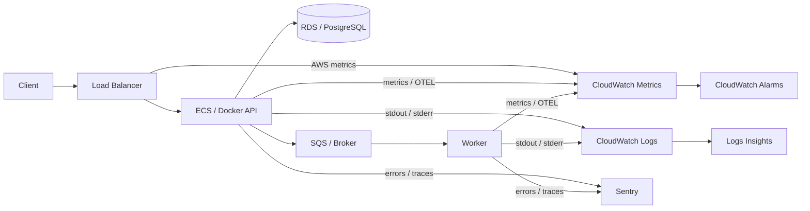
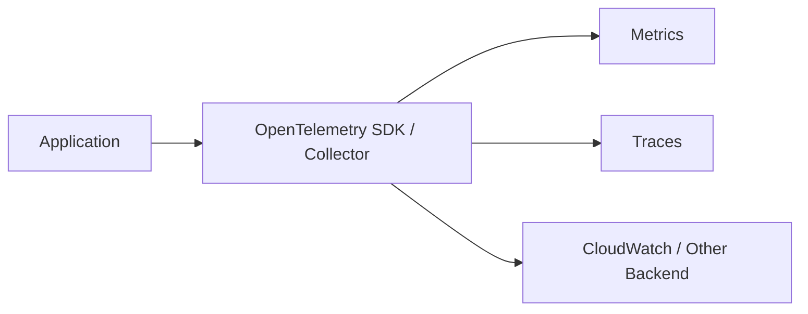
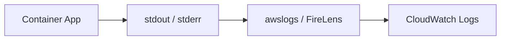

# Monitoring & Logging with CloudWatch and Sentry

> Understand how production systems are observed using metrics, logs, traces, alerts, CloudWatch, and Sentry.

## In short

- **Metrics** show system health over time: request rate, latency, error rate, CPU, memory, queue depth.
- **Logs** explain individual events: what happened, when, where, and with which request.
- **Traces** show how one request moves through services and where time is spent.
- **CloudWatch** is a natural fit for AWS infrastructure metrics, centralized logs, dashboards, alarms, and AWS-native application observability.
- **Sentry** is strongest for application exceptions, stack traces, issue grouping, release regressions, and developer-focused tracing.
- Use **structured JSON logs** and add `request_id` and `trace_id` so telemetry from different services can be correlated.
- Monitor the **four golden signals**: latency, traffic, errors, and saturation.
- Containers should normally write to `stdout`/`stderr`; the platform forwards those logs.
- Alerts should represent actionable impact, not every temporary metric spike.
- Control observability cost through log retention, sensible metric dimensions, narrow log queries, and trace sampling.



---

# 1. Monitoring vs Observability

**Monitoring** checks known conditions.

Examples:

- Is API error rate above 2%?
- Is RDS storage running low?
- Are ECS tasks below the desired count?

**Observability** is broader. It gives enough telemetry to investigate problems that were not predicted in advance.

A practical system combines:

| Signal | Main Question | Example |
|---|---|---|
| Metrics | Is something unhealthy? | P95 latency = 1.2 s |
| Logs | What happened? | Payment provider timed out |
| Traces | Where was time spent? | Stripe call took 900 ms |
| Errors | Which code failed? | `TimeoutError` in `payment.py` |
| Alerts | Does someone need to act? | Payment error rate breached threshold |

The important idea is that these signals complement each other.

```text
Metric tells you: "Latency increased."
Trace tells you:  "Payment provider is slow."
Log tells you:    "Provider returned timeout."
Sentry tells you: "TimeoutError came from this code path."
```

---

# 2. Metrics, Logs, and Traces

## 2.1 Metrics

Metrics are numeric measurements collected over time.

Common production metrics:

```text
Request rate       2,500 requests/min
HTTP 5xx rate      1.8%
P95 latency        620 ms
CPU utilization    72%
Memory utilization 68%
Queue depth        4,200 messages
Oldest queue item  95 seconds
```

Metrics are best for:

- dashboards
- alerts
- capacity planning
- trends
- SLOs

A metric usually has:

```text
name + timestamp + value + dimensions
```

Example:

```text
api_request_duration_ms
service=payments-api
environment=production
endpoint=/payments
```

Avoid uncontrolled high-cardinality dimensions such as `request_id`, random UUIDs, or individual `user_id` values. They can make metric storage and querying unnecessarily expensive.

---

## 2.2 Logs

Logs record individual events.

Prefer structured logs:

```json
{
  "timestamp": "2026-08-20T06:30:10Z",
  "level": "ERROR",
  "service": "payment-api",
  "environment": "production",
  "event": "payment_provider_timeout",
  "request_id": "req-82c4",
  "trace_id": "2ac045d9ef3c4fc5",
  "provider": "stripe",
  "duration_ms": 3000
}
```

Useful common fields:

| Field | Purpose |
|---|---|
| `timestamp` | Event time |
| `level` | `INFO`, `WARNING`, `ERROR`, etc. |
| `service` | Service producing the log |
| `environment` | staging, production, etc. |
| `event` | Stable machine-readable event name |
| `request_id` | Human-friendly request correlation |
| `trace_id` | Distributed trace correlation |
| `release` | Deployed version |
| `duration_ms` | Operation duration |
| `error_type` | Exception category |

Structured JSON is easier to filter, aggregate, and alert on than changing free-text messages.

Use stable event names such as:

```text
payment_failed
order_created
webhook_signature_invalid
```

---

## 2.3 Traces

A trace represents one request or job across multiple operations.

Each operation is a **span**.

```text
POST /checkout                         1,250 ms
│
├── Validate request                       8 ms
├── PostgreSQL query                      42 ms
├── Inventory service                    105 ms
├── Payment provider                     920 ms
└── Publish order-created event           35 ms
```

Tracing is useful when an API is slow but CPU, memory, and database health look normal.

Use standard trace-context propagation through OpenTelemetry-compatible instrumentation instead of inventing a separate tracing format.

---

# 3. Amazon CloudWatch

CloudWatch is AWS's main monitoring and observability service.

For normal AWS development, the most important areas are:

1. **Metrics**
2. **Logs**
3. **Logs Insights**
4. **Alarms**
5. **Dashboards**
6. **CloudWatch Agent**
7. **Application Signals**

---

## 3.1 CloudWatch Metrics

Many AWS services automatically publish metrics.

| AWS Service | Common Metrics |
|---|---|
| EC2 | CPU, network, status checks |
| ECS | CPU and memory utilization |
| Lambda | invocations, errors, throttles, duration |
| RDS | CPU, DB connections, free storage, read/write latency |
| ALB | request count, target response time, 4xx/5xx |
| SQS | visible messages, oldest message age |
| ElastiCache | memory, evictions, cache activity |
| API Gateway | count, latency, integration latency, 4xx/5xx |

Applications can also publish **custom metrics** such as:

```text
PaymentSuccessCount
PaymentFailureCount
PaymentProcessingTime
```

For high-throughput applications, avoid making one synchronous `PutMetricData` call for every HTTP request. Prefer batching or a telemetry pipeline such as Embedded Metric Format, StatsD, or OpenTelemetry.

---

## 3.2 CloudWatch Logs

CloudWatch Logs centralizes logs from applications, containers, servers, and AWS services.

Hierarchy:

```text
Log Group
└── Log Stream
    ├── Log Event
    ├── Log Event
    └── Log Event
```

Typical log groups:

```text
/aws/ecs/payment-api
/aws/lambda/order-processor
/company/production/celery
```

Set an explicit retention period. Production application logs commonly need weeks or months, while audit/security logs may require different retention based on company or compliance policy.

Do not keep every log group forever without a reason.

---

## 3.3 CloudWatch Logs Insights

Logs Insights is used to search and analyze CloudWatch Logs.

A common query:

```text
fields @timestamp, service, level, request_id, message
| filter level = "ERROR"
| sort @timestamp desc
| limit 100
```

Find one request:

```text
fields @timestamp, service, level, message
| filter request_id = "req-82c4"
| sort @timestamp asc
```

CloudWatch Logs currently supports:

- **Logs Insights QL**
- **OpenSearch PPL**
- **OpenSearch SQL**

For day-to-day debugging, Logs Insights QL is usually enough.

Always use the smallest useful time range because log queries scan data and affect both speed and cost.

---

## 3.4 CloudWatch Alarms

An alarm evaluates a metric or expression over time.

States:

| State | Meaning |
|---|---|
| `OK` | Condition is healthy |
| `ALARM` | Threshold/rule is breaching |
| `INSUFFICIENT_DATA` | Not enough data |

Example:

```text
Metric: ALB target 5xx rate
Condition: > 2%
Window: 10 minutes
Action: Notify production incident channel
```

Useful alarm styles:

- **Static threshold** — fixed limit
- **Anomaly detection** — compare with expected historical behavior
- **Composite alarm** — combine multiple alarms to reduce noise

A CPU alarm can be useful for capacity, but customer-impacting signals such as error rate, latency, availability, or queue age are usually better paging signals.

---

## 3.5 CloudWatch Agent

The CloudWatch Agent is commonly used on EC2 or similar hosts to collect data not provided by basic instance metrics.

Typical examples:

- memory utilization
- disk usage
- swap
- system/application log files
- StatsD/collectd metrics
- OpenTelemetry or X-Ray trace data

Important distinction:

```text
EC2 basic metrics -> CPU/network/status information
CloudWatch Agent  -> OS memory, disk, extra logs/metrics/traces
```

---

## 3.6 Application Signals and OpenTelemetry

CloudWatch Application Signals provides an application-oriented view of services and dependencies.

It can help expose:

- call volume
- availability
- latency
- faults/errors
- service dependencies
- service-level objectives

Current AWS documentation supports Application Signals across common application runtimes including Python, Java, Node.js, and .NET, with AWS environments such as ECS, EKS, and EC2.

OpenTelemetry is useful when you want vendor-neutral instrumentation.



The benefit is that your application instrumentation is less tightly coupled to one observability vendor.

---

# 4. Sentry

Sentry is developer-focused application monitoring.

It is especially useful for answering:

- Which exception happened?
- Which code line failed?
- Is the same error repeating?
- Which release introduced or increased the issue?
- Which request or transaction was affected?
- What happened immediately before the error?

When an exception occurs, Sentry can capture:

```text
Exception
Stack trace
Request context
Breadcrumbs
Tags
Environment
Release
Trace information
```

Similar events are grouped into an **issue**, preventing thousands of repeated exceptions from appearing as unrelated failures.

Example:

```text
Issue: TimeoutError in payment_provider.py
Events: 2,483
Environment: production
Release: payment-api@2026.08.20.1
Endpoint: POST /payments
```

---

## 4.1 Releases and Environments

Always send consistent release metadata.

Good release identifiers:

- Git commit SHA
- CI/CD build version
- Docker image version/digest
- semantic application version

Example:

```text
payment-api@2026.08.20.1
```

Use consistent environment names:

```text
development
staging
production
```

Release information lets Sentry correlate errors with deployments and identify regressions.

---

## 4.2 Performance and Trace Sampling

Sentry can also capture tracing/performance data.

Do not automatically capture every performance trace in a high-volume production system.

A practical sampling strategy may be:

```text
Health checks       0%
Normal API traffic  low/moderate sample
Critical payments   higher sample
Errors              preserve appropriate error visibility
```

Sampling is mainly a volume and cost decision. It should still leave enough data to investigate critical workflows.

---

# 5. CloudWatch vs Sentry

They overlap, but their strongest use cases are different.

| Area | CloudWatch | Sentry |
|---|---|---|
| AWS infrastructure metrics | Excellent | Not primary |
| ECS/RDS/ALB/SQS health | Excellent | Limited |
| Centralized AWS/container logs | Excellent | Possible, but not the main role |
| Exception grouping | Basic through telemetry | Excellent |
| Stack traces/code context | Depends on application logging | Excellent |
| Release regressions | Possible with custom telemetry | Built for it |
| Distributed tracing | Yes | Yes |
| AWS-native alarms/actions | Excellent | Not primary |
| Developer error workflow | Good | Excellent |

A common production split is:

```text
CloudWatch -> infrastructure health, logs, operational alarms
Sentry     -> application exceptions, stack traces, regressions
```

Use both only when each provides clear value. Avoid duplicating every signal into every tool.

---

# 6. Docker and ECS Logging

Containers should normally write application logs to:

```text
stdout
stderr
```

The runtime/platform then forwards them.



For ECS/Fargate, the `awslogs` driver is the simplest common choice.

Conceptual task-definition configuration:

```json
{
  "logConfiguration": {
    "logDriver": "awslogs",
    "options": {
      "awslogs-region": "ap-south-1",
      "awslogs-group": "/aws/ecs/payment-api",
      "awslogs-stream-prefix": "ecs"
    }
  }
}
```

Use **FireLens** when you need more advanced routing, enrichment, filtering, or multiple log destinations.

Do not rely on important logs remaining only inside a disposable container filesystem.

---

# 7. Correlation IDs

Correlation is what turns separate telemetry into one investigation.

Typical identifiers:

```text
request_id -> convenient for support and log searching
trace_id   -> connects formal distributed tracing spans
```

Flow:

```text
Client
  |
  | x-request-id: req-82c4
  v
API -> downstream service -> queue -> worker
 |          |                 |        |
 +----------+-----------------+--------+
            same request_id / trace context
```

Include the identifier in:

- application logs
- downstream HTTP headers
- queue/event metadata
- Sentry tags/context
- trace spans

This lets you start from a Sentry exception and find the matching CloudWatch logs, or start from a customer request ID and reconstruct the whole path.

---

# 8. Four Golden Signals

These are the most useful service-health signals.

## 8.1 Latency

How long does work take?

Monitor:

- P50
- P95
- P99
- DB latency
- dependency latency
- queue processing time

Do not rely only on averages; averages can hide slow requests experienced by a smaller group of users.

## 8.2 Traffic

How much demand reaches the system?

Examples:

- requests/second
- jobs/minute
- active connections
- messages produced/consumed

Traffic gives context to failures.

```text
100 errors / 1,000 requests     = 10%
100 errors / 1,000,000 requests = 0.01%
```

## 8.3 Errors

Examples:

- HTTP 5xx rate
- failed jobs
- unhandled exceptions
- dependency failures
- failed payments
- authentication failures

For APIs, error **rate** is normally more meaningful than only error count.

## 8.4 Saturation

How close is the system to its limit?

Monitor:

- CPU
- memory
- disk
- DB connection pool
- worker concurrency
- queue depth
- file descriptors
- rate-limit usage

Saturation can often warn about an incident before customers experience failures.

---

# 9. Alert Design

A good alert should be:

- actionable
- owned by a team
- linked to investigation context
- based on meaningful impact
- resistant to short-lived noise

Prefer signals like:

```text
5xx rate > threshold
P95 latency > threshold
payment success rate below target
oldest queue message above SLO
running ECS tasks below required count
RDS free storage critically low
```

Avoid independently paging the same team from five systems for one incident.

For example, if one outage causes:

```text
ALB 5xx alarm
error-log alarm
Sentry exception spike
latency alarm
```

choose one primary paging signal and use the other telemetry as diagnostic evidence.

---

# 10. Security and Cost

## 10.1 Sensitive Data

Do not send unnecessary secrets or personal data to logs or Sentry.

Never log:

- passwords
- API keys
- access/refresh tokens
- authorization headers
- session cookies
- private keys
- full payment-card data
- complete sensitive request bodies

Use redaction before telemetry leaves the application.

Also apply least-privilege IAM permissions to log writers and operators.

## 10.2 Cost Control

Main cost drivers include:

- log ingestion volume
- retention
- bytes scanned by log queries
- custom metric volume/cardinality
- tracing volume
- duplicated telemetry

Practical controls:

- disable production `DEBUG` logging by default
- set explicit retention
- avoid huge request/response payloads
- keep Logs Insights time ranges narrow
- avoid high-cardinality metric dimensions
- sample high-volume traces
- filter known non-actionable Sentry events carefully
- avoid sending identical telemetry to multiple destinations without a reason

---

# 11. Practical Example: Payment API Incident

Assume a payment API runs on ECS, uses RDS, and calls an external payment provider.

## Step 1: CloudWatch shows service degradation

```text
Request rate: Normal
P95 latency: 4.2 s
5xx rate: 7%
ECS CPU: 42%
ECS memory: 55%
RDS connections: Normal
```

The API is unhealthy, but infrastructure saturation is not obvious.

## Step 2: Sentry shows the application failure

```text
TimeoutError in payment_provider.py
Endpoint: POST /payments
Release: payment-api@2026.08.20.1
Provider: stripe
```

This identifies the failing code path and gives release context.

## Step 3: Trace identifies the bottleneck

```text
POST /payments                     4.4 s
├── Validate request                 5 ms
├── PostgreSQL query                32 ms
├── Payment provider             4,300 ms
└── Error handling                  18 ms
```

Most of the latency is in the external provider call.

## Step 4: Search CloudWatch by request ID

```text
request_id=req-82c4

payment request started
provider call timed out
retry started
provider timed out again
HTTP 500 returned
```

Now the signals tell one consistent story:

```text
CloudWatch -> detected the service impact
Sentry     -> identified the failing code path
Trace      -> identified the slow dependency
Logs       -> reconstructed the request timeline
```

Possible mitigation depends on the root cause: change timeout/retry behavior, activate a safe fallback, roll back a bad release, use a circuit breaker, or escalate an external provider incident.

---

# 12. Production Mental Model

For normal backend development, remember this flow:

```text
Application
   |
   +--> Structured logs ----------> CloudWatch Logs
   |
   +--> Metrics ------------------> CloudWatch Metrics
   |
   +--> Traces -------------------> CloudWatch / Sentry
   |
   +--> Exceptions ---------------> Sentry
                                      |
CloudWatch Metrics --> Alarms          |
CloudWatch Logs ----> Investigation <--+
```

The goal is not to collect the maximum amount of telemetry.

The goal is to collect enough **high-quality, correlated, secure, and actionable telemetry** to detect problems quickly and understand their root cause.
