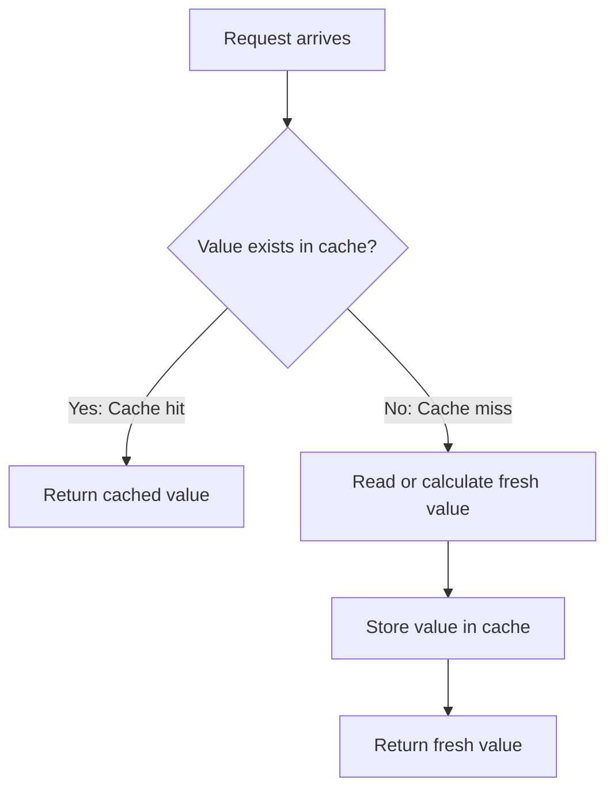
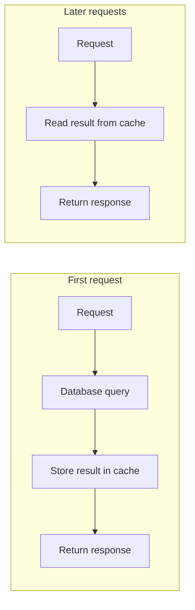
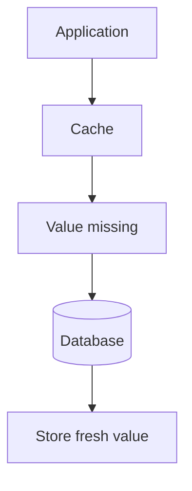
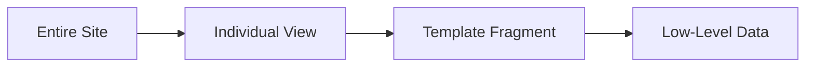
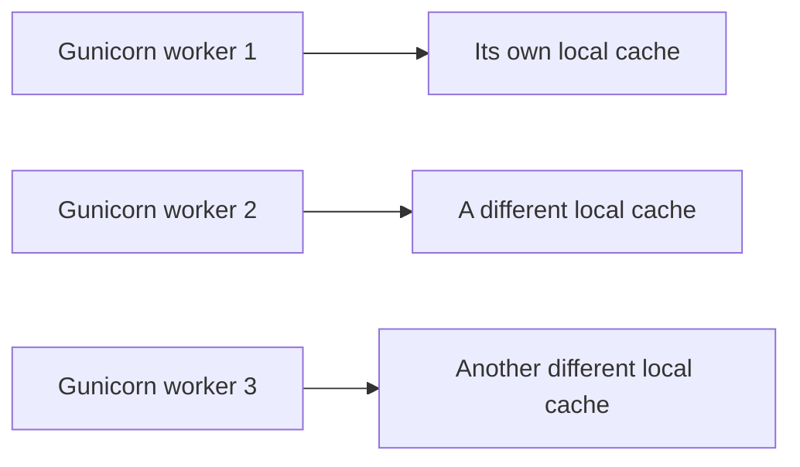
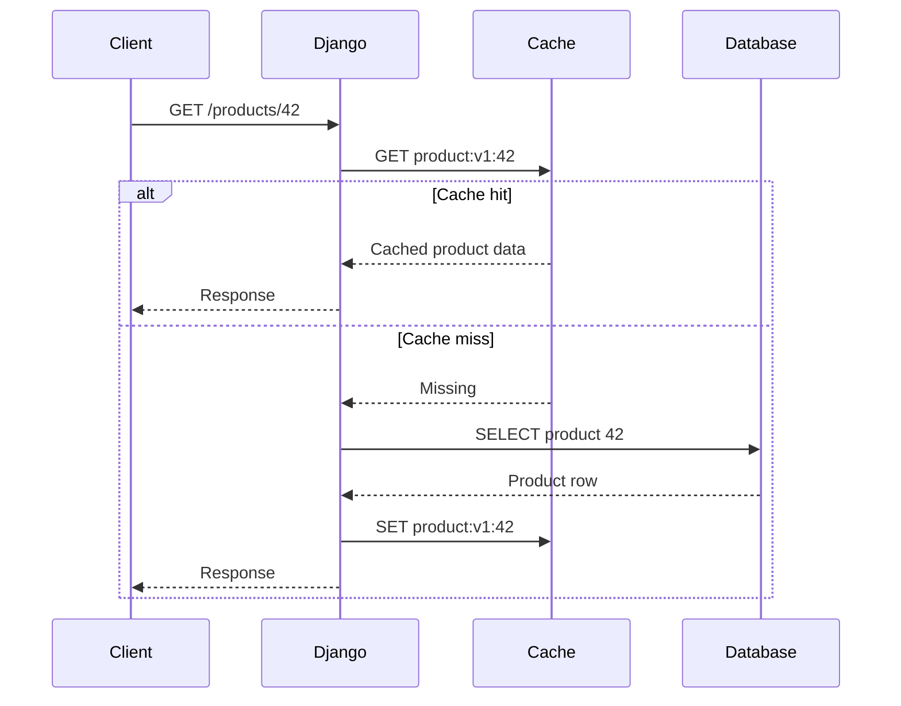
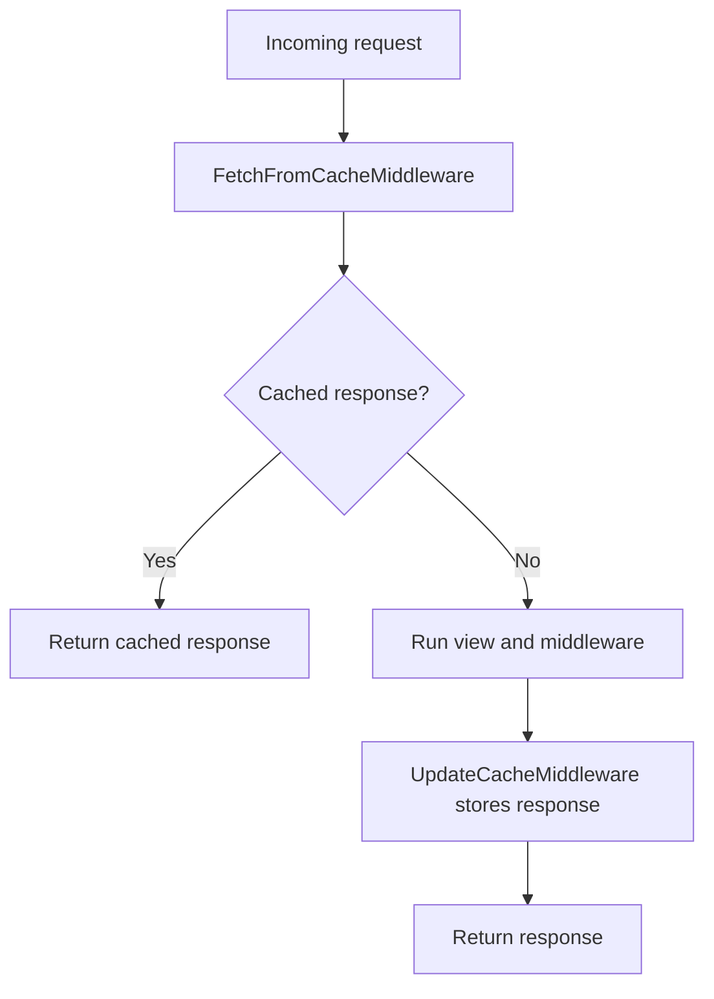
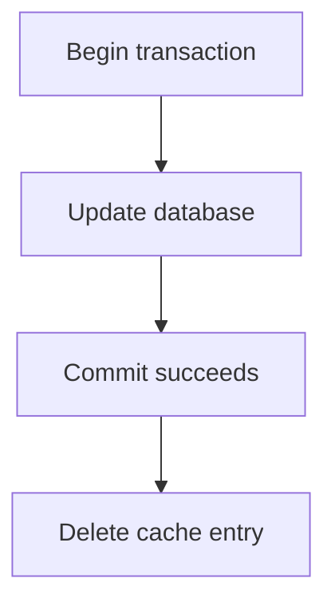
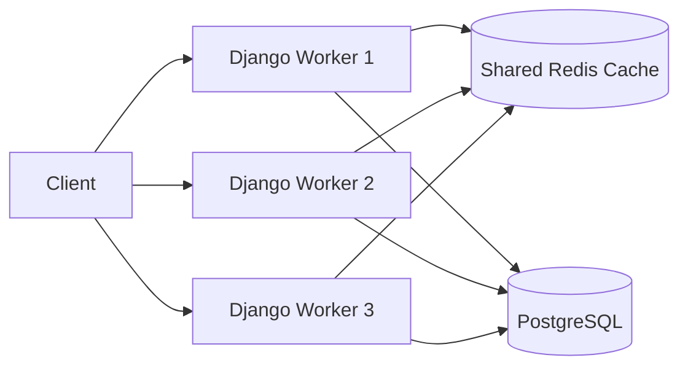

# Django's Caching Framework

> Django caching stores the result of expensive work—such as database queries, API calls, calculations, or rendered HTML—so later requests can reuse that result instead of performing the same work again.

## In short

- Django exposes four caching levels: per-site middleware, per-view `@cache_page`, template fragment ``, and the low-level `cache.get()` / `cache.set()` / `cache.get_or_set()` API — the low-level API gives the most control and is the one most business code needs.
- Choose the backend by deployment shape: `django.core.cache.backends.redis.RedisCache` or Memcached when several workers must share the cache, `LocMemCache` for development only (each process gets its own copy), `DatabaseCache` when there is no cache server, `DummyCache` to switch caching off without branching the code.
- Cache-aside is the default pattern: read the key, and on a miss compute the value and `cache.set()` it with a TTL. The database stays the source of truth; the cache is a disposable copy.
- Namespace every key — `KEY_PREFIX` separates environments and applications, `VERSION` (or a `:v2:` segment) survives shape changes, and keys must stay short and portable because Memcached caps them at 250 characters, so hash long filter sets.
- Never cache private or user-specific data under a shared key: put the user or tenant in the key, use `never_cache` or `cache_control(private=True)`, and set `Vary` headers such as `vary_on_cookie` so a shared cache cannot reuse one user's response for another.
- Invalidate after the write commits — `transaction.on_commit(lambda: cache.delete(key))` — so a rolled-back transaction never evicts a still-valid entry, and pair explicit deletion with a TTL as a backstop.



**Interview answer:** Measure which operation is actually slow first, then apply the narrowest level that covers it — `@cache_page` when a whole public response can be reused, `` when only one fragment is expensive, and the low-level `cache` API when a query, calculation, or external call is the cost. Configure a shared backend such as `django.core.cache.backends.redis.RedisCache` with a per-environment `KEY_PREFIX`, write cache-aside reads behind a central key-builder function, and give every entry a TTL. Invalidate explicitly with `cache.delete()` inside `transaction.on_commit()` when the underlying rows change.

**Gotcha:** Reaching for `@cache_page` on a view that renders anything user-specific. The cache key comes from the URL plus any `Vary` headers, so `/account/dashboard/` will serve the first user's rendered page to everyone else — such views need `never_cache` or a user-scoped low-level key instead.

---

# 1. Why Caching Is Needed

A normal Django request may perform several expensive operations:

- Query the database
- Call another service
- Execute business calculations
- Serialize data
- Render a template
- Build the final HTTP response

When the same result is requested repeatedly, recalculating it every time wastes CPU, database capacity, and response time.

For example, imagine an API endpoint that returns the top-selling products:

```python
def top_products(request):
    products = (
        Product.objects
        .filter(is_active=True)
        .order_by("-sales_count")[:20]
    )

    return JsonResponse({
        "products": [
            {"id": product.id, "name": product.name}
            for product in products
        ]
    })
```

If this endpoint receives 1,000 requests and the result changes only every few minutes, running the same query 1,000 times is unnecessary.

With caching:



The later requests avoid the database query.

---

# 2. How Caching Works

The most common caching pattern is called **cache-aside** or **lazy loading**.

## 2.1 Cache Hit

A **cache hit** means the requested value already exists in the cache.

```text
Application → Cache → Value found
```

This is the fast path.

## 2.2 Cache Miss

A **cache miss** means the value does not exist, has expired, or has been removed.



A cache miss is not necessarily an error. It is a normal part of caching.

## 2.3 Time to Live

A cached value normally has a **TTL**, or time to live.

```python
cache.set("exchange_rates", rates, timeout=300)
```

The value remains valid for 300 seconds. After that, it expires.

Django timeout behavior:

| Timeout | Meaning |
|---|---|
| Positive integer | Expire after that many seconds |
| `None` | Do not expire automatically |
| `0` | Expire immediately; effectively do not cache |

A TTL limits how long stale data may remain available.

---

# 3. What Should Be Cached

Good caching candidates are values that are:

- Expensive to calculate
- Read frequently
- Changed less frequently than they are read
- Safe to reuse
- Not required to be perfectly real-time

Common development use cases include:

- Product or category lists
- Dashboard totals
- Configuration data
- Permissions derived from several queries
- Results from slow external APIs
- Rendered public pages
- Generated reports
- Frequently requested lookup data
- Rate-limit counters
- Feature-flag values

## 3.1 Data That Usually Should Not Be Cached Carelessly

Be careful with:

- Bank balances
- Inventory during checkout
- One-time tokens
- Password-reset data
- Highly sensitive user information
- Responses that differ by user
- Data that must be immediately consistent
- Mutable model instances reused across requests

Caching is a performance optimization. It must not become the source of truth.

```text
Database = authoritative data
Cache    = temporary reusable copy
```

---

# 4. Caching Levels in Django

Django supports several caching levels.



| Level | What is cached | Typical use |
|---|---|---|
| Per-site cache | Entire successful pages | Mostly public sites |
| Per-view cache | Response from one view | Public API or page |
| Template fragment | Part of rendered HTML | Sidebar, navigation, widgets |
| Low-level API | Any supported Python value | Queries, calculations, service results |

The **low-level API** gives the most control and is the most commonly useful option in business applications.

---

# 5. Cache Backends

The cache backend decides where cached values are stored.

Django includes these built-in backends:

- Redis
- Memcached
- Local memory
- Database
- File system
- Dummy cache

## 5.1 Backend Comparison

| Backend | Shared across processes | Production use | Main characteristics |
|---|---:|---:|---|
| Redis | Yes | Recommended for many systems | Fast, feature-rich, supports persistence options |
| Memcached | Yes | Recommended | Very fast, simple distributed memory cache |
| Local memory | No | Usually no | Per-process and easy for development |
| Database | Yes | Limited cases | Simple but adds database load |
| File system | Depends on shared disk | Limited cases | Slower and operationally awkward |
| Dummy cache | No values stored | Development/testing | Implements API without caching |

## 5.2 Redis

Redis is a common production choice because:

- Multiple Django workers can share it
- Multiple application servers can share it
- It has expiration support
- It supports atomic operations
- It can also support locks, counters, queues, and other patterns

Django has a native Redis backend using `redis-py`.

## 5.3 Memcached

Memcached is a distributed, memory-only cache.

It is useful when you need a simple and very fast cache without Redis's broader data structures.

Supported Django backends include: `"django.core.cache.backends.memcached.PyMemcacheCache"`

and: `"django.core.cache.backends.memcached.PyLibMCCache"`

## 5.4 Local-Memory Cache

```python
CACHES = {
    "default": {
        "BACKEND": "django.core.cache.backends.locmem.LocMemCache",
        "LOCATION": "development-cache",
    }
}
```

Important limitation:



Values are not shared between processes. This can produce inconsistent behavior in production.

Use it mainly for:

- Local development
- Simple tests
- Single-process scripts
- Non-critical short-lived values

## 5.5 Database Cache

```python
CACHES = {
    "default": {
        "BACKEND": "django.core.cache.backends.db.DatabaseCache",
        "LOCATION": "application_cache",
    }
}
```

Create the cache table: `python manage.py createcachetable`

This is simple, but caching in the same database you are trying to protect from load may reduce the benefit.

## 5.6 Dummy Cache

```python
CACHES = {
    "default": {
        "BACKEND": "django.core.cache.backends.dummy.DummyCache",
    }
}
```

The dummy backend accepts cache calls but never stores anything.

It is useful when:

- Caching should be disabled locally
- Tests must always exercise the uncached path
- The code should not contain environment-specific cache conditions

---

# 6. Configuring Redis

Install the Redis Python client: `python -m pip install redis`

A basic Django configuration:

```python
# settings.py

CACHES = {
    "default": {
        "BACKEND": "django.core.cache.backends.redis.RedisCache",
        "LOCATION": "redis://127.0.0.1:6379/1",
        "TIMEOUT": 300,
        "KEY_PREFIX": "myapp",
    }
}
```

A production-style environment-based configuration:

```python
import os

CACHES = {
    "default": {
        "BACKEND": "django.core.cache.backends.redis.RedisCache",
        "LOCATION": os.environ["REDIS_CACHE_URL"],
        "TIMEOUT": 300,
        "KEY_PREFIX": os.getenv("CACHE_KEY_PREFIX", "myapp-prod"),
        "OPTIONS": {
            "socket_connect_timeout": 3,
            "socket_timeout": 3,
        },
    }
}
```

Example environment value: `REDIS_CACHE_URL=redis://redis:6379/1`

## 6.1 Multiple Caches

A project can configure multiple cache aliases.

```python
CACHES = {
    "default": {
        "BACKEND": "django.core.cache.backends.redis.RedisCache",
        "LOCATION": "redis://127.0.0.1:6379/1",
        "KEY_PREFIX": "general",
    },
    "reports": {
        "BACKEND": "django.core.cache.backends.redis.RedisCache",
        "LOCATION": "redis://127.0.0.1:6379/2",
        "TIMEOUT": 3600,
        "KEY_PREFIX": "reports",
    },
}
```

Access a named cache:

```python
from django.core.cache import caches

report_cache = caches["reports"]
report_cache.set("monthly:2026-07", report_data, timeout=3600)
```

Multiple aliases are useful when different data requires different:

- TTL policies
- storage limits
- Redis databases or clusters
- operational isolation
- eviction rules

---

# 7. The Low-Level Cache API

Import the default cache: `from django.core.cache import cache`

## 7.1 `set()`

```python
cache.set("site_name", "Example Store", timeout=300)
```

Return value is normally a boolean indicating whether the operation succeeded.

## 7.2 `get()`

```python
site_name = cache.get("site_name")
```

A missing key returns `None` by default.

That can be ambiguous when `None` is a valid cached value. Use a sentinel:

```python
missing = object()
value = cache.get("customer:42:discount", missing)

if value is missing:
    value = calculate_discount(customer_id=42)
    cache.set("customer:42:discount", value, timeout=600)
```

## 7.3 `add()`

`add()` stores a value only when the key does not already exist.

```python
created = cache.add("job:123:processing", True, timeout=60)

if not created:
    print("Another worker may already be processing the job")
```

This is useful for simple coordination, but behavior and atomic guarantees depend on the backend.

## 7.4 `get_or_set()`

```python
def load_settings():
    return AppSetting.objects.values("key", "value").in_bulk(
        field_name="key"
    )

settings_data = cache.get_or_set(
    "app-settings:v1",
    load_settings,
    timeout=600,
)
```

Passing a callable delays the expensive work until a cache miss occurs.

Conceptually:

```python
value = cache.get(key)

if value is missing:
    value = create_value()
    cache.set(key, value, timeout)

return value
```

## 7.5 `delete()` and `delete_many()`

```python
cache.delete("product:42")
```

```python
cache.delete_many([
    "product:42",
    "product-list:featured",
    "category:7:products",
])
```

## 7.6 `get_many()` and `set_many()`

These reduce repeated network round trips.

```python
cache.set_many(
    {
        "product:1": {"name": "Keyboard"},
        "product:2": {"name": "Mouse"},
        "product:3": {"name": "Monitor"},
    },
    timeout=300,
)
```

```python
products = cache.get_many([
    "product:1",
    "product:2",
    "product:3",
])
```

## 7.7 `touch()`

`touch()` changes a key's expiration without replacing its value.

```python
cache.touch("report:123", timeout=1800)
```

## 7.8 `incr()` and `decr()`

```python
cache.set("article:55:views", 0, timeout=None)

cache.incr("article:55:views")
cache.incr("article:55:views", 5)
cache.decr("article:55:views")
```

Atomicity depends on the backend. Redis and Memcached provide stronger native counter behavior than backends that implement increment as separate read and write operations.

## 7.9 `clear()`

```python
cache.clear()
```

This clears the selected cache.

Use it cautiously. In a shared Redis instance, a broad clear can remove values used by other parts of the system.

Prefer targeted deletion or key versioning.

---

# 8. Practical Cache-Aside Example

Consider a product-detail service.

```python
from django.core.cache import cache
from django.shortcuts import get_object_or_404

from shop.models import Product

PRODUCT_CACHE_TTL = 10 * 60

def product_cache_key(product_id: int) -> str:
    return f"product:v1:{product_id}"

def get_product_data(product_id: int) -> dict:
    key = product_cache_key(product_id)

    cached_data = cache.get(key)

    if cached_data is not None:
        return cached_data

    product = get_object_or_404(
        Product.objects.only(
            "id",
            "name",
            "price",
            "updated_at",
        ),
        id=product_id,
        is_active=True,
    )

    product_data = {
        "id": product.id,
        "name": product.name,
        "price": str(product.price),
        "updated_at": product.updated_at.isoformat(),
    }

    cache.set(key, product_data, timeout=PRODUCT_CACHE_TTL)

    return product_data
```

Request flow:



## 8.1 Cache Serialized Data, Not a Lazy QuerySet

Avoid caching an unevaluated `QuerySet`:

```python
# Avoid
cache.set("active-products", Product.objects.filter(is_active=True))
```

Prefer evaluated and simple data:

```python
product_data = list(
    Product.objects
    .filter(is_active=True)
    .values("id", "name", "price")
)

cache.set("active-products:v1", product_data, timeout=300)
```

This makes the cached value predictable and avoids hidden database behavior.

---

# 9. Per-View Caching

Use `cache_page()` when the entire response from a view can be reused.

```python
from django.http import JsonResponse
from django.views.decorators.cache import cache_page

@cache_page(60 * 5)
def public_statistics(request):
    return JsonResponse(calculate_public_statistics())
```

The response is cached for five minutes.

## 9.1 Cache in the URL Configuration

Caching can be configured outside the view:

```python
from django.urls import path
from django.views.decorators.cache import cache_page

from .views import public_statistics

urlpatterns = [
    path(
        "statistics/",
        cache_page(60 * 5)(public_statistics),
        name="public-statistics",
    ),
]
```

This keeps caching as a routing or deployment concern rather than embedding it in reusable view code.

## 9.2 Custom Cache Alias and Prefix

```python
@cache_page(
    60 * 15,
    cache="default",
    key_prefix="public-api",
)
def product_catalog(request):
    ...
```

## 9.3 Important Limitation

`cache_page()` is intended for content that is safe to reuse for the same URL.

It does not automatically understand all user-specific state such as:

- Session authentication
- Cookies
- Tenant context
- Custom request headers
- User permissions

A user-specific response must not accidentally be served to another user.

---

# 10. Template Fragment Caching

Use template fragment caching when only part of a page is expensive.

```django



    

```

The fragment is cached for 300 seconds.

## 10.1 Varying a Fragment

A fragment can have separate cached versions.

```django



    

```

This creates a different cache entry for each user.

However, user-level fragment caching can create many entries. Cache shared role-based or permission-based output when possible.

```django

    ...

```

## 10.2 Language-Specific Fragment

```django




    

```

## 10.3 Invalidating a Template Fragment

```python
from django.core.cache import cache
from django.core.cache.utils import make_template_fragment_key

key = make_template_fragment_key(
    "user_navigation",
    [str(user_id)],
)

cache.delete(key)
```

---

# 11. Per-Site Caching

Per-site caching caches eligible pages across the entire site.

Middleware order is important:

```python
MIDDLEWARE = [
    "django.middleware.cache.UpdateCacheMiddleware",

    # Other middleware
    "django.middleware.common.CommonMiddleware",

    "django.middleware.cache.FetchFromCacheMiddleware",
]
```

The update middleware must be near the beginning, and the fetch middleware must be near the end.

Required settings:

```python
CACHE_MIDDLEWARE_ALIAS = "default"
CACHE_MIDDLEWARE_SECONDS = 600
CACHE_MIDDLEWARE_KEY_PREFIX = "website"
```

Simplified flow:



Django's per-site middleware caches eligible:

- `GET` responses
- `HEAD` responses
- Responses with status `200`
- Responses whose headers permit caching

URLs with different query strings are cached separately.

```text
/products?page=1  → Cache entry A
/products?page=2  → Cache entry B
```

Per-site caching is best suited to mostly public sites. It requires careful exclusion of private pages.

---

# 12. Cache Keys and Namespacing

A cache key should clearly identify:

- The resource
- The resource identifier
- Relevant variations
- A schema or logic version

Example: `product:v2:42`

A more complex example: `tenant:8:dashboard:v3:2026-07`

## 12.1 Good Key Design

```python
def dashboard_cache_key(
    tenant_id: int,
    month: str,
) -> str:
    return f"tenant:{tenant_id}:dashboard:v3:{month}"
```

Properties of a good key:

- Deterministic
- Short
- Easy to inspect
- Namespaced
- Includes tenant or user when required
- Includes a version when the data shape may change

## 12.2 `KEY_PREFIX`

When several environments share one cache server:

```python
CACHES = {
    "default": {
        "BACKEND": "django.core.cache.backends.redis.RedisCache",
        "LOCATION": "redis://redis:6379/1",
        "KEY_PREFIX": "myapp-production",
    }
}
```

Use a different prefix for:

- Development
- Staging
- Production
- Separate applications
- Separate tenants, when the architecture requires it

Without prefixes, one environment may read another environment's cached data.

## 12.3 Cache Versions

```python
cache.set("product:42", product_data, version=2)

product_data = cache.get("product:42", version=2)
```

Django combines the prefix, version, and key internally.

You can also increment a key's version: `cache.incr_version("product:42")`

Versioning is useful after changing:

- Cached object structure
- Serialization format
- Business logic
- Permission logic

## 12.4 Key Length

Memcached keys cannot exceed 250 characters and cannot contain certain whitespace or control characters.

Even when using Redis, keep keys reasonably short and portable.

For a long parameter set, hash the variable portion:

```python
import hashlib
import json

def search_cache_key(filters: dict) -> str:
    normalized = json.dumps(
        filters,
        sort_keys=True,
        separators=(",", ":"),
    )

    digest = hashlib.sha256(normalized.encode()).hexdigest()

    return f"product-search:v1:{digest}"
```

---

# 13. Cache Invalidation

Cache invalidation means removing or replacing cached values when the underlying data changes.

There are four common strategies.

## 13.1 TTL-Based Expiration

```python
cache.set(key, value, timeout=300)
```

Advantages:

- Simple
- Self-cleaning
- Limits stale-data duration

Disadvantage:

- Data may remain stale until expiration

Use TTL caching for data where a small delay is acceptable.

## 13.2 Explicit Deletion

```python
product.save()
cache.delete(product_cache_key(product.id))
```

The next read produces a cache miss and reloads fresh data.

## 13.3 Delete After Transaction Commit

Invalidating inside a transaction can create inconsistency if the transaction later rolls back.

Prefer:

```python
from django.db import transaction

def update_product(product, validated_data):
    for field, value in validated_data.items():
        setattr(product, field, value)

    product.save()

    transaction.on_commit(
        lambda: cache.delete(product_cache_key(product.id))
    )
```

Flow:



If the database transaction rolls back, the cache is not invalidated unnecessarily.

## 13.4 Versioned Keys

Instead of deleting many old keys, change the namespace version:

```text
category-products:v1:7
category-products:v2:7
```

The application starts reading `v2`. Old `v1` entries become unused and eventually expire.

This is helpful during deployments and large cache-shape changes.

## 13.5 Invalidation Dependency Problem

Updating one product might affect several cache entries:

```text
product:v1:42
category:v1:7:products
homepage:v1:featured-products
search:v1:<hash>
dashboard:v1:sales-summary
```

This is why caching broad query results can be harder than caching individual records.

A practical approach is:

1. Keep keys structured.
2. Centralize key-generation functions.
3. Use short TTLs for broad lists.
4. Explicitly invalidate important exact keys.
5. Use namespace versions for large invalidations.

---

# 14. User-Specific and Private Data

The biggest caching risk is serving one user's data to another user.

Consider:

```python
@cache_page(300)
@login_required
def account_dashboard(request):
    return render(
        request,
        "account/dashboard.html",
        {"user": request.user},
    )
```

Caching only by URL could make `/account/dashboard/` unsafe because every user requests the same URL.

## 14.1 Safer Options

### Do Not Cache the View

```python
from django.views.decorators.cache import never_cache

@never_cache
@login_required
def account_dashboard(request):
    ...
```

### Cache Only Shared Subparts

```python
shared_stats = cache.get_or_set(
    "dashboard:shared-stats:v1",
    calculate_shared_stats,
    timeout=300,
)
```

### Include User and Tenant in the Key

```python
key = (
    f"tenant:{request.user.tenant_id}:"
    f"user:{request.user.id}:dashboard:v1"
)
```

### Mark Responses Private

```python
from django.views.decorators.cache import cache_control

@cache_control(private=True)
def private_view(request):
    ...
```

A private HTTP response may be cached by the user's browser but should not be reused by a shared proxy cache.

## 14.2 `Vary` Headers

A `Vary` header tells caches that a response changes based on a request header.

```python
from django.views.decorators.vary import vary_on_cookie

@vary_on_cookie
def localized_homepage(request):
    ...
```

Common variations include:

- Cookie
- Authorization
- Accept-Language
- Custom tenant header

Be careful: varying on cookies can create many cache entries and lower the hit rate.

## 14.3 Django 6.0 Security Behavior

Modern Django patch releases include important protections for cached responses involving the `Authorization` header.

However, this does not make every authenticated page safe to cache automatically. Session-authenticated content, cookie-dependent output, tenant-aware data, and permission-sensitive responses still require explicit design.

Always run the latest patch release of your supported Django version.

---

# 15. Asynchronous Cache Operations

Django provides asynchronous variants of base cache operations. Their names start with `a`.

Examples:

```python
from django.core.cache import cache

async def get_product_summary(product_id: int):
    key = f"product-summary:v1:{product_id}"

    summary = await cache.aget(key)

    if summary is not None:
        return summary

    summary = await build_product_summary(product_id)

    await cache.aset(key, summary, timeout=300)

    return summary
```

Other examples include:

```python
await cache.aadd(...)
await cache.adelete(...)
await cache.adelete_many(...)
await cache.aget_many(...)
await cache.aset_many(...)
```

Use asynchronous cache APIs inside async views or async services so synchronous cache access does not unnecessarily block the async request flow.

---

# 16. Cache Stampede and Race Conditions

When a popular key expires, every concurrent request misses at once and recomputes the same value, which defeats the purpose of caching and can overload the database.

Django's built-in first line of defence is `cache.get_or_set()`:

```python
value = cache.get_or_set(
    "expensive-report:v1",
    generate_report,
    timeout=600,
)
```

It handles the simple case, but it is not atomic across processes — two workers can still both see the miss and both compute. Django's generic cache API also provides no universal distributed-lock abstraction.

The full set of mitigations — TTL jitter, a distributed lock, stale-while-revalidate, and probabilistic early recomputation — is covered in [Caching Layers and Stampede](../system-design/caching-layers-stampede.md).

---

# 17. Testing and Monitoring

Caching should be measurable and testable.

## 17.1 Unit Testing Cache Behavior

```python
from django.core.cache import cache
from django.test import TestCase

class ProductCacheTests(TestCase):
    def setUp(self):
        cache.clear()

    def tearDown(self):
        cache.clear()

    def test_product_is_cached(self):
        cache.set("product:v1:42", {"name": "Keyboard"}, timeout=60)

        value = cache.get("product:v1:42")

        self.assertEqual(value["name"], "Keyboard")
```

## 17.2 Test the Miss Path

```python
def test_missing_product_cache_returns_none(self):
    self.assertIsNone(cache.get("product:v1:999"))
```

## 17.3 Override Cache Settings

```python
from django.test import TestCase, override_settings

@override_settings(
    CACHES={
        "default": {
            "BACKEND": "django.core.cache.backends.locmem.LocMemCache",
            "LOCATION": "tests",
        }
    }
)
class CachedServiceTests(TestCase):
    ...
```

## 17.4 Avoid Hidden Test Dependencies

Tests should not depend on data left in the cache by another test.

Use: `cache.clear()`

or uniquely namespaced test keys.

## 17.5 Metrics to Monitor

Useful production metrics include:

| Metric | Why it matters |
|---|---|
| Cache hit rate | Shows how often caching avoids expensive work |
| Cache miss rate | Helps identify ineffective keys or short TTLs |
| Read latency | Detects Redis or network issues |
| Write latency | Detects backend pressure |
| Eviction count | Indicates memory pressure |
| Memory usage | Prevents unexpected eviction or failure |
| Error rate | Shows unavailable cache connections |
| Database query rate | Confirms whether caching reduces DB load |

Hit rate: `Hit Rate = Cache Hits / (Cache Hits + Cache Misses)`

A high hit rate is useful only when the cached data is correct and valuable.

## 17.6 Cache Failure Strategy

Decide what should happen when Redis is unavailable.

Possible policies: `Cache failure → Query database → Return correct but slower response`

or: `Cache failure → Fail request`

Most ordinary read caches should fail open to the database when practical. Rate limiters, idempotency controls, and distributed locks may require stricter behavior because bypassing them can affect correctness.

---

# 18. Production Design Example

Consider a multi-tenant reporting API.

Requirements:

- A report is expensive to generate.
- Reports differ by tenant and month.
- Reports may remain cached for 30 minutes.
- Updating a transaction invalidates the tenant's monthly report.
- Several application workers share the cache.

## 18.1 Key Builder

```python
def monthly_report_cache_key(
    tenant_id: int,
    year: int,
    month: int,
) -> str:
    return (
        f"tenant:{tenant_id}:"
        f"monthly-report:v2:{year}-{month:02d}"
    )
```

## 18.2 Cached Read

```python
from django.core.cache import caches

report_cache = caches["reports"]

def get_monthly_report(
    tenant_id: int,
    year: int,
    month: int,
) -> dict:
    key = monthly_report_cache_key(
        tenant_id,
        year,
        month,
    )

    return report_cache.get_or_set(
        key,
        lambda: generate_monthly_report(
            tenant_id=tenant_id,
            year=year,
            month=month,
        ),
        timeout=30 * 60,
    )
```

## 18.3 Transaction-Safe Invalidation

```python
from django.db import transaction

def update_transaction(transaction_record, data):
    transaction_record.amount = data["amount"]
    transaction_record.save(update_fields=["amount"])

    key = monthly_report_cache_key(
        tenant_id=transaction_record.tenant_id,
        year=transaction_record.date.year,
        month=transaction_record.date.month,
    )

    transaction.on_commit(
        lambda: report_cache.delete(key)
    )
```

## 18.4 Architecture



Why this design works:

- All workers share the same cache.
- Tenant IDs prevent cross-tenant collisions.
- Version `v2` protects against data-shape changes.
- TTL prevents indefinitely stale reports.
- `transaction.on_commit()` avoids invalidating before a successful database commit.
- The database remains the source of truth.

---

# 19. Best-Practice Checklist

## 19.1 Before Adding a Cache

- Measure the slow operation first.
- Confirm that repeated work actually occurs.
- Decide how stale the data may be.
- Identify every input that changes the result.
- Decide how the value will be invalidated.

## 19.2 Cache-Key Design

- Use a consistent key format.
- Include resource IDs.
- Include user or tenant IDs when required.
- Include language, role, or filters when they affect output.
- Add a version to protect against format changes.
- Use environment-specific `KEY_PREFIX` values.

## 19.3 Data Safety

- Never treat the cache as permanent storage.
- Do not cache sensitive responses using a shared key.
- Do not expose Redis or Memcached directly to the public internet.
- Use authentication, private networking, and encryption where required.
- Run the latest supported Django patch release.

## 19.4 Performance

- Prefer shared Redis or Memcached for multi-worker production systems.
- Use `get_many()` and `set_many()` for batches.
- Avoid caching data that changes more frequently than it is read.
- Add TTL jitter when many keys expire together.
- Monitor hit rate, latency, memory, and evictions.

## 19.5 Invalidation

- Centralize key-builder functions.
- Invalidate after successful transaction commit.
- Prefer targeted deletion over `cache.clear()`.
- Use short TTLs for broad or hard-to-invalidate query results.
- Use namespace versions during large cache-format changes.

---

## Official References

- [Django 6.0 — Django's cache framework](https://docs.djangoproject.com/en/6.0/topics/cache/)
- [Django 6.0 — Cache settings](https://docs.djangoproject.com/en/6.0/ref/settings/#caches)
- [Django 6.0 — HTTP cache decorators](https://docs.djangoproject.com/en/6.0/topics/http/decorators/#caching)
- [Django download and supported versions](https://www.djangoproject.com/download/)
