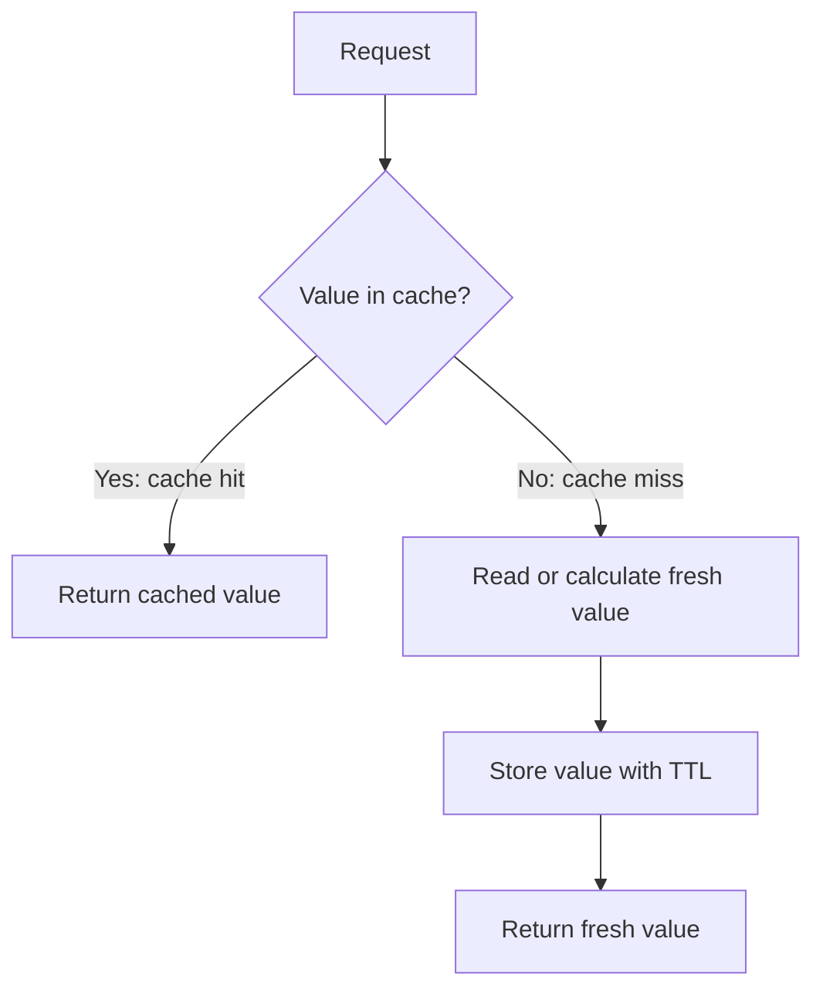
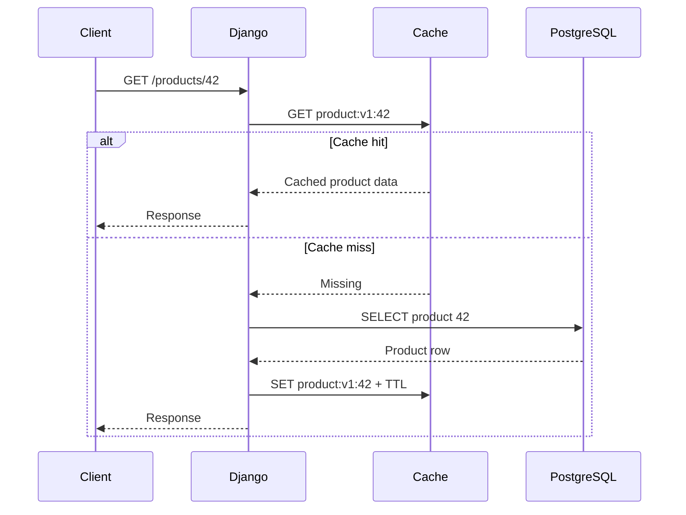
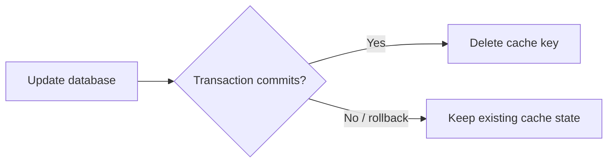
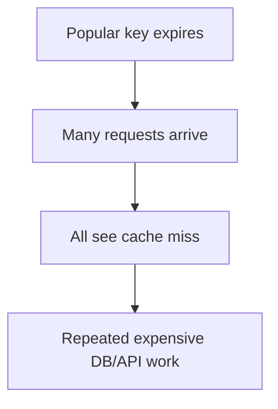
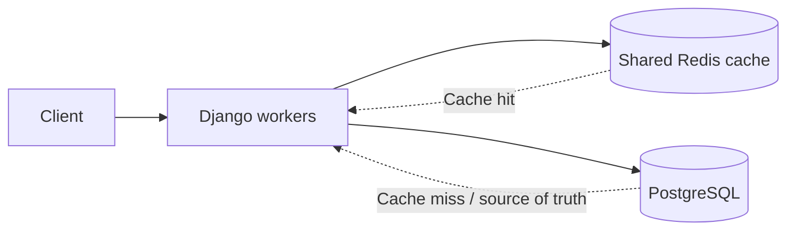

# Django's Caching Framework

> Django caching stores reusable results of expensive work—such as database queries, calculations, external API responses, or rendered content—so later requests can return the same result without repeating the work.

Django provides caching at multiple levels, but in normal backend development the **low-level cache API with Redis** is usually the most flexible approach.

> **Current version note:** Django 6.1 was released on August 5, 2026. In Django 6.1, cache keys for pages or template fragments that vary on additional information changed, so the first request after an upgrade can produce an expected cache miss.

## Index

1. [Core Caching Concept](#1-core-caching-concept)
2. [Caching Levels in Django](#2-caching-levels-in-django)
3. [Cache Backends](#3-cache-backends)
4. [Redis Configuration](#4-redis-configuration)
5. [Low-Level Cache API](#5-low-level-cache-api)
6. [Practical Cache-Aside Example](#6-practical-cache-aside-example)
7. [Cache Keys, TTL, and Invalidation](#7-cache-keys-ttl-and-invalidation)
8. [Caching Public vs Private Data](#8-caching-public-vs-private-data)
9. [Concurrency and Async Caching](#9-concurrency-and-async-caching)
10. [Testing, Monitoring, and Best Practices](#10-testing-monitoring-and-best-practices)

---

## 1. Core Caching Concept

A normal Django request may need to:

- query PostgreSQL,
- call another service,
- perform calculations,
- serialize data,
- render a template or build a response.

If the same expensive result is requested many times but changes only occasionally, repeating the work wastes database capacity and increases response time.

### Cache Hit and Cache Miss



- **Cache hit:** the value exists and can be returned immediately.
- **Cache miss:** the value is missing or expired, so the application loads fresh data.
- **TTL (Time to Live):** controls how long a cached value remains valid.

```python
cache.set("exchange-rates:v1", rates, timeout=300)
```

Django timeout behavior:

| Timeout | Meaning |
|---|---|
| Positive integer | Expire after that many seconds |
| `None` | Do not expire automatically |
| `0` | Do not cache the value |

The database or upstream service should remain the **source of truth**. The cache is a disposable copy.

### Good Caching Candidates

Cache data that is:

- expensive to compute or retrieve,
- requested frequently,
- changed less often than it is read,
- safe to reuse,
- allowed to be slightly stale.

Typical examples are product lists, dashboard totals, lookup data, configuration, permissions derived from several queries, and slow external API results.

Avoid careless caching of balances, one-time tokens, checkout inventory, password-reset data, or highly user-specific responses.

---

## 2. Caching Levels in Django

Django supports four common caching levels.


| Level | What is cached | Typical use |
|---|---|---|
| Per-site | Eligible full-page responses | Mostly public sites |
| Per-view | One view's response | Public page or API response |
| Template fragment | Part of rendered HTML | Sidebar, navigation, widget |
| Low-level API | Any cacheable Python value | Queries, calculations, service results |

### Per-View Cache

Use `cache_page()` when the **entire response** can safely be reused.

```python
from django.views.decorators.cache import cache_page

@cache_page(60 * 5)
def public_statistics(request):
    return JsonResponse(calculate_public_statistics())
```

### Template Fragment Cache

Use fragment caching when only one part of a page is expensive.

```django



    

```

### Per-Site Cache

Per-site caching uses middleware:

```python
MIDDLEWARE = [
    "django.middleware.cache.UpdateCacheMiddleware",
    # other middleware...
    "django.middleware.common.CommonMiddleware",
    "django.middleware.cache.FetchFromCacheMiddleware",
]
```

`UpdateCacheMiddleware` must be near the beginning and `FetchFromCacheMiddleware` near the end. This approach is most suitable for sites where large parts of the response are public and reusable.

For most business applications, the **low-level API** provides better control because only the expensive data is cached.

---

## 3. Cache Backends

The cache backend decides where cached values are stored.

| Backend | Shared across workers? | Normal use |
|---|---:|---|
| Redis | Yes | Common production choice |
| Memcached | Yes | Fast distributed memory cache |
| Local memory | No | Development and small single-process cases |
| Database | Yes | When a dedicated cache server is unavailable |
| File system | Depends on storage | Limited/special cases |
| Dummy cache | No values stored | Disable caching without changing application code |

### Redis

Django has a built-in Redis backend:

```text
django.core.cache.backends.redis.RedisCache
```

Redis is a strong default for production because multiple Django workers and application servers can share the same cache.

### Memcached

Supported Django backends include:

```text
django.core.cache.backends.memcached.PyMemcacheCache
django.core.cache.backends.memcached.PyLibMCCache
```

Memcached is a good option when the requirement is a simple distributed in-memory cache.

### Local Memory

```python
CACHES = {
    "default": {
        "BACKEND": "django.core.cache.backends.locmem.LocMemCache",
        "LOCATION": "development-cache",
    }
}
```

`LocMemCache` is **per process**. With multiple Gunicorn/Uvicorn workers, every process gets a different cache, so it is usually not appropriate as the main production cache.

---

## 4. Redis Configuration

Install the supported Redis Python client:

```bash
python -m pip install redis
```

A practical configuration is:

```python
# settings.py
import os

CACHES = {
    "default": {
        "BACKEND": "django.core.cache.backends.redis.RedisCache",
        "LOCATION": os.environ["REDIS_CACHE_URL"],
        "TIMEOUT": 300,
        "KEY_PREFIX": os.getenv("CACHE_KEY_PREFIX", "myapp-prod"),
    }
}
```

Example environment value:

```text
REDIS_CACHE_URL=redis://redis:6379/1
```

### Multiple Cache Aliases

Different cache aliases are useful when data needs different TTLs or operational isolation.

```python
CACHES = {
    "default": {
        "BACKEND": "django.core.cache.backends.redis.RedisCache",
        "LOCATION": "redis://127.0.0.1:6379/1",
        "KEY_PREFIX": "general",
    },
    "reports": {
        "BACKEND": "django.core.cache.backends.redis.RedisCache",
        "LOCATION": "redis://127.0.0.1:6379/2",
        "TIMEOUT": 1800,
        "KEY_PREFIX": "reports",
    },
}
```

```python
from django.core.cache import caches

report_cache = caches["reports"]
```

---

## 5. Low-Level Cache API

The default cache is available through:

```python
from django.core.cache import cache
```

The methods used most often are:

| Method | Purpose |
|---|---|
| `cache.get()` | Read one value |
| `cache.set()` | Store or replace one value |
| `cache.get_or_set()` | Read a value or create it on a miss |
| `cache.add()` | Store only if the key does not already exist |
| `cache.delete()` | Remove one key |
| `cache.get_many()` | Read multiple keys in one call |
| `cache.set_many()` | Store multiple values efficiently |
| `cache.touch()` | Change expiration without replacing the value |
| `cache.incr()` / `decr()` | Update counters when supported by the backend |

### Handling a Cached `None`

`cache.get()` returns `None` for a missing key by default. If `None` is also a valid cached value, use a sentinel.

```python
missing = object()
value = cache.get("customer:42:discount", missing)

if value is missing:
    value = calculate_discount(customer_id=42)
    cache.set("customer:42:discount", value, timeout=600)
```

### Batch Operations

When several values are needed together, `get_many()` and `set_many()` reduce cache/network round trips.

```python
cache.set_many(
    {
        "product:1": {"name": "Keyboard"},
        "product:2": {"name": "Mouse"},
    },
    timeout=300,
)

products = cache.get_many(["product:1", "product:2"])
```

---

## 6. Practical Cache-Aside Example

**Cache-aside** is the most common pattern in Django application code:

1. Build the cache key.
2. Read the cache.
3. On a hit, return the cached value.
4. On a miss, query the database.
5. Store a serialized result with a TTL.
6. Return the fresh value.

```python
from django.core.cache import cache
from django.shortcuts import get_object_or_404
from shop.models import Product

PRODUCT_CACHE_TTL = 10 * 60


def product_cache_key(product_id: int) -> str:
    return f"product:v1:{product_id}"


def get_product_data(product_id: int) -> dict:
    key = product_cache_key(product_id)
    cached = cache.get(key)

    if cached is not None:
        return cached

    product = get_object_or_404(
        Product.objects.only("id", "name", "price", "updated_at"),
        id=product_id,
        is_active=True,
    )

    data = {
        "id": product.id,
        "name": product.name,
        "price": str(product.price),
        "updated_at": product.updated_at.isoformat(),
    }

    cache.set(key, data, timeout=PRODUCT_CACHE_TTL)
    return data
```



### Cache Simple Serialized Data

Prefer dictionaries, strings, IDs, or other predictable values instead of relying on lazy ORM behavior.

```python
product_data = list(
    Product.objects
    .filter(is_active=True)
    .values("id", "name", "price")
)

cache.set("active-products:v1", product_data, timeout=300)
```

This keeps the cached value independent from future ORM queries.

---

## 7. Cache Keys, TTL, and Invalidation

Caching is easy to add; **correct invalidation** is the harder part.

### Key Design

A good key should identify every input that changes the result.

```text
product:v1:42
tenant:8:dashboard:v2:2026-08
```

A useful pattern is:

```text
<scope>:<resource>:<version>:<identifier>
```

For multi-tenant applications, include the tenant ID whenever the result is tenant-specific.

```python
def dashboard_cache_key(tenant_id: int, month: str) -> str:
    return f"tenant:{tenant_id}:dashboard:v2:{month}"
```

Use Django's `KEY_PREFIX` to separate environments such as development, staging, and production. Django also supports cache `VERSION` values for controlled key versioning.

Memcached keys are limited to 250 characters, and Django warns about keys that would be invalid for Memcached. Hash long filter/query combinations instead of putting the entire input in the key.

### TTL-Based Expiration

```python
cache.set(key, value, timeout=300)
```

TTL is simple and limits how long stale data survives, but data can remain stale until the key expires.

### Explicit Invalidation

```python
product.save()
cache.delete(product_cache_key(product.id))
```

### Invalidate After Transaction Commit

When the database update runs inside a transaction, invalidate only after a successful commit.

```python
from django.db import transaction


def update_product(product, validated_data):
    for field, value in validated_data.items():
        setattr(product, field, value)

    product.save()
    key = product_cache_key(product.id)

    transaction.on_commit(lambda: cache.delete(key))
```



In production, a good default is **explicit invalidation for important exact keys + a TTL as a safety backstop**.

---

## 8. Caching Public vs Private Data

The biggest caching risk is serving one user's data to another user.

Avoid blindly using full-page caching on authenticated views such as:

```text
/account/dashboard/
```

because many users may request the same URL while receiving different content.

### Safer Options

For private pages, either disable full-page caching:

```python
from django.views.decorators.cache import never_cache

@never_cache
def account_dashboard(request):
    ...
```

or cache only the reusable data under a user- or tenant-specific key:

```python
key = (
    f"tenant:{request.user.tenant_id}:"
    f"user:{request.user.id}:dashboard:v1"
)
```

HTTP cache headers can also mark a response as private:

```python
from django.views.decorators.cache import cache_control

@cache_control(private=True)
def private_view(request):
    ...
```

When a response changes based on request headers or cookies, use the appropriate `Vary` behavior, for example `vary_on_cookie`.

### Django 6.1 Security Context

Recent Django releases fixed several cache-related private-data issues, including handling of `Authorization`, `Cache-Control: private`, and `Vary` headers. Keep Django on a currently supported patch release, but still design authenticated/session-based caching explicitly—the framework cannot know every application-specific tenant, permission, cookie, or header that changes a response.

---

## 9. Concurrency and Async Caching

### Cache Stampede

A **cache stampede** happens when a popular key expires and many requests miss at the same time.



`cache.get_or_set()` is convenient:

```python
value = cache.get_or_set(
    "expensive-report:v1",
    generate_report,
    timeout=600,
)
```

but it should not be treated as a universal distributed lock. Under high concurrency, more than one worker may still start expensive work. For very costly operations, common strategies include:

- a distributed lock,
- TTL jitter so many keys do not expire together,
- serving slightly stale data while one worker refreshes it,
- background regeneration for predictable reports.

### Async Cache Methods

Django exposes async variants of base cache methods using an `a` prefix:

```python
async def get_summary(product_id: int):
    key = f"product-summary:v1:{product_id}"

    summary = await cache.aget(key)
    if summary is not None:
        return summary

    summary = await build_product_summary(product_id)
    await cache.aset(key, summary, timeout=300)
    return summary
```

Examples include `aget()`, `aset()`, `aadd()`, `adelete()`, and `aget_many()`.

Django's backend-level asynchronous cache support is still developing, so use async cache methods where they fit the async request flow, but measure the real behavior of the selected backend.

---

## 10. Testing, Monitoring, and Best Practices

### Test Cache Behavior

Tests should cover both the hit and miss paths and should not depend on cache state from another test.

```python
from django.core.cache import cache
from django.test import TestCase


class ProductCacheTests(TestCase):
    def setUp(self):
        cache.clear()

    def tearDown(self):
        cache.clear()

    def test_cached_product_can_be_read(self):
        cache.set(
            "product:v1:42",
            {"name": "Keyboard"},
            timeout=60,
        )

        value = cache.get("product:v1:42")
        self.assertEqual(value["name"], "Keyboard")
```

### Monitor the Right Metrics

| Metric | What it tells you |
|---|---|
| Hit rate | How often expensive work is avoided |
| Miss rate | Whether keys or TTLs are ineffective |
| Cache latency | Redis/Memcached or network performance |
| Evictions | Whether memory pressure is removing keys |
| Cache errors | Backend availability problems |
| Database query rate | Whether caching actually reduces DB work |

```text
Hit Rate = Hits / (Hits + Misses)
```

A high hit rate is useful only if the cached data is correct and the cache is removing meaningful work.

### Failure Strategy

For ordinary read caches, a practical fallback is often:

```text
Cache unavailable -> Query database -> Return correct but slower response
```

However, do not automatically use the same fail-open approach for correctness-sensitive features such as rate limiting, idempotency controls, or distributed locks.

### Best-Practice Checklist

- Measure the slow operation before adding caching.
- Cache at the narrowest useful level.
- Prefer shared Redis or Memcached for multi-worker production deployments.
- Keep the database or upstream service as the source of truth.
- Centralize cache-key builder functions.
- Include tenant/user/filter/language inputs when they change the result.
- Use `KEY_PREFIX` to separate environments.
- Add a version when cached data shape or business logic changes.
- Give normal cache entries a TTL unless there is a strong reason not to.
- Invalidate important keys after successful transaction commit.
- Prefer targeted deletion over `cache.clear()`.
- Never place private user data under a shared key.
- Monitor hit rate, latency, memory usage, evictions, errors, and database load.
- Keep Django on a currently supported patch release.

---

## Final Takeaway

For most Django business applications, a strong default design is:



Use **Redis + the low-level cache API + cache-aside + structured keys + TTL + transaction-safe invalidation**. Apply full-page or fragment caching only when the response is safe to reuse. This gives good performance without making the cache responsible for application correctness.
