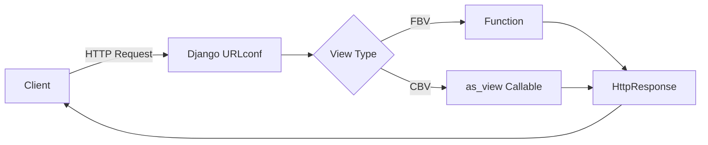
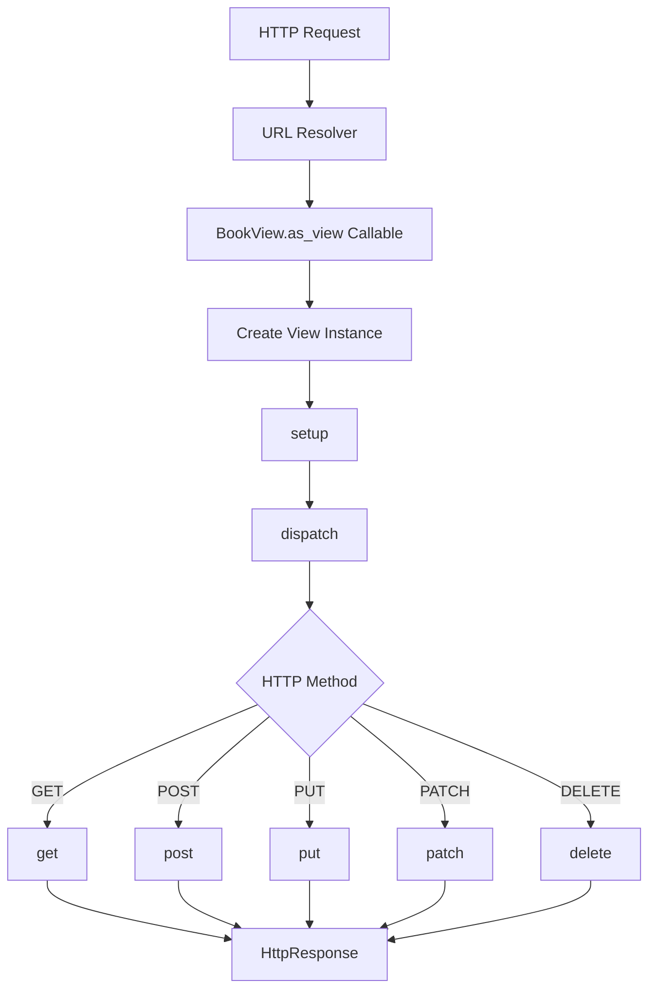

# Class-Based Views vs Function-Based Views in Django

> Django views can be written as **functions (FBVs)** or **classes (CBVs)**. Both receive an `HttpRequest` and return an `HttpResponse`. The real difference is how the code is organized, extended, and reused.

> **Version note:** This section is verified against **Django 6.0 documentation**. At the time of this update, Django **6.0.6** is the latest official stable release.

## Index

1. [Core Idea](#1-core-idea)
2. [Function-Based Views](#2-function-based-views)
3. [Class-Based Views](#3-class-based-views)
4. [Generic Class-Based Views](#4-generic-class-based-views)
5. [Authentication, Permissions, and Reuse](#5-authentication-permissions-and-reuse)
6. [Practical Example: Same Feature in FBV and CBV](#6-practical-example-same-feature-in-fbv-and-cbv)
7. [Async Views](#7-async-views)
8. [FBV vs CBV: How to Choose](#8-fbv-vs-cbv-how-to-choose)
9. [Best Practices and Interview Focus](#9-best-practices-and-interview-focus)

---

# 1. Core Idea

A Django view follows one simple contract:

```text
HttpRequest -> View -> HttpResponse
```

The view may be implemented as a function or a class.

```python
# Function-Based View

def book_list(request):
    ...


# Class-Based View

class BookListView(View):
    def get(self, request):
        ...
```

Both approaches are fully supported. Django does not treat CBVs as a replacement for FBVs.



## 1.1 Main Difference

| Function-Based View | Class-Based View |
|---|---|
| One Python function | One Python class |
| HTTP methods usually handled with `if request.method` | HTTP methods handled by `get()`, `post()`, `put()`, etc. |
| Reuse through decorators, helpers, and services | Reuse through mixins, inheritance, and hook methods |
| Control flow is explicit | Framework structure reduces repeated code |

---

# 2. Function-Based Views

A **Function-Based View (FBV)** is a normal Python function that accepts a request and returns a response.

## 2.1 Basic Structure

```python
from django.shortcuts import render


def book_list(request):
    return render(request, "books/book_list.html")
```

URL registration is direct because the function is already callable:

```python
from django.urls import path
from .views import book_list

urlpatterns = [
    path("books/", book_list, name="book-list"),
]
```

## 2.2 Handling Multiple HTTP Methods

```python
from django.shortcuts import redirect, render
from .forms import BookForm


def book_create(request):
    if request.method == "POST":
        form = BookForm(request.POST)

        if form.is_valid():
            book = form.save()
            return redirect("book-detail", pk=book.pk)
    else:
        form = BookForm()

    return render(request, "books/book_form.html", {"form": form})
```

The complete flow is visible from top to bottom, which is often useful when the endpoint has custom business behavior.

## 2.3 Where FBVs Fit Well

FBVs are commonly a good choice for:

- Small or one-off endpoints.
- Health checks.
- Webhook receivers.
- File download/export endpoints.
- Highly custom workflows.
- Logic that is easier to understand sequentially than through inherited hooks.

For example, a health endpoint does not need a generic class hierarchy:

```python
from django.http import JsonResponse


def health_check(request):
    return JsonResponse({"status": "ok"})
```

---

# 3. Class-Based Views

A **Class-Based View (CBV)** is a Python class whose methods handle HTTP requests.

```python
from django.http import HttpResponse
from django.views import View


class BookView(View):
    def get(self, request):
        return HttpResponse("Book list")

    def post(self, request):
        return HttpResponse("Create book")
```

## 3.1 Why `as_view()` Is Required

Django's URL resolver expects a **callable**, not a class definition.

Therefore, a CBV is registered using `as_view()`:

```python
from django.urls import path
from .views import BookView

urlpatterns = [
    path("books/", BookView.as_view(), name="book-list"),
]
```

`as_view()` returns the callable Django can execute for each matching request.

## 3.2 CBV Request Lifecycle

The important lifecycle is:



The important methods are:

- `as_view()` — creates the callable entry point.
- `setup()` — assigns `request`, `args`, and `kwargs` to the view instance.
- `dispatch()` — selects the handler based on the HTTP method.
- `get()`, `post()`, `put()`, `patch()`, `delete()` — contain method-specific logic.

If the requested HTTP method is not supported, Django returns **405 Method Not Allowed**.

A new view instance is created for each request, so request-specific state can safely live on `self`. Class attributes, however, belong to the class and should be treated as shared configuration rather than mutable per-request state.

---

# 4. Generic Class-Based Views

Django's generic CBVs implement common web workflows so you only define what is specific to your feature.

## 4.1 Common Generic Views

| View | Typical Use |
|---|---|
| `TemplateView` | Render a template |
| `RedirectView` | Redirect to another URL |
| `ListView` | Display multiple objects |
| `DetailView` | Display one object |
| `FormView` | Display and process a form |
| `CreateView` | Create an object |
| `UpdateView` | Update an object |
| `DeleteView` | Delete an object |

Example:

```python
from django.views.generic import ListView
from .models import Book


class BookListView(ListView):
    model = Book
    template_name = "books/book_list.html"
    context_object_name = "books"
    paginate_by = 20
```

`ListView` already handles queryset retrieval, context creation, pagination, and template rendering.

## 4.2 Important Generic CBV Hooks

Instead of overriding everything, use the most specific hook for the task.

| Requirement | Preferred Hook |
|---|---|
| Filter objects dynamically | `get_queryset()` |
| Add template context | `get_context_data()` |
| Choose a form dynamically | `get_form_class()` |
| Provide initial form data | `get_initial()` |
| Set data before saving a form | `form_valid()` |
| Compute a redirect dynamically | `get_success_url()` |

Example with request-specific filtering:

```python
from django.contrib.auth.mixins import LoginRequiredMixin
from django.views.generic import ListView
from .models import Book


class MyBookListView(LoginRequiredMixin, ListView):
    model = Book
    template_name = "books/my_books.html"
    context_object_name = "books"

    def get_queryset(self):
        return (
            super()
            .get_queryset()
            .filter(created_by=self.request.user)
        )
```

A **static** class-level queryset is valid:

```python
class PublishedBookListView(ListView):
    queryset = Book.objects.filter(is_published=True)
```

Use `get_queryset()` when filtering depends on the current request, URL parameters, user, tenant, or other runtime data.

---

# 5. Authentication, Permissions, and Reuse

FBVs and CBVs solve the same security problems but usually use different mechanisms.

## 5.1 FBV: Decorators

```python
from django.contrib.auth.decorators import login_required


@login_required
def dashboard(request):
    ...
```

Common decorators include:

- `login_required`
- `permission_required`
- `user_passes_test`
- HTTP method decorators such as `require_POST`

## 5.2 CBV: Mixins

```python
from django.contrib.auth.mixins import LoginRequiredMixin
from django.views.generic import TemplateView


class DashboardView(LoginRequiredMixin, TemplateView):
    template_name = "dashboard.html"
```

For Django's `LoginRequiredMixin`, put it at the **leftmost position** in the inheritance list:

```python
class BookUpdateView(
    LoginRequiredMixin,
    PermissionRequiredMixin,
    UpdateView,
):
    ...
```

Python's **Method Resolution Order (MRO)** determines which inherited implementation runs first.

## 5.3 Reuse Strategy

| FBV | CBV |
|---|---|
| Decorators | Mixins |
| Helper functions | Hook methods |
| Service functions | Parent classes |

Business/domain logic should usually stay outside the view layer so it can be reused by views, background jobs, management commands, or APIs.

```python
# services.py

def publish_book(*, book, user):
    book.is_published = True
    book.save(update_fields=["is_published"])
    return book
```

The view should coordinate the HTTP request; the service should perform the business operation.

---

# 6. Practical Example: Same Feature in FBV and CBV

Assume `Book` has `title`, `is_published`, and `created_by` fields.

The requirement is:

> Show all published books with their creator and paginate the result.

## 6.1 FBV Version

```python
from django.core.paginator import Paginator
from django.shortcuts import render
from .models import Book


def book_list(request):
    queryset = (
        Book.objects
        .filter(is_published=True)
        .select_related("created_by")
    )

    paginator = Paginator(queryset, 20)
    page = paginator.get_page(request.GET.get("page"))

    return render(
        request,
        "books/book_list.html",
        {"books": page},
    )
```

## 6.2 Generic CBV Version

```python
from django.views.generic import ListView
from .models import Book


class BookListView(ListView):
    model = Book
    template_name = "books/book_list.html"
    context_object_name = "books"
    paginate_by = 20

    def get_queryset(self):
        return (
            super()
            .get_queryset()
            .filter(is_published=True)
            .select_related("created_by")
        )
```

The business result is the same. The CBV is shorter because `ListView` already implements pagination, context creation, and rendering.

The FBV is more explicit; the CBV is more declarative.

---

# 7. Async Views

Django supports asynchronous FBVs and CBVs.

## 7.1 Async FBV

```python
from django.http import JsonResponse


async def status_view(request):
    result = await fetch_external_status()
    return JsonResponse({"status": result})
```

## 7.2 Async CBV

```python
from django.http import JsonResponse
from django.views import View


class StatusView(View):
    async def get(self, request):
        result = await fetch_external_status()
        return JsonResponse({"status": result})
```

For one CBV, HTTP handlers must be consistently synchronous or consistently asynchronous. Mixing `def get()` with `async def post()` in the same view class causes `ImproperlyConfigured` when Django prepares the view.

Async is most useful when the request spends time waiting on async-compatible I/O. It does not automatically improve CPU-heavy work.

---

# 8. FBV vs CBV: How to Choose

There is no universal winner. Choose the style that keeps the feature easiest to understand and maintain.

| Situation | Usually Prefer | Why |
|---|---|---|
| Small endpoint | FBV | Minimal structure |
| Webhook or health check | FBV | Explicit flow |
| Highly custom business workflow | FBV or base `View` | Generic hooks may add complexity |
| Standard list/detail page | Generic CBV | Built-in behavior |
| Standard create/update/delete flow | Generic CBV | Less form boilerplate |
| Several views share view-layer behavior | CBV + mixin | Reusable inheritance pattern |
| HTTP methods should be clearly separated | CBV | `get()`, `post()`, etc. |
| Existing project strongly uses one style | Follow the project convention | Better consistency |

A useful mental rule is:

```text
Standard Django workflow  -> Generic CBV
Small/custom workflow     -> FBV
Reusable view behavior    -> CBV + focused mixins
Too many CBV overrides    -> Consider simpler View or FBV
```

---

# 9. Best Practices and Interview Focus

## 9.1 Keep Views Thin

Views should coordinate HTTP concerns such as:

- Reading request data.
- Authentication and permission checks.
- Calling services/domain logic.
- Selecting data for the response.
- Returning a template, redirect, or API response.

Avoid placing large business workflows directly inside either an FBV or CBV.

## 9.2 Use the Most Specific CBV Hook

Prefer `get_queryset()`, `get_context_data()`, `form_valid()`, or `get_success_url()` over overriding `dispatch()` for unrelated work.

When extending a generic CBV hook, preserve parent behavior with `super()` unless you intentionally want to replace it completely.

```python
def get_context_data(self, **kwargs):
    context = super().get_context_data(**kwargs)
    context["featured"] = self.get_queryset().first()
    return context
```

## 9.3 Enforce Authorization in the Query or View

Do not rely on hiding buttons in templates.

```python
class BookUpdateView(LoginRequiredMixin, UpdateView):
    model = Book
    fields = ["title"]

    def get_queryset(self):
        return (
            super()
            .get_queryset()
            .filter(created_by=self.request.user)
        )
```

This prevents a user from editing another user's object by manually changing the URL.

## 9.4 Performance Is Usually Not the Deciding Factor

For normal applications, FBV-vs-CBV dispatch overhead is usually insignificant compared with:

- Database queries.
- External API calls.
- Template rendering or serialization.
- Caching strategy.

Optimize measured bottlenecks rather than choosing a view style for theoretical dispatch speed.

## 9.5 Interview Focus

The most important concepts to understand are:

- FBV and CBV follow the same `HttpRequest -> HttpResponse` contract.
- `as_view()` converts a CBV into the callable required by URL routing.
- CBV flow is `as_view() -> setup() -> dispatch() -> HTTP method handler`.
- Generic CBVs remove boilerplate for common list, detail, form, and CRUD workflows.
- Dynamic request-based filtering belongs in `get_queryset()`.
- FBVs commonly reuse decorators/helpers; CBVs commonly reuse mixins/hooks.
- MRO matters when combining mixins, especially authentication and permission behavior.
- Choose based on readability, reuse, feature shape, and project consistency—not because one style is always better.

---

## Final Summary

**Function-Based Views** are best when you want direct, explicit control over a small or custom request flow.

**Class-Based Views** are best when you benefit from HTTP method separation, reusable behavior, or Django's generic view workflows.

In production Django code, both styles are normal. A strong developer should understand both and choose the one that makes the feature easiest for the team to read, test, extend, and maintain.
