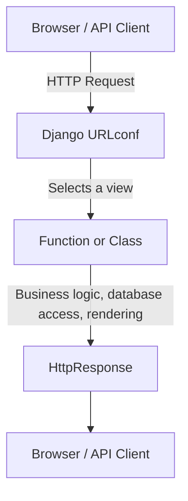
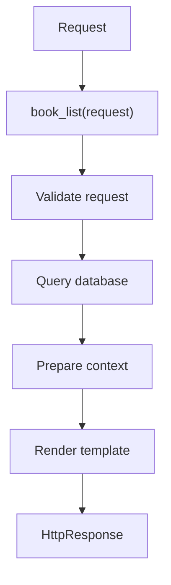
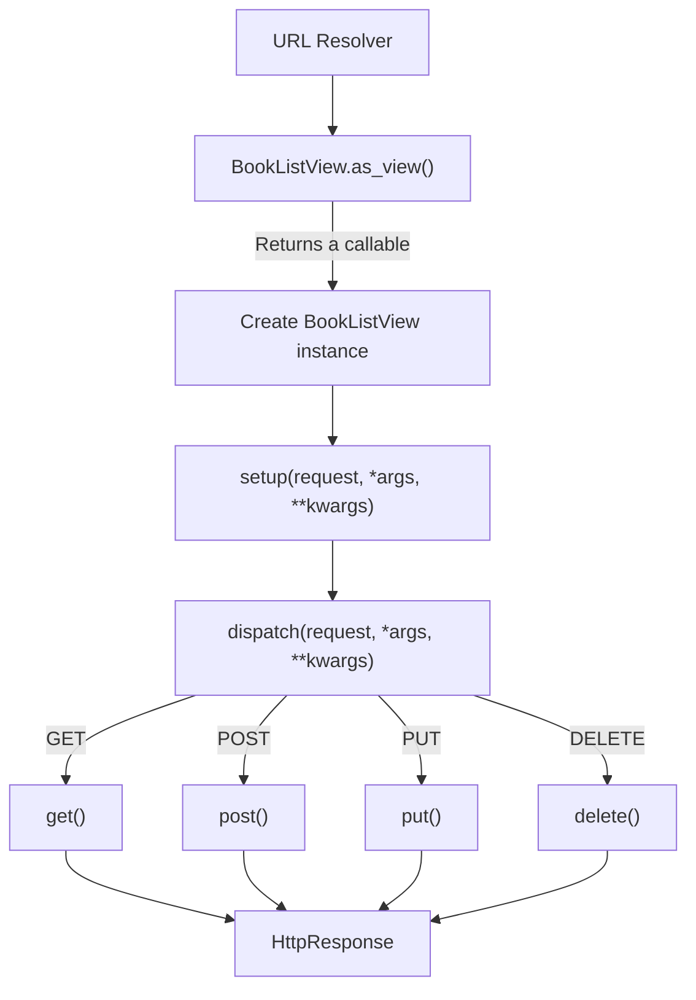
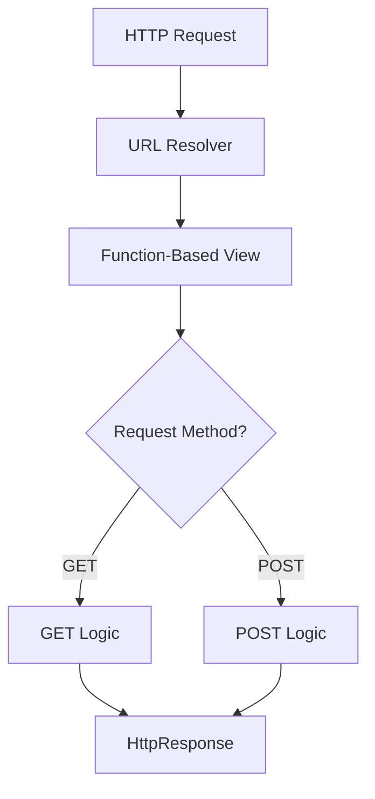
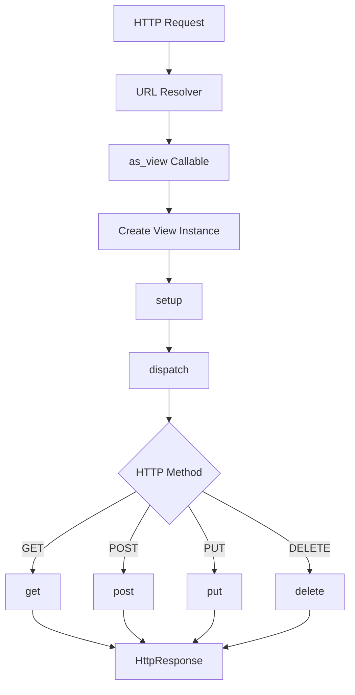
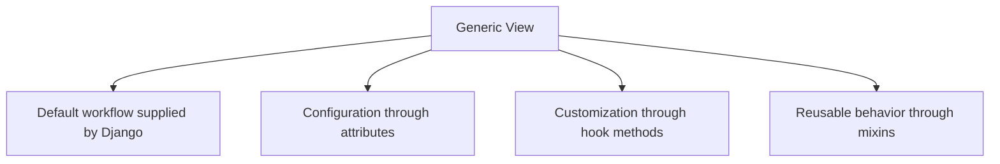
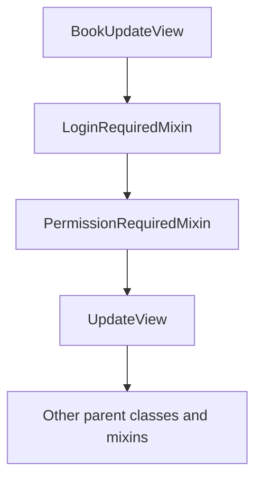
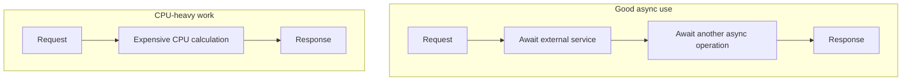
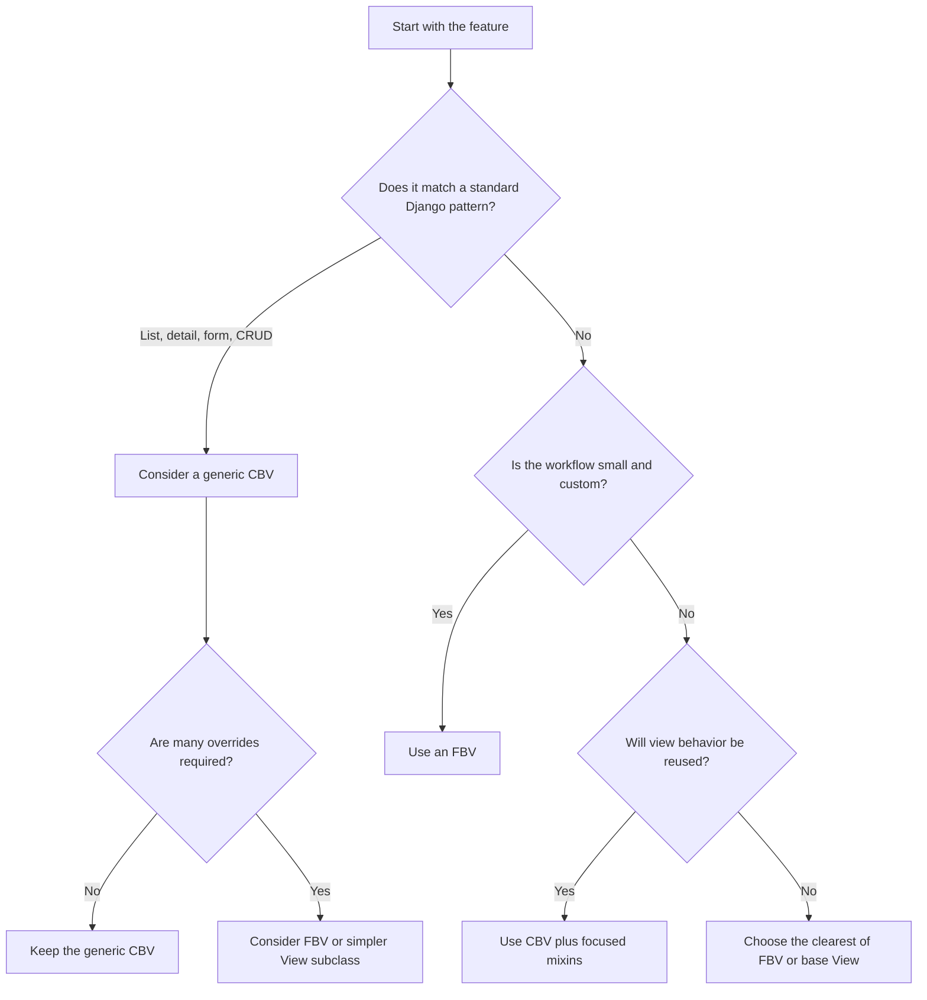

# Class-Based Views vs Function-Based Views in Django

> Django views can be written as **functions** or **classes**. Both follow the same core contract: receive an `HttpRequest` and return an `HttpResponse`. The right choice depends on the complexity, reuse requirements, and readability of the feature—not on a rule that one style is always better.

---

# 1. The Core Idea

A Django view is a callable that:

1. Receives an HTTP request.
2. Executes application logic.
3. Returns an HTTP response.



The two common implementations are:

```python
# Function-Based View
def book_list(request):
    ...
```

```python
# Class-Based View
class BookListView(View):
    def get(self, request):
        ...
```

Django does not treat one approach as universally superior. Class-based views are an alternative to function-based views, not a complete replacement.

## 1.1 Common View Contract

Both styles ultimately behave like this:

```python
request -> view callable -> response
```

An FBV is already a callable function.

A CBV becomes a callable through `as_view()`:

```python
path("books/", BookListView.as_view())
```

`as_view()` creates the function-like entry point expected by Django's URL resolver.

---

# 2. Function-Based Views

A **Function-Based View**, or **FBV**, is a normal Python function that accepts a request and returns a response.

## 2.1 Basic Example

```python
# books/views.py
from django.shortcuts import render

from .models import Book


def book_list(request):
    books = Book.objects.filter(is_published=True)

    return render(
        request,
        "books/book_list.html",
        {"books": books},
    )
```

```python
# books/urls.py
from django.urls import path

from . import views

urlpatterns = [
    path("books/", views.book_list, name="book-list"),
]
```

## 2.2 How an FBV Works



Everything is visible in one function. This makes FBVs easy to read when the workflow is small or highly custom.

## 2.3 FBV with GET and POST

```python
from django.shortcuts import redirect, render

from .forms import BookForm


def book_create(request):
    if request.method == "POST":
        form = BookForm(request.POST)

        if form.is_valid():
            book = form.save()
            return redirect("book-detail", pk=book.pk)
    else:
        form = BookForm()

    return render(
        request,
        "books/book_form.html",
        {"form": form},
    )
```

The function explicitly checks `request.method`.

## 2.4 Strengths of FBVs

- The complete flow is visible from top to bottom.
- They are easy to understand for small endpoints.
- Decorators work naturally.
- They are useful for unique workflows that do not match generic CRUD patterns.
- Control flow is explicit.
- Debugging is often straightforward because fewer framework hooks are involved.

## 2.5 Where FBVs Fit Well

FBVs are commonly a good fit for:

- Simple health-check endpoints.
- Webhook receivers.
- Download or export endpoints.
- Small AJAX endpoints.
- Highly custom workflows.
- Multi-step business logic that does not map cleanly to a generic view.
- Endpoints where explicit control is more valuable than inheritance.

Example:

```python
from django.http import JsonResponse


def health_check(request):
    return JsonResponse({"status": "ok"})
```

Using a large generic CBV for this endpoint would add structure without adding useful value.

---

# 3. Class-Based Views

A **Class-Based View**, or **CBV**, is a Python class whose methods handle HTTP requests.

Django provides:

- Base views such as `View`, `TemplateView`, and `RedirectView`.
- Display views such as `ListView` and `DetailView`.
- Editing views such as `FormView`, `CreateView`, `UpdateView`, and `DeleteView`.
- Mixins that add reusable behavior.

## 3.1 Basic CBV

```python
# books/views.py
from django.shortcuts import render
from django.views import View

from .models import Book


class BookListView(View):
    def get(self, request):
        books = Book.objects.filter(is_published=True)

        return render(
            request,
            "books/book_list.html",
            {"books": books},
        )
```

```python
# books/urls.py
from django.urls import path

from .views import BookListView

urlpatterns = [
    path("books/", BookListView.as_view(), name="book-list"),
]
```

## 3.2 Why `as_view()` Is Required

Django's URL resolver expects a callable.

The class itself is not used directly:

```python
# Incorrect
path("books/", BookListView)
```

Instead:

```python
# Correct
path("books/", BookListView.as_view())
```

Conceptually, `as_view()` does this:



A new view instance is used for each request, so request-specific state can be stored on `self`.

## 3.3 CBV with GET and POST

```python
from django.shortcuts import redirect, render
from django.views import View

from .forms import BookForm


class BookCreateView(View):
    template_name = "books/book_form.html"

    def get(self, request):
        form = BookForm()

        return render(
            request,
            self.template_name,
            {"form": form},
        )

    def post(self, request):
        form = BookForm(request.POST)

        if form.is_valid():
            book = form.save()
            return redirect("book-detail", pk=book.pk)

        return render(
            request,
            self.template_name,
            {"form": form},
        )
```

HTTP methods are separated into methods such as `get()` and `post()`.

## 3.4 Strengths of CBVs

- HTTP methods are separated clearly.
- Common behavior can be reused through inheritance and mixins.
- Django's generic views reduce repetitive CRUD code.
- View configuration can be expressed using class attributes.
- Complex view families can follow a consistent structure.
- Framework hooks allow targeted customization.

## 3.5 Where CBVs Fit Well

CBVs are commonly a good fit for:

- Standard list and detail pages.
- Create, update, and delete pages.
- Repeated authentication or permission logic.
- Reusable application-specific view patterns.
- Features that map closely to Django's generic views.
- Teams that consistently use documented CBV hooks.

---

# 4. Request Flow: FBV vs CBV

## 4.1 FBV Request Flow



The method handling is usually implemented through conditions:

```python
if request.method == "POST":
    ...
else:
    ...
```

## 4.2 CBV Request Flow



The important CBV method is `dispatch()`:

```python
class View:
    def dispatch(self, request, *args, **kwargs):
        # Simplified conceptual behavior
        handler = getattr(self, request.method.lower())
        return handler(request, *args, **kwargs)
```

Django's actual implementation includes supported-method checks and related framework behavior.

## 4.3 Main Structural Difference

| FBV — one function | CBV — one class |
| --- | --- |
| GET branch | `get()` |
| POST branch | `post()` |
| Shared logic | Shared methods |
| — | Inherited/mixin behavior |

---

# 5. Building the Same Feature Both Ways

Assume the following model:

```python
# books/models.py
from django.conf import settings
from django.db import models
from django.urls import reverse


class Book(models.Model):
    title = models.CharField(max_length=200)
    author = models.CharField(max_length=120)
    description = models.TextField(blank=True)
    is_published = models.BooleanField(default=False)
    created_by = models.ForeignKey(
        settings.AUTH_USER_MODEL,
        on_delete=models.CASCADE,
        related_name="books",
    )
    created_at = models.DateTimeField(auto_now_add=True)

    class Meta:
        ordering = ["-created_at"]

    def __str__(self):
        return self.title

    def get_absolute_url(self):
        return reverse("book-detail", kwargs={"pk": self.pk})
```

## 5.1 Book List as an FBV

```python
from django.shortcuts import render

from .models import Book


def book_list(request):
    books = (
        Book.objects
        .filter(is_published=True)
        .select_related("created_by")
    )

    return render(
        request,
        "books/book_list.html",
        {"books": books},
    )
```

## 5.2 Book List Using `View`

```python
from django.shortcuts import render
from django.views import View

from .models import Book


class BookListView(View):
    template_name = "books/book_list.html"

    def get(self, request):
        books = (
            Book.objects
            .filter(is_published=True)
            .select_related("created_by")
        )

        return render(
            request,
            self.template_name,
            {"books": books},
        )
```

This is structurally different from the FBV, but it does not yet remove much code.

## 5.3 Book List Using `ListView`

```python
from django.views.generic import ListView

from .models import Book


class BookListView(ListView):
    model = Book
    template_name = "books/book_list.html"
    context_object_name = "books"
    paginate_by = 20

    def get_queryset(self):
        return (
            Book.objects
            .filter(is_published=True)
            .select_related("created_by")
        )
```

`ListView` already knows how to:

- Call `get_queryset()`.
- Paginate the result.
- Build template context.
- Render a template response.

The code focuses only on feature-specific decisions.

## 5.4 URLs

```python
from django.urls import path

from .views import BookListView, book_list

urlpatterns = [
    path("fbv/books/", book_list, name="fbv-book-list"),
    path("cbv/books/", BookListView.as_view(), name="book-list"),
]
```

---

# 6. Handling HTTP Methods

## 6.1 FBV Method Handling

```python
from django.http import (
    HttpResponse,
    HttpResponseNotAllowed,
)


def notification_view(request):
    if request.method == "GET":
        return HttpResponse("Show notifications")

    if request.method == "POST":
        return HttpResponse("Create notification")

    return HttpResponseNotAllowed(["GET", "POST"])
```

Django also provides method decorators:

```python
from django.views.decorators.http import require_http_methods


@require_http_methods(["GET", "POST"])
def notification_view(request):
    ...
```

## 6.2 CBV Method Handling

```python
from django.http import HttpResponse
from django.views import View


class NotificationView(View):
    def get(self, request):
        return HttpResponse("Show notifications")

    def post(self, request):
        return HttpResponse("Create notification")
```

When the class does not implement the requested method, Django returns an HTTP `405 Method Not Allowed` response.

## 6.3 Comparison

| Concern | FBV | CBV |
|---|---|---|
| GET logic | Branch inside function | `get()` method |
| POST logic | Branch inside function | `post()` method |
| Unsupported method | Explicit handling or decorator | Handled by `View.dispatch()` |
| Shared local data | Local variables/helper functions | Instance methods and attributes |
| Method organization | Conditional | Method-based dispatch |

---

# 7. Built-in Generic Class-Based Views

Generic CBVs are most valuable when a feature follows a common web pattern.

## 7.1 Common Generic Views

| View | Purpose |
|---|---|
| `TemplateView` | Render a template |
| `RedirectView` | Redirect to another URL |
| `ListView` | Display a collection of objects |
| `DetailView` | Display one object |
| `FormView` | Display and process a form |
| `CreateView` | Create a model instance |
| `UpdateView` | Update a model instance |
| `DeleteView` | Delete a model instance |
| `ArchiveIndexView` | Display date-based archives |
| `YearArchiveView` | Display objects for a year |
| `MonthArchiveView` | Display objects for a month |

## 7.2 `TemplateView`

```python
from django.views.generic import TemplateView


class AboutView(TemplateView):
    template_name = "pages/about.html"
```

```python
path("about/", AboutView.as_view(), name="about")
```

## 7.3 `DetailView`

```python
from django.views.generic import DetailView

from .models import Book


class BookDetailView(DetailView):
    model = Book
    template_name = "books/book_detail.html"
    context_object_name = "book"

    def get_queryset(self):
        return (
            super()
            .get_queryset()
            .filter(is_published=True)
            .select_related("created_by")
        )
```

The object is retrieved from a URL keyword such as `pk`:

```python
path(
    "books/<int:pk>/",
    BookDetailView.as_view(),
    name="book-detail",
)
```

## 7.4 Generic View Mental Model



A generic CBV is useful when its default workflow closely matches the feature. When extensive overrides are needed, a simpler `View` subclass or an FBV may be clearer.

---

# 8. Authentication and Permissions

## 8.1 Authentication in an FBV

Use decorators:

```python
from django.contrib.auth.decorators import login_required
from django.shortcuts import render


@login_required
def dashboard(request):
    return render(request, "dashboard.html")
```

For permissions:

```python
from django.contrib.auth.decorators import permission_required


@permission_required("books.change_book", raise_exception=True)
def book_admin(request):
    ...
```

## 8.2 Authentication in a CBV

Use mixins:

```python
from django.contrib.auth.mixins import LoginRequiredMixin
from django.views.generic import TemplateView


class DashboardView(LoginRequiredMixin, TemplateView):
    template_name = "dashboard.html"
    login_url = "login"
```

For permissions:

```python
from django.contrib.auth.mixins import PermissionRequiredMixin
from django.views.generic import UpdateView

from .models import Book


class BookUpdateView(
    LoginRequiredMixin,
    PermissionRequiredMixin,
    UpdateView,
):
    model = Book
    fields = ["title", "author", "description"]
    permission_required = "books.change_book"
    raise_exception = True
```

## 8.3 Mixin Order Matters

Authentication and permission mixins usually appear before the concrete view:

```python
class BookUpdateView(
    LoginRequiredMixin,
    PermissionRequiredMixin,
    UpdateView,
):
    ...
```

Python uses the Method Resolution Order, or MRO, to determine which implementation runs next.



## 8.4 Applying a Decorator to a CBV

Sometimes an existing decorator must be used with a CBV.

```python
from django.utils.decorators import method_decorator
from django.views.decorators.cache import never_cache
from django.views.generic import TemplateView


@method_decorator(never_cache, name="dispatch")
class SecurePageView(TemplateView):
    template_name = "secure/page.html"
```

Another option is decorating the callable in the URL configuration:

```python
path(
    "secure/",
    never_cache(SecurePageView.as_view()),
    name="secure-page",
)
```

---

# 9. Reusing View Logic

## 9.1 Reuse with FBV Helper Functions

Function-based views can reuse normal Python functions.

```python
from django.core.exceptions import PermissionDenied


def ensure_book_owner(user, book):
    if book.created_by_id != user.id:
        raise PermissionDenied


def book_update(request, pk):
    book = get_object_or_404(Book, pk=pk)
    ensure_book_owner(request.user, book)
    ...
```

This approach is explicit and easy to test.

## 9.2 Reuse with CBV Mixins

A mixin packages behavior for several CBVs.

```python
from django.core.exceptions import PermissionDenied


class BookOwnerRequiredMixin:
    def dispatch(self, request, *args, **kwargs):
        book = self.get_object()

        if book.created_by_id != request.user.id:
            raise PermissionDenied

        return super().dispatch(request, *args, **kwargs)
```

Usage:

```python
from django.contrib.auth.mixins import LoginRequiredMixin
from django.views.generic import UpdateView


class BookUpdateView(
    LoginRequiredMixin,
    BookOwnerRequiredMixin,
    UpdateView,
):
    model = Book
    fields = ["title", "author", "description"]
```

A more focused implementation can override `get_queryset()`:

```python
class OwnedBookQuerySetMixin:
    def get_queryset(self):
        queryset = super().get_queryset()
        return queryset.filter(created_by=self.request.user)
```

This is often preferable because an object outside the user's queryset naturally produces a `404`, without separately exposing whether it exists.

## 9.3 Composition vs Inheritance

Both styles support reuse:

| FBV reuse — functions | CBV reuse — object-oriented components |
| --- | --- |
| Decorators | Mixins |
| Service functions | Parent classes |
| Utility functions | Overridable methods |

Use a mixin for view-specific reusable behavior. Use service functions for domain or business logic that should not depend on the view layer.

---

# 10. Dynamic QuerySets and Context

## 10.1 Dynamic Data in an FBV

```python
def my_books(request):
    books = Book.objects.filter(created_by=request.user)

    return render(
        request,
        "books/my_books.html",
        {"books": books},
    )
```

## 10.2 Dynamic QuerySet in a CBV

Use `get_queryset()` when the queryset depends on the current request.

```python
from django.contrib.auth.mixins import LoginRequiredMixin
from django.views.generic import ListView


class MyBookListView(LoginRequiredMixin, ListView):
    model = Book
    template_name = "books/my_books.html"
    context_object_name = "books"

    def get_queryset(self):
        return (
            super()
            .get_queryset()
            .filter(created_by=self.request.user)
        )
```

Do not calculate request-specific querysets as class attributes:

```python
# Avoid request-specific or eagerly evaluated class-level data.
class MyBookListView(ListView):
    queryset = Book.objects.filter(
        created_by=request.user,  # request does not exist here
    )
```

Use `get_queryset()` because `self.request` is available during request processing.

## 10.3 Adding Context in an FBV

```python
def book_list(request):
    books = Book.objects.filter(is_published=True)
    featured_book = books.first()

    return render(
        request,
        "books/book_list.html",
        {
            "books": books,
            "featured_book": featured_book,
        },
    )
```

## 10.4 Adding Context in a CBV

```python
class BookListView(ListView):
    model = Book
    context_object_name = "books"

    def get_queryset(self):
        return Book.objects.filter(is_published=True)

    def get_context_data(self, **kwargs):
        context = super().get_context_data(**kwargs)
        context["featured_book"] = context["books"].first()
        return context
```

Always preserve parent behavior when extending a CBV hook:

```python
context = super().get_context_data(**kwargs)
```

---

# 11. Forms and CRUD Operations

## 11.1 Create Operation as an FBV

```python
from django.contrib.auth.decorators import login_required
from django.shortcuts import redirect, render

from .forms import BookForm


@login_required
def book_create(request):
    if request.method == "POST":
        form = BookForm(request.POST)

        if form.is_valid():
            book = form.save(commit=False)
            book.created_by = request.user
            book.save()

            return redirect(book)
    else:
        form = BookForm()

    return render(
        request,
        "books/book_form.html",
        {"form": form},
    )
```

## 11.2 Create Operation with `CreateView`

```python
from django.contrib.auth.mixins import LoginRequiredMixin
from django.views.generic import CreateView

from .forms import BookForm
from .models import Book


class BookCreateView(LoginRequiredMixin, CreateView):
    model = Book
    form_class = BookForm
    template_name = "books/book_form.html"

    def form_valid(self, form):
        form.instance.created_by = self.request.user
        return super().form_valid(form)
```

Because the model defines `get_absolute_url()`, the successful create operation can redirect to the new book automatically.

## 11.3 Update Operation with `UpdateView`

```python
class BookUpdateView(
    LoginRequiredMixin,
    OwnedBookQuerySetMixin,
    UpdateView,
):
    model = Book
    form_class = BookForm
    template_name = "books/book_form.html"
```

## 11.4 Delete Operation with `DeleteView`

```python
from django.urls import reverse_lazy
from django.views.generic import DeleteView


class BookDeleteView(
    LoginRequiredMixin,
    OwnedBookQuerySetMixin,
    DeleteView,
):
    model = Book
    template_name = "books/book_confirm_delete.html"
    success_url = reverse_lazy("book-list")
```

`reverse_lazy()` is useful for class attributes because URL resolution is deferred until it is needed.

## 11.5 CRUD Comparison

| Operation | Typical FBV Work | Typical Generic CBV |
|---|---|---|
| List | Query + context + render + pagination | `ListView` |
| Detail | Object lookup + 404 + render | `DetailView` |
| Create | GET/POST branching + form validation | `CreateView` |
| Update | Lookup + ownership + form handling | `UpdateView` |
| Delete | Lookup + confirmation + deletion | `DeleteView` |

Generic CBVs reduce repeated infrastructure code, but the business rules still need to be implemented explicitly.

---

# 12. Async Views

Django supports asynchronous views. Async views are most useful for operations that await async-compatible I/O, such as external API calls.

## 12.1 Async FBV

```python
import asyncio

from django.http import JsonResponse


async def status_view(request):
    await asyncio.sleep(0.1)
    return JsonResponse({"status": "ready"})
```

## 12.2 Async CBV

```python
import asyncio

from django.http import JsonResponse
from django.views import View


class StatusView(View):
    async def get(self, request):
        await asyncio.sleep(0.1)
        return JsonResponse({"status": "ready"})
```

## 12.3 Important CBV Async Rule

Within one CBV, user-defined HTTP handlers must all be synchronous or all asynchronous.

```python
class InvalidView(View):
    async def get(self, request):
        ...

    def post(self, request):
        ...
```

Mixing synchronous and asynchronous HTTP handlers in one view class causes an `ImproperlyConfigured` error when `as_view()` prepares the view.

Use:

```python
class ValidAsyncView(View):
    async def get(self, request):
        ...

    async def post(self, request):
        ...
```

## 12.4 Async Does Not Automatically Make a View Faster

Async is helpful when the view spends time waiting for async I/O.



CPU-heavy work should usually be optimized, moved to background processing, or handled with an architecture designed for such workloads.

---

# 13. Testing FBVs and CBVs

Both view styles can be tested through Django's test client.

## 13.1 Testing Through the URL

```python
from django.test import TestCase
from django.urls import reverse

from .models import Book


class BookListTests(TestCase):
    def test_published_books_are_visible(self):
        Book.objects.create(
            title="Visible Book",
            author="A. Developer",
            is_published=True,
            created_by_id=1,
        )

        response = self.client.get(reverse("book-list"))

        self.assertEqual(response.status_code, 200)
        self.assertContains(response, "Visible Book")
```

In a real test, create a user properly rather than relying on a fixed foreign-key value.

## 13.2 Complete Test Setup

```python
from django.contrib.auth import get_user_model
from django.test import TestCase
from django.urls import reverse

from .models import Book

User = get_user_model()


class BookListTests(TestCase):
    @classmethod
    def setUpTestData(cls):
        cls.user = User.objects.create_user(
            username="developer",
            password="secure-test-password",
        )

        cls.published_book = Book.objects.create(
            title="Published Book",
            author="A. Developer",
            is_published=True,
            created_by=cls.user,
        )

        cls.draft_book = Book.objects.create(
            title="Draft Book",
            author="A. Developer",
            is_published=False,
            created_by=cls.user,
        )

    def test_only_published_books_are_visible(self):
        response = self.client.get(reverse("book-list"))

        self.assertEqual(response.status_code, 200)
        self.assertContains(response, self.published_book.title)
        self.assertNotContains(response, self.draft_book.title)
```

This test works whether `book-list` points to an FBV or CBV.

## 13.3 Testing CBV Methods Directly

It is possible to instantiate and prepare a CBV for focused unit tests:

```python
from django.test import RequestFactory, TestCase

from .views import BookListView


class BookListViewUnitTests(TestCase):
    def setUp(self):
        self.factory = RequestFactory()

    def test_view_uses_expected_template(self):
        request = self.factory.get("/books/")
        view = BookListView()
        view.setup(request)

        self.assertEqual(
            view.template_name,
            "books/book_list.html",
        )
```

For most behavior, URL-level tests are more representative because they include routing, middleware, decorators, mixins, and response rendering.

## 13.4 Testing Strategy

```text
Most tests
└── call the URL with Django test client
    ├── verify status
    ├── verify template
    ├── verify context/content
    ├── verify redirect
    └── verify database changes

Focused tests
└── test helper, service, form, mixin, or hook separately
```

---

# 14. Performance Considerations

Choosing FBV or CBV usually does not create a meaningful application-level performance difference.

Database queries, template rendering, external API calls, caching, and serialization normally have a much larger impact.

| Typical request cost | Impact |
| --- | --- |
| Database queries | Often significant |
| External API calls | Often significant |
| Template / serialization | Can be significant |
| Middleware | Depends on project |
| FBV vs CBV dispatch | Usually not the main concern |

Choose the style that produces clearer and more maintainable code. Optimize actual bottlenecks after measuring them.

For both styles:

- Use `select_related()` for suitable foreign-key and one-to-one relationships.
- Use `prefetch_related()` for many-to-many and reverse relationships.
- Paginate large collections.
- Avoid unnecessary queries.
- Cache only where it is safe and useful.
- Measure using profiling and query-inspection tools.

---

# 15. How to Choose

## 15.1 Practical Decision Table

| Situation | Usually Prefer | Reason |
|---|---|---|
| Very small endpoint | FBV | Minimal structure |
| Health check or webhook | FBV | Explicit custom flow |
| Standard list/detail page | Generic CBV | Built-in workflow |
| Standard create/update/delete | Generic CBV | Less repeated form code |
| Several views share behavior | CBV + mixin | Reusable view-layer behavior |
| Business workflow is highly custom | FBV or base `View` | Generic hooks may become harder to follow |
| Team knows CBV hooks well | CBV | Consistent conventions |
| Logic must be read top-to-bottom | FBV | Direct control flow |
| Multiple HTTP methods need separation | CBV | `get()`, `post()`, `put()`, etc. |
| Existing codebase uses one style consistently | Follow project convention | Lower maintenance cost |

## 15.2 Decision Flow



## 15.3 A Useful Rule

Start from the feature's shape:

| Feature shape | Choose |
| --- | --- |
| Standard pattern + small customization | Generic CBV |
| Small custom workflow | FBV |
| Multiple methods + reusable view behavior | CBV |
| Generic CBV requires many hard-to-follow overrides | Simplify with base `View` or FBV |

---

# 16. Refactoring Between FBVs and CBVs

## 16.1 FBV to CBV

Original FBV:

```python
def book_detail(request, pk):
    book = get_object_or_404(
        Book,
        pk=pk,
        is_published=True,
    )

    return render(
        request,
        "books/book_detail.html",
        {"book": book},
    )
```

Equivalent `DetailView`:

```python
class BookDetailView(DetailView):
    model = Book
    template_name = "books/book_detail.html"
    context_object_name = "book"

    def get_queryset(self):
        return (
            super()
            .get_queryset()
            .filter(is_published=True)
        )
```

Refactoring steps:

1. Identify the view pattern.
2. Select the closest generic view.
3. Move static configuration to class attributes.
4. Move dynamic query logic to `get_queryset()`.
5. Move additional context to `get_context_data()`.
6. Preserve authorization rules.
7. Keep URL-level tests unchanged where possible.

## 16.2 CBV to FBV

Suppose a generic CBV has accumulated many overrides:

```python
class ComplexBookCreateView(CreateView):
    def dispatch(self, request, *args, **kwargs):
        ...

    def get_form_class(self):
        ...

    def get_initial(self):
        ...

    def form_valid(self, form):
        ...

    def get_success_url(self):
        ...
```

A focused FBV may make the workflow easier to read:

```python
@login_required
def complex_book_create(request):
    form_class = choose_book_form(request.user)

    if request.method == "POST":
        form = form_class(request.POST)

        if form.is_valid():
            book = create_book_for_user(
                user=request.user,
                cleaned_data=form.cleaned_data,
            )
            return redirect("book-detail", pk=book.pk)
    else:
        form = form_class(
            initial=get_book_initial_data(request.user),
        )

    return render(
        request,
        "books/book_form.html",
        {"form": form},
    )
```

The goal is not to minimize line count. The goal is to make the workflow understandable and maintainable.

---

# 17. Best Practices

## 17.1 Keep Business Logic Outside Views

A view should coordinate the request, not contain the entire domain model.

```python
# books/services.py
from .models import Book


def publish_book(*, book: Book, published_by) -> Book:
    book.is_published = True
    book.save(update_fields=["is_published"])
    return book
```

FBV:

```python
@login_required
def book_publish(request, pk):
    book = get_object_or_404(
        Book,
        pk=pk,
        created_by=request.user,
    )

    publish_book(
        book=book,
        published_by=request.user,
    )

    return redirect(book)
```

CBV:

```python
class BookPublishView(LoginRequiredMixin, View):
    def post(self, request, pk):
        book = get_object_or_404(
            Book,
            pk=pk,
            created_by=request.user,
        )

        publish_book(
            book=book,
            published_by=request.user,
        )

        return redirect(book)
```

The service can be reused from views, commands, tasks, or other application entry points.

## 17.2 Use Narrow Mixins

Prefer a focused mixin:

```python
class PublishedBooksMixin:
    def get_queryset(self):
        return (
            super()
            .get_queryset()
            .filter(is_published=True)
        )
```

Avoid a large mixin that controls unrelated concerns such as permissions, caching, query filtering, messages, and form behavior together.

## 17.3 Override the Most Specific Hook

In generic CBVs, use the hook designed for the task:

| Requirement | Preferred Hook |
|---|---|
| Filter objects | `get_queryset()` |
| Add template data | `get_context_data()` |
| Set object ownership before save | `form_valid()` |
| Select form dynamically | `get_form_class()` |
| Add form defaults | `get_initial()` |
| Compute redirect dynamically | `get_success_url()` |
| Handle all HTTP methods before dispatch | `dispatch()` only when necessary |

Using a specific hook communicates intent more clearly than overriding `dispatch()` for everything.

## 17.4 Preserve Parent Behavior

When extending a generic CBV method, call `super()` unless intentionally replacing the complete behavior.

```python
def form_valid(self, form):
    form.instance.created_by = self.request.user
    return super().form_valid(form)
```

## 17.5 Keep URL Configuration Clear

FBV:

```python
path("books/", book_list, name="book-list")
```

CBV:

```python
path(
    "books/",
    BookListView.as_view(),
    name="book-list",
)
```

Avoid putting substantial configuration in `urls.py` when a named view class would be clearer.

Small configuration is supported:

```python
path(
    "about/",
    TemplateView.as_view(
        template_name="pages/about.html",
    ),
    name="about",
)
```

For behavior that will grow, create a dedicated class.

## 17.6 Protect QuerySets, Not Only Templates

Hiding an edit button does not enforce authorization.

The server must restrict access:

```python
class BookUpdateView(LoginRequiredMixin, UpdateView):
    model = Book
    fields = ["title", "description"]

    def get_queryset(self):
        return (
            super()
            .get_queryset()
            .filter(created_by=self.request.user)
        )
```

This ensures users cannot update another user's object by manually changing the URL.

## 17.7 Follow Project Consistency

A codebase that uses one well-understood pattern consistently is often easier to maintain than one that switches styles without a clear reason.

Consistency should not prevent simplification, but new code should fit the project's established conventions where they remain suitable.

---

# 18. Final Mental Model

## 18.1 Function-Based View

Think:

> "Run this explicit request workflow from top to bottom."

```text
Function
├── receives request
├── checks method
├── performs logic
└── returns response
```

## 18.2 Class-Based View

Think:

> "Create a request-specific object and dispatch the request to the correct method."

```text
Class
├── configuration attributes
├── get()
├── post()
├── reusable methods
└── inherited mixin behavior
```

## 18.3 Generic Class-Based View

Think:

> "Use Django's existing workflow and customize only the parts that differ."

```text
Django generic workflow
├── object lookup/querying
├── form handling
├── context creation
├── template response
└── redirect handling

Your code
├── model/queryset
├── template name
├── permission rules
└── focused hook overrides
```

## 18.4 Final Comparison

| Area | Function-Based Views | Class-Based Views |
|---|---|---|
| Basic unit | Function | Class |
| URL registration | Function name | `ClassName.as_view()` |
| HTTP methods | Conditional branches | Separate handler methods |
| Readability | Excellent for small custom flows | Excellent for structured/repeated flows |
| Reuse | Helpers and decorators | Inheritance and mixins |
| Generic CRUD support | Manual | Strong built-in support |
| Learning curve | Lower | Higher because of hooks and MRO |
| Explicit control flow | Strong | Can be distributed across inherited methods |
| Extensibility | Composition-based | Hook- and inheritance-based |
| Best use | Small or unique workflow | Standard patterns and reusable behavior |

The most practical conclusion is:

```text
Use FBVs when directness is the main advantage.
Use CBVs when structure and reuse are the main advantages.
Use generic CBVs when Django already provides most of the workflow.
```

---

# 19. Official References

This guide targets the Django 6.0 documentation and behavior. Django 6.0 was released on December 3, 2025; the examples here are compatible with the Django 6.0 view APIs.

- Writing views:  
  https://docs.djangoproject.com/en/6.0/topics/http/views/

- Introduction to class-based views:  
  https://docs.djangoproject.com/en/6.0/topics/class-based-views/intro/

- Class-based views overview:  
  https://docs.djangoproject.com/en/6.0/topics/class-based-views/

- Built-in generic display views:  
  https://docs.djangoproject.com/en/6.0/topics/class-based-views/generic-display/

- Built-in generic editing views:  
  https://docs.djangoproject.com/en/6.0/topics/class-based-views/generic-editing/

- Using mixins with class-based views:  
  https://docs.djangoproject.com/en/6.0/topics/class-based-views/mixins/

- Built-in class-based views API:  
  https://docs.djangoproject.com/en/6.0/ref/class-based-views/

- Asynchronous support:  
  https://docs.djangoproject.com/en/6.0/topics/async/

- Django 6.0 release notes:  
  https://docs.djangoproject.com/en/6.0/releases/6.0/
