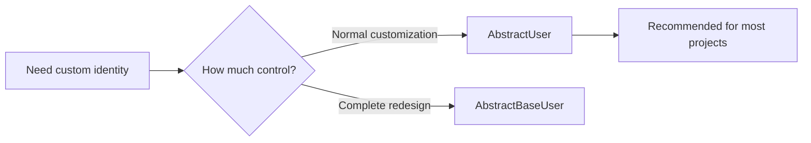
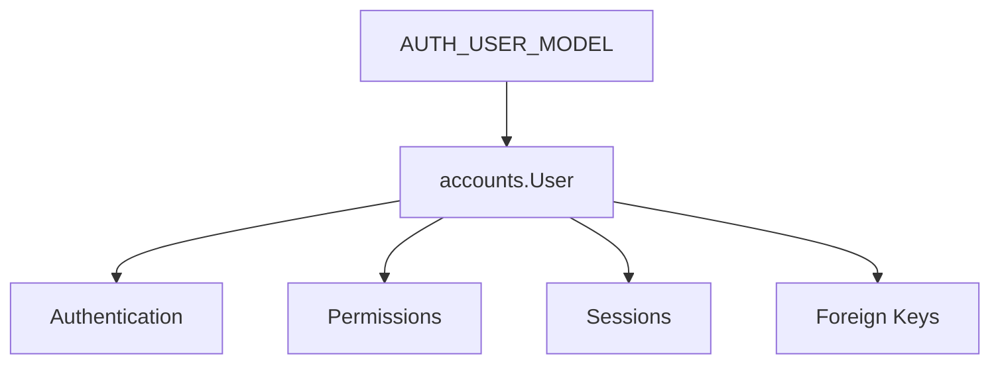
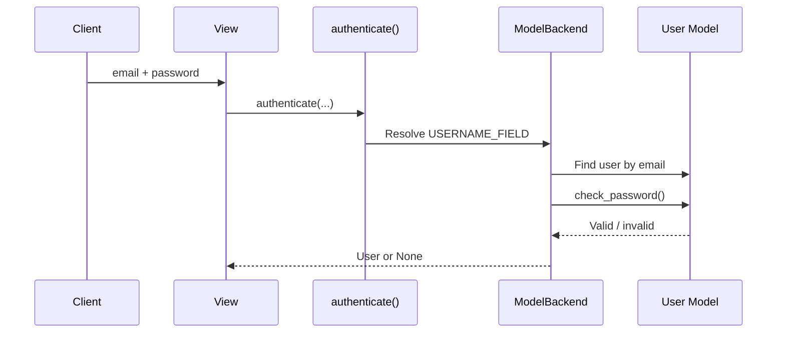
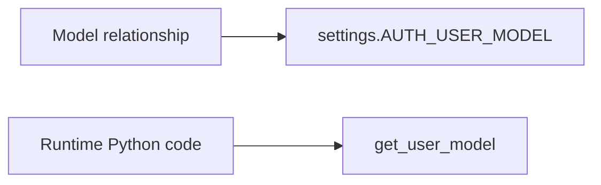

# Django Custom User Model

> A **custom user model** replaces Django's default `auth.User` model with an application-owned identity model—for example, to use email instead of username for login.

## In Short

- Define the custom user **before the first migration** and set `AUTH_USER_MODEL` immediately.
- Prefer **`AbstractUser`** for most applications.
- Use **`AbstractBaseUser`** only when authentication needs a fundamentally different model.
- If email replaces username, set `USERNAME_FIELD = "email"` and use a custom manager.
- Use `settings.AUTH_USER_MODEL` in model relationships and `get_user_model()` in runtime code.
- Create password-based users through `create_user()` or `set_password()`.
- Keep the user model focused on authentication and shared identity; move business-specific data to related models.



---

# 1. Why Use a Custom User Model?

Django's default `User` works for simple projects, but common production requirements include:

- Email-based login.
- UUID user IDs.
- Phone number or account-status fields.
- External identity-provider integration.
- Custom user/superuser creation rules.

The important decision is **when** to introduce it.

> [!IMPORTANT]
> Configure `AUTH_USER_MODEL` before running the first migrations. Changing it later can require manual schema changes, data migration, and foreign-key or many-to-many updates.

---

# 2. `AbstractUser` vs `AbstractBaseUser`

| Area | `AbstractUser` | `AbstractBaseUser` |
|---|---|---|
| Standard Django fields | Included | Define them yourself |
| Password handling | Included | Included |
| Permissions | Included | Usually add `PermissionsMixin` |
| Admin integration | Easier | More work |
| Implementation effort | Low–medium | High |
| Best fit | Most applications | Highly specialized authentication |

## 2.1 `AbstractUser`

Use `AbstractUser` when you want to add fields, remove `username`, use email login, or keep Django's normal groups and permissions.

## 2.2 `AbstractBaseUser`

Use `AbstractBaseUser` when you need full control over the user structure. You must define more behavior yourself, including fields, manager rules, permissions integration, and admin behavior.

> [!KEY]
> For normal business applications, start with `AbstractUser` unless there is a clear reason not to.

---

# 3. Practical Example: Email-Based User

This example uses `AbstractUser`, removes `username`, and uses email as the login identifier.

## 3.1 Custom Manager

```python
# accounts/managers.py

from django.contrib.auth.base_user import BaseUserManager


class CustomUserManager(BaseUserManager):
    use_in_migrations = True

    def create_user(self, email, password=None, **extra_fields):
        if not email:
            raise ValueError("Email is required.")

        email = self.normalize_email(email).strip().lower()
        user = self.model(email=email, **extra_fields)
        user.set_password(password)
        user.save(using=self._db)
        return user

    def create_superuser(self, email, password=None, **extra_fields):
        extra_fields.setdefault("is_staff", True)
        extra_fields.setdefault("is_superuser", True)
        extra_fields.setdefault("is_active", True)

        if extra_fields.get("is_staff") is not True:
            raise ValueError("Superuser must have is_staff=True.")
        if extra_fields.get("is_superuser") is not True:
            raise ValueError("Superuser must have is_superuser=True.")

        return self.create_user(email, password, **extra_fields)
```

### Why `set_password()`?

```python
# Wrong: may store an unusable raw value
user.password = "secret123"

# Correct
user.set_password("secret123")
```

`set_password()` applies Django's password hashing instead of storing the raw password.

---

## 3.2 User Model

```python
# accounts/models.py

import uuid

from django.contrib.auth.models import AbstractUser
from django.db import models

from .managers import CustomUserManager


class User(AbstractUser):
    id = models.UUIDField(
        primary_key=True,
        default=uuid.uuid4,
        editable=False,
    )
    username = None
    email = models.EmailField(unique=True)
    phone_number = models.CharField(max_length=20, blank=True)

    USERNAME_FIELD = "email"
    REQUIRED_FIELDS = []

    objects = CustomUserManager()

    def __str__(self):
        return self.email
```

### Important Attributes

- `username = None` removes Django's inherited username field.
- `USERNAME_FIELD = "email"` makes email the authentication identifier.
- `REQUIRED_FIELDS` controls additional fields requested by `createsuperuser`; it should not contain `USERNAME_FIELD` or `password`.
- The UUID primary key is optional; an integer primary key is also valid.

---

## 3.3 Configure `AUTH_USER_MODEL`

```python
# settings.py

AUTH_USER_MODEL = "accounts.User"
```

Format:

```text
<app_label>.<model_name>
```



---

## 3.4 Forms and Admin Integration

When the user model changes Django's default fields, extend the built-in user forms and configure `UserAdmin` for the new structure.

```python
# accounts/forms.py

from django.contrib.auth.forms import UserChangeForm, UserCreationForm

from .models import User


class CustomUserCreationForm(UserCreationForm):
    class Meta(UserCreationForm.Meta):
        model = User
        fields = ("email",)


class CustomUserChangeForm(UserChangeForm):
    class Meta(UserChangeForm.Meta):
        model = User
        fields = ("email", "phone_number")
```

```python
# accounts/admin.py

from django.contrib import admin
from django.contrib.auth.admin import UserAdmin

from .forms import CustomUserChangeForm, CustomUserCreationForm
from .models import User


@admin.register(User)
class CustomUserAdmin(UserAdmin):
    add_form = CustomUserCreationForm
    form = CustomUserChangeForm
    model = User

    ordering = ("email",)
    list_display = ("email", "is_staff", "is_active")
    search_fields = ("email",)

    fieldsets = (
        (None, {"fields": ("email", "password")}),
        ("Personal", {"fields": ("first_name", "last_name", "phone_number")}),
        (
            "Permissions",
            {
                "fields": (
                    "is_active",
                    "is_staff",
                    "is_superuser",
                    "groups",
                    "user_permissions",
                )
            },
        ),
        ("Important dates", {"fields": ("last_login", "date_joined")}),
    )

    add_fieldsets = (
        (
            None,
            {
                "classes": ("wide",),
                "fields": ("email", "password1", "password2"),
            },
        ),
    )
```

The important point is that `fieldsets` and `add_fieldsets` must not refer to the removed `username` field.

---

# 4. How Authentication Works

Django's default `ModelBackend` uses the active model's `USERNAME_FIELD` to identify the user.

With:

```python
USERNAME_FIELD = "email"
```

email becomes the login identifier.

```python
from django.contrib.auth import authenticate, login

user = authenticate(
    request,
    email="developer@example.com",
    password="strong-password",
)

if user is not None:
    login(request, user)
```



---

# 5. Reference the User Model Correctly

Avoid hard-coding Django's built-in user:

```python
# Avoid
from django.contrib.auth.models import User
```

## 5.1 Model Relationships

Use `settings.AUTH_USER_MODEL`:

```python
from django.conf import settings
from django.db import models


class Article(models.Model):
    author = models.ForeignKey(
        settings.AUTH_USER_MODEL,
        on_delete=models.CASCADE,
        related_name="articles",
    )
```

## 5.2 Runtime Code

Use `get_user_model()`:

```python
from django.contrib.auth import get_user_model

User = get_user_model()
user = User.objects.get(email="developer@example.com")
```



---

# 6. Keep Identity Separate from Domain Data

The user model should contain fields that are globally useful for authentication or identity.

Good examples:

- Email
- Phone number
- Display name
- Account status
- Global identity-provider ID

Business-specific information usually belongs in another model:

```python
class EmployeeProfile(models.Model):
    user = models.OneToOneField(
        settings.AUTH_USER_MODEL,
        on_delete=models.CASCADE,
        related_name="employee_profile",
    )
    employee_code = models.CharField(max_length=30, unique=True)
    department = models.CharField(max_length=100)
```

```text
User
├── Login identity
├── Account status
├── Global identity
└── Permissions

Related models
├── Employee data
├── Customer preferences
├── Billing profile
└── Organization membership
```

For roles such as `owner`, `admin`, or `member`, prefer Django groups/permissions or an organization-membership model instead of adding many role booleans to `User`.

---

# 7. Django REST Framework Usage

When registering users through DRF, call the custom manager so password and normalization rules stay centralized.

```python
from django.contrib.auth import get_user_model
from rest_framework import serializers

User = get_user_model()


class UserRegistrationSerializer(serializers.ModelSerializer):
    password = serializers.CharField(write_only=True, min_length=8)

    class Meta:
        model = User
        fields = ("id", "email", "password")
        read_only_fields = ("id",)

    def create(self, validated_data):
        return User.objects.create_user(**validated_data)
```

Avoid:

```python
User.objects.create(
    email="developer@example.com",
    password="plain-text-password",
)
```

`create_user()` ensures the project's user-creation rules are applied.

---

# 8. Migration Rules

A custom user is a **swappable model**, so other migrations may depend on `AUTH_USER_MODEL`.

The user model should be created in:

```text
accounts/migrations/0001_initial.py
```

Django may generate dependencies such as:

```python
migrations.swappable_dependency(settings.AUTH_USER_MODEL)
```

## Circular Dependencies

If `accounts.User` references another app and that app also references the user, a migration cycle can occur.

A common fix is:

1. Keep the user model in `accounts.0001_initial`.
2. Create the other model in its initial migration.
3. Move one cross-app relationship into a later migration.

> [!IMPORTANT]
> Changing from `auth.User` to a custom user after production data exists is not a one-line settings change; it normally requires planned schema and data migration work.

---

# 9. Production Considerations

## 9.1 Email Normalization and Uniqueness

`BaseUserManager.normalize_email()` lowercases the **domain** part of an email address. If your application treats email addresses as case-insensitive identifiers, apply one consistent policy across registration, login, admin, imports, and invitations.

For databases where case-insensitive uniqueness matters, consider enforcing that policy at the database level as well.

## 9.2 Email Changes Are Security-Sensitive

Changing the login email may require re-authentication, verification of the new address, duplicate checks, audit logging, and notification to the previous address.

## 9.3 Use `user.pk` as the Stable Identifier

Email addresses can change. Foreign keys and permanent references should point to the user's primary key, not the email string.

---

# 10. Key Takeaways

1. Create the custom user model at the **start of the project**.
2. Prefer `AbstractUser` for most Django applications.
3. Use `AbstractBaseUser` only when you need complete control.
4. Set `AUTH_USER_MODEL` before the first migration.
5. Keep the user model in its app's `0001_initial` migration.
6. Use a custom manager when the model's fields differ from Django's default structure.
7. Use `create_user()` or `set_password()` for password-based accounts.
8. Use `settings.AUTH_USER_MODEL` in model relationships.
9. Use `get_user_model()` in runtime Python code.
10. Keep authentication identity small and move domain-specific data into related models.

> **Mental model:** The custom user is the project's central identity model. Configure it once, keep it stable, and make the rest of the project depend on `AUTH_USER_MODEL` instead of Django's concrete built-in `User` class.
