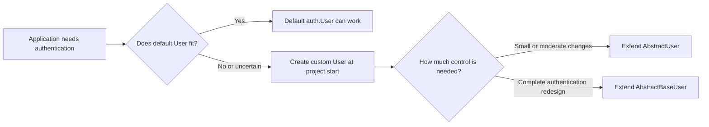
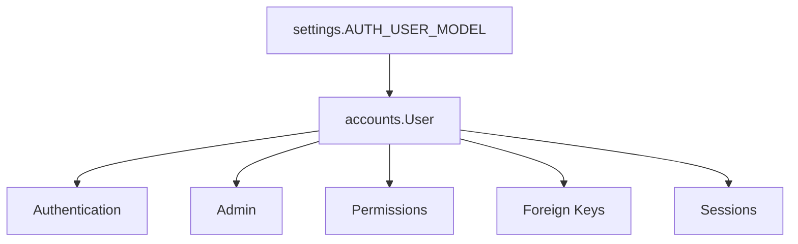
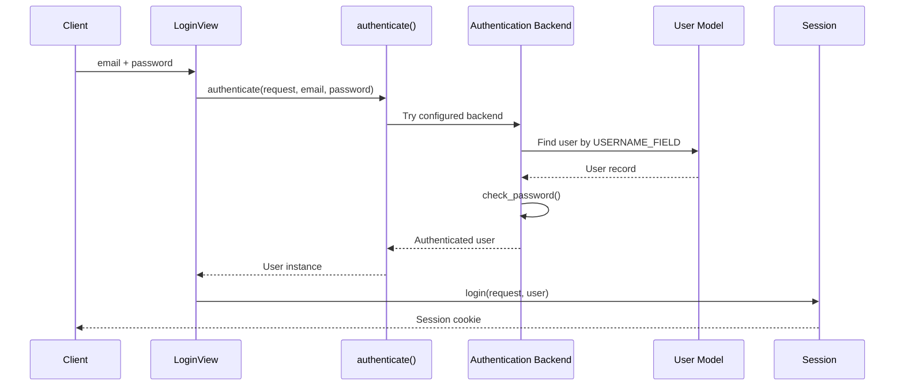
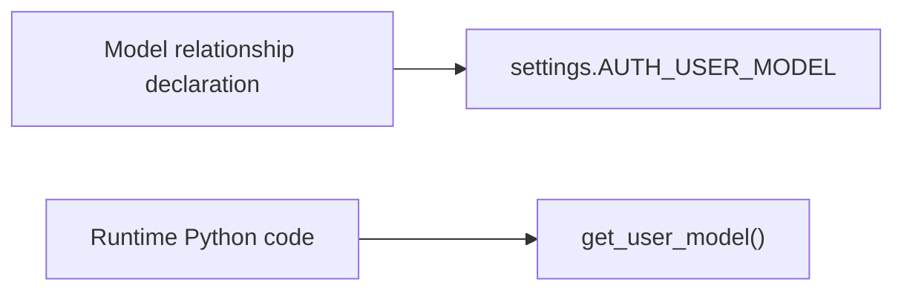
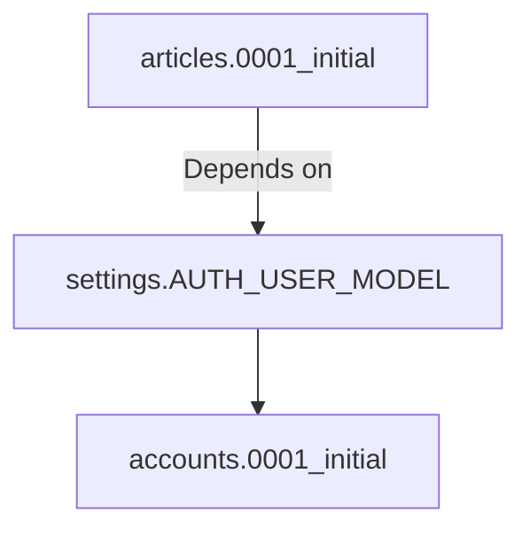
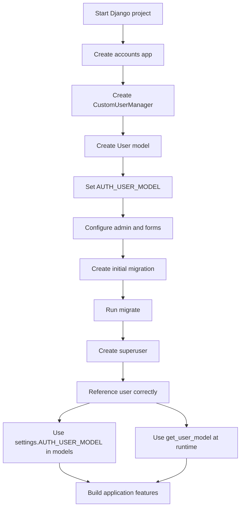
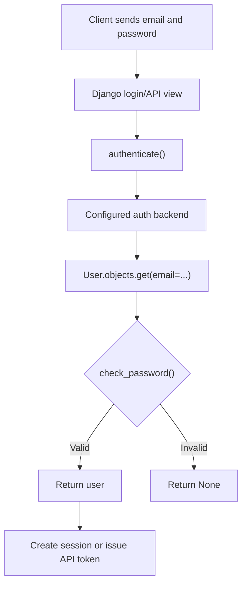
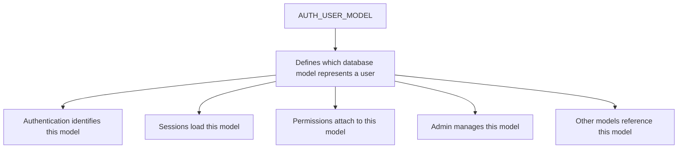

# Django Custom User Model

> A **custom user model** replaces Django's built-in `auth.User` model so that authentication can use fields and behavior designed for your application—for example, logging in with an email address instead of a username.

---

# 1. Why Django Provides a Custom User Model

Django includes a built-in user model:

```python
django.contrib.auth.models.User
```

It provides common authentication fields such as:

- `username`
- `password`
- `email`
- `first_name`
- `last_name`
- `is_active`
- `is_staff`
- `is_superuser`
- `last_login`
- `date_joined`

The default model is suitable for basic applications. Real applications, however, often need a different identity structure.

Common requirements include:

- Use email instead of username for login.
- Store a phone number.
- Use a UUID as the primary key.
- Add tenant, organization, or account information.
- Add domain-specific fields.
- Control how users and superusers are created.
- Integrate a custom identity provider.

A custom user model allows these requirements to be designed correctly from the beginning.

> [!IMPORTANT]
> Create the custom user model **at the start of the project**, before running the first migration. Changing `AUTH_USER_MODEL` after tables and relationships already exist is possible, but usually requires complex manual schema and data migration work.

---

# 2. Default User vs Custom User



| Area | Default `User` | Custom User |
|---|---|---|
| Login identifier | Username | Email, phone, UUID, employee ID, etc. |
| Extra fields | Requires related profile or replacement | Can be added directly |
| User creation | Django's default manager | Customizable manager |
| Admin behavior | Already configured | May require configuration |
| Migration flexibility | Easy initially | Must be configured before first migration |
| Long-term flexibility | Limited by built-in structure | Designed for project needs |

A useful rule is:

> Even when the first version looks simple, starting with a minimal `AbstractUser` subclass gives the project a safer extension point.

---

# 3. The Two Main Approaches

Django provides two important abstract classes for custom users.

## 3.1 Using `AbstractUser`

`AbstractUser` contains the complete implementation of Django's standard user.

It already includes:

- Password handling
- Permissions
- Groups
- Staff and superuser fields
- First name and last name
- Login-related fields
- Compatibility with much of Django admin

Example:

```python
from django.contrib.auth.models import AbstractUser
from django.db import models


class User(AbstractUser):
    phone_number = models.CharField(max_length=20, blank=True)
```

### When to use it

Use `AbstractUser` when:

- You want to add a few fields.
- You want email-based login.
- You still want Django's normal permissions system.
- You want the least complex and most maintainable solution.

For most normal business applications, this is the recommended approach.

---

## 3.2 Using `AbstractBaseUser`

`AbstractBaseUser` provides only the core authentication behavior:

- Hashed password storage
- Password checking
- Last-login support
- Password-related methods

It does **not** provide the complete permissions and admin structure.

A typical model also includes:

```python
from django.contrib.auth.models import AbstractBaseUser, PermissionsMixin
```

### When to use it

Use `AbstractBaseUser` when:

- Authentication is fundamentally different from Django's standard model.
- You need complete control over fields and behavior.
- The user is identified by a non-standard field.
- You understand the additional manager, admin, permission, and form work.

### Comparison

| Feature | `AbstractUser` | `AbstractBaseUser` |
|---|---|---|
| Standard Django fields | Included | Not included |
| Permissions | Included | Add `PermissionsMixin` |
| Admin integration | Easier | Must be configured |
| Custom manager | Sometimes needed | Required |
| Implementation effort | Low to medium | High |
| Best fit | Most applications | Highly specialized authentication |

> [!KEY]
> Prefer `AbstractUser` unless the project has a clear requirement that cannot be handled cleanly with it.

---

# 4. Recommended Project Setup

This section builds a practical email-based user model using `AbstractUser`.

The final structure will look like this:

```text
project/
├── accounts/
│   ├── admin.py
│   ├── apps.py
│   ├── forms.py
│   ├── managers.py
│   ├── migrations/
│   ├── models.py
│   └── tests.py
├── config/
│   ├── settings.py
│   └── urls.py
└── manage.py
```

---

## 4.1 Create the Accounts App

```bash
python manage.py startapp accounts
```

Add the app to `INSTALLED_APPS`:

```python
# config/settings.py

INSTALLED_APPS = [
    # Django applications...
    "django.contrib.admin",
    "django.contrib.auth",
    "django.contrib.contenttypes",
    "django.contrib.sessions",
    "django.contrib.messages",
    "django.contrib.staticfiles",

    # Local applications
    "accounts",
]
```

Keep authentication-related code in a dedicated app such as:

- `accounts`
- `users`
- `identity`

`accounts` is used in this guide.

---

## 4.2 Create a Custom Manager

When `username` is removed and email becomes the login identifier, define a manager that knows how to create normal users and superusers.

```python
# accounts/managers.py

from typing import Any

from django.contrib.auth.base_user import BaseUserManager


class CustomUserManager(BaseUserManager):
    """Manager for an email-based user model."""

    use_in_migrations = True

    def create_user(
        self,
        email: str,
        password: str | None = None,
        **extra_fields: Any,
    ):
        if not email:
            raise ValueError("An email address is required.")

        email = self.normalize_email(email)
        user = self.model(email=email, **extra_fields)
        user.set_password(password)
        user.save(using=self._db)
        return user

    def create_superuser(
        self,
        email: str,
        password: str | None = None,
        **extra_fields: Any,
    ):
        extra_fields.setdefault("is_staff", True)
        extra_fields.setdefault("is_superuser", True)
        extra_fields.setdefault("is_active", True)

        if extra_fields.get("is_staff") is not True:
            raise ValueError("A superuser must have is_staff=True.")

        if extra_fields.get("is_superuser") is not True:
            raise ValueError("A superuser must have is_superuser=True.")

        return self.create_user(email, password, **extra_fields)
```

### Why call `set_password()`?

Never assign a raw password directly:

```python
# Incorrect
user.password = "secret123"
```

`set_password()` hashes the password before it is stored:

```python
# Correct
user.set_password("secret123")
```

The database stores a value similar to:

```text
pbkdf2_sha256$...$salt$hash
```

It does not store the original password.

---

## 4.3 Create the User Model

```python
# accounts/models.py

import uuid

from django.contrib.auth.models import AbstractUser
from django.db import models

from .managers import CustomUserManager


class User(AbstractUser):
    """Application user authenticated by email address."""

    id = models.UUIDField(
        primary_key=True,
        default=uuid.uuid4,
        editable=False,
    )

    username = None

    email = models.EmailField(
        unique=True,
        db_index=True,
    )

    phone_number = models.CharField(
        max_length=20,
        blank=True,
    )

    USERNAME_FIELD = "email"
    REQUIRED_FIELDS: list[str] = []

    objects = CustomUserManager()

    def __str__(self) -> str:
        return self.email
```

### Important attributes

#### `username = None`

Removes the username field inherited from `AbstractUser`.

#### `USERNAME_FIELD = "email"`

Tells Django that email is the field used as the authentication identifier.

#### `REQUIRED_FIELDS = []`

Defines extra fields requested by the `createsuperuser` command.

Do not include:

- `USERNAME_FIELD`
- `password`

Django handles those separately.

#### `objects = CustomUserManager()`

Connects the custom manager to the model.

#### UUID primary key

A UUID is useful when user identifiers may appear in URLs, logs, APIs, distributed systems, or public resources.

Example:

```text
9ec51303-2115-40fb-9924-79ad8bb481f7
```

An integer primary key is also valid. UUID is a project design choice, not a requirement.

---

## 4.4 Configure `AUTH_USER_MODEL`

Add this setting before creating migrations:

```python
# config/settings.py

AUTH_USER_MODEL = "accounts.User"
```

The format is:

```text
<app_label>.<model_name>
```

For this example:

```text
accounts.User
```

Django will now treat `accounts.User` as the project's active user model.



---

## 4.5 Register the Model in Admin

Because the model extends `AbstractUser`, Django's `UserAdmin` can be reused and adjusted.

```python
# accounts/admin.py

from django.contrib import admin
from django.contrib.auth.admin import UserAdmin

from .models import User


@admin.register(User)
class CustomUserAdmin(UserAdmin):
    model = User

    ordering = ("email",)
    list_display = (
        "email",
        "first_name",
        "last_name",
        "is_staff",
        "is_active",
    )
    search_fields = (
        "email",
        "first_name",
        "last_name",
    )
    readonly_fields = ("date_joined", "last_login")

    fieldsets = (
        (None, {"fields": ("email", "password")}),
        (
            "Personal information",
            {
                "fields": (
                    "first_name",
                    "last_name",
                    "phone_number",
                )
            },
        ),
        (
            "Permissions",
            {
                "fields": (
                    "is_active",
                    "is_staff",
                    "is_superuser",
                    "groups",
                    "user_permissions",
                )
            },
        ),
        (
            "Important dates",
            {
                "fields": (
                    "last_login",
                    "date_joined",
                )
            },
        ),
    )

    add_fieldsets = (
        (
            None,
            {
                "classes": ("wide",),
                "fields": (
                    "email",
                    "password1",
                    "password2",
                    "is_staff",
                    "is_active",
                ),
            },
        ),
    )
```

### `fieldsets` vs `add_fieldsets`

- `fieldsets`: fields shown while editing an existing user.
- `add_fieldsets`: fields shown while creating a new user.

Both must be updated when the model has custom fields or removes fields expected by Django's default admin.

---

## 4.6 Create Custom Forms

Django's default `UserCreationForm` and `UserChangeForm` are tied to assumptions about the default user model. Extend them for your model.

```python
# accounts/forms.py

from django.contrib.auth.forms import UserChangeForm, UserCreationForm

from .models import User


class CustomUserCreationForm(UserCreationForm):
    class Meta(UserCreationForm.Meta):
        model = User
        fields = (
            "email",
            "first_name",
            "last_name",
            "phone_number",
        )


class CustomUserChangeForm(UserChangeForm):
    class Meta(UserChangeForm.Meta):
        model = User
        fields = (
            "email",
            "first_name",
            "last_name",
            "phone_number",
            "is_active",
        )
```

The forms can then be connected to the admin:

```python
# accounts/admin.py

from .forms import CustomUserChangeForm, CustomUserCreationForm


@admin.register(User)
class CustomUserAdmin(UserAdmin):
    add_form = CustomUserCreationForm
    form = CustomUserChangeForm

    # Remaining configuration...
```

---

## 4.7 Run Migrations

After the model and setting are ready:

```bash
python manage.py makemigrations accounts
python manage.py migrate
python manage.py createsuperuser
```

For email-based authentication, the command prompts for:

```text
Email:
Password:
Password (again):
```

> [!WARNING]
> The custom user model should be created in the app's initial migration, normally `accounts/migrations/0001_initial.py`.

---

# 5. How Authentication Works

A simplified login flow is:



Django's default `ModelBackend` uses the model's `USERNAME_FIELD`.

In this guide:

```python
USERNAME_FIELD = "email"
```

Therefore, the email is treated as the login identifier.

Example:

```python
from django.contrib.auth import authenticate, login


user = authenticate(
    request,
    email="developer@example.com",
    password="secure-password",
)

if user is not None:
    login(request, user)
```

In many forms and APIs, the argument may still be named `username` internally even when the actual identifier is email. The authentication backend resolves it through `USERNAME_FIELD`.

---

# 6. Referencing the User Model Correctly

Avoid importing the built-in user directly.

```python
# Avoid
from django.contrib.auth.models import User
```

That code becomes tightly coupled to `auth.User`.

Django provides two correct patterns.

---

## 6.1 Use `settings.AUTH_USER_MODEL` in Model Fields

Use this when defining a relationship at import time.

```python
from django.conf import settings
from django.db import models


class Article(models.Model):
    title = models.CharField(max_length=200)

    author = models.ForeignKey(
        settings.AUTH_USER_MODEL,
        on_delete=models.CASCADE,
        related_name="articles",
    )
```

This stores a lazy string reference such as:

```text
accounts.User
```

It prevents direct model-import problems and supports swapped user models.

---

## 6.2 Use `get_user_model()` at Runtime

Use it in:

- Views
- Services
- Commands
- Serializers
- Tests
- Runtime business logic

```python
from django.contrib.auth import get_user_model


User = get_user_model()

user = User.objects.get(email="developer@example.com")
```

### Practical rule



---

## 6.3 Signals

Reference the configured model instead of importing a specific user class.

```python
from django.conf import settings
from django.db.models.signals import post_save
from django.dispatch import receiver


@receiver(post_save, sender=settings.AUTH_USER_MODEL)
def user_saved(sender, instance, created, **kwargs):
    if created:
        # Perform lightweight post-creation work.
        pass
```

Keep signal behavior small and predictable. Complex onboarding workflows are usually easier to understand in an explicit service layer.

---

# 7. Adding User-Related Data

There are two common designs.

## 7.1 Store Fields Directly on the User

```python
class User(AbstractUser):
    username = None
    email = models.EmailField(unique=True)

    phone_number = models.CharField(max_length=20, blank=True)
    preferred_language = models.CharField(max_length=10, default="en")
```

Good candidates include data that is:

- Closely related to authentication or identity
- Required in most user-related operations
- Shared across the full application
- Needed frequently

Examples:

- Email
- Phone number
- Display name
- Account status
- Authentication-provider identifier

---

## 7.2 Use a Related Profile or Domain Model

```python
from django.conf import settings
from django.db import models


class EmployeeProfile(models.Model):
    user = models.OneToOneField(
        settings.AUTH_USER_MODEL,
        on_delete=models.CASCADE,
        related_name="employee_profile",
    )

    employee_code = models.CharField(max_length=30, unique=True)
    department = models.CharField(max_length=100)
    job_title = models.CharField(max_length=100)
```

Good candidates include data that is:

- Specific to one business domain
- Optional for many users
- Large or frequently changing
- Owned by a separate application module
- Not directly involved in authentication

### Design comparison

| Directly on User | Related Model |
|---|---|
| Simpler access | Better domain separation |
| Fewer joins | Keeps auth model smaller |
| Useful for common identity data | Useful for app-specific data |
| Can make user table large | Requires an additional relation/query |

### Recommended boundary

```text
User model
├── Authentication identity
├── Account status
├── Global personal identity
└── Permission-related information

Related domain models
├── Employee information
├── Customer preferences
├── Billing profile
├── Seller profile
└── Organization membership
```

---

# 8. Permissions and Admin Access

Django distinguishes several account states.

| Field | Meaning |
|---|---|
| `is_active` | Whether the account is active |
| `is_staff` | Whether the user may access Django admin |
| `is_superuser` | Whether the user automatically has all permissions |
| `groups` | Collections of permissions assigned to users |
| `user_permissions` | Permissions assigned directly to a user |

These fields are included when using `AbstractUser`.

Example:

```python
user.is_active = True
user.is_staff = False
user.is_superuser = False
user.save(
    update_fields=[
        "is_active",
        "is_staff",
        "is_superuser",
    ]
)
```

### Permission checks

```python
if request.user.has_perm("orders.change_order"):
    # User has permission.
    ...
```

Template usage:

```django

    <a href="">
        Edit order
    </a>

```

> [!NOTE]
> `is_staff=True` grants access to the admin site, but it does not automatically grant permission to every admin model. Permissions or superuser status are still relevant.

---

# 9. Using the Custom User in Views and Services

## 9.1 Registration Service

Keep important creation logic in a service or manager rather than duplicating it across views.

```python
# accounts/services.py

from django.contrib.auth import get_user_model
from django.db import transaction


@transaction.atomic
def register_user(
    *,
    email: str,
    password: str,
    first_name: str = "",
    last_name: str = "",
):
    User = get_user_model()

    return User.objects.create_user(
        email=email,
        password=password,
        first_name=first_name,
        last_name=last_name,
    )
```

Benefits:

- Centralized user-creation rules
- Easier testing
- Reusable from web views, APIs, commands, and background jobs
- Transaction support
- Less duplicated code

---

## 9.2 Function-Based View

```python
from django.contrib.auth.decorators import login_required
from django.http import JsonResponse


@login_required
def profile_view(request):
    return JsonResponse(
        {
            "id": str(request.user.pk),
            "email": request.user.email,
            "full_name": request.user.get_full_name(),
        }
    )
```

---

## 9.3 Class-Based View

```python
from django.contrib.auth.mixins import LoginRequiredMixin
from django.views.generic import DetailView


class MyProfileView(LoginRequiredMixin, DetailView):
    template_name = "accounts/profile.html"

    def get_object(self, queryset=None):
        return self.request.user
```

The authenticated user is available through:

```python
request.user
```

For unauthenticated requests, it is usually an `AnonymousUser` instance.

---

# 10. Using the Custom User with Django REST Framework

A basic registration serializer:

```python
from django.contrib.auth import get_user_model
from rest_framework import serializers


User = get_user_model()


class UserRegistrationSerializer(serializers.ModelSerializer):
    password = serializers.CharField(
        write_only=True,
        min_length=8,
        trim_whitespace=False,
    )

    class Meta:
        model = User
        fields = (
            "id",
            "email",
            "first_name",
            "last_name",
            "password",
        )
        read_only_fields = ("id",)

    def create(self, validated_data):
        return User.objects.create_user(**validated_data)
```

### Why not use `User.objects.create()`?

```python
# Incorrect for password-based accounts
User.objects.create(
    email="developer@example.com",
    password="plain-text-password",
)
```

This may store the password without proper hashing.

Use:

```python
User.objects.create_user(
    email="developer@example.com",
    password="secure-password",
)
```

or:

```python
user = User(email="developer@example.com")
user.set_password("secure-password")
user.save()
```

---

## 10.1 Current User Serializer

```python
class CurrentUserSerializer(serializers.ModelSerializer):
    class Meta:
        model = User
        fields = (
            "id",
            "email",
            "first_name",
            "last_name",
            "phone_number",
        )
        read_only_fields = (
            "id",
            "email",
        )
```

---

## 10.2 Avoid Exposing Sensitive Fields

Do not return fields such as:

- `password`
- Password hashes
- Reset tokens
- Internal security flags without a reason
- Sensitive identity-provider data
- Permission internals in public APIs

The password should usually be:

```python
write_only=True
```

---

# 11. Migration Considerations

A custom user model is a **swappable model**. Other applications may depend on whichever model is configured in `AUTH_USER_MODEL`.

Django migrations can represent this dependency using:

```python
migrations.swappable_dependency(settings.AUTH_USER_MODEL)
```

Example generated migration:

```python
from django.conf import settings
from django.db import migrations, models
import django.db.models.deletion


class Migration(migrations.Migration):
    dependencies = [
        migrations.swappable_dependency(settings.AUTH_USER_MODEL),
    ]

    operations = [
        migrations.CreateModel(
            name="Article",
            fields=[
                # Other fields...
                (
                    "author",
                    models.ForeignKey(
                        on_delete=django.db.models.deletion.CASCADE,
                        to=settings.AUTH_USER_MODEL,
                    ),
                ),
            ],
        ),
    ]
```

---

## 11.1 Why the User Must Be in `0001_initial`

Django dynamically resolves the configured user model.



If the user model is created in a later migration, dependency resolution may fail.

---

## 11.2 Circular Dependency Example

Suppose:

- `accounts.User` has a foreign key to `organizations.Organization`.
- `organizations.Organization` has a foreign key to the custom user.

This can create:

```text
accounts.0001 --> organizations.0001
       ^                 |
       |_________________|
```

A common solution is:

1. Create the user model in `accounts.0001_initial`.
2. Create the organization model in its initial migration.
3. Add one of the cross-app relationships in a later migration.

This breaks the circular dependency while keeping the user model in its initial migration.

---

## 11.3 Changing Mid-Project

Changing from `auth.User` to a custom model after migrations exist may require:

- Creating a replacement table
- Copying user data
- Updating foreign-key constraints
- Updating many-to-many tables
- Updating content types and permissions
- Updating migration dependencies
- Preserving password hashes
- Carefully planning deployment and rollback

This is not normally a simple settings change.

> [!IMPORTANT]
> Starting with a small custom user model is much easier than replacing the default user later.

---

# 12. Testing the Custom User Model

Tests should verify manager behavior, password hashing, uniqueness, and configuration.

```python
# accounts/tests.py

from django.contrib.auth import get_user_model
from django.test import TestCase


class UserModelTests(TestCase):
    def setUp(self):
        self.User = get_user_model()

    def test_create_user_with_email(self):
        user = self.User.objects.create_user(
            email="developer@example.com",
            password="strong-password",
        )

        self.assertEqual(user.email, "developer@example.com")
        self.assertTrue(user.check_password("strong-password"))
        self.assertFalse(user.is_staff)
        self.assertFalse(user.is_superuser)

    def test_email_is_normalized(self):
        user = self.User.objects.create_user(
            email="Developer@EXAMPLE.COM",
            password="strong-password",
        )

        self.assertEqual(user.email, "Developer@example.com")

    def test_email_is_required(self):
        with self.assertRaises(ValueError):
            self.User.objects.create_user(
                email="",
                password="strong-password",
            )

    def test_create_superuser(self):
        admin = self.User.objects.create_superuser(
            email="admin@example.com",
            password="strong-password",
        )

        self.assertTrue(admin.is_staff)
        self.assertTrue(admin.is_superuser)
        self.assertTrue(admin.is_active)
```

### Email normalization detail

`BaseUserManager.normalize_email()` normally lowercases the domain portion:

```text
Developer@EXAMPLE.COM
        becomes
Developer@example.com
```

It does not necessarily lowercase the complete email address.

When the application requires case-insensitive uniqueness, database behavior must be considered carefully. Possible approaches include:

- Normalize the complete email before storing it.
- Add a case-insensitive uniqueness constraint supported by the database.
- Use a functional unique constraint such as `Lower("email")`.
- Clearly define the application's email case policy.

Example for databases that support functional unique constraints:

```python
from django.db import models
from django.db.models.functions import Lower


class User(AbstractUser):
    # Fields...

    class Meta:
        constraints = [
            models.UniqueConstraint(
                Lower("email"),
                name="unique_user_email_case_insensitive",
            )
        ]
```

When using this constraint, decide whether `unique=True` on the field is still needed based on the target database and migration strategy.

---

# 13. Production Design Guidance

## 13.1 Keep Authentication Identity Small

The user model should mainly contain:

- Login identity
- Account status
- Global identity information
- Permission integration
- Small fields needed across the application

Avoid turning it into a container for every business field.

---

## 13.2 Use Database Constraints

Application validation alone is not enough under concurrency.

```python
email = models.EmailField(unique=True)
```

A database uniqueness constraint prevents two simultaneous requests from creating the same email account.

---

## 13.3 Normalize Before Saving

```python
email = self.normalize_email(email)
```

For stricter policies:

```python
email = self.normalize_email(email).strip().lower()
```

Use a consistent rule across:

- Registration
- Login
- Invitations
- Imports
- Admin
- Social authentication

---

## 13.4 Treat Email Changes as Security-Sensitive

Changing the login email may require:

- Password re-entry
- Email verification
- Audit logging
- Session invalidation
- Notification to the old email
- Duplicate checks
- Identity-provider synchronization

A simple model update may not be enough for production applications.

---

## 13.5 Do Not Use Email as an Immutable Foreign Identifier

Email addresses can change.

Use:

```python
user.pk
```

for relationships and permanent references.

Good:

```python
order.created_by_id
```

Risky:

```python
order.created_by_email
```

Email may be copied for historical display, but it should not replace the actual foreign key.

---

## 13.6 Separate Roles from Authentication

Avoid adding many booleans:

```python
is_manager = models.BooleanField(default=False)
is_accountant = models.BooleanField(default=False)
is_support_agent = models.BooleanField(default=False)
is_sales_agent = models.BooleanField(default=False)
```

As the application grows, this becomes hard to maintain.

Prefer:

- Django groups
- Django permissions
- Organization membership models
- Role tables
- Policy-based authorization

Example:

```python
class OrganizationMembership(models.Model):
    class Role(models.TextChoices):
        OWNER = "owner", "Owner"
        ADMIN = "admin", "Admin"
        MEMBER = "member", "Member"

    user = models.ForeignKey(
        settings.AUTH_USER_MODEL,
        on_delete=models.CASCADE,
        related_name="memberships",
    )
    organization = models.ForeignKey(
        "organizations.Organization",
        on_delete=models.CASCADE,
        related_name="memberships",
    )
    role = models.CharField(
        max_length=20,
        choices=Role,
        default=Role.MEMBER,
    )

    class Meta:
        constraints = [
            models.UniqueConstraint(
                fields=("user", "organization"),
                name="unique_user_organization_membership",
            )
        ]
```

This is more flexible for multi-tenant systems because one user may have a different role in each organization.

---

## 13.7 Avoid Business Logic in the Manager

The manager should handle model creation rules, such as:

- Normalize identifiers
- Set passwords
- Apply required flags
- Save through the correct database

Large workflows such as these usually belong in a service layer:

- Sending welcome emails
- Creating subscriptions
- Provisioning tenants
- Calling external APIs
- Creating multiple domain objects
- Running onboarding rules

---

## 13.8 Protect Personally Identifiable Information

User tables commonly contain sensitive information.

Consider:

- Restricting admin visibility
- Avoiding sensitive values in logs
- Encrypting fields when justified
- Auditing account changes
- Applying least-privilege database access
- Defining retention and deletion behavior
- Avoiding unnecessary duplication
- Masking sensitive values in support tools

---

# 14. Complete Project Flow



### Request-level flow



---

# 15. Key Takeaways

1. Configure a custom user model at the beginning of a Django project.
2. Use `AbstractUser` for most applications.
3. Use `AbstractBaseUser` only when complete control is necessary.
4. Set `AUTH_USER_MODEL` before the first migration.
5. Create the user model in the app's `0001_initial` migration.
6. Use `settings.AUTH_USER_MODEL` for model relationships.
7. Use `get_user_model()` for runtime Python code.
8. Use `set_password()` or `create_user()` so passwords are hashed.
9. Keep authentication fields on the user and domain-specific fields in related models.
10. Use groups, permissions, or membership models instead of many role booleans.
11. Test normal-user and superuser creation behavior.
12. Treat email changes and account identity as security-sensitive operations.

---

## Practical Mental Model



The most important architectural decision is not simply adding fields. It is ensuring that every part of the project depends on the **configured user model**, rather than being hard-coded to Django's default implementation.

---

## Official References

- Django 6.0 — Customizing authentication:  
  https://docs.djangoproject.com/en/6.0/topics/auth/customizing/

- Django 6.0 — `AUTH_USER_MODEL` setting:  
  https://docs.djangoproject.com/en/6.0/ref/settings/#auth-user-model

- Django 6.0 — Swappable migration dependencies:  
  https://docs.djangoproject.com/en/6.0/topics/migrations/#swappable-dependencies
