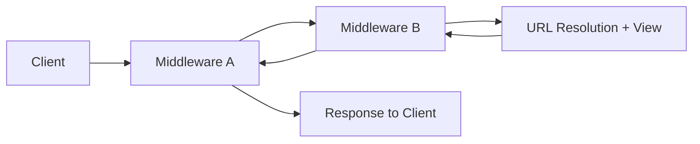
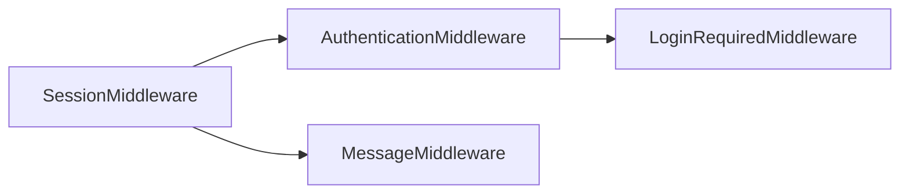
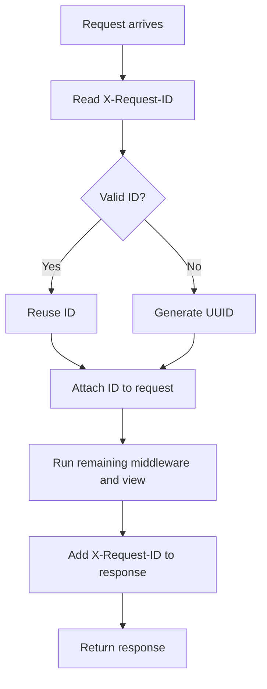
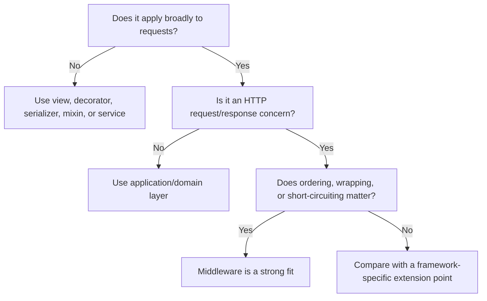

# Django Middleware

> Middleware is a lightweight layer around Django's request/response processing. It is mainly used for cross-cutting behavior that should apply to many or all requests from one central place.

> [!NOTE]
> This guide is aligned with **Django 6.1**, the latest official Django release as of August 2026. The same core middleware model also applies to supported Django 5.2 LTS and 6.0 projects.

## In Short

- Middleware runs around Django's view processing.
- Requests move **top to bottom** through `MIDDLEWARE`; responses return **bottom to top`.
- `__init__(get_response)` runs once when Django builds the middleware chain.
- `__call__(request)` runs for each request.
- A middleware can stop processing early by returning a response without calling `get_response(request)`.
- Middleware order matters because components can depend on earlier middleware.
- Django also supports `process_view()`, `process_exception()`, and `process_template_response()`.
- Middleware may be synchronous, asynchronous, or support both.
- Streaming responses must be handled without assuming `response.content` exists.

---

## Index

1. Middleware Concept and Request Flow
2. Middleware Structure and Onion Model
3. Registration and Ordering
   - Default Middleware
   - Important Ordering Dependencies
4. Practical Example — Request ID Middleware
5. Short-Circuiting Requests
6. Optional Middleware Hooks
7. Important Built-in Middleware
8. Sync, Async, and Streaming Responses
9. Middleware vs Other Django Extension Points
10. Production Best Practices

---

## 1. Middleware Concept and Request Flow

Middleware sits between Django's request handler and the view.

Typical uses include:

- Authentication and sessions
- CSRF and security headers
- Request logging
- Request IDs / correlation IDs
- Performance timing
- Language selection
- Global access rules
- Response compression

The simplified flow is:



The important idea is that middleware should normally handle **HTTP-level, cross-cutting concerns**, not feature-specific business logic.

---

## 2. Middleware Structure and Onion Model

A modern class-based middleware normally has two methods:

```python
class SimpleMiddleware:
    def __init__(self, get_response):
        self.get_response = get_response

    def __call__(self, request):
        # Before the next middleware/view
        response = self.get_response(request)

        # After the next middleware/view
        return response
```

### Initialization vs Request Processing

| Stage | Method | Runs | Purpose |
|---|---|---|---|
| Application startup | `__init__(get_response)` | Once | Store configuration or reusable dependencies |
| Request processing | `__call__(request)` | Per request | Inspect request, call next layer, modify response |

`get_response` usually represents the **next middleware**, not directly the view.

### Onion Model

For:

```python
MIDDLEWARE = [
    "project.middleware.MiddlewareA",
    "project.middleware.MiddlewareB",
    "project.middleware.MiddlewareC",
]
```

Execution looks like:

```text
Request
  ↓
Middleware A - before
  ↓
Middleware B - before
  ↓
Middleware C - before
  ↓
View
  ↑
Middleware C - after
  ↑
Middleware B - after
  ↑
Middleware A - after
  ↑
Response
```

This request-down / response-up behavior is one of the most important middleware concepts to understand for interviews.

---

## 3. Registration and Ordering

Middleware is enabled through the `MIDDLEWARE` setting.

```python
MIDDLEWARE = [
    "django.middleware.security.SecurityMiddleware",
    "django.contrib.sessions.middleware.SessionMiddleware",
    "django.middleware.common.CommonMiddleware",
    "django.middleware.csrf.CsrfViewMiddleware",
    "django.contrib.auth.middleware.AuthenticationMiddleware",
    "django.contrib.messages.middleware.MessageMiddleware",
    "django.middleware.clickjacking.XFrameOptionsMiddleware",
]
```

Each entry is the dotted Python path to a middleware class or factory.

### Important Ordering Dependencies

Ordering changes behavior.



Important rules:

| Middleware | Ordering reason |
|---|---|
| `SecurityMiddleware` | Usually near the top, especially for HTTPS redirects |
| `SessionMiddleware` | Must run before middleware that uses sessions |
| `AuthenticationMiddleware` | Must run after `SessionMiddleware` |
| `LoginRequiredMiddleware` | Must run after `AuthenticationMiddleware` |
| `MessageMiddleware` | Should run after `SessionMiddleware` |
| `GZipMiddleware` | Must be positioned carefully relative to middleware that reads or changes the response body |
| `UpdateCacheMiddleware` | Goes near the top of per-site cache configuration |
| `FetchFromCacheMiddleware` | Goes near the bottom of per-site cache configuration |
| `ContentSecurityPolicyMiddleware` | Can be placed near the bottom; ordering matters if another middleware accesses the CSP nonce |

If custom middleware needs `request.user`, place it **after `AuthenticationMiddleware`**.

If it needs `request.session`, place it **after `SessionMiddleware`**.

---

## 4. Practical Example — Request ID Middleware

A request ID is useful in APIs and distributed systems because the same identifier can be included in logs and returned to the client.

```python
# core/middleware.py

import re
from uuid import uuid4

REQUEST_ID_PATTERN = re.compile(r"^[A-Za-z0-9._-]{1,128}$")


class RequestIdMiddleware:
    def __init__(self, get_response):
        self.get_response = get_response

    def __call__(self, request):
        incoming_id = request.headers.get("X-Request-ID", "")

        if REQUEST_ID_PATTERN.fullmatch(incoming_id):
            request_id = incoming_id
        else:
            request_id = uuid4().hex

        request.request_id = request_id

        response = self.get_response(request)

        response["X-Request-ID"] = request_id
        return response
```

Register it:

```python
MIDDLEWARE = [
    "django.middleware.security.SecurityMiddleware",
    "core.middleware.RequestIdMiddleware",
    # ...
]
```

### Flow



This is a good middleware use case because request correlation belongs to the HTTP boundary and applies broadly across the application.

---

## 5. Short-Circuiting Requests

Middleware does not have to call:

```python
self.get_response(request)
```

It can return an `HttpResponse` immediately.

Conceptually:

```text
Request
  ↓
Middleware A
  ↓
Access Middleware
  ├── Allowed  → continue to next middleware/view
  └── Blocked  → return 403 response immediately
```

When a middleware short-circuits:

- The view does not run.
- Middleware below that component does not receive the request.
- The response only travels back through middleware layers that already received the request.

Common uses include:

- Maintenance mode
- Global network/IP restrictions
- Mandatory request headers
- Tenant resolution failures
- Coarse application-wide access checks

Endpoint-specific authorization is usually better handled by views, decorators, or DRF permission classes.

---

## 6. Optional Middleware Hooks

Class-based middleware can define three important hooks in addition to `__call__()`.

### 6.1 `process_view()`

```text
process_view(request, view_func, view_args, view_kwargs)
```

Runs immediately before Django calls the resolved view.

Return:

- `None` → continue processing
- `HttpResponse` → skip the view

Typical use: behavior that needs information about the resolved view.

Avoid reading `request.POST` unnecessarily before the view because it can interfere with custom upload-handler setup.

### 6.2 `process_exception()`

```text
process_exception(request, exception)
```

Runs when the **view** raises an exception.

Return:

- `None` → Django continues normal exception handling
- `HttpResponse` → convert the exception into a response

It is useful for targeted exception handling or observability, but it should not replace Django's normal error handling.

### 6.3 `process_template_response()`

```text
process_template_response(request, response)
```

Runs when the response has a `render()` method, such as `TemplateResponse`.

It can modify:

- `response.template_name`
- `response.context_data`

Use a context processor instead when the requirement is simply to add common variables to templates.

---

## 7. Important Built-in Middleware

| Middleware | Main responsibility |
|---|---|
| `SecurityMiddleware` | Security-related redirects and response headers |
| `SessionMiddleware` | Adds session support |
| `CommonMiddleware` | Common URL/HTTP behavior such as optional slash redirects |
| `CsrfViewMiddleware` | CSRF protection |
| `AuthenticationMiddleware` | Adds `request.user` |
| `LoginRequiredMiddleware` | Requires authentication by default except explicitly public views |
| `MessageMiddleware` | Django messages framework support |
| `XFrameOptionsMiddleware` | Clickjacking protection with `X-Frame-Options` |
| `GZipMiddleware` | Compresses eligible responses |
| `ConditionalGetMiddleware` | Handles `ETag`, `Last-Modified`, and `304 Not Modified` behavior |
| `LocaleMiddleware` | Chooses the active language |
| `ContentSecurityPolicyMiddleware` | Adds CSP headers configured through Django settings |

`ContentSecurityPolicyMiddleware` was introduced in Django 6.0 and remains available in Django 6.1.

### Per-Site Cache Ordering

Django's per-site cache uses two middleware components:

```python
MIDDLEWARE = [
    "django.middleware.cache.UpdateCacheMiddleware",
    # Other middleware...
    "django.middleware.cache.FetchFromCacheMiddleware",
]
```

The update middleware is near the top, while the fetch middleware is near the bottom.

---

## 8. Sync, Async, and Streaming Responses

### 8.1 Sync and Async Middleware

Django middleware can support:

- Sync only
- Async only
- Both sync and async

Default assumptions are:

```python
sync_capable = True
async_capable = False
```

Django can adapt between sync and async middleware, but every transition adds overhead.

For hybrid middleware, Django provides:

```python
from django.utils.decorators import sync_and_async_middleware
```

A middleware that supports both modes should ensure the callable it returns matches the sync/async nature of `get_response`.

### 8.2 Streaming Responses

`StreamingHttpResponse` does not expose the complete response body through `response.content`.

A middleware that modifies response bodies must check:

```python
if response.streaming:
    # Wrap response.streaming_content
    ...
else:
    # Safe to use response.content
    ...
```

Never consume the full streaming iterator into memory just to inspect or transform it.

Streaming content may use either synchronous or asynchronous iterators, so wrappers must match the iterator type.

---

## 9. Middleware vs Other Django Extension Points

Use the extension point that matches the scope of the requirement.

| Requirement | Better fit |
|---|---|
| Behavior for most requests | Middleware |
| Behavior for one view | View logic or decorator |
| DRF authorization | Authentication / permission class |
| Reusable business operation | Service layer |
| Shared template variables | Context processor |
| Modify a class-based view | Mixin |
| Form or API input validation | Form / serializer validation |
| Model lifecycle reaction | Explicit service call or carefully selected signal |

A useful rule:

> Use middleware when the concern belongs to the HTTP request/response boundary and applies broadly across the application.

---

## 10. Production Best Practices

### Keep middleware lightweight

Middleware runs on many requests, so avoid unnecessary:

- Database queries
- External API calls
- Large request-body parsing
- Expensive serialization
- CPU-heavy work
- Blocking I/O in an async stack

### Keep business logic elsewhere

Middleware should coordinate HTTP-level behavior.

```text
Good middleware responsibility:
Resolve tenant information from the request.

Business/service responsibility:
Calculate the tenant's insurance premium.
```

### Keep request-specific state local

A middleware instance is created once and reused.

Use request-local variables or attach data to `request`:

```python
request.request_id = request_id
```

Do not store per-request values on `self`.

### Treat forwarded headers as untrusted by default

Headers such as:

```text
X-Forwarded-For
X-Forwarded-Proto
X-Real-IP
X-Request-ID
```

may come directly from clients unless your reverse proxy removes or rewrites them.

Only trust proxy-related headers when the proxy and Django configuration are controlled together.

### Use structured, privacy-aware logging

Useful log fields include:

```text
request_id
method
path
status_code
duration_ms
user_id
```

Avoid logging passwords, cookies, authorization headers, tokens, or unnecessary personal data.

### Use infrastructure when it is a better layer

| Concern | Common preferred layer |
|---|---|
| TLS termination | Load balancer / reverse proxy |
| Static compression | CDN / reverse proxy |
| Basic rate limiting | API gateway / reverse proxy |
| DDoS protection | Cloud/edge provider |
| Request-aware Django context | Middleware |

---

## Final Mental Model



For interviews, remember these five points first:

1. Middleware wraps Django's request/response processing.
2. Requests go top-down; responses return bottom-up.
3. `__init__()` runs once, while `__call__()` runs per request.
4. Ordering is part of behavior.
5. Middleware is best for broad HTTP-level cross-cutting concerns.
