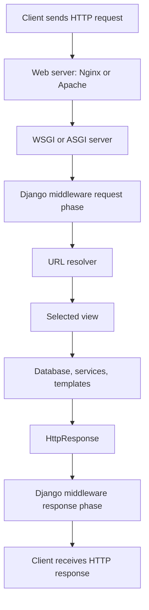
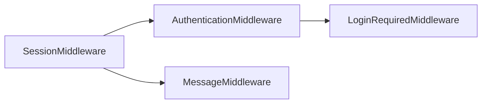
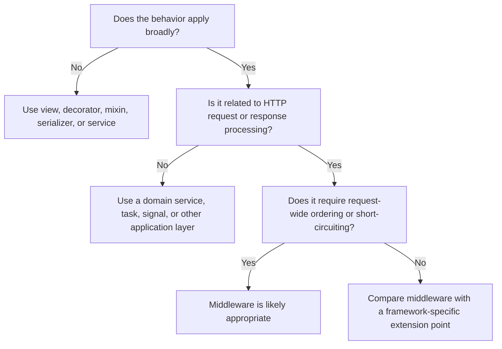

# Django Middleware

> Middleware is a lightweight layer that runs around Django's view processing. It can inspect or modify every incoming request and outgoing response from one central place.

> [!NOTE]
> This guide is aligned with **Django 6.0.7**, the current stable patch release at the time of verification. Most core middleware concepts also apply to Django 4.2 and 5.x projects.

---

## 1. What Middleware Is

Middleware is a component placed between the web server and the Django view.

It is useful when the same behavior must apply to many or all requests, such as:

- Authentication and session handling
- CSRF protection
- Security headers
- Request logging
- Request ID or correlation ID generation
- Performance measurement
- Language selection
- Response compression
- Global access rules

A middleware component receives a request and normally passes it to the next component by calling `get_response(request)`.

```python
class SimpleMiddleware:
    def __init__(self, get_response):
        self.get_response = get_response

    def __call__(self, request):
        # Code executed before the next middleware or view.

        response = self.get_response(request)

        # Code executed after the view returns a response.

        return response
```

### Core idea

```text
Incoming Request
      │
      ▼
  Middleware
      │
      ▼
     View
      │
      ▼
  Middleware
      │
      ▼
Outgoing Response
```

Middleware should generally handle **cross-cutting concerns**—behavior shared across multiple endpoints—not business logic belonging to one feature.

---

## 2. Where Middleware Fits

A simplified Django request lifecycle looks like this:



Middleware runs around the view, but URL resolution occurs before Django calls `process_view()` hooks. The normal middleware callable itself still wraps the complete inner request-processing chain.

### Middleware initialization vs request execution

A class-based middleware has two important stages:

| Stage | Method | Frequency | Typical use |
|---|---|---:|---|
| Application startup | `__init__(get_response)` | Once | Store dependencies, compile patterns, validate configuration |
| Request processing | `__call__(request)` | Once per request | Inspect request, call next layer, modify response |

```python
class ExampleMiddleware:
    def __init__(self, get_response):
        self.get_response = get_response
        self.enabled = True  # Created once at server startup.

    def __call__(self, request):
        # Runs for every request.
        response = self.get_response(request)
        return response
```

Do not store request-specific mutable data on `self`. The same middleware instance may serve many requests concurrently.

```python
# Avoid this pattern.
class UnsafeMiddleware:
    def __init__(self, get_response):
        self.get_response = get_response
        self.current_user = None

    def __call__(self, request):
        self.current_user = request.user  # Shared mutable state
        return self.get_response(request)
```

Use local variables or attach request-scoped values to the request object instead.

---

## 3. The Onion Model

Django middleware behaves like layers of an onion.

Given this configuration:

```python
MIDDLEWARE = [
    "project.middleware.MiddlewareA",
    "project.middleware.MiddlewareB",
    "project.middleware.MiddlewareC",
]
```

The request enters from top to bottom. The response returns from bottom to top.

```text
REQUEST PHASE                         RESPONSE PHASE

Client                                   Client
  │                                        ▲
  ▼                                        │
Middleware A  ───────────────────────── Middleware A
  │                                        ▲
  ▼                                        │
Middleware B  ───────────────────────── Middleware B
  │                                        ▲
  ▼                                        │
Middleware C  ───────────────────────── Middleware C
  │                                        ▲
  ▼                                        │
 View  ───────────── creates response ──────┘
```

The effective execution order is:

```text
A before
    B before
        C before
            View
        C after
    B after
A after
```

### Demonstration

```python
class LoggingMiddleware:
    def __init__(self, get_response):
        self.get_response = get_response

    def __call__(self, request):
        print("Before view")
        response = self.get_response(request)
        print("After view")
        return response
```

`get_response` does not always point directly to the view. It usually points to the next middleware layer, which eventually reaches the view.

---

## 4. Creating Custom Middleware

Django supports middleware written as either a class or a function.

### 4.1 Class-based middleware

This is generally the clearest style for production code.

```python
# core/middleware.py

class CustomHeaderMiddleware:
    def __init__(self, get_response):
        self.get_response = get_response

    def __call__(self, request):
        response = self.get_response(request)
        response["X-Application"] = "billing-api"
        return response
```

#### Execution flow

```text
1. Django creates CustomHeaderMiddleware(get_response) at startup.
2. A request arrives.
3. Django calls middleware_instance(request).
4. The middleware calls the next layer.
5. The view eventually produces a response.
6. The middleware adds X-Application to the response.
7. The response returns to the previous layer.
```

### 4.2 Function-based middleware

A middleware factory receives `get_response` and returns the actual request handler.

```python
def custom_header_middleware(get_response):
    def middleware(request):
        response = get_response(request)
        response["X-Application"] = "billing-api"
        return response

    return middleware
```

Both forms are valid. Class-based middleware is often easier to extend with configuration and optional middleware hooks.

### 4.3 Disabling middleware during startup

A middleware can raise `MiddlewareNotUsed` during initialization when it should not be activated.

```python
from django.conf import settings
from django.core.exceptions import MiddlewareNotUsed


class DevelopmentOnlyMiddleware:
    def __init__(self, get_response):
        if not settings.DEBUG:
            raise MiddlewareNotUsed

        self.get_response = get_response

    def __call__(self, request):
        response = self.get_response(request)
        response["X-Debug-Mode"] = "enabled"
        return response
```

This check happens at startup rather than for every request.

---

## 5. Registering Middleware

Add the dotted Python path to the `MIDDLEWARE` list in `settings.py`.

```python
MIDDLEWARE = [
    "django.middleware.security.SecurityMiddleware",
    "django.contrib.sessions.middleware.SessionMiddleware",
    "django.middleware.common.CommonMiddleware",
    "django.middleware.csrf.CsrfViewMiddleware",
    "django.contrib.auth.middleware.AuthenticationMiddleware",
    "django.contrib.messages.middleware.MessageMiddleware",
    "django.middleware.clickjacking.XFrameOptionsMiddleware",
    "core.middleware.CustomHeaderMiddleware",
]
```

The path must point to the middleware class or factory function.

```text
core/
├── __init__.py
├── middleware.py
└── views.py
```

```python
# Dotted path
"core.middleware.CustomHeaderMiddleware"
```

Django technically allows an empty `MIDDLEWARE` list, but normal projects depend on middleware for security, sessions, authentication, and common HTTP behavior.

---

## 6. Middleware Ordering

Middleware order is part of application behavior, not just configuration style.

For example:

- `AuthenticationMiddleware` needs `SessionMiddleware` because Django authentication normally reads the logged-in user from the session.
- `MessageMiddleware` commonly uses session-based storage, so it should follow `SessionMiddleware`.
- `LoginRequiredMiddleware` needs `AuthenticationMiddleware` because it checks `request.user`.
- `SecurityMiddleware` normally belongs near the top.

### Common default order

```python
MIDDLEWARE = [
    "django.middleware.security.SecurityMiddleware",
    "django.contrib.sessions.middleware.SessionMiddleware",
    "django.middleware.common.CommonMiddleware",
    "django.middleware.csrf.CsrfViewMiddleware",
    "django.contrib.auth.middleware.AuthenticationMiddleware",
    "django.contrib.messages.middleware.MessageMiddleware",
    "django.middleware.clickjacking.XFrameOptionsMiddleware",
]
```

### Dependency diagram



### Positioning custom middleware

Place custom middleware according to what it needs.

#### Needs `request.user`

Place it after `AuthenticationMiddleware`.

```python
MIDDLEWARE = [
    # ...
    "django.contrib.auth.middleware.AuthenticationMiddleware",
    "core.middleware.UserAuditMiddleware",
    # ...
]
```

#### Needs `request.session`

Place it after `SessionMiddleware`.

```python
MIDDLEWARE = [
    # ...
    "django.contrib.sessions.middleware.SessionMiddleware",
    "core.middleware.TenantSessionMiddleware",
    # ...
]
```

#### Must measure the broadest possible request duration

Place it near the top so that it wraps most other middleware.

```python
MIDDLEWARE = [
    "django.middleware.security.SecurityMiddleware",
    "core.middleware.RequestTimingMiddleware",
    # ...
]
```

#### Must process the final response body

Remember that response order is reversed. Middleware near the top receives the response after lower middleware has already processed it.

---

## 7. Short-Circuiting a Request

A middleware does not have to call `get_response()`.

It may immediately return an `HttpResponse`, preventing later middleware and the view from running.

```python
from django.http import JsonResponse


class MaintenanceModeMiddleware:
    def __init__(self, get_response):
        self.get_response = get_response

    def __call__(self, request):
        if request.path.startswith("/api/"):
            return JsonResponse(
                {"detail": "Service is temporarily unavailable."},
                status=503,
            )

        return self.get_response(request)
```

### Short-circuit flow

```text
Request
  │
  ▼
Middleware A
  │
  ▼
Maintenance Middleware ─────► 503 Response
  │                              │
  X View is not called           ▼
                         Middleware A response phase
```

Only middleware layers that received the request will receive the returning response.

### Appropriate uses

- Planned maintenance mode
- Global IP or network restrictions
- Required global headers or tenant identifiers
- Coarse application-wide access policies
- Fast health-check handling

Feature-specific permission checks are often clearer in views, DRF permission classes, decorators, or service-layer authorization.

---

## 8. Middleware Hooks

In addition to `__call__()`, Django supports optional hooks for specific stages.

### 8.1 `process_view()`

Called immediately before Django calls the resolved view.

```python
class ViewInfoMiddleware:
    def __init__(self, get_response):
        self.get_response = get_response

    def __call__(self, request):
        return self.get_response(request)

    def process_view(self, request, view_func, view_args, view_kwargs):
        request.view_name = view_func.__name__
        return None
```

Signature:

```python
process_view(request, view_func, view_args, view_kwargs)
```

Return:

- `None`: Continue to the next hook and then the view.
- `HttpResponse`: Skip the view and return that response.

Avoid accessing `request.POST` unnecessarily in middleware before the view. Doing so can interfere with views that need to customize upload handlers.

### 8.2 `process_exception()`

Called when the view raises an exception.

```python
import logging

logger = logging.getLogger(__name__)


class ViewExceptionLoggingMiddleware:
    def __init__(self, get_response):
        self.get_response = get_response

    def __call__(self, request):
        return self.get_response(request)

    def process_exception(self, request, exception):
        logger.exception(
            "View raised an exception",
            extra={"path": request.path},
        )
        return None
```

Return:

- `None`: Let Django continue normal exception handling.
- `HttpResponse`: Convert the exception into a custom response.

Use this hook carefully. It is mainly for exceptions raised by views, not a universal replacement for Django's error handling or an observability platform.

### 8.3 `process_template_response()`

Called when the returned response has a `render()` method, such as `TemplateResponse`.

```python
class TemplateContextMiddleware:
    def __init__(self, get_response):
        self.get_response = get_response

    def __call__(self, request):
        return self.get_response(request)

    def process_template_response(self, request, response):
        response.context_data["application_name"] = "Policy Portal"
        return response
```

It can:

- Modify `response.template_name`
- Modify `response.context_data`
- Return a different template response

For standard template variables used throughout the project, a context processor is often more direct.

### 8.4 Legacy `process_request()` and `process_response()`

Older middleware commonly used `MiddlewareMixin`.

```python
from django.utils.deprecation import MiddlewareMixin


class LegacyStyleMiddleware(MiddlewareMixin):
    def process_request(self, request):
        return None

    def process_response(self, request, response):
        response["X-Legacy-Style"] = "true"
        return response
```

`MiddlewareMixin` remains available for compatibility, but new middleware is generally clearer with the modern `__init__` and `__call__` style.

---

## 9. Built-in Django Middleware

Django provides middleware for common web application requirements.

### 9.1 Common default middleware

| Middleware | Main responsibility |
|---|---|
| `SecurityMiddleware` | Security-related redirects and response headers |
| `SessionMiddleware` | Adds session support to requests |
| `CommonMiddleware` | Common URL and HTTP behavior, including optional slash redirects |
| `CsrfViewMiddleware` | CSRF validation for unsafe requests |
| `AuthenticationMiddleware` | Adds `request.user` |
| `MessageMiddleware` | Enables Django's messages framework |
| `XFrameOptionsMiddleware` | Adds clickjacking protection through `X-Frame-Options` |

### 9.2 Other useful built-in middleware

| Middleware | Use case |
|---|---|
| `GZipMiddleware` | Compress eligible responses for clients supporting gzip |
| `ConditionalGetMiddleware` | Handles `ETag`, `Last-Modified`, and `304 Not Modified` behavior |
| `LocaleMiddleware` | Chooses the active language from request data |
| `UpdateCacheMiddleware` | Stores responses in Django's per-site cache |
| `FetchFromCacheMiddleware` | Returns responses from the per-site cache |
| `LoginRequiredMiddleware` | Requires login by default, with explicitly public views excluded |
| `ContentSecurityPolicyMiddleware` | Adds Content Security Policy headers based on settings |

`ContentSecurityPolicyMiddleware` is available in Django 6.0 and supports both enforcement and report-only CSP headers through Django settings.

### 9.3 Per-site cache ordering

Per-site cache middleware uses two components:

```python
MIDDLEWARE = [
    "django.middleware.cache.UpdateCacheMiddleware",
    # Other middleware...
    "django.middleware.cache.FetchFromCacheMiddleware",
]
```

The update middleware belongs near the top, while the fetch middleware belongs near the bottom. Their position ensures the cache key includes relevant response variation information.

---

## 10. Practical Custom Middleware Examples

### 10.1 Request timing middleware

Use `time.perf_counter()` for elapsed-time measurement.

```python
# core/middleware.py

import logging
import time

logger = logging.getLogger(__name__)


class RequestTimingMiddleware:
    def __init__(self, get_response):
        self.get_response = get_response

    def __call__(self, request):
        started_at = time.perf_counter()

        response = self.get_response(request)

        duration_ms = (time.perf_counter() - started_at) * 1000

        response["Server-Timing"] = f"django;dur={duration_ms:.2f}"

        logger.info(
            "HTTP request completed",
            extra={
                "http_method": request.method,
                "http_path": request.path,
                "status_code": response.status_code,
                "duration_ms": round(duration_ms, 2),
            },
        )

        return response
```

#### Flow

```text
Request arrives
    │
    ├── Record start time
    │
    ├── Run remaining middleware and view
    │
    ├── Calculate elapsed time
    │
    ├── Add Server-Timing header
    │
    └── Return response
```

For complete observability, use middleware alongside metrics and tracing systems rather than relying only on application logs.

---

### 10.2 Request ID middleware

A request ID helps connect logs from the same HTTP request.

```python
import re
from uuid import uuid4

REQUEST_ID_PATTERN = re.compile(r"^[A-Za-z0-9._-]{1,128}$")


class RequestIdMiddleware:
    def __init__(self, get_response):
        self.get_response = get_response

    def __call__(self, request):
        incoming_id = request.headers.get("X-Request-ID", "")

        if REQUEST_ID_PATTERN.fullmatch(incoming_id):
            request_id = incoming_id
        else:
            request_id = uuid4().hex

        request.request_id = request_id

        response = self.get_response(request)
        response["X-Request-ID"] = request_id
        return response
```

The validation prevents an untrusted client from injecting an extremely long or malformed value into logs and downstream headers.

In distributed systems, propagate the same identifier—or standardized trace context—to downstream services.

---

### 10.3 Path-based access middleware

```python
from django.http import JsonResponse


class InternalApiMiddleware:
    INTERNAL_PREFIX = "/internal/"

    def __init__(self, get_response):
        self.get_response = get_response

    def __call__(self, request):
        if request.path.startswith(self.INTERNAL_PREFIX):
            internal_token = request.headers.get("X-Internal-Token")

            if internal_token != "configured-secret-placeholder":
                return JsonResponse(
                    {"detail": "Access denied."},
                    status=403,
                )

        return self.get_response(request)
```

In real applications, do not hard-code secrets. Read secrets from secure configuration and use constant-time comparison where appropriate. For mature internal APIs, prefer gateway authentication, signed credentials, mTLS, or a standard identity mechanism.

---

### 10.4 User audit middleware

This middleware requires `AuthenticationMiddleware` to run first.

```python
import logging

logger = logging.getLogger(__name__)


class UserAuditMiddleware:
    def __init__(self, get_response):
        self.get_response = get_response

    def __call__(self, request):
        response = self.get_response(request)

        user = getattr(request, "user", None)
        user_id = user.pk if user and user.is_authenticated else None

        logger.info(
            "User request processed",
            extra={
                "user_id": user_id,
                "method": request.method,
                "path": request.path,
                "status_code": response.status_code,
            },
        )

        return response
```

Avoid logging passwords, tokens, cookies, authorization headers, personal data, full request bodies, or sensitive query parameters.

---

## 11. Synchronous and Asynchronous Middleware

Django middleware may support:

- Synchronous requests only
- Asynchronous requests only
- Both synchronous and asynchronous requests

By default, Django assumes middleware is synchronous-capable and not asynchronous-capable.

```python
sync_capable = True
async_capable = False
```

Django can adapt between sync and async execution, but each transition adds overhead. A mostly asynchronous ASGI application should avoid unnecessary synchronous-only middleware.

### 11.1 Hybrid middleware

The following middleware supports both modes.

```python
from asgiref.sync import iscoroutinefunction
from django.utils.decorators import sync_and_async_middleware


@sync_and_async_middleware
def request_mode_middleware(get_response):
    if iscoroutinefunction(get_response):

        async def middleware(request):
            request.execution_mode = "async"
            response = await get_response(request)
            response["X-Execution-Mode"] = "async"
            return response

    else:

        def middleware(request):
            request.execution_mode = "sync"
            response = get_response(request)
            response["X-Execution-Mode"] = "sync"
            return response

    return middleware
```

### 11.2 Async-only class middleware

An asynchronous class-based middleware must correctly advertise and mark its asynchronous behavior.

```python
from asgiref.sync import iscoroutinefunction, markcoroutinefunction


class AsyncOnlyMiddleware:
    sync_capable = False
    async_capable = True

    def __init__(self, get_response):
        self.get_response = get_response

        if iscoroutinefunction(get_response):
            markcoroutinefunction(self)

    async def __call__(self, request):
        response = await self.get_response(request)
        response["X-Async-Middleware"] = "enabled"
        return response
```

Use async middleware when its own work uses async-compatible I/O and the surrounding stack is meaningfully asynchronous. Making CPU-heavy work `async` does not make it non-blocking.

---

## 12. Streaming Responses

A normal `HttpResponse` exposes its full body through `response.content`.

A `StreamingHttpResponse` sends content incrementally and does not provide the complete body through `response.content`.

```python
if response.streaming:
    response.streaming_content = wrap_streaming_content(
        response.streaming_content
    )
else:
    response.content = alter_content(response.content)
```

A wrapper must not consume the complete streaming iterator into memory.

```python
def wrap_streaming_content(content):
    for chunk in content:
        yield alter_content(chunk)
```

### Why this matters

```text
Normal HttpResponse
[Complete body already available in memory]

StreamingHttpResponse
[chunk 1] → [chunk 2] → [chunk 3] → ...
```

Middleware that performs compression, body transformation, hashing, logging, or content inspection must explicitly handle streaming responses. Streaming content can be synchronous or asynchronous, so a wrapper must match the iterator type.

---

## 13. Middleware vs Similar Django Features

Choosing the correct extension point keeps the codebase understandable.

| Requirement | Better fit |
|---|---|
| Behavior for almost every request | Middleware |
| Behavior for one view | Decorator or view logic |
| Authorization in Django REST Framework | Authentication or permission class |
| Reusable domain operation | Service layer |
| Add variables to many templates | Context processor |
| React to model lifecycle events | Explicit service call or, selectively, signal |
| Modify one class-based view | Mixin |
| Validate one form or serializer | Form or serializer validation |

### Example comparison

#### Middleware

```python
# Applies globally.
class RequestIdMiddleware:
    ...
```

#### Decorator

```python
# Applies only to selected views.
@login_required
def dashboard(request):
    ...
```

#### DRF permission

```python
# Applies to selected API views or globally through DRF settings.
class IsAccountMember(BasePermission):
    ...
```

A good rule is:

> Use middleware when the concern belongs to the HTTP request/response boundary and applies broadly across the application.

---

## 14. Testing Middleware

Middleware should be tested independently and through Django's full request stack.

### 14.1 Unit test with `RequestFactory`

```python
from django.http import HttpResponse
from django.test import RequestFactory, SimpleTestCase

from core.middleware import RequestIdMiddleware


class RequestIdMiddlewareTests(SimpleTestCase):
    def setUp(self):
        self.factory = RequestFactory()

    def test_adds_generated_request_id(self):
        get_response = lambda request: HttpResponse("OK")
        middleware = RequestIdMiddleware(get_response)
        request = self.factory.get("/health/")

        response = middleware(request)

        self.assertTrue(request.request_id)
        self.assertEqual(
            response["X-Request-ID"],
            request.request_id,
        )

    def test_preserves_valid_incoming_request_id(self):
        get_response = lambda request: HttpResponse("OK")
        middleware = RequestIdMiddleware(get_response)
        request = self.factory.get(
            "/health/",
            headers={"X-Request-ID": "req-123"},
        )

        response = middleware(request)

        self.assertEqual(request.request_id, "req-123")
        self.assertEqual(response["X-Request-ID"], "req-123")
```

### 14.2 Integration test with Django test client

```python
from django.test import TestCase, override_settings


@override_settings(
    MIDDLEWARE=[
        "django.middleware.common.CommonMiddleware",
        "core.middleware.RequestIdMiddleware",
    ]
)
class MiddlewareIntegrationTests(TestCase):
    def test_header_is_present_on_real_response(self):
        response = self.client.get("/health/")

        self.assertIn("X-Request-ID", response)
```

Integration tests are important when behavior depends on middleware order, sessions, authentication, URL resolution, templates, or exception handling.

### 14.3 Test the important paths

A complete middleware test set usually covers:

- Request continues normally
- Request is short-circuited
- Required header or request attribute is added
- Invalid input is rejected or replaced
- Response status and body remain correct
- Anonymous and authenticated requests
- Dependency on middleware ordering
- Streaming response behavior, when relevant
- Sync and async execution, when both are supported

---

## 15. Production Best Practices

### 15.1 Keep the hot path lightweight

Middleware runs frequently. Avoid unnecessary:

- Database queries
- External network calls
- Large request-body parsing
- Expensive serialization
- Blocking work in an async stack

A small delay added by global middleware affects every matching request.

### 15.2 Keep business logic out of middleware

Middleware should coordinate HTTP-level concerns. Pricing, claims, payments, commissions, or order processing should normally live in application services or domain modules.

```text
Middleware responsibility:
"Attach a tenant identifier to the request."

Service responsibility:
"Calculate the tenant-specific insurance premium."
```

### 15.3 Document ordering requirements

Keep the dependency close to the middleware code.

```python
class UserAuditMiddleware:
    """Must be placed after AuthenticationMiddleware."""
```

Also add an automated integration test so accidental reordering is detected.

### 15.4 Avoid request-specific instance state

Use:

```python
def __call__(self, request):
    request_id = create_request_id()
```

Avoid:

```python
def __call__(self, request):
    self.request_id = create_request_id()
```

The latter can leak state across concurrent requests.

### 15.5 Do not blindly trust proxy headers

Headers such as these may be supplied by clients unless a trusted proxy removes and rewrites them:

```text
X-Forwarded-For
X-Forwarded-Proto
X-Real-IP
X-Request-ID
```

Configure the reverse proxy and Django together. Only trust forwarding headers from known infrastructure.

### 15.6 Preserve streaming behavior

Do not convert a streaming iterator into a list merely to inspect it.

```python
# Avoid: loads the complete stream into memory.
all_chunks = list(response.streaming_content)
```

Wrap and yield chunks instead.

### 15.7 Use structured and privacy-aware logging

Prefer stable fields:

```python
logger.info(
    "Request completed",
    extra={
        "request_id": request.request_id,
        "method": request.method,
        "path": request.path,
        "status_code": response.status_code,
    },
)
```

Do not record secrets or unnecessary personal information.

### 15.8 Use infrastructure where it is stronger

Some responsibilities may be better handled by a reverse proxy, API gateway, CDN, or observability agent:

| Concern | Common preferred layer |
|---|---|
| TLS termination | Load balancer or reverse proxy |
| Static-file compression | CDN or reverse proxy |
| Basic rate limiting | API gateway or reverse proxy |
| Distributed tracing | Instrumentation library or tracing agent |
| DDoS protection | Edge or cloud provider |
| Application-aware request context | Django middleware |

Django middleware is still valuable when behavior requires Django settings, URL information, sessions, users, or application-specific request context.

---

## 16. Decision Guide

Use this flow before creating middleware:



### Good middleware candidates

- Request IDs
- Global request timing
- Application-wide security headers
- Tenant resolution from host or trusted token
- Global maintenance mode
- Broad request logging
- Language selection

### Usually better elsewhere

- Endpoint-specific validation
- DRF object permissions
- Payment calculations
- Sending transactional emails
- Model-specific side effects
- Feature-specific database queries
- Complex workflow orchestration

---

## 17. Summary

```text
Middleware = a layer around Django's request/response processing.
```

Key points:

1. Requests move through `MIDDLEWARE` from top to bottom.
2. Responses return through middleware from bottom to top.
3. `__init__()` runs once; `__call__()` runs per request.
4. Calling `get_response(request)` passes control to the next layer.
5. Returning a response without calling `get_response()` short-circuits the chain.
6. Ordering matters because middleware can depend on sessions, authentication, CSRF, caching, or response-body state.
7. Custom middleware should remain lightweight, stateless between requests, and focused on cross-cutting HTTP concerns.
8. Async middleware should correctly declare its capabilities to avoid unnecessary sync/async adaptation.
9. Streaming responses require special handling because their complete body is not available as `response.content`.
10. Unit tests validate middleware logic; integration tests validate ordering and full-stack behavior.

### Mental model

```text
Request
  ↓
[Security]
  ↓
[Session]
  ↓
[Authentication]
  ↓
[Custom Middleware]
  ↓
[View]
  ↑
[Custom Middleware]
  ↑
[Authentication]
  ↑
[Session]
  ↑
[Security]
  ↑
Response
```

---

## Official References

- [Django middleware documentation](https://docs.djangoproject.com/en/6.0/topics/http/middleware/)
- [Django built-in middleware reference](https://docs.djangoproject.com/en/6.0/ref/middleware/)
- [Django asynchronous support](https://docs.djangoproject.com/en/6.0/topics/async/)
- [Django settings reference](https://docs.djangoproject.com/en/6.0/ref/settings/)
- [Supported Django versions](https://www.djangoproject.com/download/)
