# Django Migrations: How They Work & Common Issues

> [!KEY]
> A Django migration is a **versioned instruction file** that moves the database schema and, when required, its data from one known state to another.

**Version note:** This guide is aligned with Django **6.0** migration behavior. Most concepts also apply to Django 4.2 LTS and 5.2 LTS.

---

# 1. Why Migrations Exist

A Django model describes how application data should look:

```python
from django.db import models


class Product(models.Model):
    name = models.CharField(max_length=120)
    price = models.DecimalField(max_digits=10, decimal_places=2)
```

However, changing a Python class does not directly change an existing database table.

Django migrations connect these two worlds:

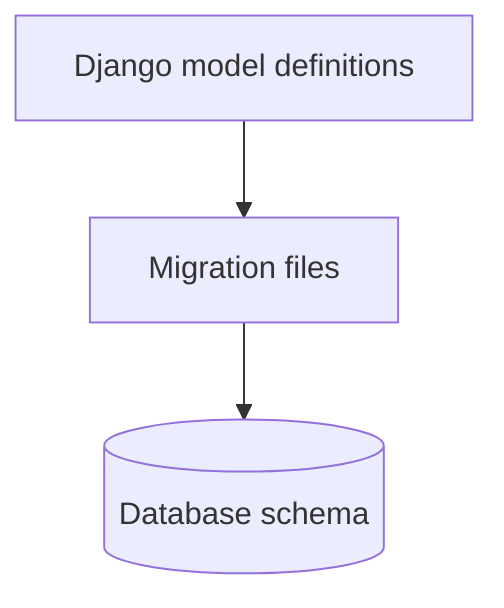

Migrations are needed to safely perform changes such as:

- Creating or deleting tables
- Adding, removing, or renaming columns
- Changing field types
- Adding indexes and constraints
- Creating relationships
- Moving or transforming existing data

Think of migrations as **version control for the database structure**.

| Source control concept | Migration concept |
|---|---|
| Code commit | Migration file |
| Commit history | Migration dependency graph |
| Apply commits | `migrate` |
| Create a commit | `makemigrations` |
| Revert to an older commit | Migrate to an earlier migration |

> [!IMPORTANT]
> Migration files belong in version control. Generate them during development, review them, commit them, and run the same files in testing, staging, and production.

---

# 2. The Core Mental Model

Django works with three related states.

## 2.1 Current model state

This is the model code currently present in the application:

```text
products/models.py
```

## 2.2 Historical migration state

This is the model history reconstructed from migration files:

```text
products/migrations/
├── 0001_initial.py
├── 0002_product_stock.py
└── 0003_product_status.py
```

## 2.3 Actual database state

This is the real schema currently present in PostgreSQL, MySQL, SQLite, or another configured database.

```text
Database
└── products_product
    ├── id
    ├── name
    ├── price
    ├── stock
    └── status
```

The three states should remain consistent:


A large number of migration problems happen when one of these states is changed without updating the others.

Examples:

- A developer manually alters a database column.
- A migration file is deleted after it was applied.
- A model is changed but its migration is not committed.
- `--fake` marks a migration as applied even though its SQL was not executed.

---

# 3. Migration Workflow

The normal development flow is:

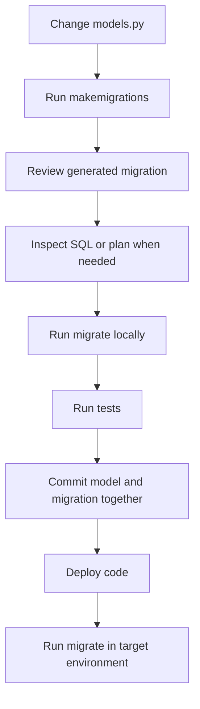

## 3.1 Change the model

Suppose the existing model is:

```python
class Product(models.Model):
    name = models.CharField(max_length=120)
    price = models.DecimalField(max_digits=10, decimal_places=2)
```

Add a `stock` field:

```python
class Product(models.Model):
    name = models.CharField(max_length=120)
    price = models.DecimalField(max_digits=10, decimal_places=2)
    stock = models.PositiveIntegerField(default=0)
```

## 3.2 Generate a migration

```bash
python manage.py makemigrations products
```

Possible output:

```text
Migrations for 'products':
  products/migrations/0002_product_stock.py
    + Add field stock to product
```

`makemigrations` does **not normally modify the database**. It compares the current model definitions with the historical model state stored in migration files and creates new instructions.

## 3.3 Review the migration

```python
from django.db import migrations, models


class Migration(migrations.Migration):

    dependencies = [
        ("products", "0001_initial"),
    ]

    operations = [
        migrations.AddField(
            model_name="product",
            name="stock",
            field=models.PositiveIntegerField(default=0),
        ),
    ]
```

Check that Django detected the intended operation. Renames, complex constraints, and large-table changes deserve special attention.

## 3.4 Preview the execution

Show the migration plan:

```bash
python manage.py migrate --plan
```

Show generated SQL for one migration:

```bash
python manage.py sqlmigrate products 0002
```

SQL output varies by database backend.

## 3.5 Apply the migration

```bash
python manage.py migrate
```

Django:

1. Loads migration files.
2. Builds their dependency graph.
3. Reads applied migrations from `django_migrations`.
4. Calculates which migrations are pending.
5. Executes operations in dependency order.
6. Records successfully applied migrations.

---

# 4. Anatomy of a Migration File

A migration file is a Python module containing a class named `Migration`.

```python
from django.db import migrations, models


class Migration(migrations.Migration):

    initial = True

    dependencies = []

    operations = [
        migrations.CreateModel(
            name="Product",
            fields=[
                (
                    "id",
                    models.BigAutoField(
                        auto_created=True,
                        primary_key=True,
                        serialize=False,
                        verbose_name="ID",
                    ),
                ),
                ("name", models.CharField(max_length=120)),
                (
                    "price",
                    models.DecimalField(
                        max_digits=10,
                        decimal_places=2,
                    ),
                ),
            ],
        ),
    ]
```

## 4.1 `dependencies`

Defines which migrations must be applied first:

```python
dependencies = [
    ("catalog", "0004_category_slug"),
]
```

Dependencies can exist:

- Within the same app
- Across different apps
- Against a swappable model such as the configured user model

Example for a custom user dependency:

```python
from django.conf import settings
from django.db import migrations


class Migration(migrations.Migration):
    dependencies = [
        migrations.swappable_dependency(settings.AUTH_USER_MODEL),
    ]
```

## 4.2 `operations`

Contains ordered changes that Django applies.

Common operations include:

| Operation | Purpose |
|---|---|
| `CreateModel` | Create a table |
| `DeleteModel` | Delete a table |
| `AddField` | Add a column or relationship |
| `RemoveField` | Remove a column or relationship |
| `AlterField` | Change a field definition |
| `RenameField` | Rename a field |
| `RenameModel` | Rename a model |
| `AddIndex` | Add an index |
| `RemoveIndex` | Remove an index |
| `AddConstraint` | Add a database constraint |
| `RemoveConstraint` | Remove a constraint |
| `RunPython` | Execute custom Python data logic |
| `RunSQL` | Execute custom SQL |
| `SeparateDatabaseAndState` | Separate database changes from Django's recorded model state |

## 4.3 Operation order matters

Operations run from top to bottom:

```python
operations = [
    migrations.AddField(...),
    migrations.RunPython(...),
    migrations.AlterField(...),
]
```

This pattern is useful when introducing a non-nullable field:

1. Add it as nullable.
2. Populate existing rows.
3. Make it non-nullable.

---

# 5. How Django Detects Changes

Django does not compare `models.py` directly with the live database schema.

Instead, `makemigrations` compares:

```text
Current model definitions
          VS
Model state reconstructed from migration files
```

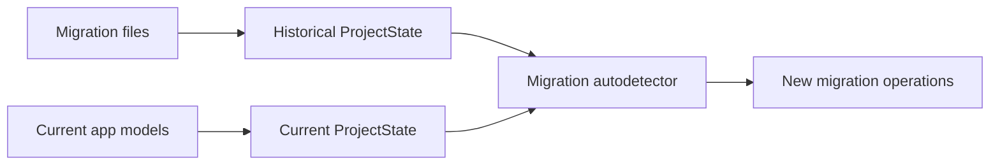

This explains several important behaviors.

## 5.1 Manual database changes are not automatically detected

If a column is created manually in PostgreSQL, Django's migration history does not know about it.

The next migration may fail because Django believes the column still needs to be created.

## 5.2 Model changes may produce migrations without obvious SQL changes

Django may generate migrations for field options that help reconstruct historical models, even when the immediate database schema is not changed.

## 5.3 Renames require careful review

When a field is renamed and changed significantly at the same time, Django may interpret it as:

```text
Remove old field
Add new field
```

instead of:

```text
Rename existing field
```

The first interpretation may cause data loss.

For risky renames, make the rename as a separate migration:

```text
Migration 1: RenameField
Migration 2: AlterField
```

---

# 6. Migration Graph and Dependencies

Migration history is a **directed acyclic graph**, not simply one global numbered list.

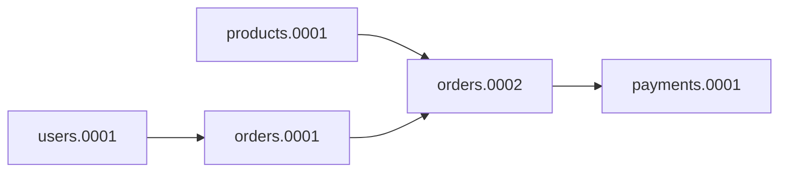

Each node is a migration. An arrow means:

```text
The source migration must run before the target migration.
```

Django uses the graph to calculate a valid execution order.

## 6.1 Migration numbers are not globally meaningful

These migrations can all exist:

```text
users.0005
orders.0005
payments.0005
```

They are unrelated unless dependencies connect them.

Even within one app, Django mainly cares about migration names and dependencies, not only their numeric prefixes.

## 6.2 Cross-app dependencies

Suppose `Order` references `Customer`:

```python
class Order(models.Model):
    customer = models.ForeignKey(
        "customers.Customer",
        on_delete=models.PROTECT,
    )
```

The generated order migration must depend on the migration that creates `Customer`.

## 6.3 Circular dependencies

A circular dependency can occur when two initial migrations require each other:

```text
app_a.0001 → app_b.0001
app_b.0001 → app_a.0001
```

A common solution is to move one relationship into a second migration:

```text
app_a.0001: Create ModelA without the circular foreign key
app_b.0001: Create ModelB with dependency on app_a.0001
app_a.0002: Add the foreign key to ModelB
```

---

# 7. Schema Migrations

Schema migrations change database structure.

## 7.1 Creating a model

```python
class Category(models.Model):
    name = models.CharField(max_length=100, unique=True)
```

Generated operation:

```python
migrations.CreateModel(
    name="Category",
    fields=[
        # ...
    ],
)
```

## 7.2 Adding a nullable field

```python
description = models.TextField(null=True, blank=True)
```

This is usually straightforward because existing rows can receive `NULL`.

## 7.3 Adding a non-nullable field

The following change requires a value for existing rows:

```python
status = models.CharField(max_length=20)
```

Django may ask for a one-off default.

For a small table, a temporary default may be acceptable. For an important production table, a staged migration is safer.

### Safe staged approach

First, add the field as nullable:

```python
status = models.CharField(
    max_length=20,
    null=True,
)
```

Then populate the field using a data migration.

Finally, make it non-nullable:

```python
status = models.CharField(
    max_length=20,
    null=False,
)
```

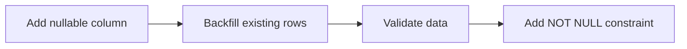

## 7.4 Adding a unique field to existing rows

Adding this directly is dangerous:

```python
public_id = models.UUIDField(
    default=uuid.uuid4,
    unique=True,
)
```

Existing rows may receive the same one-time migration default depending on how the migration is generated and executed, causing a uniqueness failure.

Use a staged process:

1. Add a nullable UUID field without the unique constraint.
2. Generate a unique UUID for every existing row.
3. Add the unique constraint.
4. Make the field non-nullable if required.

## 7.5 Removing a field

```python
migrations.RemoveField(
    model_name="product",
    name="legacy_code",
)
```

Removing a field normally destroys its stored data.

Before removal:

- Confirm no application version still reads or writes the field.
- Remove dependencies such as indexes and constraints.
- Back up or archive important data.
- Consider a multi-release deployment.

---

# 8. Data Migrations

A data migration changes rows rather than only changing table structure.

Typical use cases:

- Populate a newly added field
- Normalize old values
- Split one field into multiple fields
- Copy data to a new table
- Create default configuration records
- Convert legacy statuses into a new enum-like format

## 8.1 Create an empty migration

```bash
python manage.py makemigrations products \
    --empty \
    --name populate_product_status
```

## 8.2 Use `RunPython`

```python
from django.db import migrations


def set_default_status(apps, schema_editor):
    Product = apps.get_model("products", "Product")

    Product.objects.filter(status__isnull=True).update(
        status="active"
    )


def reverse_default_status(apps, schema_editor):
    Product = apps.get_model("products", "Product")

    Product.objects.filter(status="active").update(
        status=None
    )


class Migration(migrations.Migration):

    dependencies = [
        ("products", "0002_product_status"),
    ]

    operations = [
        migrations.RunPython(
            set_default_status,
            reverse_default_status,
        ),
    ]
```

## 8.3 Always use historical models

Inside a migration, use:

```python
Product = apps.get_model("products", "Product")
```

Do not normally import the current model:

```python
# Avoid this in migrations
from products.models import Product
```

Why?

A migration may run months or years later, when the current model code is very different from the model state that existed at that point in migration history.

Historical models preserve fields, relationships, managers marked for migration use, and model metadata for that migration state.

> [!WARNING]
> Historical models do not include custom instance methods, overridden `save()` logic, or most runtime behavior from the current model class.

## 8.4 Use the migration's database connection

For multi-database compatibility:

```python
def forwards(apps, schema_editor):
    Product = apps.get_model("products", "Product")
    database_alias = schema_editor.connection.alias

    Product.objects.using(database_alias).filter(
        status__isnull=True
    ).update(status="active")
```

## 8.5 Make data migrations reversible when practical

Use a reverse callable:

```python
migrations.RunPython(forwards, backwards)
```

For intentionally irreversible logic:

```python
migrations.RunPython(
    forwards,
    migrations.RunPython.noop,
)
```

Use `noop` only when reversing without restoring old data is acceptable.

## 8.6 Avoid loading all rows into memory

Unsafe for a large table:

```python
products = list(Product.objects.all())
```

Prefer:

```python
Product.objects.filter(status__isnull=True).update(
    status="active"
)
```

For row-specific processing, iterate in chunks:

```python
for product in (
    Product.objects
    .filter(slug__isnull=True)
    .iterator(chunk_size=2000)
):
    product.slug = create_slug(product.name)
    product.save(update_fields=["slug"])
```

Remember that historical models may not contain the custom `save()` behavior present in current application code.

## 8.7 Keep schema and data changes understandable

A readable sequence is usually:

```text
0002_add_nullable_status.py
0003_populate_status.py
0004_make_status_required.py
```

This is easier to debug and safer to deploy than one migration doing everything.

---

# 9. Migration State vs Database State

Django operations can affect two separate things:

1. **Database state** — actual tables, columns, indexes, and constraints.
2. **Project state** — Django's historical understanding of the models.

Most normal operations update both.

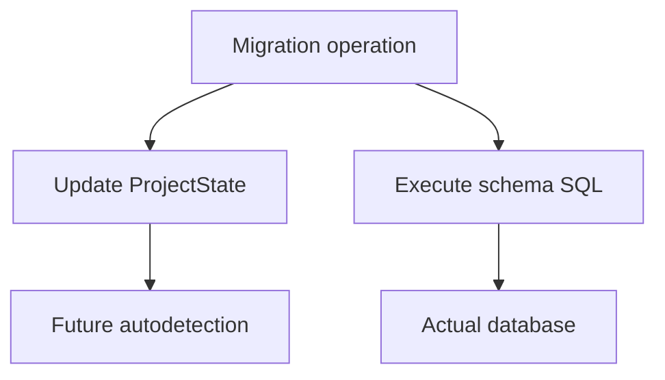

## 9.1 Why state matters

`makemigrations` uses project state to decide what changed.

If custom SQL changes the database without updating Django's state, Django may later attempt to recreate or remove the same structure.

## 9.2 `RunSQL`

Example:

```python
migrations.RunSQL(
    sql="""
        CREATE INDEX CONCURRENTLY
        product_name_idx
        ON products_product (name);
    """,
    reverse_sql="""
        DROP INDEX CONCURRENTLY product_name_idx;
    """,
)
```

Custom SQL is database-specific and must be reviewed carefully.

## 9.3 `SeparateDatabaseAndState`

Use this advanced operation when the database action and Django's state transition must be described separately.

```python
migrations.SeparateDatabaseAndState(
    database_operations=[
        migrations.RunSQL(
            sql="...",
            reverse_sql="...",
        ),
    ],
    state_operations=[
        migrations.AddIndex(
            model_name="product",
            index=models.Index(
                fields=["name"],
                name="product_name_idx",
            ),
        ),
    ],
)
```

This is useful for specialized operations such as:

- Creating PostgreSQL indexes concurrently
- Reusing an existing database object
- Performing manual SQL while preserving correct migration state

> [!WARNING]
> Incorrect use can desynchronize Django's migration state from the database and may cause data loss.

---

# 10. Transactions and Atomic Migrations

On databases that support transactional DDL, Django normally runs all operations in a migration inside one transaction.

Typical behavior:

| Database | Migration DDL transaction behavior |
|---|---|
| PostgreSQL | Transactional DDL is supported |
| SQLite | Django generally wraps migrations transactionally, while some schema changes are emulated |
| MySQL | Many schema changes cannot be fully rolled back as one DDL transaction |
| Oracle | Schema operations are generally not wrapped as transactional DDL |

## 10.1 Default atomic migration

```python
class Migration(migrations.Migration):
    atomic = True
```

This is the default where supported.

Conceptually:

```text
BEGIN
  Add column
  Backfill data
  Add constraint
COMMIT
```

If an operation fails, the transaction can roll back on a supporting backend.

## 10.2 Non-atomic migration

```python
class Migration(migrations.Migration):
    atomic = False
```

Use this when an operation cannot run inside a transaction or when a very long transaction would be unsafe.

A PostgreSQL concurrent index operation is a common example because `CREATE INDEX CONCURRENTLY` cannot run inside a transaction block.

## 10.3 Risks of long transactions

A large data migration can:

- Hold locks for too long
- Increase database load
- Generate large transaction logs
- Delay replication
- Block writes
- Cause deployment timeouts

For large tables, separate schema deployment from background backfilling when the release process allows it.

---

# 11. Reversing and Rolling Back Migrations

To move an app back to migration `0002`:

```bash
python manage.py migrate products 0002
```

If `0003` is currently applied, Django tries to reverse it.

To reverse every migration for an app:

```bash
python manage.py migrate products zero
```

Preview what will happen:

```bash
python manage.py migrate products 0002 --plan
```

## 11.1 Reversible schema operations

Many schema operations are reversible:

- `AddField` ↔ remove the field
- `CreateModel` ↔ delete the model
- `RenameField` ↔ restore the previous name

## 11.2 Irreversible operations

A migration is irreversible when Django has no safe reverse instruction.

Example:

```python
migrations.RunSQL(
    sql="DELETE FROM products_product WHERE is_test = TRUE;",
)
```

Deleted data cannot automatically be reconstructed.

Provide reverse SQL when possible:

```python
migrations.RunSQL(
    sql="ALTER TABLE ...",
    reverse_sql="ALTER TABLE ...",
)
```

## 11.3 Rollback does not always mean application rollback

A deployment rollback can be difficult when:

- The new migration removed data.
- Old code cannot work with the new schema.
- A large migration partially completed on a backend without transactional DDL.
- Both old and new application versions run during rolling deployment.

Production migration design should account for mixed application versions.

---

# 12. Common Migration Commands

## 12.1 Generate migrations

```bash
python manage.py makemigrations
```

For one app:

```bash
python manage.py makemigrations products
```

With a meaningful name:

```bash
python manage.py makemigrations products \
    --name add_product_status
```

Create an empty migration:

```bash
python manage.py makemigrations products \
    --empty \
    --name backfill_product_status
```

Preview without writing files:

```bash
python manage.py makemigrations --dry-run
```

Show full proposed migration content:

```bash
python manage.py makemigrations \
    --dry-run \
    --verbosity 3
```

Fail CI when model changes have no migration:

```bash
python manage.py makemigrations --check
```

Merge conflicting branches:

```bash
python manage.py makemigrations --merge
```

In Django 6.0+, update the latest migration with current model changes:

```bash
python manage.py makemigrations products --update
```

Use `--update` cautiously and avoid rewriting a migration that has already been shared or applied in another environment.

## 12.2 Apply migrations

Apply all pending migrations:

```bash
python manage.py migrate
```

Apply migrations for one app:

```bash
python manage.py migrate products
```

Move to a specific migration:

```bash
python manage.py migrate products 0004
```

Show execution plan:

```bash
python manage.py migrate --plan
```

Check for unapplied migrations:

```bash
python manage.py migrate --check
```

Select a database:

```bash
python manage.py migrate --database=analytics
```

## 12.3 Inspect migration status

```bash
python manage.py showmigrations
```

For one app:

```bash
python manage.py showmigrations products
```

Applied migrations are marked:

```text
products
 [X] 0001_initial
 [X] 0002_product_stock
 [ ] 0003_product_status
```

Show a dependency-oriented plan:

```bash
python manage.py showmigrations --plan
```

## 12.4 Inspect SQL

```bash
python manage.py sqlmigrate products 0003
```

This is especially useful before:

- Adding an index
- Altering a large table
- Changing a column type
- Adding a constraint
- Dropping a column

## 12.5 Fake migration state

Mark migration operations as applied without running their SQL:

```bash
python manage.py migrate products 0003 --fake
```

Use only when the database already matches the expected result.

For a pre-existing schema:

```bash
python manage.py migrate --fake-initial
```

`--fake-initial` checks for expected table names, not a complete structural match. Confirm the existing schema first.

---

# 13. Common Issues and Their Solutions

## 13.1 “No changes detected”

### Symptom

```text
No changes detected
```

### Likely causes

- The app is missing from `INSTALLED_APPS`.
- The model is not imported or discovered.
- The model has `managed = False`.
- The change does not affect migration state as expected.
- A migration already represents the change.
- The command is being run with the wrong settings module.
- A custom app label is being confused with its Python module name.

### Checks

```bash
python manage.py check
python manage.py showmigrations your_app
python manage.py makemigrations your_app --verbosity 3
```

Confirm:

```python
INSTALLED_APPS = [
    # ...
    "products",
]
```

For an app that does not yet have migrations:

```bash
python manage.py makemigrations products
```

---

## 13.2 “No migrations to apply” but the database is missing a column

### Cause

Django sees the migration as already applied in `django_migrations`, but the real schema does not match the recorded state.

This often happens because:

- The schema was manually edited.
- The wrong database is configured.
- A database restore included migration records but not matching schema changes.
- `--fake` was used incorrectly.

### Diagnosis

```bash
python manage.py showmigrations products
python manage.py sqlmigrate products 0003
```

Also inspect:

- Current database connection settings
- The actual table definition
- Records in `django_migrations`

### Resolution

Do not blindly delete migration records.

First determine whether to:

- Repair the schema manually
- Reverse the fake state
- Reapply a migration
- Restore from a correct backup

The correct solution depends on which state is authoritative.

---

## 13.3 “Table already exists” or “Column already exists”

### Cause

The database object exists, but Django's migration history says its creation migration is unapplied.

### Possible situations

- A legacy database is being introduced to Django migrations.
- Someone manually created the object.
- Migration history was deleted or restored incorrectly.
- The application is connected to an unexpected database.

### Resolution

For a genuine pre-existing initial schema:

```bash
python manage.py migrate --fake-initial
```

For later migrations, verify the complete expected schema before considering `--fake`.

> [!WARNING]
> `--fake` repairs migration records, not the schema. Using it without verification may hide the problem until a later migration fails.

---

## 13.4 “Column does not exist”

### Causes

- The migration was never applied.
- Application code was deployed before its required migration.
- A migration was faked.
- The code is connected to another database.
- A rolling deployment allowed new code to run before the schema was compatible.

### Checks

```bash
python manage.py showmigrations
python manage.py migrate --plan
python manage.py migrate --check
```

### Deployment prevention

Use this order only when the schema change is backward-compatible:

```text
Deploy compatible schema → deploy application code
```

For destructive changes, use an expand-and-contract approach.

---

## 13.5 Inconsistent migration history

Typical error:

```text
InconsistentMigrationHistory:
Migration A is applied before its dependency B
```

### Cause

Django found an applied migration whose required dependency is marked as unapplied.

This can happen after:

- Manual edits to `django_migrations`
- Incorrect faking
- Partial database restores
- Deleted or modified migration files
- Changing dependencies after migrations were applied

### Resolution process

1. Back up the database.
2. Inspect migration dependencies.
3. Inspect `showmigrations`.
4. Compare the expected graph with `django_migrations`.
5. Repair the history only after understanding the real schema.
6. Test the repair on a database copy.

Avoid random deletion of migration records.

---

## 13.6 Conflicting migrations or multiple leaf nodes

Example:

```text
products.0005_add_status
products.0005_add_category
```

Both depend on:

```text
products.0004_previous
```

This produces two leaf migrations.

### Solution

```bash
python manage.py makemigrations products --merge
```

Django may create:

```text
0006_merge_0005_add_status_0005_add_category.py
```

Example:

```python
class Migration(migrations.Migration):

    dependencies = [
        ("products", "0005_add_status"),
        ("products", "0005_add_category"),
    ]

    operations = []
```

An empty merge migration is valid when the two branches do not conflict logically.

If both branches modify the same field or model incompatibly, resolve the operations manually.

---

## 13.7 Migration asks: “Was field X renamed to Y?”

Django is attempting to distinguish a rename from deletion plus addition.

Answering incorrectly can cause data loss.

Before responding, confirm:

- The old field was actually renamed.
- Its data should be preserved.
- The new field represents the same logical value.

For complex changes, create a dedicated `RenameField` migration before changing the field's type or options.

---

## 13.8 Cannot add a non-nullable field without a default

Existing rows require a valid value.

Safe options:

### Option A: Temporary default

Suitable for a small, simple table:

```python
status = models.CharField(
    max_length=20,
    default="active",
)
```

### Option B: Staged migration

Preferred for meaningful production data:

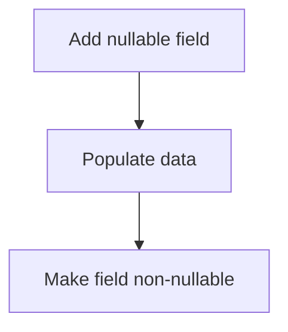

### Option C: Database-level strategy

For very large systems, use a database-specific online migration approach and coordinate it with Django state.

---

## 13.9 Unique constraint fails during migration

### Causes

- Existing duplicate data
- Same default assigned to multiple rows
- Data normalization creates collisions
- Case-insensitive uniqueness reveals duplicates

### Safe sequence

1. Add field or index without uniqueness.
2. Detect duplicates.
3. Clean or merge conflicting data.
4. Validate expected uniqueness.
5. Add the unique constraint.

Example duplicate check:

```python
from django.db.models import Count

duplicates = (
    Customer.objects
    .values("email")
    .annotate(total=Count("id"))
    .filter(total__gt=1)
)
```

Run equivalent logic in an application script or carefully designed data migration using historical models.

---

## 13.10 Data migration imports the current model

### Problem

```python
from products.models import Product
```

Old migrations may break after the model changes.

### Correct approach

```python
def forwards(apps, schema_editor):
    Product = apps.get_model("products", "Product")
```

Also avoid relying on current service classes whose behavior may change over time.

Migration logic should be stable and self-contained.

---

## 13.11 Deleted function or custom field breaks old migrations

Migration files serialize references to some functions, fields, managers, and callables.

Example:

```python
upload_to=product_image_path
```

If an old migration imports this callable and it is later deleted, a fresh installation may fail while loading migration history.

### Resolution

- Keep referenced callables available while migrations depend on them.
- Move a small compatibility implementation into the migration when appropriate.
- Squash old migrations after all environments are safely upgraded.
- Preserve a minimal stub for deprecated custom fields until old references are removed.

---

## 13.12 Migration is very slow or locks a table

Operations that may be expensive include:

- Adding an index to a large table
- Adding a non-null constraint
- Changing a column type
- Rewriting every row
- Adding a column with a backend-dependent table rewrite
- Dropping a heavily referenced column

### Mitigation

- Check generated SQL.
- Test with production-like data volume.
- Measure locks and execution time.
- Break one large migration into smaller steps.
- Use concurrent or online index creation where supported.
- Backfill in batches.
- Schedule risky operations during a controlled window.
- Use `atomic = False` only when technically required and understood.

---

## 13.13 Migration works on SQLite but fails on PostgreSQL or MySQL

Backends differ in:

- Supported column alterations
- Locking behavior
- DDL transactions
- Index limitations
- Constraint validation
- SQL syntax
- Type conversion rules

Use the same database engine in local or CI environments whenever production behavior matters.

SQLite is useful for simple development and testing, but it is not a perfect simulation of PostgreSQL or MySQL migration behavior.

---

## 13.14 Migration succeeds locally but fails in production

Typical reasons:

- Production contains much more data.
- Production has duplicate or invalid legacy values.
- A constraint already exists with a different name.
- Database permissions differ.
- A table is actively used and becomes locked.
- The production engine or version differs.
- Migrations are executed concurrently by multiple instances.
- The deployed migration files differ from local files.

Prevention:

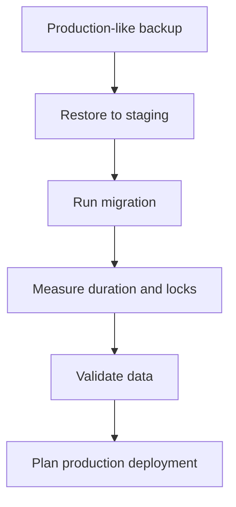

---

## 13.15 Migration was edited after being applied

Changing an applied migration rewrites history.

Existing environments still record the original migration name as applied, so they will not automatically execute the new operations.

### Preferred solution

Create a new migration that corrects the earlier one.

Editing an old migration is generally acceptable only when:

- It has not been shared.
- It has not been applied outside the local environment.
- The team explicitly resets all affected databases.

---

## 13.16 Migration file was deleted

Deleting a migration does not remove its record from deployed databases.

Possible consequences:

- Missing dependency errors
- Inconsistent history
- Fresh installations produce a different schema
- Squashed migrations no longer resolve correctly

Restore the file from version control unless deletion is part of a deliberate, completed squashing process.

---

# 14. Safe Production Migration Patterns

## 14.1 Expand and contract

This is the most important migration pattern for continuously deployed systems.

### Phase 1: Expand

Add the new structure while keeping the old structure:

```text
old_column + new_column
```

Deploy code that can work with both.

### Phase 2: Migrate data

Backfill data from the old structure to the new structure.

### Phase 3: Switch reads and writes

Update the application to use the new structure.

### Phase 4: Contract

Remove the old structure only when no running application version depends on it.

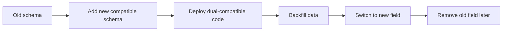

## 14.2 Example: Rename a busy column safely

A direct `RenameField` can break older application instances during rolling deployment.

Safer sequence:

1. Add `display_name`.
2. Write to both `name` and `display_name`.
3. Backfill `display_name`.
4. Read from `display_name`.
5. Stop writing to `name`.
6. Remove `name` in a later release.

This costs more development effort but reduces deployment coupling.

## 14.3 Separate database deployment from application deployment

A common compatible order is:

```text
1. Apply backward-compatible migrations
2. Deploy new code
3. Run asynchronous or batched backfill
4. Validate
5. Apply cleanup migrations in a later release
```

## 14.4 Avoid application startup migrations in multi-instance systems

Running `migrate` automatically from every application container can create:

- Duplicate attempts
- Lock contention
- Hard-to-debug startup failures
- Mixed versions competing during rollout

Prefer one controlled migration job or deployment step.

## 14.5 Validate before adding constraints

For a new `NOT NULL`, foreign key, check constraint, or unique constraint:

1. Backfill or clean data.
2. Query for invalid rows.
3. Add the constraint.
4. Monitor failures.

## 14.6 Design forward-compatible rollbacks

The safest rollback is usually rolling application code back while leaving a backward-compatible expanded schema in place.

Destructive schema rollback is riskier.

---

# 15. Migration Conflicts in Teams

Suppose two developers branch from:

```text
0004_product_price
```

Developer A creates:

```text
0005_product_status
```

Developer B creates:

```text
0005_product_category
```

After merging Git branches:

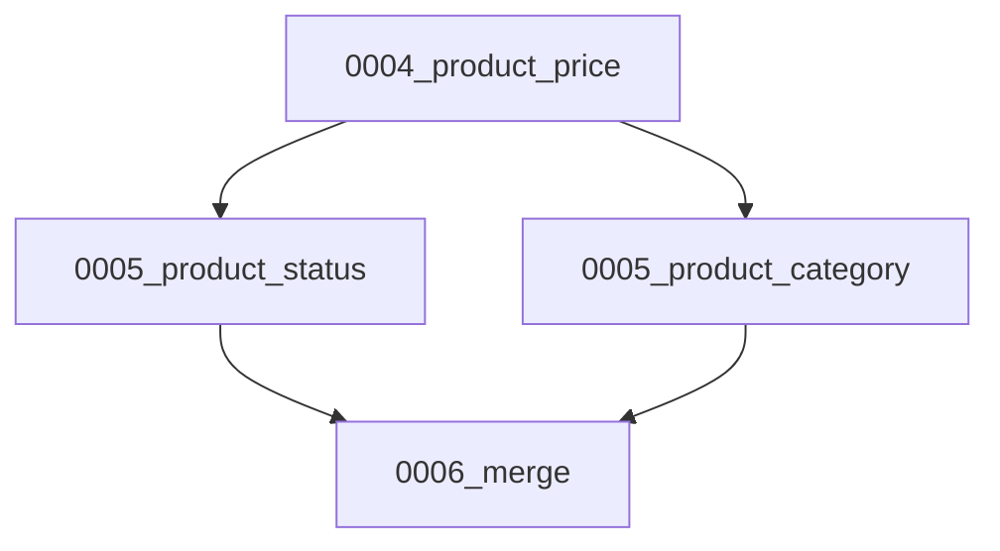

## 15.1 Recommended process

1. Pull the latest branch.
2. Run:

   ```bash
   python manage.py makemigrations
   ```

3. If Django reports a conflict, run:

   ```bash
   python manage.py makemigrations --merge
   ```

4. Review the merge migration.
5. Run migrations on a clean database and an upgraded database.
6. Run tests.

## 15.2 When an empty merge is enough

An empty merge is usually acceptable when the migrations change independent parts of the schema.

Example:

- One adds `Product.status`.
- Another adds `Product.category`.
- Neither operation depends on the other.

## 15.3 When manual resolution is required

Manual resolution may be required when both migrations:

- Rename the same field differently
- Add the same field with different definitions
- Alter the same constraint
- Delete a model modified by the other migration
- Include data migrations whose order matters

---

# 16. Squashing Migrations

Over time, an app may accumulate hundreds of migrations.

Squashing combines a migration range into a smaller optimized migration:

```bash
python manage.py squashmigrations products 0050
```

Django may optimize:

```text
CreateModel + AddField + AlterField
```

into a single final `CreateModel`.

## 16.1 Safe squashing lifecycle

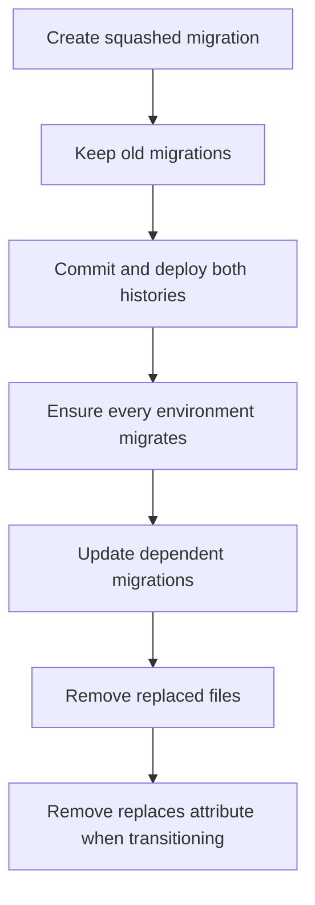

Do not immediately delete the old migration files.

Existing environments may still be partway through the old migration chain.

## 16.2 Squashing limitations

Optimization may be limited by:

- `RunPython`
- `RunSQL`
- Complex cross-app dependencies
- Circular dependencies
- Non-elidable custom operations

Django 6.0 supports squashing already-squashed migrations, but the rollout must still be handled carefully.

## 16.3 When to squash

Consider squashing when:

- Fresh test databases take too long to build.
- A reusable app has an unnecessarily long history.
- The team can coordinate rollout across every environment.
- Old compatibility references need cleanup.

Do not squash only because the migration folder “looks large.” Django is designed to handle many migrations.

---

# 17. Multiple Databases

Apply migrations to a selected database:

```bash
python manage.py migrate --database=analytics
```

Database routers can control whether a model is migrated on a database:

```python
class AnalyticsRouter:
    def allow_migrate(
        self,
        db,
        app_label,
        model_name=None,
        **hints,
    ):
        if app_label == "analytics":
            return db == "analytics"

        return db == "default"
```

For a data migration:

```python
def forwards(apps, schema_editor):
    if schema_editor.connection.alias != "analytics":
        return

    Event = apps.get_model("analytics", "Event")
    Event.objects.using("analytics").update(is_processed=False)
```

Important considerations:

- Migration records exist separately in each database.
- Cross-database foreign keys are not generally supported by relational databases in the way Django relationships expect.
- Run migration checks for every configured database.
- Pass useful router hints when writing reusable migrations.

---

# 18. Best Practices

## 18.1 Development practices

- Commit model changes and migration files together.
- Give important migrations meaningful names.
- Review every generated migration.
- Run migrations locally before committing.
- Test migration reversibility when rollback is required.
- Use historical models in `RunPython`.
- Keep data migrations deterministic and self-contained.
- Avoid editing migrations already shared with others.
- Do not delete migration files casually.

## 18.2 CI practices

Check that developers did not forget migrations:

```bash
python manage.py makemigrations --check
```

Check for unapplied migrations:

```bash
python manage.py migrate --check
```

Create a clean test database and run the full migration chain.

For critical systems, test both paths:

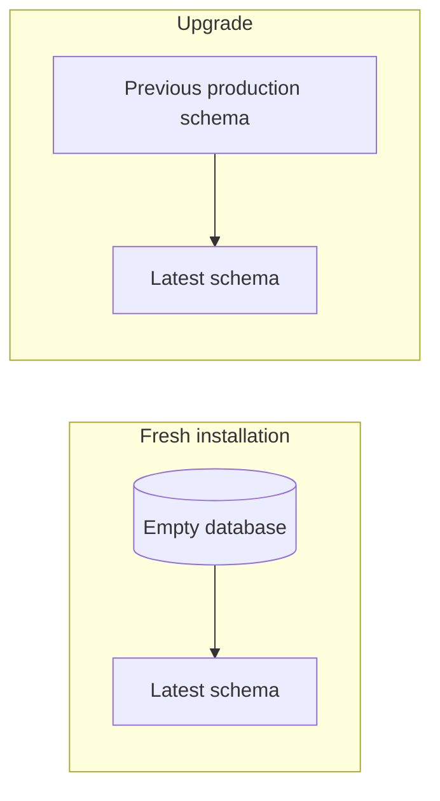

## 18.3 Production practices

- Back up before destructive changes.
- Test with production-like data.
- Inspect SQL using `sqlmigrate`.
- Review the migration plan.
- Estimate execution duration.
- Understand locking behavior.
- Use expand-and-contract for breaking changes.
- Backfill large datasets in batches.
- Run migrations as a controlled deployment step.
- Monitor database locks, errors, and replication.
- Keep migration code independent of unstable runtime services.
- Never use `--fake` as a first troubleshooting step.

## 18.4 Code review checklist

Before approving a migration, check:

- Does the migration preserve existing data?
- Is a field rename detected correctly?
- Can a new constraint fail on existing rows?
- Will the operation lock or rewrite a large table?
- Is the migration reversible?
- Does `RunPython` use historical models?
- Does it use the correct database alias?
- Is external network access avoided?
- Are schema and data operations split clearly?
- Is the migration compatible with rolling deployment?
- Has the generated SQL been reviewed?
- Has it been tested on realistic data volume?

---

# 19. Practical End-to-End Example

Requirement:

> Add a required `slug` field to `Product`, populate it for existing rows, and make it unique.

A direct migration can fail because existing rows need unique values.

## 19.1 Step 1: Add a nullable, non-unique field

```python
class Product(models.Model):
    name = models.CharField(max_length=120)
    slug = models.SlugField(
        max_length=160,
        null=True,
        blank=True,
    )
```

Generate:

```bash
python manage.py makemigrations products \
    --name add_nullable_product_slug
```

Apply:

```bash
python manage.py migrate
```

## 19.2 Step 2: Create a data migration

```bash
python manage.py makemigrations products \
    --empty \
    --name populate_product_slugs
```

Migration:

```python
from django.db import migrations
from django.utils.text import slugify


def populate_slugs(apps, schema_editor):
    Product = apps.get_model("products", "Product")
    database_alias = schema_editor.connection.alias

    queryset = (
        Product.objects
        .using(database_alias)
        .filter(slug__isnull=True)
        .order_by("id")
    )

    for product in queryset.iterator(chunk_size=1000):
        base_slug = slugify(product.name) or "product"
        slug = f"{base_slug}-{product.id}"

        Product.objects.using(database_alias).filter(
            pk=product.pk
        ).update(slug=slug)


def clear_slugs(apps, schema_editor):
    Product = apps.get_model("products", "Product")
    database_alias = schema_editor.connection.alias

    Product.objects.using(database_alias).update(slug=None)


class Migration(migrations.Migration):

    dependencies = [
        ("products", "0002_add_nullable_product_slug"),
    ]

    operations = [
        migrations.RunPython(
            populate_slugs,
            clear_slugs,
        ),
    ]
```

Why append the primary key?

```text
"Phone" → phone-12
"Phone" → phone-48
```

It creates deterministic uniqueness without expensive collision loops.

## 19.3 Step 3: Validate before adding the constraint

Check for missing values:

```python
Product.objects.filter(slug__isnull=True).exists()
```

Check duplicates:

```python
from django.db.models import Count

duplicates = (
    Product.objects
    .values("slug")
    .annotate(total=Count("id"))
    .filter(total__gt=1)
)
```

## 19.4 Step 4: Make the field required and unique

```python
class Product(models.Model):
    name = models.CharField(max_length=120)
    slug = models.SlugField(
        max_length=160,
        unique=True,
    )
```

Generate:

```bash
python manage.py makemigrations products \
    --name require_unique_product_slug
```

Review SQL:

```bash
python manage.py sqlmigrate products 0004
```

Apply:

```bash
python manage.py migrate
```

## 19.5 Resulting migration sequence

```text
0001_initial.py
0002_add_nullable_product_slug.py
0003_populate_product_slugs.py
0004_require_unique_product_slug.py
```

This sequence is:

- Easy to understand
- Safer for existing rows
- Easier to troubleshoot
- Reversible within the stated reverse behavior
- Suitable for testing each stage independently

---

# 20. Final Mental Model

Remember this flow:

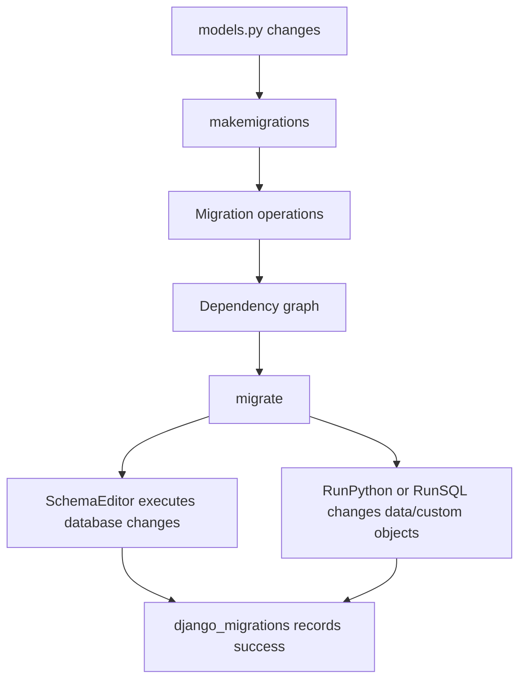

The most important points are:

1. `makemigrations` compares current models with migration history, not directly with the live database.
2. `migrate` applies or reverses migration operations in dependency order.
3. Migration files are production code and must be reviewed and committed.
4. Django tracks applied migrations in the `django_migrations` table.
5. Schema state and migration state must remain synchronized.
6. Data migrations should use historical models through `apps.get_model()`.
7. Large or breaking changes should use staged, backward-compatible migrations.
8. `--fake` is an advanced repair tool, not a normal solution.
9. Never rewrite shared migration history without a deliberate coordination plan.
10. A safe migration considers data volume, locks, mixed application versions, rollback, and database-specific behavior.

> [!KEY]
> A good migration does more than make the final schema correct. It provides a safe path from the old production state to the new production state.

---

## Official References

- Django migrations topic guide:  
  <https://docs.djangoproject.com/en/6.0/topics/migrations/>

- Django migration operations reference:  
  <https://docs.djangoproject.com/en/6.0/ref/migration-operations/>

- Writing database migrations:  
  <https://docs.djangoproject.com/en/6.0/howto/writing-migrations/>

- Django management commands:  
  <https://docs.djangoproject.com/en/6.0/ref/django-admin/>
