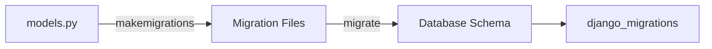
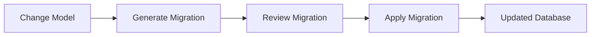
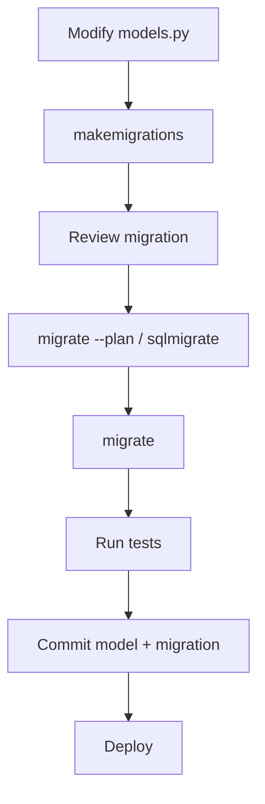
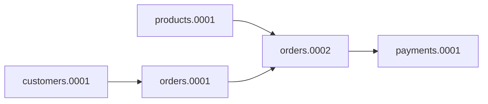
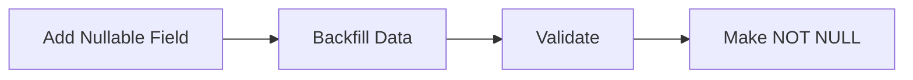
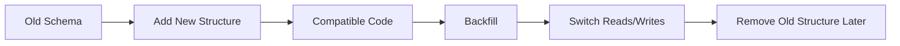
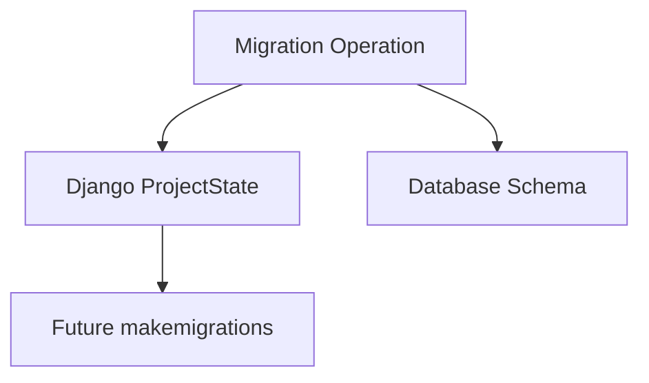
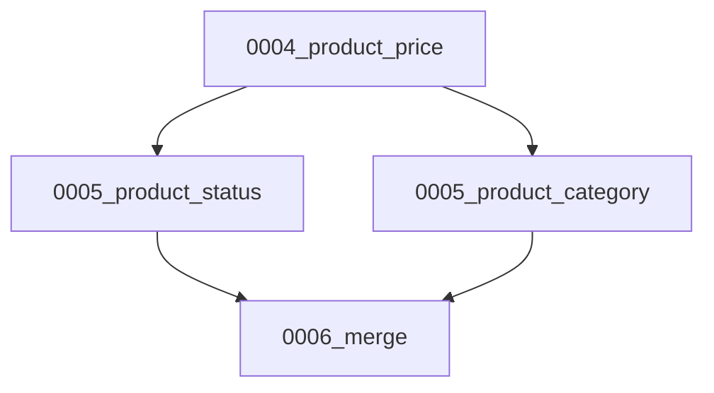
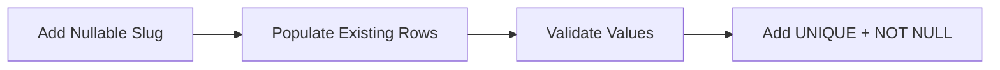
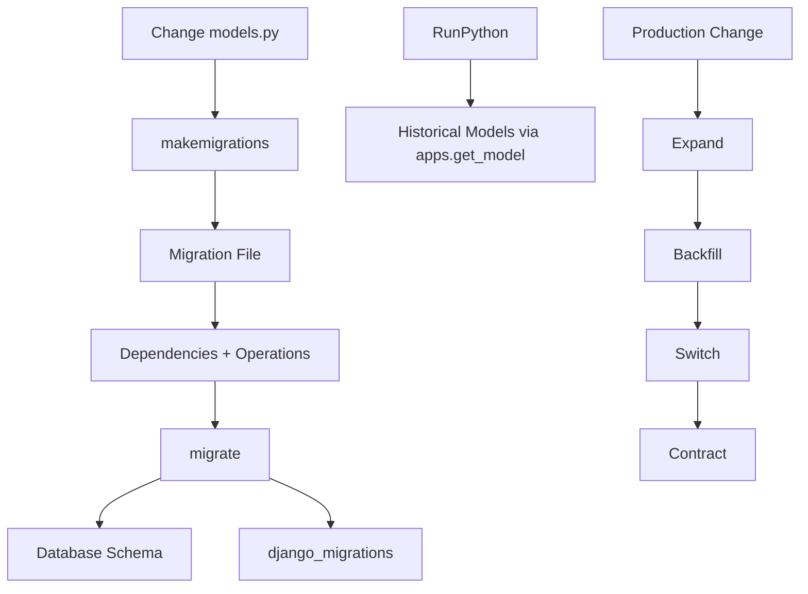

# Django Migrations: How They Work & Safe Production Use

> [!KEY]
> A **Django migration** is a version-controlled instruction that moves your database schema, and sometimes its data, from one known state to another.

Django migrations mainly revolve around two commands:

```bash
python manage.py makemigrations
python manage.py migrate
```

`makemigrations` creates migration files from model changes, while `migrate` applies or reverses those migration operations against the database.



The most important idea to remember is:

```text
Current Models
      ↕
Migration History
      ↕
Actual Database Schema
```

Most migration problems happen when these three states become inconsistent.

---

# 1. Why Migrations Exist

Changing a Django model does not automatically change an existing database table.

For example:

```python
from django.db import models


class Product(models.Model):
    name = models.CharField(max_length=120)
    price = models.DecimalField(
        max_digits=10,
        decimal_places=2,
    )
```

Later, we add:

```python
stock = models.PositiveIntegerField(default=0)
```

Django needs instructions describing how the existing `products_product` table should change.

That instruction becomes a migration.



Migrations commonly handle:

- Creating and deleting tables
- Adding or removing columns
- Changing field definitions
- Creating relationships
- Adding indexes and constraints
- Renaming fields or models
- Transforming existing data

A useful mental model is:

| Git | Django Migrations |
|---|---|
| Commit | Migration file |
| Commit history | Migration dependency graph |
| Create commit | `makemigrations` |
| Apply commits | `migrate` |
| Move backward | Migrate to an earlier migration |

Migration files should normally be committed to version control and reused across development, testing, staging, and production.

---

# 2. The Three Migration States

Understanding these three states explains most migration behavior.

## 2.1 Current Model State

The Python models currently present in your application.

```text
products/models.py
```

Example:

```python
class Product(models.Model):
    name = models.CharField(max_length=120)
    stock = models.PositiveIntegerField(default=0)
```

## 2.2 Historical Migration State

Django rebuilds the historical model state from migration files.

```text
products/
└── migrations/
    ├── 0001_initial.py
    ├── 0002_product_stock.py
    └── 0003_product_status.py
```

## 2.3 Actual Database State

The real database structure:

```text
products_product
├── id
├── name
├── stock
└── status
```

Django also maintains:

```text
django_migrations
```

This table records which migration files Django believes have already been applied.

### Why mismatches happen

For example:

```text
Migration history:
0003_product_status = Applied

Actual database:
status column = Missing
```

Django may report:

```text
No migrations to apply
```

because its migration history says the migration has already run.

This usually happens after manual database changes, incorrect use of `--fake`, partial restores, deleted migration files, or using the wrong database.

---

# 3. Normal Migration Workflow

A healthy development workflow looks like this:



## 3.1 Generate Migration

```bash
python manage.py makemigrations
```

For one application:

```bash
python manage.py makemigrations products
```

Give it a meaningful name:

```bash
python manage.py makemigrations products \
    --name add_product_status
```

Django compares the current model definitions with the model state represented by migration history and generates the required operations.

## 3.2 Review Before Applying

Example generated migration:

```python
from django.db import migrations, models


class Migration(migrations.Migration):

    dependencies = [
        ("products", "0001_initial"),
    ]

    operations = [
        migrations.AddField(
            model_name="product",
            name="stock",
            field=models.PositiveIntegerField(default=0),
        ),
    ]
```

Do not blindly treat generated migrations as correct.

Pay extra attention to:

- Field renames
- Type changes
- Unique constraints
- Non-nullable fields
- Large-table indexes
- Destructive operations

## 3.3 Inspect the Plan and SQL

```bash
python manage.py migrate --plan
```

To inspect SQL:

```bash
python manage.py sqlmigrate products 0002
```

## 3.4 Apply

```bash
python manage.py migrate
```

Conceptually Django:

```text
Load migrations
      ↓
Build dependency graph
      ↓
Read django_migrations
      ↓
Find pending migrations
      ↓
Execute operations
      ↓
Record successful migrations
```

---

# 4. Migration Files and Dependency Graph

Every migration usually contains two important parts:

```python
class Migration(migrations.Migration):

    dependencies = [
        ("products", "0002_product_stock"),
    ]

    operations = [
        migrations.AddField(...),
    ]
```

## 4.1 `dependencies`

Dependencies tell Django what must run first.

```python
dependencies = [
    ("customers", "0003_customer_profile"),
]
```

This is especially important with relationships.

```python
class Order(models.Model):
    customer = models.ForeignKey(
        "customers.Customer",
        on_delete=models.PROTECT,
    )
```

The order migration must run after the migration that creates `Customer`.

Django uses a **dependency graph**, not one global migration number sequence.



Therefore:

```text
users.0005
orders.0005
payments.0005
```

do not automatically have any relationship.

## 4.2 `operations`

Common operations include:

| Operation | Purpose |
|---|---|
| `CreateModel` | Create table |
| `DeleteModel` | Remove table |
| `AddField` | Add field |
| `RemoveField` | Remove field |
| `AlterField` | Change field definition |
| `RenameField` | Rename field |
| `AddIndex` | Add index |
| `AddConstraint` | Add constraint |
| `RunPython` | Run Python data migration |
| `RunSQL` | Execute custom SQL |
| `SeparateDatabaseAndState` | Separate DB and Django state changes |

Operation order matters.

```python
operations = [
    migrations.AddField(...),
    migrations.RunPython(...),
    migrations.AlterField(...),
]
```

This pattern is frequently used for safe production changes.

---

# 5. Schema Migrations vs Data Migrations

## 5.1 Schema Migration

A schema migration changes database structure.

Example:

```python
status = models.CharField(
    max_length=20,
    null=True,
)
```

Possible generated operation:

```python
migrations.AddField(
    model_name="product",
    name="status",
    field=models.CharField(
        max_length=20,
        null=True,
    ),
)
```

## 5.2 Data Migration

A data migration changes existing records.

For example, after adding `status`, existing products need:

```text
status = "active"
```

Create an empty migration:

```bash
python manage.py makemigrations products \
    --empty \
    --name populate_product_status
```

Then:

```python
from django.db import migrations


def populate_status(apps, schema_editor):
    Product = apps.get_model(
        "products",
        "Product",
    )

    Product.objects.filter(
        status__isnull=True
    ).update(status="active")


class Migration(migrations.Migration):

    dependencies = [
        ("products", "0002_product_status"),
    ]

    operations = [
        migrations.RunPython(
            populate_status,
            migrations.RunPython.noop,
        ),
    ]
```

## Historical Models Are Important

Inside migrations, use:

```python
Product = apps.get_model(
    "products",
    "Product",
)
```

Avoid:

```python
from products.models import Product
```

A migration might run years later when the current `Product` class looks completely different. Django therefore provides the historical model version representing that point in migration history.

Also remember that historical models generally do not contain your current custom instance methods or overridden runtime behavior.

---

# 6. Safe Schema Changes

Production migration design matters more than simply reaching the correct final schema.

## 6.1 Adding a Required Field

This is risky on an existing populated table:

```python
status = models.CharField(max_length=20)
```

Existing rows do not have a value.

A safer approach is:



### Step 1

```python
status = models.CharField(
    max_length=20,
    null=True,
)
```

### Step 2

Backfill existing records.

```python
Product.objects.filter(
    status__isnull=True
).update(status="active")
```

### Step 3

Make the field required.

```python
status = models.CharField(
    max_length=20,
    null=False,
)
```

## 6.2 Adding a Unique Field

Avoid immediately applying uniqueness when existing rows first need values.

Use:

```text
Add nullable field
      ↓
Populate unique values
      ↓
Validate duplicates
      ↓
Add UNIQUE constraint
      ↓
Make required
```

## 6.3 Renaming Fields

A rename can sometimes be interpreted as:

```text
RemoveField(old_name)
+
AddField(new_name)
```

instead of:

```text
RenameField(old_name → new_name)
```

The first approach can destroy existing data.

For important renames, keep the change clear:

```text
Migration 1 → RenameField
Migration 2 → AlterField if required
```

---

# 7. Expand-and-Contract for Production

For systems using rolling or zero-downtime deployments, a direct destructive migration can break older application instances.

Use **expand and contract**.



Example: renaming `name` to `display_name`.

Instead of directly renaming the database column:

```text
Release 1
Add display_name

Release 2
Write to name + display_name

Release 3
Backfill old records

Release 4
Read display_name

Release 5
Stop using name

Release 6
Remove name
```

This is especially useful when old and new application versions temporarily run at the same time.

---

# 8. Database State vs Django State

Most migration operations update two things:

```text
Database State
+
Django Project State
```



This becomes important when using raw SQL.

## 8.1 `RunSQL`

```python
migrations.RunSQL(
    sql="""
        CREATE INDEX product_name_idx
        ON products_product(name);
    """,
    reverse_sql="""
        DROP INDEX product_name_idx;
    """,
)
```

If raw SQL changes the database but Django's internal state is not updated correctly, later migrations may generate incorrect operations.

## 8.2 `SeparateDatabaseAndState`

Advanced migrations can describe the database change and Django's state change separately.

```python
migrations.SeparateDatabaseAndState(
    database_operations=[
        migrations.RunSQL(...),
    ],
    state_operations=[
        migrations.AddIndex(...),
    ],
)
```

Use it carefully. An incorrect state definition can cause Django's migration history and the real database schema to diverge.

---

# 9. `--fake` and `--fake-initial`

These options are useful but dangerous when misunderstood.

## `--fake`

```bash
python manage.py migrate products 0003 --fake
```

This tells Django:

```text
"Record this migration as applied,
but do not execute its SQL."
```

It changes migration history, not the database schema.

Use it only when the database already matches the state expected by the migration.

## `--fake-initial`

```bash
python manage.py migrate --fake-initial
```

Useful when introducing Django migrations to an existing schema.

However, Django does not fully verify that every database column and constraint matches.

---

# 10. Migration Conflicts in Teams

Suppose both developers start from:

```text
0004_product_price
```

Developer A creates:

```text
0005_product_status
```

Developer B creates:

```text
0005_product_category
```

After Git merge:



Django detects multiple migration leaves.

Run:

```bash
python manage.py makemigrations --merge
```

A merge migration may look like:

```python
class Migration(migrations.Migration):

    dependencies = [
        ("products", "0005_product_status"),
        ("products", "0005_product_category"),
    ]

    operations = []
```

An empty merge migration is fine when both branches modify independent parts of the schema.

Manual resolution is needed when both migrations modify the same field, constraint, model, or dependent data.

---

# 11. Useful Migration Commands

## Generate

```bash
python manage.py makemigrations
```

Specific app:

```bash
python manage.py makemigrations products
```

Meaningful name:

```bash
python manage.py makemigrations products \
    --name add_product_status
```

Empty migration:

```bash
python manage.py makemigrations products \
    --empty \
    --name populate_status
```

Preview without creating files:

```bash
python manage.py makemigrations --dry-run
```

Useful in CI:

```bash
python manage.py makemigrations --check
```

Merge conflicts:

```bash
python manage.py makemigrations --merge
```

Current Django also supports:

```bash
python manage.py makemigrations products --update
```

Avoid rewriting a migration that has already been shared or applied to other environments.

## Apply

```bash
python manage.py migrate
```

Specific app:

```bash
python manage.py migrate products
```

Specific migration:

```bash
python manage.py migrate products 0004
```

Preview:

```bash
python manage.py migrate --plan
```

CI/deployment check:

```bash
python manage.py migrate --check
```

## Inspect

```bash
python manage.py showmigrations
```

Example:

```text
products
 [X] 0001_initial
 [X] 0002_product_stock
 [ ] 0003_product_status
```

Inspect SQL:

```bash
python manage.py sqlmigrate products 0003
```

---

# 12. Common Migration Problems

| Problem | Usually Means |
|---|---|
| `No changes detected` | Django sees no difference between model and migration state |
| `No migrations to apply` but column missing | Migration history and DB schema disagree |
| `Column already exists` | DB object exists but migration is considered unapplied |
| `Column does not exist` | Required migration was not applied or was faked |
| `InconsistentMigrationHistory` | Applied migration dependencies are inconsistent |
| Multiple leaf nodes | Two branches created migrations from the same parent |
| Unique constraint fails | Existing duplicate data conflicts with new constraint |
| Migration slow in production | Table rewrite, lock, large index, constraint, or large data update |

The first debugging step should normally be inspection, not `--fake`.

```bash
python manage.py showmigrations
python manage.py migrate --plan
python manage.py sqlmigrate products 0003
```

Then compare:

```text
models.py
Migration Files
django_migrations
Actual Database Schema
```

---

# 13. Transactions and Large Migrations

Migration transaction behavior depends on the database backend.

A migration can explicitly be non-atomic:

```python
class Migration(migrations.Migration):
    atomic = False
```

This can be required for certain database-specific operations.

Large migrations deserve extra care because they may:

- Hold locks
- Block writes
- Generate large transaction logs
- Increase replication lag
- Make deployments slow
- Cause timeouts

For large data transformations, prefer smaller batches or separate backfill jobs instead of loading millions of rows inside one migration.

Avoid:

```python
products = list(Product.objects.all())
```

Prefer set-based updates when possible:

```python
Product.objects.filter(
    status__isnull=True
).update(status="active")
```

Or iterate in chunks:

```python
for product in (
    Product.objects
    .filter(slug__isnull=True)
    .iterator(chunk_size=1000)
):
    ...
```

---

# 14. Practical End-to-End Example

Requirement:

> Add a required and unique `slug` to an existing `Product` table.

Directly adding:

```python
slug = models.SlugField(unique=True)
```

is risky because existing rows do not yet contain unique values.

Use three migrations.

## Step 1 — Add Nullable Field

```python
class Product(models.Model):
    name = models.CharField(max_length=120)

    slug = models.SlugField(
        max_length=160,
        null=True,
        blank=True,
    )
```

Generate:

```bash
python manage.py makemigrations products \
    --name add_product_slug
```

Result:

```text
0002_add_product_slug.py
```

## Step 2 — Backfill Existing Data

Create:

```bash
python manage.py makemigrations products \
    --empty \
    --name populate_product_slugs
```

Migration:

```python
from django.db import migrations
from django.utils.text import slugify


def populate_slugs(apps, schema_editor):
    Product = apps.get_model(
        "products",
        "Product",
    )

    database = schema_editor.connection.alias

    products = (
        Product.objects
        .using(database)
        .filter(slug__isnull=True)
        .order_by("id")
    )

    for product in products.iterator(chunk_size=1000):
        base = slugify(product.name) or "product"

        Product.objects.using(database).filter(
            pk=product.pk
        ).update(
            slug=f"{base}-{product.pk}"
        )


class Migration(migrations.Migration):

    dependencies = [
        ("products", "0002_add_product_slug"),
    ]

    operations = [
        migrations.RunPython(
            populate_slugs,
            migrations.RunPython.noop,
        ),
    ]
```

Appending the primary key makes the generated value deterministic:

```text
Phone → phone-12
Phone → phone-48
Laptop → laptop-51
```

## Step 3 — Add Required + Unique Constraint

Now update the model:

```python
slug = models.SlugField(
    max_length=160,
    unique=True,
)
```

Generate:

```bash
python manage.py makemigrations products \
    --name require_unique_product_slug
```

Result:

```text
0001_initial.py
0002_add_product_slug.py
0003_populate_product_slugs.py
0004_require_unique_product_slug.py
```

The final migration path is:



This pattern is easier to test, safer for existing data, and easier to troubleshoot than trying to perform everything in one step.

---

# 15. Best Practices

## Development

- Commit model changes and migrations together.
- Review generated migration files.
- Use meaningful names for important migrations.
- Use historical models with `apps.get_model()`.
- Keep data migrations deterministic and self-contained.
- Avoid editing migrations already shared or applied.
- Never casually delete migration files.
- Check `RenameField` operations carefully.

## CI

Useful checks:

```bash
python manage.py makemigrations --check
python manage.py migrate --check
```

Also test migrations from:

```text
Empty Database → Latest Schema
```

and, for important systems:

```text
Previous Production Schema → Latest Schema
```

## Production

- Back up before destructive schema changes.
- Review `migrate --plan`.
- Inspect important SQL with `sqlmigrate`.
- Test using production-like data volumes.
- Understand table locking.
- Validate data before adding constraints.
- Use expand-and-contract for breaking changes.
- Backfill large datasets in batches.
- Run migrations as a controlled deployment step.
- Avoid using `--fake` simply to silence an error.

---

# Final Mental Model

For interviews and real development, remember this flow:



> [!KEY]
> **`makemigrations` decides what should change by comparing models with migration history. `migrate` decides what should run by comparing the migration graph with `django_migrations`. The database is where those operations are finally executed.**

If those three states remain consistent:

```text
Models
=
Migration History
=
Database Schema
```

migration behavior stays predictable.

For production systems, the goal is not only to reach the correct final schema — it is to create a **safe path from the old schema to the new one without breaking existing data or running application versions**.
