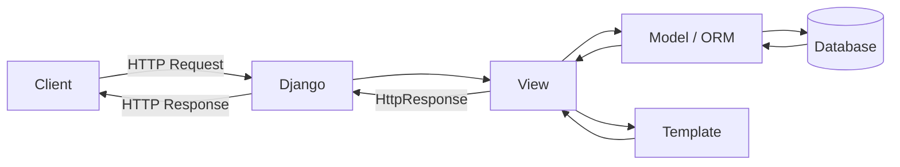
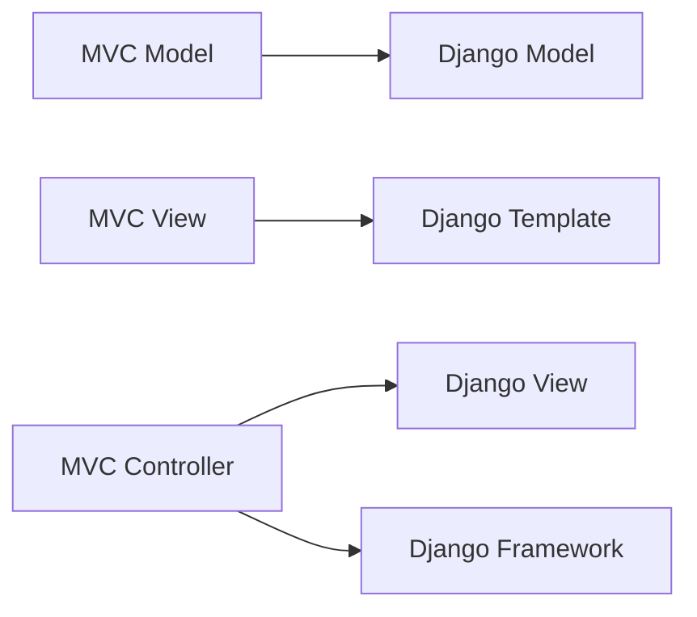
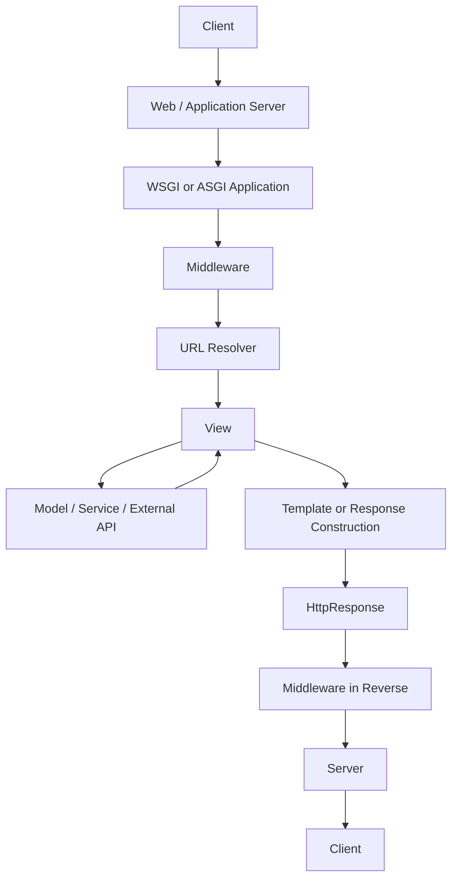
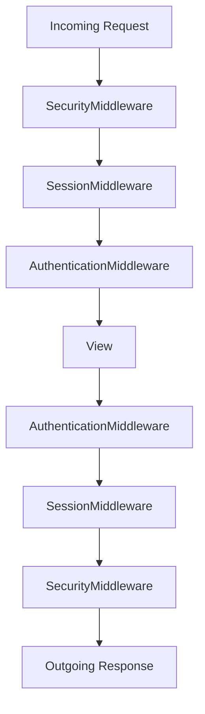
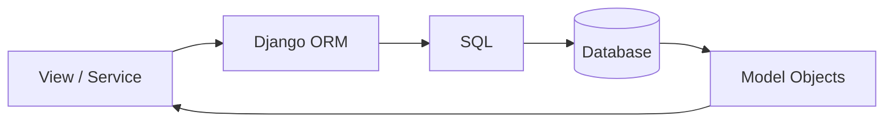
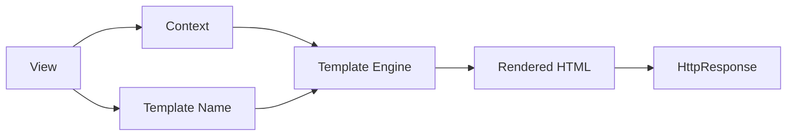
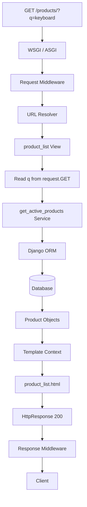
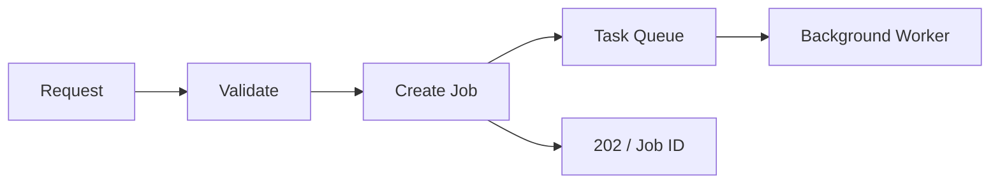
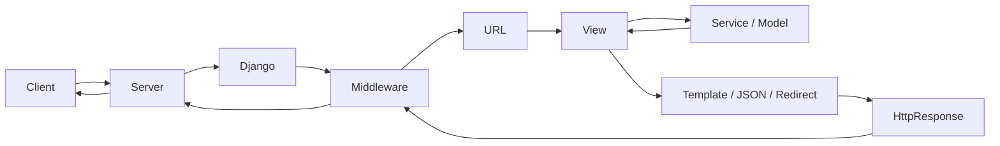

# Django: MTV Architecture & the Request/Response Cycle

Django follows the **MTV pattern — Model, Template, and View**.

At runtime, an HTTP request enters Django, passes through middleware, is matched against the URL configuration, reaches a view, may interact with models or services, and finally produces an HTTP response.

> **Simple mental model:**  
> **Model = data**, **Template = presentation**, **View = request coordination**.

Django describes itself as an MTV-style framework. Its terminology differs slightly from traditional MVC: Django's template roughly represents the MVC view, while Django's view and framework together perform controller-like responsibilities.

---

# 1. Django MTV Architecture

MTV separates an application into three primary responsibilities.

| Component | Responsibility | Product Example |
|---|---|---|
| **Model** | Data, relationships, queries, entity behavior | Product name, price, stock |
| **Template** | Presentation of data | Product-list HTML |
| **View** | Handles request and decides the response | Fetch active products |



The **view acts as the coordinator**. It normally should not become the place where every business rule, database query, and workflow is implemented.

---

## 1.1 Model

A model represents application data and database-related behavior.

```python
# products/models.py

from django.db import models


class Product(models.Model):
    name = models.CharField(max_length=150)
    price = models.DecimalField(max_digits=10, decimal_places=2)
    stock = models.PositiveIntegerField(default=0)
    is_active = models.BooleanField(default=True)

    def __str__(self) -> str:
        return self.name

    @property
    def is_in_stock(self) -> bool:
        return self.stock > 0
```

Django's ORM allows application code to work with Python objects instead of writing SQL for normal operations.

```python
products = Product.objects.filter(is_active=True)
```

A model commonly contains:

- Database fields
- Relationships
- Constraints
- Entity-specific behavior
- Custom managers or QuerySets

Most QuerySet operations are **lazy**. Building or filtering a QuerySet usually does not immediately execute SQL; evaluation happens when the results are actually needed.

---

## 1.2 Template

A template represents the presentation layer.

```html
<!-- products/templates/products/product_list.html -->

<h1>Products</h1>


    <article>
        <h2>{{ product.name }}</h2>
        <p>₹{{ product.price }}</p>

        
            <span>In stock</span>
        
            <span>Out of stock</span>
        
    </article>

    <p>No products found.</p>

```

Templates are suitable for:

- Displaying variables
- Loops
- Simple conditions
- Formatting
- Template inheritance
- Reusable fragments

Keep templates **presentation-oriented**. Complex pricing, permissions, workflows, or database decisions should normally be prepared before rendering.

---

## 1.3 View

A view is a Python callable that receives an `HttpRequest` and returns an `HttpResponse`.

```python
# products/views.py

from django.shortcuts import render

from .models import Product


def product_list(request):
    products = Product.objects.filter(is_active=True)

    return render(
        request,
        "products/product_list.html",
        {"products": products},
    )
```

A view may return:

- Rendered HTML
- JSON
- Redirect
- File
- Streaming response
- Error response

Django creates an `HttpRequest`, passes it to the matched view, and expects the view to return an `HttpResponse`.

---

# 2. MTV vs MVC

Django's terminology is slightly different from traditional MVC.

| Traditional MVC | Django | Responsibility |
|---|---|---|
| Model | Model | Data and domain behavior |
| View | Template | Presentation |
| Controller | Django framework + View | Request coordination |



The important idea is not the naming.

The responsibility separation is what matters:

```text
Model      → What data exists?
Template   → How is it presented?
View       → What should happen for this request?
Framework  → Which view should receive the request?
```

Django's framework performs much of the controller-like responsibility by routing requests to the appropriate view.

---

# 3. Django Request/Response Cycle

A normal Django HTTP request follows this high-level path:



The model and template are **optional**.

For example:

```text
HTML page       → Model + View + Template
JSON API        → Model + View, usually no Django template
Redirect        → View only
Health endpoint → View only
```

---

# 4. Request Cycle Step by Step

## 4.1 Client Sends the Request

A browser, frontend application, mobile app, or another service sends an HTTP request.

```http
GET /products/?q=keyboard HTTP/1.1
Host: example.com
Accept: text/html
```

The request can contain:

- HTTP method
- Path
- Query parameters
- Headers
- Cookies
- Body
- Uploaded files

---

## 4.2 WSGI or ASGI Hands the Request to Django

A Django project normally exposes:

```text
project/
├── asgi.py
├── settings.py
├── urls.py
└── wsgi.py
```

### WSGI

WSGI is primarily associated with traditional synchronous Django deployments.

```text
Client
  ↓
WSGI Server
  ↓
Django
```

### ASGI

ASGI enables Django's asynchronous request stack and is appropriate when asynchronous or long-lived I/O is required.

```text
Client
  ↓
ASGI Server
  ↓
Django
```

Django 6.1 supports async views and asynchronous APIs across several framework areas, including ORM operations, cache, authentication, sessions, and signals.

---

## 4.3 Django Creates `HttpRequest`

Django converts incoming request information into an `HttpRequest`.

Common properties include:

| Attribute | Purpose |
|---|---|
| `request.method` | `GET`, `POST`, `PUT`, etc. |
| `request.path` | Requested path |
| `request.GET` | Query parameters |
| `request.POST` | HTML form data |
| `request.body` | Raw request body |
| `request.FILES` | Uploaded files |
| `request.headers` | HTTP headers |
| `request.COOKIES` | Cookies |
| `request.user` | Current authenticated user |
| `request.session` | Session data |

```python
def product_list(request):
    search = request.GET.get("q", "").strip()
```

`request.GET` and `request.POST` are `QueryDict` objects, so a key can contain multiple values.

```python
tags = request.GET.getlist("tag")
```

`request.user` and `request.session` are provided through the corresponding middleware rather than being basic request data.

---

# 5. Middleware

Middleware surrounds Django's view execution and is used for behavior that applies across many requests.

Common middleware responsibilities include:

- Security
- Sessions
- Authentication
- CSRF protection
- Logging
- Localization
- Caching
- Request tracing
- Tenant identification

Example configuration:

```python
MIDDLEWARE = [
    "django.middleware.security.SecurityMiddleware",
    "django.contrib.sessions.middleware.SessionMiddleware",
    "django.middleware.common.CommonMiddleware",
    "django.middleware.csrf.CsrfViewMiddleware",
    "django.contrib.auth.middleware.AuthenticationMiddleware",
]
```

---

## 5.1 Middleware Onion Model

Middleware behaves like layers around the view.



On the request path:

```text
Top → Bottom
```

On the response path:

```text
Bottom → Top
```

Middleware is applied top-to-bottom before the view, while the response returns through the layers that were entered in reverse order.

---

## 5.2 Middleware Can Short-Circuit

Middleware does not have to call the next layer.

```python
class MaintenanceMiddleware:
    def __init__(self, get_response):
        self.get_response = get_response

    def __call__(self, request):
        if maintenance_enabled():
            return HttpResponse(
                "Maintenance",
                status=503,
            )

        return self.get_response(request)
```

If middleware returns a response without calling `get_response()`, inner middleware and the view are skipped.

This is useful for:

```text
Maintenance mode
HTTP → HTTPS redirect
Cached responses
Global access restrictions
Request rejection
```

One useful detail: middleware hooks such as `process_view()` execute **after Django has resolved the URL but before the view itself runs**. Therefore, not every middleware action happens before URL resolution.

---

## 5.3 Middleware Order Matters

Some middleware depends on another middleware.

For example:

```python
MIDDLEWARE = [
    "django.contrib.sessions.middleware.SessionMiddleware",
    "django.contrib.auth.middleware.AuthenticationMiddleware",
]
```

`SessionMiddleware` must appear before `AuthenticationMiddleware` because authentication depends on session support.

---

# 6. URL Resolution

After the request reaches Django's URL-resolution stage, Django determines which view should handle it.

```python
# project/settings.py

ROOT_URLCONF = "project.urls"
```

Root routes:

```python
# project/urls.py

from django.urls import include, path

urlpatterns = [
    path("products/", include("products.urls")),
]
```

Application routes:

```python
# products/urls.py

from django.urls import path

from .views import product_list

app_name = "products"

urlpatterns = [
    path("", product_list, name="list"),
]
```

For:

```text
GET /products/
```

Django resolves:

```text
project.urls
    ↓
products.urls
    ↓
product_list()
```

Django checks URL patterns **in order and stops at the first match**.

Conceptually:

```text
1. Determine root URLconf
2. Load urlpatterns
3. Check patterns in order
4. Stop at first match
5. Call the matched view
6. Use error handling if resolution or execution fails
```

---

# 7. View Execution

After URL resolution, Django calls the matched view.

```python
def product_list(request):
    search = request.GET.get("q", "").strip()

    products = Product.objects.filter(is_active=True)

    if search:
        products = products.filter(name__icontains=search)

    return render(
        request,
        "products/product_list.html",
        {
            "products": products,
            "search": search,
        },
    )
```

The view coordinates:

```text
Request input
     ↓
Validation / access checks
     ↓
Service or ORM
     ↓
Response construction
```

For medium or large applications, it is common to keep views thin and move workflows into services.

```python
# products/services.py

from .models import Product


def get_active_products(search: str):
    products = Product.objects.filter(is_active=True)

    if search:
        products = products.filter(name__icontains=search)

    return products
```

Then the view becomes mostly HTTP coordination:

```python
def product_list(request):
    search = request.GET.get("q", "").strip()

    products = get_active_products(search)

    return render(
        request,
        "products/product_list.html",
        {
            "products": products,
            "search": search,
        },
    )
```

A service layer is a **project design choice**, not a mandatory Django layer.

---

# 8. ORM and Database Interaction

When the view or service accesses models, Django's ORM translates operations into database queries.

```python
products = Product.objects.filter(
    is_active=True,
    name__icontains="keyboard",
)
```

Conceptually:



QuerySets are generally lazy, meaning this:

```python
products = Product.objects.filter(is_active=True)
```

normally creates a QuerySet without immediately retrieving all rows. Evaluation occurs when results are needed.

---

## 8.1 Related Object Performance

A common production consideration is avoiding unnecessary relationship queries.

For a foreign key or one-to-one relationship:

```python
products = Product.objects.select_related("category")
```

For many-to-many or reverse relationships:

```python
products = Product.objects.prefetch_related("tags")
```

`select_related()` performs SQL joins for supported single-valued relationships, while `prefetch_related()` performs additional queries and joins the results in Python.

---

# 9. Template Rendering and Response Creation

For an HTML response:

```python
return render(
    request,
    "products/product_list.html",
    {"products": products},
)
```

Conceptually:



For JSON:

```python
from django.http import JsonResponse


def product_status(request):
    return JsonResponse({
        "status": "available",
    })
```

For a redirect:

```python
from django.shortcuts import redirect

return redirect("products:list")
```

The important rule is:

> A Django view must ultimately produce an HTTP response object.

---

# 10. `HttpResponse`

Common Django response classes include:

| Response | Typical Use |
|---|---|
| `HttpResponse` | HTML, text, bytes |
| `JsonResponse` | JSON |
| `HttpResponseRedirect` | Redirect |
| `FileResponse` | File download/delivery |
| `StreamingHttpResponse` | Streaming response |
| `HttpResponseNotFound` | 404 |
| `HttpResponseForbidden` | 403 |

Example:

```python
from django.http import HttpResponse


def health(request):
    response = HttpResponse(
        "Application is healthy",
        content_type="text/plain",
        status=200,
    )

    response["X-Service"] = "catalog"

    return response
```

A response normally contains:

```text
Status code
Headers
Cookies
Body
```

---

# 11. Response Middleware

Once the view creates the response, it travels outward through the middleware layers that participated in the request.

Middleware may:

- Add security headers
- Save session changes
- Set cookies
- Add cache headers
- Record request duration
- Log request information
- Modify the response

Example timing middleware:

```python
from time import perf_counter


class RequestTimingMiddleware:
    def __init__(self, get_response):
        self.get_response = get_response

    def __call__(self, request):
        started = perf_counter()

        response = self.get_response(request)

        elapsed_ms = (
            perf_counter() - started
        ) * 1000

        response["X-Request-Duration-Ms"] = (
            f"{elapsed_ms:.2f}"
        )

        return response
```

---

# 12. Sync vs Async Request Handling

Django 6.1 supports both synchronous and asynchronous views.

## 12.1 Synchronous View

```python
def product_list(request):
    products = Product.objects.all()

    return render(
        request,
        "products/product_list.html",
        {"products": products},
    )
```

Typical flow:

```text
WSGI / ASGI
    ↓
Sync middleware
    ↓
Sync view
    ↓
Response
```

---

## 12.2 Asynchronous View

An async view uses `async def`.

```python
from django.http import JsonResponse


async def product_status(request):
    product = await Product.objects.afirst()

    return JsonResponse({
        "product": product.name if product else None,
    })
```

For an efficiently asynchronous request stack:

```text
ASGI Server
    ↓
Async-capable Middleware
    ↓
Async View
    ↓
Async I/O
```

Django 6.1 supports asynchronous ORM query operations using methods such as:

```python
await Product.objects.afirst()
await Product.objects.acreate(...)
```

and supports `async for` over QuerySets.

### When async is useful

Use async mainly for concurrent I/O such as:

- External API calls
- Long polling
- Streaming
- Many concurrent I/O-bound connections

Async usually does **not** make CPU-heavy work faster.

```text
CPU-heavy processing
        ↓
Background worker / processing service
```

A fully asynchronous stack requires async-compatible middleware. Synchronous middleware can force Django to adapt between sync and async execution.

One important current limitation: database transactions still do not operate directly in async mode; transaction-dependent code should remain synchronous and be called using the appropriate sync/async bridge.

---

# 13. Complete Practical Flow

Use the same product-list request from the earlier sections:

```text
GET /products/?q=keyboard
```

Application structure:

```text
shop/
├── manage.py
├── shop/
│   ├── settings.py
│   ├── urls.py
│   ├── asgi.py
│   └── wsgi.py
└── products/
    ├── models.py
    ├── services.py
    ├── urls.py
    ├── views.py
    └── templates/
        └── products/
            └── product_list.html
```

Runtime flow:



The flow can be remembered as:

```text
Request
  ↓
Middleware
  ↓
URL
  ↓
View
  ↓
Service / Model
  ↓
Template or Response
  ↓
Middleware
  ↓
Client
```

---

# 14. Practical Responsibility Split

For production Django applications, this separation keeps the request cycle easier to understand and maintain.

| Layer | Main Responsibility |
|---|---|
| URLconf | Map URLs to views |
| Middleware | Cross-cutting request/response behavior |
| View | HTTP coordination |
| Form / Serializer | Input validation |
| Service | Application workflow |
| Model | Data and entity behavior |
| Manager / QuerySet | Reusable database queries |
| Template | Presentation |
| Worker / Task | Long-running background processing |

A useful view structure is:

```text
Read request
     ↓
Validate input
     ↓
Check access
     ↓
Call service / ORM
     ↓
Build response
```

---

# 15. Performance Points Worth Remembering

## QuerySets are lazy

```python
products = Product.objects.filter(is_active=True)
```

The query is normally evaluated later when results are consumed.

---

## Fetch relationships efficiently

```python
Product.objects.select_related("category")
```

or:

```python
Product.objects.prefetch_related("tags")
```

Use the appropriate relationship-loading strategy when related objects will be accessed repeatedly.

---

## Keep long-running work outside the request

Avoid making users wait for work such as:

```text
Large report generation
Document processing
Bulk email sending
Video processing
Long-running AI jobs
```

A common architecture is:



---

## Keep the view focused on HTTP

Prefer:

```text
View
 ├── Read request
 ├── Validate/access check
 ├── Call service
 └── Return response
```

instead of placing the entire business workflow directly inside the view.

---

# 16. Key Takeaways

The most important concepts are:

| Concept | Remember |
|---|---|
| **Model** | Data and entity behavior |
| **Template** | Presentation |
| **View** | Request coordination |
| **URLconf** | Selects the view |
| **Middleware** | Wraps request/response processing |
| **HttpRequest** | Carries incoming request data |
| **HttpResponse** | Carries outgoing response data |
| **WSGI** | Traditional synchronous application interface |
| **ASGI** | Enables Django's async request stack |

The complete request cycle is:

```text
1. Client sends an HTTP request.
2. WSGI or ASGI passes it to Django.
3. Django builds an HttpRequest.
4. Middleware processes the incoming request.
5. Django resolves the URL.
6. The matched view is called.
7. The view may call services, models, or external APIs.
8. The view constructs an HttpResponse.
9. The response travels outward through middleware.
10. The server returns the response to the client.
```



> **Core understanding:** Django's **view coordinates the request**, the **model handles data**, and the **template handles presentation**. URL resolution decides which view runs, while middleware surrounds the complete request/response flow.

This model is the foundation for understanding Django views, middleware, authentication, sessions, ORM queries, templates, DRF endpoints, and production request debugging.
