# Django: MTV Architecture & the Request/Response Cycle

> Django follows the **MTV pattern: Model, Template, and View**.
>
> A request enters Django, passes through middleware, is matched to a URL, reaches a view, may interact with models and templates, and finally returns an HTTP response.

## In short

- MTV splits an application three ways: **Model** owns data and domain behavior, **Template** owns presentation, **View** handles the request and decides what comes back.
- Django's **View** is MVC's Controller and Django's **Template** is MVC's View — the framework itself does the remaining controller work (middleware, URL resolution, response handling).
- The ordered path is WSGI/ASGI server → `HttpRequest` → request middleware → URL resolver → view → model/service → template → response middleware → client.
- Middleware is an onion: requests travel top-to-bottom through `MIDDLEWARE`, responses come back bottom-to-top through the same list.
- A middleware can short-circuit the cycle by returning a response without calling `get_response()` — the view never runs.
- Views should stay thin — read input, check access, call a service, choose a response format. Business logic belongs in a service layer.
- `HttpRequest` and `HttpResponse` are the two objects that carry everything: method, path, query, body, user and session inbound; status, headers, cookies and body outbound.

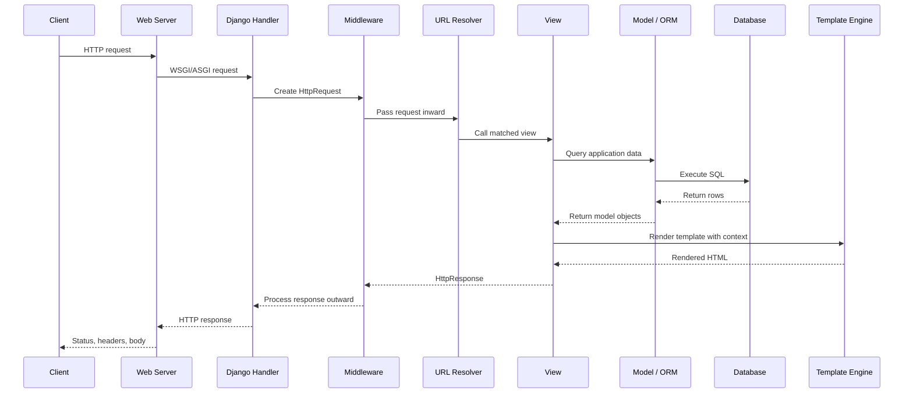

**Interview answer:** The WSGI or ASGI server hands the raw request to Django's handler, which builds an `HttpRequest` and passes it down through `MIDDLEWARE` top-to-bottom; the URL resolver then walks `ROOT_URLCONF` in order and calls the first matching view with the captured arguments. The view coordinates the work — querying models or calling a service, then rendering a template or building a `JsonResponse` — and returns an `HttpResponse`, which travels back out through the same middleware in reverse order before the server writes status, headers and body to the client. Model and template are both optional: a redirect or a health check may use neither.

**Gotcha:** Assuming every request reaches a view. Middleware can return a response before the resolver ever runs — a failed CSRF check, an HTTPS redirect, a cached response, a rejected host — so a bug that looks like it lives in the view often lives earlier in the onion.

---

# 1. What Is Django's MTV Architecture?

Django organizes a web application using the **MTV architectural pattern**. Think of an online store:

| MTV Part | Responsibility | Store Example |
|---|---|---|
| Model | Manages application data and database behavior | Product name, price, stock |
| Template | Controls how data is presented, usually as HTML | Product-list HTML page |
| View | Receives a request, coordinates application logic, and returns a response | Fetch available products |

The **view is the coordinator**. It does not usually store data or define page styling itself.

Django itself handles much of the controller-like work:

- Receiving an HTTP request
- Running middleware
- Matching a URL
- Calling the correct view
- Converting the view result into an HTTP response

## 1.1 Basic MTV Diagram

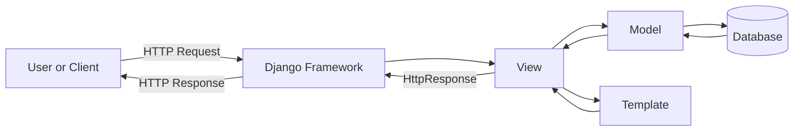

---

# 2. MTV Components

## 2.1 Model

A model represents application data and database-related behavior.

```python
# products/models.py

from django.db import models

class Product(models.Model):
    name = models.CharField(max_length=150)
    price = models.DecimalField(max_digits=10, decimal_places=2)
    is_active = models.BooleanField(default=True)
    created_at = models.DateTimeField(auto_now_add=True)

    def __str__(self) -> str:
        return self.name
```

Django uses the model definition to work with database records through its ORM.

```python
active_products = Product.objects.filter(is_active=True)
```

This QuerySet does not normally execute immediately. It is evaluated when Django actually needs its data, such as during iteration or template rendering.

**A model commonly contains:**

- Database fields
- Relationships
- Database constraints
- Domain behavior closely related to the entity
- Reusable QuerySet or manager methods

```python
class ProductQuerySet(models.QuerySet):
    def active(self):
        return self.filter(is_active=True)

class Product(models.Model):
    name = models.CharField(max_length=150)
    is_active = models.BooleanField(default=True)

    objects = ProductQuerySet.as_manager()
```

Usage: `products = Product.objects.active()`

> A model should represent more than a database table. It can also protect domain rules that belong to that entity.

---

## 2.2 Template

A template defines the presentation layer.

```html
<!-- products/templates/products/product_list.html -->

<!DOCTYPE html>
<html lang="en">
<head>
    <meta charset="UTF-8">
    <title>Products</title>
</head>
<body>
    <h1>Available Products</h1>

    
        <article>
            <h2>{{ product.name }}</h2>
            <p>Price: ${{ product.price }}</p>
        </article>
    
        <p>No products are currently available.</p>
    
</body>
</html>
```

A Django template can:

- Display variables
- Loop over collections
- Apply presentation-oriented filters
- Use conditions
- Extend reusable base templates
- Include reusable template fragments

A template should not contain complex business logic.

Good:

```django

    <span>Available</span>

```

Avoid placing complicated pricing, authorization, or workflow decisions inside templates.

---

## 2.3 View

A view is a callable that:

1. Accepts an `HttpRequest`
2. Performs application work
3. Returns an `HttpResponse`

**A function-based view** is a plain function that receives the request as its first argument.

```python
# products/views.py

from django.shortcuts import render

from .models import Product

def product_list(request):
    products = Product.objects.filter(is_active=True)

    return render(
        request,
        "products/product_list.html",
        {"products": products},
    )
```

**A class-based view** groups the per-method handlers on a class.

```python
# products/views.py

from django.views.generic import ListView

from .models import Product

class ProductListView(ListView):
    model = Product
    template_name = "products/product_list.html"
    context_object_name = "products"

    def get_queryset(self):
        return Product.objects.filter(is_active=True)
```

A view may return:

- HTML using `render()`
- JSON using `JsonResponse`
- A redirect
- A file response
- A streaming response
- An error response
- A response generated by a class-based view

```python
from django.http import JsonResponse

def product_status(request):
    return JsonResponse({"status": "available"})
```

---

# 3. MTV vs MVC

Django's MTV pattern is conceptually close to MVC, but the names are mapped differently.

| Traditional MVC | Django MTV | Main Role |
|---|---|---|
| Model | Model | Data and domain behavior |
| View | Template | Presentation |
| Controller | Django framework + View | Request coordination |

## 3.1 Mapping Diagram

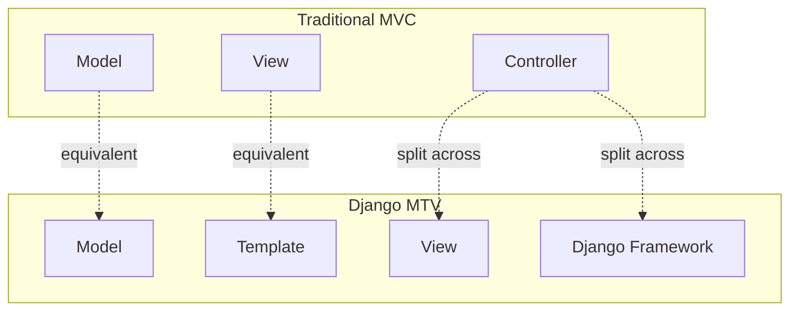

## 3.2 Why Django Calls It a View

In Django, a view describes **which data the user receives**, not necessarily how that data looks.

The template controls the visual representation.

For example:

```python
def product_detail(request, product_id):
    product = get_object_or_404(Product, id=product_id)
    return render(request, "products/detail.html", {"product": product})
```

The view decides:

- Which product to load
- Whether it exists
- Which template to use
- Which context to provide

The template decides:

- Which fields to show
- Their visual structure
- Their formatting

---

# 4. High-Level Request/Response Cycle

A Django request usually follows this path:

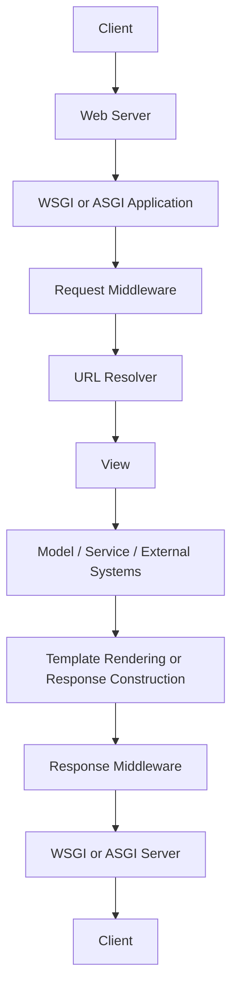

The model and template are optional:

- A redirect may not use either.
- A JSON endpoint may use a model but no template.
- A health-check endpoint may use neither.

---

# 5. Detailed Request Processing

## 5.1 Step 1: The Client Sends an HTTP Request

A browser, mobile app, frontend, or another server sends a request.

```http
GET /products/?category=laptop HTTP/1.1
Host: example.com
Accept: text/html
Cookie: sessionid=abc123
```

Important request information includes:

- HTTP method
- Path
- Query parameters
- Headers
- Cookies
- Request body
- Uploaded files

---

## 5.2 Step 2: The Web Server Passes the Request to Django

In production, Django is normally behind a server or platform such as:

- Gunicorn
- Uvicorn
- Daphne
- Apache
- A reverse proxy such as Nginx

Django exposes one of two application entry points:

```text
project/
├── asgi.py
├── settings.py
├── urls.py
└── wsgi.py
```

**WSGI** is traditionally used for synchronous request processing.

```python
# project/wsgi.py

import os

from django.core.wsgi import get_wsgi_application

os.environ.setdefault("DJANGO_SETTINGS_MODULE", "project.settings")

application = get_wsgi_application()
```

**ASGI** supports asynchronous request handling and long-lived connections.

```python
# project/asgi.py

import os

from django.core.asgi import get_asgi_application

os.environ.setdefault("DJANGO_SETTINGS_MODULE", "project.settings")

application = get_asgi_application()
```

Django converts the incoming server data into an `HttpRequest`.

---

## 5.3 Step 3: Django Creates an HttpRequest

The request object carries state through the application.

```python
def request_example(request):
    print(request.method)
    print(request.path)
    print(request.GET)
    print(request.user)
```

Example values:

| Attribute | Example value |
| --- | --- |
| `request.method` | `"GET"` |
| `request.path` | `"/products/"` |
| `request.GET` | `{"category": "laptop"}` |
| `request.user` | Authenticated user or `AnonymousUser` |

Some request attributes, such as `request.user` or `request.session`, are attached by middleware.

---

## 5.4 Step 4: Request Middleware Runs

Middleware wraps the request/response process.

A common middleware configuration looks like this:

```python
MIDDLEWARE = [
    "django.middleware.security.SecurityMiddleware",
    "django.contrib.sessions.middleware.SessionMiddleware",
    "django.middleware.common.CommonMiddleware",
    "django.middleware.csrf.CsrfViewMiddleware",
    "django.contrib.auth.middleware.AuthenticationMiddleware",
    "django.contrib.messages.middleware.MessageMiddleware",
]
```

On the request path, middleware runs from top to bottom.

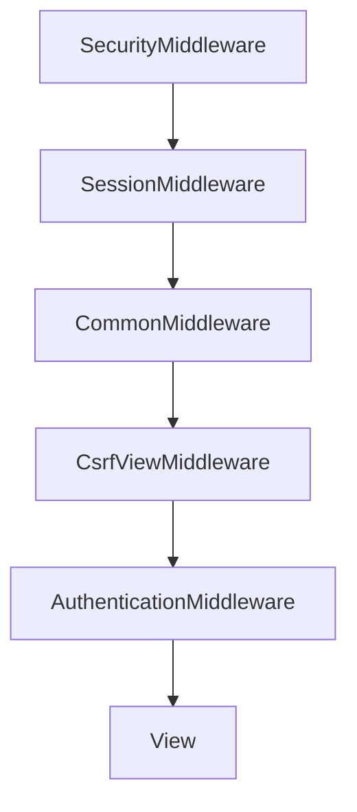

On the response path, it runs in reverse.

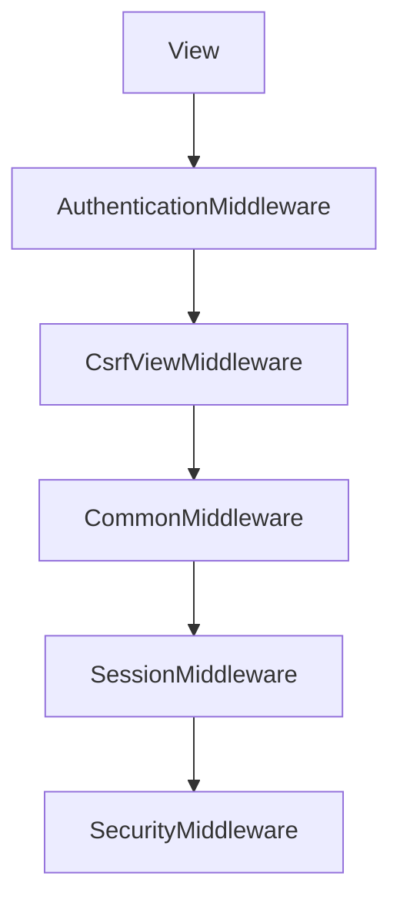

A middleware can return a response before the request reaches the view.

Examples:

- Reject an invalid host
- Redirect HTTP to HTTPS
- Return `403 Forbidden` for failed CSRF validation
- Return a cached response
- Enforce tenant or maintenance rules

---

## 5.5 Step 5: Django Resolves the URL

Django uses the root URL configuration from `ROOT_URLCONF`.

```python
# project/settings.py

ROOT_URLCONF = "project.urls"
```

Root URL configuration:

```python
# project/urls.py

from django.contrib import admin
from django.urls import include, path

urlpatterns = [
    path("admin/", admin.site.urls),
    path("products/", include("products.urls")),
]
```

Application URL configuration:

```python
# products/urls.py

from django.urls import path

from . import views

app_name = "products"

urlpatterns = [
    path("", views.product_list, name="list"),
    path("<int:product_id>/", views.product_detail, name="detail"),
]
```

For this request: `GET /products/42/`

Django matches: `path("<int:product_id>/", views.product_detail, name="detail")`

It calls: `views.product_detail(request, product_id=42)`

**URL resolution follows a fixed order.** Django:

1. Loads the root URL configuration.
2. Reads `urlpatterns`.
3. Checks patterns in order.
4. Stops at the first matching pattern.
5. Calls the corresponding view.
6. Uses an error handler if no route matches or an exception occurs.

> URL order matters. Put more specific patterns before broad catch-all patterns.

---

## 5.6 Step 6: Django Calls the View

A function-based view receives the request as its first parameter.

```python
from django.shortcuts import get_object_or_404, render

from .models import Product

def product_detail(request, product_id):
    product = get_object_or_404(
        Product,
        id=product_id,
        is_active=True,
    )

    return render(
        request,
        "products/product_detail.html",
        {"product": product},
    )
```

A class-based view is converted into a callable using `as_view()`.

```python
# products/urls.py

from django.urls import path

from .views import ProductDetailView

urlpatterns = [
    path(
        "<int:pk>/",
        ProductDetailView.as_view(),
        name="detail",
    ),
]
```

Simplified class-based flow:

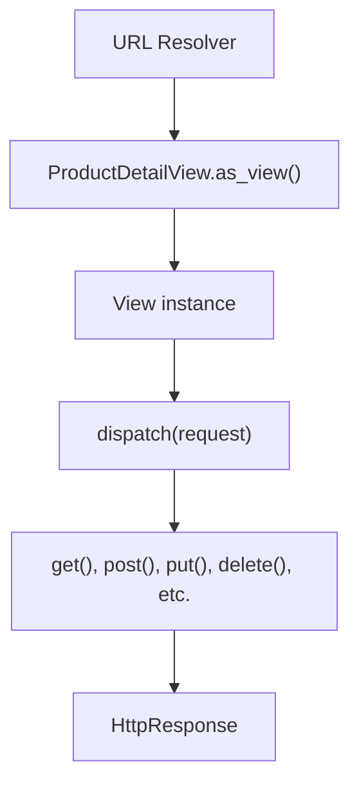

---

## 5.7 Step 7: The View Interacts with Models or Services

The view may query the database: `product = Product.objects.get(id=product_id)`

Conceptually:

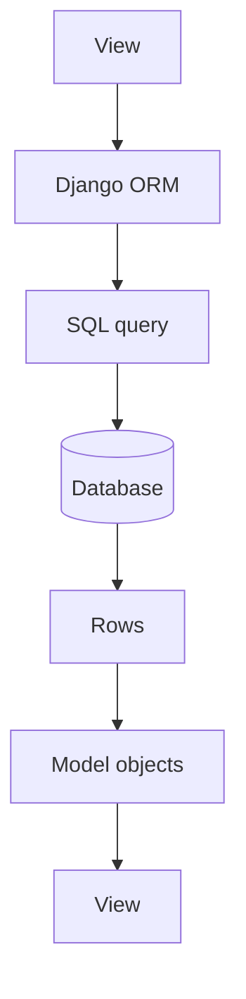

Example SQL generated conceptually:

```sql
SELECT
    id,
    name,
    price,
    is_active
FROM products_product
WHERE id = 42
  AND is_active = TRUE;
```

For larger applications, views should often delegate business workflows to service functions.

```python
# products/services.py

from .models import Product

def get_visible_product(*, product_id: int) -> Product:
    return Product.objects.get(
        id=product_id,
        is_active=True,
    )
```

```python
# products/views.py

from django.http import Http404
from django.shortcuts import render

from .models import Product
from .services import get_visible_product

def product_detail(request, product_id):
    try:
        product = get_visible_product(product_id=product_id)
    except Product.DoesNotExist as exc:
        raise Http404("Product not found") from exc

    return render(
        request,
        "products/product_detail.html",
        {"product": product},
    )
```

---

## 5.8 Step 8: The View Builds a Response

The view must return an `HttpResponse` or a compatible response object.

### Response Types

For an HTML page, `render()` loads a template, renders it with the context, and wraps the result in an `HttpResponse`.

```python
return render(request, "products/list.html", context)
```

Conceptually, `render()` performs:

```python
template = loader.get_template("products/list.html")
html = template.render(context, request)
return HttpResponse(html)
```

For JSON, return a `JsonResponse`, which serializes the payload and sets the content type.

```python
from django.http import JsonResponse

def product_api(request, product_id):
    return JsonResponse(
        {
            "id": product_id,
            "status": "available",
        }
    )
```

For a redirect, `redirect()` builds an `HttpResponseRedirect` from a view name, a model, or a URL.

```python
from django.shortcuts import redirect

def create_product(request):
    # Save product...
    return redirect("products:list")
```

To control the status code, pass `status=` to the response class.

```python
from django.http import JsonResponse

def protected_endpoint(request):
    if not request.user.is_authenticated:
        return JsonResponse(
            {"detail": "Authentication required."},
            status=401,
        )

    return JsonResponse({"detail": "Allowed."})
```

---

## 5.9 Step 9: Response Middleware Runs

The generated response moves outward through middleware in reverse order.

Middleware may:

- Add security headers
- Save session changes
- Add cookies
- Compress content
- Record timing information
- Modify caching headers
- Log the response
- Replace the response

Example custom middleware:

```python
# core/middleware.py

from time import perf_counter

class RequestTimingMiddleware:
    def __init__(self, get_response):
        self.get_response = get_response

    def __call__(self, request):
        started_at = perf_counter()

        response = self.get_response(request)

        elapsed_ms = (perf_counter() - started_at) * 1000
        response["X-Request-Duration-Ms"] = f"{elapsed_ms:.2f}"

        return response
```

Add it to settings:

```python
MIDDLEWARE = [
    "core.middleware.RequestTimingMiddleware",
    # Other middleware...
]
```

---

## 5.10 Step 10: The Response Returns to the Client

A final HTTP response may look like this:

```http
HTTP/1.1 200 OK
Content-Type: text/html; charset=utf-8
Content-Length: 2458
X-Request-Duration-Ms: 18.42

<!DOCTYPE html>
<html>
...
</html>
```

The response contains:

- Status code
- Headers
- Cookies, when applicable
- Body content

---

# 6. Complete Practical Example

The following example shows the complete MTV flow for a product-list page.

## 6.1 Project Structure

```text
shop/
├── manage.py
├── shop/
│   ├── asgi.py
│   ├── settings.py
│   ├── urls.py
│   └── wsgi.py
└── products/
    ├── migrations/
    ├── templates/
    │   └── products/
    │       └── product_list.html
    ├── models.py
    ├── urls.py
    └── views.py
```

---

## 6.2 Model

```python
# products/models.py

from django.db import models

class Product(models.Model):
    name = models.CharField(max_length=150)
    price = models.DecimalField(max_digits=10, decimal_places=2)
    stock = models.PositiveIntegerField(default=0)
    is_active = models.BooleanField(default=True)

    class Meta:
        ordering = ["name"]

    def __str__(self) -> str:
        return self.name

    @property
    def is_in_stock(self) -> bool:
        return self.stock > 0
```

---

## 6.3 Application URLs

```python
# products/urls.py

from django.urls import path

from .views import product_list

app_name = "products"

urlpatterns = [
    path("", product_list, name="list"),
]
```

---

## 6.4 Root URLs

```python
# shop/urls.py

from django.contrib import admin
from django.urls import include, path

urlpatterns = [
    path("admin/", admin.site.urls),
    path("products/", include("products.urls")),
]
```

---

## 6.5 View

```python
# products/views.py

from django.shortcuts import render

from .models import Product

def product_list(request):
    search_term = request.GET.get("q", "").strip()

    products = Product.objects.filter(is_active=True)

    if search_term:
        products = products.filter(name__icontains=search_term)

    context = {
        "products": products,
        "search_term": search_term,
    }

    return render(
        request,
        "products/product_list.html",
        context,
    )
```

---

## 6.6 Template

```html
<!-- products/templates/products/product_list.html -->

<!DOCTYPE html>
<html lang="en">
<head>
    <meta charset="UTF-8">
    <title>Product List</title>
</head>
<body>
    <h1>Products</h1>

    <form method="get">
        <label for="search">Search</label>
        <input
            id="search"
            name="q"
            value="{{ search_term }}"
        >
        <button type="submit">Search</button>
    </form>

    <section>
        
            <article>
                <h2>{{ product.name }}</h2>
                <p>Price: ${{ product.price }}</p>

                
                    <p>In stock</p>
                
                    <p>Out of stock</p>
                
            </article>
        
            <p>No matching products found.</p>
        
    </section>
</body>
</html>
```

---

## 6.7 Runtime Flow

Request: `GET /products/?q=keyboard`

Processing:

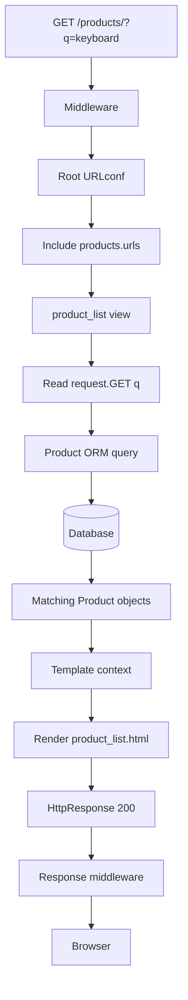

---

# 7. Middleware in the Request/Response Cycle

Middleware is not part of Model, Template, or View, but it surrounds the entire MTV execution.

## 7.1 Onion Model

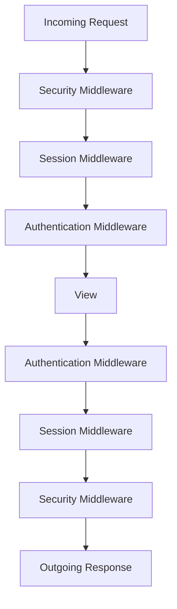

The same middleware instance can execute code:

- Before the next layer
- After the next layer returns a response

```python
def middleware(request):
    # Request phase

    response = get_response(request)

    # Response phase

    return response
```

## 7.2 Middleware Order Matters

`AuthenticationMiddleware` depends on session support, so session middleware must run first on the request path.

```python
MIDDLEWARE = [
    "django.contrib.sessions.middleware.SessionMiddleware",
    "django.contrib.auth.middleware.AuthenticationMiddleware",
]
```

Incorrect ordering can cause missing request attributes or broken security behavior.

## 7.3 Appropriate Middleware Use Cases

Middleware is suitable for concerns that apply across many views:

- Authentication context
- Request logging
- Correlation IDs
- Security headers
- Locale detection
- Tenant identification
- Rate limiting
- Request timing
- Maintenance mode

Do not use middleware for domain logic that belongs to one feature only.

---

# 8. Request and Response Objects

## 8.1 Important HttpRequest Attributes

| Attribute | Purpose |
|---|---|
| `request.method` | HTTP method such as `GET` or `POST` |
| `request.path` | Requested path |
| `request.GET` | Query parameters |
| `request.POST` | Parsed form data |
| `request.body` | Raw request body |
| `request.FILES` | Uploaded files |
| `request.headers` | Request headers |
| `request.COOKIES` | Incoming cookies |
| `request.user` | Current user, added by authentication middleware |
| `request.session` | Session data, added by session middleware |

Example:

```python
def request_info(request):
    page = request.GET.get("page", "1")
    user_agent = request.headers.get("User-Agent", "Unknown")
```

`request.GET` and `request.POST` are `QueryDict` objects and may contain more than one value for a key.

```python
selected_tags = request.GET.getlist("tag")
```

---

## 8.2 Important HttpResponse Features

```python
from django.http import HttpResponse

def plain_text(request):
    response = HttpResponse(
        "Application is healthy",
        content_type="text/plain",
        status=200,
    )

    response["X-Service"] = "catalog"
    response.set_cookie("visited", "true")

    return response
```

Common response classes include:

| Response Class | Typical Use |
|---|---|
| `HttpResponse` | Text, HTML, or raw bytes |
| `JsonResponse` | JSON data |
| `HttpResponseRedirect` | Redirect |
| `FileResponse` | Efficient file delivery |
| `StreamingHttpResponse` | Streaming content |
| `HttpResponseNotFound` | 404 response |
| `HttpResponseForbidden` | 403 response |

---

# 9. Template Rendering Flow

The `render()` shortcut combines:

- Request
- Template name
- Context dictionary
- Optional content type
- Optional status code

```python
return render(
    request,
    "products/product_list.html",
    {"products": products},
    status=200,
)
```

## 9.1 Rendering Diagram

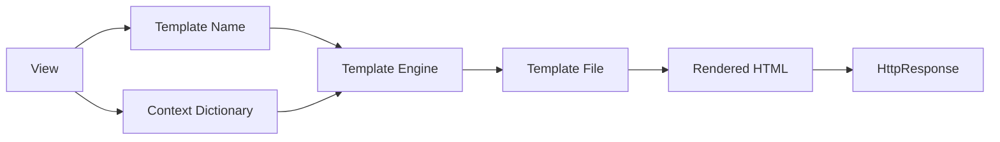

## 9.2 Context Processors

Context processors can add shared data to template contexts when a request-aware context is used.

Examples include:

- Current user
- Messages
- CSRF token
- Debug data
- Custom global values

Custom context processor:

```python
# core/context_processors.py

def application_metadata(request):
    return {
        "application_name": "Shop Platform",
    }
```

Settings:

```python
TEMPLATES = [
    {
        "BACKEND": "django.template.backends.django.DjangoTemplates",
        "OPTIONS": {
            "context_processors": [
                "django.template.context_processors.request",
                "core.context_processors.application_metadata",
            ],
        },
    },
]
```

Use context processors for small, broadly required presentation data. Avoid database-heavy queries on every page.

---

# 10. Error Handling During the Cycle

Errors can occur in middleware, URL resolution, views, models, or template rendering. **An unhandled exception normally becomes a 500 response.** With `DEBUG=True`, Django shows a technical error page. In production, `DEBUG` must be `False`.

## 10.1 No URL Match

When no URL pattern matches, Django returns a 404 response.

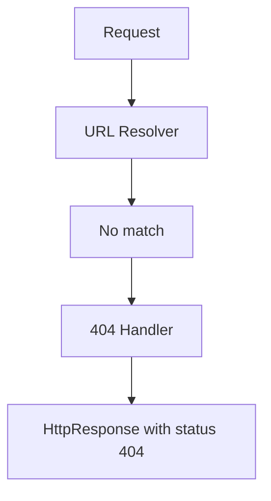

## 10.2 Object Not Found

```python
from django.shortcuts import get_object_or_404

def product_detail(request, product_id):
    product = get_object_or_404(Product, id=product_id)
```

This raises `Http404` when the object does not exist. Django converts it into a 404 response.

## 10.3 Permission Failure

```python
from django.core.exceptions import PermissionDenied

def admin_report(request):
    if not request.user.is_staff:
        raise PermissionDenied

    # Continue processing...
```

Django converts `PermissionDenied` into a 403 response.

## 10.4 Custom Error Views

```python
# project/urls.py

handler400 = "core.views.bad_request"
handler403 = "core.views.permission_denied"
handler404 = "core.views.page_not_found"
handler500 = "core.views.server_error"
```

```python
# core/views.py

from django.shortcuts import render

def page_not_found(request, exception):
    return render(
        request,
        "errors/404.html",
        status=404,
    )
```

---

# 11. WSGI, ASGI, Sync, and Async Requests

## 11.1 WSGI Flow

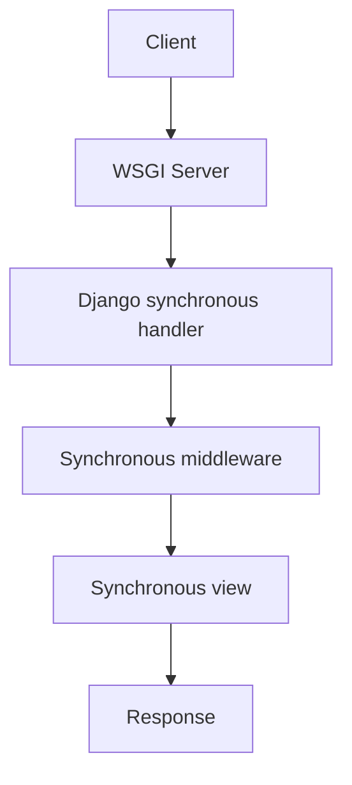

WSGI is suitable for standard synchronous Django applications.

---

## 11.2 ASGI Flow

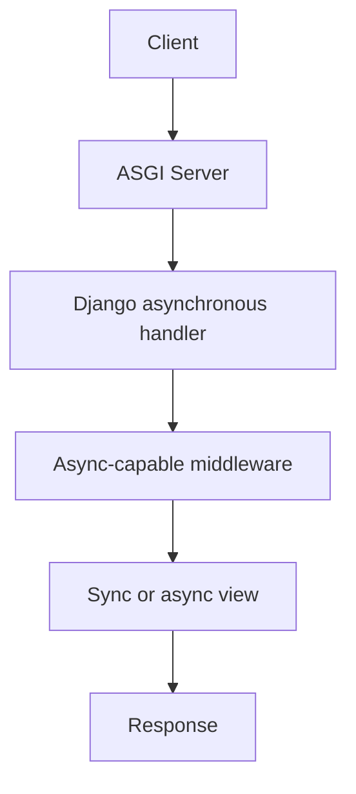

ASGI is useful when an application needs:

- Async views
- Long polling
- Slow streaming
- Many concurrent I/O-bound connections
- Integration with async libraries
- WebSocket support through compatible ecosystem components

**An async view is declared with `async def`** and returns the same response objects.

```python
import asyncio

from django.http import JsonResponse

async def availability(request):
    await asyncio.sleep(0.1)

    return JsonResponse(
        {"status": "available"}
    )
```

A fully asynchronous request stack requires async-compatible middleware throughout the stack. If synchronous middleware sits in the path, Django may adapt execution, which introduces overhead.

Do not make a view async only because `async def` is available. It is most valuable for concurrent I/O, not CPU-heavy processing.

```python
async def external_status(request):
    # Good async use case:
    # wait for multiple external network responses concurrently.
    ...
```

For CPU-heavy processing, use a background worker or a separate processing service.

---

# 12. Where Business Logic Should Live

A common maintainability issue is putting all logic inside views.

## 12.1 Thin View Approach

A well-structured view should mainly:

1. Read request input.
2. Validate input.
3. Check access.
4. Call application or domain logic.
5. Select the response format.
6. Return a response.

```python
# orders/views.py

from django.shortcuts import redirect, render

from .forms import CheckoutForm
from .services import place_order

def checkout(request):
    if request.method == "POST":
        form = CheckoutForm(request.POST)

        if form.is_valid():
            order = place_order(
                customer=request.user,
                cleaned_data=form.cleaned_data,
            )

            return redirect(
                "orders:detail",
                order_id=order.id,
            )
    else:
        form = CheckoutForm()

    return render(
        request,
        "orders/checkout.html",
        {"form": form},
    )
```

The service handles the workflow:

```python
# orders/services.py

from django.db import transaction

from .models import Order

@transaction.atomic
def place_order(*, customer, cleaned_data):
    order = Order.objects.create(
        customer=customer,
        shipping_address=cleaned_data["shipping_address"],
    )

    # Reserve stock, create items, calculate totals, etc.

    return order
```

## 12.2 Practical Responsibility Split

| Layer | Suitable Responsibility |
|---|---|
| URLconf | Route a path to a view |
| Middleware | Cross-cutting request/response behavior |
| View | HTTP coordination |
| Form / Serializer | Input parsing and validation |
| Service | Use-case or workflow logic |
| Model | Entity data and entity-specific behavior |
| Manager / QuerySet | Reusable query logic |
| Template | Presentation |
| Task / Worker | Long-running background work |

This separation is not a strict Django requirement. It is a practical structure for medium and large systems.

---

# 13. Performance and Design Considerations

## 13.1 QuerySets Are Lazy

This code creates a QuerySet: `products = Product.objects.filter(is_active=True)`

The database is normally queried only when the data is evaluated.

```python
for product in products:
    print(product.name)
```

Template iteration can trigger evaluation:

```django

    {{ product.name }}

```

This means database work may happen during template rendering, not necessarily on the line where the QuerySet was created.

---

## 13.2 Avoid N+1 Queries

Suppose every product has a category: `products = Product.objects.all()`

Template:

```django

    {{ product.category.name }}

```

This can cause one query for products plus additional queries for categories.

Use `select_related()` for single-valued relationships: `products = Product.objects.select_related("category")`

Use `prefetch_related()` for many-valued relationships: `products = Product.objects.prefetch_related("tags")`

---

## 13.3 Do Not Perform Heavy Work in the Request

Avoid keeping the user waiting while a request performs:

- Large report generation
- Video processing
- Large email campaigns
- Complex document extraction
- Long external API workflows

A better flow is:

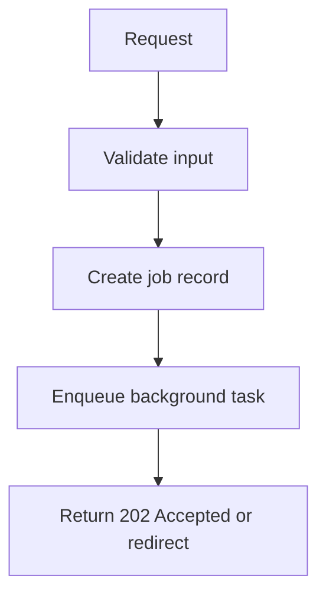

---

## 13.4 Use Correct HTTP Methods

| Method | Typical Meaning |
|---|---|
| `GET` | Retrieve data without changing server state |
| `POST` | Create or trigger processing |
| `PUT` | Replace a resource |
| `PATCH` | Partially update a resource |
| `DELETE` | Delete a resource |

Do not change data using a simple `GET` request.

---

## 13.5 Return Correct Status Codes

Common status codes:

| Code | Meaning |
|---|---|
| `200` | Successful request |
| `201` | Resource created |
| `202` | Accepted for later processing |
| `204` | Success with no response body |
| `302` | Redirect |
| `400` | Invalid request |
| `401` | Authentication required |
| `403` | Authenticated but not allowed, or request forbidden |
| `404` | Resource not found |
| `409` | Conflict |
| `500` | Unexpected server error |

---

## 13.6 Keep Templates Presentation-Oriented

Prefer: `{{ product.price|floatformat:2 }}`

Avoid complicated data fetching or domain decisions in templates.

Prepare the required data before rendering:

```python
context = {
    "products": products,
    "can_edit": request.user.has_perm("products.change_product"),
}
```

---

## 13.7 Understand Short-Circuit Responses

Not every request reaches a view.

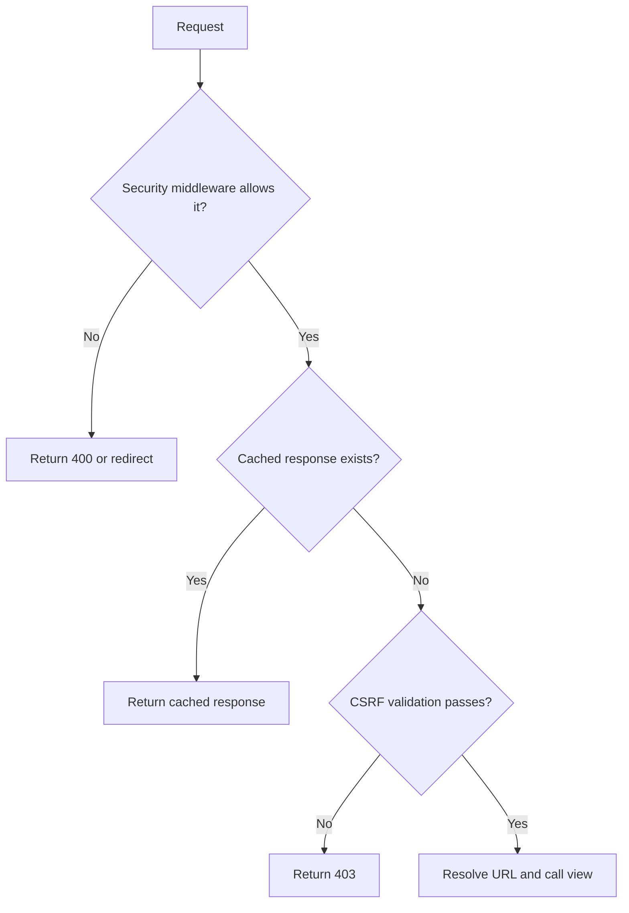

This is important when debugging: an issue that appears to be in a view may actually occur earlier in middleware.

---

# 14. Testing the Request/Response Flow

Django's test client simulates requests and captures responses.

## 14.1 Basic View Test

```python
# products/tests/test_views.py

from django.test import TestCase
from django.urls import reverse

from products.models import Product

class ProductListViewTests(TestCase):
    def test_active_products_are_displayed(self):
        Product.objects.create(
            name="Keyboard",
            price="79.99",
            is_active=True,
        )
        Product.objects.create(
            name="Archived Mouse",
            price="29.99",
            is_active=False,
        )

        response = self.client.get(
            reverse("products:list")
        )

        self.assertEqual(response.status_code, 200)
        self.assertContains(response, "Keyboard")
        self.assertNotContains(response, "Archived Mouse")
```

This test covers:

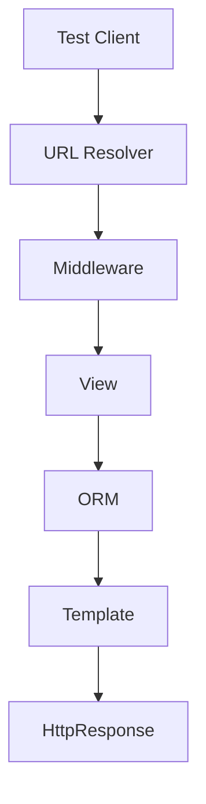

## 14.2 Test Redirect Behavior

```python
def test_checkout_requires_login(self):
    response = self.client.get(
        reverse("orders:checkout")
    )

    self.assertEqual(response.status_code, 302)
```

## 14.3 Test JSON Response

```python
def test_health_endpoint(self):
    response = self.client.get("/health/")

    self.assertEqual(response.status_code, 200)
    self.assertEqual(
        response.json(),
        {"status": "healthy"},
    )
```

## 14.4 Test Query Count

```python
def test_product_list_query_count(self):
    Product.objects.bulk_create(
        [
            Product(name="Keyboard", price="79.99"),
            Product(name="Mouse", price="29.99"),
        ]
    )

    with self.assertNumQueries(1):
        response = self.client.get(
            reverse("products:list")
        )

        self.assertEqual(response.status_code, 200)
```

Query-count tests help detect performance regressions in the request cycle.

---

# 15. Key Takeaways

Each layer owns one responsibility:

| Layer | Responsibility |
| --- | --- |
| Model | Data and domain behavior |
| Template | Presentation |
| View | Request coordination and response creation |
| Django | Framework-level controller responsibilities |

The full cycle, in order:

```text
1. Client sends an HTTP request.
2. WSGI or ASGI server passes it to Django.
3. Django creates an HttpRequest.
4. Request middleware runs.
5. URL resolver finds the first matching route.
6. Django calls the matched view.
7. The view may use models, services, forms, or external APIs.
8. The view returns an HttpResponse.
9. Response middleware runs in reverse order.
10. The server sends the final response to the client.
```

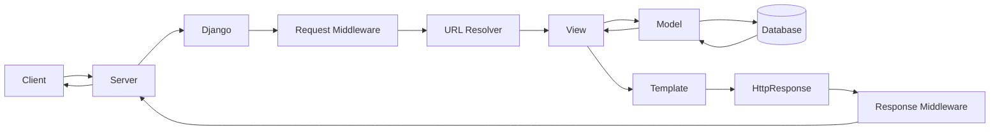

> The most important point is that the **view coordinates the request**, while the **model handles data** and the **template handles presentation**. Middleware and URL resolution surround this core MTV flow.

---

## Official References

This guide is aligned with the Django 6.0 documentation available in July 2026.

- Django at a glance: https://docs.djangoproject.com/en/6.0/intro/overview/
- URL dispatcher: https://docs.djangoproject.com/en/6.0/topics/http/urls/
- Middleware: https://docs.djangoproject.com/en/6.0/topics/http/middleware/
- Request and response objects: https://docs.djangoproject.com/en/6.0/ref/request-response/
- Writing views: https://docs.djangoproject.com/en/6.0/topics/http/views/
- Templates: https://docs.djangoproject.com/en/6.0/topics/templates/
- Asynchronous support: https://docs.djangoproject.com/en/6.0/topics/async/
