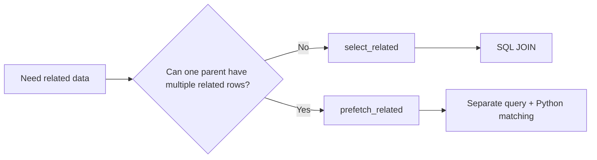
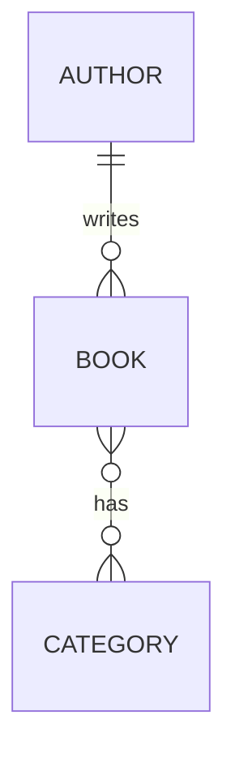

# N+1 Queries: `select_related()` vs `prefetch_related()`

> The **N+1 query problem** happens when Django runs one query to load a collection and then executes another query for each object when related data is accessed.

The main rule is simple:

- Use `select_related()` for **single-valued relationships** such as `ForeignKey` and `OneToOneField`.
- Use `prefetch_related()` for **multi-valued relationships** such as `ManyToManyField` and reverse `ForeignKey`.



---

# 1. Why N+1 Queries Matter

Django makes related-object access look like normal Python:

```python
books = Book.objects.all()

for book in books:
    print(book.title, book.author.name)
```

The code looks harmless, but `book.author` can trigger a database query for every book.

For 100 books:

```text
1 query  -> load books
100      -> load each book's author
-------------------------------
101 queries
```

This becomes expensive because every query adds database round trips, connection usage, parsing, data transfer, and ORM object creation.

N+1 problems commonly appear in:

- loops
- Django templates
- DRF nested serializers
- `SerializerMethodField`
- model properties
- background jobs

---

# 2. Example Models

We will use one small example throughout the topic.

```python
from django.db import models


class Author(models.Model):
    name = models.CharField(max_length=150)


class Category(models.Model):
    name = models.CharField(max_length=100)


class Book(models.Model):
    title = models.CharField(max_length=200)
    author = models.ForeignKey(
        Author,
        related_name="books",
        on_delete=models.CASCADE,
    )
    categories = models.ManyToManyField(
        Category,
        related_name="books",
    )
```



Relationship choice:

| Access | Relationship | Preferred method |
|---|---|---|
| `book.author` | Forward `ForeignKey` | `select_related()` |
| `author.books.all()` | Reverse `ForeignKey` | `prefetch_related()` |
| `book.categories.all()` | `ManyToManyField` | `prefetch_related()` |

---

# 3. `select_related()`

`select_related()` fetches the main object and related single-valued objects in the **same SQL query using JOINs**.

## Basic example

```python
books = Book.objects.select_related("author")

for book in books:
    print(book.title, book.author.name)
```

Conceptually, Django performs something similar to:

```sql
SELECT book.*, author.*
FROM book
JOIN author ON book.author_id = author.id;
```

Now accessing `book.author` does not cause another query.

## Multiple levels

Related paths can be followed using double underscores:

```python
Book.objects.select_related("author__profile")
```

Use `select_related()` when each row points to **one related object**.

Typical relationships:

- `ForeignKey`
- `OneToOneField`
- reverse `OneToOneField`

Avoid calling `select_related()` without arguments in normal application code unless you intentionally want Django to follow all eligible non-null foreign keys. Explicit paths are easier to understand and usually avoid unnecessary joins.

---

# 4. `prefetch_related()`

`prefetch_related()` performs **separate queries** and combines related objects in Python.

It is designed for relationships where one object can have multiple related rows.

## Many-to-many example

Without prefetching:

```python
books = Book.objects.all()

for book in books:
    for category in book.categories.all():
        print(category.name)
```

For `N` books, this can become approximately `N + 1` queries.

Optimized:

```python
books = Book.objects.prefetch_related("categories")

for book in books:
    for category in book.categories.all():
        print(category.name)
```

Typical query flow:

```text
Query 1 -> Load books
Query 2 -> Load categories for all selected books
```

Django then matches categories to books in Python.

## Reverse ForeignKey

The same rule applies to `author.books.all()`:

```python
authors = Author.objects.prefetch_related("books")
```

Because one author can have many books, `prefetch_related()` is the correct default choice.

---

# 5. `select_related()` vs `prefetch_related()`

| Point | `select_related()` | `prefetch_related()` |
|---|---|---|
| Technique | SQL `JOIN` | Separate queries + Python matching |
| Best for | Single-valued relations | Multi-valued relations |
| `ForeignKey` | Yes | Possible, but usually unnecessary |
| `OneToOneField` | Yes | Possible |
| Reverse `ForeignKey` | No | Yes |
| `ManyToManyField` | No | Yes |
| Typical query count | One joined query | Main query + batched related query(s) |
| Main trade-off | Wider/more complex joins | More Python memory and extra result sets |

### Mental model

```text
One related object   -> select_related()
Collection of objects -> prefetch_related()
```

---

# 6. Using Both Together

Real APIs often need both types of relationships.

Suppose a book API returns:

- book fields
- author details
- categories

Use both strategies together:

```python
books = (
    Book.objects
    .select_related("author")
    .prefetch_related("categories")
)
```

Expected database work:

```text
Query 1 -> Books + authors using JOIN
Query 2 -> Categories for all books
```

The important point is that the query count stays roughly constant instead of growing with every book.

---

# 7. Filtered Prefetch with `Prefetch`

A common mistake is prefetching a relation and then filtering it inside a loop.

```python
books = Book.objects.prefetch_related("categories")

for book in books:
    django_categories = book.categories.filter(name__startswith="D")
```

The normal prefetch prepares `book.categories.all()`. Calling `.filter()` creates a different query, so Django cannot reuse that prefetched result.

Use `Prefetch` when the related collection needs filtering or ordering:

```python
from django.db.models import Prefetch

books = Book.objects.prefetch_related(
    Prefetch(
        "categories",
        queryset=Category.objects.filter(name__startswith="D"),
        to_attr="django_categories",
    )
)

for book in books:
    for category in book.django_categories:
        print(category.name)
```

`to_attr` stores the prefetched result as a normal Python list under an explicit attribute name.

`Prefetch` is especially useful when you need:

- filtered related rows
- custom ordering
- a custom related QuerySet
- `select_related()` inside the prefetched child QuerySet
- the same relation loaded in different forms

---

# 8. N+1 in Django REST Framework

Nested serializers often expose N+1 problems because related fields are read for every object.

```python
class BookViewSet(ReadOnlyModelViewSet):
    serializer_class = BookSerializer

    def get_queryset(self):
        return (
            Book.objects
            .select_related("author")
            .prefetch_related("categories")
        )
```

The loading strategy should normally live at the **query/data-loading boundary** such as:

- `get_queryset()`
- a service-layer query function
- a custom QuerySet or manager method

This keeps serializers focused on representation instead of database optimization.

## Counts are different

Do not prefetch a whole collection only to calculate its size.

Instead of repeatedly doing:

```python
book.categories.count()
```

for many books, calculate the value in the main QuerySet when appropriate:

```python
from django.db.models import Count

books = Book.objects.annotate(
    category_count=Count("categories")
)
```

The same idea applies to existence checks: use database expressions such as `Exists()` when you only need a boolean answer rather than the related objects themselves.

---

# 9. Detecting N+1 Queries

Optimization should be measured, not guessed.

## Query-count tests

Django provides `assertNumQueries()`:

```python
with self.assertNumQueries(2):
    books = list(
        Book.objects
        .select_related("author")
        .prefetch_related("categories")
    )

    for book in books:
        _ = book.author.name
        list(book.categories.all())
```

This is useful as a regression test when serializers or templates change later.

## Development tools

Useful options include:

- `connection.queries` while debugging
- Django Debug Toolbar
- `QuerySet.explain()` for understanding the execution plan of an individual SQL query

Remember that `explain()` analyzes a SQL statement; it does not by itself reveal that Python is executing that statement repeatedly in a loop.

---

# 10. Performance Trade-offs

Eager loading is an optimization, but loading everything is not automatically better.

## Too much `select_related()`

Large join chains can create:

- wide result rows
- unnecessary joins
- more database work
- harder-to-read SQL

## Too much `prefetch_related()`

Large prefetch graphs can create:

- high application memory usage
- large SQL `IN (...)` clauses
- unnecessary Python-side object matching
- data that the endpoint never uses

For large QuerySets, pagination and filtered prefetches are often more important than simply adding more eager-loading paths.

When using `iterator()` together with `prefetch_related()`, provide a `chunk_size` so Django can apply the prefetch while iterating:

```python
queryset = Book.objects.prefetch_related("categories")

for book in queryset.iterator(chunk_size=500):
    ...
```

---

# 11. Practical Best Practices

1. **Inspect what the code actually reads.** Optimize relationships used by the serializer, template, or service—not every relation on the model.
2. **Use `select_related()` for to-one relations.** Think `ForeignKey` and `OneToOneField`.
3. **Use `prefetch_related()` for collections.** Think many-to-many and reverse foreign keys.
4. **Use both when needed.** They solve different parts of the object graph.
5. **Use `Prefetch` for filtered or customized collections.** Prefer `to_attr` when the prefetched result has special meaning.
6. **Use annotations for counts and calculations.** Do not load full collections only to measure them.
7. **Keep loading logic near the QuerySet.** In DRF, `get_queryset()` is usually the right place.
8. **Measure query counts.** Add `assertNumQueries()` around important API paths when query count is performance-sensitive.
9. **Avoid unused eager loading.** Fewer queries are useful only when the loaded data is actually needed.
10. **Profile before and after.** Consider response time, database load, memory use, and returned data size—not query count alone.

---

# 12. What to Remember for Interviews

The key idea is not memorizing two ORM methods; it is understanding **relationship cardinality and database round trips**.

```text
N+1
= one collection query
+ one related query per object

ForeignKey / OneToOne
-> select_related()
-> SQL JOIN

ManyToMany / reverse ForeignKey
-> prefetch_related()
-> separate batched query + Python matching
```

For practical Django and DRF work, always match eager loading to the fields the application actually reads, then verify the result with query-count measurements.
