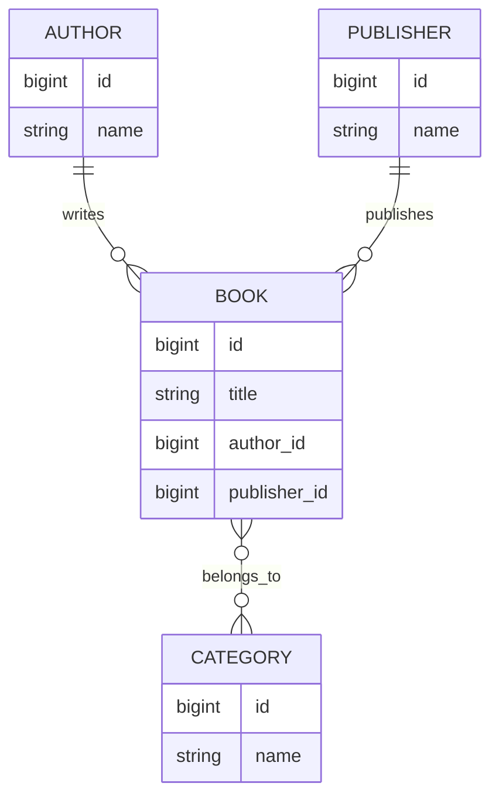
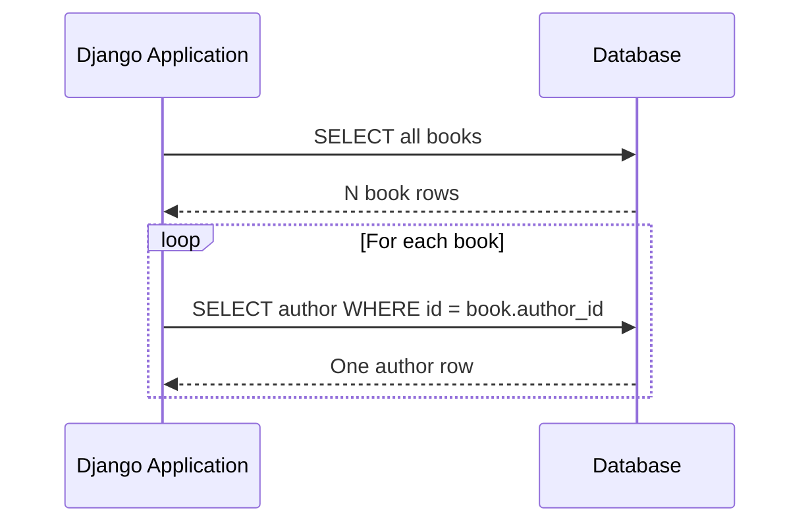
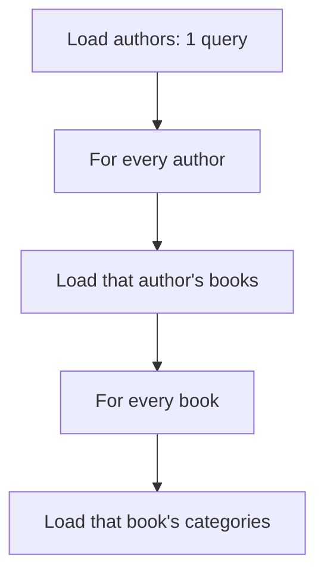
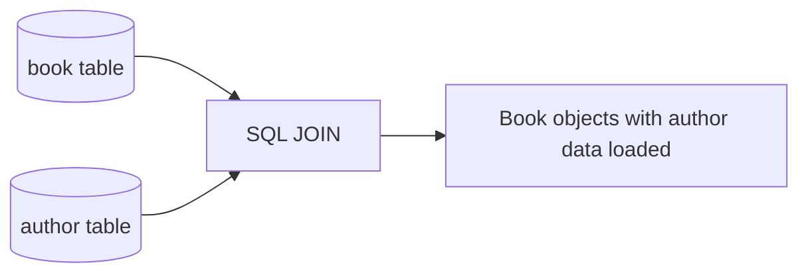
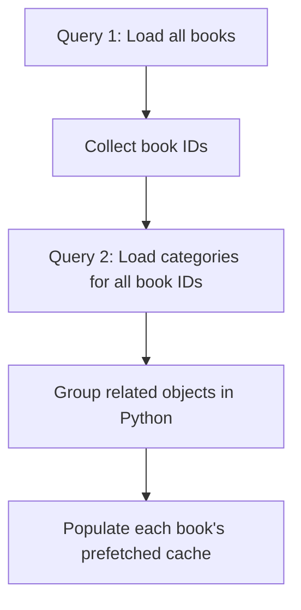
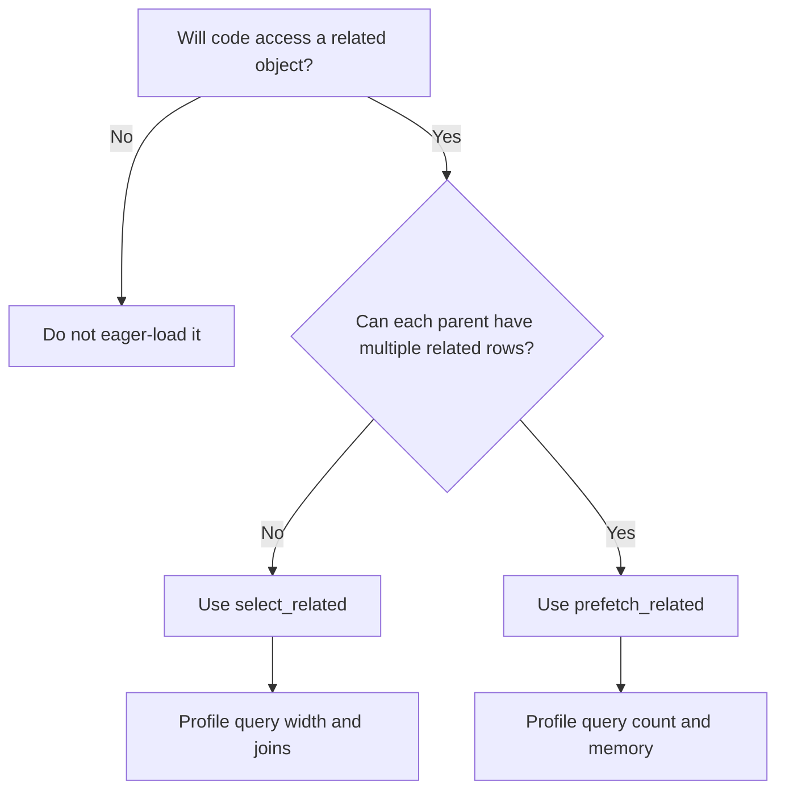
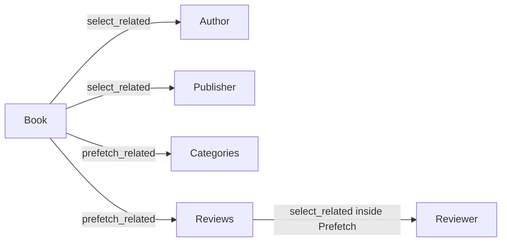
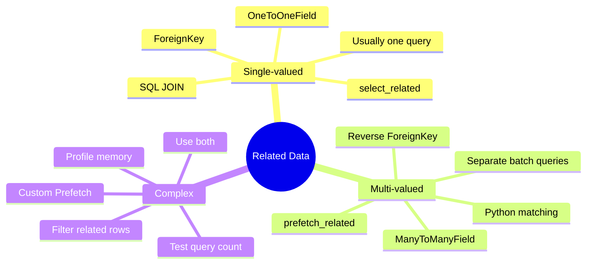

# N+1 Queries: `select_related()` vs `prefetch_related()`

> **Core idea:** An N+1 problem happens when Django runs one query to fetch a collection and then runs an additional query for every object in that collection. Use `select_related()` for **single-valued relationships** and `prefetch_related()` for **multi-valued relationships**.

---

## Index

1. [Why This Topic Matters](#1-why-this-topic-matters)
2. [Example Models](#2-example-models)
3. [What Is the N+1 Query Problem?](#3-what-is-the-n1-query-problem)
4. [`select_related()`](#4-select_related)
5. [`prefetch_related()`](#5-prefetch_related)
6. [`select_related()` vs `prefetch_related()`](#6-select_related-vs-prefetch_related)
7. [Using Both Together](#7-using-both-together)
8. [Advanced Prefetching with `Prefetch`](#8-advanced-prefetching-with-prefetch)
9. [N+1 Queries in Django REST Framework](#9-n1-queries-in-django-rest-framework)
10. [How to Detect and Measure N+1 Queries](#10-how-to-detect-and-measure-n1-queries)
11. [Performance Trade-offs](#11-performance-trade-offs)
12. [Practical Decision Guide](#12-practical-decision-guide)
13. [Best Practices](#13-best-practices)
14. [Final Mental Model](#14-final-mental-model)
15. [Official References](#15-official-references)

---

# 1. Why This Topic Matters

Django makes related-object access look like normal Python attribute access:

```python
book.author.name
```

However, accessing `book.author` may execute a database query.

This is convenient, but it can hide serious performance problems inside:

- loops
- templates
- serializers
- model properties
- API response construction
- background jobs

A page that appears to perform one ORM query may actually execute hundreds of SQL queries.

```text
Small dataset:
10 books  -> 11 queries -> may look acceptable

Production dataset:
1,000 books -> 1,001 queries -> slow response and heavy database load
```

The important lesson is:

> ORM code should be reviewed not only for the objects it returns, but also for the number of database round trips it creates.

---

# 2. Example Models

The following models will be used throughout this guide.

```python
from django.db import models


class Publisher(models.Model):
    name = models.CharField(max_length=150)


class Author(models.Model):
    name = models.CharField(max_length=150)


class Category(models.Model):
    name = models.CharField(max_length=100)


class Book(models.Model):
    title = models.CharField(max_length=200)

    author = models.ForeignKey(
        Author,
        related_name="books",
        on_delete=models.CASCADE,
    )

    publisher = models.ForeignKey(
        Publisher,
        related_name="books",
        on_delete=models.CASCADE,
    )

    categories = models.ManyToManyField(
        Category,
        related_name="books",
    )
```

## Relationship map



From the `Book` side:

| Access | Relationship type | Cardinality |
|---|---|---|
| `book.author` | Forward `ForeignKey` | One object |
| `book.publisher` | Forward `ForeignKey` | One object |
| `book.categories.all()` | `ManyToManyField` | Multiple objects |

From the `Author` side:

| Access | Relationship type | Cardinality |
|---|---|---|
| `author.books.all()` | Reverse `ForeignKey` | Multiple objects |

This distinction determines which optimization method should normally be used.

---

# 3. What Is the N+1 Query Problem?

Suppose we load all books and print the author of every book:

```python
books = Book.objects.all()

for book in books:
    print(book.title, book.author.name)
```

The code looks simple, but the database work is approximately:

```sql
-- Query 1: Fetch all books
SELECT * FROM book;

-- Query 2: Fetch the author of book 1
SELECT * FROM author WHERE id = 4;

-- Query 3: Fetch the author of book 2
SELECT * FROM author WHERE id = 8;

-- Query 4: Fetch the author of book 3
SELECT * FROM author WHERE id = 2;

-- Repeated for every book...
```

For `N` books:

```text
1 query to fetch books
+
N queries to fetch their authors
=
N + 1 queries
```

## Query-flow diagram



The issue is not that each SQL query is necessarily slow. The issue is the repeated database round trip.

Database requests involve:

- network latency
- query parsing
- connection usage
- database CPU
- row transfer
- ORM object construction

Even small queries become expensive when repeated many times.

---

## 3.1 The 2N+1 Variation

The problem can grow when more than one related object is accessed.

```python
books = Book.objects.all()

for book in books:
    print(
        book.title,
        book.author.name,
        book.publisher.name,
    )
```

Approximate query count:

```text
1 query for books
N queries for authors
N queries for publishers
-------------------------
2N + 1 queries
```

For 100 books, this may execute 201 queries.

---

## 3.2 Nested N+1 Queries

Nested relationships can make the problem even larger.

```python
authors = Author.objects.all()

for author in authors:
    for book in author.books.all():
        for category in book.categories.all():
            print(author.name, book.title, category.name)
```

This can produce:

1. one query for authors
2. one query per author for books
3. one query per book for categories

The final query count depends on both the number of authors and the number of books.



This is why nested serializer and template code must be inspected carefully.

---

# 4. `select_related()`

`select_related()` follows related objects by using SQL joins and includes their columns in the original query.

It is normally used for:

- `ForeignKey`
- `OneToOneField`
- reverse `OneToOneField`

It is designed for relationships where each parent row points to at most one related row.

---

## 4.1 Basic Usage

```python
books = Book.objects.select_related("author")

for book in books:
    print(book.title, book.author.name)
```

Approximate query count:

```text
1 query for books and authors together
```

Conceptual SQL:

```sql
SELECT
    book.id,
    book.title,
    book.author_id,
    author.id,
    author.name
FROM book
INNER JOIN author
    ON book.author_id = author.id;
```

## How it works



Django creates both `Book` and `Author` model objects from the joined result.

Later access does not require a new query:

```python
book.author.name
```

---

## 4.2 Loading Multiple Foreign Keys

```python
books = Book.objects.select_related(
    "author",
    "publisher",
)

for book in books:
    print(
        book.title,
        book.author.name,
        book.publisher.name,
    )
```

This generally remains one database query, with joins to both related tables.

```text
Before:
1 + N + N = 2N + 1 queries

After:
1 joined query
```

---

## 4.3 Following Multiple Levels

Suppose an author belongs to a country:

```python
class Country(models.Model):
    name = models.CharField(max_length=100)


class Author(models.Model):
    name = models.CharField(max_length=150)
    country = models.ForeignKey(
        Country,
        on_delete=models.CASCADE,
    )
```

You can follow the relationship path with double underscores:

```python
books = Book.objects.select_related(
    "author__country",
)
```

Now both accesses are already loaded:

```python
for book in books:
    print(book.author.name)
    print(book.author.country.name)
```

Conceptually:

```text
Book
  └── author
        └── country
```

---

## 4.4 Why `select_related()` Does Not Handle Many-to-Many

Imagine joining books and categories:

```text
Book A -> Python, Django, APIs
Book B -> Django, Databases
```

A SQL join produces repeated book data:

| Book | Category |
|---|---|
| Book A | Python |
| Book A | Django |
| Book A | APIs |
| Book B | Django |
| Book B | Databases |

The more related records a book has, the more duplicate parent data appears in the result.

Django therefore limits `select_related()` to single-valued relationships.

Invalid use:

```python
# categories is a ManyToManyField.
Book.objects.select_related("categories")
```

Use `prefetch_related()` instead:

```python
Book.objects.prefetch_related("categories")
```

---

## 4.5 Important `select_related()` Details

### It returns a new QuerySet

```python
queryset = Book.objects.all()
optimized_queryset = queryset.select_related("author")
```

QuerySets are lazy. No database query is executed until evaluation.

### Chaining order does not matter

These are equivalent:

```python
Book.objects.filter(title__icontains="django").select_related("author")
```

```python
Book.objects.select_related("author").filter(title__icontains="django")
```

### Be explicit about fields

Django allows:

```python
Book.objects.select_related()
```

Without arguments, Django follows all non-null foreign keys it can find.

This is usually not recommended because it may create:

- unnecessary joins
- wider result rows
- more data transfer
- harder-to-understand SQL

Prefer:

```python
Book.objects.select_related("author", "publisher")
```

### Clear previous selections when necessary

```python
queryset = queryset.select_related(None)
```

This removes previously configured `select_related()` paths from the QuerySet.

---

# 5. `prefetch_related()`

`prefetch_related()` executes separate queries and combines the results in Python.

It is normally used for:

- `ManyToManyField`
- reverse `ForeignKey`
- multi-level collection relationships
- `GenericRelation`
- filtered or customized related-object loading

It can also prefetch `ForeignKey` and `OneToOneField`, although `select_related()` is usually more efficient for simple single-valued relationships.

---

## 5.1 Many-to-Many Example

Without prefetching:

```python
books = Book.objects.all()

for book in books:
    print(book.title)

    for category in book.categories.all():
        print(category.name)
```

Approximate query count:

```text
1 query for books
N queries for categories
------------------------
N + 1 queries
```

Optimized code:

```python
books = Book.objects.prefetch_related("categories")

for book in books:
    print(book.title)

    for category in book.categories.all():
        print(category.name)
```

Approximate query count:

```text
1 query for books
1 query for all matching categories
-----------------------------------
2 queries
```

---

## 5.2 How Prefetching Works

Django first loads the parent objects:

```sql
SELECT * FROM book;
```

It then collects their primary keys and loads all related rows in a batch:

```sql
SELECT category.*, book_categories.book_id
FROM category
INNER JOIN book_categories
    ON category.id = book_categories.category_id
WHERE book_categories.book_id IN (1, 2, 3, 4, ...);
```

Django groups the categories by book ID in Python and stores the related results in a prefetched cache.



---

## 5.3 Reverse Foreign Key Example

The reverse relationship from `Author` to `Book` is multi-valued:

```python
author.books.all()
```

Without prefetching:

```python
authors = Author.objects.all()

for author in authors:
    print(author.name)

    for book in author.books.all():
        print(book.title)
```

This creates an N+1 pattern.

Optimized:

```python
authors = Author.objects.prefetch_related("books")

for author in authors:
    for book in author.books.all():
        print(author.name, book.title)
```

Expected query count:

```text
1 query for authors
1 query for all books belonging to those authors
------------------------------------------------
2 queries
```

---

## 5.4 Nested Prefetching

You can traverse multiple relationships:

```python
authors = Author.objects.prefetch_related(
    "books__categories",
)
```

Expected queries:

```text
Query 1: Load authors
Query 2: Load books for those authors
Query 3: Load categories for those books
```

Usage:

```python
for author in authors:
    for book in author.books.all():
        for category in book.categories.all():
            print(author.name, book.title, category.name)
```

The number of queries remains approximately three, even as the number of authors and books grows.

---

## 5.5 Prefetched Cache Behavior

This uses the prefetched result:

```python
books = Book.objects.prefetch_related("categories")

for book in books:
    categories = book.categories.all()
```

This does **not** reuse the same prefetched result:

```python
books = Book.objects.prefetch_related("categories")

for book in books:
    categories = book.categories.filter(name__startswith="D")
```

Why?

`prefetch_related("categories")` prepares the result of:

```python
book.categories.all()
```

A later `.filter()` represents a new database query.

This can make the original prefetch wasted work.

Use a customized `Prefetch` object when a filtered related collection is required.

---

## 5.6 Memory Behavior

Unlike a normal lazy QuerySet, prefetching loads:

- the primary QuerySet result
- all specified related objects

into memory when the QuerySet is evaluated.

This is useful for avoiding database round trips, but it means prefetching a very large dataset may consume significant application memory.

---

# 6. `select_related()` vs `prefetch_related()`

| Point | `select_related()` | `prefetch_related()` |
|---|---|---|
| Main technique | SQL `JOIN` | Separate queries + Python matching |
| Typical query count | One query | One query per prefetch level/relation |
| Best for | Single-valued relations | Multi-valued relations |
| `ForeignKey` | Yes | Yes, but usually not first choice |
| `OneToOneField` | Yes | Yes, but usually not first choice |
| Reverse `ForeignKey` | No | Yes |
| `ManyToManyField` | No | Yes |
| Duplicate parent columns | Possible in joins, but restricted to single-valued paths | Avoided across collection relations |
| Python memory use | Usually lower for related loading | Can be higher because related collections are cached |
| Custom related QuerySet | No | Yes, with `Prefetch` |
| Filtering prefetched data | Not applicable in the same way | Requires careful custom prefetching |
| Best mental model | “Join this one object” | “Batch-load this collection” |

---

## 6.1 Relationship-Based Decision Table

| Relationship being accessed | Recommended method |
|---|---|
| `book.author` | `select_related("author")` |
| `book.publisher` | `select_related("publisher")` |
| `profile.user` with `OneToOneField` | `select_related("user")` |
| `author.books.all()` | `prefetch_related("books")` |
| `book.categories.all()` | `prefetch_related("categories")` |
| `restaurant.pizzas.all()` | `prefetch_related("pizzas")` |
| `order.customer.address` | `select_related("customer__address")` |
| `author.books -> categories` | `prefetch_related("books__categories")` |

---

## 6.2 One-Line Selection Rule

```text
ForeignKey / OneToOne
        ↓
select_related()

ManyToMany / reverse ForeignKey
        ↓
prefetch_related()
```

A slightly more complete rule:



---

# 7. Using Both Together

Real applications often need both single-valued and multi-valued relationships.

Example:

```python
class Review(models.Model):
    book = models.ForeignKey(
        Book,
        related_name="reviews",
        on_delete=models.CASCADE,
    )
    reviewer = models.ForeignKey(
        "auth.User",
        on_delete=models.CASCADE,
    )
    rating = models.PositiveSmallIntegerField()
```

Suppose the response needs:

- each book
- the book's author
- the book's publisher
- all reviews
- the reviewer of each review

Use:

```python
books = (
    Book.objects
    .select_related(
        "author",
        "publisher",
    )
    .prefetch_related(
        "categories",
        "reviews__reviewer",
    )
)
```

Possible query flow:

```text
Query 1:
Books + authors + publishers using SQL joins

Query 2:
Categories for all books

Query 3:
Reviews for all books

Query 4:
Reviewers for all reviews
```

This is already much better than performing queries inside every loop.

However, because each review has exactly one reviewer, the review prefetch can be customized further.

```python
from django.db.models import Prefetch


books = (
    Book.objects
    .select_related(
        "author",
        "publisher",
    )
    .prefetch_related(
        "categories",
        Prefetch(
            "reviews",
            queryset=Review.objects.select_related("reviewer"),
        ),
    )
)
```

Possible query count:

```text
Query 1: Books + authors + publishers
Query 2: Categories
Query 3: Reviews + reviewers
```

This combines the two strategies at the correct levels.

---

## 7.1 Combined Relationship Diagram



---

# 8. Advanced Prefetching with `Prefetch`

Import the `Prefetch` class:

```python
from django.db.models import Prefetch
```

Use it when the default related QuerySet is not sufficient.

Common use cases include:

- filtering related objects
- changing their order
- applying `select_related()` inside the prefetch
- loading only required fields
- storing results on a custom attribute
- prefetching the same relation in different forms

---

## 8.1 Filter Related Objects

Suppose only approved reviews should be loaded:

```python
approved_reviews = (
    Review.objects
    .filter(is_approved=True)
    .select_related("reviewer")
)
```

```python
books = Book.objects.prefetch_related(
    Prefetch(
        "reviews",
        queryset=approved_reviews,
        to_attr="approved_reviews",
    )
)
```

Usage:

```python
for book in books:
    for review in book.approved_reviews:
        print(review.rating, review.reviewer.username)
```

`to_attr` stores the result as a list on each `Book` object.

```text
book.reviews             -> normal related manager
book.approved_reviews    -> prefetched filtered list
```

---

## 8.2 Why `to_attr` Is Useful

Without `to_attr`, putting filtered results into the related manager's cache can make the meaning of `book.reviews.all()` less obvious.

With `to_attr`, the intent is explicit:

```python
book.approved_reviews
```

It also avoids accidentally running another query through the related manager.

Recommended:

```python
Prefetch(
    "reviews",
    queryset=Review.objects.filter(is_approved=True),
    to_attr="approved_reviews",
)
```

---

## 8.3 Order Related Objects

```python
books = Book.objects.prefetch_related(
    Prefetch(
        "reviews",
        queryset=Review.objects.order_by("-created_at"),
        to_attr="ordered_reviews",
    )
)
```

---

## 8.4 Load the Same Relation in Two Forms

```python
books = Book.objects.prefetch_related(
    Prefetch(
        "reviews",
        queryset=Review.objects.all(),
        to_attr="all_reviews",
    ),
    Prefetch(
        "reviews",
        queryset=Review.objects.filter(rating=5),
        to_attr="five_star_reviews",
    ),
)
```

Usage:

```python
for book in books:
    print(len(book.all_reviews))
    print(len(book.five_star_reviews))
```

---

## 8.5 Ordering of Prefetch Lookups

For advanced prefetch paths, argument order can matter.

Clear and safe structure:

```python
books = Book.objects.prefetch_related(
    Prefetch(
        "reviews",
        queryset=Review.objects.select_related("reviewer"),
        to_attr="loaded_reviews",
    ),
    "loaded_reviews__comments",
)
```

The custom attribute must exist before Django traverses through it.

Keep prefetch declarations:

- explicit
- logically ordered
- easy to review
- covered by query-count tests

---

# 9. N+1 Queries in Django REST Framework

N+1 problems frequently appear in serializers because serializers access related fields for every instance.

---

## 9.1 Nested Serializer Example

```python
from rest_framework import serializers


class AuthorSerializer(serializers.ModelSerializer):
    class Meta:
        model = Author
        fields = ["id", "name"]


class CategorySerializer(serializers.ModelSerializer):
    class Meta:
        model = Category
        fields = ["id", "name"]


class BookSerializer(serializers.ModelSerializer):
    author = AuthorSerializer()
    categories = CategorySerializer(many=True)

    class Meta:
        model = Book
        fields = [
            "id",
            "title",
            "author",
            "categories",
        ]
```

A non-optimized ViewSet:

```python
from rest_framework.viewsets import ReadOnlyModelViewSet


class BookViewSet(ReadOnlyModelViewSet):
    queryset = Book.objects.all()
    serializer_class = BookSerializer
```

Potential behavior:

```text
1 query for books
N queries for authors
N queries for categories
```

Optimized ViewSet:

```python
class BookViewSet(ReadOnlyModelViewSet):
    serializer_class = BookSerializer

    def get_queryset(self):
        return (
            Book.objects
            .select_related("author")
            .prefetch_related("categories")
        )
```

---

## 9.2 `SerializerMethodField` Can Hide Queries

```python
class BookSerializer(serializers.ModelSerializer):
    review_count = serializers.SerializerMethodField()

    def get_review_count(self, book):
        return book.reviews.count()
```

For a list of books, this may execute one count query per book.

For counts, aggregation is often a better solution:

```python
from django.db.models import Count


queryset = Book.objects.annotate(
    review_count=Count("reviews"),
)
```

Serializer:

```python
class BookSerializer(serializers.ModelSerializer):
    review_count = serializers.IntegerField(read_only=True)

    class Meta:
        model = Book
        fields = [
            "id",
            "title",
            "review_count",
        ]
```

The broader lesson is:

> Do not assume every related-data problem should be solved with eager loading. Counts, sums, and existence checks may be better expressed using annotations, aggregates, or `Exists`.

---

## 9.3 Optimize According to the Serializer

The view should understand which relationships the serializer will access.

```python
def get_queryset(self):
    queryset = Book.objects.all()

    if self.action == "list":
        return (
            queryset
            .select_related("author", "publisher")
            .prefetch_related("categories")
        )

    if self.action == "retrieve":
        return (
            queryset
            .select_related("author", "publisher")
            .prefetch_related(
                "categories",
                Prefetch(
                    "reviews",
                    queryset=Review.objects.select_related("reviewer"),
                ),
            )
        )

    return queryset
```

List and detail endpoints do not always need the same related data.

---

# 10. How to Detect and Measure N+1 Queries

Optimization should be based on measured behavior.

---

## 10.1 Inspect `connection.queries`

During development, with `DEBUG=True`:

```python
from django.db import connection
from django.db import reset_queries


reset_queries()

books = Book.objects.all()

for book in books:
    print(book.author.name)

print("Query count:", len(connection.queries))
```

To inspect SQL:

```python
for query in connection.queries:
    print(query["sql"])
    print(query["time"])
```

Important:

- `connection.queries` is intended for debugging.
- It is available when Django's debug query recording is enabled.
- Do not build production monitoring around `DEBUG=True`.

---

## 10.2 Protect Query Counts with Tests

Django provides `assertNumQueries()`.

```python
from django.test import TestCase


class BookQueryTests(TestCase):
    def test_book_list_loads_authors_in_one_query(self):
        with self.assertNumQueries(1):
            books = list(
                Book.objects
                .select_related("author")
            )

            for book in books:
                _ = book.author.name
```

For books and categories:

```python
class BookQueryTests(TestCase):
    def test_book_list_prefetches_categories(self):
        with self.assertNumQueries(2):
            books = list(
                Book.objects
                .prefetch_related("categories")
            )

            for book in books:
                list(book.categories.all())
```

Query-count tests are valuable because N+1 problems often return after:

- serializer changes
- template changes
- new model properties
- nested response additions
- queryset refactoring

---

## 10.3 Use Django Debug Toolbar

In local development, Django Debug Toolbar can show:

- query count
- duplicated queries
- SQL statements
- query duration
- stack traces for queries

A repeated SQL pattern with different primary-key values is a strong sign of N+1 behavior.

Example pattern:

```sql
SELECT ... FROM author WHERE id = 1;
SELECT ... FROM author WHERE id = 2;
SELECT ... FROM author WHERE id = 3;
SELECT ... FROM author WHERE id = 4;
```

---

## 10.4 Use `QuerySet.explain()`

```python
queryset = Book.objects.select_related("author")

print(queryset.explain())
```

`explain()` helps inspect how the database executes a single SQL query, including joins and indexes.

It is useful for understanding query plans, but remember:

> An N+1 issue is often caused by Python repeatedly executing queries. Inspecting one query plan alone will not reveal the total number of ORM calls.

Use both:

- query-count measurement
- SQL execution-plan analysis

---

## 10.5 Check Templates and Properties

Templates may hide method calls:

```django

    {{ author.name }}

    
        {{ book.title }}
    

```

Without:

```python
Author.objects.prefetch_related("books")
```

this can create an N+1 problem.

Also inspect model properties:

```python
class Author(models.Model):
    @property
    def latest_book(self):
        return self.books.order_by("-published_at").first()
```

Calling this property for every author can execute one query per author.

The query is hidden behind normal-looking attribute access:

```python
author.latest_book
```

---

# 11. Performance Trade-offs

Reducing query count is important, but fewer queries do not automatically mean better performance.

---

## 11.1 Large SQL Joins

Overusing `select_related()` can create a query that:

- joins many tables
- returns wide rows
- transfers unused columns
- requires more database work
- becomes difficult to optimize

Example:

```python
Book.objects.select_related(
    "author__country__region",
    "publisher__owner__profile",
)
```

This may be correct, but it should be driven by actual access needs.

---

## 11.2 Large Prefetch Result Sets

Overusing `prefetch_related()` can:

- load many objects into memory
- generate large SQL `IN (...)` clauses
- spend CPU matching results in Python
- fetch data that is never used

Example:

```python
Author.objects.prefetch_related(
    "books__reviews__comments__reactions",
)
```

This may load a very large object graph.

Use pagination, filtering, and endpoint-specific loading.

---

## 11.3 Separate-Query Consistency Window

`prefetch_related()` runs the primary query first and related queries afterward.

Data can theoretically change between those queries.

For most standard read endpoints, this is acceptable. For strict consistency requirements, transaction design and database isolation may also need consideration.

---

## 11.4 `iterator()` and Prefetching

When using `iterator()`, Django observes `prefetch_related()` only when a `chunk_size` is provided.

```python
queryset = Book.objects.prefetch_related("categories")

for book in queryset.iterator(chunk_size=500):
    ...
```

This is useful for processing large QuerySets in batches, but the chunk size should be selected based on:

- memory limits
- database parameter limits
- prefetch size
- workload characteristics

---

## 11.5 Access Pattern Matters More Than Model Shape

A model may have many relationships, but an endpoint may use only two of them.

Avoid automatically loading every relation.

```text
Model has:
author, publisher, categories, reviews, inventory, editions

List endpoint uses:
title, author

Correct optimization:
select_related("author")
```

Optimization should follow the actual execution path, not the complete model graph.

---

# 12. Practical Decision Guide

Use the following process while reviewing a QuerySet.

---

## Step 1: Identify related access

Look inside:

- loops
- serializers
- templates
- properties
- service functions

Example:

```python
for book in books:
    print(book.author.name)
    print(list(book.categories.all()))
```

Relations used:

```text
author      -> one object
categories  -> collection
```

---

## Step 2: Classify each relationship

```text
author:
Book has ForeignKey to Author
Single-valued
Use select_related()

categories:
Book has ManyToManyField to Category
Multi-valued
Use prefetch_related()
```

---

## Step 3: Build the optimized QuerySet

```python
books = (
    Book.objects
    .select_related("author")
    .prefetch_related("categories")
)
```

---

## Step 4: Evaluate the real code path

Do not measure only this:

```python
list(books)
```

Also execute the accesses that matter:

```python
for book in books:
    _ = book.author.name
    list(book.categories.all())
```

Lazy related access may happen after the main QuerySet is evaluated.

---

## Step 5: Verify query count

```python
with self.assertNumQueries(2):
    books = list(
        Book.objects
        .select_related("author")
        .prefetch_related("categories")
    )

    for book in books:
        _ = book.author.name
        list(book.categories.all())
```

---

## Step 6: Check memory and response size

A QuerySet with fewer queries may still load too much data.

Ask:

- Is the endpoint paginated?
- Are all prefetched rows needed?
- Can the related QuerySet be filtered?
- Would aggregation be more appropriate?
- Is this a list endpoint or detail endpoint?

---

# 13. Best Practices

## 13.1 Optimize at the Data-Loading Boundary

Place related-object loading where the application decides what data is needed:

- ViewSet `get_queryset()`
- service-layer query function
- custom QuerySet method
- manager method

Example:

```python
class BookQuerySet(models.QuerySet):
    def for_list_api(self):
        return (
            self
            .select_related("author", "publisher")
            .prefetch_related("categories")
        )


class Book(models.Model):
    # Fields...

    objects = BookQuerySet.as_manager()
```

Usage:

```python
books = Book.objects.for_list_api()
```

A named QuerySet method communicates the intended loading contract.

---

## 13.2 Keep QuerySets Close to Their Use Case

Avoid one global QuerySet that eagerly loads everything.

Prefer:

```python
Book.objects.for_list_api()
Book.objects.for_detail_api()
Book.objects.for_export()
```

Different use cases have different performance needs.

---

## 13.3 Use `Prefetch` for Filtered Collections

Avoid:

```python
books = Book.objects.prefetch_related("reviews")

for book in books:
    approved = book.reviews.filter(is_approved=True)
```

Prefer:

```python
books = Book.objects.prefetch_related(
    Prefetch(
        "reviews",
        queryset=Review.objects.filter(is_approved=True),
        to_attr="approved_reviews",
    )
)
```

---

## 13.4 Combine Strategies at Different Levels

```python
Book.objects.select_related(
    "author",
).prefetch_related(
    Prefetch(
        "reviews",
        queryset=Review.objects.select_related("reviewer"),
    )
)
```

Use joins inside a prefetch QuerySet when the child objects themselves have single-valued relationships.

---

## 13.5 Add Query-Count Regression Tests

Performance expectations should be testable.

```python
with self.assertNumQueries(3):
    response = self.client.get("/api/books/")
```

The exact expected count may include:

- authentication queries
- permissions
- pagination count queries
- application-specific middleware

Measure the complete endpoint before fixing the expected value.

---

## 13.6 Profile Before and After

Compare:

```text
Before:
201 queries
450 ms database time

After:
3 queries
35 ms database time
```

Also check:

- total response time
- application memory
- returned row count
- SQL query plan
- database load under concurrency

---

## 13.7 Avoid Unused Eager Loading

Do not write:

```python
Book.objects.select_related(
    "author",
    "publisher",
).prefetch_related(
    "categories",
    "reviews",
)
```

when the code only uses:

```python
book.title
```

Unnecessary eager loading replaces one kind of waste with another.

---

## 13.8 Remember Pagination Does Not Remove N+1

Pagination reduces `N`, but it does not remove the pattern.

```text
Page size = 20

Without optimization:
1 + 20 = 21 queries per request

With optimization:
1 joined query
or
2 batched queries
```

At high traffic, 21 queries per request is still expensive.

---

# 14. Final Mental Model

Think of the problem as a data-loading plan.



## Quick summary

```text
N+1 problem:
One collection query + one related query per object

select_related():
Use SQL JOIN
Best for ForeignKey and OneToOneField

prefetch_related():
Use separate batch queries and join results in Python
Best for reverse ForeignKey and ManyToManyField

Prefetch():
Customize filtering, ordering, nested optimization, and to_attr

Correct approach:
Inspect access pattern -> choose strategy -> measure queries -> test it
```

## Practical example to remember

```python
books = (
    Book.objects
    .select_related(
        "author",
        "publisher",
    )
    .prefetch_related(
        "categories",
        Prefetch(
            "reviews",
            queryset=Review.objects.select_related("reviewer"),
        ),
    )
)
```

Read it as:

```text
Join each book's one author and one publisher.
Batch-load each book's category and review collections.
While loading reviews, join each review's one reviewer.
```

That sentence captures the real difference between the two methods.

---

# 15. Official References

This guide was verified against the Django 6.0 documentation.

- [Django QuerySet API — `select_related()` and `prefetch_related()`](https://docs.djangoproject.com/en/6.0/ref/models/querysets/)
- [Django Database Access Optimization](https://docs.djangoproject.com/en/6.0/topics/db/optimization/)
- [Django Testing Tools](https://docs.djangoproject.com/en/6.0/topics/testing/tools/)
- [Django Database and Model FAQ — Inspecting SQL Queries](https://docs.djangoproject.com/en/6.0/faq/models/)
- [Django Releases and Supported Versions](https://www.djangoproject.com/download/)

---

> **Version note:** The concepts in this guide are stable across modern Django versions. Always read the documentation matching the Django version installed in your project.
