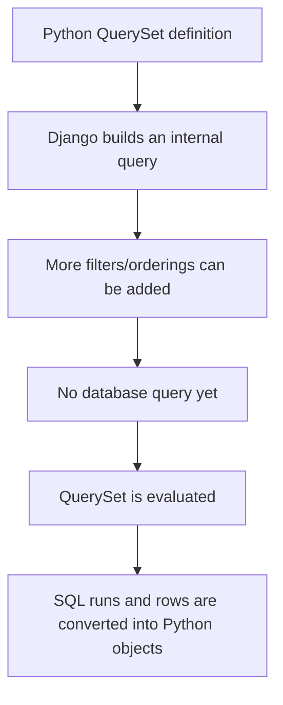
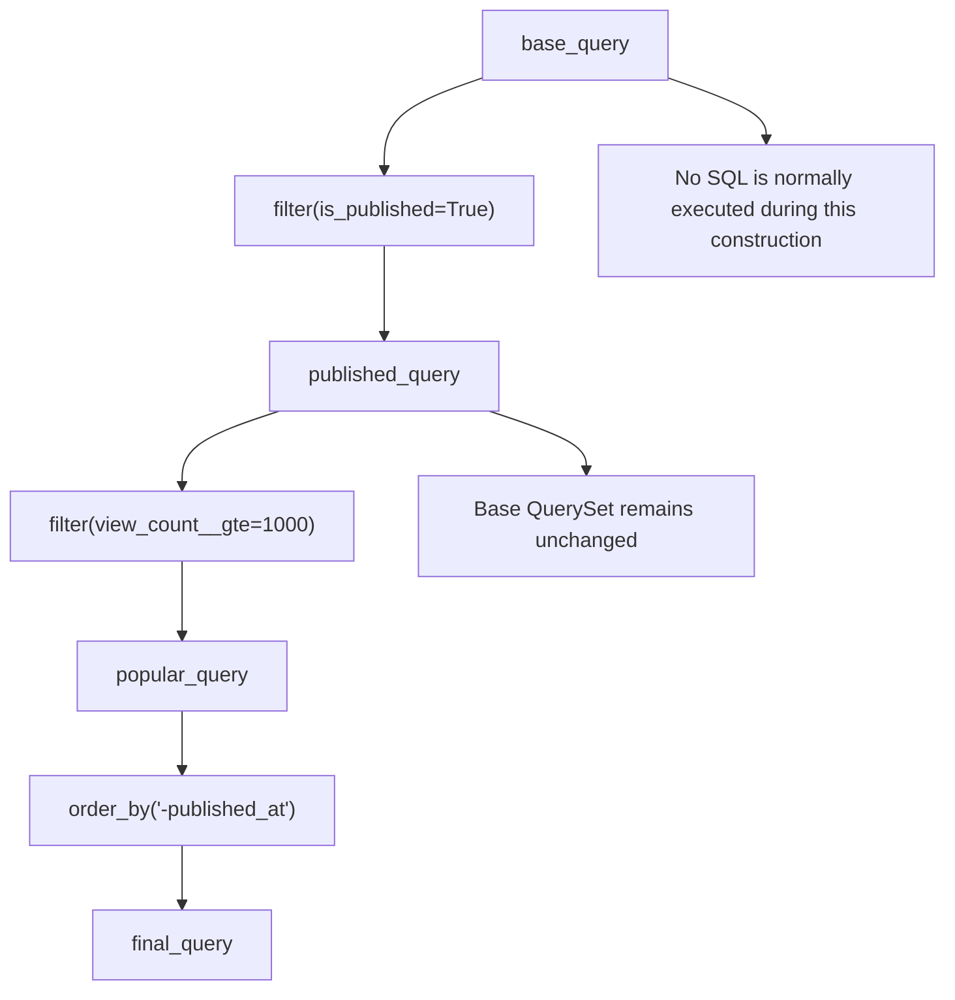
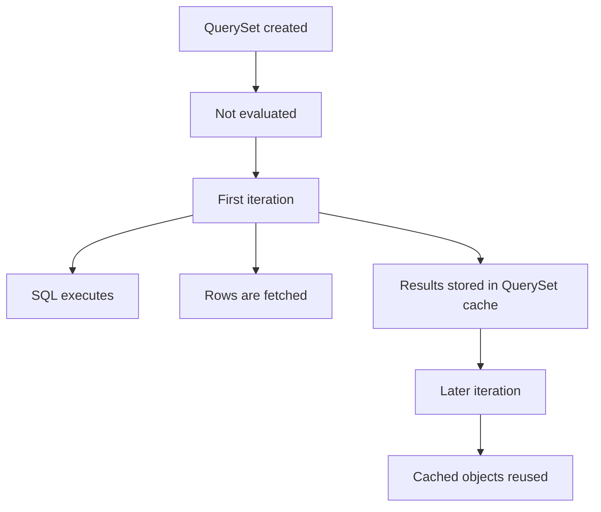
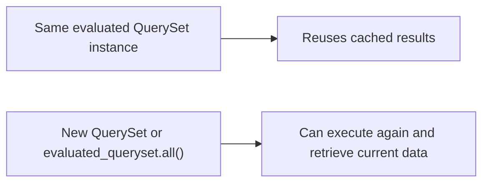
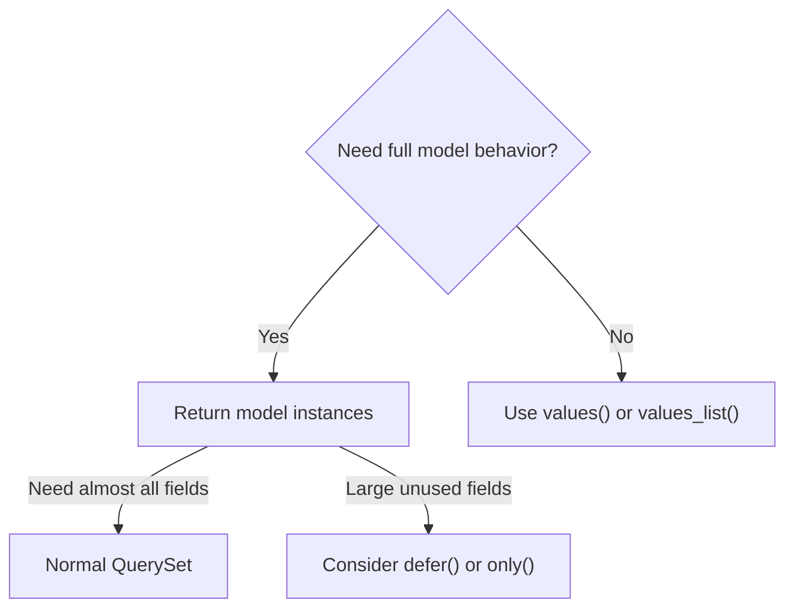
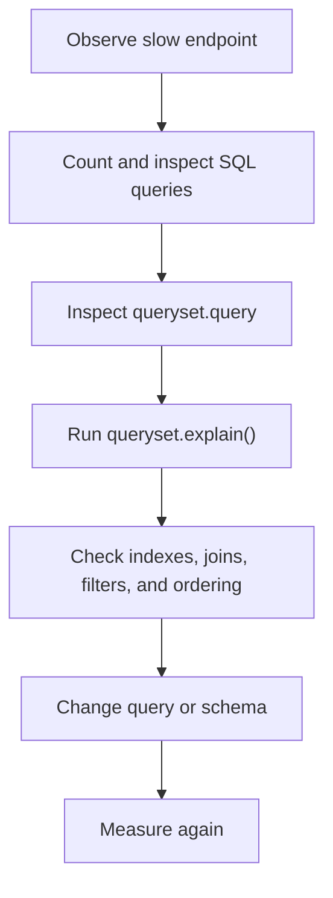
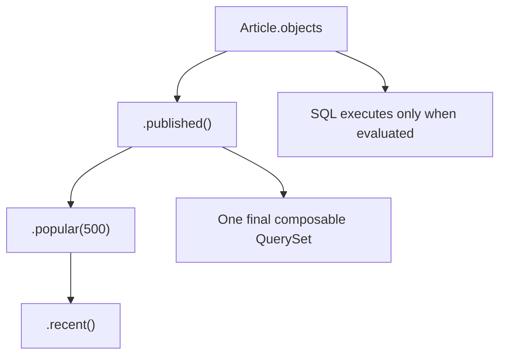
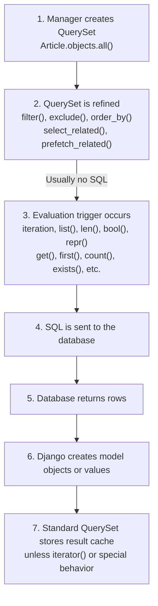

# Django QuerySets & Lazy Evaluation

> A **QuerySet** represents a database query and its potential results.
>
> It is **lazy**, which means Django usually does not execute the SQL query when the QuerySet is created. The database is accessed only when the results are actually needed.

## In short

- A QuerySet is a description of a query: creating one builds the SQL but does not touch the database — the query runs only when the QuerySet is *evaluated*.
- `filter()`, `exclude()`, `order_by()`, `select_related()` and friends each return a **new** QuerySet and issue no query, so a query can be assembled across functions and layers before it ever runs.
- Evaluation triggers: iterating, `list()`, `len()`, `bool()` (including `if qs:`), `repr()` / `print()`, slicing **with a step**, and pickling.
- The first evaluation fills that QuerySet's **result cache**: iterating the *same* QuerySet twice runs one query, while re-creating `Model.objects.filter(...)` twice runs two.
- Slicing without a step (`qs[:10]`, `qs[20:30]`) stays lazy and adds `LIMIT` / `OFFSET`; a single index (`qs[0]`) runs its own limited query and does not fill the parent QuerySet's cache.
- When the rows themselves are not needed, use `exists()` and `count()` instead of `if qs:` and `len(qs)` — they let the database answer without building model objects.
- An evaluated QuerySet never refreshes itself; call `.all()` on it or build a new QuerySet for current data, and use `iterator()` to skip the cache on large one-pass jobs.



**Interview answer:** Lazy means a QuerySet only records what to ask the database: `Article.objects.filter(...)` builds SQL, and every chained `filter()`, `exclude()` or `order_by()` returns a new QuerySet without sending anything. The SQL is sent at the moment something needs the actual rows — iteration, `list()`, `len()`, `bool()`, `repr()`, slicing with a step, or pickling — and the results are then cached on that QuerySet instance, so iterating it again costs nothing while a freshly built QuerySet queries again. Methods such as `exists()`, `count()`, `get()` and `first()` execute their own SQL immediately, and they are what to reach for when the full result set is not needed.

**Gotcha:** `if queryset:` and `len(queryset)` look free but they evaluate the whole QuerySet and construct every model object; use `exists()` and `count()` when the rows are not needed. The mirror mistake is calling `exists()` and then immediately iterating the same QuerySet — that is two queries where one plain evaluation plus the cached iteration would have been one.

---

# 1. Core Idea

Django's ORM lets you work with database records through Python objects.

```python
published_articles = Article.objects.filter(is_published=True)
```

This line usually does **not** immediately execute SQL.

Instead, Django creates a `QuerySet` containing the instructions required to build a query similar to:

```sql
SELECT *
FROM article
WHERE is_published = TRUE;
```

The SQL runs only when the application needs the actual rows.

This behavior is called **lazy evaluation**.

---

# 2. Example Models

The examples in this guide use the following models:

```python
from django.conf import settings
from django.db import models

class Category(models.Model):
    name = models.CharField(max_length=100)

    def __str__(self) -> str:
        return self.name

class Article(models.Model):
    title = models.CharField(max_length=200)
    content = models.TextField()
    is_published = models.BooleanField(default=False)
    view_count = models.PositiveIntegerField(default=0)
    published_at = models.DateTimeField(null=True, blank=True)

    category = models.ForeignKey(
        Category,
        on_delete=models.PROTECT,
        related_name="articles",
    )

    author = models.ForeignKey(
        settings.AUTH_USER_MODEL,
        on_delete=models.CASCADE,
        related_name="articles",
    )

    class Meta:
        ordering = ["-published_at"]

    def __str__(self) -> str:
        return self.title
```

---

# 3. What Is a QuerySet?

A `QuerySet` represents a collection of objects retrieved from the database.

It may represent:

- All records from a table
- Records matching one or more conditions
- Ordered records
- Aggregated or annotated records
- A limited portion of records
- Records joined with related tables

## Basic Examples

```python
# All articles
articles = Article.objects.all()

# Only published articles
published_articles = Article.objects.filter(is_published=True)

# Exclude articles with no views
viewed_articles = Article.objects.exclude(view_count=0)

# Order by view count
popular_articles = Article.objects.order_by("-view_count")
```

A QuerySet is not exactly a Python list.

```python
articles = Article.objects.all()

print(type(articles))
# <class 'django.db.models.query.QuerySet'>
```

A QuerySet behaves like a collection in many situations, but it also contains database-query behavior such as filtering, ordering, joining, and lazy execution.

---

# 4. How QuerySet Chaining Works

Most QuerySet refinement methods return a **new QuerySet**.

```python
base_query = Article.objects.all()

published_query = base_query.filter(is_published=True)

popular_query = published_query.filter(view_count__gte=1000)

final_query = popular_query.order_by("-published_at")
```

The original QuerySets are not modified.



## Practical Benefit

You can create reusable base queries:

```python
published_articles = Article.objects.filter(is_published=True)

recent_articles = published_articles.filter(
    published_at__isnull=False,
).order_by("-published_at")

popular_articles = published_articles.filter(
    view_count__gte=1000,
).order_by("-view_count")
```

`recent_articles` and `popular_articles` are separate QuerySets built from the same base condition.

---

# 5. What Lazy Evaluation Means

A QuerySet is normally lazy.

```python
articles = Article.objects.filter(is_published=True)
```

At this point, Django has prepared the query, but the database usually has not been contacted.

You can continue refining it:

```python
articles = articles.filter(view_count__gte=100)
articles = articles.select_related("author", "category")
articles = articles.order_by("-published_at")
```

The database is still normally untouched.

The query executes when the results are consumed:

```python
for article in articles:
    print(article.title)
```

## Timeline

```text
1. Article.objects.all()
   Query built, SQL not executed

2. .filter(is_published=True)
   New QuerySet built, SQL not executed

3. .order_by("-published_at")
   New QuerySet built, SQL not executed

4. for article in queryset
   QuerySet evaluated, SQL executed

5. Rows returned
   Django creates Article objects
```

## Why Django Uses Lazy Evaluation

Lazy evaluation allows Django to:

- Combine many conditions into one SQL query
- Avoid database work when results are never used
- Pass QuerySets between application layers
- Add filters based on runtime conditions
- Delay expensive operations until necessary

## Dynamic Query Construction

```python
def search_articles(*, published_only: bool, minimum_views: int | None):
    queryset = Article.objects.all()

    if published_only:
        queryset = queryset.filter(is_published=True)

    if minimum_views is not None:
        queryset = queryset.filter(view_count__gte=minimum_views)

    return queryset.order_by("-published_at")
```

The function builds one final QuerySet. It does not need to execute separate SQL queries for every condition.

---

# 6. When a QuerySet Is Evaluated

A QuerySet is evaluated when Django must retrieve or inspect its actual results.

## 6.1 Iteration

```python
articles = Article.objects.filter(is_published=True)

for article in articles:
    print(article.title)
```

The query runs when iteration begins.

---

## 6.2 Converting to a List

```python
articles = list(
    Article.objects.filter(is_published=True)
)
```

`list()` forces the full QuerySet to be evaluated.

Use this when you intentionally want a concrete in-memory list.

---

## 6.3 Calling `len()`

```python
articles = Article.objects.filter(is_published=True)

total = len(articles)
```

This evaluates the QuerySet and loads its rows.

When only the number of records is required, prefer: `total = Article.objects.filter(is_published=True).count()`

This normally generates a database-level `COUNT(*)`.

---

## 6.4 Boolean Testing

```python
articles = Article.objects.filter(is_published=True)

if articles:
    print("Published articles exist.")
```

The boolean check evaluates the QuerySet.

When only existence is required, prefer:

```python
if articles.exists():
    print("Published articles exist.")
```

---

## 6.5 Calling `repr()`

```python
articles = Article.objects.all()

repr(articles)
```

Calling `repr()` evaluates the QuerySet. This commonly happens in the Django shell because the interactive shell displays the QuerySet representation.

```python
>>> Article.objects.all()
<QuerySet [<Article: Django ORM Guide>, ...]>
```

---

## 6.6 Printing a QuerySet

```python
articles = Article.objects.all()
print(articles)
```

Printing asks Python for the QuerySet representation, so it can trigger evaluation.

For inspecting SQL without retrieving rows, use: `print(articles.query)`

---

## 6.7 Slicing With a Step

```python
articles = Article.objects.all()[0:100:2]
```

Because a step is used, Django evaluates the query and returns a list.

Normal slicing without a step usually remains lazy: `articles = Article.objects.all()[:100]`

---

## 6.8 Pickling

Pickling a QuerySet forces its results to be loaded before serialization.

This means the serialized QuerySet represents the data available at the time it was pickled, not a live query that automatically retrieves current database data.

---

## Evaluation Trigger Summary

| Operation | Evaluates QuerySet? | Typical Result |
|---|---:|---|
| `filter()` | No | New QuerySet |
| `exclude()` | No | New QuerySet |
| `order_by()` | No | New QuerySet |
| `select_related()` | No | New QuerySet |
| `prefetch_related()` | No | New QuerySet |
| Iteration | Yes | Model objects are loaded |
| `list(queryset)` | Yes | Python list |
| `len(queryset)` | Yes | Integer after loading rows |
| `bool(queryset)` | Yes | Boolean |
| `repr(queryset)` | Yes | QuerySet representation |
| `queryset.exists()` | Executes SQL | Boolean |
| `queryset.count()` | Executes SQL | Integer |
| `queryset.first()` | Executes SQL | Object or `None` |
| `queryset.get()` | Executes SQL | One object or exception |
| `queryset.aggregate()` | Executes SQL | Dictionary |
| `queryset.update()` | Executes SQL | Updated-row count |
| `queryset.delete()` | Executes SQL | Deletion result |
| `queryset[:10]` | Usually no | Sliced QuerySet |
| `queryset[::2]` | Yes | Python list |

---

# 7. QuerySet Result Caching

After a standard QuerySet is evaluated, Django normally stores the retrieved results in that QuerySet instance's internal result cache.

```python
articles = Article.objects.filter(is_published=True)

for article in articles:
    print(article.title)
```

The first loop executes the database query.

```python
for article in articles:
    print(article.view_count)
```

The second loop normally reuses the cached objects.

## Cache Flow



## Reusing the Same QuerySet

```python
articles = Article.objects.filter(is_published=True)

titles = [article.title for article in articles]
views = [article.view_count for article in articles]
```

Normally, this executes one database query because both operations use the same QuerySet instance.

## Creating New QuerySets Can Cause New Queries

```python
for article in Article.objects.filter(is_published=True):
    print(article.title)

for article in Article.objects.filter(is_published=True):
    print(article.view_count)
```

These are two separate QuerySet instances, so each loop can execute its own query.

Store and reuse the QuerySet when the same result set is required:

```python
articles = Article.objects.filter(is_published=True)

for article in articles:
    print(article.title)

for article in articles:
    print(article.view_count)
```

## Partial Index Access Does Not Fully Populate the Cache

```python
articles = Article.objects.all()

first_article = articles[0]
second_article = articles[1]
```

Each indexed lookup may create and execute a separate limited query. It does not necessarily populate the original QuerySet's complete result cache.

When repeated access to several results is required, evaluate intentionally:

```python
articles = list(Article.objects.all())

first_article = articles[0]
second_article = articles[1]
```

---

# 8. Fresh Data and Re-evaluation

A cached QuerySet does not automatically refresh when the database changes.

```python
articles = Article.objects.filter(is_published=True)

list(articles)  # Query executes and results are cached

Article.objects.create(
    title="New Article",
    content="...",
    is_published=True,
    category=category,
    author=user,
)

list(articles)  # Reuses the old cached result
```

To retrieve current data, create a new QuerySet: `articles = Article.objects.filter(is_published=True)`

You can also call `all()` on an already evaluated QuerySet to obtain a copy that can retrieve updated results: `fresh_articles = articles.all()`

## Important Distinction



For long-running jobs, do not assume that an old evaluated QuerySet reflects recent database changes.

---

# 9. Slicing and Indexing

Django supports Python-like slicing for QuerySets.

## Limit Results

```python
latest_articles = Article.objects.order_by("-published_at")[:10]
```

This generally translates to SQL using `LIMIT`.

```sql
SELECT ...
FROM article
ORDER BY published_at DESC
LIMIT 10;
```

## Offset and Limit

```python
articles = Article.objects.order_by("-published_at")[20:30]
```

This generally translates to:

```sql
SELECT ...
FROM article
ORDER BY published_at DESC
LIMIT 10 OFFSET 20;
```

## Single Index

```python
first_article = Article.objects.order_by("-published_at")[0]
```

This executes a limited query and returns one model instance.

A safer expressive alternative is: `first_article = Article.objects.order_by("-published_at").first()`

`first()` returns `None` when no record exists.

## Negative Indexing

Django QuerySets do not support negative indexing: `Article.objects.all()[-1]`

Use explicit ordering and `first()` instead: `oldest_article = Article.objects.order_by("published_at").first()`

## Filtering After Slicing

Avoid trying to modify a sliced QuerySet:

```python
articles = Article.objects.all()[:10]

# Not supported because its SQL meaning is unclear
articles = articles.filter(is_published=True)
```

Apply filters before slicing:

```python
articles = (
    Article.objects
    .filter(is_published=True)
    .order_by("-published_at")[:10]
)
```

---

# 10. Common QuerySet Operations

## 10.1 `all()`

Returns a QuerySet containing all rows: `articles = Article.objects.all()`

---

## 10.2 `filter()`

Returns objects matching the conditions:

```python
articles = Article.objects.filter(
    is_published=True,
    view_count__gte=100,
)
```

Multiple keyword arguments are combined using `AND`.

Equivalent SQL idea:

```sql
WHERE is_published = TRUE
  AND view_count >= 100
```

---

## 10.3 `exclude()`

Returns objects that do not match the conditions: `articles = Article.objects.exclude(view_count=0)`

---

## 10.4 `get()`

Returns exactly one model instance: `article = Article.objects.get(pk=article_id)`

Possible outcomes:

- One match: returns the object
- No matches: raises `Article.DoesNotExist`
- Multiple matches: raises `Article.MultipleObjectsReturned`

Use `get()` when uniqueness is guaranteed.

---

## 10.5 `first()` and `last()`

```python
latest = Article.objects.order_by("-published_at").first()
oldest = Article.objects.order_by("published_at").first()
```

These return an object or `None`.

Explicit ordering is important when the business meaning of "first" or "last" matters.

---

## 10.6 `order_by()`

```python
articles = Article.objects.order_by("-view_count", "title")
```

- `view_count`: ascending
- `-view_count`: descending

To remove model-level default ordering: `articles = Article.objects.order_by()`

Ordering has a database cost, so remove it when it is unnecessary.

---

## 10.7 `values()`

Returns dictionaries instead of model objects:

```python
articles = Article.objects.values(
    "id",
    "title",
    "view_count",
)
```

Example result:

```python
[
    {
        "id": 1,
        "title": "Understanding QuerySets",
        "view_count": 1200,
    }
]
```

Use `values()` when model methods and complete model instances are not needed.

---

## 10.8 `values_list()`

Returns tuples: `titles = Article.objects.values_list("title", flat=True)`

Example result:

```python
[
    "Understanding QuerySets",
    "Django ORM Performance",
]
```

---

## 10.9 `distinct()`

Removes duplicate rows from the result:

```python
categories = Category.objects.filter(
    articles__is_published=True,
).distinct()
```

Be careful when combining `distinct()` with ordering across related models because ordering columns may affect database uniqueness calculations.

---

## 10.10 `none()`

Returns an empty QuerySet: `articles = Article.objects.none()`

This is useful when a function must always return a QuerySet:

```python
def visible_articles(user):
    if not user.is_authenticated:
        return Article.objects.none()

    return Article.objects.filter(is_published=True)
```

---

# 11. QuerySet vs Model Instance

The difference is important.

## QuerySet

```python
articles = Article.objects.filter(id=1)
```

Type: `QuerySet[Article]`

It can contain zero, one, or many records.

You can continue chaining: `articles = articles.filter(is_published=True)`

## Model Instance

```python
article = Article.objects.get(id=1)
```

Type: `Article`

It represents one database row.

You access fields directly: `print(article.title)`

## Comparison

| Feature | QuerySet | Model Instance |
|---|---|---|
| Represents | A query and collection | One database row |
| Can contain multiple objects | Yes | No |
| Supports `filter()` | Yes | No |
| Usually lazy | Yes | No |
| Returned by `filter()` | Yes | No |
| Returned by `get()` | No | Yes |
| Can be iterated | Yes | Not as a collection |

---

# 12. Efficient Existence, Count, and Membership Checks

Choosing the correct operation avoids unnecessary data loading.

## 12.1 Existence

When only checking whether a row exists:

```python
exists = Article.objects.filter(
    is_published=True,
).exists()
```

Prefer this over:

```python
exists = bool(
    Article.objects.filter(is_published=True)
)
```

`exists()` lets the database answer the existence question without loading complete model objects.

---

## 12.2 Count

When only the number of records is required:

```python
count = Article.objects.filter(
    is_published=True,
).count()
```

Prefer this over:

```python
count = len(
    Article.objects.filter(is_published=True)
)
```

`count()` normally performs a database-level count.

---

## 12.3 Membership

To check whether an object belongs to a QuerySet: `is_present = published_articles.contains(article)`

This is usually more efficient than: `is_present = article in published_articles`

## Do Not Automatically Use Separate Queries

Suppose the application needs to:

1. Check whether articles exist
2. Display the count
3. Iterate over every article

This version can create multiple queries:

```python
articles = Article.objects.filter(is_published=True)

if articles.exists():
    print(articles.count())

    for article in articles:
        print(article.title)
```

When all records will be consumed anyway, evaluate once and reuse the cache:

```python
articles = Article.objects.filter(is_published=True)

if articles:
    print(len(articles))

    for article in articles:
        print(article.title)
```

The correct choice depends on what the application needs afterward.

| What you need | What to call |
| --- | --- |
| Only existence | `exists()` |
| Only count | `count()` |
| Only membership | `contains(obj)` |
| Objects will also be iterated | Evaluate once and reuse the QuerySet cache |

---

# 13. Loading Only Required Data

## 13.1 `values()` and `values_list()`

Use these when only raw field values are needed:

```python
article_summaries = Article.objects.values(
    "id",
    "title",
    "published_at",
)
```

This avoids constructing full model objects.

---

## 13.2 `only()`

Loads specified fields immediately and defers other fields:

```python
articles = Article.objects.only(
    "id",
    "title",
    "published_at",
)
```

Accessing a deferred field later can cause another query:

```python
for article in articles:
    print(article.title)    # Already loaded
    print(article.content)  # May execute another query per object
```

Use `only()` only after profiling and confirming that large unused fields are creating a meaningful cost.

---

## 13.3 `defer()`

Explicitly delays selected fields: `articles = Article.objects.defer("content")`

This can be helpful when `content` is a large text field and the page only needs article titles.

However, accessing the deferred field later causes an additional database query.

---

## Decision Guide



---

# 14. Related Object Loading

Lazy evaluation does not by itself prevent N+1 queries. Accessing a related object inside a loop issues one extra query per row — the N+1 problem. Two tools fix it:

- `select_related()` — SQL `JOIN`, one query, for forward `ForeignKey` and `OneToOneField`.
- `prefetch_related()` — a second query joined in Python, for `ManyToManyField` and reverse foreign keys.

Both return lazy QuerySets, so the extra work still happens only when the final QuerySet is evaluated.

Full treatment, including the `Prefetch` object and how to measure query counts: [N+1 Queries: select_related vs prefetch_related](n-plus-1-select-related-prefetch-related.md).

---

# 15. Large QuerySets and `iterator()`

A normally evaluated QuerySet caches its objects.

For very large datasets, this cache may consume significant memory.

```python
for article in Article.objects.all().iterator(chunk_size=2000):
    process(article)
```

`iterator()` reads results without using the standard QuerySet-level result cache.

## Appropriate Use Case

```python
def export_articles():
    queryset = Article.objects.order_by("id")

    for article in queryset.iterator(chunk_size=2000):
        write_to_export(article)
```

This is useful for:

- Data exports
- Batch processing
- Migration scripts
- Large management commands
- One-pass processing

## Trade-Off

| Normal QuerySet iteration | `iterator()` |
| --- | --- |
| Stores result cache | Avoids standard result cache |
| Repeated iteration is efficient | Better for large one-pass processing |
| Uses more memory | Repeated iteration executes the query again |

Use `iterator()` when records are processed once and do not need to remain cached.

---

# 16. Async QuerySet Usage

Django supports asynchronous QuerySet operations.

## Async Iteration

```python
articles = Article.objects.filter(is_published=True)

async for article in articles:
    print(article.title)
```

Synchronous and asynchronous iteration of the same QuerySet share its underlying result cache.

## Async Query Methods

Methods that execute queries generally have async variants prefixed with `a`.

```python
article = await Article.objects.aget(pk=article_id)

exists = await Article.objects.filter(
    is_published=True,
).aexists()

count = await Article.objects.filter(
    is_published=True,
).acount()

first_article = await (
    Article.objects
    .filter(is_published=True)
    .afirst()
)
```

## Methods That Only Build QuerySets

Methods such as these do not execute SQL:

```python
queryset = (
    Article.objects
    .filter(is_published=True)
    .exclude(view_count=0)
    .order_by("-published_at")
)
```

They are safe to use while constructing an async QuerySet because they only return new QuerySets.

## Deferred Fields in Async Code

Avoid accessing fields deferred by `defer()` or `only()` from async code. Deferred field lazy-loading is synchronous and can raise `SynchronousOnlyOperation`.

Load fields that async code will need before evaluation.

---

# 17. Inspecting SQL and Query Plans

## 17.1 Inspect Generated SQL

```python
queryset = (
    Article.objects
    .filter(is_published=True)
    .order_by("-published_at")
)

print(queryset.query)
```

This prints the SQL representation without evaluating the QuerySet results.

Use it to understand:

- Filters
- Joins
- Ordering
- Selected columns
- Grouping
- Limits and offsets

Do not build security-sensitive logic by manually parsing this SQL representation.

---

## 17.2 Use `explain()`

```python
queryset = Article.objects.filter(
    is_published=True,
    view_count__gte=1000,
)

print(queryset.explain())
```

`explain()` asks the database for its execution plan.

It can reveal:

- Whether indexes are used
- Table scans
- Join strategy
- Estimated row counts
- Sorting operations
- Query cost

Some databases support additional options:

```python
print(
    queryset.explain(
        analyze=True,
        verbose=True,
    )
)
```

`analyze=True` may execute the query, depending on the database. Use it carefully, especially with expensive or data-modifying query plans.

## Performance Workflow



---

# 18. QuerySets in Views and Services

Because QuerySets are lazy, they can be passed between functions before evaluation.

## Service Function

```python
from django.db.models import QuerySet

def published_articles() -> QuerySet[Article]:
    return (
        Article.objects
        .filter(is_published=True)
        .select_related("author", "category")
    )
```

## View-Level Refinement

```python
def article_list(request):
    articles = published_articles()

    minimum_views = request.GET.get("minimum_views")
    if minimum_views:
        articles = articles.filter(
            view_count__gte=int(minimum_views),
        )

    articles = articles.order_by("-published_at")

    return render(
        request,
        "articles/list.html",
        {"articles": articles},
    )
```

The QuerySet remains composable until the template iterates over it.

## Be Careful With Hidden Evaluation

Evaluation may happen inside:

- Templates
- Serializers
- Pagination
- Logging
- Debugging
- Data conversion
- Validation code

For example: `logger.debug("Articles: %r", articles)`

The `%r` representation can evaluate the QuerySet.

---

# 19. Custom QuerySets and Managers

Repeated query logic can be placed in a custom `QuerySet`.

```python
from django.db import models
from django.utils import timezone

class ArticleQuerySet(models.QuerySet):
    def published(self):
        return self.filter(is_published=True)

    def popular(self, minimum_views: int = 1000):
        return self.filter(view_count__gte=minimum_views)

    def recent(self):
        return self.filter(
            published_at__lte=timezone.now(),
        ).order_by("-published_at")

class Article(models.Model):
    # Fields omitted for brevity

    objects = ArticleQuerySet.as_manager()
```

Usage:

```python
articles = (
    Article.objects
    .published()
    .popular(minimum_views=500)
    .recent()
)
```

The custom methods should normally return QuerySets, preserving:

- Lazy evaluation
- Chaining
- Reusability
- Testability
- Consistent query rules

## QuerySet Composition



---

# 20. Practical Performance Patterns

## 20.1 Build First, Evaluate Once

```python
queryset = Article.objects.all()

if published_only:
    queryset = queryset.filter(is_published=True)

if category_id:
    queryset = queryset.filter(category_id=category_id)

queryset = queryset.select_related("author", "category")
queryset = queryset.order_by("-published_at")

articles = list(queryset)
```

The conditions are combined into one final query.

---

## 20.2 Reuse an Evaluated QuerySet When Results Are Needed Repeatedly

```python
articles = Article.objects.filter(is_published=True)

if articles:
    total = len(articles)

    for article in articles:
        send_article(article)
```

The QuerySet cache can be reused.

---

## 20.3 Use `exists()` When Nothing Else Is Needed

```python
has_articles = Article.objects.filter(
    author=user,
    is_published=True,
).exists()
```

---

## 20.4 Use `count()` When Only the Count Is Needed

```python
published_count = Article.objects.filter(
    is_published=True,
).count()
```

---

## 20.5 Avoid N+1 Queries

```python
articles = (
    Article.objects
    .filter(is_published=True)
    .select_related("author", "category")
)
```

---

## 20.6 Avoid Unnecessary Model Construction

```python
article_ids = Article.objects.filter(
    is_published=True,
).values_list("id", flat=True)
```

---

## 20.7 Use Bulk Operations

Instead of loading and saving every object:

```python
for article in Article.objects.filter(is_published=False):
    article.is_published = True
    article.save()
```

Use:

```python
updated_count = Article.objects.filter(
    is_published=False,
).update(is_published=True)
```

Bulk updates execute directly in the database.

Remember that `update()` does not call each model instance's `save()` method and does not trigger normal `pre_save` or `post_save` signals.

---

## 20.8 Process Huge Results as a Stream

```python
queryset = Article.objects.order_by("pk")

for article in queryset.iterator(chunk_size=2000):
    process(article)
```

---

## 20.9 Paginate Instead of Loading Everything

```python
from django.core.paginator import Paginator

queryset = Article.objects.filter(
    is_published=True,
).order_by("-published_at")

paginator = Paginator(queryset, per_page=25)
page = paginator.get_page(request.GET.get("page"))
```

Pagination prevents a request from loading an unbounded result set.

---

## 20.10 Profile Before Applying Advanced Optimizations

Use:

```python
print(queryset.query)
print(queryset.explain())
```

Also inspect actual query counts and response time. Do not use `only()`, `defer()`, complex prefetching, or manual raw SQL only because they appear faster in theory.

---

# 21. Quick Reference

## Complete Lifecycle



## Query Construction — Normally Lazy

```python
Article.objects.all()
Article.objects.filter(is_published=True)
Article.objects.exclude(view_count=0)
Article.objects.order_by("-published_at")
Article.objects.select_related("author")
Article.objects.prefetch_related("tags")
Article.objects.only("id", "title")
Article.objects.defer("content")
Article.objects.values("id", "title")
Article.objects.values_list("id", flat=True)
```

## Common Evaluation Points

```python
for article in queryset:
    ...

list(queryset)
len(queryset)
bool(queryset)
repr(queryset)
print(queryset)

queryset[0]
queryset[::2]
```

## Methods That Execute a Query

```python
queryset.get(...)
queryset.first()
queryset.last()
queryset.exists()
queryset.contains(obj)
queryset.count()
queryset.aggregate(...)
queryset.create(...)
queryset.update(...)
queryset.delete(...)
```

## Selection Guide

| Requirement | Preferred Approach |
|---|---|
| Need model objects | Normal QuerySet |
| Need one unique object | `get()` |
| Need first object or `None` | `first()` |
| Need only existence | `exists()` |
| Need only row count | `count()` |
| Need only selected values | `values()` / `values_list()` |
| Need foreign-key objects | `select_related()` |
| Need many-valued relations | `prefetch_related()` |
| Need large one-pass processing | `iterator()` |
| Need generated SQL | `queryset.query` |
| Need execution plan | `queryset.explain()` |
| Need fresh results after evaluation | New QuerySet or `.all()` |

## Main Takeaways

1. A QuerySet represents a database query and its possible results.
2. QuerySet construction and refinement are normally lazy.
3. Most refinement methods return new, independent QuerySets.
4. SQL executes only when the QuerySet is evaluated or an immediate method is called.
5. Standard evaluated QuerySets cache their result objects.
6. Reusing the same QuerySet can avoid repeated queries.
7. New QuerySet instances can execute new database queries.
8. Use `exists()`, `count()`, and `contains()` when only those answers are needed.
9. Do not use separate existence and count queries when the complete results will immediately be consumed.
10. Use `select_related()` and `prefetch_related()` to prevent N+1 queries.
11. Use `values()` or `values_list()` when model instances are unnecessary.
12. Use `iterator()` for large, one-pass workloads.
13. Inspect SQL and execution plans before making performance changes.
14. Lazy evaluation improves composability, but developers must understand exactly where evaluation occurs.

---

# 22. Official References

This guide is aligned with the Django 6.0 documentation available on July 25, 2026.

- Django QuerySet API Reference:  
  <https://docs.djangoproject.com/en/6.0/ref/models/querysets/>

- Django — Making Queries:  
  <https://docs.djangoproject.com/en/6.0/topics/db/queries/>

- Django — Database Access Optimization:  
  <https://docs.djangoproject.com/en/6.0/topics/db/optimization/>

---
