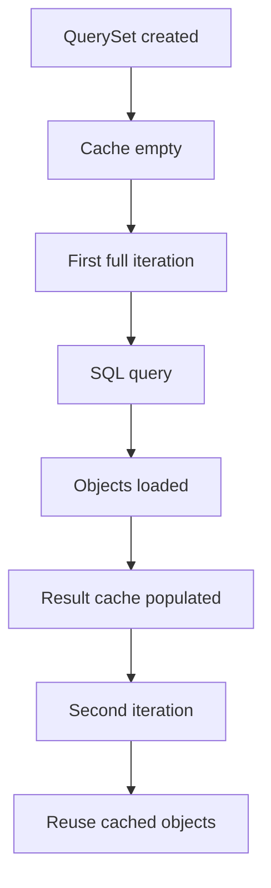
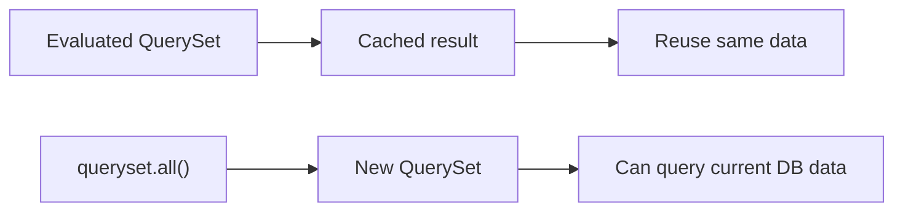
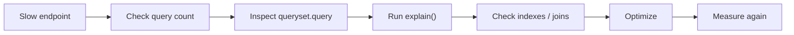
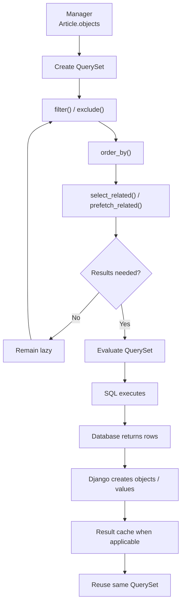

# Django QuerySets & Lazy Evaluation

> A **QuerySet** represents a database query and its potential results.
>
> QuerySets are usually **lazy**: Django builds the query definition first and accesses the database only when the results are actually required.

This is one of the most important Django ORM concepts because it directly affects **performance, query count, memory usage, and application behavior**.

---

# 1. Core Idea

Consider:

```python
articles = Article.objects.filter(is_published=True)
```

This normally **does not execute SQL immediately**.

Django creates a `QuerySet` describing what should be fetched.

Conceptually:

```sql
SELECT *
FROM article
WHERE is_published = TRUE;
```

The actual SQL is executed later when something needs the records.


This delayed execution is called **lazy evaluation**.

---

# 2. Example Model

We will use one simple model throughout the topic.

```python
from django.db import models


class Article(models.Model):
    title = models.CharField(max_length=200)
    is_published = models.BooleanField(default=False)
    view_count = models.PositiveIntegerField(default=0)
    published_at = models.DateTimeField(null=True, blank=True)

    def __str__(self):
        return self.title
```

A QuerySet can represent:

```python
# All articles
Article.objects.all()

# Published articles
Article.objects.filter(is_published=True)

# Popular articles
Article.objects.filter(view_count__gte=1000)

# Ordered articles
Article.objects.order_by("-published_at")
```

A QuerySet is **not a Python list**.

```python
articles = Article.objects.all()

print(type(articles))
# <class 'django.db.models.query.QuerySet'>
```

It is an object that contains the instructions required to retrieve data.

---

# 3. QuerySet Chaining

Most QuerySet refinement methods return a **new QuerySet**.

```python
articles = Article.objects.all()

articles = articles.filter(is_published=True)
articles = articles.filter(view_count__gte=100)
articles = articles.order_by("-published_at")
```

These operations normally still do not access the database.

You can also write the same query more cleanly:

```python
articles = (
    Article.objects
    .filter(
        is_published=True,
        view_count__gte=100,
    )
    .order_by("-published_at")
)
```

Conceptually:

```text
Article.objects
      |
      v
   .all()
      |
      v
.filter(is_published=True)
      |
      v
.filter(view_count__gte=100)
      |
      v
.order_by("-published_at")
      |
      v
 Final QuerySet
      |
      v
 No SQL yet
```

Methods such as these normally return new lazy QuerySets:

```python
filter()
exclude()
order_by()
select_related()
prefetch_related()
values()
values_list()
only()
defer()
```

This makes QuerySets highly composable.

---

# 4. When Does a QuerySet Execute?

A QuerySet runs when Django needs actual results.

## 4.1 Iteration

```python
articles = Article.objects.filter(is_published=True)

for article in articles:
    print(article.title)
```

The database query executes when iteration begins.

---

## 4.2 `list()`

```python
articles = list(
    Article.objects.filter(is_published=True)
)
```

`list()` forces the complete QuerySet to be evaluated.

---

## 4.3 `len()`

```python
articles = Article.objects.filter(is_published=True)

total = len(articles)
```

This loads the QuerySet results.

If you only need the number of records, use:

```python
total = Article.objects.filter(
    is_published=True
).count()
```

The database can perform the count directly.

---

## 4.4 Boolean Check

```python
articles = Article.objects.filter(is_published=True)

if articles:
    print("Articles exist")
```

`if articles:` evaluates the QuerySet.

If existence is the only information required:

```python
if articles.exists():
    print("Articles exist")
```

---

## 4.5 `repr()` and `print()`

```python
articles = Article.objects.all()

print(articles)
```

Printing a QuerySet asks for its representation, which can execute SQL.

However, there is an important distinction:

> `repr(queryset)` evaluates enough rows to display the representation, but it **does not populate the original QuerySet's complete result cache**.

So this:

```python
articles = Article.objects.all()

print(articles)
list(articles)
```

can result in another query when `list(articles)` is executed.

---

## 4.6 Index Access

```python
article = Article.objects.all()[0]
```

This executes a limited query and returns one object.

Repeated index access on an unevaluated QuerySet may execute repeated queries:

```python
articles = Article.objects.all()

print(articles[0])  # Query
print(articles[0])  # Query again
```

---

## 4.7 Slicing

Normal slicing stays lazy:

```python
articles = Article.objects.all()[:10]
```

Conceptually:

```sql
LIMIT 10
```

Offset slicing also remains lazy:

```python
articles = Article.objects.all()[20:30]
```

Conceptually:

```sql
LIMIT 10 OFFSET 20
```

But slicing with a **step** evaluates the QuerySet:

```python
articles = Article.objects.all()[0:100:2]
```

This returns a Python list.

---

# 5. Evaluation vs QuerySet Cache

These two concepts are related, but they are not exactly the same.

## Full Evaluation

Consider:

```python
articles = Article.objects.filter(is_published=True)

for article in articles:
    print(article.title)
```

Django retrieves the results and normally stores them in that QuerySet's **result cache**.

If the same QuerySet is used again:

```python
for article in articles:
    print(article.view_count)
```

Django can reuse the cached objects.



Therefore:

```python
articles = Article.objects.filter(is_published=True)

titles = [article.title for article in articles]
views = [article.view_count for article in articles]
```

normally requires only the first database retrieval.

---

# 6. Same QuerySet vs New QuerySet

QuerySet caching belongs to the **QuerySet instance**.

This creates two QuerySets:

```python
for article in Article.objects.filter(is_published=True):
    print(article.title)

for article in Article.objects.filter(is_published=True):
    print(article.view_count)
```

Both may execute their own query.

Instead:

```python
articles = Article.objects.filter(is_published=True)

for article in articles:
    print(article.title)

for article in articles:
    print(article.view_count)
```

The second iteration can reuse the result cache.

```text
New QuerySet #1 ──> SQL
New QuerySet #2 ──> SQL

vs.

Same QuerySet ──> SQL ──> Cache
                         |
                         └──> Reused
```

---

# 7. `exists()`, `count()`, and `contains()`

These methods are useful when the complete rows are **not required**.

## Existence

```python
has_articles = Article.objects.filter(
    is_published=True
).exists()
```

Use when you only need:

```text
Does at least one matching row exist?
```

---

## Count

```python
total = Article.objects.filter(
    is_published=True
).count()
```

Use when you only need:

```text
How many matching rows exist?
```

---

## Membership

If you already have an object:

```python
exists = articles.contains(article)
```

This expresses the intention more clearly than:

```python
article in articles
```

---

## Important Performance Decision

Do not automatically call `exists()` or `count()` when you are immediately going to consume all objects.

For example:

```python
articles = Article.objects.filter(is_published=True)

if articles.exists():
    for article in articles:
        print(article.title)
```

This can perform:

```text
Query 1 -> exists()
Query 2 -> retrieve articles
```

If you already need every article:

```python
articles = Article.objects.filter(is_published=True)

if articles:
    for article in articles:
        print(article.title)
```

The evaluated QuerySet can then reuse its result cache.

A useful rule:

| Requirement | Prefer |
|---|---|
| Only existence | `exists()` |
| Only count | `count()` |
| Only membership | `contains(obj)` |
| Need the objects afterward | Evaluate and reuse the QuerySet |

---

# 8. Fresh Data After Evaluation

An evaluated QuerySet does not automatically refresh when the database changes.

```python
articles = Article.objects.filter(is_published=True)

list(articles)
```

The results are now cached.

Suppose another article is then created:

```python
Article.objects.create(
    title="New Django Article",
    is_published=True,
)
```

Using the same evaluated QuerySet:

```python
list(articles)
```

can reuse the old cached result.

To retrieve current data:

```python
fresh_articles = articles.all()
```

or create a new QuerySet:

```python
fresh_articles = Article.objects.filter(
    is_published=True
)
```



---

# 9. Immediate Query Methods

Not every QuerySet method stays lazy.

Some methods need a database answer immediately.

```python
Article.objects.get(pk=1)

Article.objects.first()

Article.objects.last()

Article.objects.exists()

Article.objects.count()

Article.objects.aggregate(...)

Article.objects.update(...)

Article.objects.delete()
```

A useful mental model is:

```text
Does the method return another QuerySet?
        |
   +----+----+
   |         |
  Yes        No
   |         |
Usually     Usually needs
lazy        database work
```

This is not a universal Python rule, but it is a useful Django ORM mental model.

---

# 10. Loading Data Efficiently

## Selected Values

If you do not need model objects:

```python
articles = Article.objects.values(
    "id",
    "title",
)
```

Result:

```python
[
    {
        "id": 1,
        "title": "Django QuerySets",
    }
]
```

Or retrieve one field:

```python
titles = Article.objects.values_list(
    "title",
    flat=True,
)
```

This avoids constructing complete model instances when they are unnecessary.

---

## Related Objects

Lazy QuerySets do not automatically solve the **N+1 query problem**.

For foreign keys or one-to-one relations:

```python
articles = Article.objects.select_related("author")
```

For many-to-many or reverse relations:

```python
articles = Article.objects.prefetch_related("tags")
```

Both still return lazy QuerySets.

The related data is retrieved when the final QuerySet is evaluated.

---

# 11. Large QuerySets and `iterator()`

Normal QuerySet iteration stores results in the QuerySet cache.

That is useful when the results will be reused, but it can consume significant memory for very large datasets.

For one-pass processing:

```python
articles = Article.objects.order_by("id")

for article in articles.iterator(chunk_size=2000):
    process(article)
```

`iterator()` bypasses the standard QuerySet result cache.

Typical use cases:

- Data exports
- Batch processing
- Migration scripts
- Management commands
- Large background jobs

```text
Normal QuerySet

Database
   |
   v
Objects
   |
   v
QuerySet Cache
   |
   +--> reused later


iterator()

Database
   |
   v
Chunk of rows
   |
   v
Process
   |
   v
Next chunk
```

Use `iterator()` when the records are large in number and normally need to be processed only once.

---

# 12. QuerySets in Async Code

QuerySet-building methods remain useful in asynchronous code because they do not execute SQL.

```python
articles = (
    Article.objects
    .filter(is_published=True)
    .exclude(view_count=0)
    .order_by("-published_at")
)
```

No `await` is required because the query has not executed.

Methods that access the database have asynchronous variants.

```python
article = await Article.objects.aget(pk=article_id)

exists = await Article.objects.filter(
    is_published=True
).aexists()

count = await Article.objects.filter(
    is_published=True
).acount()
```

Async iteration is also supported:

```python
articles = Article.objects.filter(is_published=True)

async for article in articles:
    print(article.title)
```

Synchronous and asynchronous iteration of the **same QuerySet share the underlying QuerySet result cache**.

Be careful with `only()` and `defer()` in async code. Accessing a deferred field may require synchronous lazy loading and can raise `SynchronousOnlyOperation`.

---

# 13. Inspecting the SQL

Understanding what Django generates is extremely useful when debugging ORM performance.

```python
articles = (
    Article.objects
    .filter(
        is_published=True,
        view_count__gte=1000,
    )
    .order_by("-published_at")
)

print(articles.query)
```

This lets you inspect the generated SQL representation without retrieving the QuerySet results.

For the database execution plan:

```python
print(articles.explain())
```

`explain()` can help identify:

- Table scans
- Index usage
- Join strategy
- Sorting
- Estimated row counts
- Expensive query operations

A good performance workflow is:



---

# 14. Practical Example

Suppose an endpoint needs the most popular published articles.

```python
def popular_articles():
    return (
        Article.objects
        .filter(
            is_published=True,
            view_count__gte=1000,
        )
        .order_by("-view_count")
    )
```

Calling:

```python
articles = popular_articles()
```

does not normally execute SQL yet.

The view can add another condition:

```python
articles = articles.filter(
    published_at__isnull=False
)
```

Still lazy.

When the template or Python code iterates over it:

```python
for article in articles:
    print(article.title)
```

the final combined query executes.

Conceptually:

```text
popular_articles()
        |
        v
is_published=True
        |
        v
view_count >= 1000
        |
        v
published_at IS NOT NULL
        |
        v
ORDER BY view_count DESC
        |
        v
One final SQL query
```

This is the main practical benefit of lazy QuerySets: application layers can **compose one database query before paying the cost of executing it**.

---

# 15. Quick Reference

## Lazy Operations

```python
queryset.filter(...)
queryset.exclude(...)
queryset.order_by(...)
queryset.select_related(...)
queryset.prefetch_related(...)
queryset.values(...)
queryset.values_list(...)
queryset.only(...)
queryset.defer(...)
```

These normally return another QuerySet without immediately executing SQL.

---

## Common Evaluation Points

```python
for obj in queryset:
    ...

list(queryset)

len(queryset)

bool(queryset)

repr(queryset)

queryset[0]

queryset[::2]
```

Remember:

```text
Evaluation does not always mean
"populate the original full QuerySet cache".
```

`repr()` and partial index/slice operations are important examples.

---

## Immediate Database Operations

```python
queryset.get(...)
queryset.first()
queryset.last()
queryset.exists()
queryset.contains(obj)
queryset.count()
queryset.aggregate(...)
queryset.update(...)
queryset.delete()
```

---

# 16. Main Takeaways

1. A `QuerySet` represents a database query and its possible results.

2. QuerySet construction is normally **lazy**.

3. Methods such as `filter()`, `exclude()`, and `order_by()` usually return new QuerySets without immediately executing SQL.

4. SQL executes when results are actually required.

5. Iteration, `list()`, `len()`, `bool()`, `repr()`, indexing, and stepped slicing are common evaluation points.

6. Full evaluation normally populates that QuerySet instance's result cache.

7. Reusing the same evaluated QuerySet can avoid repeated database queries.

8. Partial indexing, slicing, and `repr()` should not be assumed to populate the original full QuerySet cache.

9. Use `exists()`, `count()`, and `contains()` when only those answers are required.

10. If the complete objects will immediately be needed, avoid unnecessary separate existence/count queries.

11. Use `select_related()` and `prefetch_related()` to prevent related-object N+1 queries.

12. Use `values()` and `values_list()` when full model instances are unnecessary.

13. Use `iterator()` for very large, one-pass workloads where QuerySet caching would waste memory.

14. Use async ORM methods such as `aget()`, `aexists()`, and `acount()` inside asynchronous code.

15. Inspect `queryset.query` and `queryset.explain()` before making database-performance optimizations.

---

## Final Mental Model



**Core idea to remember:**

> **Build the QuerySet first, execute it only when the data is needed, and understand when Django can reuse the resulting cache.**
