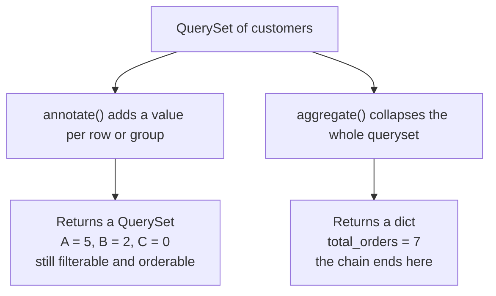
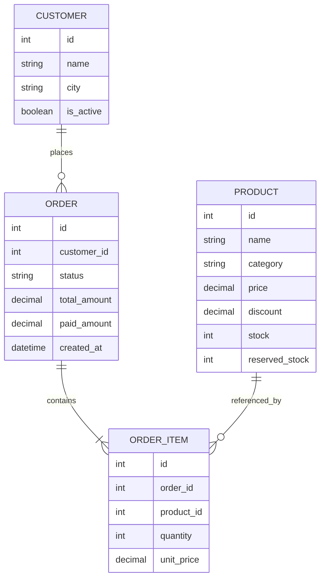
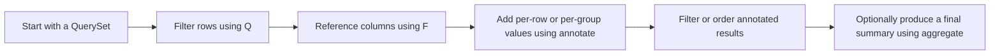
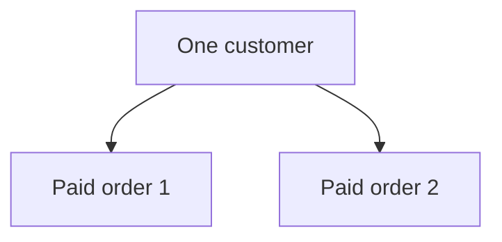
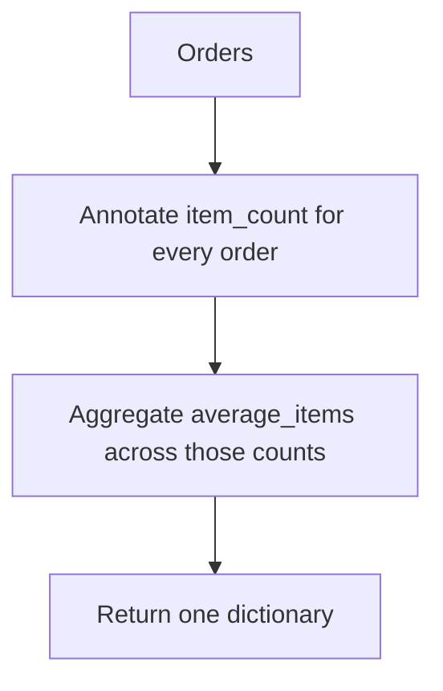
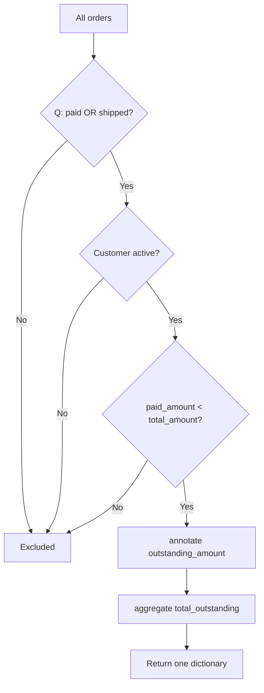
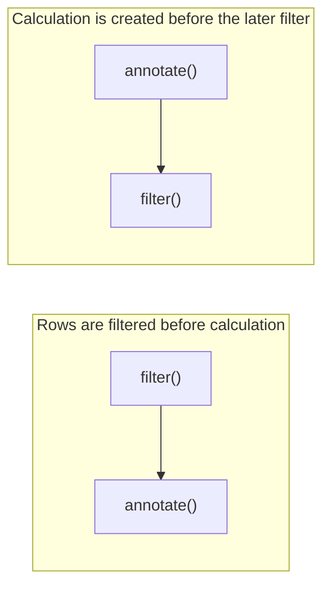

# Django ORM: `Q` Objects, `F` Expressions, `annotate()` and `aggregate()`

> These ORM features help you build advanced database queries without writing raw SQL:
>
> - **`Q` objects** build complex `WHERE` conditions.
> - **`F` expressions** refer to database columns and perform calculations inside the database.
> - **`annotate()`** adds a calculated value to every row or group in a `QuerySet`.
> - **`aggregate()`** calculates one summary result for the complete `QuerySet`.

## In short

- `Q` objects wrap query conditions so they can be composed with `|` (OR), `&` (AND) and `~` (NOT) — plain keyword arguments can only ever be `AND`ed, and positional `Q` arguments must come before any keyword arguments.
- `F("field")` refers to a database column, so the arithmetic happens in the database: `F("views") + 1` is one atomic `UPDATE` with no read-modify-write race, but the Python object is stale afterwards until `refresh_from_db()`.
- `annotate()` adds a value per row or per group and returns a `QuerySet` you can keep filtering; `aggregate()` is terminal and collapses the whole `QuerySet` into a single `dict`.
- `values()` before `annotate()` defines the `GROUP BY` columns; `annotate()` before `values()` calculates per object and then chooses which fields are returned.
- `filter()` before `annotate()` restricts which rows are aggregated; `filter()` after `annotate()` restricts on the aggregate itself, which becomes `HAVING`.
- A model's `Meta.ordering` silently joins the `GROUP BY` of a grouped report — clear it with an empty `.order_by()` before `.values().annotate()`.
- Joining two to-many relations in one query multiplies rows and double-counts — use `Count(..., distinct=True)` or separate queries and subqueries.



**Interview answer:** `Q` objects wrap query conditions so they can be combined with `|`, `&` and `~`; you need them as soon as a filter contains an `OR` or is assembled dynamically, because keyword arguments in `filter()` are always `AND`ed together. `F` expressions name a column instead of a Python value, so `F("stock") - 1` is sent to the database as `stock = stock - 1` — one statement, no read-modify-write window. `annotate()` and `aggregate()` both compute aggregates, but `annotate()` attaches one value to every row or group and returns a `QuerySet` you can keep filtering and ordering, while `aggregate()` ends the chain and returns one dictionary for the entire queryset.

**Gotcha:** Two `Count()` annotations over two different to-many relations in the same query do not give two independent counts — the joins multiply, so each count is inflated by the number of rows in the other relation. `distinct=True` rescues a `Count`, but nothing rescues a `Sum` that way; split those into separate queries or `Subquery` aggregates.

---

# 1. Example Models

The examples in this guide use a small e-commerce structure.

```python
from decimal import Decimal

from django.db import models

class Customer(models.Model):
    name = models.CharField(max_length=120)
    email = models.EmailField(unique=True)
    city = models.CharField(max_length=80)
    is_active = models.BooleanField(default=True)

    def __str__(self):
        return self.name

class Product(models.Model):
    name = models.CharField(max_length=150)
    category = models.CharField(max_length=80)
    price = models.DecimalField(max_digits=10, decimal_places=2)
    discount = models.DecimalField(
        max_digits=5,
        decimal_places=2,
        default=Decimal("0.00"),
    )
    stock = models.PositiveIntegerField(default=0)
    reserved_stock = models.PositiveIntegerField(default=0)
    is_active = models.BooleanField(default=True)

    def __str__(self):
        return self.name

class Order(models.Model):
    class Status(models.TextChoices):
        PENDING = "pending", "Pending"
        PAID = "paid", "Paid"
        SHIPPED = "shipped", "Shipped"
        CANCELLED = "cancelled", "Cancelled"

    customer = models.ForeignKey(
        Customer,
        on_delete=models.PROTECT,
        related_name="orders",
    )
    status = models.CharField(
        max_length=20,
        choices=Status.choices,
        default=Status.PENDING,
    )
    total_amount = models.DecimalField(max_digits=12, decimal_places=2)
    paid_amount = models.DecimalField(
        max_digits=12,
        decimal_places=2,
        default=Decimal("0.00"),
    )
    created_at = models.DateTimeField(auto_now_add=True)

class OrderItem(models.Model):
    order = models.ForeignKey(
        Order,
        on_delete=models.CASCADE,
        related_name="items",
    )
    product = models.ForeignKey(
        Product,
        on_delete=models.PROTECT,
        related_name="order_items",
    )
    quantity = models.PositiveIntegerField()
    unit_price = models.DecimalField(max_digits=10, decimal_places=2)
```

## Relationship Diagram



---

# 2. Mental Model

Think of the four features as different parts of an SQL query.

| Django ORM feature | Approximate SQL responsibility |
| --- | --- |
| `Q(...)` | `WHERE` conditions |
| `F("field")` | Reference to a database column |
| `annotate(...)` | `SELECT calculated_value` / `GROUP BY` |
| `aggregate(...)` | Final summary result |

A typical reporting query may flow like this:



---

# 3. `Q` Objects

Import `Q` from `django.db.models`: `from django.db.models import Q`

A `Q` object represents one or more query conditions. It is mainly used when normal keyword arguments are not enough to express the required logic.

## 3.1 Why `Q` Objects Are Needed

Multiple keyword arguments in `filter()` are combined with SQL `AND`.

```python
orders = Order.objects.filter(
    status=Order.Status.PAID,
    total_amount__gte=100,
)
```

Conceptually:

```sql
WHERE status = 'paid'
  AND total_amount >= 100
```

This is simple and does not require `Q`.

Use `Q` when you need:

- `OR` conditions
- Negated conditions
- Grouped combinations of `AND` and `OR`
- Dynamically constructed filters

---

## 3.2 `OR`, `AND` and `NOT` Conditions

### OR using `|`

Find products that belong to the `Laptop` category **or** cost less than `$50`.

```python
products = Product.objects.filter(
    Q(category="Laptop") | Q(price__lt=50)
)
```

Conceptual SQL: `WHERE category = 'Laptop' OR price < 50`

### AND using `&`

```python
products = Product.objects.filter(
    Q(category="Laptop") & Q(stock__gt=0)
)
```

This is equivalent to:

```python
products = Product.objects.filter(
    category="Laptop",
    stock__gt=0,
)
```

Use `&` mainly when it improves grouping or when conditions are built dynamically.

### NOT using `~`

Find all orders that are not cancelled.

```python
orders = Order.objects.filter(~Q(status=Order.Status.CANCELLED))
```

A simpler form is also available: `orders = Order.objects.exclude(status=Order.Status.CANCELLED)`

`~Q(...)` becomes more useful inside larger expressions.

### Grouped conditions

Find active products that are either laptops or phones.

```python
products = Product.objects.filter(
    (Q(category="Laptop") | Q(category="Phone"))
    & Q(is_active=True)
)
```

Conceptual SQL:

```sql
WHERE (category = 'Laptop' OR category = 'Phone')
  AND is_active = TRUE
```

> [!IMPORTANT]
> Use parentheses around combined `Q` expressions. Python operator precedence may otherwise produce a query different from the one you intended.

### XOR using `^`

Django also supports exclusive OR. It matches when one condition is true but not both.

```python
customers = Customer.objects.filter(
    Q(city="Ahmedabad") ^ Q(is_active=True)
)
```

`XOR` is less common in normal application queries, but it is useful for mutually exclusive conditions.

---

## 3.3 Dynamic Query Construction

Dynamic filtering is one of the most practical uses of `Q` objects in APIs and admin-style search screens.

```python
from django.db.models import Q

def search_products(*, search=None, category=None, in_stock=None):
    filters = Q(is_active=True)

    if search:
        filters &= (
            Q(name__icontains=search)
            | Q(category__icontains=search)
        )

    if category:
        filters &= Q(category=category)

    if in_stock is True:
        filters &= Q(stock__gt=0)

    return Product.objects.filter(filters)
```

Example:

```python
products = search_products(
    search="pro",
    category="Laptop",
    in_stock=True,
)
```

The query conditions are added only when the corresponding input is present.

### Starting with an empty `Q`

```python
filters = Q()
```

`Q()` does not add a filtering condition. It is useful as a starting point for dynamic construction.

---

## 3.4 `Q` Objects Across Relationships

Double-underscore syntax works inside `Q` objects exactly as it does in normal filters.

Find customers who either have a paid order or live in Ahmedabad:

```python
customers = Customer.objects.filter(
    Q(orders__status=Order.Status.PAID)
    | Q(city="Ahmedabad")
).distinct()
```

Why `distinct()` may be needed:



A JOIN can return the same customer row twice. `distinct()` removes duplicate customer results.

### Mixing `Q` objects and keyword arguments

This is valid:

```python
orders = Order.objects.filter(
    Q(status=Order.Status.PAID) | Q(status=Order.Status.SHIPPED),
    total_amount__gte=100,
)
```

All top-level arguments are combined with `AND`:

```sql
WHERE (status = 'paid' OR status = 'shipped')
  AND total_amount >= 100
```

> [!NOTE]
> Positional `Q` objects must appear before keyword arguments in the function call.

---

# 4. `F` Expressions

Import `F` from `django.db.models`: `from django.db.models import F`

`F("field_name")` means:

> Use the value currently stored in this database column.

The operation is translated into SQL and executed by the database rather than by Python.

---

## 4.1 Database-Side Updates

### Normal Python update

```python
product = Product.objects.get(pk=10)
product.stock = product.stock - 1
product.save(update_fields=["stock"])
```

This usually involves:

```text
1. SELECT the product
2. Read stock into Python
3. Subtract 1 in Python
4. UPDATE the database
```

### Update using `F`

```python
Product.objects.filter(pk=10).update(
    stock=F("stock") - 1
)
```

Conceptual SQL:

```sql
UPDATE product
SET stock = stock - 1
WHERE id = 10;
```

Advantages:

- The value does not need to be loaded into Python.
- The update can be completed in one database query.
- It reduces the risk of lost updates caused by concurrent requests.

### Safe stock reduction condition

Do not allow stock to become negative:

```python
updated_rows = Product.objects.filter(
    pk=10,
    stock__gte=1,
).update(
    stock=F("stock") - 1
)

if updated_rows == 0:
    raise ValueError("Product is unavailable or out of stock")
```

This approach combines the validation condition and the update in one database statement.

### Bulk update

Increase every active product price by 5%:

```python
Product.objects.filter(is_active=True).update(
    price=F("price") * 1.05
)
```

> [!IMPORTANT]
> `QuerySet.update()` directly executes SQL. It does not call each model instance's `save()` method and does not send `pre_save` or `post_save` signals.

---

## 4.2 Comparing Two Fields

Without `F`, a normal filter compares a column against a Python value.

```python
Order.objects.filter(total_amount__gt=100)
```

With `F`, one database column can be compared against another.

Find orders where the customer has not paid the complete amount:

```python
orders = Order.objects.filter(
    paid_amount__lt=F("total_amount")
)
```

Conceptual SQL: `WHERE paid_amount < total_amount`

Find products where reserved stock is greater than available stock:

```python
products = Product.objects.filter(
    reserved_stock__gt=F("stock")
)
```

This is useful for:

- Balance checks
- Inventory validation
- Start/end date comparisons
- Budget versus actual comparisons
- Paid versus payable amount checks

### Comparing related fields

```python
items = OrderItem.objects.filter(
    unit_price__gt=F("product__price")
)
```

Django creates the required join and compares the two columns.

---

## 4.3 Arithmetic and Calculated Values

`F` expressions support arithmetic operations such as:

| Operator | Meaning |
| --- | --- |
| `+` | Addition |
| `-` | Subtraction |
| `*` | Multiplication |
| `/` | Division |
| `%` | Modulo |
| `**` | Power, where supported by the database |

Calculate the line total for each order item:

```python
items = OrderItem.objects.annotate(
    line_total=F("quantity") * F("unit_price")
)

for item in items:
    print(item.line_total)
```

The database calculates: `line_total = quantity × unit_price`

### Referencing an annotation with `F`

```python
products = Product.objects.annotate(
    available_stock=F("stock") - F("reserved_stock")
).filter(
    available_stock__gt=0
)
```

The annotation alias can be used in later queryset operations.

---

## 4.4 Handling Expression Types

Django can infer many expression result types, but mixed numeric types may require an explicit output field.

```python
from django.db.models import DecimalField, ExpressionWrapper, F

items = OrderItem.objects.annotate(
    line_total=ExpressionWrapper(
        F("quantity") * F("unit_price"),
        output_field=DecimalField(max_digits=14, decimal_places=2),
    )
)
```

Use `ExpressionWrapper` when:

- Django cannot infer the result type.
- Integer, decimal, duration or date expressions are mixed.
- You need exact control over the returned database type.

### Date and duration example

Assume a model contains `started_at` and `duration` fields:

```python
from django.db.models import DateTimeField, ExpressionWrapper, F

sessions = Session.objects.annotate(
    expected_end=ExpressionWrapper(
        F("started_at") + F("duration"),
        output_field=DateTimeField(),
    )
)
```

---

## 4.5 Slicing String Fields

Modern Django versions support slicing `F` expressions for string, text and supported array fields.

```python
Customer.objects.filter(pk=1).update(
    name=F("name")[:5]
)
```

Important rules:

- Indexes are zero-based in Django's slicing syntax.
- Negative indexes are not supported.
- Slice steps such as `[0:10:2]` are not supported.
- Actual SQL varies by database backend.

This feature is useful for database-side substring updates, but explicit database functions such as `Substr` may be clearer for complex expressions.

---

# 5. `annotate()`

`annotate()` adds a calculated field to every object or group returned by a `QuerySet`.

```python
queryset = Model.objects.annotate(alias=expression)
```

Important characteristics:

- It returns another `QuerySet`.
- It does not add a permanent model field.
- The calculated alias exists on objects returned by that query.
- The resulting queryset can still be filtered, ordered or further annotated.

---

## 5.1 Per-Object Calculations

### Count related objects

Add `order_count` to every customer:

```python
from django.db.models import Count

customers = Customer.objects.annotate(
    order_count=Count("orders")
)

for customer in customers:
    print(customer.name, customer.order_count)
```

Conceptual result:

| Customer object | Temporary annotation |
| --- | --- |
| Aarav | `order_count = 5` |
| Meera | `order_count = 2` |
| Riya | `order_count = 0` |

`order_count` is not a column in the `customer` table. It exists only in this query result.

### Sum related values

```python
from django.db.models import Sum

customers = Customer.objects.annotate(
    lifetime_value=Sum("orders__total_amount", default=0)
)
```

Each customer receives the sum of their order totals.

### Multiple annotations

```python
from django.db.models import Avg, Count, Sum

customers = Customer.objects.annotate(
    order_count=Count("orders"),
    total_spent=Sum("orders__total_amount", default=0),
    average_order_value=Avg("orders__total_amount"),
)
```

### Calculated non-aggregate annotation

`annotate()` is not limited to aggregate functions.

```python
products = Product.objects.annotate(
    available_stock=F("stock") - F("reserved_stock")
)
```

---

## 5.2 Filtering and Ordering by Annotations

### Filter using an annotation

Find customers who have placed at least five orders:

```python
customers = Customer.objects.annotate(
    order_count=Count("orders")
).filter(
    order_count__gte=5
)
```

At the SQL level, a filter on an aggregate commonly becomes a `HAVING` condition.

### Order using an annotation

Show customers with the highest order count first:

```python
customers = Customer.objects.annotate(
    order_count=Count("orders")
).order_by("-order_count", "name")
```

### Reuse an annotation

```python
products = Product.objects.annotate(
    available_stock=F("stock") - F("reserved_stock")
).filter(
    available_stock__gt=0
).order_by(
    "available_stock"
)
```

---

## 5.3 Grouping with `values()`

`values()` placed before `annotate()` defines the grouping columns.

Calculate sales totals by order status:

```python
from django.db.models import Count, Sum

summary = (
    Order.objects
    .values("status")
    .annotate(
        order_count=Count("id"),
        total_sales=Sum("total_amount", default=0),
    )
    .order_by("status")
)
```

Example result:

```python
[
    {
        "status": "cancelled",
        "order_count": 4,
        "total_sales": Decimal("320.00"),
    },
    {
        "status": "paid",
        "order_count": 18,
        "total_sales": Decimal("6400.00"),
    },
]
```

Conceptual SQL:

```sql
SELECT
    status,
    COUNT(id) AS order_count,
    SUM(total_amount) AS total_sales
FROM orders
GROUP BY status
ORDER BY status;
```

### Group by multiple fields

```python
summary = (
    Order.objects
    .values("customer__city", "status")
    .annotate(
        order_count=Count("id"),
        total_sales=Sum("total_amount", default=0),
    )
    .order_by("customer__city", "status")
)
```

This produces one result for each unique `(city, status)` combination.

### Why order matters

```python
Customer.objects.values("city").annotate(
    customer_count=Count("id")
)
```

Meaning:

> Group customers by city, then count customers in each city.

But:

```python
Customer.objects.annotate(
    order_count=Count("orders")
).values("name", "order_count")
```

Meaning:

> Annotate each customer first, then choose which fields are included in the output.

When `values()` comes after `annotate()`, explicitly include the annotation alias if it must appear in the returned dictionaries.

---

## 5.4 Conditional Annotations

Use the aggregate's `filter` argument when you need multiple aggregates over the same relationship with different conditions.

```python
from django.db.models import Count, Q

customers = Customer.objects.annotate(
    total_orders=Count("orders"),
    paid_orders=Count(
        "orders",
        filter=Q(orders__status=Order.Status.PAID),
    ),
    cancelled_orders=Count(
        "orders",
        filter=Q(orders__status=Order.Status.CANCELLED),
    ),
)
```

Each customer receives three separate counts.

### Distinct conditional count

```python
customers = Customer.objects.annotate(
    purchased_products=Count(
        "orders__items__product",
        filter=Q(orders__status=Order.Status.PAID),
        distinct=True,
    )
)
```

### `Case` and `When` for conditional values

```python
from django.db.models import Case, CharField, Value, When

orders = Order.objects.annotate(
    payment_state=Case(
        When(paid_amount=F("total_amount"), then=Value("fully_paid")),
        When(paid_amount=0, then=Value("unpaid")),
        default=Value("partially_paid"),
        output_field=CharField(),
    )
)
```

This is similar to SQL `CASE WHEN`.

---

# 6. `aggregate()`

`aggregate()` calculates summary values for the complete queryset.

```python
result = Model.objects.aggregate(alias=aggregate_expression)
```

Important characteristics:

- It is a terminal queryset operation.
- It executes the query immediately.
- It returns a dictionary, not a `QuerySet`.
- The dictionary usually contains one value per aggregate alias.

---

## 6.1 Whole-QuerySet Summaries

Calculate total revenue from paid orders:

```python
from django.db.models import Sum

result = Order.objects.filter(
    status=Order.Status.PAID
).aggregate(
    total_revenue=Sum("total_amount", default=0)
)

print(result)
```

Example result: `{"total_revenue": Decimal("12500.00")}`

Access the value: `total_revenue = result["total_revenue"]`

### Empty querysets

Many aggregate functions return `None` when there are no matching rows.

```python
result = Order.objects.none().aggregate(
    total=Sum("total_amount")
)

# {"total": None}
```

Use `default` when a fallback value is appropriate:

```python
result = Order.objects.none().aggregate(
    total=Sum("total_amount", default=0)
)

# {"total": Decimal("0")}
```

---

## 6.2 Multiple Aggregates

```python
from django.db.models import Avg, Count, Max, Min, Sum

statistics = Order.objects.aggregate(
    order_count=Count("id"),
    total_sales=Sum("total_amount", default=0),
    average_order=Avg("total_amount"),
    smallest_order=Min("total_amount"),
    largest_order=Max("total_amount"),
)
```

Example structure:

```python
{
    "order_count": 120,
    "total_sales": Decimal("45200.00"),
    "average_order": Decimal("376.67"),
    "smallest_order": Decimal("15.00"),
    "largest_order": Decimal("2800.00"),
}
```

Common aggregate classes:

| Aggregate | Purpose |
|---|---|
| `Count()` | Count rows or related values |
| `Sum()` | Add numeric values |
| `Avg()` | Calculate the average |
| `Min()` | Find the minimum value |
| `Max()` | Find the maximum value |
| `StdDev()` | Calculate standard deviation, subject to backend support |
| `Variance()` | Calculate variance, subject to backend support |

---

## 6.3 Aggregating an Annotation

You can annotate each object and then aggregate the annotated value.

Calculate the average number of items per order:

```python
from django.db.models import Avg, Count

result = (
    Order.objects
    .annotate(item_count=Count("items"))
    .aggregate(average_items=Avg("item_count"))
)
```

Processing flow:



Another example: total calculated stock across products.

```python
from django.db.models import Sum

result = (
    Product.objects
    .annotate(available_stock=F("stock") - F("reserved_stock"))
    .aggregate(total_available=Sum("available_stock", default=0))
)
```

---

# 7. `annotate()` vs `aggregate()`

| Point | `annotate()` | `aggregate()` |
|---|---|---|
| Purpose | Add a calculated value to each object or group | Calculate final summary values |
| Return type | `QuerySet` | `dict` |
| Terminal operation | No | Yes |
| Can continue filtering | Yes | No, because a dictionary has already been returned |
| Typical SQL idea | Calculated `SELECT` column, often with `GROUP BY` | Summary such as `SUM`, `AVG` or `COUNT` |
| Common use | Order count per customer | Total number of orders |

```text
Need one calculated value for every row or group?
    Use annotate().

Need one final summary for the entire queryset?
    Use aggregate().
```

---

# 8. Combining `Q`, `F`, `annotate()` and `aggregate()`

These tools are most powerful when combined.

## Requirement

Calculate the total outstanding amount for active customers whose orders are either paid or shipped but are not fully paid.

```python
from django.db.models import DecimalField, ExpressionWrapper, F, Q, Sum

eligible_orders = Order.objects.filter(
    Q(status=Order.Status.PAID) | Q(status=Order.Status.SHIPPED),
    customer__is_active=True,
    paid_amount__lt=F("total_amount"),
).annotate(
    outstanding_amount=ExpressionWrapper(
        F("total_amount") - F("paid_amount"),
        output_field=DecimalField(max_digits=12, decimal_places=2),
    )
)

result = eligible_orders.aggregate(
    total_outstanding=Sum("outstanding_amount", default=0)
)
```

## Responsibility of Each Feature

| Expression | Responsibility |
| --- | --- |
| `Q(...)` | Status is paid OR shipped |
| `customer__is_active=True` | Normal AND condition |
| `F("total_amount")` | Reference the `total_amount` column |
| `F("paid_amount")` | Reference the `paid_amount` column |
| `annotate(...)` | Calculate outstanding amount per order |
| `aggregate(...)` | Sum all outstanding amounts |

## Processing Diagram



---

# 9. SQL Mental Model

You do not need to write raw SQL for normal use, but understanding the approximate SQL makes advanced ORM queries easier to reason about.

## Django Query

```python
customers = (
    Customer.objects
    .filter(
        Q(city="Ahmedabad") | Q(city="Surat"),
        is_active=True,
    )
    .annotate(
        paid_order_count=Count(
            "orders",
            filter=Q(orders__status=Order.Status.PAID),
        ),
        total_spent=Sum(
            "orders__total_amount",
            filter=Q(orders__status=Order.Status.PAID),
            default=0,
        ),
    )
    .filter(paid_order_count__gte=2)
    .order_by("-total_spent")
)
```

## Approximate SQL Shape

```sql
SELECT
    customer.id,
    customer.name,
    COUNT(order.id) FILTER (
        WHERE order.status = 'paid'
    ) AS paid_order_count,
    COALESCE(
        SUM(order.total_amount) FILTER (
            WHERE order.status = 'paid'
        ),
        0
    ) AS total_spent
FROM customer
LEFT JOIN order
    ON order.customer_id = customer.id
WHERE
    (customer.city = 'Ahmedabad' OR customer.city = 'Surat')
    AND customer.is_active = TRUE
GROUP BY customer.id
HAVING COUNT(order.id) FILTER (
    WHERE order.status = 'paid'
) >= 2
ORDER BY total_spent DESC;
```

> [!NOTE]
> The exact SQL differs by database backend and Django version. The purpose of this example is to build a mental model, not to predict the exact generated statement.

---

# 10. Important Query-Order Behaviour

The order of queryset methods can change the meaning of the query.

## 10.1 `filter()` Before `annotate()`

```python
customers = (
    Customer.objects
    .filter(orders__status=Order.Status.PAID)
    .annotate(order_count=Count("orders"))
)
```

Meaning:

> First keep paid orders, then count those paid orders.

The annotation is calculated from the already-filtered rows.

---

## 10.2 `annotate()` Before `filter()`

```python
customers = (
    Customer.objects
    .annotate(order_count=Count("orders", distinct=True))
    .filter(orders__status=Order.Status.PAID)
)
```

Meaning:

> First count all orders, then keep customers who have at least one paid order.

The later filter does not automatically redefine the earlier annotation.



> [!IMPORTANT]
> `filter()` and `annotate()` are not interchangeable. Build the queryset in the same order as the business requirement.

---

## 10.3 `values()` Before `annotate()`

```python
Order.objects.values("status").annotate(
    total=Sum("total_amount")
)
```

Meaning:

> Group by status, then calculate one total for each status.

---

## 10.4 `annotate()` Before `values()`

```python
Customer.objects.annotate(
    order_count=Count("orders")
).values(
    "id",
    "name",
    "order_count",
)
```

Meaning:

> Annotate each customer, then control which columns are returned.

---

## 10.5 Existing Ordering Can Affect Grouping

When using `values()` with `annotate()`, unrelated ordering fields may become part of SQL grouping on some queries.

Prefer to clear unnecessary ordering before grouped reports:

```python
summary = (
    Order.objects
    .order_by()
    .values("status")
    .annotate(order_count=Count("id"))
    .order_by("status")
)
```

This also makes the intended grouping and final ordering explicit.

---

## 10.6 Multiple Relationship Counts

A query that joins multiple multi-valued relationships can multiply rows.

```python
products = Product.objects.annotate(
    order_count=Count("order_items__order"),
    customer_count=Count("order_items__order__customer"),
)
```

For counts, `distinct=True` may be required:

```python
products = Product.objects.annotate(
    order_count=Count(
        "order_items__order",
        distinct=True,
    ),
    customer_count=Count(
        "order_items__order__customer",
        distinct=True,
    ),
)
```

For more complicated aggregations across multiple relationships, inspect the generated SQL and consider subqueries when joins would distort the result.

---

# 11. Practical Development Use Cases

## 11.1 Search API

```python
from django.db.models import Q

def product_search(query):
    return Product.objects.filter(
        Q(name__icontains=query)
        | Q(category__icontains=query),
        is_active=True,
    )
```

Use `Q` for multi-field search.

---

## 11.2 Atomic Counter Update

```python
Product.objects.filter(pk=product_id).update(
    reserved_stock=F("reserved_stock") + quantity
)
```

Use `F` for counters, balances and inventory values updated by concurrent requests.

---

## 11.3 Dashboard Totals

```python
dashboard = Order.objects.filter(
    status=Order.Status.PAID
).aggregate(
    revenue=Sum("total_amount", default=0),
    order_count=Count("id"),
    average_order_value=Avg("total_amount"),
)
```

Use `aggregate()` when the dashboard needs a small set of overall KPIs.

---

## 11.4 Customer List with Statistics

```python
customers = Customer.objects.annotate(
    order_count=Count("orders"),
    total_spent=Sum("orders__total_amount", default=0),
).order_by("-total_spent")
```

Use `annotate()` when every list item needs calculated fields.

---

## 11.5 Category Sales Report

```python
category_sales = (
    OrderItem.objects
    .filter(order__status=Order.Status.PAID)
    .values("product__category")
    .annotate(
        units_sold=Sum("quantity", default=0),
        revenue=Sum(
            F("quantity") * F("unit_price"),
            default=0,
        ),
    )
    .order_by("-revenue")
)
```

This combines filtering, grouping, `F` expressions and aggregation.

For strict decimal typing across database backends, wrap the multiplication in `ExpressionWrapper` with a `DecimalField` output type.

---

## 11.6 Outstanding Payment Report

```python
outstanding_orders = (
    Order.objects
    .filter(paid_amount__lt=F("total_amount"))
    .annotate(
        outstanding=F("total_amount") - F("paid_amount")
    )
    .order_by("-outstanding")
)
```

Use `F` for column comparison and `annotate()` for the calculated amount.

---

## 11.7 Conditional Customer Segmentation

```python
from django.db.models import Case, CharField, Value, When

customers = Customer.objects.annotate(
    total_spent=Sum("orders__total_amount", default=0)
).annotate(
    segment=Case(
        When(total_spent__gte=5000, then=Value("gold")),
        When(total_spent__gte=1000, then=Value("silver")),
        default=Value("standard"),
        output_field=CharField(),
    )
)
```

One annotation can be referenced by a later annotation.

---

# 12. Performance and Best Practices

## 12.1 Let the Database Perform Set-Based Work

Prefer one database operation over loading many objects and looping in Python.

Less efficient:

```python
for product in Product.objects.filter(is_active=True):
    product.stock -= 1
    product.save(update_fields=["stock"])
```

Better when the same rule applies to all rows:

```python
Product.objects.filter(is_active=True).update(
    stock=F("stock") - 1
)
```

---

## 12.2 Use Clear Aliases

Avoid relying on generated names such as `orders__count` in production code.

Prefer:

```python
Customer.objects.annotate(
    order_count=Count("orders")
)
```

Clear aliases make serializers, templates and service code easier to understand.

---

## 12.3 Filter Early When It Matches the Requirement

```python
Order.objects.filter(
    status=Order.Status.PAID
).aggregate(
    total=Sum("total_amount", default=0)
)
```

This lets the database aggregate only relevant rows.

Do not move a filter earlier merely for appearance; method order must still match the intended business meaning.

---

## 12.4 Use `distinct=True` Deliberately

```python
Customer.objects.annotate(
    product_count=Count(
        "orders__items__product",
        distinct=True,
    )
)
```

Use it when the requirement is to count unique related values. Do not add it everywhere without understanding the join, because distinct work can increase query cost.

---

## 12.5 Inspect Generated SQL

```python
queryset = Customer.objects.annotate(
    order_count=Count("orders")
)

print(queryset.query)
```

For database query plans: `print(queryset.explain())`

When supported by the backend, additional options may be available: `print(queryset.explain(analyze=True))`

Use query inspection when:

- Several joins are involved.
- Counts appear too high.
- `annotate()`, `values()` and `filter()` are combined.
- A report is slow.
- You are unsure whether filtering becomes `WHERE` or `HAVING`.

> [!CAUTION]
> `analyze=True` may actually execute the query. Use it carefully, especially for expensive or data-changing SQL operations supported by particular backends.

---

## 12.6 Add Indexes for Frequent Filters

`Q` objects do not make an unindexed search automatically fast.

Frequently filtered fields may need suitable indexes, for example:

```python
class Order(models.Model):
    status = models.CharField(
        max_length=20,
        choices=Status.choices,
        db_index=True,
    )
    created_at = models.DateTimeField(
        auto_now_add=True,
        db_index=True,
    )
```

Composite and conditional indexes may be better for real production patterns. Choose indexes using actual query plans and workload data.

---

## 12.7 Do Not Treat `F` as Application Validation

This update is atomic at the SQL-expression level:

```python
Product.objects.filter(pk=product_id).update(
    stock=F("stock") - quantity
)
```

But it does not by itself prevent negative stock.

Include the business condition:

```python
updated = Product.objects.filter(
    pk=product_id,
    stock__gte=quantity,
).update(
    stock=F("stock") - quantity
)
```

For critical workflows, also consider:

- Database constraints
- Transactions
- Row locking with `select_for_update()` when multiple related decisions must be atomic
- Idempotency for retried requests

---

## 12.8 Refresh or Re-read When Necessary

After a database-side update, use the returned row count or retrieve the object again when your Python code needs the latest value.

```python
Product.objects.filter(pk=product_id).update(
    stock=F("stock") - 1
)

product = Product.objects.get(pk=product_id)
```

For an instance assignment using `F`, Django refresh behaviour depends on the database backend. Explicitly calling `refresh_from_db()` remains clear when later logic requires confirmed current values.

```python
product.stock = F("stock") - 1
product.save(update_fields=["stock"])
product.refresh_from_db(fields=["stock"])
```

---

## 12.9 Keep Complex ORM Logic Readable

Instead of one deeply nested statement, name meaningful expressions.

```python
paid_or_shipped = (
    Q(status=Order.Status.PAID)
    | Q(status=Order.Status.SHIPPED)
)

has_balance = Q(paid_amount__lt=F("total_amount"))

orders = Order.objects.filter(
    paid_or_shipped & has_balance
)
```

This reads like the business requirement and is easier to test.

---

## 12.10 Test Results, Not Only Query Syntax

For reporting queries, create test data that covers:

- No related rows
- Multiple related rows
- Duplicate relationships
- Null values
- Boundary values
- Different query method orders
- Concurrent updates for critical counters

The ORM statement may be syntactically valid while still representing the wrong business calculation.

---

# 13. Quick Reference

## Imports

```python
from django.db.models import (
    Avg,
    Case,
    Count,
    DecimalField,
    ExpressionWrapper,
    F,
    Max,
    Min,
    Q,
    Sum,
    Value,
    When,
)
```

## `Q` Objects

```python
# OR
Q(status="paid") | Q(status="shipped")

# AND
Q(is_active=True) & Q(stock__gt=0)

# NOT
~Q(status="cancelled")

# Grouped
(Q(category="Laptop") | Q(category="Phone")) & Q(stock__gt=0)
```

## `F` Expressions

```python
# Atomic update
Product.objects.filter(pk=1).update(
    stock=F("stock") - 1
)

# Field comparison
Order.objects.filter(
    paid_amount__lt=F("total_amount")
)

# Calculation
OrderItem.objects.annotate(
    line_total=F("quantity") * F("unit_price")
)
```

## `annotate()`

```python
Customer.objects.annotate(
    order_count=Count("orders")
)
```

## `aggregate()`

```python
Order.objects.aggregate(
    total_sales=Sum("total_amount", default=0)
)
```

## Grouped Report

```python
Order.objects.values("status").annotate(
    order_count=Count("id"),
    total_sales=Sum("total_amount", default=0),
)
```

## Conditional Aggregate

```python
Customer.objects.annotate(
    paid_orders=Count(
        "orders",
        filter=Q(orders__status="paid"),
    )
)
```

---

## Official References

- [Django documentation: Making queries](https://docs.djangoproject.com/en/6.0/topics/db/queries/)
- [Django documentation: Query expressions](https://docs.djangoproject.com/en/6.0/ref/models/expressions/)
- [Django documentation: Aggregation](https://docs.djangoproject.com/en/6.0/topics/db/aggregation/)
- [Django documentation: QuerySet API reference](https://docs.djangoproject.com/en/6.0/ref/models/querysets/)
