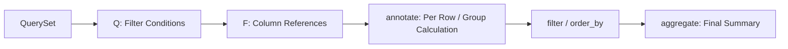
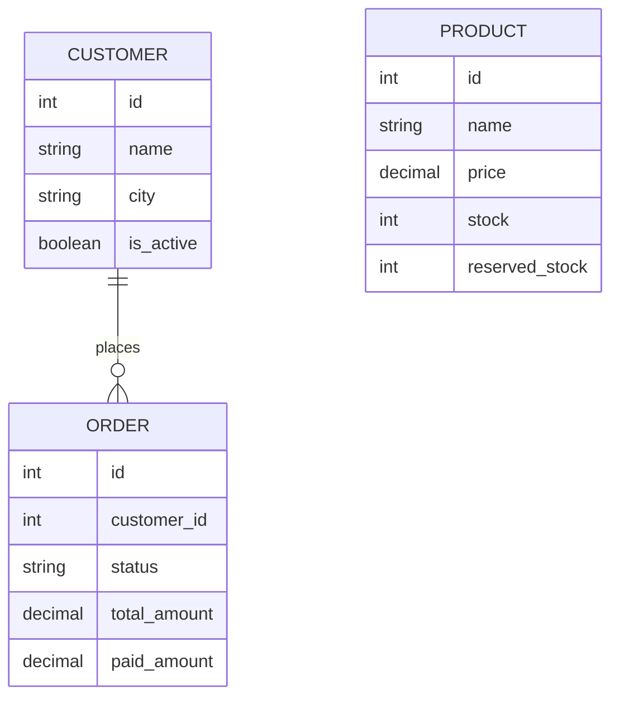
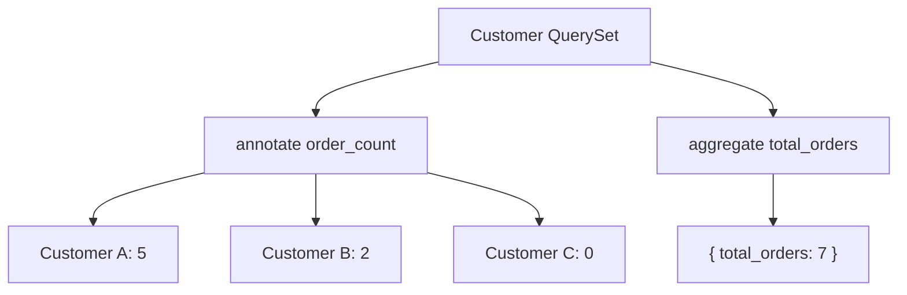
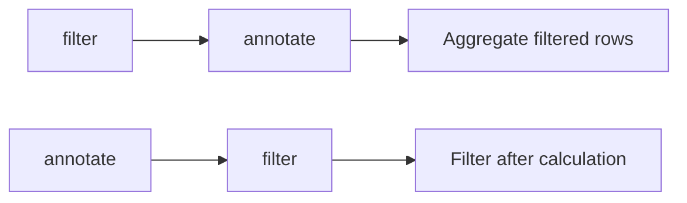
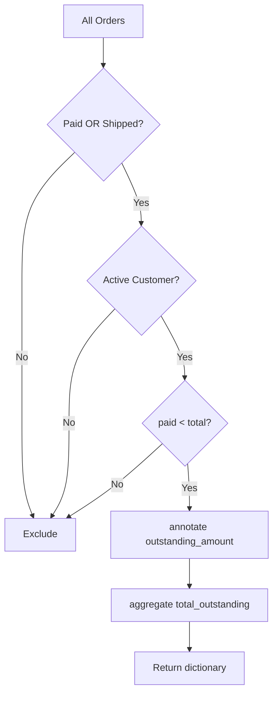

# Django ORM: `Q` Objects, `F` Expressions, `annotate()` and `aggregate()`

Django ORM provides several powerful tools for writing complex database queries without dropping down to raw SQL.

The four most useful ones in normal backend development are:

| Feature | Main Purpose |
|---|---|
| `Q()` | Build complex `WHERE` conditions such as `OR`, `AND`, and `NOT` |
| `F()` | Reference another database column or perform database-side calculations |
| `annotate()` | Add calculated values to each object or group |
| `aggregate()` | Calculate a final summary for the complete `QuerySet` |



## Quick Mental Model

```text
Q()          → Which rows should I select?
F()          → Use a database column in an expression.
annotate()   → Give every result/group an extra calculated value.
aggregate()  → Give me one final summary of the queryset.
```

---

# 1. Example Model Structure

We will use one small e-commerce example throughout this topic.

```python
class Customer(models.Model):
    name = models.CharField(max_length=120)
    city = models.CharField(max_length=80)
    is_active = models.BooleanField(default=True)


class Product(models.Model):
    name = models.CharField(max_length=150)
    price = models.DecimalField(max_digits=10, decimal_places=2)
    stock = models.PositiveIntegerField(default=0)
    reserved_stock = models.PositiveIntegerField(default=0)
    is_active = models.BooleanField(default=True)


class Order(models.Model):
    class Status(models.TextChoices):
        PENDING = "pending", "Pending"
        PAID = "paid", "Paid"
        SHIPPED = "shipped", "Shipped"
        CANCELLED = "cancelled", "Cancelled"

    customer = models.ForeignKey(
        Customer,
        on_delete=models.PROTECT,
        related_name="orders",
    )

    status = models.CharField(max_length=20, choices=Status.choices)
    total_amount = models.DecimalField(max_digits=12, decimal_places=2)
    paid_amount = models.DecimalField(max_digits=12, decimal_places=2)
```

## Relationship



---

# 2. `Q` Objects

Import:

```python
from django.db.models import Q
```

A `Q` object represents a database condition.

Normal keyword arguments inside `filter()` are combined using **AND**. `Q` objects are mainly required when you need more complex logic such as `OR`, `NOT`, or dynamically constructed conditions.

## 2.1 Normal AND Filter

```python
orders = Order.objects.filter(
    status=Order.Status.PAID,
    total_amount__gte=100,
)
```

Conceptually:

```sql
WHERE status = 'paid'
AND total_amount >= 100
```

No `Q` object is necessary here.

---

## 2.2 OR Condition

Find paid **or** shipped orders:

```python
orders = Order.objects.filter(
    Q(status=Order.Status.PAID)
    | Q(status=Order.Status.SHIPPED)
)
```

Conceptually:

```sql
WHERE status = 'paid'
   OR status = 'shipped'
```

---

## 2.3 AND with `Q`

```python
orders = Order.objects.filter(
    Q(status=Order.Status.PAID)
    & Q(total_amount__gte=100)
)
```

For simple AND conditions, normal keyword arguments are usually easier to read.

---

## 2.4 NOT Condition

```python
orders = Order.objects.filter(
    ~Q(status=Order.Status.CANCELLED)
)
```

A simpler equivalent is:

```python
Order.objects.exclude(
    status=Order.Status.CANCELLED
)
```

`~Q()` becomes more useful when NOT is part of a larger condition.

---

## 2.5 Grouping Conditions

Suppose we need:

> Paid or shipped orders whose amount is at least 100.

```python
orders = Order.objects.filter(
    (
        Q(status=Order.Status.PAID)
        | Q(status=Order.Status.SHIPPED)
    )
    & Q(total_amount__gte=100)
)
```

Use parentheses around complex `Q` expressions so that the intended logic is obvious.

---

## 2.6 Dynamic API Filters

This is one of the most common practical uses of `Q`.

```python
def search_customers(search=None, city=None):
    filters = Q(is_active=True)

    if search:
        filters &= Q(name__icontains=search)

    if city:
        filters &= Q(city=city)

    return Customer.objects.filter(filters)
```

You can progressively build conditions based on API query parameters.

```python
filters = Q()
```

An empty `Q()` is commonly used as the starting point when constructing filters dynamically.

---

## 2.7 `Q` Across Relationships

Find customers who live in Ahmedabad **or** have a paid order:

```python
customers = Customer.objects.filter(
    Q(city="Ahmedabad")
    | Q(orders__status=Order.Status.PAID)
).distinct()
```

`distinct()` may be required because joining to a one-to-many relationship can produce multiple database rows for the same customer.

---

# 3. `F` Expressions

Import:

```python
from django.db.models import F
```

`F("field_name")` represents the value of a database column.

Instead of loading a value into Python, modifying it, and saving it again, Django can send the calculation directly to the database.

---

## 3.1 Comparing Two Columns

Normal filtering compares a field with a Python value:

```python
Order.objects.filter(
    total_amount__gt=100
)
```

Using `F`, we can compare two columns.

Find orders that are not fully paid:

```python
orders = Order.objects.filter(
    paid_amount__lt=F("total_amount")
)
```

Conceptually:

```sql
WHERE paid_amount < total_amount
```

This pattern is useful for:

- inventory checks
- paid vs payable amount
- budget vs actual
- start vs end values
- counters and balances

---

## 3.2 Database-Side Calculation

Calculate available stock:

```python
products = Product.objects.annotate(
    available_stock=F("stock") - F("reserved_stock")
)
```

Every returned `Product` now has:

```python
product.available_stock
```

The value is calculated by the database rather than Python.

---

## 3.3 Atomic Counter Update

Without `F`:

```python
product = Product.objects.get(pk=10)
product.stock -= 1
product.save()
```

This follows roughly:

```text
SELECT stock
    ↓
Read value into Python
    ↓
stock - 1
    ↓
UPDATE stock
```

Another request could modify the value between the read and update.

With `F`:

```python
Product.objects.filter(pk=10).update(
    stock=F("stock") - 1
)
```

Conceptually:

```sql
UPDATE product
SET stock = stock - 1
WHERE id = 10;
```

The calculation happens in the database.

---

## 3.4 Safe Inventory Update

`F()` makes the calculation database-side, but it does **not** automatically enforce your business rule.

This could create negative stock:

```python
Product.objects.filter(pk=product_id).update(
    stock=F("stock") - quantity
)
```

Better:

```python
updated = Product.objects.filter(
    pk=product_id,
    stock__gte=quantity,
).update(
    stock=F("stock") - quantity
)

if updated == 0:
    raise ValueError("Insufficient stock")
```

Now checking stock and reducing it are part of the same database operation.

---

## 3.5 Important Django 6.x Behavior

An older Django interview point was:

> After assigning an `F()` expression and calling `save()`, the Python instance still contains the `F()` expression.

That is no longer generally correct.

Since Django 6.0, `F()` assignments made directly to model fields are refreshed after `Model.save()`. PostgreSQL, SQLite, and Oracle can return the new value without an additional query; MySQL and MariaDB defer the refresh until the field is accessed.

Example:

```python
product.stock = F("stock") - 1
product.save()

print(product.stock)
```

For code that must explicitly confirm the latest database value, this remains clear:

```python
product.refresh_from_db(fields=["stock"])
```

---

## 3.6 Expression Types

Django can infer many expression types automatically.

When different field types are involved, use `ExpressionWrapper`.

```python
from django.db.models import (
    DateTimeField,
    ExpressionWrapper,
    F,
)

sessions = Session.objects.annotate(
    expected_end=ExpressionWrapper(
        F("started_at") + F("duration"),
        output_field=DateTimeField(),
    )
)
```

`ExpressionWrapper` tells Django what result type the expression produces.

---

## 3.7 `F` Slicing

Modern Django supports slicing string, text, and supported array fields.

```python
Customer.objects.filter(pk=1).update(
    name=F("name")[:5]
)
```

Important:

```text
Indexes        → zero-based
Negative index → not supported
Slice step     → not supported
```

---

# 4. `annotate()`

`annotate()` adds a calculated value to **each returned object or group**.

```python
queryset = Model.objects.annotate(
    alias=expression
)
```

It returns another `QuerySet`, so you can continue:

```text
annotate()
    ↓
filter()
    ↓
order_by()
    ↓
another annotate()
```

Unlike `aggregate()`, `annotate()` is not terminal.

---

## 4.1 Count Related Objects

```python
from django.db.models import Count

customers = Customer.objects.annotate(
    order_count=Count("orders")
)
```

Conceptually:

| Customer | `order_count` |
|---|---:|
| Aarav | 5 |
| Meera | 2 |
| Riya | 0 |

`order_count` is not stored in the database model. It exists only on objects returned from this query.

---

## 4.2 Sum Related Values

```python
from django.db.models import Sum

customers = Customer.objects.annotate(
    total_spent=Sum(
        "orders__total_amount",
        default=0,
    )
)
```

Each customer gets their own calculated `total_spent`.

---

## 4.3 Filter by an Annotation

```python
customers = (
    Customer.objects
    .annotate(order_count=Count("orders"))
    .filter(order_count__gte=5)
)
```

Meaning:

> Calculate an order count for every customer, then keep customers whose calculated count is at least five.

---

## 4.4 Order by an Annotation

```python
customers = (
    Customer.objects
    .annotate(order_count=Count("orders"))
    .order_by("-order_count")
)
```

This is common for:

- dashboards
- leaderboards
- customer statistics
- reporting APIs

---

## 4.5 Conditional Annotation

Suppose we need total orders and paid orders separately.

```python
customers = Customer.objects.annotate(
    total_orders=Count("orders"),
    paid_orders=Count(
        "orders",
        filter=Q(
            orders__status=Order.Status.PAID
        ),
    ),
)
```

The aggregate `filter=` argument is useful when several aggregates over the same relationship need different conditions.

---

# 5. Grouping with `values()` + `annotate()`

Placing `values()` before `annotate()` changes the query from per-object annotation to grouped aggregation.

Example: total sales for every order status.

```python
summary = (
    Order.objects
    .values("status")
    .annotate(
        order_count=Count("id"),
        total_sales=Sum(
            "total_amount",
            default=0,
        ),
    )
    .order_by("status")
)
```

Conceptually:

```sql
SELECT
    status,
    COUNT(id),
    SUM(total_amount)
FROM order
GROUP BY status;
```

Result:

```python
[
    {
        "status": "paid",
        "order_count": 15,
        "total_sales": Decimal("5200.00"),
    },
    {
        "status": "shipped",
        "order_count": 8,
        "total_sales": Decimal("3100.00"),
    },
]
```

`values()` before `annotate()` defines the grouping keys.

---

# 6. `aggregate()`

`aggregate()` calculates final summary values for the entire queryset.

```python
result = Model.objects.aggregate(
    alias=aggregate_expression
)
```

Unlike `annotate()`, it returns a dictionary rather than another `QuerySet`. It is therefore a **terminal queryset operation**.

---

## 6.1 Whole QuerySet Summary

```python
result = Order.objects.filter(
    status=Order.Status.PAID
).aggregate(
    total_revenue=Sum(
        "total_amount",
        default=0,
    )
)
```

Result:

```python
{
    "total_revenue": Decimal("12500.00")
}
```

---

## 6.2 Multiple Aggregates

```python
from django.db.models import Avg, Count, Max, Min, Sum

statistics = Order.objects.aggregate(
    order_count=Count("id"),
    total_sales=Sum("total_amount", default=0),
    average_order=Avg("total_amount"),
    smallest_order=Min("total_amount"),
    largest_order=Max("total_amount"),
)
```

Typical output:

```python
{
    "order_count": 120,
    "total_sales": Decimal("45200.00"),
    "average_order": Decimal("376.67"),
    "smallest_order": Decimal("15.00"),
    "largest_order": Decimal("2800.00"),
}
```

Most aggregates return `None` on an empty queryset unless a `default` is supplied. `Count` is different: it returns `0`.

---

# 7. `annotate()` vs `aggregate()`

| Point | `annotate()` | `aggregate()` |
|---|---|---|
| Purpose | Calculate per object/group | Calculate whole-queryset summary |
| Return | `QuerySet` | `dict` |
| Terminal | No | Yes |
| Can continue filtering? | Yes | No |
| Common example | Orders per customer | Total revenue |



Remember:

```text
One calculated value for each object/group
                    ↓
               annotate()

One final value for the whole queryset
                    ↓
               aggregate()
```

---

# 8. Query Method Order Matters

This is one of the most important parts of advanced Django ORM usage.

Django calculates an annotation using the state of the queryset **at the point where `annotate()` is called**.

## 8.1 `filter()` Before `annotate()`

```python
customers = (
    Customer.objects
    .filter(
        orders__status=Order.Status.PAID
    )
    .annotate(
        order_count=Count("orders")
    )
)
```

Meaning:

```text
Keep paid orders
      ↓
Count those orders
```

The annotation is calculated from the already filtered rows.

---

## 8.2 `annotate()` Before `filter()`

```python
customers = (
    Customer.objects
    .annotate(
        order_count=Count(
            "orders",
            distinct=True,
        )
    )
    .filter(
        orders__status=Order.Status.PAID
    )
)
```

Meaning:

```text
Count orders
     ↓
Then find customers satisfying
the later relationship condition
```

The later filter does not automatically redefine an annotation that was already calculated.



Build queryset methods in the same order as the business requirement.

---

## 8.3 `values()` Before `annotate()`

```python
Order.objects.values("status").annotate(
    total=Sum("total_amount")
)
```

Meaning:

```text
GROUP BY status
       ↓
Calculate SUM per status
```

---

## 8.4 `annotate()` Before `values()`

```python
Customer.objects.annotate(
    order_count=Count("orders")
).values(
    "id",
    "name",
    "order_count",
)
```

Meaning:

```text
Calculate per customer
       ↓
Choose returned columns
```

When `values()` comes after `annotate()`, include the annotation alias explicitly if you want it in the returned dictionaries.

---

## 8.5 Ordering and `GROUP BY`

An important correction for modern Django:

> Model `Meta.ordering` does **not** automatically participate in `GROUP BY` queries.

However, ordering that you explicitly added with `order_by()` can affect grouping when combined with `values()` because those ordered fields may become part of the selected/grouped result.

Potential problem:

```python
Order.objects.order_by(
    "customer_id"
).values(
    "status"
).annotate(
    count=Count("id")
)
```

For grouped reports, clear unrelated explicit ordering when needed:

```python
summary = (
    Order.objects
    .values("status")
    .annotate(count=Count("id"))
    .order_by()
)
```

Or explicitly order using a grouping field:

```python
.order_by("status")
```

---

# 9. Multiple Aggregations and Join Multiplication

This is a common source of incorrect reporting results.

Imagine a model joins two independent to-many relationships.

Conceptually:

```text
Book
 ├── 2 authors
 └── 3 stores
```

A database join may produce:

```text
2 authors × 3 stores = 6 rows
```

As a result:

```python
Book.objects.annotate(
    author_count=Count("authors"),
    store_count=Count("stores"),
)
```

may return inflated counts.

For `Count`, `distinct=True` can often solve the problem:

```python
Book.objects.annotate(
    author_count=Count(
        "authors",
        distinct=True,
    ),
    store_count=Count(
        "stores",
        distinct=True,
    ),
)
```

For complex `Sum`, `Avg`, or reporting calculations across independent relationships, consider separate queries or `Subquery()` expressions.

---

# 10. Complete Practical Example

## Requirement

Find active customers who have paid or shipped orders that are not fully paid, calculate the outstanding amount for each order, and then calculate the total outstanding amount.

```python
from django.db.models import F, Q, Sum

eligible_orders = (
    Order.objects
    .filter(
        Q(status=Order.Status.PAID)
        | Q(status=Order.Status.SHIPPED),

        customer__is_active=True,

        paid_amount__lt=F("total_amount"),
    )
    .annotate(
        outstanding_amount=(
            F("total_amount")
            - F("paid_amount")
        )
    )
)

result = eligible_orders.aggregate(
    total_outstanding=Sum(
        "outstanding_amount",
        default=0,
    )
)
```

## What Each Part Does

| Code | Responsibility |
|---|---|
| `Q(...) \| Q(...)` | Paid OR shipped |
| `customer__is_active=True` | Keep active customers |
| `F("total_amount")` | Reference database column |
| `paid_amount__lt=F(...)` | Compare two columns |
| `annotate()` | Outstanding amount per order |
| `aggregate()` | Total outstanding amount |



This one query flow demonstrates the relationship between all four ORM features.

---

# 11. Performance and Practical Best Practices

## 11.1 Prefer Database-Side Operations

Instead of:

```python
for product in Product.objects.filter(is_active=True):
    product.stock -= 1
    product.save()
```

Prefer a set-based update when the same rule applies to every row:

```python
Product.objects.filter(
    is_active=True,
    stock__gte=1,
).update(
    stock=F("stock") - 1
)
```

`QuerySet.update()` executes directly at the SQL level. It does **not** call the model's `save()` method and does not emit `pre_save` or `post_save` signals.

---

## 11.2 Give Annotations Clear Names

Prefer:

```python
Customer.objects.annotate(
    order_count=Count("orders")
)
```

over relying on automatically generated names.

Clear names make serializers, services, templates, and tests easier to understand.

---

## 11.3 Filter Early When That Matches the Requirement

```python
Order.objects.filter(
    status=Order.Status.PAID
).aggregate(
    revenue=Sum(
        "total_amount",
        default=0,
    )
)
```

This makes the database aggregate only the rows relevant to the requirement.

Do not move filters merely for performance if doing so changes the meaning of the calculation.

---

## 11.4 Inspect Generated SQL

```python
queryset = Customer.objects.annotate(
    order_count=Count("orders")
)

print(queryset.query)
```

For the database execution plan:

```python
print(queryset.explain())
```

This is especially useful when:

- multiple joins exist
- counts look incorrect
- `values()` and `annotate()` are combined
- reports become slow
- indexes need evaluation

---

## 11.5 `F()` Does Not Replace Transactions

`F()` is excellent for simple atomic arithmetic:

```text
stock = stock - 1
```

But real business workflows may require several decisions to succeed together.

For example:

```text
Check inventory
      ↓
Create order
      ↓
Reserve stock
      ↓
Create payment record
```

When multiple related operations must succeed or fail together, combine appropriate database techniques such as:

```python
transaction.atomic()
```

and, where necessary:

```python
select_for_update()
```

`F()` solves database-side expression updates; it is not a replacement for full transaction design.

---

# 12. Quick Reference

## Imports

```python
from django.db.models import (
    Avg,
    Count,
    F,
    Max,
    Min,
    Q,
    Sum,
)
```

## `Q`

```python
# OR
Q(status="paid") | Q(status="shipped")

# AND
Q(is_active=True) & Q(city="Ahmedabad")

# NOT
~Q(status="cancelled")
```

## `F`

```python
# Compare columns
Order.objects.filter(
    paid_amount__lt=F("total_amount")
)

# Atomic update
Product.objects.filter(
    pk=1,
    stock__gte=1,
).update(
    stock=F("stock") - 1
)
```

## `annotate()`

```python
Customer.objects.annotate(
    order_count=Count("orders")
)
```

## `aggregate()`

```python
Order.objects.aggregate(
    total_sales=Sum(
        "total_amount",
        default=0,
    )
)
```

## Grouped Report

```python
Order.objects.values(
    "status"
).annotate(
    order_count=Count("id"),
    total_sales=Sum(
        "total_amount",
        default=0,
    ),
)
```

---

# 13. Final Understanding

```text
Q()
│
├── Complex filtering
├── OR / AND / NOT
└── Dynamic conditions

F()
│
├── Reference database columns
├── Compare two fields
├── Database-side calculations
└── Atomic counter-style updates

annotate()
│
├── Per-object calculation
├── Per-group calculation
├── Returns QuerySet
└── Can continue filtering / ordering

aggregate()
│
├── Whole-queryset summary
├── SUM / AVG / MIN / MAX / COUNT
├── Returns dictionary
└── Ends the queryset chain
```

The most important practical distinction is:

> **Use `Q` to describe complex conditions, `F` to work with database column values, `annotate()` when each returned object or group needs a calculated value, and `aggregate()` when you need one final summary of the queryset.**
