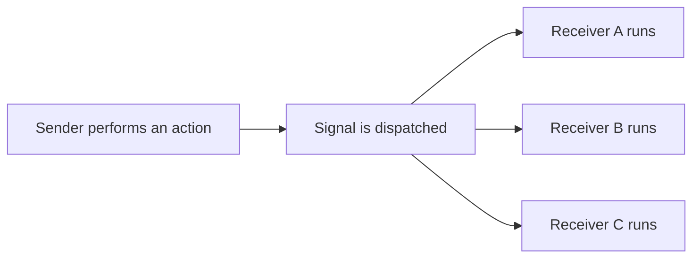
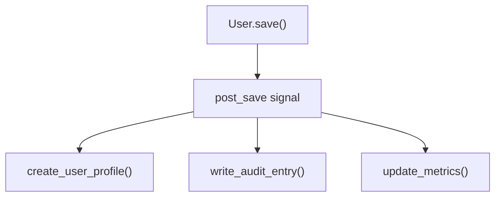
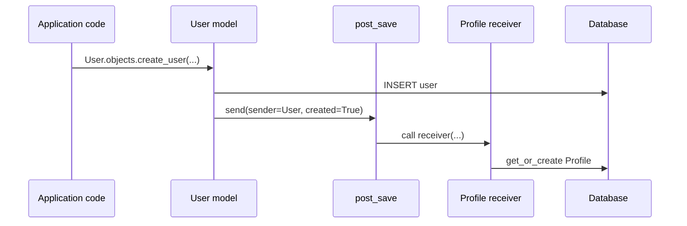
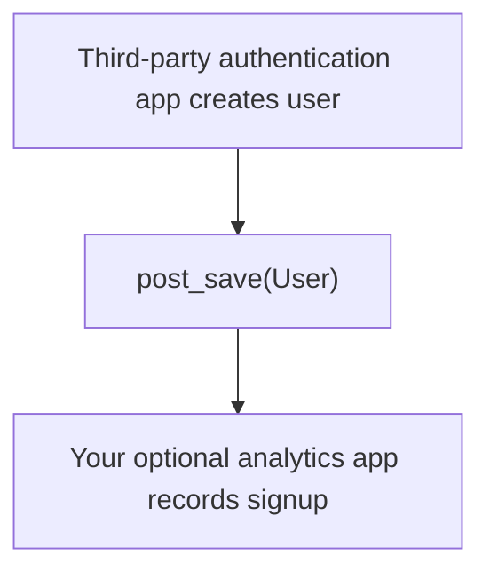
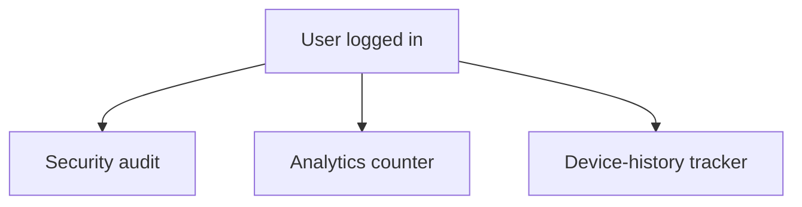
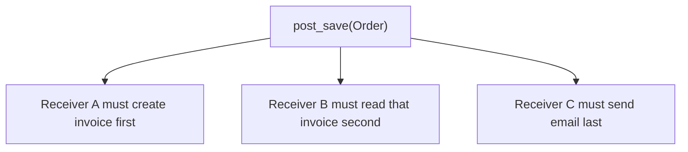
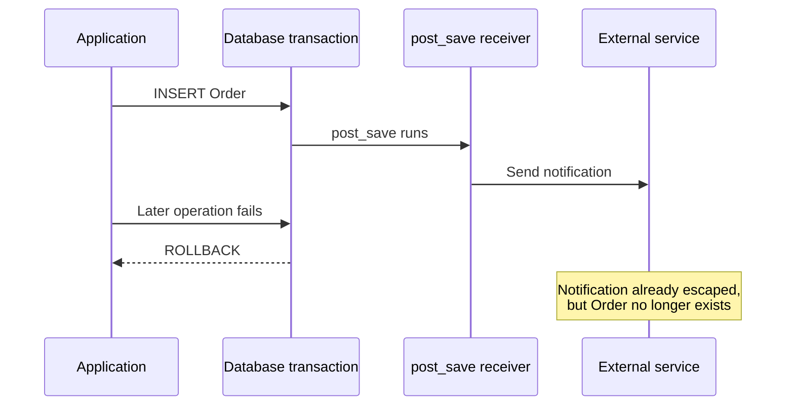
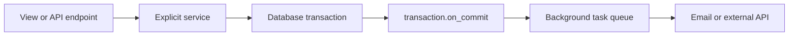
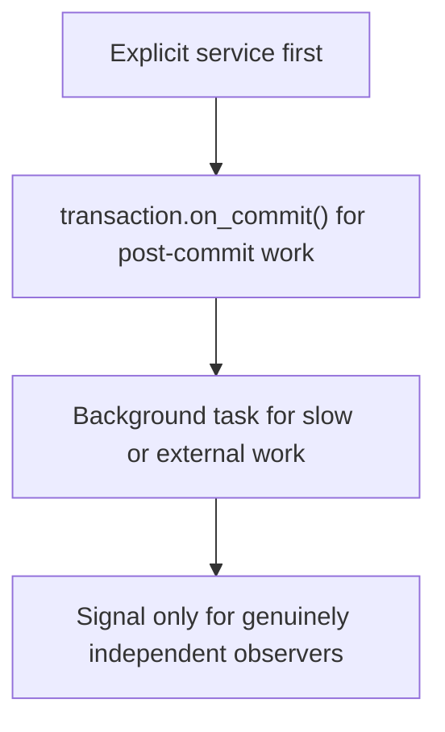
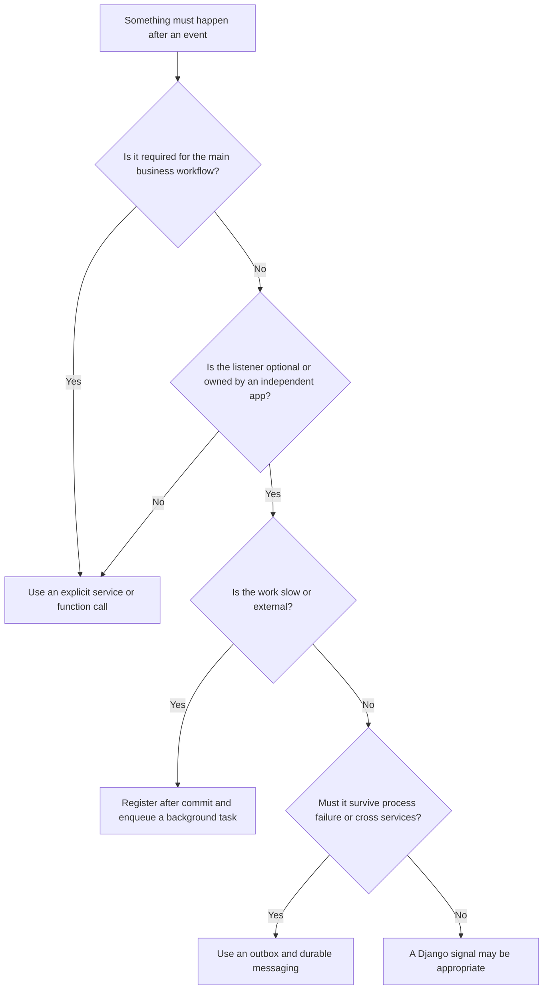

# Django Signals — and When NOT to Use Them

> A Django signal allows one part of an application to announce that an event happened, while one or more receiver functions react to that event.
>
> Signals are helpful when the sender should not know who is listening. However, they create an **implicit execution path**, so normal function calls or a service layer are usually better for important business workflows.
> [!NOTE]
> This guide was verified against the Django 6.0 documentation. As of July 25, 2026, the latest official Django release is **6.0.7**, while **5.2** is the currently supported LTS series.

## In short

- A signal is publish/subscribe inside one process: a sender announces that an event happened, receivers react, and neither side knows the other exists.
- The built-ins that matter are `pre_save`/`post_save`, `pre_delete`/`post_delete`, `m2m_changed`, `request_started`/`request_finished`, and `pre_migrate`/`post_migrate`.
- Receivers are connected in `AppConfig.ready()` by importing a `signals` module, using `@receiver(post_save, sender=Model)` plus a `dispatch_uid` so a re-import cannot register the same handler twice.
- Receivers run **synchronously**, inside the sender's transaction, so a slow receiver blocks the save and a failing one breaks it — defer external side effects with `transaction.on_commit()`.
- `QuerySet.update()`, `bulk_create()` and `bulk_update()` bypass `Model.save()`, so they do **not** fire `pre_save` or `post_save`.
- Signals hide the execution path from whoever called `save()`, so important business workflows belong in an explicit service layer, not in a receiver.



**Interview answer:** Signals are Django's in-process observer hook — `post_save`, `post_delete`, `m2m_changed` and the auth/request signals let an independent app react to a lifecycle event without the sender importing it, with receivers wired up by importing a `signals` module from `AppConfig.ready()`. I reach for them at extension boundaries: auditing, metrics, cache invalidation, or reacting to a model owned by a third-party app. I avoid them for core business workflows, for anything where receiver order matters, for slow or external work, and for behavior that must also happen under `bulk_create()` or `QuerySet.update()` — those belong in an explicit service function where the sequence is visible and testable.

**Gotcha:** `post_save` fires while the surrounding transaction is still open, so a receiver that sends the email or enqueues the Celery task can fire for an order that is about to roll back — and the worker may pick the job up before the row is even visible. Wrap every external side effect in `transaction.on_commit()`.

---

## 1. What Is a Django Signal?

A signal is an implementation of the **publish–subscribe** or **observer** pattern.

- A **sender** announces that something happened.
- A **signal** represents the type of event.
- A **receiver** listens for that event and runs some logic.

For example:

- A user account is created.
- Django sends the `post_save` signal.
- A receiver creates a related profile.

The sender does not directly call the receiver.



This creates loose coupling between the sender and receivers, but it also hides the execution flow from the code that performs `User.save()`.

---

## 2. The Signal Mental Model

Think of a signal as an internal announcement: `"An Order was created. Anyone interested may react now."`

The sender does not know:

- how many receivers exist;
- which modules contain them;
- what order-dependent business behavior they perform;
- whether a receiver will make database queries or call an external service.

That independence is the main benefit of signals. It is also their main risk.

> [!IMPORTANT]
> Use signals for **event notification**. Avoid using them as a hidden replacement for an explicit business workflow.

---

## 3. Main Parts of a Signal

### 3.1 Sender

The sender is the object or class that dispatched the signal.

For model signals, the sender is normally the model class:

```python
@receiver(post_save, sender=Order)
def order_saved(sender, instance, **kwargs):
    ...
```

Here, `sender` is the `Order` class.

### 3.2 Signal

The signal represents the event being announced.

Examples:

```python
from django.db.models.signals import post_save, post_delete, m2m_changed
```

### 3.3 Receiver

A receiver is a function or method connected to a signal.

Every receiver should accept:

```python
def receiver_function(sender, **kwargs):
    ...
```

Django signals may add keyword arguments over time, so receivers should accept `**kwargs` even when they do not currently use every argument.

### 3.4 Connection

A receiver can be connected in two common ways. Using the `@receiver` decorator:

```python
from django.db.models.signals import post_save
from django.dispatch import receiver

@receiver(post_save, sender=Order)
def handle_order_save(sender, instance, **kwargs):
    ...
```

Or by calling `connect()` manually: `post_save.connect(handle_order_save, sender=Order)`

The decorator is usually easier to read for application-level receivers.

---

## 4. Frequently Used Built-in Signals

### 4.1 Model Signals

| Signal | Trigger point | Common use |
|---|---|---|
| `pre_init` | At the beginning of model initialization | Rarely needed; inspecting constructor input |
| `post_init` | After model initialization | Rarely needed; avoid database queries here |
| `pre_save` | Before `Model.save()` completes | Validate or prepare data before persistence |
| `post_save` | After `Model.save()` completes | React to creation or update |
| `pre_delete` | Before model or queryset deletion | Capture information before removal |
| `post_delete` | After deletion | Remove associated external resources |
| `m2m_changed` | A many-to-many relation changes | React to add, remove, or clear operations |
| `pre_migrate` | Before migrations run | Framework or reusable-app setup logic |
| `post_migrate` | After migrations run | Create default permissions or initial metadata |

### 4.2 Request Signals

| Signal | Trigger point |
|---|---|
| `request_started` | Django begins processing a request |
| `request_finished` | Django finishes processing a request |
| `got_request_exception` | Request processing raises an exception |

Request signals are generally more useful for framework-level instrumentation than normal application business logic. Middleware is often clearer when behavior belongs directly to the HTTP request/response cycle.

### 4.3 Authentication Signals

| Signal | Trigger point |
|---|---|
| `user_logged_in` | A user successfully logs in |
| `user_logged_out` | A user logs out |
| `user_login_failed` | Login credentials are rejected |

Typical uses include security auditing, login analytics, or updating a `last_seen` record.

---

## 5. Recommended Project Structure

Keep receivers in a dedicated `signals.py` module.

```text
accounts/
├── __init__.py
├── apps.py
├── models.py
├── signals.py
└── tests/
    └── test_signals.py
```

### 5.1 Register Receivers in `AppConfig.ready()`

```python
# accounts/apps.py

from django.apps import AppConfig

class AccountsConfig(AppConfig):
    default_auto_field = "django.db.models.BigAutoField"
    name = "accounts"

    def ready(self) -> None:
        # Importing the module connects functions decorated with @receiver.
        from . import signals  # noqa: F401
```

Django automatically discovers a single `AppConfig` in `apps.py` for a normal application configuration. Projects may also register it explicitly:

```python
# settings.py

INSTALLED_APPS = [
    # ...
    "accounts.apps.AccountsConfig",
]
```

> [!WARNING]
> `ready()` is for initialization such as signal registration. Do not run normal database queries in it. The method runs during the startup of management commands, including tests and migrations.

---

## 6. Practical `post_save` Example

Suppose the `accounts` app owns a profile model that should exist for each user.

### 6.1 Profile Model

```python
# accounts/models.py

from django.conf import settings
from django.db import models

class Profile(models.Model):
    user = models.OneToOneField(
        settings.AUTH_USER_MODEL,
        on_delete=models.CASCADE,
        related_name="profile",
    )
    display_name = models.CharField(max_length=120, blank=True)

    def __str__(self) -> str:
        return self.display_name or str(self.user)
```

### 6.2 Receiver

```python
# accounts/signals.py

from django.conf import settings
from django.db.models.signals import post_save
from django.dispatch import receiver

from .models import Profile

@receiver(
    post_save,
    sender=settings.AUTH_USER_MODEL,
    dispatch_uid="accounts.create_profile_for_new_user",
)
def create_profile_for_new_user(
    sender,
    instance,
    created: bool,
    raw: bool,
    using: str,
    **kwargs,
) -> None:
    if raw or not created:
        return

    Profile.objects.using(using).get_or_create(user_id=instance.pk)
```

### 6.3 Execution Flow



### 6.4 Why This Receiver Is Defensive

The receiver checks `created` so it only reacts to a new user.

It checks `raw` because fixture loading may save data while the database is not yet in a fully consistent state.

It uses `get_or_create()` so the operation is idempotent. Running the receiver again should not create duplicate profiles.

It uses the `using` database alias, which is important in multi-database projects.

> [!IMPORTANT]
> Even this common example should be evaluated carefully. When your own user-creation workflow always owns profile creation, an explicit service function can be clearer. A signal is more reasonable when the profile app is an independent extension reacting to the user model lifecycle.

---

## 7. Important Receiver Arguments

For `post_save`, the most useful arguments are:

```python
@receiver(post_save, sender=Order)
def order_saved(
    sender,
    instance,
    created,
    raw,
    using,
    update_fields,
    **kwargs,
):
    ...
```

### 7.1 `instance`

The actual model object that was saved.

```python
instance.id
instance.status
```

### 7.2 `created`

`True` when Django inserted a new row; otherwise `False`.

```python
if created:
    # New object
    ...
else:
    # Existing object was saved
    ...
```

### 7.3 `raw`

`True` when the model is saved exactly as supplied, such as during fixture loading.

Receivers should normally avoid querying or changing related rows when `raw=True`.

### 7.4 `using`

The database alias used for the save.

```python
AuditLog.objects.using(using).create(...)
```

### 7.5 `update_fields`

A set of fields explicitly supplied to `save(update_fields=...)`, or `None`.

```python
if update_fields is not None and "status" not in update_fields:
    return
```

This can reduce unnecessary work, but it does **not** tell you whether the field value actually changed. For reliable change tracking, compare persisted state explicitly or model the transition through a service function.

---

## 8. `m2m_changed` Example

A normal `post_save` receiver does not describe changes made to a many-to-many relation. Use `m2m_changed` for that relation.

```python
# teams/models.py

from django.conf import settings
from django.db import models

class Team(models.Model):
    name = models.CharField(max_length=120)
    members = models.ManyToManyField(
        settings.AUTH_USER_MODEL,
        related_name="teams",
    )
```

```python
# teams/signals.py

from django.db.models.signals import m2m_changed
from django.dispatch import receiver

from .models import Team

@receiver(
    m2m_changed,
    sender=Team.members.through,
    dispatch_uid="teams.track_member_changes",
)
def track_team_member_changes(
    sender,
    instance: Team,
    action: str,
    reverse: bool,
    model,
    pk_set,
    using: str,
    **kwargs,
) -> None:
    if action == "post_add":
        added_user_ids = pk_set or set()
        # Write a lightweight audit record or update a metric.
        print(f"Added users {added_user_ids} to team {instance.pk}")
```

Common `action` values include:

- `pre_add` and `post_add`;
- `pre_remove` and `post_remove`;
- `pre_clear` and `post_clear`.

Use this signal only when the relation change genuinely needs an independent observer. An explicit `add_members_to_team()` service is clearer when the relation change is part of an important workflow.

---

## 9. When Signals Are a Good Choice

Signals are most useful when the sender should remain unaware of optional listeners.

### 9.1 Extending a Reusable or Third-Party App

You may not control the code that creates or updates the model, but you still need to react to its lifecycle.

Example:



### 9.2 Multiple Independent Observers

A single event may be relevant to several independent modules:



None of these observers is required to complete authentication itself.

### 9.3 Cross-Cutting, Non-Critical Reactions

Examples:

- audit metadata;
- internal metrics;
- cache invalidation after commit;
- lightweight synchronization with an optional module;
- cleanup of an external file after a model is deleted.

The reaction should be small, understandable, testable, and safe to run more than once.

### 9.4 Framework or Plugin Extension Points

Custom signals can be appropriate in reusable libraries where unknown applications may register receivers.

The library publishes an event without depending on project-specific code.

---

## 10. When NOT to Use Signals

Django signals can make code difficult to understand because the caller does not show what will happen next.

### 10.1 Do Not Hide Core Business Workflows

Avoid this:

```python
# views.py
order = Order.objects.create(customer=request.user)

# Hidden somewhere else:
# - reserve inventory
# - create invoice
# - charge payment method
# - send confirmation
```

A developer reading the view sees only order creation, not the complete business process.

Prefer an explicit service:

```python
# orders/services.py

from dataclasses import dataclass
from functools import partial

from django.db import transaction

from .models import Order
from .tasks import send_order_confirmation

@dataclass(frozen=True)
class PlaceOrderResult:
    order: Order

@transaction.atomic
def place_order(*, customer, items) -> PlaceOrderResult:
    order = Order.objects.create(customer=customer)

    reserve_inventory(order=order, items=items)
    create_invoice(order=order)

    transaction.on_commit(
        partial(send_order_confirmation.delay, order.pk)
    )

    return PlaceOrderResult(order=order)
```

Now the workflow is visible, ordered, and easier to test.

### 10.2 Do Not Use Signals When Execution Order Matters

Receivers may run in registration order, but application correctness should not depend on hidden receiver ordering.

Bad design:



Use one explicit orchestration function instead.

### 10.3 Do Not Use Signals for Long-Running Work

A normal signal receiver runs inside the current process. It does not automatically become a background job.

Avoid doing this directly in a receiver:

- sending a large email campaign;
- generating a PDF report;
- processing video or images;
- calling a slow external API;
- performing expensive analytics.

Use a background worker such as Celery, RQ, Dramatiq, or another job system. Enqueue the task only after a successful database commit.

### 10.4 Do Not Use Signals for Database Invariants

If data must always satisfy a rule, prefer:

- database constraints;
- model validation where appropriate;
- explicit domain services;
- transaction boundaries;
- permission checks in the correct application layer.

A signal is not a strong replacement for a database `UniqueConstraint`, `CheckConstraint`, foreign key, or transaction.

### 10.5 Do Not Use Signals to Modify the Same Instance Repeatedly

This receiver can recurse:

```python
@receiver(post_save, sender=Document)
def update_document(sender, instance, **kwargs):
    instance.processed = True
    instance.save()  # Sends post_save again.
```

Even with a condition, this pattern can create extra queries and fragile behavior.

Prefer setting the value before the original save or using an explicit service. A direct queryset update may avoid recursion, but remember that it bypasses model `save()` and save signals: `Document.objects.filter(pk=instance.pk).update(processed=True)`

Use that deliberately, not as a hidden workaround.

### 10.6 Do Not Rely on Save Signals for Bulk Operations

Operations such as these do not call each model instance's `save()` method and do not emit `pre_save` or `post_save` for each object:

```python
Product.objects.filter(active=False).update(active=True)
Product.objects.bulk_create(products)
Product.objects.bulk_update(products, ["price"])
```

If your system depends on signals, bulk operations may silently skip required behavior.

This is a strong reason not to place critical business correctness inside save signals.

### 10.7 Do Not Use Signals When Both Sides Are in the Same Workflow

When the sender and receiver are both project code and the caller already knows what must happen, call the function directly.

```python
order = create_order(...)
write_order_audit(order=order)
update_customer_summary(customer=order.customer)
```

This is easier to navigate, debug, and refactor than a hidden signal chain.

### 10.8 Do Not Treat Signals as Distributed Events

Django signals are in-process notifications. They are not a durable message broker.

They do not provide, by themselves:

- delivery after process failure;
- cross-service communication;
- durable retries;
- replay;
- dead-letter queues;
- exactly-once processing.

For reliable integration events, use a transactional outbox pattern plus a message broker or task queue.

---

## 11. Signals and Database Transactions

A `post_save` receiver runs after `Model.save()` finishes, but an outer transaction may still roll back later.



This can produce inconsistent side effects.

### 11.1 Use `transaction.on_commit()`

```python
from functools import partial

from django.db import transaction
from django.db.models.signals import post_save
from django.dispatch import receiver

from .models import Order
from .tasks import send_order_confirmation

@receiver(
    post_save,
    sender=Order,
    dispatch_uid="orders.enqueue_confirmation_after_commit",
)
def enqueue_confirmation_after_commit(
    sender,
    instance: Order,
    created: bool,
    using: str,
    **kwargs,
) -> None:
    if not created:
        return

    transaction.on_commit(
        partial(send_order_confirmation.delay, instance.pk),
        using=using,
    )
```

The callback runs only after the surrounding transaction commits successfully.

> [!IMPORTANT]
> `on_commit()` solves transaction timing; it does not solve the hidden-control-flow problem. For core workflows, the clearer design is usually to register the callback inside the explicit service that creates the order.

---

## 12. Signals vs Service Layer vs Background Tasks

These concepts solve different problems.

| Mechanism | Main purpose | Execution visibility | Background execution | Durable by itself |
|---|---|---:|---:|---:|
| Direct function call | Explicit workflow step | High | No | No |
| Service layer | Coordinate business operations | High | No | No |
| Django signal | Notify unknown or independent listeners | Low | No | No |
| Task queue | Run work outside request process | Medium | Yes | Depends on configuration |
| Message broker/event bus | Cross-process or cross-service events | Medium | Yes | Usually designed for it |

### 12.1 Recommended Combination



Use a signal only when an independent module truly needs to observe the event without being called directly.

---

## 13. Custom Signals

A custom signal defines a project-specific event.

```python
# payments/signals.py

from django.dispatch import Signal

payment_captured = Signal()
```

Send it from the code that owns the event:

```python
# payments/services.py

from .signals import payment_captured

def capture_payment(*, payment):
    gateway_result = payment_gateway.capture(payment.gateway_id)

    payment.mark_captured(reference=gateway_result.reference)

    payment_captured.send(
        sender=capture_payment,
        payment=payment,
        gateway_result=gateway_result,
    )

    return payment
```

Receive it:

```python
from django.dispatch import receiver

from payments.signals import payment_captured

@receiver(payment_captured)
def record_payment_metric(sender, payment, **kwargs):
    ...
```

### 13.1 When a Custom Signal Is Reasonable

A custom signal is reasonable when:

- you are building a reusable package;
- external applications may add unknown receivers;
- receivers are optional extensions;
- the event is informative rather than the hidden controller of the main workflow.

### 13.2 When a Custom Signal Is Not Needed

When sender and receiver are both known project functions, use a direct call:

```python
payment.mark_captured(...)
record_payment_metric(payment=payment)
```

This makes dependencies visible.

### 13.3 `send()` vs `send_robust()`

```python
payment_captured.send(sender=PaymentService, payment=payment)
```

`send()` allows a receiver exception to propagate. Remaining receivers may not run.

```python
responses = payment_captured.send_robust(
    sender=PaymentService,
    payment=payment,
)
```

`send_robust()` catches receiver exceptions derived from `Exception`, continues notifying receivers, and returns the exception in the response list.

Use `send_robust()` only when continuing after one receiver fails matches the required behavior. Do not silently ignore returned errors.

---

## 14. Synchronous and Asynchronous Receivers

Django supports synchronous and asynchronous receiver functions.

### 14.1 Synchronous Receiver

```python
@receiver(payment_captured)
def update_metric(sender, payment, **kwargs):
    ...
```

### 14.2 Asynchronous Receiver

```python
@receiver(payment_captured)
async def publish_realtime_update(sender, payment, **kwargs):
    await realtime_client.publish(
        channel="payments",
        payload={"payment_id": payment.pk},
    )
```

Custom signals can be sent asynchronously:

```python
await payment_captured.asend(
    sender=PaymentService,
    payment=payment,
)
```

Robust asynchronous dispatch is also available:

```python
responses = await payment_captured.asend_robust(
    sender=PaymentService,
    payment=payment,
)
```

Django adapts sync receivers when a signal is sent asynchronously and adapts async receivers when a signal is sent synchronously. That adaptation has a small cost.

Async receivers are not automatically durable background tasks. The caller still waits for signal dispatch to complete unless separate job infrastructure is used.

Also, mixed sync and async receivers may be grouped by calling style, so do not design correctness around their registration order.

---

## 15. Common Technical Behaviors

### 15.1 Receivers Run in the Current Process

A receiver normally runs as part of the code that dispatched the signal.

If it is slow, the request, command, or job that triggered it becomes slow.

### 15.2 Receiver Exceptions Can Affect the Sender

With normal `send()` behavior, an unhandled receiver exception propagates to the caller.

That means an unrelated analytics receiver can fail an otherwise valid request unless errors are handled deliberately.

### 15.3 Weak References

Django stores signal handlers as weak references by default.

Module-level functions normally remain available. A locally defined receiver may be garbage-collected unless connected with `weak=False`: `my_signal.connect(local_receiver, weak=False)`

Prefer module-level receiver functions in normal Django applications.

### 15.4 Duplicate Registration

Module-level functions have stable identities, so reconnecting the same function is normally a no-op. Bound instance methods can be registered more than once when new instances are created.

Use `dispatch_uid` when duplicate registration is possible:

```python
post_save.connect(
    receiver_function,
    sender=Order,
    dispatch_uid="orders.receiver_function",
)
```

`AppConfig.ready()` may execute more than once in some test scenarios, so receiver registration should be idempotent.

### 15.5 Lazy Sender References

A model sender can be specified by application label:

```python
@receiver(post_save, sender="orders.Order")
def order_saved(sender, instance, **kwargs):
    ...
```

This can reduce circular imports and is useful for swappable models.

### 15.6 Signals Are Not Emitted by Every Data Change

Database changes may happen outside `Model.save()`:

- raw SQL;
- `QuerySet.update()`;
- `bulk_create()`;
- `bulk_update()`;
- database triggers;
- another service writing to the same database.

A model signal only observes the Django code paths that dispatch it.

---

## 16. Testing Signal Receivers

Test both the receiver logic and its integration with the signal.

### 16.1 Integration Test

```python
# accounts/tests/test_signals.py

import pytest
from django.contrib.auth import get_user_model

from accounts.models import Profile

@pytest.mark.django_db
def test_profile_is_created_for_new_user():
    user_model = get_user_model()

    user = user_model.objects.create_user(
        username="developer",
        password="not-used-in-assertion",
    )

    assert Profile.objects.filter(user=user).exists()
```

This confirms that registration and receiver behavior work together.

### 16.2 Test Idempotence

```python
@pytest.mark.django_db
def test_profile_receiver_does_not_create_duplicates():
    user_model = get_user_model()
    user = user_model.objects.create_user(username="developer")

    user.save()
    user.save()

    assert Profile.objects.filter(user=user).count() == 1
```

### 16.3 Test `on_commit()` Behavior

When testing code that registers `transaction.on_commit()` callbacks, use the testing utilities provided by Django or a transaction-aware test case. The important assertions are:

- no external task is queued before commit;
- the task is queued after a successful commit;
- the task is not queued after rollback.

### 16.4 Disconnecting a Receiver in a Focused Test

Occasionally, a test needs to isolate behavior from an installed receiver:

```python
from django.db.models.signals import post_save

post_save.disconnect(
    sender=Order,
    dispatch_uid="orders.enqueue_confirmation_after_commit",
)
```

Reconnect it during teardown, or use a context manager/fixture so test isolation remains reliable.

Avoid disabling signals globally for the entire test suite because integration tests should verify real application behavior.

---

## 17. Best Practices

### 17.1 Keep Receivers Small

A receiver should usually delegate to a clearly named function:

```python
@receiver(post_delete, sender=StoredDocument)
def document_deleted(sender, instance, **kwargs):
    schedule_file_cleanup(file_key=instance.file_key)
```

### 17.2 Make Receivers Idempotent

The same event may effectively be processed more than once because of retries, duplicate registration bugs, repeated saves, or operational recovery.

Prefer:

- `get_or_create()`;
- `update_or_create()` where appropriate;
- unique constraints;
- deduplication keys;
- status checks;
- safe task retries.

### 17.3 Filter Early

```python
if raw or not created:
    return
```

Avoid unnecessary queries and side effects.

### 17.4 Specify the Sender

Avoid listening to every model save unless that broad behavior is truly required.

```python
@receiver(post_save, sender=Order)
```

This is safer and more efficient than an unfiltered global model receiver.

### 17.5 Use `transaction.on_commit()` for External Side Effects

Apply it to:

- background task publishing;
- email scheduling;
- cache changes that must reflect committed data;
- external API calls;
- search indexing.

### 17.6 Log Enough Context

A receiver is an implicit execution path, so structured logs are especially useful:

```python
logger.info(
    "order_confirmation_enqueued",
    extra={"order_id": instance.pk, "database": using},
)
```

### 17.7 Avoid Database Queries in `pre_init` and `post_init`

These signals may execute for every instance returned during queryset iteration, creating severe performance problems.

### 17.8 Document Every Important Receiver

For each receiver, make clear:

- what dispatches it;
- whether it runs on create, update, delete, or relation change;
- whether it performs database or external I/O;
- whether it requires a committed transaction;
- whether bulk operations bypass it;
- how duplicate processing is prevented.

### 17.9 Prefer Explicit Services for Business-Critical Behavior

A useful rule:

> If the system would be incorrect when the receiver does not run,  
> consider making the operation an explicit workflow step.

### 17.10 Treat Signals as an Architectural Boundary

Signals are most valuable at extension boundaries, not as a way to avoid organizing normal application code. The practical default order of preference is:



---

## 18. Decision Guide



Before adding a signal, ask:

1. Can I call this function directly?
2. Is this behavior required for business correctness?
3. Will a developer understand the workflow by reading the caller?
4. Could `QuerySet.update()` or a bulk operation bypass it?
5. Could the surrounding transaction roll back?
6. Is the receiver fast and idempotent?
7. Does execution order matter?
8. Is this really an in-process event, or do I need durable messaging?

If several answers indicate hidden coupling or reliability concerns, do not use a signal.

---

## Official References

- [Django 6.0 — Signals topic guide](https://docs.djangoproject.com/en/6.0/topics/signals/)
- [Django 6.0 — Built-in signal reference](https://docs.djangoproject.com/en/6.0/ref/signals/)
- [Django 6.0 — Application configuration and `AppConfig.ready()`](https://docs.djangoproject.com/en/6.0/ref/applications/)
- [Django 6.0 — Database transactions and `on_commit()`](https://docs.djangoproject.com/en/6.0/topics/db/transactions/)
- [Django 6.0 — QuerySet API](https://docs.djangoproject.com/en/6.0/ref/models/querysets/)
- [Django download and supported versions](https://www.djangoproject.com/download/)
