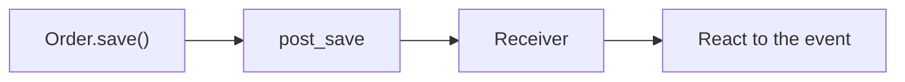
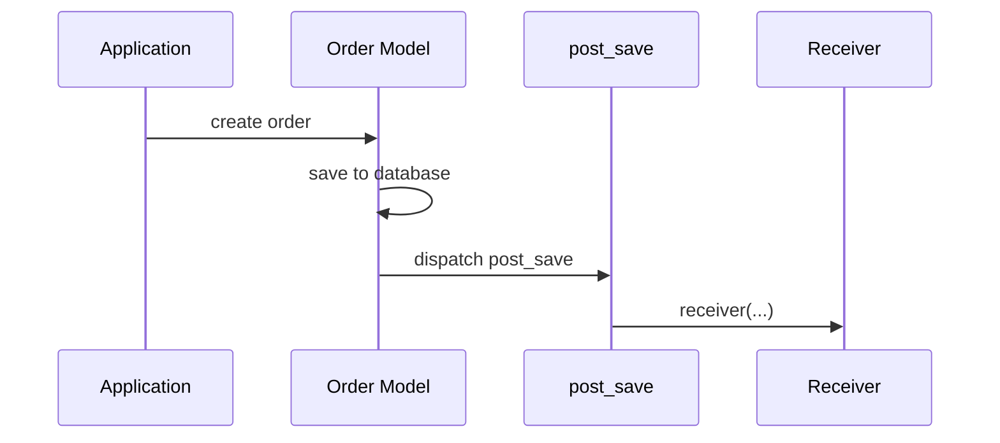
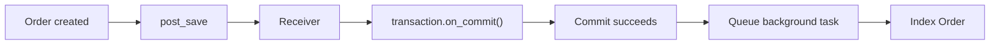
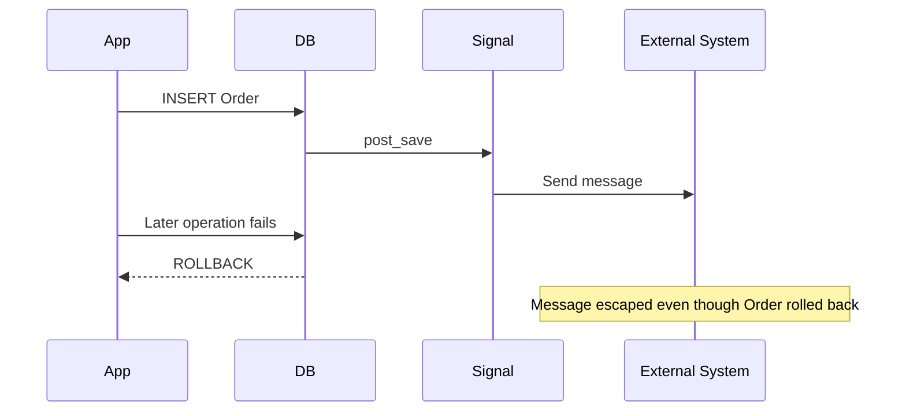
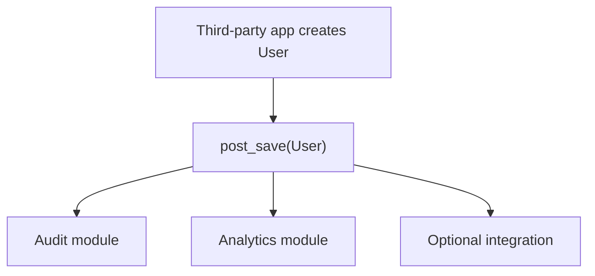
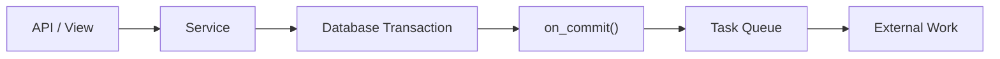
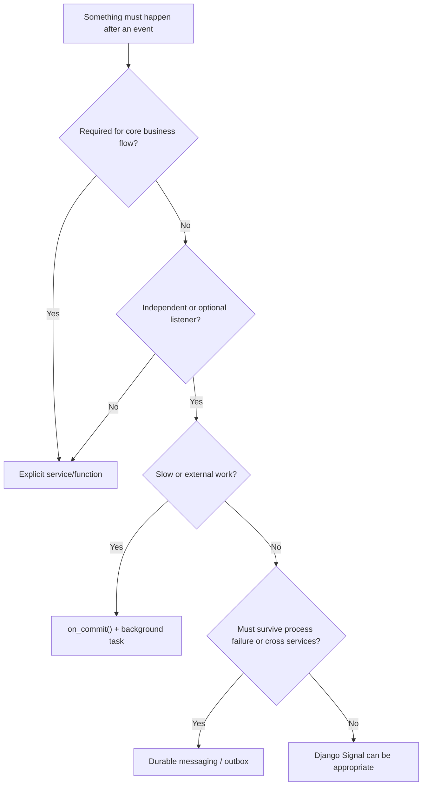

# Django Signals — and When NOT to Use Them

> A **Django signal** allows one part of an application to announce that an event happened, while another part reacts to that event.

Signals implement an **observer / publish-subscribe style pattern** inside a Django application.

They are useful when the code producing an event should **not need to know which components are listening**. However, signals create an **implicit execution path**, so they should not replace normal function calls or a service layer for important business workflows.

> [!NOTE]
> Verified against **Django 6.1**, released on August 5, 2026. Django 6.1 is the current stable feature release.

---

## Index

1. What Is a Django Signal?
2. How Signals Work
3. Frequently Used Built-in Signals
4. Registering Signals Properly
5. Practical `post_save` Example
6. Important Receiver Arguments
7. Signals and Database Transactions
8. When to Use Signals
9. When NOT to Use Signals
10. Signals vs Service Layer vs Background Tasks
11. Custom and Async Signals
12. Best Practices
13. Quick Decision Guide

---

## 1. What Is a Django Signal?

A signal has three main parts:

- **Sender** — the object that announces something happened.
- **Signal** — represents the type of event.
- **Receiver** — function that reacts to the event.

For example:

```text
Order saved
    ↓
post_save
    ↓
Receiver
    ↓
Schedule search indexing
```



The important point is that `Order.save()` does **not directly call the receiver**.

Django describes signals as a mechanism that lets decoupled applications receive notifications about actions elsewhere in the framework. Django also warns that signals can make code harder to understand and recommends direct function calls when possible.

---

## 2. How Signals Work

Suppose an `Order` is created.

```python
order = Order.objects.create(customer=user)
```

Django performs roughly this flow:



The application creating the order does not need to know which receivers exist.

### Why this is useful

A separate module can react to the event without changing the original code.

Typical examples include:

- audit logging;
- metrics;
- cache invalidation;
- optional integrations;
- reacting to models owned by another Django application.

### Why this can be dangerous

When you read:

```python
order.save()
```

you cannot immediately see all the other logic that may execute because of registered receivers.

That hidden execution flow is the main reason signals should be used carefully.

---

## 3. Frequently Used Built-in Signals

### 3.1 Model Signals

| Signal | Runs |
|---|---|
| `pre_save` | Before `Model.save()` finishes |
| `post_save` | After `Model.save()` finishes |
| `pre_delete` | Before an object is deleted |
| `post_delete` | After an object is deleted |
| `m2m_changed` | When a many-to-many relationship changes |
| `pre_init` | Before model initialization |
| `post_init` | After model initialization |

For normal development, the most important ones are:

```text
pre_save
post_save
pre_delete
post_delete
m2m_changed
```

### 3.2 Request Signals

Django also provides:

```text
request_started
request_finished
got_request_exception
```

These are more useful for framework-level instrumentation.

For logic directly related to the HTTP request/response lifecycle, **middleware is usually clearer**.

### 3.3 Authentication Signals

Common authentication signals include:

```text
user_logged_in
user_logged_out
user_login_failed
```

Typical uses are:

- authentication auditing;
- security monitoring;
- login analytics.

---

## 4. Registering Signals Properly

A common project structure is:

```text
orders/
├── __init__.py
├── apps.py
├── models.py
├── services.py
├── signals.py
└── tests/
```

Keep receivers in `signals.py`.

### 4.1 Receiver

```python
# orders/signals.py

from django.db.models.signals import post_save
from django.dispatch import receiver

from .models import Order


@receiver(post_save, sender=Order)
def order_saved(sender, instance, created, **kwargs):
    if not created:
        return

    # React to newly created order.
```

### 4.2 Load Receivers from `AppConfig.ready()`

```python
# orders/apps.py

from django.apps import AppConfig


class OrdersConfig(AppConfig):
    name = "orders"

    def ready(self):
        from . import signals  # noqa: F401
```

> [!IMPORTANT]
> `ready()` is for application initialization. Avoid normal application database queries inside it.

### `dispatch_uid`

You may also provide:

```python
@receiver(
    post_save,
    sender=Order,
    dispatch_uid="orders.order_saved",
)
def order_saved(sender, instance, created, **kwargs):
    ...
```

`dispatch_uid` is useful when there is a real possibility of registering logically identical receivers more than once.

It is not mandatory for every normal module-level receiver; Django already prevents the same stable receiver object from being connected repeatedly.

---

## 5. Practical `post_save` Example

Suppose newly created orders must be indexed by an external search system.

Search indexing is **not required to create the order itself**, so an independent listener can be reasonable.

```python
# orders/signals.py

from functools import partial

from django.db import transaction
from django.db.models.signals import post_save
from django.dispatch import receiver

from .models import Order
from .tasks import index_order


@receiver(
    post_save,
    sender=Order,
    dispatch_uid="orders.index_new_order",
)
def index_new_order(
    sender,
    instance,
    created,
    raw,
    using,
    **kwargs,
):
    if raw or not created:
        return

    transaction.on_commit(
        partial(index_order.delay, instance.pk),
        using=using,
    )
```

### Execution Flow



### Why this is a reasonable signal

The search-index integration is:

- independent from order creation;
- not responsible for core transaction correctness;
- executed outside the request through a task;
- queued only after the database transaction commits.

The receiver is also small and easy to understand.

---

## 6. Important Receiver Arguments

For `post_save`, you commonly see:

```python
@receiver(post_save, sender=Order)
def order_saved(
    sender,
    instance,
    created,
    raw,
    using,
    update_fields,
    **kwargs,
):
    ...
```

### 6.1 `sender`

The class that dispatched the signal.

### 6.2 `instance`

The actual model object.

```python
instance.pk
instance.status
```

### 6.3 `created`

For `post_save`:

```python
if created:
    # INSERT
else:
    # Existing object was saved
```

### 6.4 `raw`

May be `True` when data is being loaded in a raw state, such as fixture loading.

```python
if raw:
    return
```

### 6.5 `using`

The database alias used for the operation. This matters in multi-database applications.

### 6.6 `update_fields`

If code calls:

```python
order.save(update_fields=["status"])
```

then `update_fields` can help a receiver avoid unnecessary work.

```python
if update_fields is not None and "status" not in update_fields:
    return
```

However, this tells you which fields were requested for updating — **not whether the value actually changed**.

---

## 7. Signals and Database Transactions

A `post_save` signal means the model's `save()` operation completed, but an **outer database transaction may still be open**.

```python
with transaction.atomic():
    order = Order.objects.create(...)

    # post_save receiver runs here.

    perform_another_operation()  # Raises exception.
```

Possible flow:



This is dangerous for things like:

- emails;
- Celery tasks;
- webhooks;
- external API calls;
- search indexing.

### Use `transaction.on_commit()`

```python
transaction.on_commit(
    lambda: send_order_confirmation.delay(order.pk)
)
```

The callback runs after the transaction successfully commits.

> `on_commit()` fixes transaction timing. It does **not** make hidden signal-based workflows easier to understand.

For core business workflows, registering the callback inside an explicit service is often better.

---

## 8. When to Use Signals

Signals work best for **independent observers**.

### Good use cases

```text
✓ Audit events
✓ Metrics
✓ Cache invalidation
✓ Optional integrations
✓ Third-party model lifecycle hooks
✓ Framework/plugin extension points
```

### Example Architecture



> Use signals when the **sender should not need to know who is listening**.

---

## 9. When NOT to Use Signals

### 9.1 Core Business Workflows

Avoid hiding workflows like:

```text
Create Order
   ↓
Reserve Inventory
   ↓
Charge Payment
   ↓
Create Invoice
   ↓
Send Confirmation
```

Instead, make the workflow explicit:

```python
@transaction.atomic
def place_order(*, customer, items):
    order = create_order(customer=customer)

    reserve_inventory(order=order, items=items)
    create_invoice(order=order)
    charge_payment(order=order)

    transaction.on_commit(
        lambda: send_confirmation.delay(order.pk)
    )

    return order
```

### 9.2 When Execution Order Matters

Do not design dependent steps as separate receivers.

```text
post_save
├── Receiver A → create invoice
├── Receiver B → requires invoice
└── Receiver C → send confirmation
```

If B depends on A and C depends on B, use one explicit orchestration function.

### 9.3 Long-Running Work

A signal is **not automatically a background job**.

Avoid directly doing large PDF generation, image processing, slow HTTP API calls, heavy email operations, or analytics inside a receiver.

```text
Signal / Service
      ↓
transaction.on_commit()
      ↓
Celery / Task Queue
      ↓
Worker
```

### 9.4 Database Invariants

Do not use signals as the primary mechanism for rules the database must always enforce.

Prefer:

```text
UniqueConstraint
CheckConstraint
ForeignKey
Transactions
Database constraints
```

### 9.5 Updating the Same Instance from `post_save`

This can cause recursion:

```python
@receiver(post_save, sender=Document)
def document_saved(sender, instance, **kwargs):
    instance.processed = True
    instance.save()
```

Calling `save()` triggers `post_save` again.

### 9.6 Bulk Operations

```python
Product.objects.filter(active=False).update(active=True)
Product.objects.bulk_create(products)
Product.objects.bulk_update(products, ["price"])
```

These operations do not call individual model `save()` methods, so `pre_save` and `post_save` are not emitted.

> Never put critical business correctness in a save signal if your application may use bulk updates.

---

## 10. Signals vs Service Layer vs Background Tasks

| Mechanism | Purpose | Execution flow |
|---|---|---|
| Direct function | Perform a known operation | Explicit |
| Service layer | Coordinate business workflow | Explicit |
| Django signal | Notify independent listeners | Implicit |
| Task queue | Run work outside current process/request | Async/background |
| Message broker | Durable cross-process/service communication | Distributed |

### Recommended Flow



---

## 11. Custom and Async Signals

### 11.1 Custom Signals

```python
from django.dispatch import Signal

payment_captured = Signal()
```

Send it:

```python
payment_captured.send(
    sender=PaymentService,
    payment=payment,
)
```

Receive it:

```python
@receiver(payment_captured)
def record_payment_metric(sender, payment, **kwargs):
    ...
```

Custom signals are most useful for reusable Django applications, plugins, and extension points where receiver implementations are unknown.

### 11.2 `send()` vs `send_robust()`

```python
payment_captured.send(...)
```

If a receiver raises an exception, that exception propagates.

```python
responses = payment_captured.send_robust(...)
```

`send_robust()` catches receiver exceptions derived from `Exception`, continues notifying other receivers, and includes failures in its returned response list.

### 11.3 Async Receivers

Modern Django supports async receiver functions:

```python
@receiver(payment_captured)
async def payment_event(sender, payment, **kwargs):
    await publish_update(payment.pk)
```

Custom signals may also be dispatched asynchronously:

```python
await payment_captured.asend(
    sender=PaymentService,
    payment=payment,
)
```

> [!IMPORTANT]
> An `async def` receiver is **not the same as a durable background task**. Use Celery or another task system when work must run independently or be retried reliably.

---

## 12. Best Practices

### Keep Receivers Small

```python
@receiver(post_delete, sender=Document)
def document_deleted(sender, instance, **kwargs):
    schedule_file_cleanup(instance.file_key)
```

### Filter Early

```python
if raw or not created:
    return
```

### Specify the Sender

```python
@receiver(post_save, sender=Order)
```

### Make Operations Idempotent

Useful techniques include:

```text
get_or_create()
update_or_create()
unique constraints
deduplication keys
status checks
safe task retries
```

### Use `on_commit()` for External Side Effects

Especially for task publishing, emails, external APIs, search indexing, and cache changes that must reflect committed data.

### Avoid Queries in `pre_init` / `post_init`

These signals may execute while many model instances are being constructed, so database queries inside them can introduce serious performance problems.

---

## 13. Quick Decision Guide



A practical default is:

```text
1. Direct function call
        ↓
2. Service layer
        ↓
3. transaction.on_commit()
        ↓
4. Background task when required
        ↓
5. Signal for genuinely independent observers
```

### Final Mental Model

> **Signals are notification hooks, not workflow engines.**

Use them when one part of the system needs to announce:

> “This event happened.”

and independent modules may react.

Avoid them when the real requirement is:

> “These business steps must happen in this exact order.”

For that case, use an explicit service or orchestration function.
