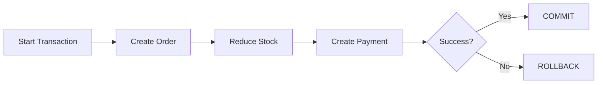
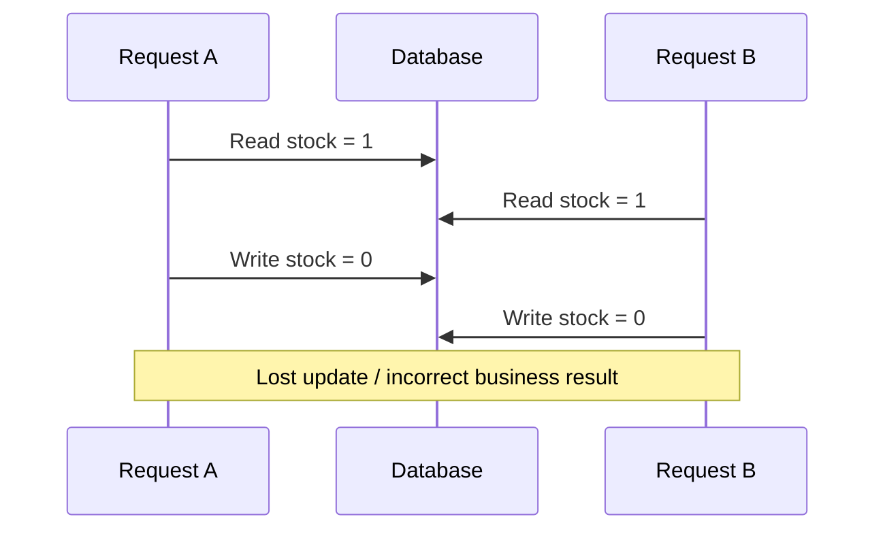
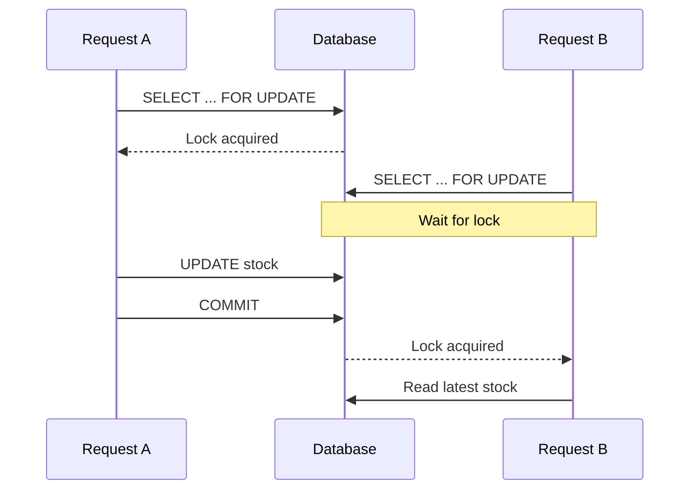
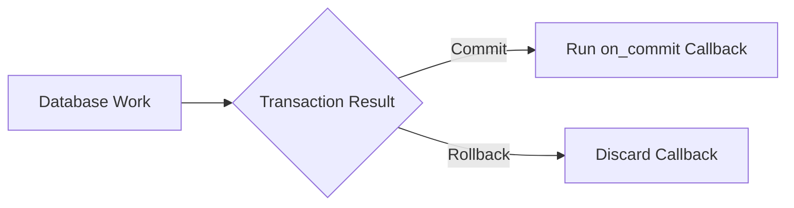
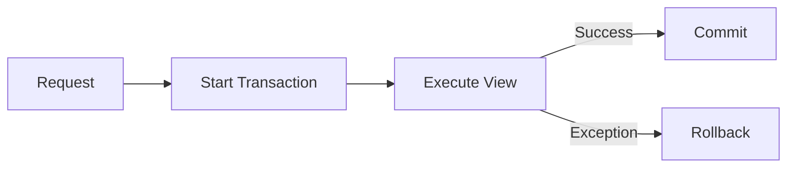
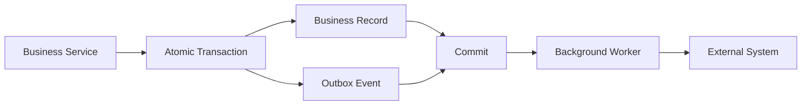
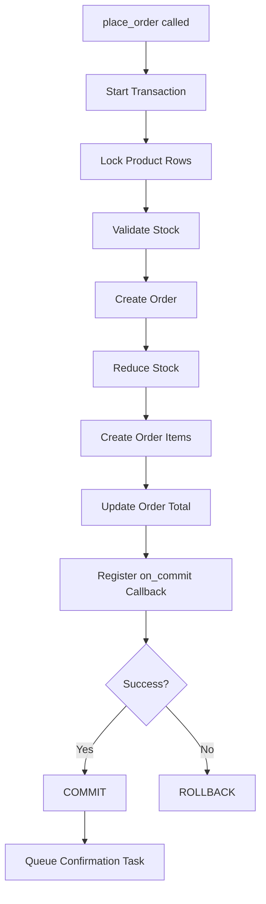
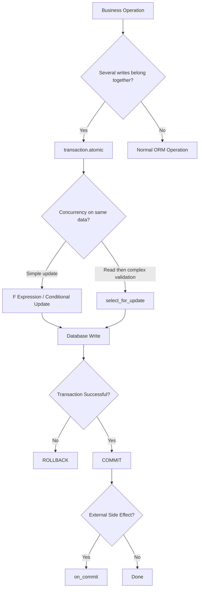

# Django Transactions: `transaction.atomic()`

> A **database transaction** groups related database operations into one unit: either **all operations succeed**, or **all database changes are rolled back**.

Django uses **autocommit mode by default**, meaning each query is committed immediately unless it runs inside a transaction. `transaction.atomic()` gives you an explicit transaction boundary.

---

## Index

1. Why Transactions Are Needed
2. How `transaction.atomic()` Works
   - Autocommit
   - Context Manager
   - Decorator
   - Commit and Rollback
3. Nested Transactions and Savepoints
   - Exception Handling
   - `durable=True`
4. Transactions and Concurrency
   - `select_for_update()`
   - `F()` Expressions
5. `transaction.on_commit()`
6. `ATOMIC_REQUESTS`
7. Async and Multiple Databases
8. Testing Transactions
9. Practical Order Example
10. Production Best Practices
11. Quick Reference

---

# 1. Why Transactions Are Needed

Consider placing an order:

```text
1. Create order
2. Reduce product stock
3. Create payment record
4. Create audit record
```

Without a transaction:

```text
Order created          ✓
Stock reduced          ✓
Payment creation       ✗
Audit record           Not executed

Database is now inconsistent.
```

With a transaction:

```text
BEGIN

Create order
Reduce stock
Create payment  → Error

ROLLBACK
```

The database returns to its previous state.



The main property provided here is **atomicity**:

```text
All changes succeed
        OR
No changes are permanently saved
```

However, a transaction alone does **not** automatically prevent concurrency problems such as two requests modifying the same row simultaneously.

---

# 2. How `transaction.atomic()` Works

Import it using:

```python
from django.db import transaction
```

The common API is:

```python
transaction.atomic(
    using=None,
    savepoint=True,
    durable=False,
)
```

Most application code only needs:

```python
with transaction.atomic():
    ...
```

Django supports `atomic()` as both a **context manager** and **decorator**. When the outermost block succeeds, Django commits the transaction; if an exception leaves the block, Django rolls it back. Nested blocks normally create savepoints instead of independent transactions.

---

## 2.1 Autocommit

Django normally runs in **autocommit mode**.

```python
product = Product.objects.create(name="Keyboard")

product.stock = 10
product.save()
```

Conceptually:

```text
INSERT product → COMMIT
UPDATE product → COMMIT
```

If the second operation fails, the first one is normally already committed.

With `atomic()`:

```python
with transaction.atomic():
    product = Product.objects.create(name="Keyboard")

    product.stock = 10
    product.save(update_fields=["stock"])
```

Conceptually:

```text
BEGIN

INSERT product
UPDATE product

COMMIT
```

If an exception occurs:

```text
BEGIN
INSERT product
UPDATE product → ERROR

ROLLBACK
```

---

## 2.2 Context Manager

The context-manager form is usually the clearest because the transaction boundary is visible.

```python
def transfer_balance(sender, receiver, amount):
    with transaction.atomic():
        sender.balance -= amount
        sender.save(update_fields=["balance"])

        receiver.balance += amount
        receiver.save(update_fields=["balance"])
```

Both updates succeed together.

If the receiver update fails, the sender update is also rolled back.

---

## 2.3 Decorator

When an entire service represents one database operation:

```python
from django.db import transaction


@transaction.atomic
def create_customer(customer_data, profile_data):
    customer = Customer.objects.create(**customer_data)

    CustomerProfile.objects.create(
        customer=customer,
        **profile_data,
    )

    return customer
```

Use:

| Requirement | Preferred Form |
|---|---|
| Only part of function is transactional | `with transaction.atomic():` |
| Whole service is transactional | `@transaction.atomic` |

For larger service functions, the context-manager form often makes the transaction boundary easier to see.

---

## 2.4 Commit and Rollback

Successful exit:

```python
with transaction.atomic():
    Order.objects.create(customer=customer)
```

Result:

```text
COMMIT
```

Exception:

```python
with transaction.atomic():
    order = Order.objects.create(customer=customer)

    Payment.objects.create(
        order=order,
        amount=None,
    )
```

If `Payment.objects.create()` raises a database exception:

```text
ROLLBACK
```

The important point is that the exception must be visible to the relevant `atomic()` block so Django knows it should roll back.

---

# 3. Nested Transactions and Savepoints

`atomic()` blocks can be nested.

```python
with transaction.atomic():
    customer = Customer.objects.create(name="Asha")

    with transaction.atomic():
        Address.objects.create(
            customer=customer,
            city="Ahmedabad",
        )
```

Conceptually:

```text
BEGIN                      ← outer atomic

Create customer

SAVEPOINT                  ← inner atomic
Create address
RELEASE SAVEPOINT

COMMIT                     ← outer atomic
```

An inner successful block is **not a permanent commit**.

```python
with transaction.atomic():

    with transaction.atomic():
        Product.objects.create(name="Monitor")

    raise RuntimeError("Outer operation failed")
```

Result:

```text
Product creation is rolled back.
```

The outermost transaction still controls the final commit.

---

## 3.1 Correct Exception Handling

A database exception should normally be caught **outside the atomic block that should roll back**.

```python
from django.db import IntegrityError, transaction


try:
    with transaction.atomic():
        User.objects.create(username="john")

except IntegrityError:
    handle_duplicate_user()
```

Avoid:

```python
with transaction.atomic():
    try:
        User.objects.create(username="john")

    except IntegrityError:
        pass

    UserProfile.objects.create(...)
```

After certain database errors, the transaction can be marked as requiring rollback. Continuing database queries inside that broken transaction may raise `TransactionManagementError`.

If only part of a larger transaction may fail, use an inner savepoint:

```python
with transaction.atomic():

    order = Order.objects.create(customer=customer)

    try:
        with transaction.atomic():
            DiscountUsage.objects.create(
                customer=customer,
                code=discount_code,
            )

    except IntegrityError:
        discount_applied = False

    else:
        discount_applied = True

    OrderAudit.objects.create(
        order=order,
        discount_applied=discount_applied,
    )
```

The inner block rolls back while the outer transaction can continue.

---

## 3.2 `durable=True`

A durable transaction must be the **outermost** `atomic()` block.

```python
with transaction.atomic(durable=True):
    Payment.objects.create(...)
```

Nesting it inside another transaction raises `RuntimeError`.

```python
with transaction.atomic():

    with transaction.atomic(durable=True):
        ...
```

Use this only when the function must guarantee that it owns the final transaction boundary.

---

# 4. Transactions and Concurrency

A common misconception is:

```text
atomic() = protection from every race condition
```

That is incorrect.

Consider:

```python
with transaction.atomic():
    product = Product.objects.get(pk=product_id)

    if product.stock <= 0:
        raise OutOfStockError

    product.stock -= 1
    product.save(update_fields=["stock"])
```

Two requests could execute:

```text
Request A             Request B
---------             ---------
Read stock = 1
                      Read stock = 1

Write stock = 0
                      Write stock = 0
```

Both requests believe they purchased the last item.

This is a **race condition / lost update**.



Two common Django solutions are:

```text
Complex read → validate → write
        ↓
select_for_update()

Simple database-side update
        ↓
F() expression / conditional update
```

---

## 4.1 `select_for_update()`

`select_for_update()` locks selected rows until the transaction completes.

```python
with transaction.atomic():
    product = (
        Product.objects
        .select_for_update()
        .get(pk=product_id)
    )

    if product.stock <= 0:
        raise OutOfStockError

    product.stock -= 1
    product.save(update_fields=["stock"])
```

Now:

```text
Request A locks row
        ↓
Request B waits
        ↓
Request A updates + commits
        ↓
Request B gets lock
        ↓
Request B reads latest data
```



On databases supporting `SELECT ... FOR UPDATE`, it should be evaluated inside a transaction. Django raises `TransactionManagementError` when it is evaluated in autocommit mode on those backends. SQLite does not provide the same row-locking behavior, so `select_for_update()` has no locking effect there.

Useful options include:

```python
.select_for_update(nowait=True)
```

Fail instead of waiting for a locked row.

```python
.select_for_update(skip_locked=True)
```

Ignore locked rows, which can be useful when multiple workers claim jobs.

```python
.select_for_update(of=("self",))
```

Control which selected model rows are locked.

PostgreSQL additionally supports:

```python
.select_for_update(no_key=True)
```

for a weaker row lock.

---

## 4.2 `F()` Expressions

For simple counters, let the database perform the calculation.

Avoid:

```python
product = Product.objects.get(pk=product_id)

product.stock -= 1
product.save(update_fields=["stock"])
```

Prefer:

```python
from django.db.models import F


Product.objects.filter(pk=product_id).update(
    stock=F("stock") - 1
)
```

Conceptually:

```sql
UPDATE product
SET stock = stock - 1
WHERE id = ...;
```

`F()` expressions avoid the classic Python read-modify-write race because the database calculates the new value from its current value.

For inventory, a conditional update is even stronger:

```python
updated = (
    Product.objects
    .filter(
        pk=product_id,
        stock__gte=quantity,
    )
    .update(
        stock=F("stock") - quantity
    )
)

if updated == 0:
    raise OutOfStockError
```

This performs the check and update as one database operation.

### Choosing Between Them

| Requirement | Preferred Technique |
|---|---|
| Increment/decrement a field | `F()` |
| Update only when condition still holds | Conditional `update()` |
| Read multiple values before deciding | `select_for_update()` |
| Modify several related records together | `atomic()` + locks |
| Guarantee uniqueness | Database constraint |

---

# 5. `transaction.on_commit()`

Database rollback cannot undo external side effects.

Problem:

```python
with transaction.atomic():
    order = Order.objects.create(customer=customer)

    send_confirmation_email(order.id)

    raise RuntimeError("Something failed")
```

Result:

```text
Email sent      ✓
Order saved     ✗
```

Use `on_commit()`:

```python
with transaction.atomic():
    order = Order.objects.create(customer=customer)

    transaction.on_commit(
        lambda: send_confirmation_email(order.id)
    )
```

Flow:



Common use cases:

- Send emails.
- Queue Celery/background jobs.
- Invalidate caches.
- Publish events.
- Update search indexes.
- Trigger downstream processing.

Callbacks registered inside nested savepoints execute after the outer transaction successfully commits; callbacks belonging to a rolled-back savepoint are discarded.

Optional:

```python
transaction.on_commit(
    run_optional_task,
    robust=True,
)
```

With `robust=True`, Django can continue processing later robust callbacks if one callback raises an exception.

---

# 6. `ATOMIC_REQUESTS`

Django can automatically wrap each view in a transaction:

```python
DATABASES = {
    "default": {
        "ENGINE": "django.db.backends.postgresql",
        "NAME": "shop",
        "ATOMIC_REQUESTS": True,
    }
}
```

Conceptually:



Important distinction:

```text
Middleware
   ↓
outside transaction

View
   ↓
inside transaction

Template response rendering
   ↓
outside transaction
```

Exclude a view when needed:

```python
@transaction.non_atomic_requests
def health_check(request):
    ...
```

`ATOMIC_REQUESTS` is convenient, but explicit service-level transaction boundaries are often preferable because they keep transactions focused on the database work that actually needs protection.

---

# 7. Async and Multiple Databases

## 7.1 Async Django

Django 6.0 supports many asynchronous ORM operations, but **transactions still do not work directly in async mode**.

```python
from asgiref.sync import sync_to_async
from django.db import transaction


@transaction.atomic
def create_order_sync(customer_id, product_id):
    product = (
        Product.objects
        .select_for_update()
        .get(pk=product_id)
    )

    return Order.objects.create(
        customer_id=customer_id,
        product=product,
    )


async def create_order_view(request):
    order = await sync_to_async(
        create_order_sync,
        thread_sensitive=True,
    )(
        request.user.id,
        request.POST["product_id"],
    )

    return JsonResponse({"order_id": order.id})
```

Keep the **complete transaction inside the synchronous function**.

---

## 7.2 Multiple Databases

Transactions belong to a particular database connection.

```python
with transaction.atomic(using="default"):
    Customer.objects.using("default").create(
        name="Asha"
    )
```

Another database requires another transaction:

```python
with transaction.atomic(using="analytics"):
    AnalyticsEvent.objects.using("analytics").create(
        event_type="customer_created"
    )
```

These are separate transaction boundaries.

For workflows spanning databases or external systems, a common architecture is the **transactional outbox pattern**:



---

# 8. Testing Transactions

For normal Django tests:

```python
from django.test import TestCase
```

For real transaction behavior:

```python
from django.test import TransactionTestCase
```

Use `TransactionTestCase` when testing:

- Actual commit/rollback behavior.
- Row locking.
- `select_for_update()`.
- Multiple database connections.
- Concurrency-sensitive workflows.

### Testing `on_commit()`

```python
class OrderTests(TestCase):

    def test_confirmation_callback(self):
        with self.captureOnCommitCallbacks(
            execute=True
        ) as callbacks:
            create_order(customer=self.customer)

        self.assertEqual(len(callbacks), 1)
```

For locking/concurrency tests, use the same database engine as production whenever possible.

---

# 9. Practical Order Example

This example combines the main concepts normally needed in production code:

- Service-layer transaction.
- Row locking.
- Stock validation.
- Related database writes.
- `on_commit()` side effect.

```python
from dataclasses import dataclass
from decimal import Decimal

from django.db import transaction

from .models import Order, OrderItem, Product


class InsufficientStockError(Exception):
    pass


@dataclass(frozen=True)
class OrderLine:
    product_id: int
    quantity: int


@transaction.atomic
def place_order(*, customer, lines: list[OrderLine]) -> Order:

    if not lines:
        raise ValueError("Order requires at least one item.")

    product_ids = sorted(
        {line.product_id for line in lines}
    )

    products = {
        product.id: product
        for product in (
            Product.objects
            .select_for_update()
            .filter(id__in=product_ids)
            .order_by("id")
        )
    }

    if len(products) != len(product_ids):
        raise Product.DoesNotExist(
            "One or more products do not exist."
        )

    order = Order.objects.create(
        customer=customer,
        total_amount=Decimal("0.00"),
    )

    total = Decimal("0.00")
    order_items = []

    for line in lines:

        if line.quantity <= 0:
            raise ValueError(
                "Quantity must be positive."
            )

        product = products[line.product_id]

        if product.stock < line.quantity:
            raise InsufficientStockError(
                f"Insufficient stock for {product.name}"
            )

        product.stock -= line.quantity
        total += product.price * line.quantity

        order_items.append(
            OrderItem(
                order=order,
                product=product,
                quantity=line.quantity,
                unit_price=product.price,
            )
        )

    Product.objects.bulk_update(
        products.values(),
        ["stock"],
    )

    OrderItem.objects.bulk_create(order_items)

    order.total_amount = total
    order.save(update_fields=["total_amount"])

    transaction.on_commit(
        lambda: send_order_confirmation_task(
            order.id
        )
    )

    return order
```

### Execution Flow



### Why This Design Works

```text
Product rows
    ↓
locked before stock check

Order + items + stock
    ↓
same transaction

Database failure
    ↓
all writes rolled back

Confirmation task
    ↓
runs only after commit
```

---

# 10. Production Best Practices

## Keep Transactions Short

Good:

```python
payload = validate_payload(request.data)

with transaction.atomic():
    order = save_order(payload)
```

Avoid:

```python
with transaction.atomic():
    response = call_external_api()
    pdf = generate_large_pdf()
    order = save_order(response)
```

---

## Keep External Side Effects Outside

Prefer:

```text
Atomic block
    ↓
database writes
    ↓
COMMIT
    ↓
on_commit()
    ↓
email / Celery / external service
```

Do not expect database rollback to undo:

- Emails.
- HTTP API calls.
- File uploads.
- Cache changes.
- Messages already published.

---

## Use Database Constraints

```python
class Meta:
    constraints = [
        models.UniqueConstraint(
            fields=["customer", "coupon"],
            name="unique_coupon_per_customer",
        )
    ]
```

Application checks provide user-friendly validation, but database constraints should protect important invariants under concurrency.

---

## Lock Only Required Rows

Prefer:

```python
Product.objects.select_for_update().get(
    pk=product_id
)
```

rather than unnecessarily locking a large queryset.

---

## Use Consistent Lock Ordering

```python
account_ids = sorted(
    [sender_id, receiver_id]
)

accounts = list(
    Account.objects
    .select_for_update()
    .filter(pk__in=account_ids)
    .order_by("pk")
)
```

Predictable locking order helps reduce conflicting lock patterns between concurrent transactions.

---

## Prefer Service-Layer Transactions

```text
View / API / Worker
        ↓
Business Service
        ↓
transaction.atomic()
        ↓
Models / Database
```

Example:

```python
# services/orders.py

@transaction.atomic
def place_order(*, customer, items):
    ...
```

---

# 11. Quick Reference

| Requirement | Use |
|---|---|
| Group related database writes | `transaction.atomic()` |
| Roll back part of an outer transaction | Nested `atomic()` |
| Run work only after successful commit | `transaction.on_commit()` |
| Lock rows during read-modify-write | `select_for_update()` |
| Increment/decrement safely | `F()` expression |
| Perform condition + update atomically | Filtered `update()` |
| Protect uniqueness/business invariants | Database constraints |
| Wrap whole view automatically | `ATOMIC_REQUESTS` |
| Test real transaction behavior | `TransactionTestCase` |
| Test `on_commit()` in `TestCase` | `captureOnCommitCallbacks()` |
| Use transactions from async code | One sync transactional function |
| Coordinate external systems reliably | Transactional outbox |

---

## Final Mental Model



```text
atomic()
    = transaction boundary

nested atomic()
    = savepoint

select_for_update()
    = row locking

F()
    = database-side atomic field update

on_commit()
    = side effect after successful persistence
```

`transaction.atomic()` provides **all-or-nothing database writes**, but reliable concurrent applications often combine it with **database constraints, row locks, or atomic SQL updates** depending on the business rule.
