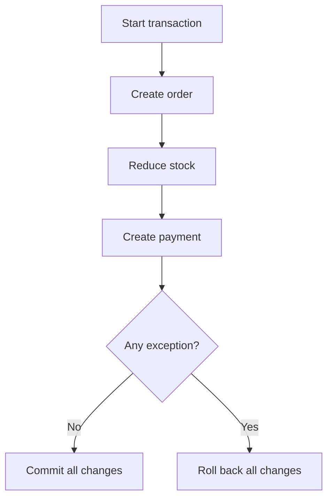
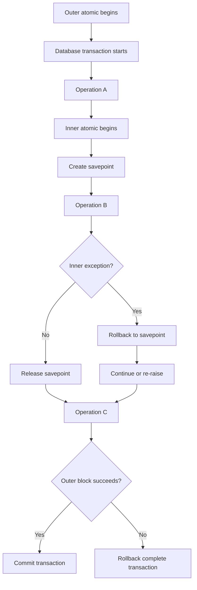
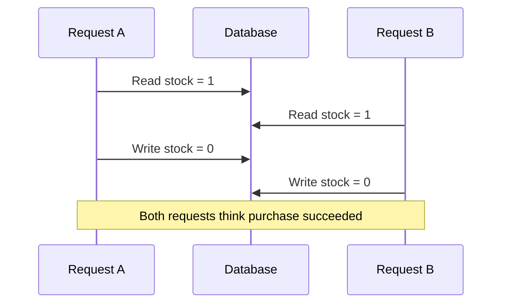
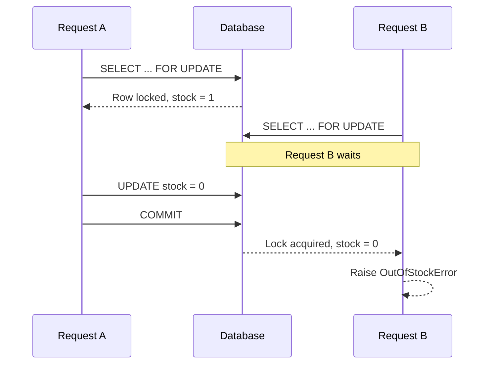
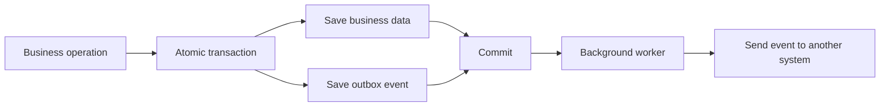
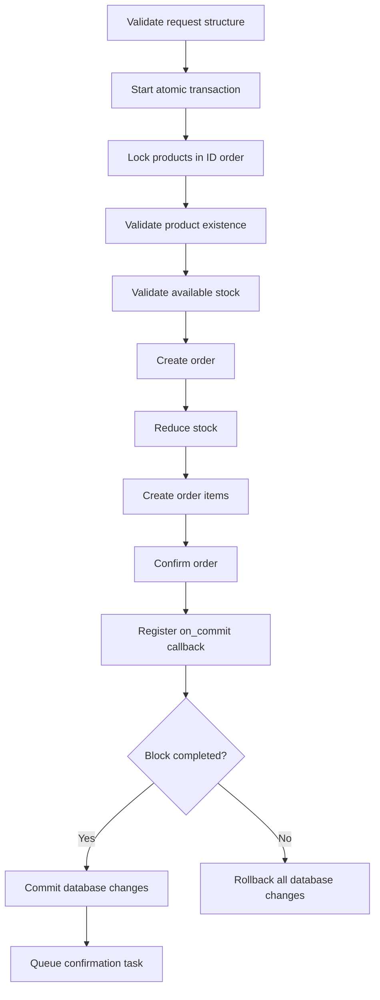
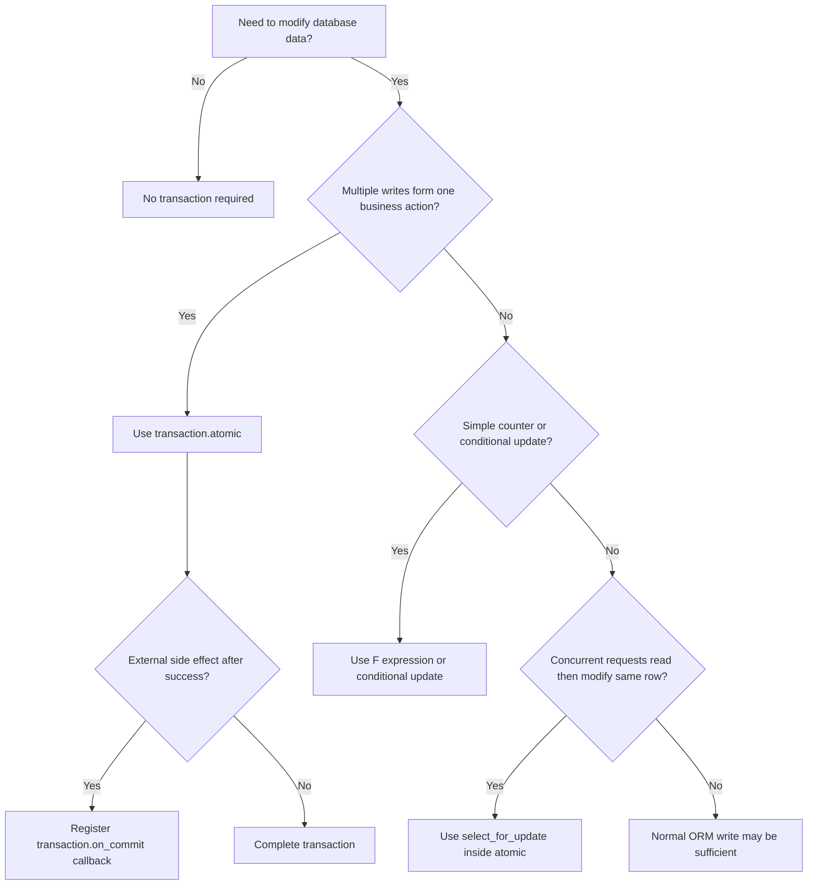

# Django Transactions: `transaction.atomic`

> A database transaction groups multiple database operations into one reliable unit: either **all operations succeed**, or **all of them are rolled back**.

This guide targets **Django 6.0** and is also applicable to **Django 5.2 LTS** for the transaction features discussed here.

---

# 1. Why Transactions Are Needed

Consider an order-placement operation:

1. Create an order.
2. Reduce product stock.
3. Create a payment record.
4. Add an audit entry.

These operations belong to one business action. If the payment record fails after the stock is reduced, the database can become inconsistent.

Without a transaction:

```text
Order created           ✅
Stock reduced           ✅
Payment record created  ❌
Audit entry created     Not executed

Result: incomplete and inconsistent data
```

With a transaction:

```text
Order created           ✅
Stock reduced           ✅
Payment record created  ❌
--------------------------------
Entire operation rolled back
```

The database returns to its original state.

## Transaction flow



## Atomicity

The main transaction property represented by `transaction.atomic()` is **atomicity**:

> A group of operations is treated as one indivisible unit.

It is commonly explained as:

```text
All operations succeed
        OR
No operation is permanently saved
```

Transactions also work with database features related to consistency, isolation, and durability. However, `atomic()` does not automatically solve every concurrency problem. Row locks, database constraints, or atomic SQL updates may still be required.

---

# 2. How Django Handles Transactions

Django runs in **autocommit mode** by default.

This means that when no transaction is active, each database query is committed immediately.

```python
product = Product.objects.create(name="Keyboard")
product.stock = 20
product.save()
```

Conceptually:

```text
INSERT product  -> committed
UPDATE product  -> committed
```

If the second operation fails, the first operation normally remains committed.

## Autocommit with `atomic()`

When the same operations are wrapped in `atomic()`:

```python
from django.db import transaction

with transaction.atomic():
    product = Product.objects.create(name="Keyboard")
    product.stock = 20
    product.save()
```

Django starts a database transaction around the block:

```text
BEGIN
    INSERT product
    UPDATE product
COMMIT
```

If an exception escapes the block:

```text
BEGIN
    INSERT product
    UPDATE product -> error
ROLLBACK
```

## Django may use transactions internally

Django automatically uses transactions or savepoints for some multi-query ORM operations, such as certain bulk deletes or updates, to preserve data integrity.

You should still define explicit transaction boundaries for your own business operations.

---

# 3. Understanding `transaction.atomic`

Import it from `django.db`:

```python
from django.db import transaction
```

The API can be used in two common forms:

```python
with transaction.atomic():
    ...
```

or:

```python
@transaction.atomic
def some_function():
    ...
```

Its simplified behavior is:

```text
Enter block
   |
   v
Start transaction or savepoint
   |
   v
Execute database operations
   |
   +---- normal exit ----> commit/release savepoint
   |
   +---- exception ------> rollback
```

## Signature

```python
transaction.atomic(
    using=None,
    savepoint=True,
    durable=False,
)
```

### Parameters

| Parameter | Purpose |
|---|---|
| `using` | Chooses the database connection, such as `"default"` or `"analytics"` |
| `savepoint` | Controls whether a nested block creates a savepoint |
| `durable` | Requires the block to be the outermost atomic block |

Most application code only needs:

```python
with transaction.atomic():
    ...
```

---

# 4. Using `atomic()` as a Context Manager

The context-manager form gives precise control over which statements belong to the transaction.

```python
from django.db import transaction

def transfer_balance(sender, receiver, amount):
    with transaction.atomic():
        sender.balance -= amount
        sender.save(update_fields=["balance"])

        receiver.balance += amount
        receiver.save(update_fields=["balance"])
```

Both balance updates are committed together.

If `receiver.save()` raises an exception, the sender update is rolled back.

## Keep only related database work inside the block

```python
def create_report():
    report_data = calculate_report_data()

    with transaction.atomic():
        report = Report.objects.create(status="processing")
        ReportRow.objects.bulk_create(
            ReportRow(report=report, **row)
            for row in report_data
        )

    return report
```

The calculation is outside the transaction because it does not need a database lock or transaction boundary.

This reduces transaction duration.

---

# 5. Using `atomic()` as a Decorator

You can apply `atomic()` to the complete function:

```python
from django.db import transaction

@transaction.atomic
def create_customer_with_profile(customer_data, profile_data):
    customer = Customer.objects.create(**customer_data)
    CustomerProfile.objects.create(
        customer=customer,
        **profile_data,
    )
    return customer
```

The complete function executes inside one transaction.

## Context manager vs decorator

| Form | Best suited for |
|---|---|
| `with transaction.atomic():` | Only part of a function must be transactional |
| `@transaction.atomic` | The complete function represents one transaction |

The context-manager form is often easier to read in service-layer code because the transaction boundary is visible exactly where it begins and ends.

---

# 6. Commit and Rollback Behavior

Django decides whether to commit or roll back by checking how the atomic block exits.

## Successful exit

```python
with transaction.atomic():
    Order.objects.create(customer=customer)
```

No exception leaves the block:

```text
COMMIT
```

## Exception exit

```python
with transaction.atomic():
    order = Order.objects.create(customer=customer)
    Payment.objects.create(order=order, amount=None)
```

If the second query raises an exception:

```text
ROLLBACK
```

## The exception must leave the atomic block

This distinction is important:

```python
try:
    with transaction.atomic():
        perform_database_work()
except Exception:
    handle_failure()
```

Django sees the exception crossing the atomic boundary and rolls back correctly.

---

# 7. Nested Transactions and Savepoints

`atomic()` blocks can be nested.

```python
from django.db import transaction

with transaction.atomic():
    customer = Customer.objects.create(name="Asha")

    with transaction.atomic():
        Address.objects.create(
            customer=customer,
            city="Ahmedabad",
        )
```

Django usually behaves like this:

```text
Outer atomic block  -> starts transaction
Inner atomic block  -> creates savepoint
Inner success       -> releases savepoint
Outer success       -> commits transaction
```

## Savepoint diagram



## Inner rollback with outer continuation

```python
from django.db import IntegrityError, transaction

with transaction.atomic():
    customer = Customer.objects.create(name="Asha")

    try:
        with transaction.atomic():
            Coupon.objects.create(code="WELCOME")
    except IntegrityError:
        # Only the work after the inner savepoint is rolled back.
        pass

    CustomerLog.objects.create(
        customer=customer,
        message="Customer created",
    )
```

If the coupon code violates a unique constraint:

- The inner block rolls back to its savepoint.
- The outer transaction can continue.
- The customer and log may still be committed.

## An inner success is not a final commit

```python
with transaction.atomic():
    with transaction.atomic():
        Product.objects.create(name="Monitor")

    raise RuntimeError("Outer operation failed")
```

Although the inner block completed successfully, the outer exception rolls back everything.

```text
Inner block success ≠ permanent database commit
```

## `savepoint=False`

A nested atomic block can skip savepoint creation:

```python
with transaction.atomic():
    with transaction.atomic(savepoint=False):
        perform_work()
```

This may slightly reduce savepoint overhead, but it changes error-handling behavior. An error inside the nested block marks the entire surrounding transaction for rollback.

Use the default `savepoint=True` unless you have measured a real need and understand the consequences.

## `durable=True`

A durable block must be the outermost atomic block:

```python
with transaction.atomic(durable=True):
    Payment.objects.create(...)
```

When the block exits successfully, Django ensures that its database changes are committed.

Nesting a durable block inside another atomic block raises `RuntimeError`.

```python
with transaction.atomic():
    with transaction.atomic(durable=True):  # RuntimeError
        ...
```

This option is useful when a function must guarantee that it owns the final transaction boundary.

---

# 8. Correct Exception-Handling Pattern

Database exceptions should generally be caught **outside** the relevant atomic block.

## Recommended pattern

```python
from django.db import IntegrityError, transaction

def create_user(username):
    try:
        with transaction.atomic():
            return User.objects.create(username=username)
    except IntegrityError:
        return None
```

Django sees the exception leave the block, rolls back the transaction, and then your application handles it.

## Why catching inside the same block is risky

```python
from django.db import IntegrityError, transaction

with transaction.atomic():
    try:
        User.objects.create(username="duplicate-name")
    except IntegrityError:
        # The transaction may now be marked as broken.
        pass

    UserProfile.objects.create(...)  # May raise TransactionManagementError
```

After a database error, Django may mark the transaction as requiring rollback. Additional database queries before leaving the atomic block can raise `TransactionManagementError`.

## Use an inner block when partial recovery is required

```python
with transaction.atomic():
    order = Order.objects.create(customer=customer)

    try:
        with transaction.atomic():
            DiscountUsage.objects.create(
                customer=customer,
                code=discount_code,
            )
    except IntegrityError:
        discount_applied = False
    else:
        discount_applied = True

    OrderAudit.objects.create(
        order=order,
        discount_applied=discount_applied,
    )
```

The inner savepoint provides a safe recovery boundary.

---

# 9. Database State vs Python Object State

A transaction rollback restores database state, but it does not automatically restore values already changed on Python objects.

```python
product = Product.objects.get(pk=1)
original_stock = product.stock

try:
    with transaction.atomic():
        product.stock = 0
        product.save(update_fields=["stock"])
        raise RuntimeError("Failure")
except RuntimeError:
    pass
```

The database update is rolled back, but the in-memory object may still contain:

```python
product.stock == 0
```

To synchronize it again:

```python
product.refresh_from_db()
```

or restore the value manually:

```python
product.stock = original_stock
```

## Practical rule

After rollback, do not assume that:

- Model instances are restored.
- Cache entries are restored.
- Global variables are restored.
- External API calls are reversed.
- Files written to storage are deleted.
- Emails or messages already sent are cancelled.

A database transaction controls database operations on the selected connection. It does not provide automatic rollback for unrelated systems.

---

# 10. Running Work After Commit with `on_commit()`

Use `transaction.on_commit()` for work that should run only after a successful commit.

```python
from django.db import transaction

def create_order(customer):
    with transaction.atomic():
        order = Order.objects.create(customer=customer)

        transaction.on_commit(
            lambda: send_order_confirmation(order.id)
        )

    return order
```

The callback runs only after the outer transaction commits successfully.

## Why this matters

Sending an email inside an atomic block can create inconsistent behavior:

```python
with transaction.atomic():
    order = Order.objects.create(customer=customer)
    send_order_confirmation(order.id)
    raise RuntimeError("Later failure")
```

Result:

```text
Email sent       ✅
Order committed  ❌
```

Using `on_commit()`:

```text
Order committed?
    |
    +-- Yes -> send email
    |
    +-- No  -> discard callback
```

## Queueing background tasks after commit

```python
from functools import partial
from django.db import transaction

with transaction.atomic():
    invoice = Invoice.objects.create(...)

    transaction.on_commit(
        partial(generate_invoice_pdf, invoice.id)
    )
```

This is commonly used for:

- Sending emails.
- Enqueueing Celery or Django task-framework jobs.
- Updating external search indexes.
- Invalidating cache entries.
- Publishing events.
- Calling downstream systems.

## `robust=True`

```python
transaction.on_commit(
    lambda: run_optional_follow_up(),
    robust=True,
)
```

With `robust=True`, an exception in that callback is logged and does not prevent later robust callbacks from running.

The callback is not part of the database transaction. At callback time, the transaction has already committed.

---

# 11. Preventing Race Conditions

`transaction.atomic()` guarantees that your operations commit or roll back together, but it does not automatically prevent two transactions from reading the same old value.

Consider inventory stock:

```python
def purchase(product_id):
    with transaction.atomic():
        product = Product.objects.get(pk=product_id)

        if product.stock <= 0:
            raise OutOfStockError

        product.stock -= 1
        product.save(update_fields=["stock"])
```

Two requests can execute concurrently:

```text
Request A reads stock = 1
Request B reads stock = 1

Request A writes stock = 0
Request B writes stock = 0
```

Both requests may believe they successfully purchased the last item.

This is a **race condition** or **lost update** problem.

## Concurrency timeline



Common solutions include:

1. Lock the row with `select_for_update()`.
2. Perform an atomic conditional update.
3. Use `F()` expressions.
4. Enforce database constraints.
5. Use optimistic concurrency with a version field.

---

# 12. `select_for_update()` Row Locking

`select_for_update()` asks the database to lock selected rows until the transaction ends.

```python
from django.db import transaction

def purchase(product_id):
    with transaction.atomic():
        product = (
            Product.objects
            .select_for_update()
            .get(pk=product_id)
        )

        if product.stock <= 0:
            raise OutOfStockError

        product.stock -= 1
        product.save(update_fields=["stock"])
```

Now the flow is:

```text
Request A locks product row
Request B waits
Request A updates and commits
Request B acquires lock
Request B reads latest stock
```

## Locking sequence



## It must run inside a transaction

```python
with transaction.atomic():
    product = Product.objects.select_for_update().get(pk=product_id)
```

On database backends that support `SELECT ... FOR UPDATE`, evaluating it in autocommit mode raises `TransactionManagementError`.

SQLite does not provide the same row-lock behavior; `select_for_update()` has no locking effect there. Production concurrency testing should use the same database engine as production, commonly PostgreSQL or MySQL.

## `nowait=True`

Instead of waiting for a lock, fail immediately:

```python
from django.db import DatabaseError, transaction

try:
    with transaction.atomic():
        job = (
            Job.objects
            .select_for_update(nowait=True)
            .get(pk=job_id)
        )
except DatabaseError:
    handle_busy_job()
```

## `skip_locked=True`

Skip rows currently locked by another transaction:

```python
with transaction.atomic():
    jobs = list(
        Job.objects
        .filter(status="pending")
        .select_for_update(skip_locked=True)[:10]
    )

    for job in jobs:
        job.status = "processing"

    Job.objects.bulk_update(jobs, ["status"])
```

This pattern is useful for database-backed worker queues where multiple workers claim independent jobs.

## `of=()`

When joins are involved, control which model rows are locked:

```python
order = (
    Order.objects
    .select_related("customer")
    .select_for_update(of=("self",))
    .get(pk=order_id)
)
```

This locks only the `Order` row rather than every selected related row supported by the database.

## `no_key=True`

PostgreSQL supports a weaker lock mode:

```python
order = (
    Order.objects
    .select_for_update(no_key=True)
    .get(pk=order_id)
)
```

This can allow other transactions to create rows that reference the locked row through a foreign key while still protecting the row from conflicting updates.

## Lock only what you need

Prefer:

```python
Product.objects.select_for_update().get(pk=product_id)
```

over locking a large queryset:

```python
Product.objects.select_for_update().all()
```

Large lock sets increase waiting, contention, and deadlock risk.

---

# 13. Using `F()` Expressions for Atomic Updates

For simple counter changes, an `F()` expression can update a value directly in the database without first loading it into Python.

```python
from django.db.models import F

Product.objects.filter(pk=product_id).update(
    stock=F("stock") - 1
)
```

Conceptually:

```sql
UPDATE product
SET stock = stock - 1
WHERE id = ...
```

This avoids the read-modify-write race condition.

## Conditional atomic update

A stronger inventory pattern updates only when stock is available:

```python
from django.db.models import F

updated_rows = (
    Product.objects
    .filter(pk=product_id, stock__gt=0)
    .update(stock=F("stock") - 1)
)

if updated_rows == 0:
    raise OutOfStockError
```

This executes as one conditional database statement.

```text
UPDATE product
SET stock = stock - 1
WHERE id = product_id
  AND stock > 0
```

Only one concurrent request can consume the last available unit successfully.

## `F()` expression vs row lock

| Requirement | Better starting point |
|---|---|
| Increment or decrement one field | `F()` expression |
| Update only when a condition is true | Conditional `update()` |
| Read several fields and apply complex rules | `select_for_update()` |
| Update multiple related records together | `atomic()` plus suitable locks |
| Ensure a value remains unique | Database constraint |

You can combine techniques:

```python
with transaction.atomic():
    product = (
        Product.objects
        .select_for_update()
        .get(pk=product_id)
    )

    validate_business_rules(product)

    Product.objects.filter(pk=product.pk).update(
        stock=F("stock") - quantity
    )

    OrderItem.objects.create(
        order=order,
        product=product,
        quantity=quantity,
    )
```

---

# 14. `ATOMIC_REQUESTS`

Django can wrap each view in a transaction by setting `ATOMIC_REQUESTS=True` for a database.

```python
DATABASES = {
    "default": {
        "ENGINE": "django.db.backends.postgresql",
        "NAME": "shop",
        "ATOMIC_REQUESTS": True,
    }
}
```

Conceptually:

```text
Request arrives
      |
Start transaction
      |
Execute view
      |
      +-- response returned -> commit
      |
      +-- exception --------> rollback
```

## What is included

The view function is wrapped in the transaction.

Middleware runs outside the transaction.

Template-response rendering also runs outside the transaction.

## Excluding a view

```python
from django.db import transaction

@transaction.non_atomic_requests
def health_check(request):
    ...
```

For a specific database:

```python
@transaction.non_atomic_requests(using="analytics")
def analytics_health_check(request):
    ...
```

## Trade-off

`ATOMIC_REQUESTS` is convenient, but it can keep transactions open longer than necessary.

This may increase:

- Lock duration.
- Database connection usage.
- Contention.
- Deadlock probability.
- Request latency under load.

For high-throughput systems, explicit service-level atomic blocks often provide clearer and shorter transaction boundaries.

## Streaming responses

Be careful with `StreamingHttpResponse`.

The view may finish before the response content is fully generated. Code that runs while streaming the response executes outside the view transaction.

Avoid performing important database writes during response streaming.

---

# 15. Transactions with Multiple Databases

A transaction belongs to one database connection.

```python
from django.db import transaction

with transaction.atomic(using="default"):
    Customer.objects.using("default").create(name="Asha")
```

For another database:

```python
with transaction.atomic(using="analytics"):
    AnalyticsEvent.objects.using("analytics").create(
        event_type="customer_created",
    )
```

## Separate transactions are not one distributed transaction

```python
with transaction.atomic(using="default"):
    Customer.objects.using("default").create(name="Asha")

    with transaction.atomic(using="analytics"):
        AnalyticsEvent.objects.using("analytics").create(...)
```

A failure across two databases cannot generally be treated as one automatic all-or-nothing transaction by Django.

Possible production approaches include:

- Store the main business change first.
- Use an outbox table in the same database transaction.
- Process the outbox asynchronously.
- Make downstream operations idempotent.
- Add retry and reconciliation mechanisms.

## Transactional outbox idea



The business record and outbox record commit together. A worker later delivers the event safely.

---

# 16. Transactions in Async Django Code

Django 6.0 supports many asynchronous ORM operations, but database transactions do not yet work directly in async mode.

Put transactional ORM work inside one synchronous function:

```python
from asgiref.sync import sync_to_async
from django.db import transaction

@transaction.atomic
def create_order_sync(customer_id, product_id):
    customer = Customer.objects.get(pk=customer_id)
    product = (
        Product.objects
        .select_for_update()
        .get(pk=product_id)
    )

    return Order.objects.create(
        customer=customer,
        product=product,
    )
```

Call it from async code:

```python
async def create_order_view(request):
    order = await sync_to_async(
        create_order_sync,
        thread_sensitive=True,
    )(
        customer_id=request.user.id,
        product_id=request.POST["product_id"],
    )

    return JsonResponse({"order_id": order.id})
```

Keep the complete transactional workflow inside the synchronous function rather than wrapping each individual query separately.

---

# 17. Testing Transactional Code

Django provides two commonly used base test classes.

## `TestCase`

```python
from django.test import TestCase
```

`TestCase` wraps tests in transactions for speed and isolation.

It is suitable for most model, service, and view tests.

```python
class TransferServiceTests(TestCase):
    def test_transfer_updates_both_accounts(self):
        ...
```

## `TransactionTestCase`

```python
from django.test import TransactionTestCase
```

Use `TransactionTestCase` when you need to test real transaction behavior, including:

- Commit and rollback boundaries.
- Row locking.
- Concurrent database connections.
- `select_for_update()` behavior.
- Code that depends on transaction completion.

```python
class InventoryLockTests(TransactionTestCase):
    reset_sequences = True

    def test_concurrent_purchase(self):
        ...
```

`TransactionTestCase` is slower because it allows actual commits and uses database flushing for isolation.

## Testing `on_commit()`

`TestCase` normally rolls back its wrapping transaction, so callbacks may not execute naturally.

Use `captureOnCommitCallbacks()`:

```python
from django.test import TestCase

class OrderTests(TestCase):
    def test_confirmation_is_registered(self):
        with self.captureOnCommitCallbacks(execute=True) as callbacks:
            create_order(customer=self.customer)

        self.assertEqual(len(callbacks), 1)
```

## Test with the production database engine

SQLite transaction and locking behavior differs from PostgreSQL and MySQL.

If production uses PostgreSQL, concurrency-sensitive tests should also run against PostgreSQL.

---

# 18. Performance and Production Best Practices

## 18.1 Keep transactions short

Good:

```python
payload = validate_and_prepare_payload(request.data)

with transaction.atomic():
    order = save_order(payload)
```

Less effective:

```python
with transaction.atomic():
    payload = call_slow_external_api()
    file_data = generate_large_pdf()
    order = save_order(payload)
```

Long transactions retain locks and database resources for longer.

## 18.2 Do external I/O outside the transaction

Avoid doing the following inside an atomic block unless absolutely required:

- HTTP API calls.
- Email delivery.
- Large file generation.
- Cloud-storage uploads.
- Long CPU-heavy calculations.
- Waiting for user input.
- Sleeping or retry delays.

Use `on_commit()` to schedule follow-up work after successful persistence.

## 18.3 Use database constraints

Application checks alone are not enough under concurrency.

Example:

```python
class CouponUsage(models.Model):
    customer = models.ForeignKey(
        Customer,
        on_delete=models.CASCADE,
    )
    coupon = models.ForeignKey(
        Coupon,
        on_delete=models.CASCADE,
    )

    class Meta:
        constraints = [
            models.UniqueConstraint(
                fields=["customer", "coupon"],
                name="unique_coupon_per_customer",
            ),
        ]
```

Then handle the possible integrity failure:

```python
from django.db import IntegrityError, transaction

try:
    with transaction.atomic():
        CouponUsage.objects.create(
            customer=customer,
            coupon=coupon,
        )
except IntegrityError:
    raise CouponAlreadyUsedError
```

The database is the final authority for uniqueness.

## 18.4 Lock rows in a consistent order

When locking multiple records, use a predictable order:

```python
account_ids = sorted([sender_id, receiver_id])

with transaction.atomic():
    accounts = list(
        Account.objects
        .select_for_update()
        .filter(pk__in=account_ids)
        .order_by("pk")
    )
```

Consistent lock ordering reduces deadlock risk.

## 18.5 Retry selected transient failures carefully

Databases may abort transactions because of deadlocks or serialization failures.

A safe retry requires:

- A limited retry count.
- A new transaction for each attempt.
- Idempotent business behavior.
- Logging and metrics.
- Retrying only known transient database errors.

Do not retry every exception blindly.

## 18.6 Use `update_fields`

When saving an existing model, update only the intended columns:

```python
product.stock -= quantity
product.save(update_fields=["stock"])
```

This makes the write intent clearer and can reduce unnecessary column updates.

## 18.7 Prefer service-layer transaction boundaries

A service function often provides a clean location for business transactions:

```python
# services/orders.py

from django.db import transaction

@transaction.atomic
def place_order(*, customer, items):
    ...
```

Views, commands, background workers, and APIs can call the same service.

```text
View / API / Worker
         |
         v
Business service
         |
         v
Transaction boundary
         |
         v
Models and database
```

## 18.8 Avoid relying on model `save()` calls alone

Several independent `save()` calls are not automatically one business transaction.

```python
order.save()
payment.save()
inventory.save()
```

Wrap related writes explicitly:

```python
with transaction.atomic():
    order.save()
    payment.save()
    inventory.save()
```

## 18.9 Treat signals carefully

Signals execute as part of the current call stack.

If a signal performs database writes during an atomic block, those writes usually participate in the same transaction on the same database connection.

However, hidden side effects can make transaction boundaries difficult to understand.

Prefer explicit service calls for important business workflows, and use `on_commit()` for work that should happen only after successful persistence.

---

# 19. Practical Order-Placement Example

The following example combines:

- A clear service layer.
- `transaction.atomic()`.
- Row locking.
- Business validation.
- Database updates.
- `on_commit()` callbacks.

## Models

```python
from django.conf import settings
from django.db import models


class Product(models.Model):
    name = models.CharField(max_length=200)
    stock = models.PositiveIntegerField(default=0)
    price = models.DecimalField(
        max_digits=10,
        decimal_places=2,
    )


class Order(models.Model):
    class Status(models.TextChoices):
        PENDING = "pending", "Pending"
        CONFIRMED = "confirmed", "Confirmed"

    customer = models.ForeignKey(
        settings.AUTH_USER_MODEL,
        on_delete=models.PROTECT,
    )
    status = models.CharField(
        max_length=20,
        choices=Status,
        default=Status.PENDING,
    )
    total_amount = models.DecimalField(
        max_digits=12,
        decimal_places=2,
    )
    created_at = models.DateTimeField(auto_now_add=True)


class OrderItem(models.Model):
    order = models.ForeignKey(
        Order,
        on_delete=models.CASCADE,
        related_name="items",
    )
    product = models.ForeignKey(
        Product,
        on_delete=models.PROTECT,
    )
    quantity = models.PositiveIntegerField()
    unit_price = models.DecimalField(
        max_digits=10,
        decimal_places=2,
    )
```

## Service

```python
from dataclasses import dataclass
from decimal import Decimal

from django.db import transaction

from .models import Order, OrderItem, Product


class InsufficientStockError(Exception):
    pass


@dataclass(frozen=True)
class OrderLineInput:
    product_id: int
    quantity: int


@transaction.atomic
def place_order(*, customer, lines: list[OrderLineInput]) -> Order:
    if not lines:
        raise ValueError("At least one order line is required.")

    product_ids = sorted({line.product_id for line in lines})

    products = {
        product.id: product
        for product in (
            Product.objects
            .select_for_update()
            .filter(id__in=product_ids)
            .order_by("id")
        )
    }

    if len(products) != len(product_ids):
        raise Product.DoesNotExist(
            "One or more products do not exist."
        )

    total = Decimal("0.00")
    order_items: list[OrderItem] = []

    order = Order.objects.create(
        customer=customer,
        status=Order.Status.PENDING,
        total_amount=Decimal("0.00"),
    )

    for line in lines:
        if line.quantity <= 0:
            raise ValueError("Quantity must be positive.")

        product = products[line.product_id]

        if product.stock < line.quantity:
            raise InsufficientStockError(
                f"Insufficient stock for {product.name}."
            )

        product.stock -= line.quantity
        total += product.price * line.quantity

        order_items.append(
            OrderItem(
                order=order,
                product=product,
                quantity=line.quantity,
                unit_price=product.price,
            )
        )

    Product.objects.bulk_update(
        products.values(),
        fields=["stock"],
    )

    OrderItem.objects.bulk_create(order_items)

    order.status = Order.Status.CONFIRMED
    order.total_amount = total
    order.save(
        update_fields=["status", "total_amount"]
    )

    transaction.on_commit(
        lambda: send_order_confirmation_task(order.id)
    )

    return order
```

## Execution flow



## Why this design is reliable

- Product rows are locked before checking stock.
- Locks are acquired in a consistent order.
- The order, items, and stock changes share one transaction.
- Any validation or database failure rolls back all database writes.
- The confirmation task is queued only after a successful commit.
- The transactional workflow is reusable outside the HTTP view.

---

# 20. Choosing the Right Transaction Technique

Use this decision guide:



## Quick reference

| Need | Recommended tool |
|---|---|
| Group several related writes | `transaction.atomic()` |
| Roll back a subsection but continue outer work | Nested `atomic()` savepoint |
| Execute code only after successful commit | `transaction.on_commit()` |
| Lock rows during read-modify-write | `select_for_update()` |
| Increment or decrement safely | `F()` expression |
| Update only if a condition still holds | Filtered `QuerySet.update()` |
| Enforce uniqueness or valid state | Database constraint |
| Test real commit/locking behavior | `TransactionTestCase` |
| Use transactions from async code | One sync function called with `sync_to_async()` |
| Coordinate another system reliably | Transactional outbox pattern |

---

# 21. Key Takeaways

```text
transaction.atomic()
    |
    +-- Success   -> commit
    |
    +-- Exception -> rollback
```

- Django uses autocommit mode by default.
- `transaction.atomic()` groups related database operations.
- Catch database exceptions outside the atomic block that should roll back.
- Nested atomic blocks normally create savepoints.
- An inner block does not permanently commit while an outer transaction remains active.
- A rollback restores database state, not Python objects or external side effects.
- Use `transaction.on_commit()` for emails, jobs, cache changes, and external integrations.
- `atomic()` alone does not prevent every race condition.
- Use `select_for_update()` for complex read-modify-write workflows.
- Use `F()` expressions or conditional updates for simple atomic changes.
- Keep transaction blocks short.
- Use database constraints as the final data-integrity layer.
- Test concurrency-sensitive code with the same database engine used in production.

---

## Official References

- [Django 6.0: Database transactions](https://docs.djangoproject.com/en/6.0/topics/db/transactions/)
- [Django 6.0: QuerySet `select_for_update()`](https://docs.djangoproject.com/en/6.0/ref/models/querysets/#select-for-update)
- [Django 6.0: Asynchronous support](https://docs.djangoproject.com/en/6.0/topics/async/)
- [Django official downloads and supported versions](https://www.djangoproject.com/download/)
