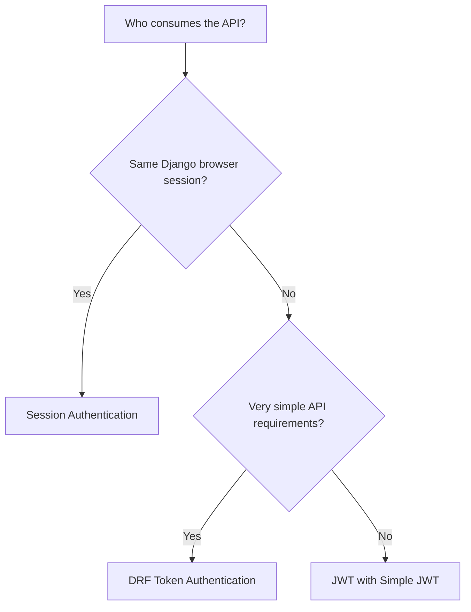
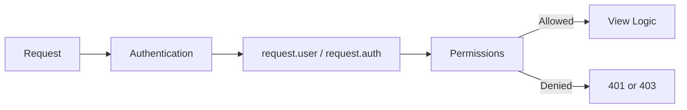
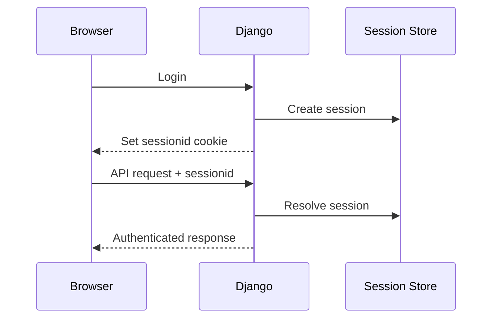
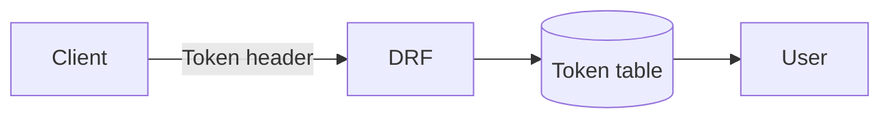
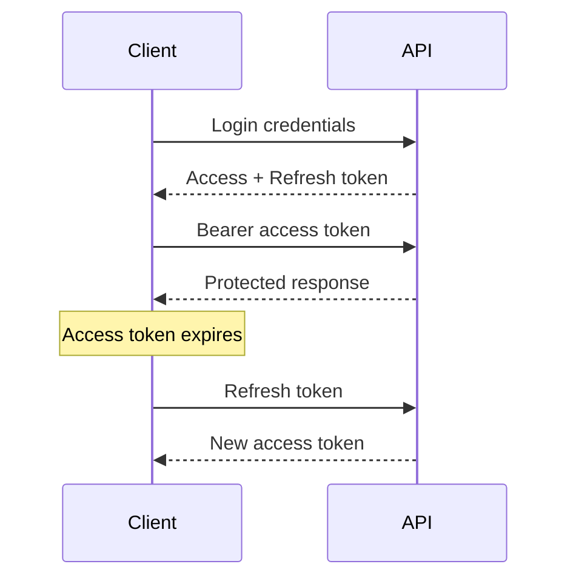
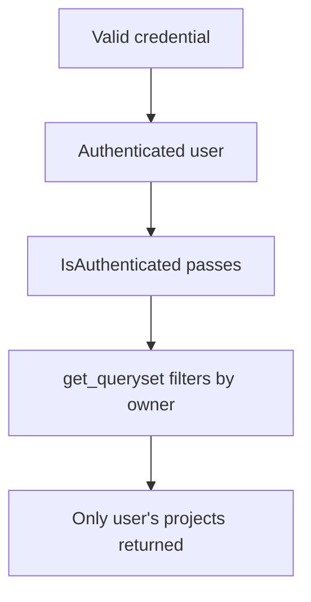
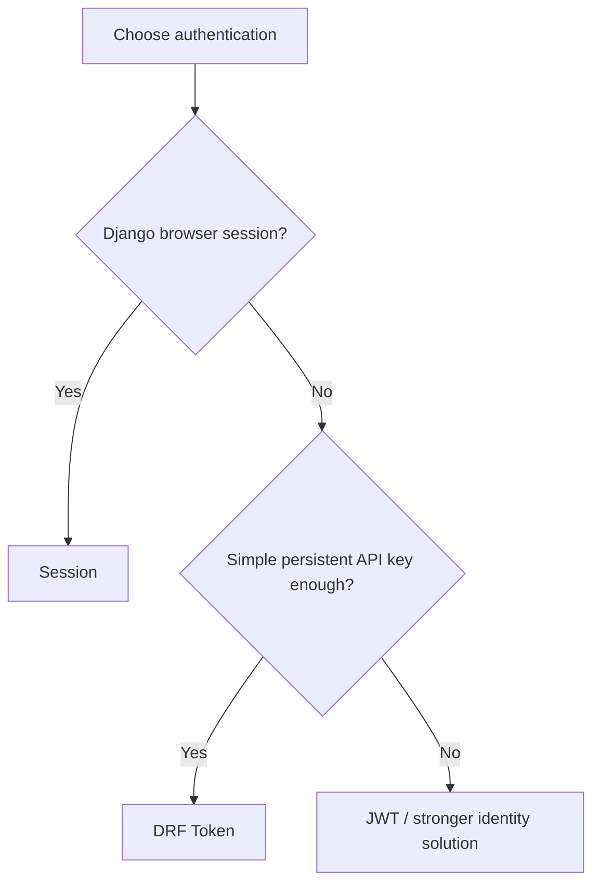

# DRF Authentication: Session, Token, and JWT

> **Authentication** answers: “Who is making this request?”  
> **Permissions** answer: “Is this user allowed to perform this action?”

## In short

- DRF runs **authentication before permissions**.
- Successful authentication sets `request.user` and usually `request.auth`.
- **Session Authentication** is best for Django browser applications that already use Django login and cookies.
- **DRF Token Authentication** is a simple database-backed token suitable for small/internal APIs with basic requirements.
- **JWT with Simple JWT** is useful for SPAs, mobile apps, and distributed APIs that need short-lived access tokens and refresh tokens.
- Authentication does **not** protect object ownership by itself. Filter/query data by the current user or tenant.
- When multiple authentication classes are configured, DRF tries them in order. The highest-priority class also affects whether an unauthenticated denial becomes `401` or `403`.



---

# 1. How Authentication Works in DRF

A typical DRF request passes through authentication and permission checks before the view logic runs.



If an authentication class:

- finds valid credentials, it returns the authenticated user and auth information;
- finds no credentials, DRF can continue as `AnonymousUser`;
- finds invalid credentials, it raises an authentication error.

### `request.user` and `request.auth`

| Scheme | `request.user` | `request.auth` |
|---|---|---|
| Session | Django user | `None` |
| DRF Token | Django user | `Token` instance |
| Simple JWT | Django user | Validated token |
| No authentication | `AnonymousUser` | `None` |

### Authentication vs permissions

```python
from rest_framework.permissions import IsAuthenticated
from rest_framework.views import APIView

class ProfileView(APIView):
    permission_classes = [IsAuthenticated]
```

`IsAuthenticated` checks whether authentication succeeded. It does not decide whether the user owns a particular row.

### `401` vs `403`

DRF uses the highest-priority authentication class when deciding the response for an unauthenticated denied request:

- authenticated user without permission → `403 Forbidden`;
- unauthenticated request + authentication class using `WWW-Authenticate` → `401 Unauthorized`;
- unauthenticated request + authentication class without that header → `403 Forbidden`.

`SessionAuthentication` normally produces `403` for an unauthenticated permission denial.

---

# 2. Session Authentication

Session Authentication uses Django's normal server-side session system.



### Configuration

```python
# settings.py

REST_FRAMEWORK = {
    "DEFAULT_AUTHENTICATION_CLASSES": [
        "rest_framework.authentication.SessionAuthentication",
    ],
    "DEFAULT_PERMISSION_CLASSES": [
        "rest_framework.permissions.IsAuthenticated",
    ],
}
```

### CSRF matters

Browsers automatically send cookies, so authenticated unsafe requests must also pass CSRF validation.

Unsafe methods include:

- `POST`
- `PUT`
- `PATCH`
- `DELETE`

Example:

```javascript
fetch("/api/profile/", {
  method: "PATCH",
  credentials: "include",
  headers: {
    "Content-Type": "application/json",
    "X-CSRFToken": csrfToken,
  },
  body: JSON.stringify({ display_name: "Avadh" }),
});
```

> For login pages, use Django's normal CSRF-protected login flow. DRF's `SessionAuthentication` behavior is not a replacement for secure login handling.

### Best fit

Use Session Authentication when:

- Django renders the frontend or shares the same browser session;
- users already log in through Django;
- Django admin or DRF's browsable API is used;
- immediate server-side session invalidation is useful.

---

# 3. DRF Token Authentication

DRF's built-in Token Authentication stores a token in the database and sends it in the request header.

```text
Authorization: Token <token-key>
```



### Setup

```python
# settings.py

INSTALLED_APPS = [
    "rest_framework",
    "rest_framework.authtoken",
]

REST_FRAMEWORK = {
    "DEFAULT_AUTHENTICATION_CLASSES": [
        "rest_framework.authentication.TokenAuthentication",
    ],
}
```

Run:

```bash
python manage.py migrate
```

Add the built-in token endpoint:

```python
from django.urls import path
from rest_framework.authtoken.views import obtain_auth_token

urlpatterns = [
    path("api-token-auth/", obtain_auth_token),
]
```

Use the token:

```bash
curl \
  -H "Authorization: Token <token-key>" \
  http://localhost:8000/api/profile/
```

### Important characteristics

- normally one database token per user;
- no built-in expiration;
- no refresh-token flow;
- revocation is simple because the server can delete the token;
- each authenticated request normally requires a token lookup.

### Best fit

Use it for small/internal APIs when requirements are intentionally simple.

Move to a stronger token/session design when you need:

- independent device sessions;
- automatic token expiry;
- refresh-token rotation;
- richer session management.

---

# 4. JWT Authentication with Simple JWT

JWT authentication is not built into DRF core. A common integration is `djangorestframework-simplejwt`.

A JWT commonly looks like:

```text
header.payload.signature
```

The payload is **encoded, not encrypted**, so sensitive secrets should not be stored in JWT claims.

### Access and refresh tokens



| Token | Purpose | Typical behavior |
|---|---|---|
| Access token | Sent to protected endpoints | Short-lived |
| Refresh token | Gets a new access token | Longer-lived and better protected |

### Setup

```bash
python -m pip install djangorestframework-simplejwt
```

```python
# settings.py

REST_FRAMEWORK = {
    "DEFAULT_AUTHENTICATION_CLASSES": [
        "rest_framework_simplejwt.authentication.JWTAuthentication",
    ],
    "DEFAULT_PERMISSION_CLASSES": [
        "rest_framework.permissions.IsAuthenticated",
    ],
}
```

```python
# urls.py

from django.urls import path
from rest_framework_simplejwt.views import (
    TokenObtainPairView,
    TokenRefreshView,
    TokenVerifyView,
)

urlpatterns = [
    path("api/token/", TokenObtainPairView.as_view()),
    path("api/token/refresh/", TokenRefreshView.as_view()),
    path("api/token/verify/", TokenVerifyView.as_view()),
]
```

Protected request:

```text
Authorization: Bearer <access-token>
```

### Practical token settings

```python
from datetime import timedelta

SIMPLE_JWT = {
    "ACCESS_TOKEN_LIFETIME": timedelta(minutes=10),
    "REFRESH_TOKEN_LIFETIME": timedelta(days=7),
    "ROTATE_REFRESH_TOKENS": True,
    "BLACKLIST_AFTER_ROTATION": True,
    "AUTH_HEADER_TYPES": ("Bearer",),

    # Prefer a dedicated signing secret instead of reusing SECRET_KEY.
    "SIGNING_KEY": env("JWT_SIGNING_KEY"),

    "ISSUER": "https://api.example.com",
    "AUDIENCE": "example-clients",
}
```

The lifetimes above are examples, not universal values. Choose them according to application risk and UX requirements.

### Refresh rotation and blacklisting

To blacklist refresh tokens:

```python
INSTALLED_APPS = [
    # ...
    "rest_framework_simplejwt.token_blacklist",
]
```

Run migrations:

```bash
python manage.py migrate
```

A blacklisted refresh token can no longer refresh.

However, an already-issued access token normally remains valid until its `exp` time. This is why access tokens are usually short-lived.

Clean expired blacklist records periodically:

```bash
python manage.py flushexpiredtokens
```

### Claims

Claims are useful for stable identity/context such as:

- user ID;
- tenant ID;
- stable role;
- issuer and audience.

Avoid placing rapidly changing permissions or sensitive secrets inside the token.

---

# 5. Protecting Real API Data

Authentication identifies the caller. Your queryset still needs to enforce ownership or tenancy.

```python
from rest_framework.permissions import IsAuthenticated
from rest_framework.viewsets import ModelViewSet

from .models import Project
from .serializers import ProjectSerializer


class ProjectViewSet(ModelViewSet):
    serializer_class = ProjectSerializer
    permission_classes = [IsAuthenticated]

    def get_queryset(self):
        return Project.objects.filter(owner=self.request.user)
```

Request flow:



This separation is important:

- **Authentication** → who are you?
- **Permission** → can you use this endpoint/action?
- **Queryset/object rule** → which records may you access?

---

# 6. Global, Per-View, and Multiple Authentication Classes

### Global configuration

```python
REST_FRAMEWORK = {
    "DEFAULT_AUTHENTICATION_CLASSES": [
        "rest_framework_simplejwt.authentication.JWTAuthentication",
    ],
}
```

### Per-view override

```python
from rest_framework.authentication import SessionAuthentication
from rest_framework.permissions import IsAuthenticated
from rest_framework.views import APIView


class BrowserOnlyView(APIView):
    authentication_classes = [SessionAuthentication]
    permission_classes = [IsAuthenticated]
```

### Multiple authentication classes

```python
REST_FRAMEWORK = {
    "DEFAULT_AUTHENTICATION_CLASSES": [
        "rest_framework.authentication.SessionAuthentication",
        "rest_framework_simplejwt.authentication.JWTAuthentication",
    ],
}
```

DRF tries them in order and stops when one successfully authenticates.

Only combine schemes when real clients need them, for example:

- Session Authentication for internal staff using the browsable API;
- JWT for application clients.

---

# 7. Session vs Token vs JWT

| Feature | Session | DRF Token | JWT |
|---|---|---|---|
| Credential | Cookie | `Token <key>` | `Bearer <token>` |
| Server-side state | Yes | Yes | Usually minimal for access-token validation |
| Database lookup | Session lookup | Token lookup | Depends on implementation/user loading |
| Built into DRF | Yes | Yes | No |
| Expiration | Session expiry | No built-in expiry | Built into token |
| Refresh token | No | No | Yes |
| CSRF | Required for authenticated unsafe cookie requests | Usually no | Header token: no; cookie JWT: CSRF considerations return |
| Immediate revocation | Straightforward | Straightforward | Refresh can be blacklisted; access token may live until expiry |
| Best fit | Same-site Django web app | Simple/internal API | SPA, mobile, distributed API |

### Simple decision rule



---

# 8. Security and Testing Essentials

### Security

Use these practices regardless of the chosen scheme:

- use HTTPS outside local development;
- keep authentication and authorization separate;
- throttle login and token-refresh endpoints;
- never log passwords, session cookies, refresh tokens, or full `Authorization` headers;
- use short-lived access tokens when JWT revocation cannot be immediate;
- rotate/terminate credentials after account deactivation, password changes, role downgrades, or suspected compromise;
- keep JWT signing keys separate from unrelated application secrets where practical.

For session deployments:

```python
SESSION_COOKIE_SECURE = True
SESSION_COOKIE_HTTPONLY = True
CSRF_COOKIE_SECURE = True
SESSION_COOKIE_SAMESITE = "Lax"
CSRF_COOKIE_SAMESITE = "Lax"
```

Choose cookie domain and `SameSite` values according to the real deployment architecture.

### Testing

Use `force_authenticate()` when the test is about business behavior rather than the authentication mechanism itself.

```python
def test_user_can_read_own_projects(self):
    self.client.force_authenticate(user=self.user)

    response = self.client.get("/api/projects/")

    self.assertEqual(response.status_code, 200)
```

Use real credentials/headers when you specifically want to test the authentication class.

```python
self.client.credentials(
    HTTP_AUTHORIZATION=f"Bearer {access_token}"
)
```

Test these separately:

- unauthenticated requests;
- invalid/expired credentials;
- authenticated but unauthorized users;
- object ownership or tenant isolation;
- refresh/logout behavior.

---

# Version Note — August 19, 2026

- **Django REST Framework:** `3.18.0` is the latest PyPI release and supports Python `3.10+` with Django `5.2`, `6.0`, and `6.1`.
- **Simple JWT:** `5.5.1` is the latest stable PyPI release.
- Simple JWT's published documentation still shows an older tested compatibility matrix than DRF `3.18`, so verify the exact Django/DRF/Simple JWT combination in your project's tests before upgrading.

---

# References

- [Django REST Framework — Authentication](https://www.django-rest-framework.org/api-guide/authentication/)
- [Django REST Framework — Permissions](https://www.django-rest-framework.org/api-guide/permissions/)
- [Django REST Framework — Release Notes](https://www.django-rest-framework.org/community/release-notes/)
- [Django REST Framework — PyPI](https://pypi.org/project/djangorestframework/)
- [Simple JWT — Getting Started](https://django-rest-framework-simplejwt.readthedocs.io/en/stable/getting_started.html)
- [Simple JWT — Settings](https://django-rest-framework-simplejwt.readthedocs.io/en/stable/settings.html)
- [Simple JWT — Blacklist App](https://django-rest-framework-simplejwt.readthedocs.io/en/stable/blacklist_app.html)
- [Simple JWT — PyPI](https://pypi.org/project/djangorestframework-simplejwt/)
