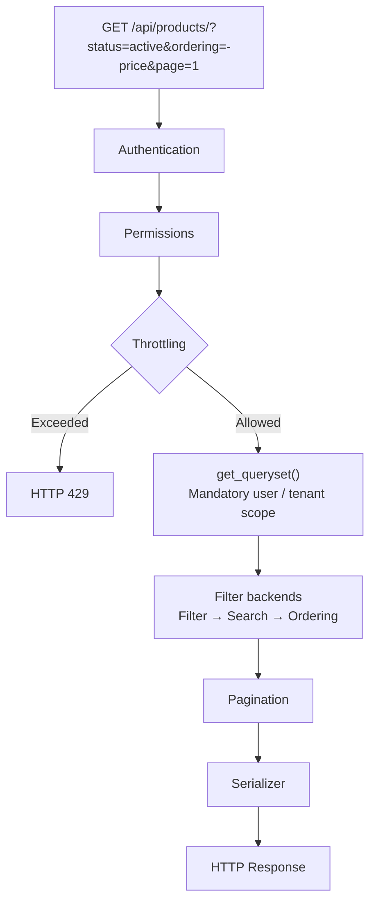
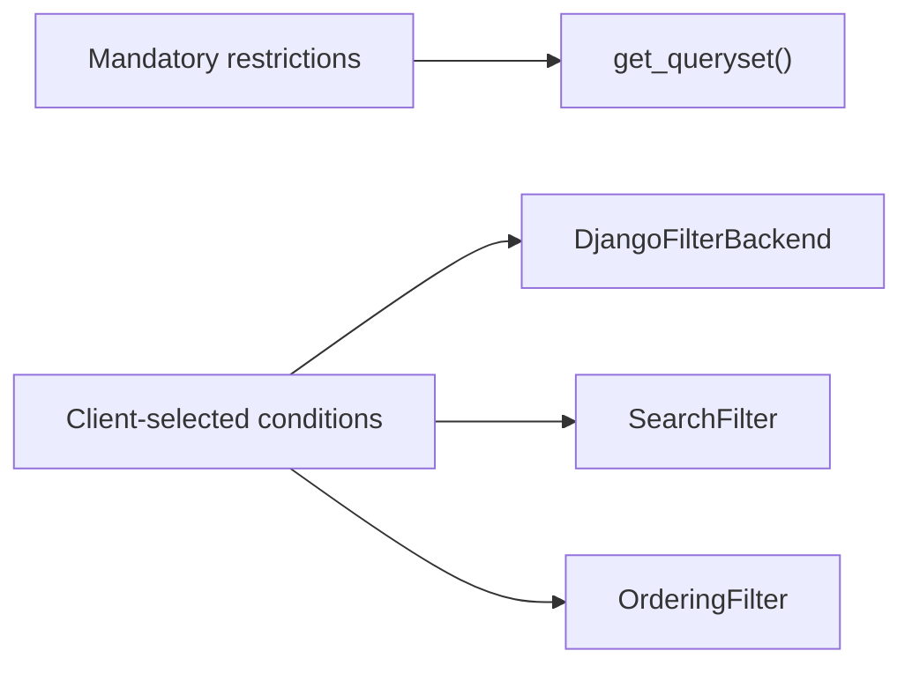
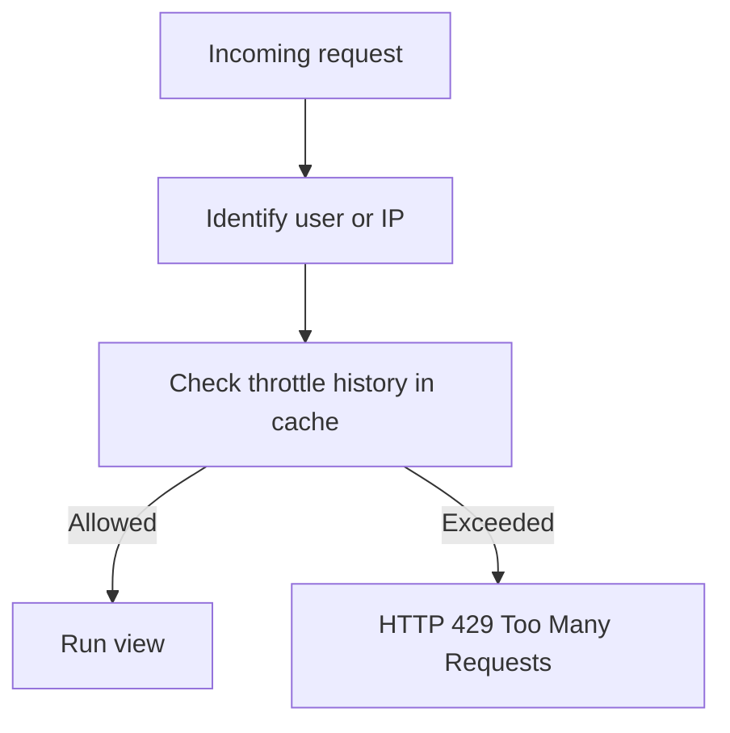
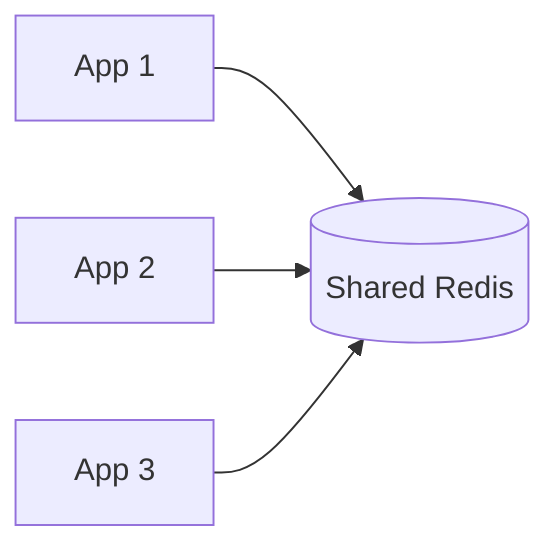

# DRF Pagination, Filtering & Throttling

> **Pagination** controls how much data is returned, **filtering** controls which data is returned, and **throttling** controls how frequently a client can call the API.

This note is aligned with **Django REST Framework 3.18** behavior and focuses on the patterns most commonly used in production APIs.

## Index

1. [Core Idea](#1-core-idea)
2. [Request Processing Flow](#2-request-processing-flow)
3. [Pagination](#3-pagination)
4. [Filtering, Search & Ordering](#4-filtering-search--ordering)
5. [Throttling](#5-throttling)
6. [Complete Practical Example](#6-complete-practical-example)
7. [Performance & Production Notes](#7-performance--production-notes)
8. [Testing & Quick Revision](#8-testing--quick-revision)

---

# 1. Core Idea

A large API should not return every database row or allow unlimited requests.

| Concern | Purpose | Example |
|---|---|---|
| Pagination | Limit response size | `?page=2` |
| Filtering | Select matching records | `?status=active` |
| Search | Free-text matching | `?search=keyboard` |
| Ordering | Control result order | `?ordering=-price` |
| Throttling | Limit request frequency | `60/minute` |

DRF does **not** enable pagination or throttling automatically. Pagination must be configured with a pagination class and page size, while throttling requires throttle classes and rates.

A useful mental model is:

```text
Pagination → How many records?
Filtering  → Which records?
Throttling → How often can the client ask?
```

---

# 2. Request Processing Flow

For a normal DRF list endpoint, think about the request in this order:



The important distinction is that **security restrictions are not optional filters**.

For example, tenant isolation belongs in `get_queryset()`:

```python
def get_queryset(self):
    return Product.objects.filter(
        organization=self.request.user.organization
    )
```

Do not trust a client-controlled parameter such as `?organization_id=10` to enforce tenant security.

---

# 3. Pagination

Pagination splits a large ordered queryset into smaller responses.

DRF provides three main pagination styles.

| Pagination | Request | Best for | Main trade-off |
|---|---|---|---|
| `PageNumberPagination` | `?page=2` | Admin tables, normal UIs | Usually requires a total `COUNT` |
| `LimitOffsetPagination` | `?limit=25&offset=50` | Integrations and flexible clients | Deep offsets become expensive |
| `CursorPagination` | `?cursor=...` | Feeds, logs, large changing datasets | No natural page jumping or total pages |

## 3.1 PageNumberPagination

Use page numbers when users expect page 1, 2, 3, and so on.

```python
from rest_framework.pagination import PageNumberPagination


class StandardPagination(PageNumberPagination):
    page_size = 25
    page_size_query_param = "page_size"
    max_page_size = 100
```

Example:

```http
GET /api/products/?page=2&page_size=50
```

Typical response:

```json
{
  "count": 125,
  "next": "https://api.example.com/api/products/?page=3",
  "previous": "https://api.example.com/api/products/?page=1",
  "results": []
}
```

Use `max_page_size` when clients can control page size so one request cannot ask for an excessive number of records.

## 3.2 LimitOffsetPagination

The client provides:

- `limit` → number of rows to return;
- `offset` → number of matching rows to skip.

```http
GET /api/products/?limit=25&offset=50
```

This is convenient for API consumers, but very large offsets can be slow because the database still has to walk past skipped rows.

It can also become inconsistent when rows are inserted or deleted between requests.

## 3.3 CursorPagination

Cursor pagination continues from a position in a stable ordered queryset.

```python
from rest_framework.pagination import CursorPagination


class ProductCursorPagination(CursorPagination):
    page_size = 25
    ordering = ("-created_at", "-id")
```

```http
GET /api/products/?cursor=cD0yMDI2LTA4LTAx...
```

Use cursor pagination for:

- activity feeds;
- event streams;
- audit logs;
- large chronological datasets;
- frequently changing data.

The cursor should be treated as **opaque** by the client.

## 3.4 Deterministic Ordering

Pagination requires predictable ordering.

Prefer:

```python
Product.objects.order_by("-created_at", "-id")
```

Instead of relying on:

```python
Product.objects.all()
```

If many rows have the same `created_at`, the unique `id` becomes the tie-breaker.

For cursor pagination, the ordering field should ideally be stable, non-null, indexed, and unique or nearly unique.

---

# 4. Filtering, Search & Ordering

Filtering should be divided into two categories:



## 4.1 Mandatory Filtering with `get_queryset()`

Use `get_queryset()` when filtering depends on trusted request context:

- current user;
- tenant or organization;
- URL ownership;
- visibility rules;
- permission scope.

```python
def get_queryset(self):
    return Product.objects.filter(
        organization=self.request.user.organization,
        status=Product.Status.ACTIVE,
    )
```

This is commonly part of the API's security boundary.

## 4.2 `DjangoFilterBackend`

Install `django-filter`:

```bash
pip install django-filter
```

Add it to Django:

```python
INSTALLED_APPS = [
    "rest_framework",
    "django_filters",
]
```

For simple equality filters:

```python
from django_filters.rest_framework import DjangoFilterBackend


class ProductViewSet(ReadOnlyModelViewSet):
    filter_backends = [DjangoFilterBackend]
    filterset_fields = ["status", "category"]
```

Example:

```http
GET /api/products/?status=active&category=electronics
```

### Custom `FilterSet`

Use a custom `FilterSet` when you need friendly parameter names, ranges, validation, or reusable rules.

```python
from django_filters import rest_framework as filters

from .models import Product


class ProductFilter(filters.FilterSet):
    min_price = filters.NumberFilter(
        field_name="price",
        lookup_expr="gte",
    )
    max_price = filters.NumberFilter(
        field_name="price",
        lookup_expr="lte",
    )

    class Meta:
        model = Product
        fields = ["status", "category", "min_price", "max_price"]
```

Now the API can support:

```http
GET /api/products/?status=active&min_price=100&max_price=500
```

Use `filterset_fields` for simple cases and `filterset_class` when filtering logic becomes more meaningful.

## 4.3 `SearchFilter`

`SearchFilter` is useful for human-entered text.

```python
from rest_framework.filters import SearchFilter


search_fields = [
    "^name",
    "category",
]
```

```http
GET /api/products/?search=mechanical keyboard
```

Common prefixes:

| Prefix | Lookup | Meaning |
|---|---|---|
| none | `icontains` | contains text |
| `^` | `istartswith` | starts with |
| `=` | `iexact` | exact, case-insensitive |
| `@` | `search` | PostgreSQL full-text search |
| `$` | `iregex` | regex search |

Avoid regex search for untrusted clients unless you have a strong reason, because expensive regular expressions can consume excessive CPU.

> **DRF 3.18 note:** `UnaccentedSearchFilter` is available for accent-insensitive PostgreSQL search when the `unaccent` extension is configured.

## 4.4 `OrderingFilter`

Allow clients to sort only by approved fields.

```python
from rest_framework.filters import OrderingFilter


ordering_fields = [
    "name",
    "price",
    "created_at",
]

ordering = ["-created_at", "-id"]
```

Examples:

```http
GET /api/products/?ordering=price
GET /api/products/?ordering=-price
GET /api/products/?ordering=category,-created_at
```

Prefer an explicit `ordering_fields` allowlist instead of exposing every field. It avoids unnecessary or sensitive ordering choices and makes the API contract clearer.

---

# 5. Throttling

Throttling limits how frequently a client may call an endpoint.



DRF includes three commonly used throttle classes.

| Throttle | Identity | Typical use |
|---|---|---|
| `AnonRateThrottle` | Client IP | Anonymous traffic |
| `UserRateThrottle` | User ID, IP fallback | General per-user limit |
| `ScopedRateThrottle` | Scope + user/IP | Different limits per endpoint |

## 5.1 Global Configuration

```python
REST_FRAMEWORK = {
    "DEFAULT_THROTTLE_CLASSES": [
        "rest_framework.throttling.AnonRateThrottle",
        "rest_framework.throttling.UserRateThrottle",
    ],
    "DEFAULT_THROTTLE_RATES": {
        "anon": "100/hour",
        "user": "1000/hour",
    },
}
```

If a throttle fails, DRF raises a throttling exception and normally returns:

```http
HTTP 429 Too Many Requests
```

Rates can use periods such as:

```text
10/second
60/minute
1000/hour
10000/day
```

## 5.2 Scoped Throttling

Expensive endpoints should often have lower limits.

```python
from rest_framework.throttling import ScopedRateThrottle


class ReportAPIView(APIView):
    throttle_classes = [ScopedRateThrottle]
    throttle_scope = "reports"
```

```python
REST_FRAMEWORK = {
    "DEFAULT_THROTTLE_RATES": {
        "reports": "10/minute",
    },
}
```

## 5.3 Burst + Sustained Limits

A production API often needs two limits:

```python
from rest_framework.throttling import UserRateThrottle


class BurstThrottle(UserRateThrottle):
    scope = "burst"


class SustainedThrottle(UserRateThrottle):
    scope = "sustained"
```

```python
REST_FRAMEWORK = {
    "DEFAULT_THROTTLE_RATES": {
        "burst": "60/minute",
        "sustained": "5000/day",
    }
}
```

Every configured throttle is checked. If any one fails, the request is rejected.

## 5.4 Cache and Concurrency

DRF's built-in throttles use Django's cache framework.

For a multi-instance deployment, use a **shared cache** such as Redis so all application instances see the same throttle history.



Important production points:

- configure `NUM_PROXIES` correctly when running behind trusted proxies;
- DRF throttling is application-level usage control, not DDoS protection;
- built-in throttle counters use non-atomic cache operations and can allow a few extra requests under high concurrency;
- use an API gateway, reverse proxy, CDN, or WAF when stricter network-level enforcement is required;
- do not use DRF throttle counters as exact billing records.

---

# 6. Complete Practical Example

Assume `Product` contains `organization`, `name`, `category`, `price`, `status`, and `created_at`.

The following example combines the patterns normally used in a real project.

## Pagination

```python
# common/pagination.py

from rest_framework.pagination import PageNumberPagination


class StandardPagination(PageNumberPagination):
    page_size = 25
    page_size_query_param = "page_size"
    max_page_size = 100
```

## Filters

```python
# products/filters.py

from django_filters import rest_framework as filters

from .models import Product


class ProductFilter(filters.FilterSet):
    min_price = filters.NumberFilter(
        field_name="price",
        lookup_expr="gte",
    )
    max_price = filters.NumberFilter(
        field_name="price",
        lookup_expr="lte",
    )

    class Meta:
        model = Product
        fields = ["status", "category", "min_price", "max_price"]
```

## Throttles

```python
# products/throttles.py

from rest_framework.throttling import UserRateThrottle


class ProductBurstThrottle(UserRateThrottle):
    scope = "product_burst"


class ProductDailyThrottle(UserRateThrottle):
    scope = "product_daily"
```

## ViewSet

```python
# products/views.py

from django_filters.rest_framework import DjangoFilterBackend
from rest_framework.filters import OrderingFilter, SearchFilter
from rest_framework.permissions import IsAuthenticated
from rest_framework.viewsets import ReadOnlyModelViewSet

from common.pagination import StandardPagination
from .filters import ProductFilter
from .models import Product
from .serializers import ProductSerializer
from .throttles import ProductBurstThrottle, ProductDailyThrottle


class ProductViewSet(ReadOnlyModelViewSet):
    serializer_class = ProductSerializer
    permission_classes = [IsAuthenticated]

    pagination_class = StandardPagination

    throttle_classes = [
        ProductBurstThrottle,
        ProductDailyThrottle,
    ]

    filter_backends = [
        DjangoFilterBackend,
        SearchFilter,
        OrderingFilter,
    ]

    filterset_class = ProductFilter
    search_fields = ["^name", "category"]
    ordering_fields = ["name", "price", "created_at"]
    ordering = ["-created_at", "-id"]

    def get_queryset(self):
        return Product.objects.filter(
            organization=self.request.user.organization
        )
```

## Settings

```python
REST_FRAMEWORK = {
    "DEFAULT_THROTTLE_RATES": {
        "product_burst": "60/minute",
        "product_daily": "5000/day",
    }
}
```

Example request:

```http
GET /api/products/?status=active&category=electronics&min_price=100&search=keyboard&ordering=-price&page=1&page_size=25
```

The server will:

```text
Authenticate
   ↓
Check permissions
   ↓
Check both throttles
   ↓
Restrict records to the user's organization
   ↓
Apply structured filters
   ↓
Apply text search
   ↓
Apply ordering
   ↓
Paginate
   ↓
Serialize and return the page
```

---

# 7. Performance & Production Notes

## Database Indexes

Indexes should follow real filter and ordering patterns.

```python
class Meta:
    indexes = [
        models.Index(fields=["organization", "status"]),
        models.Index(fields=["category", "price"]),
        models.Index(fields=["-created_at", "-id"]),
    ]
```

Do not add indexes blindly; inspect actual queries and database execution plans.

## N+1 Queries

Pagination limits the number of parent objects, but related serializers can still cause N+1 queries.

Use:

```python
Product.objects.select_related(
    "organization"
).prefetch_related(
    "tags"
)
```

Use `select_related()` for foreign-key / one-to-one relationships and `prefetch_related()` for many-to-many / reverse relationships.

## Count Cost

Page-number and limit/offset pagination normally calculate a total count. On a very large or complex filtered queryset, that count can become expensive.

If the UI does not need an exact total, cursor pagination can be a better choice.

## Search Cost

Normal `icontains` search can become expensive on large text fields.

For larger systems, consider:

- PostgreSQL full-text search;
- trigram indexes;
- a dedicated search engine;
- a limited set of searchable fields.

---

# 8. Testing & Quick Revision

Test the API behavior that the client actually receives.

```python
@pytest.mark.django_db
def test_product_list_is_filtered_and_paginated(
    api,
    product_factory,
):
    product_factory(
        status="active",
        category="electronics",
        price="200.00",
    )
    product_factory(
        status="inactive",
        category="electronics",
        price="300.00",
    )

    response = api.get(
        "/api/products/",
        {
            "status": "active",
            "ordering": "price",
        },
    )

    assert response.status_code == 200
    assert response.data["count"] == 1
    assert response.data["results"][0]["status"] == "active"
```

Also test:

- tenant isolation;
- maximum page size;
- filter ranges;
- search behavior;
- allowed ordering;
- `429` responses for throttled requests.

## Quick Revision

| Requirement | Preferred DRF tool |
|---|---|
| User/tenant security restriction | `get_queryset()` |
| Simple exact filters | `filterset_fields` |
| Validated/range/custom filters | `FilterSet` |
| Free-text matching | `SearchFilter` |
| Client sorting | `OrderingFilter` |
| Normal numbered pages | `PageNumberPagination` |
| Flexible offset-based clients | `LimitOffsetPagination` |
| Large changing feed | `CursorPagination` |
| Anonymous rate limit | `AnonRateThrottle` |
| Per-user rate limit | `UserRateThrottle` |
| Endpoint-specific rate limit | `ScopedRateThrottle` |
| Strong traffic enforcement | Gateway / proxy / CDN / WAF |

The main design rule to remember is:

> **Restrict first, filter second, order deterministically, paginate last, and use throttling as application-level usage control rather than as your only security layer.**
