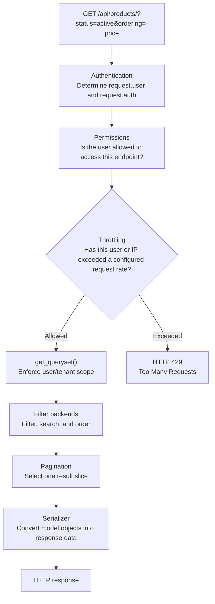
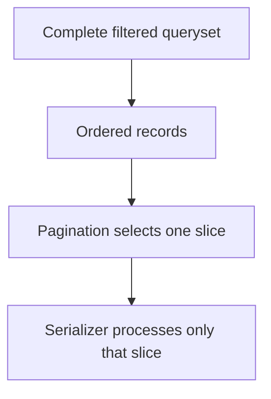
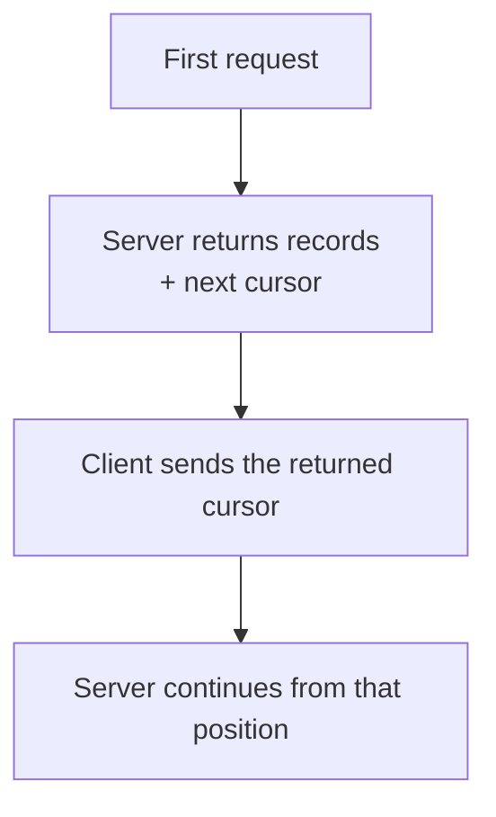
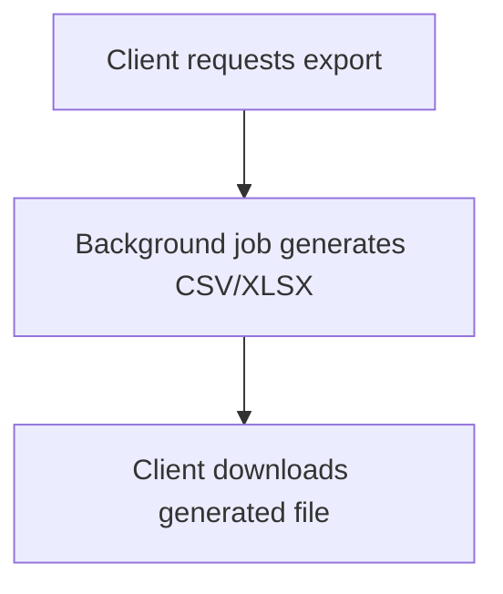
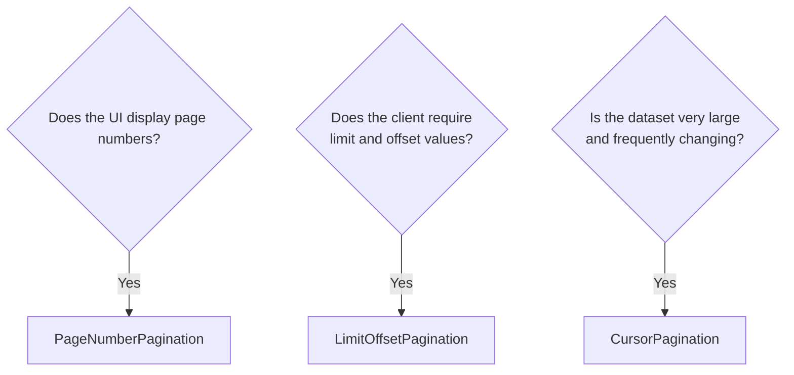
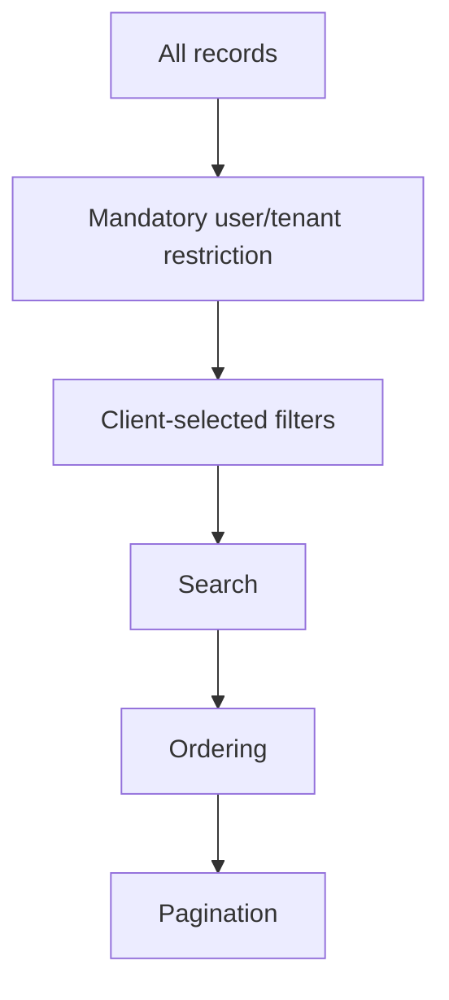
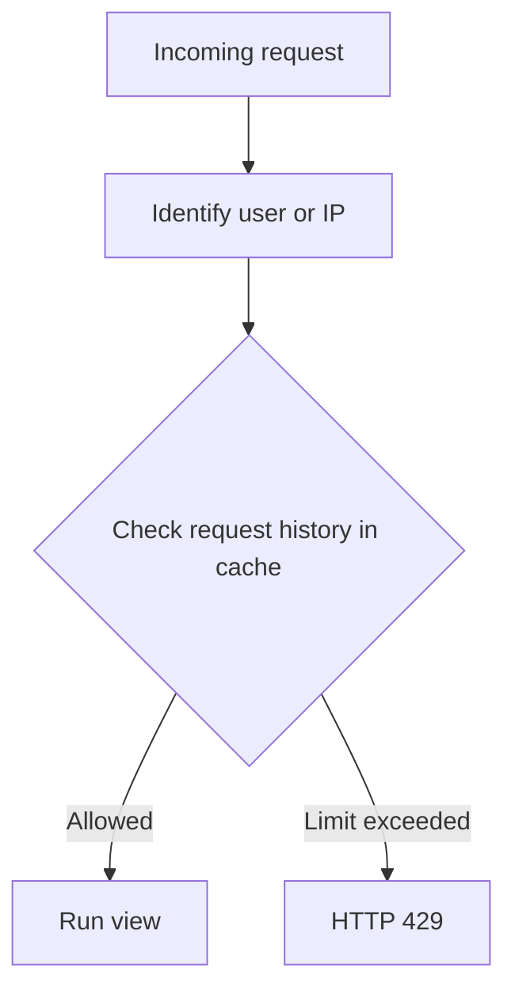
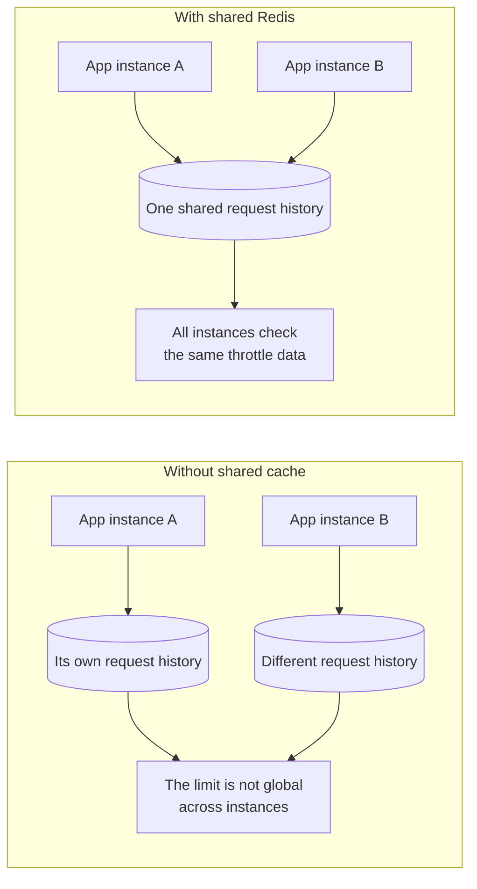

# DRF Pagination, Filtering & Throttling

> Pagination controls **how much data** is returned, filtering controls **which data** is returned, and throttling controls **how frequently** a client can call the API.

## In short

- DRF enables **none** of this by default: `DEFAULT_PAGINATION_CLASS`, `PAGE_SIZE`, and `DEFAULT_THROTTLE_CLASSES` are all empty, and an unpaginated list endpoint is a production incident waiting for the table to grow.
- Three pagination classes: `PageNumberPagination` (`?page=2`, numbered UIs, needs a `count` query), `LimitOffsetPagination` (`?limit=25&offset=50`, flexible, slow at deep offsets), `CursorPagination` (`?cursor=…`, large or fast-changing data, no total count, needs stable indexed `ordering`).
- Ordering must be deterministic — `("-created_at", "-id")`, never a bare `.all()` — or records shift between pages as rows are inserted.
- **Mandatory** restrictions (tenant, owner, visibility) belong in `get_queryset()`, never in a client-supplied query parameter. `DjangoFilterBackend`, `SearchFilter`, and `OrderingFilter` are for *optional* client choices on top of that.
- `filterset_fields` handles simple generated lookups; a `filterset_class` (a `FilterSet`) gives friendly parameter names, ranges, method filters, and validation. Always give `ordering_fields` an explicit allowlist rather than `"__all__"`.
- Throttling identifies the caller and counts in Django's cache: `AnonRateThrottle` by IP, `UserRateThrottle` by user ID, `ScopedRateThrottle` by `throttle_scope`. Rates come from `DEFAULT_THROTTLE_RATES` as `"100/hour"`; every configured throttle must pass, which is how burst plus sustained limits combine.
- Multi-instance deployments need a **shared** cache (Redis) or each process throttles independently. DRF's counters race under concurrency, so treat them as a usage policy, not as enforcement or billing.



**Interview answer:** These are three separate concerns applied in a fixed order. Throttling runs first and answers "may this client make a request at all"; then `get_queryset()` applies the restrictions that are not negotiable, such as the caller's tenant; then the filter backends apply what the client asked for — structured filters, free-text search, ordering; and only then does pagination slice the ordered result so the serializer touches 25 rows instead of 200,000. The choice that usually matters most is pagination style: page numbers for an admin table, cursors for a feed, because a deep `offset` still makes the database walk every skipped row.

**Gotcha:** Paginating a queryset with no deterministic ordering. If two rows share a `created_at` the database is free to return them in either order, so a row can appear on page 1 and page 2, or never appear at all. Always end the ordering with a unique tie-breaker such as `-id`.

---

# 1. Overview

Consider an endpoint containing hundreds of thousands of products. Returning every one of them from a single `GET /api/products/` would:

- increase database workload;
- increase serialization time;
- consume more server memory;
- increase network transfer;
- slow down the client;
- make the endpoint easier to misuse.

DRF provides separate tools for separate responsibilities:

| Feature | Responsibility | Example |
|---|---|---|
| Pagination | Divide a large result set into smaller responses | Return 25 products per request |
| Field filtering | Select records using structured conditions | `?status=active` |
| Search | Match text across selected fields | `?search=keyboard` |
| Ordering | Control result order | `?ordering=-price` |
| Throttling | Limit request frequency | 60 requests per minute |

## Important defaults

DRF does not enable pagination or throttling automatically — `DEFAULT_PAGINATION_CLASS` and `PAGE_SIZE` are `None`, and `DEFAULT_THROTTLE_CLASSES` is empty. You must configure these features globally or apply them to individual views.

---

# 2. Example Model and Serializer

The examples in this guide use a product API.

## Model

```python
# products/models.py

from django.conf import settings
from django.db import models

class Product(models.Model):
    class Status(models.TextChoices):
        ACTIVE = "active", "Active"
        INACTIVE = "inactive", "Inactive"

    organization = models.ForeignKey(
        "organizations.Organization",
        on_delete=models.CASCADE,
        related_name="products",
    )
    name = models.CharField(max_length=200, db_index=True)
    category = models.CharField(max_length=100, db_index=True)
    price = models.DecimalField(max_digits=10, decimal_places=2)
    status = models.CharField(
        max_length=20,
        choices=Status.choices,
        default=Status.ACTIVE,
        db_index=True,
    )
    created_at = models.DateTimeField(
        auto_now_add=True,
        db_index=True,
    )

    class Meta:
        ordering = ["-created_at", "-id"]
        indexes = [
            models.Index(fields=["organization", "status"]),
            models.Index(fields=["category", "price"]),
            models.Index(fields=["-created_at", "-id"]),
        ]

    def __str__(self) -> str:
        return self.name
```

## Serializer

```python
# products/serializers.py

from rest_framework import serializers

from .models import Product

class ProductSerializer(serializers.ModelSerializer):
    class Meta:
        model = Product
        fields = [
            "id",
            "name",
            "category",
            "price",
            "status",
            "created_at",
        ]
        read_only_fields = ["id", "created_at"]
```

The default model ordering contains `id` as a tie-breaker. This produces deterministic ordering when multiple records share the same `created_at` value.

---

# 3. Pagination

Pagination divides a large queryset into smaller responses.



DRF includes three main pagination styles:

| Pagination class | Request format | Common use |
|---|---|---|
| `PageNumberPagination` | `?page=2` | Admin tables and numbered pages |
| `LimitOffsetPagination` | `?limit=25&offset=50` | Flexible API consumers |
| `CursorPagination` | `?cursor=encoded-value` | Large and frequently changing datasets |

> [!NOTE]
> Automatic pagination is provided by DRF generic list views and viewsets. A plain `APIView` requires manual pagination logic.

---

## 3.1 PageNumberPagination

The client requests a page number with `GET /api/products/?page=2`. A normal paginated response looks like this:

```json
{
  "count": 125,
  "next": "https://api.example.com/api/products/?page=3",
  "previous": "https://api.example.com/api/products/?page=1",
  "results": [
    {
      "id": 26,
      "name": "Mechanical Keyboard",
      "category": "electronics",
      "price": "120.00",
      "status": "active",
      "created_at": "2026-07-25T10:30:00Z"
    }
  ]
}
```

### Global configuration

```python
# settings.py

REST_FRAMEWORK = {
    "DEFAULT_PAGINATION_CLASS": (
        "rest_framework.pagination.PageNumberPagination"
    ),
    "PAGE_SIZE": 25,
}
```

This configuration affects generic list views and viewsets unless a view overrides it.

### Custom page-number pagination, applied to one ViewSet

```python
# common/pagination.py
from rest_framework.pagination import PageNumberPagination

class StandardPageNumberPagination(PageNumberPagination):
    page_size = 25
    page_query_param = "page"
    page_size_query_param = "page_size"
    max_page_size = 100

# products/views.py
from rest_framework.viewsets import ReadOnlyModelViewSet

from common.pagination import StandardPageNumberPagination

from .models import Product
from .serializers import ProductSerializer

class ProductViewSet(ReadOnlyModelViewSet):
    queryset = Product.objects.all()
    serializer_class = ProductSerializer
    pagination_class = StandardPageNumberPagination
```

Because `page_size_query_param` is set, the client may now request `?page=2&page_size=50` — and because `max_page_size` is `100`, no request can force the server to return more than 100 records.

`PageNumberPagination` also supports the special value `?page=last` by default.

### Best use cases

Use page-number pagination when:

- the frontend displays numbered pages;
- users need to jump to a particular page;
- the dataset is moderate in size;
- showing total items and total pages is useful.

### Main trade-off

Page-number pagination usually requires a total count query. Counting a large or complex filtered queryset may become expensive.

---

## 3.2 LimitOffsetPagination

This style uses two values:

- `limit`: maximum number of records to return;
- `offset`: number of matching records to skip.

So `GET /api/products/?limit=25&offset=50` means: skip the first 50 matching records, return the next 25. When `PAGE_SIZE` is configured, the client may omit `limit` and send only `?offset=50`.

### Configuration

```python
# settings.py
REST_FRAMEWORK = {
    "DEFAULT_PAGINATION_CLASS": (
        "rest_framework.pagination.LimitOffsetPagination"
    ),
    "PAGE_SIZE": 25,
}

# common/pagination.py — or subclass it for per-view control
from rest_framework.pagination import LimitOffsetPagination

class StandardLimitOffsetPagination(LimitOffsetPagination):
    default_limit = 25
    limit_query_param = "limit"
    offset_query_param = "offset"
    max_limit = 100
```

### Best use cases

Use limit/offset pagination when:

- API consumers need direct batch-size control;
- clients work naturally with numeric offsets;
- the endpoint is used by internal systems or integrations;
- deep pagination is uncommon.

### Main trade-offs

Large offsets may be expensive: for `GET /api/products/?limit=25&offset=900000` the database may still need to locate or scan every skipped row.

Records may also shift between requests when rows are inserted or deleted. If a new record arrives at the top of the ordering between a client's `offset=0` request and its `offset=25` request, everything slides down by one and a record already shown on the first page reappears on the second.

---

## 3.3 CursorPagination

Cursor pagination uses an opaque cursor representing a position in an ordered queryset.

```http
GET /api/products/?cursor=cD0yMDI2LTA3LTI1...
```

A typical response looks like this:

```json
{
  "next": "https://api.example.com/api/products/?cursor=...",
  "previous": null,
  "results": [
    {
      "id": 501,
      "name": "USB-C Dock"
    }
  ]
}
```

Cursor pagination normally does not return a total count.

### Configuration

```python
# common/pagination.py

from rest_framework.pagination import CursorPagination

class ProductCursorPagination(CursorPagination):
    page_size = 25
    cursor_query_param = "cursor"
    ordering = ("-created_at", "-id")

class ProductViewSet(ReadOnlyModelViewSet):
    queryset = Product.objects.all()
    serializer_class = ProductSerializer
    pagination_class = ProductCursorPagination
```

### Why ordering matters

Cursor pagination requires a stable ordering value. A suitable ordering field should normally be stable after creation, non-null, indexed, unique or nearly unique, and convertible to a string.

In `("-created_at", "-id")`, `created_at` provides chronological ordering and `id` provides a deterministic tie-breaker.

### Cursor behavior



The client must treat the cursor as opaque. It should not manually create, modify, or decode it as part of normal API usage.

### Best use cases

Use cursor pagination when:

- the dataset is large;
- new rows are frequently inserted;
- users browse sequentially;
- the API powers feeds, timelines, logs, or events;
- deep offset performance is a concern.

### Advantages

- performs better than deep offsets on very large datasets;
- gives a more consistent sequential view while records are inserted;
- prevents normal page-number jumping from producing unstable pages;
- avoids a total count query in the standard response.

### Trade-offs

- clients cannot naturally jump to page 100;
- total pages are not normally available;
- ordering must be carefully designed;
- clients must preserve the returned cursor URL or value.

---

## 3.4 Custom Pagination Response

You can customize the response shape while retaining DRF pagination behavior.

```python
# common/pagination.py

from rest_framework.pagination import PageNumberPagination
from rest_framework.response import Response

class StandardPagination(PageNumberPagination):
    page_size = 25
    page_size_query_param = "page_size"
    max_page_size = 100

    def get_paginated_response(self, data):
        return Response(
            {
                "meta": {
                    "total_items": self.page.paginator.count,
                    "current_page": self.page.number,
                    "total_pages": self.page.paginator.num_pages,
                    "page_size": len(data),
                },
                "links": {
                    "next": self.get_next_link(),
                    "previous": self.get_previous_link(),
                },
                "data": data,
            }
        )
```

Response:

```json
{
  "meta": {
    "total_items": 125,
    "current_page": 2,
    "total_pages": 5,
    "page_size": 25
  },
  "links": {
    "next": "https://api.example.com/api/products/?page=3",
    "previous": "https://api.example.com/api/products/?page=1"
  },
  "data": []
}
```

### Disable pagination for one view

```python
class ProductExportViewSet(ReadOnlyModelViewSet):
    queryset = Product.objects.all()
    serializer_class = ProductSerializer
    pagination_class = None
```

Use this carefully. An unpaginated JSON endpoint may become unsafe as data grows.

For large exports, a separate export workflow is usually better:



---

## 3.5 Pagination with APIView

Pagination is not applied automatically to a plain `APIView`.

```python
from rest_framework.pagination import PageNumberPagination
from rest_framework.response import Response
from rest_framework.views import APIView

from .models import Product
from .serializers import ProductSerializer

class ProductListAPIView(APIView):
    def get(self, request):
        queryset = Product.objects.order_by("-created_at", "-id")

        paginator = PageNumberPagination()
        paginator.page_size = 25

        page = paginator.paginate_queryset(
            queryset=queryset,
            request=request,
            view=self,
        )

        serializer = ProductSerializer(page, many=True)
        return paginator.get_paginated_response(serializer.data)
```

With `ListAPIView`, `ListModelMixin`, or a normal ViewSet list action, DRF handles this process for you.

---

## 3.6 Choosing a Pagination Style



### Comparison

| Requirement | Page Number | Limit/Offset | Cursor |
|---|---:|---:|---:|
| Easy for users to understand | Excellent | Moderate | Low |
| Jump to arbitrary position | Yes | Yes | No |
| Total item count | Usually included | Usually included | Normally absent |
| Deep pagination performance | Moderate | Can become poor | Strong |
| Frequently changing records | Can shift | Can shift | More consistent |
| Admin table | Strong | Strong | Moderate |
| Infinite scroll/feed | Moderate | Moderate | Strong |
| Large event stream | Weak | Moderate | Strong |

---

# 4. Filtering

Filtering determines which records are included in the queryset.

```http
GET /api/products/?status=active&category=electronics
```

The processing idea is:



DRF filtering commonly uses:

1. `get_queryset()`;
2. `DjangoFilterBackend`;
3. `SearchFilter`;
4. `OrderingFilter`.

---

## 4.1 Filtering with get_queryset

Override `get_queryset()` when filtering depends on request context or mandatory business rules.

Common examples:

- current authenticated user;
- organization or tenant;
- URL parameter;
- permission scope;
- account status;
- visibility rules.

### Current-user filtering

```python
from rest_framework.generics import ListAPIView

from .models import Order
from .serializers import OrderSerializer

class MyOrderListView(ListAPIView):
    serializer_class = OrderSerializer

    def get_queryset(self):
        return Order.objects.filter(customer=self.request.user)
```

### Organization isolation

```python
def get_queryset(self):
    return Product.objects.filter(
        organization=self.request.user.organization
    )
```

This is a security boundary, not an optional client filter.

Do not implement tenant security like this:

```python
# Unsafe design

def get_queryset(self):
    organization_id = self.request.query_params.get("organization_id")
    return Product.objects.filter(organization_id=organization_id)
```

A client can change the query parameter.

### Filter using a URL parameter

```python
# /api/categories/<category_id>/products/

def get_queryset(self):
    return Product.objects.filter(
        category_id=self.kwargs["category_id"]
    )
```

### Combine mandatory and optional filtering

```python
def get_queryset(self):
    queryset = Product.objects.filter(
        organization=self.request.user.organization
    )

    status_value = self.request.query_params.get("status")

    if status_value:
        queryset = queryset.filter(status=status_value)

    return queryset
```

For simple cases this works well. For multiple validated query parameters, a `FilterSet` is cleaner.

---

## 4.2 DjangoFilterBackend

`DjangoFilterBackend` is provided through the `django-filter` package.

### Installation and configuration

```bash
pip install django-filter
```

```python
# settings.py

INSTALLED_APPS = [
    # ...
    "django_filters",
]

REST_FRAMEWORK = {
    "DEFAULT_FILTER_BACKENDS": [
        "django_filters.rest_framework.DjangoFilterBackend",
    ],
}
```

### Per-view configuration

```python
from django_filters.rest_framework import DjangoFilterBackend
from rest_framework.viewsets import ReadOnlyModelViewSet

class ProductViewSet(ReadOnlyModelViewSet):
    queryset = Product.objects.all()
    serializer_class = ProductSerializer
    filter_backends = [DjangoFilterBackend]
    filterset_fields = ["status", "category"]
```

Requests:

```http
GET /api/products/?status=active
GET /api/products/?category=electronics
GET /api/products/?status=active&category=electronics
```

Multiple parameters are normally combined using `AND`, so the last request means `status = active AND category = electronics`.

### Lookup expressions

You can allow specific field lookups:

```python
class ProductViewSet(ReadOnlyModelViewSet):
    queryset = Product.objects.all()
    serializer_class = ProductSerializer
    filter_backends = [DjangoFilterBackend]

    filterset_fields = {
        "status": ["exact"],
        "category": ["exact", "iexact"],
        "price": ["exact", "gte", "lte"],
        "created_at": ["date", "date__gte", "date__lte"],
    }
```

Example requests:

```http
GET /api/products/?price__gte=100&price__lte=500

GET /api/products/?category__iexact=Electronics

GET /api/products/?created_at__date=2026-07-25
```

Use this shorthand when the query parameter names can follow Django lookup naming.

---

## 4.3 Custom FilterSet

A custom `FilterSet` is better when you need:

- friendly parameter names;
- range filtering;
- custom validation;
- reusable filtering rules;
- method-based filters;
- relationship filtering.

### Product filter

```python
# products/filters.py

import django_filters

from .models import Product

class ProductFilter(django_filters.FilterSet):
    min_price = django_filters.NumberFilter(
        field_name="price",
        lookup_expr="gte",
    )
    max_price = django_filters.NumberFilter(
        field_name="price",
        lookup_expr="lte",
    )
    category = django_filters.CharFilter(
        field_name="category",
        lookup_expr="iexact",
    )
    created_after = django_filters.IsoDateTimeFilter(
        field_name="created_at",
        lookup_expr="gte",
    )
    created_before = django_filters.IsoDateTimeFilter(
        field_name="created_at",
        lookup_expr="lte",
    )

    class Meta:
        model = Product
        fields = [
            "status",
            "category",
            "min_price",
            "max_price",
            "created_after",
            "created_before",
        ]
```

### Attach it to a ViewSet

```python
from django_filters.rest_framework import DjangoFilterBackend

class ProductViewSet(ReadOnlyModelViewSet):
    queryset = Product.objects.all()
    serializer_class = ProductSerializer
    filter_backends = [DjangoFilterBackend]
    filterset_class = ProductFilter
```

Requests:

```http
GET /api/products/?min_price=100&max_price=500

GET /api/products/?status=active&category=electronics

GET /api/products/?created_after=2026-07-01T00:00:00Z
```

### Custom boolean filter

Assume the model also contains `stock_quantity`.

```python
class ProductFilter(django_filters.FilterSet):
    available = django_filters.BooleanFilter(
        method="filter_available"
    )

    def filter_available(self, queryset, name, value):
        if value is True:
            return queryset.filter(stock_quantity__gt=0)

        if value is False:
            return queryset.filter(stock_quantity=0)

        return queryset
```

Request: `GET /api/products/?available=true`

### Comma-separated list filter

```python
class CharInFilter(
    django_filters.BaseInFilter,
    django_filters.CharFilter,
):
    pass

class ProductFilter(django_filters.FilterSet):
    categories = CharInFilter(
        field_name="category",
        lookup_expr="in",
    )

    class Meta:
        model = Product
        fields = []
```

Request: `GET /api/products/?categories=electronics,books,office`

> [!NOTE]
> Use either `filterset_fields` for simple generated filters or `filterset_class` for a custom filter class. A custom `FilterSet` gives better control as requirements grow.

### Filters can affect detail endpoints

Filter backends may also be applied while resolving an individual object.

```http
GET /api/products/42/?status=active
```

Product `42` may exist, but DRF can return `404 Not Found` when it does not match the active filter.

---

## 4.4 SearchFilter

`SearchFilter` provides a single free-text search parameter.

```python
from rest_framework.filters import SearchFilter

class ProductViewSet(ReadOnlyModelViewSet):
    queryset = Product.objects.all()
    serializer_class = ProductSerializer
    filter_backends = [SearchFilter]
    search_fields = [
        "name",
        "category",
    ]
```

Request: `GET /api/products/?search=keyboard`

### Search related fields

```python
search_fields = [
    "name",
    "brand__name",
    "category",
]
```

### Search prefixes

| Prefix | Django lookup | Behavior |
|---|---|---|
| No prefix | `icontains` | Case-insensitive contains |
| `^` | `istartswith` | Starts with |
| `=` | `iexact` | Exact match ignoring case |
| `$` | `iregex` | Regular expression |
| `@` | `search` | PostgreSQL full-text search |

Example:

```python
search_fields = [
    "^name",
    "=sku",
    "description",
]
```

This means:

- `name` must start with the term;
- `sku` must match exactly, ignoring case;
- `description` may contain the term.

### Multiple search terms

The default search behavior supports multiple terms. A returned object must match **all** of them, although each term may match a different configured field. Quoting treats a phrase as one term.

```http
GET /api/products/?search=wireless keyboard
GET /api/products/?search="wireless keyboard"
```

### Filtering versus searching

Use structured filters for typed conditions and search for human-entered text. Do not replace structured filters with one large search parameter.

```http
GET /api/products/?status=active&min_price=100    # structured filter
GET /api/products/?search=mechanical keyboard     # free-text search
```

---

## 4.5 OrderingFilter

`OrderingFilter` lets the client control result ordering.

```python
from rest_framework.filters import OrderingFilter

class ProductViewSet(ReadOnlyModelViewSet):
    queryset = Product.objects.all()
    serializer_class = ProductSerializer
    filter_backends = [OrderingFilter]
    ordering_fields = [
        "name",
        "price",
        "created_at",
    ]
    ordering = ["-created_at", "-id"]
```

Requests:

```http
GET /api/products/?ordering=price

GET /api/products/?ordering=-price

GET /api/products/?ordering=category,-created_at
```

A minus sign means descending order, so `?ordering=price` puts the lowest price first and `?ordering=-price` the highest.

### Explicitly allow ordering fields

`ordering_fields` is an allowlist, and `"__all__"` should be a deliberate choice — an explicit list prevents clients from ordering by sensitive or expensive fields. The separate `ordering` attribute sets the default, and a stable default is what keeps pagination predictable.

```python
ordering_fields = ["name", "price", "created_at"]   # allowlist
ordering = ["-created_at", "-id"]                   # deterministic default
```

---

# 5. Throttling

Throttling controls how frequently a client may call an API.



Typical uses:

- smaller limits for anonymous users;
- larger limits for authenticated users;
- strict limits for expensive reports;
- separate burst and daily limits;
- plan-specific API allowances.

> [!IMPORTANT]
> DRF throttling is an application-level usage policy. It is not complete protection against DDoS attacks, credential attacks, or malicious traffic. Use a CDN, WAF, API gateway, reverse proxy, and endpoint-specific security controls where required.

The general rate-limiting algorithms behind such gateways — token bucket, leaky bucket, fixed and sliding windows, and the `Retry-After` and `RateLimit-*` response headers — are covered in [Rate Limiting](../api-design/rate-limiting.md). This section is about DRF's own throttle classes.

---

## Global configuration

```python
# settings.py

REST_FRAMEWORK = {
    "DEFAULT_THROTTLE_CLASSES": [
        "rest_framework.throttling.AnonRateThrottle",
        "rest_framework.throttling.UserRateThrottle",
    ],
    "DEFAULT_THROTTLE_RATES": {
        "anon": "100/hour",
        "user": "1000/hour",
    },
}
```

A rate is written `"<count>/<period>"` where the period is `second`, `minute`, `hour`, or `day` — for example `"10/second"`, `"60/minute"`, `"1000/hour"`, `"10000/day"`. DRF only inspects the first character after `/` to determine the period, so full words are simply easier to read.

Exceeding the rate produces `HTTP 429 Too Many Requests`:

```json
{
  "detail": "Request was throttled. Expected available in 42 seconds."
}
```

---

## 5.1 AnonRateThrottle

`AnonRateThrottle` applies only to unauthenticated users.

It uses the incoming client IP address to build the throttle key.

```python
REST_FRAMEWORK = {
    "DEFAULT_THROTTLE_CLASSES": [
        "rest_framework.throttling.AnonRateThrottle",
    ],
    "DEFAULT_THROTTLE_RATES": {
        "anon": "100/hour",
    },
}
```

Use it when unknown clients should have a smaller allowance.

### Shared-IP consideration

Multiple users can share one public IP through:

- corporate networks;
- mobile carrier NAT;
- public Wi-Fi;
- proxy servers.

Those users may share the same anonymous throttle allowance.

---

## 5.2 UserRateThrottle

`UserRateThrottle` uses the authenticated user ID as the throttle identity.

Unauthenticated requests fall back to an IP-based key.

```python
REST_FRAMEWORK = {
    "DEFAULT_THROTTLE_CLASSES": [
        "rest_framework.throttling.UserRateThrottle",
    ],
    "DEFAULT_THROTTLE_RATES": {
        "user": "1000/day",
    },
}
```

Use it for a general per-user API allowance.

### Custom user throttle

```python
# common/throttles.py
from rest_framework.throttling import UserRateThrottle

class ProductRateThrottle(UserRateThrottle):
    scope = "products"

# settings.py
REST_FRAMEWORK = {
    "DEFAULT_THROTTLE_RATES": {
        "products": "120/minute",
    },
}

# products/views.py
class ProductViewSet(ReadOnlyModelViewSet):
    throttle_classes = [ProductRateThrottle]
```

The unique scope connects the class to the matching rate in settings.

---

## 5.3 ScopedRateThrottle

`ScopedRateThrottle` applies different limits to different parts of the API.

```python
REST_FRAMEWORK = {
    "DEFAULT_THROTTLE_CLASSES": [
        "rest_framework.throttling.ScopedRateThrottle",
    ],
    "DEFAULT_THROTTLE_RATES": {
        "products": "120/minute",
        "reports": "10/minute",
        "exports": "5/hour",
    },
}
```

Views then declare which scope they belong to:

```python
class ProductViewSet(ReadOnlyModelViewSet):
    throttle_scope = "products"

class ReportAPIView(APIView):
    throttle_scope = "reports"

class ExportAPIView(APIView):
    throttle_scope = "exports"
```

This supports different endpoint cost profiles:

| Endpoint | Cost | Example limit |
|---|---:|---:|
| Product list | Low | 120/minute |
| Analytics report | High | 10/minute |
| Large export | Very high | 5/hour |

### Action-specific ViewSet scopes

```python
from rest_framework.throttling import ScopedRateThrottle
from rest_framework.viewsets import ModelViewSet

class ProductViewSet(ModelViewSet):
    queryset = Product.objects.all()
    serializer_class = ProductSerializer
    throttle_classes = [ScopedRateThrottle]

    def get_throttles(self):
        scope_by_action = {
            "list": "product_list",
            "retrieve": "product_detail",
            "create": "product_write",
            "update": "product_write",
            "partial_update": "product_write",
            "destroy": "product_write",
        }

        self.throttle_scope = scope_by_action.get(
            self.action,
            "product_default",
        )

        return super().get_throttles()
```

```python
REST_FRAMEWORK = {
    "DEFAULT_THROTTLE_RATES": {
        "product_list": "120/minute",
        "product_detail": "300/minute",
        "product_write": "30/minute",
        "product_default": "60/minute",
    },
}
```

---

## 5.4 Burst and Sustained Limits

One rate is often insufficient: a **burst** limit protects against sudden spikes, while a **sustained** limit controls long-term consumption. Declaring two scoped throttles gives you both.

```python
# common/throttles.py
from rest_framework.throttling import UserRateThrottle

class BurstRateThrottle(UserRateThrottle):
    scope = "burst"

class SustainedRateThrottle(UserRateThrottle):
    scope = "sustained"

# settings.py
REST_FRAMEWORK = {
    "DEFAULT_THROTTLE_CLASSES": [
        "common.throttles.BurstRateThrottle",
        "common.throttles.SustainedRateThrottle",
    ],
    "DEFAULT_THROTTLE_RATES": {
        "burst": "60/minute",
        "sustained": "5000/day",
    },
}
```

Every configured throttle is checked, so a request that passes the burst check but fails the daily check is still rejected.

---

## 5.5 Cache and Concurrency

DRF built-in throttles use Django's cache framework.

### Development cache

The local-memory cache is acceptable for simple local development:

```python
CACHES = {
    "default": {
        "BACKEND": (
            "django.core.cache.backends.locmem.LocMemCache"
        ),
    },
}
```

### Production shared cache

For multiple application instances, use a shared cache such as Redis.

```bash
pip install django-redis
```

```python
CACHES = {
    "default": {
        "BACKEND": "django_redis.cache.RedisCache",
        "LOCATION": "redis://redis:6379/1",
        "OPTIONS": {
            "CLIENT_CLASS": (
                "django_redis.client.DefaultClient"
            ),
        },
    },
}
```

Why a shared cache matters:



### Dedicated throttle cache

A throttle class can point at a named cache through its `cache` attribute, keeping throttle counters off the general-purpose cache.

```python
CACHES = {
    "default": {
        "BACKEND": "django.core.cache.backends.locmem.LocMemCache",
    },
    "throttling": {
        "BACKEND": "django_redis.cache.RedisCache",
        "LOCATION": "redis://redis:6379/2",
        "OPTIONS": {
            "CLIENT_CLASS": "django_redis.client.DefaultClient",
        },
    },
}

from django.core.cache import caches
from rest_framework.throttling import UserRateThrottle

class RedisUserRateThrottle(UserRateThrottle):
    cache = caches["throttling"]
```

### Proxy configuration

DRF can use `X-Forwarded-For` and `REMOTE_ADDR` when identifying client IPs.

When the API runs behind known proxies, review `NUM_PROXIES`:

```python
REST_FRAMEWORK = {
    "NUM_PROXIES": 1,
}
```

This setting must match the real network architecture. Incorrect proxy configuration can create inaccurate client identities.

### Concurrency limitation

Built-in throttles are subject to race conditions under high concurrency. A few additional requests may pass the configured limit.

Therefore:

- use DRF throttling for application-level usage policies;
- use gateway or reverse-proxy limits for stricter traffic enforcement;
- do not use throttle counters as exact billing records;
- record billable usage separately;
- load-test the actual production architecture.

---

# 6. Complete ViewSet Example

This example combines:

- organization-level data isolation;
- page-number pagination;
- structured filters;
- text search;
- controlled ordering;
- burst and sustained throttling;
- optimized queryset loading.

## Pagination class

```python
# common/pagination.py

from rest_framework.pagination import PageNumberPagination

class StandardPagination(PageNumberPagination):
    page_size = 25
    page_size_query_param = "page_size"
    max_page_size = 100
```

## FilterSet

```python
# products/filters.py

import django_filters

from .models import Product

class ProductFilter(django_filters.FilterSet):
    min_price = django_filters.NumberFilter(
        field_name="price",
        lookup_expr="gte",
    )
    max_price = django_filters.NumberFilter(
        field_name="price",
        lookup_expr="lte",
    )
    category = django_filters.CharFilter(
        field_name="category",
        lookup_expr="iexact",
    )
    created_after = django_filters.IsoDateTimeFilter(
        field_name="created_at",
        lookup_expr="gte",
    )

    class Meta:
        model = Product
        fields = [
            "status",
            "category",
            "min_price",
            "max_price",
            "created_after",
        ]
```

## Throttle classes

```python
# products/throttles.py

from rest_framework.throttling import UserRateThrottle

class ProductBurstThrottle(UserRateThrottle):
    scope = "product_burst"

class ProductSustainedThrottle(UserRateThrottle):
    scope = "product_sustained"
```

## ViewSet

```python
# products/views.py

from django_filters.rest_framework import DjangoFilterBackend
from rest_framework.filters import OrderingFilter, SearchFilter
from rest_framework.permissions import IsAuthenticated
from rest_framework.viewsets import ReadOnlyModelViewSet

from common.pagination import StandardPagination

from .filters import ProductFilter
from .models import Product
from .serializers import ProductSerializer
from .throttles import (
    ProductBurstThrottle,
    ProductSustainedThrottle,
)

class ProductViewSet(ReadOnlyModelViewSet):
    serializer_class = ProductSerializer
    permission_classes = [IsAuthenticated]
    pagination_class = StandardPagination
    throttle_classes = [
        ProductBurstThrottle,
        ProductSustainedThrottle,
    ]

    filter_backends = [
        DjangoFilterBackend,
        SearchFilter,
        OrderingFilter,
    ]
    filterset_class = ProductFilter
    search_fields = [
        "^name",
        "category",
    ]
    ordering_fields = [
        "name",
        "price",
        "created_at",
    ]
    ordering = ["-created_at", "-id"]

    def get_queryset(self):
        return Product.objects.filter(
            organization=self.request.user.organization
        )
```

## Settings

```python
# settings.py

INSTALLED_APPS = [
    # ...
    "rest_framework",
    "django_filters",
]

REST_FRAMEWORK = {
    "DEFAULT_FILTER_BACKENDS": [
        "django_filters.rest_framework.DjangoFilterBackend",
        "rest_framework.filters.SearchFilter",
        "rest_framework.filters.OrderingFilter",
    ],
    "DEFAULT_THROTTLE_RATES": {
        "product_burst": "60/minute",
        "product_sustained": "5000/day",
    },
}
```

## Router

```python
# products/urls.py

from rest_framework.routers import DefaultRouter

from .views import ProductViewSet

router = DefaultRouter()
router.register(
    prefix="products",
    viewset=ProductViewSet,
    basename="product",
)

urlpatterns = router.urls
```

## Example request

```http
GET /api/products/
    ?status=active
    &category=electronics
    &min_price=100
    &max_price=1000
    &search=keyboard
    &ordering=-price
    &page=1
    &page_size=25
```

Processing order: authenticate the user, check `IsAuthenticated`, check the burst throttle, check the sustained throttle, restrict the queryset to the user's organization, apply the status/category/price filters, apply the text search, apply descending price ordering, select the requested page, then serialize and return that page.

---

# 7. Responsibility Mapping

The request-processing diagram for this pipeline is in **In short** at the top of this note.

| Responsibility | Correct location |
|---|---|
| Tenant or organization isolation | `get_queryset()` |
| User-owned data restriction | `get_queryset()` |
| Exact and range filters | `DjangoFilterBackend` |
| Free-text search | `SearchFilter` |
| Client-selected sorting | `OrderingFilter` |
| Result slicing | Pagination class |
| Application request allowance | Throttle class |
| Strong network traffic protection | CDN, WAF, proxy, or gateway |

---

# 8. Performance Considerations

Pagination limits response size, but it does not automatically make a slow query fast.

## Database indexes

Add indexes for fields frequently used in filtering and ordering.

```python
class Meta:
    indexes = [
        models.Index(fields=["organization", "status"]),
        models.Index(fields=["category", "price"]),
        models.Index(fields=["-created_at", "-id"]),
    ]
```

Indexes should match real query patterns. Use database query plans to confirm their value.

## Deterministic ordering

Stable ordering prevents records from moving unpredictably between pages.

```python
queryset = Product.objects.all()                            # avoid: unspecified order
queryset = Product.objects.order_by("-created_at", "-id")   # prefer
```

## N+1 queries

Pagination reduces the number of parent objects, but serializer relationships can still create N+1 queries. Use `select_related()` for foreign key and one-to-one relationships and `prefetch_related()` for many-to-many and reverse relationships.

```python
queryset = Product.objects.select_related("organization").prefetch_related("tags")
```

## Count query cost

Page-number and limit/offset responses commonly include `count`.

For a large filtered queryset, the count query itself may be expensive.

Possible approaches:

- use cursor pagination when total count is unnecessary;
- simplify expensive filters;
- add suitable indexes;
- cache approximate counts where exact totals are not required;
- provide totals through a separate endpoint when appropriate.

## Search performance

Default `icontains` search may become expensive on large text columns.

For larger systems, consider:

- PostgreSQL full-text search;
- PostgreSQL trigram indexes;
- a dedicated search engine;
- restricted search fields;
- query-length limits;
- monitoring slow search terms.

## Deep offsets

```http
GET /api/products/?limit=25&offset=1000000
```

This can be much slower than cursor-based navigation.

Prefer cursor pagination for large chronological datasets and infinite scrolling.

---

# 9. Testing

Test API behavior, not only class attributes.

## Pagination, filtering, search, and ordering

Assert on the response body, since that is what the client sees.

```python
from decimal import Decimal

import pytest
from rest_framework.test import APIClient

from products.models import Product

@pytest.fixture
def api(user):
    client = APIClient()
    client.force_authenticate(user=user)
    return client

@pytest.mark.django_db
def test_product_list_is_paginated(api, organization):
    Product.objects.bulk_create([
        Product(
            organization=organization,
            name=f"Product {index}",
            category="electronics",
            price="100.00",
        )
        for index in range(30)
    ])

    response = api.get("/api/products/")

    assert response.status_code == 200
    assert response.data["count"] == 30
    assert len(response.data["results"]) == 25     # page_size, not the total
    assert response.data["next"] is not None

@pytest.mark.django_db
def test_filter_products_by_status(api, product_factory):
    product_factory(status="active")
    product_factory(status="inactive")

    response = api.get("/api/products/", {"status": "active"})

    assert all(p["status"] == "active" for p in response.data["results"])

@pytest.mark.django_db
def test_filter_products_by_price_range(api, product_factory):
    for amount in ("50.00", "200.00", "900.00"):
        product_factory(price=Decimal(amount))

    response = api.get(
        "/api/products/", {"min_price": "100", "max_price": "500"}
    )

    prices = {Decimal(item["price"]) for item in response.data["results"]}
    assert prices == {Decimal("200.00")}

@pytest.mark.django_db
def test_search_products(api, product_factory):
    product_factory(name="Mechanical Keyboard")
    product_factory(name="Gaming Mouse")

    response = api.get("/api/products/", {"search": "keyboard"})

    names = {p["name"] for p in response.data["results"]}
    assert names == {"Mechanical Keyboard"}

@pytest.mark.django_db
def test_order_products_by_price(api, product_factory):
    product_factory(price="500.00")
    product_factory(price="100.00")

    response = api.get("/api/products/", {"ordering": "price"})

    prices = [Decimal(item["price"]) for item in response.data["results"]]
    assert prices == sorted(prices)
```

## Tenant isolation

The most important test in this file: prove the mandatory `get_queryset()` restriction holds.

```python
@pytest.mark.django_db
def test_user_cannot_access_another_organization_product(
    api, another_organization, product_factory
):
    other_product = product_factory(organization=another_organization)

    response = api.get("/api/products/")

    returned_ids = {item["id"] for item in response.data["results"]}
    assert other_product.id not in returned_ids
```

## Throttling test

Use a dedicated low-rate throttle so the limit is reached predictably, and make sure the view under test actually uses it.

```python
# tests/throttles.py
from rest_framework.throttling import UserRateThrottle

class TestUserThrottle(UserRateThrottle):
    rate = "2/minute"

# tests/test_throttling.py
from django.core.cache import cache

@pytest.mark.django_db
def test_request_is_throttled_after_limit(api):
    cache.clear()   # throttle state persists between tests otherwise

    assert api.get("/api/products/").status_code == 200
    assert api.get("/api/products/").status_code == 200
    assert api.get("/api/products/").status_code == 429
```

---

# 10. Practical Best Practices

## Pagination

- Configure pagination globally or explicitly on list views.
- Keep a reasonable default page size.
- Set a maximum client-controlled page size.
- Use deterministic ordering.
- Use cursor pagination for large sequential datasets.
- Avoid deep offsets where possible.
- Measure count-query cost.
- Do not expose unbounded list endpoints.
- Use a separate workflow for large exports.

## Filtering

- Enforce tenant and user restrictions in `get_queryset()`.
- Use `DjangoFilterBackend` for structured filtering.
- Use a custom `FilterSet` for validation and friendly parameters.
- Use `SearchFilter` only on selected fields.
- Use `OrderingFilter` with an explicit allowlist.
- Index frequently filtered and ordered fields.
- Inspect generated SQL for complex queries.
- Keep query-parameter names stable as part of the API contract.

## Throttling

- Use different anonymous and authenticated limits.
- Use scoped limits for expensive endpoints.
- Combine burst and sustained limits.
- Use a shared cache in multi-instance deployments.
- Configure proxy handling correctly.
- Expect minor inaccuracies under concurrency.
- Use gateway or proxy limits for stronger enforcement.
- Do not treat throttle counters as exact billing records.
- Test and monitor `429` responses.

## API contract

Document:

- available filters;
- search fields or search behavior;
- allowed ordering fields;
- default ordering;
- page-size limits;
- pagination response format;
- throttle policy when relevant;
- expected client behavior after `429`.

---

# 11. Official References

- [Django REST Framework — Pagination](https://www.django-rest-framework.org/api-guide/pagination/)
- [Django REST Framework — Filtering](https://www.django-rest-framework.org/api-guide/filtering/)
- [Django REST Framework — Throttling](https://www.django-rest-framework.org/api-guide/throttling/)
- [Django REST Framework — Settings](https://www.django-rest-framework.org/api-guide/settings/)
- [Django REST Framework — Generic Views](https://www.django-rest-framework.org/api-guide/generic-views/)
- [django-filter Documentation](https://django-filter.readthedocs.io/)
- [Django REST Framework on PyPI](https://pypi.org/project/djangorestframework/)
