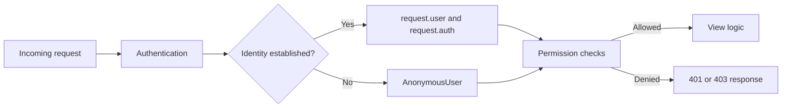
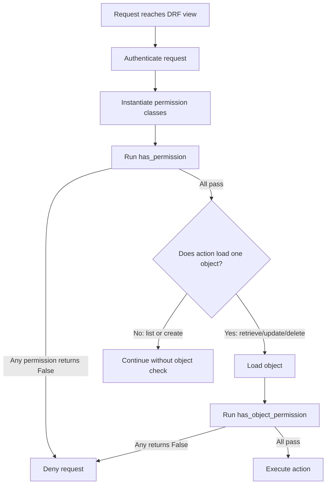
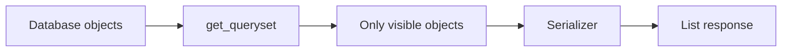
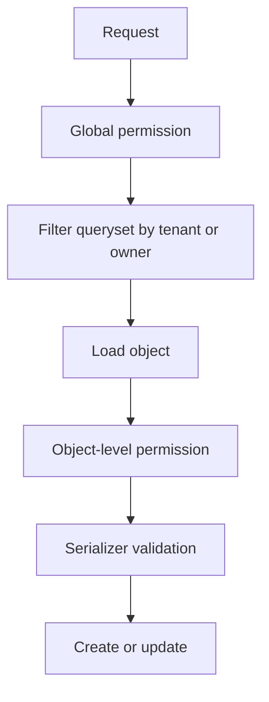

# DRF Permissions — Including Object-Level Permissions

> **Core idea:** Authentication identifies the caller. Permissions decide whether that caller is allowed to perform the requested operation.

DRF permissions protect API endpoints at two main levels:

1. **View-level permission** — Can the request access this endpoint or action?
2. **Object-level permission** — Can the request access this particular database object?

A secure API commonly combines permissions with queryset filtering and serializer validation.

---

# 1. Authentication vs Authorization

Authentication and permissions solve different problems.

| Concern | Main question | DRF examples |
|---|---|---|
| Authentication | Who is making the request? | Session, Token, JWT |
| Permission | Is this caller allowed to perform the action? | `IsAuthenticated`, custom permissions |
| Throttling | Is the caller making too many requests? | User or anonymous rate limits |

### Simple request flow



Authentication does **not** automatically authorize a user.

For example, a valid JWT may prove that a user is logged in, but it does not prove that the user owns the invoice they are trying to update.

---

# 2. How DRF Permission Checks Work

Permission classes inherit from:

```python
from rest_framework.permissions import BasePermission
```

A custom permission can implement one or both methods:

```python
class ExamplePermission(BasePermission):
    def has_permission(self, request, view):
        """View-level permission."""
        return True

    def has_object_permission(self, request, view, obj):
        """Object-level permission."""
        return True
```

## 2.1 Permission lifecycle



### Important behavior

- Every permission class in `permission_classes` must allow the request.
- `has_object_permission()` runs only after `has_permission()` passes.
- Generic detail views call object-level checks through `get_object()`.
- List endpoints do not automatically check every object.
- Create actions do not yet have an object to check.

---

# 3. Configuring Permissions

Permissions can be configured globally or per view.

## 3.1 Global default permissions

Set default permissions in `settings.py`:

```python
REST_FRAMEWORK = {
    "DEFAULT_PERMISSION_CLASSES": [
        "rest_framework.permissions.IsAuthenticated",
    ],
}
```

This makes authentication required unless a view explicitly overrides the setting.

A common production default is:

```python
REST_FRAMEWORK = {
    "DEFAULT_PERMISSION_CLASSES": [
        "rest_framework.permissions.IsAuthenticated",
    ],
}
```

Then public endpoints explicitly use `AllowAny`.

This is safer than making every endpoint public by default.

---

## 3.2 APIView permissions

```python
from rest_framework.permissions import IsAuthenticated
from rest_framework.views import APIView


class ProfileView(APIView):
    permission_classes = [IsAuthenticated]
```

---

## 3.3 Generic view permissions

```python
from rest_framework.generics import RetrieveUpdateAPIView
from rest_framework.permissions import IsAuthenticated


class ProfileDetailView(RetrieveUpdateAPIView):
    permission_classes = [IsAuthenticated]
    serializer_class = ProfileSerializer
    queryset = Profile.objects.all()
```

---

## 3.4 ViewSet permissions

```python
from rest_framework.permissions import IsAuthenticated
from rest_framework.viewsets import ModelViewSet


class ProjectViewSet(ModelViewSet):
    permission_classes = [IsAuthenticated]
    serializer_class = ProjectSerializer
    queryset = Project.objects.all()
```

---

## 3.5 Function-based view permissions

```python
from rest_framework.decorators import api_view, permission_classes
from rest_framework.permissions import IsAuthenticated
from rest_framework.response import Response


@api_view(["GET"])
@permission_classes([IsAuthenticated])
def account_summary(request):
    return Response({"user": request.user.username})
```

Setting `permission_classes` on a view overrides the global default for that view.

---

# 4. Built-in Permission Classes

DRF includes several commonly used permissions.

## 4.1 `AllowAny`

Allows authenticated and anonymous requests.

```python
from rest_framework.permissions import AllowAny


class LoginView(APIView):
    permission_classes = [AllowAny]
```

Typical use cases:

- Login
- Registration
- Password reset request
- Public health-check endpoint

Use it explicitly so the public nature of the endpoint is clear.

---

## 4.2 `IsAuthenticated`

Allows only authenticated users.

```python
permission_classes = [IsAuthenticated]
```

Typical use cases:

- User profile
- Orders
- Internal dashboards
- Authenticated application APIs

---

## 4.3 `IsAdminUser`

Allows users whose `is_staff` value is `True`.

```python
from rest_framework.permissions import IsAdminUser


class AdminReportView(APIView):
    permission_classes = [IsAdminUser]
```

`IsAdminUser` checks `user.is_staff`. It does not check `is_superuser`.

---

## 4.4 `IsAuthenticatedOrReadOnly`

Allows:

- Any caller to use safe methods
- Only authenticated users to use write methods

```python
from rest_framework.permissions import IsAuthenticatedOrReadOnly


class ArticleViewSet(ModelViewSet):
    permission_classes = [IsAuthenticatedOrReadOnly]
```

Safe methods are:

```python
GET
HEAD
OPTIONS
```

DRF exposes them through:

```python
from rest_framework.permissions import SAFE_METHODS
```

---

## 4.5 `DjangoModelPermissions`

Connects DRF authorization to Django model permissions.

Default mappings include:

| HTTP method | Django permission |
|---|---|
| `POST` | `app_label.add_modelname` |
| `PUT` | `app_label.change_modelname` |
| `PATCH` | `app_label.change_modelname` |
| `DELETE` | `app_label.delete_modelname` |

Example:

```python
from rest_framework.permissions import DjangoModelPermissions


class DocumentViewSet(ModelViewSet):
    permission_classes = [DjangoModelPermissions]
    queryset = Document.objects.all()
    serializer_class = DocumentSerializer
```

The view must provide `queryset` or `get_queryset()` so DRF can identify the model.

By default, you may need to customize `perms_map` when `GET` requests should require Django's `view` permission.

---

## 4.6 `DjangoModelPermissionsOrAnonReadOnly`

This behaves like `DjangoModelPermissions`, while allowing anonymous read-only access.

```python
from rest_framework.permissions import DjangoModelPermissionsOrAnonReadOnly
```

---

## 4.7 `DjangoObjectPermissions`

Connects DRF to a Django authentication backend that supports per-object permissions.

```python
from rest_framework.permissions import DjangoObjectPermissions


class ContractViewSet(ModelViewSet):
    permission_classes = [DjangoObjectPermissions]
    queryset = Contract.objects.all()
    serializer_class = ContractSerializer
```

A compatible object-permission backend is required. A common option is `django-guardian`, although DRF is not limited to that package.

---

# 5. Custom View-Level Permissions

Use `has_permission()` when the decision does not depend on a specific model instance.

Examples:

- User must be authenticated.
- User must belong to a particular role.
- Endpoint is available only to internal staff.
- Write operations require a verified account.
- A custom ViewSet action has a special access rule.

## 5.1 Role-based permission

```python
from rest_framework.permissions import BasePermission


class IsManager(BasePermission):
    message = "Manager access is required."
    code = "manager_access_required"

    def has_permission(self, request, view):
        return (
            request.user.is_authenticated
            and request.user.role == "manager"
        )
```

Usage:

```python
class TeamReportView(APIView):
    permission_classes = [IsManager]
```

---

## 5.2 Read-only access for anonymous users

```python
from rest_framework.permissions import BasePermission, SAFE_METHODS


class AuthenticatedWriteOnly(BasePermission):
    def has_permission(self, request, view):
        if request.method in SAFE_METHODS:
            return True

        return request.user.is_authenticated
```

This is conceptually similar to `IsAuthenticatedOrReadOnly`, but custom logic can be added later.

---

## 5.3 Action-specific checks inside a permission

```python
class CanPublishArticle(BasePermission):
    message = "You are not allowed to publish articles."

    def has_permission(self, request, view):
        if getattr(view, "action", None) != "publish":
            return True

        return (
            request.user.is_authenticated
            and request.user.has_perm("articles.publish_article")
        )
```

Use `getattr()` because not every DRF view has a ViewSet `action` attribute.

---

# 6. Object-Level Permissions

Object-level permissions decide whether the caller may act on one specific object.

Example requirement:

> Any authenticated user can view a project, but only the project owner can modify or delete it.

## 6.1 Owner-or-read-only permission

```python
from rest_framework.permissions import BasePermission, SAFE_METHODS


class IsOwnerOrReadOnly(BasePermission):
    message = "Only the owner can modify this object."

    def has_object_permission(self, request, view, obj):
        if request.method in SAFE_METHODS:
            return True

        return obj.owner_id == request.user.id
```

Usage:

```python
class ProjectViewSet(ModelViewSet):
    permission_classes = [IsAuthenticated, IsOwnerOrReadOnly]
    queryset = Project.objects.all()
    serializer_class = ProjectSerializer
```

### Why compare IDs?

This is usually clearer and may avoid unnecessary object comparison:

```python
obj.owner_id == request.user.id
```

instead of:

```python
obj.owner == request.user
```

Both can work.

---

## 6.2 Owner-or-admin permission

```python
class IsOwnerOrAdmin(BasePermission):
    message = "You do not have permission to access this object."

    def has_object_permission(self, request, view, obj):
        return (
            request.user.is_staff
            or obj.owner_id == request.user.id
        )
```

For read/write differentiation:

```python
class IsOwnerOrAdminOrReadOnly(BasePermission):
    def has_object_permission(self, request, view, obj):
        if request.method in SAFE_METHODS:
            return True

        return (
            request.user.is_staff
            or obj.owner_id == request.user.id
        )
```

---

## 6.3 Generic views automatically perform object checks

DRF generic detail views and `ModelViewSet` actions normally call:

```python
self.check_object_permissions(request, obj)
```

through their standard `get_object()` implementation.

Therefore, this works automatically for normal:

- `retrieve`
- `update`
- `partial_update`
- `destroy`

---

## 6.4 Custom `get_object()` must call the check

When overriding `get_object()`, do not forget the object-level permission call.

```python
from django.shortcuts import get_object_or_404


class ProjectDetailView(APIView):
    permission_classes = [IsAuthenticated, IsOwnerOrAdmin]

    def get_object(self, project_id):
        project = get_object_or_404(Project, id=project_id)

        self.check_object_permissions(
            self.request,
            project,
        )

        return project
```

Without `check_object_permissions()`, `has_object_permission()` will not run.

---

## 6.5 Custom ViewSet action with an object

Use `self.get_object()` where possible because it performs lookup and object-level permission checking.

```python
from rest_framework.decorators import action
from rest_framework.response import Response


class ProjectViewSet(ModelViewSet):
    permission_classes = [IsAuthenticated, IsOwnerOrAdmin]
    queryset = Project.objects.all()
    serializer_class = ProjectSerializer

    @action(detail=True, methods=["post"])
    def archive(self, request, pk=None):
        project = self.get_object()
        project.is_archived = True
        project.save(update_fields=["is_archived"])

        return Response({"status": "archived"})
```

Avoid directly calling:

```python
Project.objects.get(pk=pk)
```

inside the action unless you manually run object permission checks.

---

# 7. Important Object-Level Limitations

Object-level permissions are powerful, but they do not cover every action automatically.

## 7.1 List endpoints are not checked object by object

For performance reasons, DRF does not call `has_object_permission()` for every object returned by a list endpoint.

This permission:

```python
class IsProjectMember(BasePermission):
    def has_object_permission(self, request, view, obj):
        return obj.members.filter(id=request.user.id).exists()
```

does **not** automatically filter:

```http
GET /api/projects/
```

You must filter the queryset.

```python
class ProjectViewSet(ModelViewSet):
    permission_classes = [IsAuthenticated, IsProjectMember]
    serializer_class = ProjectSerializer

    def get_queryset(self):
        return Project.objects.filter(
            members=self.request.user
        ).distinct()
```

### List-access model



For list endpoints, `get_queryset()` is usually the first security boundary.

---

## 7.2 Create actions have no object yet

During `POST`, the target object does not exist when initial permissions run.

Therefore, `has_object_permission()` cannot protect creation.

Use one or more of:

- `has_permission()`
- Serializer validation
- `perform_create()`
- A service-layer authorization check

Example:

```python
class ProjectViewSet(ModelViewSet):
    permission_classes = [IsAuthenticated]
    serializer_class = ProjectSerializer

    def perform_create(self, serializer):
        serializer.save(owner=self.request.user)
```

The client should not be trusted to submit the owner:

```json
{
  "name": "Secret Project",
  "owner": 999
}
```

Instead, assign ownership from `request.user`.

---

## 7.3 Bulk operations need explicit authorization

A custom bulk endpoint may affect multiple objects without calling `get_object()`.

```python
@action(detail=False, methods=["post"])
def bulk_archive(self, request):
    project_ids = request.data.get("project_ids", [])

    projects = self.get_queryset().filter(id__in=project_ids)

    updated = projects.update(is_archived=True)

    return Response({"updated": updated})
```

The filtered queryset must ensure the caller can modify every affected object.

For complex bulk operations, load the objects, validate authorization, and then update them inside a transaction.

---

# 8. Production Ownership Pattern

A robust ownership design normally uses three layers:



## 8.1 Example model

```python
from django.conf import settings
from django.db import models


class Project(models.Model):
    name = models.CharField(max_length=200)
    owner = models.ForeignKey(
        settings.AUTH_USER_MODEL,
        on_delete=models.CASCADE,
        related_name="projects",
    )
    is_archived = models.BooleanField(default=False)
    created_at = models.DateTimeField(auto_now_add=True)
```

---

## 8.2 Serializer

```python
from rest_framework import serializers


class ProjectSerializer(serializers.ModelSerializer):
    owner = serializers.PrimaryKeyRelatedField(read_only=True)

    class Meta:
        model = Project
        fields = [
            "id",
            "name",
            "owner",
            "is_archived",
            "created_at",
        ]
        read_only_fields = [
            "id",
            "owner",
            "created_at",
        ]
```

The owner is read-only because the server controls ownership.

---

## 8.3 Permission

```python
from rest_framework.permissions import BasePermission, SAFE_METHODS


class IsProjectOwner(BasePermission):
    message = "You do not have access to this project."

    def has_object_permission(self, request, view, obj):
        if request.method in SAFE_METHODS:
            return obj.owner_id == request.user.id

        return obj.owner_id == request.user.id
```

Because both branches are the same, simplify it:

```python
class IsProjectOwner(BasePermission):
    message = "You do not have access to this project."

    def has_object_permission(self, request, view, obj):
        return obj.owner_id == request.user.id
```

---

## 8.4 ViewSet

```python
from rest_framework.permissions import IsAuthenticated
from rest_framework.viewsets import ModelViewSet


class ProjectViewSet(ModelViewSet):
    permission_classes = [IsAuthenticated, IsProjectOwner]
    serializer_class = ProjectSerializer

    def get_queryset(self):
        return (
            Project.objects
            .filter(owner=self.request.user)
            .select_related("owner")
        )

    def perform_create(self, serializer):
        serializer.save(owner=self.request.user)
```

This design protects all common actions:

| Action | Protection |
|---|---|
| List | `get_queryset()` returns only owned projects |
| Create | `IsAuthenticated` and server-assigned owner |
| Retrieve | Filtered queryset plus object permission |
| Update | Filtered queryset plus object permission |
| Delete | Filtered queryset plus object permission |

### Defense in depth

The queryset and object permission may appear repetitive, but they solve different concerns:

- Queryset filtering controls visibility and lookup scope.
- Object permissions express the authorization policy.
- Serializer rules protect input fields.
- `perform_create()` safely assigns server-controlled values.

---

## 8.5 Multi-tenant example

For a tenant-based system, never trust a tenant ID provided only by the client.

```python
class InvoiceViewSet(ModelViewSet):
    permission_classes = [IsAuthenticated, IsTenantMember]
    serializer_class = InvoiceSerializer

    def get_queryset(self):
        return Invoice.objects.filter(
            tenant_id=self.request.user.tenant_id
        )

    def perform_create(self, serializer):
        serializer.save(
            tenant_id=self.request.user.tenant_id,
            created_by=self.request.user,
        )
```

A stronger system may derive the active tenant from verified membership or request context rather than directly from a mutable user field.

---

# 9. Permissions Based on ViewSet Actions

Different ViewSet actions may require different policies.

Example:

- List and retrieve: authenticated users
- Create: managers
- Update and delete: administrators

```python
from rest_framework.permissions import IsAdminUser, IsAuthenticated


class ProjectViewSet(ModelViewSet):
    queryset = Project.objects.all()
    serializer_class = ProjectSerializer

    def get_permissions(self):
        if self.action in {"list", "retrieve"}:
            permission_classes = [IsAuthenticated]
        elif self.action == "create":
            permission_classes = [IsManager]
        else:
            permission_classes = [IsAdminUser]

        return [
            permission()
            for permission in permission_classes
        ]
```

## 9.1 Extra action permission

Permissions can also be declared directly on an `@action`.

```python
from rest_framework.decorators import action
from rest_framework.permissions import IsAdminUser


class ProjectViewSet(ModelViewSet):
    permission_classes = [IsAuthenticated]

    @action(
        detail=True,
        methods=["post"],
        permission_classes=[IsAdminUser],
    )
    def restore(self, request, pk=None):
        project = self.get_object()
        project.is_archived = False
        project.save(update_fields=["is_archived"])

        return Response({"status": "restored"})
```

The action-level `permission_classes` overrides the ViewSet-level configuration for that action.

---

# 10. Django Model and Object Permissions

Django creates standard model permissions:

```text
add
change
delete
view
```

Examples:

```text
projects.add_project
projects.change_project
projects.delete_project
projects.view_project
```

## 10.1 Checking Django permissions manually

```python
request.user.has_perm("projects.change_project")
```

For object-aware backends:

```python
request.user.has_perm(
    "projects.change_project",
    project,
)
```

---

## 10.2 Requiring `view` permission for GET

A custom `DjangoModelPermissions` class can extend `perms_map`.

```python
from rest_framework.permissions import DjangoModelPermissions


class ViewDjangoModelPermissions(DjangoModelPermissions):
    perms_map = {
        **DjangoModelPermissions.perms_map,
        "GET": ["%(app_label)s.view_%(model_name)s"],
        "HEAD": ["%(app_label)s.view_%(model_name)s"],
        "OPTIONS": ["%(app_label)s.view_%(model_name)s"],
    }
```

Usage:

```python
class DocumentViewSet(ModelViewSet):
    permission_classes = [ViewDjangoModelPermissions]
    queryset = Document.objects.all()
    serializer_class = DocumentSerializer
```

---

## 10.3 Object permissions with a backend

`DjangoObjectPermissions` depends on an authentication backend that can answer object-specific permission checks.

Conceptually:

```python
user.has_perm("documents.change_document", document)
```

For list endpoints, object permission backends still do not automatically filter every result. Apply queryset filtering or use a compatible filtering integration.

---

# 11. Combining Permission Classes

DRF permission classes can be composed using:

- `&` — AND
- `|` — OR
- `~` — NOT

## 11.1 OR composition

Allow authenticated users or read-only requests:

```python
from rest_framework.permissions import (
    BasePermission,
    IsAuthenticated,
    SAFE_METHODS,
)


class ReadOnly(BasePermission):
    def has_permission(self, request, view):
        return request.method in SAFE_METHODS


class ArticleViewSet(ModelViewSet):
    permission_classes = [
        IsAuthenticated | ReadOnly
    ]
```

---

## 11.2 AND composition

Require authentication and manager access:

```python
permission_classes = [
    IsAuthenticated & IsManager
]
```

The equivalent, often more readable form is:

```python
permission_classes = [
    IsAuthenticated,
    IsManager,
]
```

---

## 11.3 Grouping expressions

```python
permission_classes = [
    IsAuthenticated & (IsManager | IsAdminUser)
]
```

Use parentheses to make the policy clear.

For complex business rules, a named custom permission class is often easier to understand and test than a long expression.

---

# 12. Permissions vs Querysets vs Serializers

Authorization should be applied at the correct layer.

| Layer | Best suited for |
|---|---|
| `permission_classes` | Endpoint, action, role, and single-object authorization |
| `get_queryset()` | Which existing records the caller can see or target |
| Serializer validation | Whether submitted field values are allowed |
| `perform_create()` | Assigning owner, tenant, creator, or server-controlled values |
| Service layer | Complex business authorization spanning multiple models |

## 12.1 Example decision

Requirement:

> A manager may approve an expense only when it belongs to the manager's department and is currently pending.

This rule depends on both authorization and business state.

```python
class CanApproveExpense(BasePermission):
    message = "This expense cannot be approved by you."

    def has_object_permission(self, request, view, obj):
        if getattr(view, "action", None) != "approve":
            return True

        return (
            request.user.role == "manager"
            and obj.department_id == request.user.department_id
            and obj.status == Expense.Status.PENDING
        )
```

Action:

```python
from django.db import transaction
from rest_framework.decorators import action
from rest_framework.response import Response


class ExpenseViewSet(ModelViewSet):
    permission_classes = [
        IsAuthenticated,
        CanApproveExpense,
    ]

    @action(detail=True, methods=["post"])
    @transaction.atomic
    def approve(self, request, pk=None):
        expense = self.get_object()

        expense.status = Expense.Status.APPROVED
        expense.approved_by = request.user
        expense.save(
            update_fields=["status", "approved_by"]
        )

        return Response({"status": "approved"})
```

For concurrency-sensitive workflows, re-check mutable business state inside the transaction, potentially with row locking.

---

# 13. Permission Error Responses

A failed permission check results in `401 Unauthorized` or `403 Forbidden`, depending on authentication state and the authentication scheme.

## 13.1 General meaning

### `401 Unauthorized`

Usually means valid authentication credentials are required.

```json
{
  "detail": "Authentication credentials were not provided."
}
```

### `403 Forbidden`

Usually means the request was authenticated but the caller is not allowed.

```json
{
  "detail": "You do not have permission to perform this action."
}
```

The exact result can also depend on whether the highest-priority authentication class uses a `WWW-Authenticate` header.

---

## 13.2 Custom permission message

```python
class IsAccountOwner(BasePermission):
    message = "Only the account owner can perform this action."
    code = "account_owner_required"

    def has_object_permission(self, request, view, obj):
        return obj.user_id == request.user.id
```

Keep messages clear without exposing sensitive internal details.

---

# 14. Testing Permissions

Permissions should be tested with multiple user types and request methods.

## 14.1 Suggested test matrix

| Scenario | Expected result |
|---|---|
| Anonymous user opens protected endpoint | Denied |
| Authenticated owner retrieves object | Allowed |
| Authenticated non-owner retrieves object | Denied or not found |
| Owner updates object | Allowed |
| Non-owner updates object | Denied |
| Owner deletes object | Allowed |
| Non-owner deletes object | Denied |
| User lists objects | Only permitted records returned |
| User submits another user's owner ID | Server ignores or rejects it |
| Admin uses admin-only action | Allowed |
| Normal user uses admin-only action | Denied |

---

## 14.2 Example tests with `APITestCase`

```python
from django.contrib.auth import get_user_model
from rest_framework import status
from rest_framework.test import APITestCase


User = get_user_model()


class ProjectPermissionTests(APITestCase):
    def setUp(self):
        self.owner = User.objects.create_user(
            username="owner",
            password="test-pass-123",
        )
        self.other_user = User.objects.create_user(
            username="other",
            password="test-pass-123",
        )
        self.project = Project.objects.create(
            name="Owner Project",
            owner=self.owner,
        )
        self.url = f"/api/projects/{self.project.id}/"

    def test_owner_can_retrieve_project(self):
        self.client.force_authenticate(self.owner)

        response = self.client.get(self.url)

        self.assertEqual(
            response.status_code,
            status.HTTP_200_OK,
        )

    def test_other_user_cannot_retrieve_project(self):
        self.client.force_authenticate(self.other_user)

        response = self.client.get(self.url)

        self.assertIn(
            response.status_code,
            {
                status.HTTP_403_FORBIDDEN,
                status.HTTP_404_NOT_FOUND,
            },
        )

    def test_other_user_cannot_update_project(self):
        self.client.force_authenticate(self.other_user)

        response = self.client.patch(
            self.url,
            {"name": "Unauthorized Change"},
            format="json",
        )

        self.assertIn(
            response.status_code,
            {
                status.HTTP_403_FORBIDDEN,
                status.HTTP_404_NOT_FOUND,
            },
        )
```

A filtered queryset often produces `404` because the unauthorized object is outside the user's lookup scope. A broad queryset followed by object permission denial commonly produces `403`.

---

## 14.3 Test list visibility separately

```python
def test_list_returns_only_owned_projects(self):
    Project.objects.create(
        name="Other Project",
        owner=self.other_user,
    )

    self.client.force_authenticate(self.owner)

    response = self.client.get("/api/projects/")

    returned_ids = {
        item["id"]
        for item in response.data
    }

    self.assertEqual(
        returned_ids,
        {self.project.id},
    )
```

Object-level permission tests alone do not prove that list filtering is correct.

---

# 15. Best Practices

## 15.1 Use a secure global default

Prefer:

```python
DEFAULT_PERMISSION_CLASSES = [
    "rest_framework.permissions.IsAuthenticated",
]
```

Then explicitly mark public endpoints with `AllowAny`.

---

## 15.2 Filter querysets by user or tenant

Do not rely only on object permissions for list visibility.

```python
def get_queryset(self):
    return Invoice.objects.filter(
        tenant=self.request.user.tenant
    )
```

---

## 15.3 Never trust ownership fields from request data

Assign protected fields on the server:

```python
def perform_create(self, serializer):
    serializer.save(
        owner=self.request.user
    )
```

Mark them read-only in the serializer.

---

## 15.4 Use `self.get_object()` in detail actions

It performs standard queryset filtering, lookup, and object permission checks.

```python
obj = self.get_object()
```

---

## 15.5 Keep permissions focused

A permission should answer an authorization question.

Avoid putting unrelated data mutation or complicated workflow logic directly inside permission methods.

---

## 15.6 Make database checks efficient

A permission may run for many requests.

Prefer efficient checks such as:

```python
Membership.objects.filter(
    user=request.user,
    organization=obj.organization,
    is_active=True,
).exists()
```

Use queryset joins or annotations when that better fits the access model.

---

## 15.7 Keep policies reusable and named clearly

Good names communicate intent:

```python
IsOwnerOrReadOnly
IsOrganizationMember
CanApproveExpense
HasActiveSubscription
IsSupportAgent
```

---

## 15.8 Apply defense in depth

A production API may use all of these together:

```text
Authentication
    ↓
Global permission
    ↓
Queryset visibility
    ↓
Object-level permission
    ↓
Serializer validation
    ↓
Business/service-layer checks
```

Each layer protects a different part of the request.

---

## 15.9 Avoid leaking object existence

For sensitive resources, filtering the queryset can make unauthorized objects return `404` rather than confirming that the resource exists with a `403`.

Choose this behavior intentionally and apply it consistently.

---

## 15.10 Test every action, not just every endpoint

A ViewSet can expose:

- `list`
- `create`
- `retrieve`
- `update`
- `partial_update`
- `destroy`
- Custom `@action` methods

Each action may have different authorization behavior.

---

# 16. Practical Summary

## View-level permissions

Use `has_permission()` when authorization depends on:

- Authentication
- User role
- Request method
- ViewSet action
- General account state

```python
def has_permission(self, request, view):
    return request.user.is_authenticated
```

## Object-level permissions

Use `has_object_permission()` when authorization depends on:

- Ownership
- Object membership
- Object tenant
- Object status
- Relationship between user and object

```python
def has_object_permission(self, request, view, obj):
    return obj.owner_id == request.user.id
```

## List endpoints

Filter the queryset:

```python
def get_queryset(self):
    return Project.objects.filter(
        owner=self.request.user
    )
```

## Create endpoints

Assign protected values on the server:

```python
def perform_create(self, serializer):
    serializer.save(owner=self.request.user)
```

## Detail endpoints

Use DRF's standard object loading:

```python
project = self.get_object()
```

## Final mental model

```mermaid
flowchart LR
    A[Who are you?] --> B[Authentication]
    B --> C[Can you access this action?]
    C --> D[View-level permission]
    D --> E[Which records may you see?]
    E --> F[Queryset filtering]
    F --> G[Can you access this object?]
    G --> H[Object-level permission]
    H --> I[Are submitted values valid?]
    I --> J[Serializer and business validation]
```



> **Remember:** Object-level permissions protect individual objects, but secure list and create operations require queryset filtering and server-side creation rules as well.

---

## Official References

- [DRF Permissions](https://www.django-rest-framework.org/api-guide/permissions/)
- [DRF Generic Views](https://www.django-rest-framework.org/api-guide/generic-views/)
- [DRF ViewSets](https://www.django-rest-framework.org/api-guide/viewsets/)
- [DRF Authentication and Permissions Tutorial](https://www.django-rest-framework.org/tutorial/4-authentication-and-permissions/)
