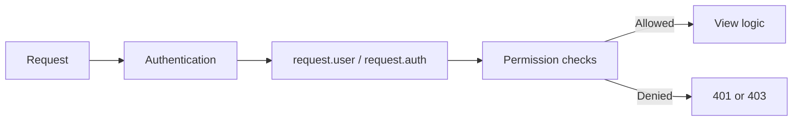
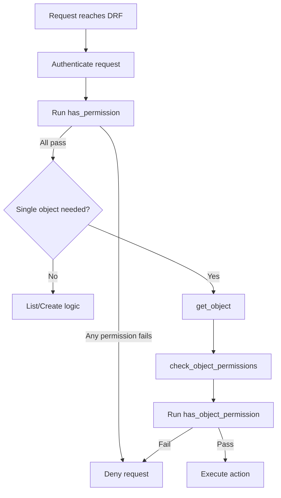
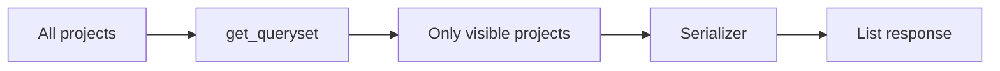
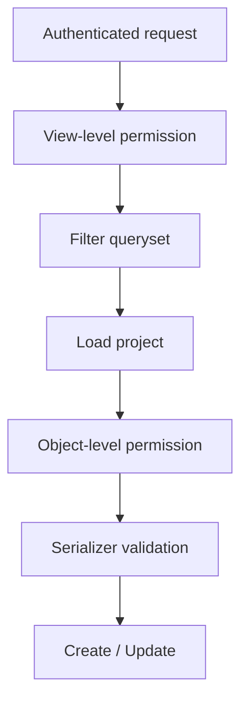

# DRF Permissions — Including Object-Level Permissions

> Authentication tells DRF **who the caller is**. Permissions decide **what that caller is allowed to do**.

> **Updated for current DRF behavior (DRF 3.18.x, August 2026).**

## Index

1. Authentication vs Permissions
2. How DRF Permission Checks Work
3. Built-in Permission Classes
4. Custom Permissions
5. Object-Level Permissions
6. List and Create Limitations
7. Practical Production Pattern
8. Action-Specific Permissions and Composition
9. Permission Responses
10. Best Practices and Key Takeaways

---

# 1. Authentication vs Permissions

Authentication and authorization solve different problems.

| Concern | Question | Common DRF Example |
|---|---|---|
| Authentication | Who is making the request? | Session, Token, JWT |
| Permission | Can this caller perform this action? | `IsAuthenticated`, custom permissions |
| Throttling | Is the caller making too many requests? | User/IP rate limits |

A valid JWT proves identity, but it does not automatically prove that the user may update a particular project, invoice, or tenant resource.



---

# 2. How DRF Permission Checks Work

Custom permission classes inherit from `BasePermission` and normally use two hooks:

```python
from rest_framework.permissions import BasePermission


class ExamplePermission(BasePermission):
    def has_permission(self, request, view):
        """View-level permission."""
        return True

    def has_object_permission(self, request, view, obj):
        """Object-level permission."""
        return True
```

## 2.1 `has_permission()` — View-Level Check

Use it when the rule depends on the request or endpoint, not one particular database object.

Typical checks:

- User must be authenticated.
- User must be staff or a manager.
- Only specific HTTP methods are allowed.
- A ViewSet action requires a special role.

## 2.2 `has_object_permission()` — Object-Level Check

Use it when the decision depends on one specific object.

Typical checks:

- User owns the project.
- User belongs to the object's organization.
- User may modify only records from their tenant.

## 2.3 Permission Lifecycle



When multiple classes are listed in `permission_classes`, they are effectively **ANDed**: every permission must allow the request.

---

# 3. Built-in Permission Classes

DRF provides several permissions that cover common API requirements.

| Permission | Purpose |
|---|---|
| `AllowAny` | Allows authenticated and anonymous callers |
| `IsAuthenticated` | Requires an authenticated user |
| `IsAdminUser` | Requires `user.is_staff == True` |
| `IsAuthenticatedOrReadOnly` | Anonymous users can read; authenticated users can write |
| `DjangoModelPermissions` | Uses Django model permissions such as `add`, `change`, and `delete` |
| `DjangoObjectPermissions` | Uses a backend that supports per-object Django permissions |

## 3.1 Common Configuration

A secure application commonly uses authenticated access globally and explicitly opens public endpoints.

```python
# settings.py
REST_FRAMEWORK = {
    "DEFAULT_PERMISSION_CLASSES": [
        "rest_framework.permissions.IsAuthenticated",
    ],
}
```

Public endpoint:

```python
from rest_framework.permissions import AllowAny
from rest_framework.views import APIView


class LoginView(APIView):
    permission_classes = [AllowAny]
```

Setting `permission_classes` directly on a view overrides the global default for that view.

---

# 4. Custom Permissions

Use custom permissions when the business rule is not covered by a built-in class.

## 4.1 Role-Based Permission

```python
from rest_framework.permissions import BasePermission


class IsManager(BasePermission):
    message = "Manager access is required."

    def has_permission(self, request, view):
        return (
            request.user.is_authenticated
            and request.user.role == "manager"
        )
```

Usage:

```python
class ReportView(APIView):
    permission_classes = [IsManager]
```

## 4.2 Safe Methods

`SAFE_METHODS` contains:

```text
GET, HEAD, OPTIONS
```

It is useful when reads and writes have different rules.

```python
from rest_framework.permissions import BasePermission, SAFE_METHODS


class ReadOnlyOrAuthenticated(BasePermission):
    def has_permission(self, request, view):
        if request.method in SAFE_METHODS:
            return True
        return request.user.is_authenticated
```

---

# 5. Object-Level Permissions

Object-level permissions protect one specific model instance.

Example requirement:

> Any authenticated user may read a project, but only its owner may modify it.

```python
from rest_framework.permissions import BasePermission, SAFE_METHODS


class IsOwnerOrReadOnly(BasePermission):
    message = "Only the owner can modify this project."

    def has_object_permission(self, request, view, obj):
        if request.method in SAFE_METHODS:
            return True

        return obj.owner_id == request.user.id
```

Usage:

```python
class ProjectViewSet(ModelViewSet):
    permission_classes = [IsAuthenticated, IsOwnerOrReadOnly]
    queryset = Project.objects.all()
    serializer_class = ProjectSerializer
```

## 5.1 How the Object Check Is Triggered

DRF generic detail views and standard `ModelViewSet` detail actions use `get_object()`, which performs the object permission check.

This normally covers:

- `retrieve`
- `update`
- `partial_update`
- `destroy`

For custom detail actions, prefer:

```python
project = self.get_object()
```

If you manually fetch the object, you must explicitly run the check:

```python
project = get_object_or_404(Project, pk=pk)
self.check_object_permissions(request, project)
```

---

# 6. List and Create Limitations

This is the most important part of object-level permissions to understand.

## 6.1 List Endpoints Do Not Check Every Object

For performance reasons, DRF does not call `has_object_permission()` for every row returned by a list endpoint.

Therefore this:

```python
permission_classes = [IsAuthenticated, IsOwnerOrReadOnly]
```

is **not enough** to restrict:

```text
GET /api/projects/
```

Filter the queryset instead:

```python
class ProjectViewSet(ModelViewSet):
    permission_classes = [IsAuthenticated, IsOwnerOrReadOnly]
    serializer_class = ProjectSerializer

    def get_queryset(self):
        return Project.objects.filter(owner=self.request.user)
```



For list actions, `get_queryset()` is the main visibility boundary.

## 6.2 Create Has No Object Yet

During `POST`, the new object does not exist when initial permission checks run. Therefore `has_object_permission()` cannot protect object creation.

Use:

- `has_permission()` for create-level authorization.
- Serializer validation for submitted values.
- `perform_create()` for owner, tenant, creator, and other server-controlled fields.

Example:

```python
class ProjectViewSet(ModelViewSet):
    permission_classes = [IsAuthenticated]

    def perform_create(self, serializer):
        serializer.save(owner=self.request.user)
```

The client should not control fields such as `owner` or `tenant_id` when those values are derived from authenticated context.

---

# 7. Practical Production Pattern

A common production requirement is:

> A user can only see and manage their own projects, and newly created projects must automatically belong to that user.

The clean solution uses multiple layers instead of putting everything inside one permission class.



## 7.1 Serializer

```python
from rest_framework import serializers


class ProjectSerializer(serializers.ModelSerializer):
    class Meta:
        model = Project
        fields = ["id", "name", "owner", "created_at"]
        read_only_fields = ["id", "owner", "created_at"]
```

## 7.2 Permission

```python
from rest_framework.permissions import BasePermission


class IsProjectOwner(BasePermission):
    def has_object_permission(self, request, view, obj):
        return obj.owner_id == request.user.id
```

## 7.3 ViewSet

```python
from rest_framework.permissions import IsAuthenticated
from rest_framework.viewsets import ModelViewSet


class ProjectViewSet(ModelViewSet):
    permission_classes = [IsAuthenticated, IsProjectOwner]
    serializer_class = ProjectSerializer

    def get_queryset(self):
        return (
            Project.objects
            .filter(owner=self.request.user)
            .select_related("owner")
        )

    def perform_create(self, serializer):
        serializer.save(owner=self.request.user)
```

## 7.4 What Protects Each Action?

| Action | Main Protection |
|---|---|
| List | `get_queryset()` |
| Create | `IsAuthenticated` + `perform_create()` |
| Retrieve | Filtered queryset + object permission |
| Update/PATCH | Filtered queryset + object permission |
| Delete | Filtered queryset + object permission |

This is a strong reusable pattern for ownership and multi-tenant APIs.

---

# 8. Action-Specific Permissions and Composition

Different ViewSet actions can use different policies.

## 8.1 `get_permissions()`

```python
from rest_framework.permissions import IsAdminUser, IsAuthenticated


class ProjectViewSet(ModelViewSet):
    def get_permissions(self):
        if self.action in {"list", "retrieve"}:
            classes = [IsAuthenticated]
        elif self.action == "create":
            classes = [IsManager]
        else:
            classes = [IsAdminUser]

        return [permission() for permission in classes]
```

The `action` attribute is useful for ViewSet-specific authorization such as `list`, `create`, `retrieve`, or custom actions.

## 8.2 Custom `@action`

```python
from rest_framework.decorators import action
from rest_framework.permissions import IsAdminUser


@action(
    detail=True,
    methods=["post"],
    permission_classes=[IsAdminUser],
)
def restore(self, request, pk=None):
    project = self.get_object()
    project.is_archived = False
    project.save(update_fields=["is_archived"])
    return Response({"status": "restored"})
```

Action-level configuration can override the ViewSet-level permission configuration for that action.

## 8.3 Permission Composition

DRF supports:

- `&` → AND
- `|` → OR
- `~` → NOT

```python
permission_classes = [IsAuthenticated & IsManager]
```

A plain list is already AND logic and is often easier to read:

```python
permission_classes = [IsAuthenticated, IsManager]
```

For complex policies, prefer a clearly named custom permission class over a long expression.

---

# 9. Permission Responses

Permission failures commonly result in `401 Unauthorized` or `403 Forbidden`.

## 9.1 Authenticated but Not Allowed

An authenticated request that fails permission checks receives:

```text
403 Forbidden
```

## 9.2 Unauthenticated Request

An unauthenticated denial may return `401` or `403` depending on the highest-priority authentication class and whether it provides a `WWW-Authenticate` header.

So do not treat `401 = unauthenticated` and `403 = authenticated` as an absolute DRF rule.

## 9.3 Why Unauthorized Objects Often Return `404`

If `get_queryset()` filters out records the caller cannot access, DRF cannot find that object during lookup and usually returns:

```text
404 Not Found
```

For sensitive APIs, this also avoids revealing that another user's object exists.

---

# 10. Best Practices and Key Takeaways

## 10.1 Put Each Rule at the Correct Layer

| Layer | Responsibility |
|---|---|
| `permission_classes` | Endpoint, role, action, and single-object authorization |
| `get_queryset()` | Which existing records the caller can see or target |
| Serializer | Validate submitted fields and keep protected fields read-only |
| `perform_create()` | Set owner, tenant, creator, or other server-controlled values |
| Service layer | Complex authorization spanning multiple models/workflows |

## 10.2 Prefer Secure Defaults

For private APIs, use `IsAuthenticated` globally and explicitly apply `AllowAny` only to public endpoints.

## 10.3 Use `self.get_object()` for Detail Actions

It keeps normal queryset filtering, lookup behavior, and object permission checks together.

## 10.4 Filter Multi-Tenant Querysets

A tenant identifier from the request body should not be the source of truth for authorization.

Prefer verified request context:

```python
def get_queryset(self):
    return Invoice.objects.filter(
        tenant_id=self.request.user.tenant_id
    )
```

and assign the tenant on the server during creation.

## 10.5 Keep Permission Classes Focused

A permission should answer an authorization question. Complex workflow mutation usually belongs in the view/service layer, not inside `has_permission()` or `has_object_permission()`.

## 10.6 Test Authorization Per Action

For a ViewSet, verify at least:

- list visibility
- create ownership/tenant assignment
- retrieve access
- update/PATCH access
- delete access
- custom `@action` permissions

---

# Final Mental Model

```mermaid
flowchart LR
    A[Who are you?] --> B[Authentication]
    B --> C[Can you call this action?]
    C --> D[has_permission]
    D --> E[Which records can you target?]
    E --> F[get_queryset]
    F --> G[Can you access this object?]
    G --> H[has_object_permission]
    H --> I[Are submitted values allowed?]
    I --> J[Serializer / service logic]
```



Remember the four most important rules:

1. `has_permission()` protects the request/action.
2. `has_object_permission()` protects one loaded object.
3. `get_queryset()` protects list visibility and lookup scope.
4. `perform_create()` and serializer rules protect ownership/tenant fields during creation.
