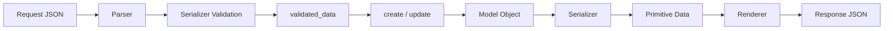
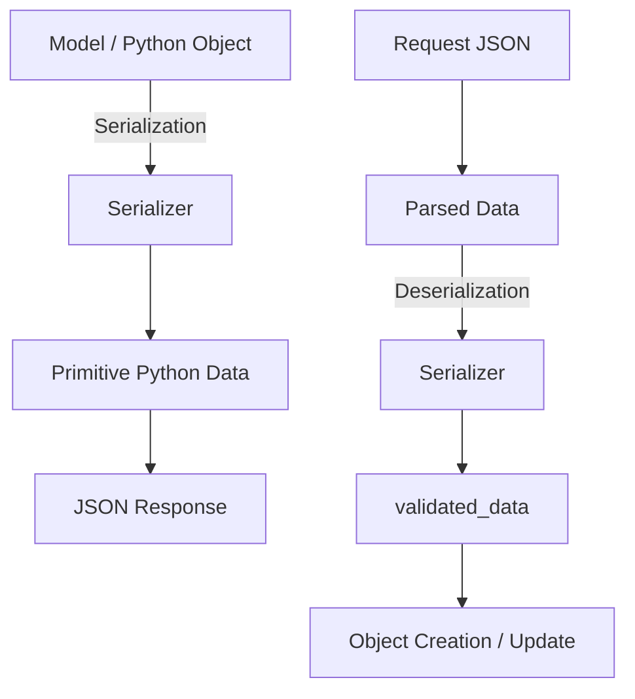
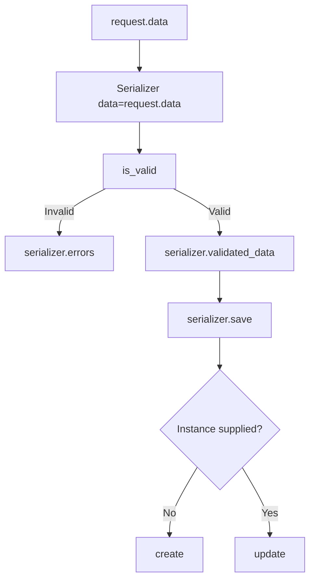
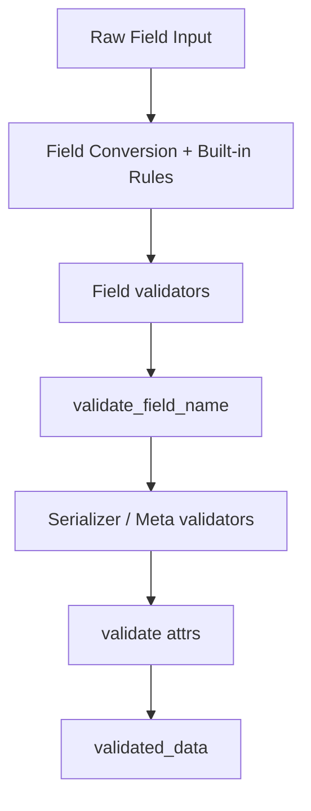

# DRF Serializers

> A serializer is the API data layer between incoming/outgoing HTTP data and Python objects. It converts objects into response-ready primitive data, validates request data, and can create or update application objects from validated input.

## In Short

- **Serialization:** Python/model object → primitive Python data → JSON response.
- **Deserialization:** request data → validation/conversion → `validated_data` → create/update object.
- Use **`Serializer`** when the payload is custom or does not directly map to one model.
- Use **`ModelSerializer`** for normal model-based CRUD APIs.
- `read_only=True` means output only; `write_only=True` means input only.
- `serializer.save()` calls `create()` when no instance is supplied and `update()` when an instance is supplied.
- Nested representations are easy to read, but writable nested data needs explicit `create()`/`update()` behavior.
- Serializers define the **API data shape**; queryset optimization belongs in the view/query layer.



## Index

1. Why Serializers Exist
2. Serializer Lifecycle
3. `Serializer` vs `ModelSerializer`
4. Practical `ModelSerializer` Example
5. Fields and Field Options
6. Validation
7. Create, Update, and Partial Update
8. Relationships and Nested Serializers
9. Context, Computed Fields, and `source`
10. `many=True` and Bulk Input
11. Serializer Performance
12. Using Serializers in Views
13. Best Practices and Interview Takeaways

---

## 1. Why Serializers Exist

Django models contain Python and database-specific values that should not be returned directly as an HTTP response.

```python
product = Product.objects.get(pk=1)

print(product.price)
# Decimal('89.99')
```

A serializer converts the object into primitive Python values:

```python
{
    "id": 1,
    "name": "Mechanical Keyboard",
    "price": "89.99",
    "is_active": True,
}
```

A renderer such as DRF's JSON renderer can then convert that data into JSON.

The same serializer can work in the opposite direction by validating incoming data and converting it into useful Python values.



A useful mental model is:

**Serializer = transformation + validation + API representation.**

---

## 2. Serializer Lifecycle

For incoming data, the normal flow is:

```python
serializer = ProductSerializer(data=request.data)
serializer.is_valid(raise_exception=True)
product = serializer.save()
```



### Important serializer properties

| Property | Meaning |
|---|---|
| `initial_data` | Original input passed with `data=` |
| `validated_data` | Converted and validated Python values |
| `errors` | Validation errors after `is_valid()` |
| `instance` | Existing or newly saved object |
| `data` | Serialized output representation |

For input processing, use this order:

```python
serializer = ProductSerializer(data=request.data)
serializer.is_valid(raise_exception=True)
product = serializer.save()
response_data = serializer.data
```

---

## 3. `Serializer` vs `ModelSerializer`

### 3.1 `Serializer`

`Serializer` is explicit. You declare fields yourself and implement persistence behavior when needed.

```python
from rest_framework import serializers


class LoginSerializer(serializers.Serializer):
    email = serializers.EmailField()
    password = serializers.CharField(write_only=True)
```

Typical use cases:

- Login and authentication payloads
- Search/filter input
- Payment instructions
- Report-generation requests
- Payloads combining multiple models or external services

### 3.2 `ModelSerializer`

`ModelSerializer` builds common fields and validators from a Django model and provides default `create()` and `update()` implementations.

```python
class ProductSerializer(serializers.ModelSerializer):
    class Meta:
        model = Product
        fields = ["id", "name", "price", "stock"]
```

Use it when the API representation closely follows a Django model.

### 3.3 Comparison

| Area | `Serializer` | `ModelSerializer` |
|---|---|---|
| Fields | Manual | Mostly generated from model |
| Model required | No | Yes |
| Default `create()` / `update()` | No | Yes |
| Model validators | Manual | Automatically generated where supported |
| Typical use | Commands/custom payloads | CRUD resources |

`ModelSerializer` is mainly a convenient shortcut around the same serializer system, not a different serialization engine.

---

## 4. Practical `ModelSerializer` Example

We will use one product API throughout the note.

### 4.1 Models

```python
from django.conf import settings
from django.db import models


class Category(models.Model):
    name = models.CharField(max_length=100, unique=True)

    def __str__(self):
        return self.name


class Product(models.Model):
    category = models.ForeignKey(
        Category,
        related_name="products",
        on_delete=models.PROTECT,
    )
    name = models.CharField(max_length=150)
    sku = models.CharField(max_length=50, unique=True)
    price = models.DecimalField(max_digits=10, decimal_places=2)
    stock = models.PositiveIntegerField(default=0)
    is_active = models.BooleanField(default=True)
    created_by = models.ForeignKey(
        settings.AUTH_USER_MODEL,
        on_delete=models.PROTECT,
    )
    created_at = models.DateTimeField(auto_now_add=True)
```

### 4.2 Serializer

```python
from rest_framework import serializers


class ProductSerializer(serializers.ModelSerializer):
    class Meta:
        model = Product
        fields = [
            "id",
            "category",
            "name",
            "sku",
            "price",
            "stock",
            "is_active",
            "created_by",
            "created_at",
        ]
        read_only_fields = ["id", "created_by", "created_at"]
```

### 4.3 Request and response

Input:

```json
{
  "category": 2,
  "name": "Mechanical Keyboard",
  "sku": "PRD-1001",
  "price": "89.99",
  "stock": 25
}
```

After validation, values are converted to suitable Python types. For example, `price` becomes a `Decimal`, and a writable related field can resolve a primary key to a related model instance.

Output:

```json
{
  "id": 41,
  "category": 2,
  "name": "Mechanical Keyboard",
  "sku": "PRD-1001",
  "price": "89.99",
  "stock": 25,
  "is_active": true,
  "created_by": 7,
  "created_at": "2026-08-19T09:30:00Z"
}
```

---

## 5. Fields and Field Options

Serializer fields convert values, validate input, and control API representation.

### 5.1 Common fields

```python
class ExampleSerializer(serializers.Serializer):
    name = serializers.CharField(max_length=100)
    quantity = serializers.IntegerField(min_value=0)
    email = serializers.EmailField()
    price = serializers.DecimalField(max_digits=10, decimal_places=2)
    is_active = serializers.BooleanField(default=True)
    status = serializers.ChoiceField(choices=["draft", "published"])
    tags = serializers.ListField(child=serializers.CharField())
    metadata = serializers.JSONField(required=False)
```

### 5.2 Common options

| Option | Purpose |
|---|---|
| `required=False` | Field may be omitted from input |
| `allow_null=True` | Accept JSON `null` |
| `allow_blank=True` | Accept `""` for string-like fields |
| `default=value` | Use a default when the field is omitted in normal input |
| `read_only=True` | Return in output, ignore as writable input |
| `write_only=True` | Accept in input, omit from output |
| `source="..."` | Read/write through another attribute path |
| `validators=[...]` | Attach reusable validation logic |

`allow_null` and `allow_blank` solve different problems: one accepts `null`; the other accepts an empty string.

### 5.3 Read-only and write-only fields

Server-controlled fields should normally be read-only:

```python
class Meta:
    read_only_fields = ["id", "created_by", "created_at"]
```

Then set them from trusted server context:

```python
serializer.save(created_by=request.user)
```

Sensitive input can be write-only:

```python
password = serializers.CharField(write_only=True)
```

This allows the API to accept the password without returning it in the response.

---

## 6. Validation

Validation is one of the most important serializer responsibilities.

A useful simplified order is:



### 6.1 Built-in field validation

```python
price = serializers.DecimalField(
    max_digits=10,
    decimal_places=2,
    min_value=0,
)
```

### 6.2 Field-level validation

Use `validate_<field_name>()` for logic involving one field.

```python
class ProductSerializer(serializers.ModelSerializer):
    def validate_sku(self, value):
        value = value.strip().upper()

        if not value.startswith("PRD-"):
            raise serializers.ValidationError(
                "SKU must start with 'PRD-'."
            )

        return value
```

The returned value is stored in `validated_data`, so field validation can also normalize input.

### 6.3 Object-level validation

Use `validate()` when a rule depends on multiple fields.

```python
class DiscountSerializer(serializers.Serializer):
    starts_at = serializers.DateTimeField()
    ends_at = serializers.DateTimeField()

    def validate(self, attrs):
        if attrs["ends_at"] <= attrs["starts_at"]:
            raise serializers.ValidationError({
                "ends_at": "End time must be later than start time."
            })

        return attrs
```

### 6.4 Reusable validators

```python
def validate_even(value):
    if value % 2:
        raise serializers.ValidationError("Value must be even.")


quantity = serializers.IntegerField(validators=[validate_even])
```

`ModelSerializer` can also generate validators for model constraints such as uniqueness. Serializer validation gives API-friendly errors, while database constraints remain the final protection for data integrity.

---

## 7. Create, Update, and Partial Update

### 7.1 Create

```python
serializer = ProductSerializer(data=request.data)
serializer.is_valid(raise_exception=True)
product = serializer.save(created_by=request.user)
```

Because no existing instance was supplied, `save()` calls `create()`.

Conceptually:

```python
def create(self, validated_data):
    return Product.objects.create(**validated_data)
```

Extra keyword arguments passed to `save()` are merged into the validated values supplied to the serializer's persistence method.

### 7.2 Update

```python
serializer = ProductSerializer(
    product,
    data=request.data,
)
serializer.is_valid(raise_exception=True)
product = serializer.save()
```

Because an instance was supplied, `save()` calls `update()`.

### 7.3 Partial update (`PATCH`)

```python
serializer = ProductSerializer(
    product,
    data={"stock": 30},
    partial=True,
)
serializer.is_valid(raise_exception=True)
product = serializer.save()
```

`partial=True` means omitted required fields are not required for that update and existing values remain unchanged.

For cross-field validation during PATCH, combine incoming values with the current instance when necessary:

```python
def validate(self, attrs):
    starts_at = attrs.get("starts_at", self.instance.starts_at)
    ends_at = attrs.get("ends_at", self.instance.ends_at)

    if ends_at <= starts_at:
        raise serializers.ValidationError({
            "ends_at": "End time must be later than start time."
        })

    return attrs
```

---

## 8. Relationships and Nested Serializers

Relations are a major part of real DRF APIs.

### 8.1 Primary-key relation

A `ModelSerializer` commonly represents a `ForeignKey` using a primary key.

```json
{
  "category": 2
}
```

Explicit form:

```python
category = serializers.PrimaryKeyRelatedField(
    queryset=Category.objects.all(),
)
```

### 8.2 Readable nested output with simple ID input

A practical production pattern is to accept an ID for writes but return nested details for reads.

```python
class CategorySerializer(serializers.ModelSerializer):
    class Meta:
        model = Category
        fields = ["id", "name"]


class ProductSerializer(serializers.ModelSerializer):
    category = CategorySerializer(read_only=True)
    category_id = serializers.PrimaryKeyRelatedField(
        source="category",
        queryset=Category.objects.all(),
        write_only=True,
    )

    class Meta:
        model = Product
        fields = [
            "id",
            "name",
            "price",
            "category",
            "category_id",
        ]
```

Input:

```json
{
  "name": "Mechanical Keyboard",
  "price": "89.99",
  "category_id": 2
}
```

Output:

```json
{
  "id": 1,
  "name": "Mechanical Keyboard",
  "price": "89.99",
  "category": {
    "id": 2,
    "name": "Keyboards"
  }
}
```

### 8.3 Writable nested data

Nested serializers are straightforward for output, but DRF does not automatically define nested create/update behavior.

```python
class CategoryCreateSerializer(serializers.ModelSerializer):
    products = ProductSerializer(many=True)

    def create(self, validated_data):
        products_data = validated_data.pop("products")
        category = Category.objects.create(**validated_data)

        for product_data in products_data:
            Product.objects.create(
                category=category,
                **product_data,
            )

        return category
```

The application must explicitly define what nested updates mean: create, update, delete, ignore, or reorder child records.

For complex domains, separate child endpoints are often simpler than deeply writable nested payloads.

---

## 9. Context, Computed Fields, and `source`

### 9.1 Serializer context

Context carries request-specific information that is not part of the payload.

```python
serializer = ProductSerializer(
    product,
    context={"request": request},
)
```

Generic DRF views normally provide serializer context including the request, view, and format.

Use context for request-dependent representation or validation:

```python
class ProductSerializer(serializers.ModelSerializer):
    can_edit = serializers.SerializerMethodField()

    def get_can_edit(self, obj):
        request = self.context.get("request")
        return bool(
            request
            and request.user.is_authenticated
            and obj.created_by_id == request.user.id
        )
```

### 9.2 `SerializerMethodField`

`SerializerMethodField` creates computed, read-only output.

```python
class ProductSerializer(serializers.ModelSerializer):
    is_in_stock = serializers.SerializerMethodField()

    def get_is_in_stock(self, obj):
        return obj.stock > 0
```

Use it for small presentation calculations, not database queries executed once per serialized row.

### 9.3 `source`

`source` maps an API field to a different object attribute.

```python
product_name = serializers.CharField(source="name")
category_name = serializers.CharField(
    source="category.name",
    read_only=True,
)
```

When `source` traverses relationships, the queryset should load those relationships efficiently.

---

## 10. `many=True` and Bulk Input

Use `many=True` when serializing or validating a collection.

### 10.1 Serialize a queryset

```python
products = Product.objects.all()
serializer = ProductSerializer(products, many=True)
return Response(serializer.data)
```

### 10.2 Validate a list

```python
serializer = ProductSerializer(
    data=request.data,
    many=True,
)
serializer.is_valid(raise_exception=True)
products = serializer.save()
```

With `many=True`, DRF uses a `ListSerializer` around the child serializer.

The default list behavior supports multiple-object creation by processing each child item. If the application needs optimized `bulk_create()`, cross-item validation, or custom bulk updates, implement a custom `ListSerializer`.

Bulk update is intentionally not automatic because the API must define how incoming items map to existing objects and what missing items mean.

---

## 11. Serializer Performance

Serializers do **not** automatically optimize ORM queries.

Consider:

```python
class ProductSerializer(serializers.ModelSerializer):
    category_name = serializers.CharField(
        source="category.name",
        read_only=True,
    )
```

This can create an N+1 query pattern:

```text
1 query  -> products
N queries -> category for each product
```

Optimize the queryset that feeds the serializer:

```python
products = Product.objects.select_related(
    "category",
    "created_by",
)
```

Use:

- `select_related()` for single-valued relations such as `ForeignKey` and `OneToOneField`.
- `prefetch_related()` for many-to-many and reverse relationships.
- `annotate()` for computed database values such as counts.

Example:

```python
from django.db.models import Count

queryset = Product.objects.annotate(
    review_count=Count("reviews")
)
```

Then expose the annotation as a plain read-only serializer field rather than running `obj.reviews.count()` inside `SerializerMethodField` for every object.

**Responsibility split:**

```text
Serializer -> what data should the API expose?
Queryset   -> how should that data be loaded efficiently?
```

---

## 12. Using Serializers in Views

A `ModelViewSet` keeps normal CRUD code compact.

```python
from rest_framework.viewsets import ModelViewSet


class ProductViewSet(ModelViewSet):
    serializer_class = ProductSerializer

    def get_queryset(self):
        return (
            Product.objects
            .select_related("category", "created_by")
            .all()
        )

    def perform_create(self, serializer):
        serializer.save(created_by=self.request.user)
```

DRF generic views and ViewSets handle common serializer lifecycle steps for you, including serializer creation, request context, validation, response generation, and save hooks.

### Different serializers by action

Read and write payloads often have different needs.

```python
class ProductViewSet(ModelViewSet):
    def get_serializer_class(self):
        if self.action == "list":
            return ProductListSerializer

        if self.action in {"create", "update", "partial_update"}:
            return ProductWriteSerializer

        return ProductDetailSerializer
```

This is useful when list responses should be small, detail responses should be rich, and writes should accept a clean input contract.

---

## 13. Best Practices and Interview Takeaways

### API contract

- Explicitly list serializer fields instead of exposing `"__all__"` in public APIs.
- Treat serializers as an external API contract, not simply a mirror of the database model.
- Keep server-controlled fields such as ownership and audit data read-only.

### Validation

- Use field validators for single-field rules.
- Use `validate()` for cross-field rules.
- Keep database constraints for final integrity protection.
- Return clear, field-specific validation messages where possible.

### Design

- Prefer `ModelSerializer` for ordinary CRUD.
- Prefer plain `Serializer` for operations and non-model payloads.
- Separate read and write serializers when their contracts differ significantly.
- Keep complex multi-step business workflows in services/domain functions instead of growing serializers into service layers.

### Relationships

- Primary keys are simple and efficient for writes.
- Nested serializers are useful for rich reads.
- Define writable nested behavior explicitly.

### Performance

- Never expect the serializer to optimize ORM access automatically.
- Use `select_related()`, `prefetch_related()`, and `annotate()` in the queryset.
- Avoid hidden per-object queries in `SerializerMethodField` and nested relations.

### Core interview mental model

```text
Request body
    |
    v
Serializer(data=...)
    |
    v
is_valid()
    |
    +---- invalid ---> errors
    |
    v
validated_data
    |
    v
save()
    |
    +---- no instance ---> create()
    |
    +---- instance ------> update()
    |
    v
object
    |
    v
serializer.data
    |
    v
Response
```

If you understand this lifecycle, field behavior, validation levels, relationship handling, and queryset optimization, you understand the part of DRF serializers used most frequently in real development and technical interviews.

---

## Version Note

This note is aligned with the current Django REST framework serializer documentation and DRF 3.16 behavior. DRF 3.16 added support for Django 5.1/5.2 and Python 3.13 and improved support around Django `UniqueConstraint`; these changes do not alter the core serializer lifecycle explained above.
