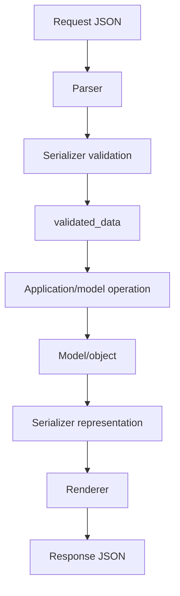
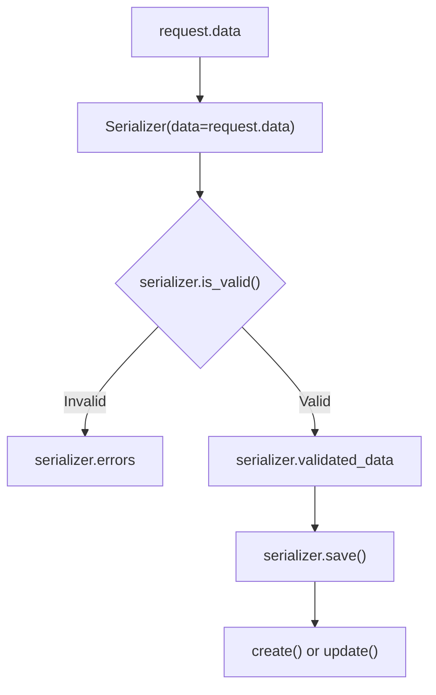
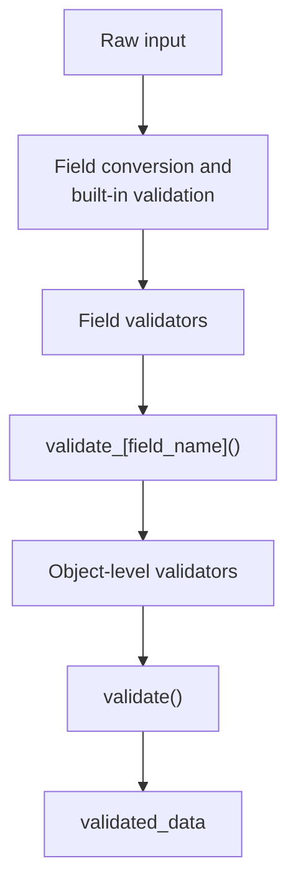

# DRF Serializers

> A serializer is the boundary between your API and Python objects. It converts model instances into response-ready data, validates incoming request data, and converts valid input into objects that your application can use.

## In short

- A serializer works in both directions: `ProductSerializer(product).data` renders an object to primitives, while `ProductSerializer(data=request.data)` plus `is_valid()` and `save()` validates input and writes it back.
- `Serializer` declares every field and `create()`/`update()` by hand — use it for operations like login or a report. `ModelSerializer` generates fields, model validators, and both methods from `Meta.model` and `Meta.fields` — use it for CRUD.
- `.save()` calls `create()` when no instance was passed and `update()` when one was. Extra keyword arguments — `serializer.save(created_by=request.user)` — are merged into `validated_data`, which is how server-controlled fields stay out of the request body.
- Validation runs in a fixed order: field conversion, then `validators=[...]`, then `validate_<field_name>()`, then `Meta.validators`, then `validate()`. Whatever `validate_<field_name>()` returns replaces the input, so validation also normalizes.
- `read_only=True` is output-only and `write_only=True` is input-only; `source` points a field at a different attribute; `SerializerMethodField` computes read-only output.
- Nested serializers are **read-only** until you implement the write behaviour yourself, because DRF cannot guess whether a missing child means delete, ignore, or create.
- Serializers never optimize queries. `select_related()`, `prefetch_related()`, and `annotate()` belong on the queryset that feeds the serializer.



**Interview answer:** A serializer is the translation and validation layer between HTTP data and Python objects. Outbound, it turns a model instance into JSON-compatible primitives; inbound, it takes `request.data`, runs field conversion and the validation chain, exposes the result as `validated_data`, and turns that into an object through `create()` or `update()`. `ModelSerializer` is the same machinery with the field list, model validators, and default `create()`/`update()` derived from the model, so you reach for the plain `Serializer` when the payload is not a model — a login, a search filter, a payment instruction.

**Gotcha:** Expecting the serializer to make its own queries efficient. A `category = CategorySerializer()` or `source="category.name"` field is one extra query per row, so serializing 100 products issues 101 queries. DRF never infers `select_related()` from the serializer — the queryset in the view has to declare it.

---

# 1. Why Serializers Exist

Django models contain Python objects and database-related types:

```python
product = Product.objects.get(id=1)

print(product)
# <Product: Mechanical Keyboard>

print(product.price)
# Decimal('89.99')
```

An HTTP API cannot directly return a Django model instance. It normally returns JSON-compatible values such as strings, numbers, booleans, lists, dictionaries, and `null`.

A serializer converts the object into primitive Python data:

```python
{
    "id": 1,
    "name": "Mechanical Keyboard",
    "price": "89.99",
    "is_active": True
}
```

A renderer can then convert this dictionary into JSON.

A serializer also works in the opposite direction. It accepts request data, validates it, converts it into suitable Python values, and can create or update an object.

```mermaid
flowchart TD
    subgraph OUTBOUND[Outgoing response]
        OA[Django model instance] --> OB[Serializer]
        OB --> OC[Primitive Python data]
        OC --> OD[JSON renderer]
        OD --> OE[HTTP response]
    end
    subgraph INBOUND[Incoming request]
        IA[JSON request body] --> IB[Parser]
        IB --> IC[Primitive Python data]
        IC --> ID[Serializer<br/>validation + conversion]
        ID --> IE[validated_data]
        IE --> IF["create() / update()"]
        IF --> IG[Django model instance]
    end
```



A useful mental model is **serializer = data transformation + validation + object creation/update**.

---

# 2. The Serializer Flow

A serializer commonly moves through the following stages:



Example:

```python
serializer = ProductSerializer(data=request.data)

if serializer.is_valid():
    product = serializer.save()
else:
    print(serializer.errors)
```

DRF provides a shorter version:

```python
serializer.is_valid(raise_exception=True)
product = serializer.save()
```

When `raise_exception=True` is used, DRF raises `ValidationError`. Its default exception handling normally turns that exception into an HTTP `400 Bad Request` response.

---

# 3. Serializer vs ModelSerializer

DRF mainly provides two serializer styles.

## 3.1 `Serializer`

`Serializer` is explicit. You manually define its fields and normally implement `create()` and `update()` when it needs to save objects.

```python
from rest_framework import serializers

class ProductSerializer(serializers.Serializer):
    id = serializers.IntegerField(read_only=True)
    name = serializers.CharField(max_length=150)
    price = serializers.DecimalField(max_digits=10, decimal_places=2)
    is_active = serializers.BooleanField(default=True)

    def create(self, validated_data):
        return Product.objects.create(**validated_data)

    def update(self, instance, validated_data):
        instance.name = validated_data.get("name", instance.name)
        instance.price = validated_data.get("price", instance.price)
        instance.is_active = validated_data.get(
            "is_active",
            instance.is_active,
        )
        instance.save()
        return instance
```

Use it when:

- The data does not directly map to one Django model.
- The endpoint combines information from multiple sources.
- You need full control over input and output.
- The serializer represents an operation rather than a database resource.
- You want the API contract to remain independent of model structure.

Examples include login, password reset, report generation, payment initiation, and search filters.

## 3.2 `ModelSerializer`

`ModelSerializer` reads model metadata and automatically generates common fields, validators, and default `create()` and `update()` methods.

```python
class ProductSerializer(serializers.ModelSerializer):
    class Meta:
        model = Product
        fields = ["id", "name", "price", "is_active"]
```

Use it when the API representation closely matches a Django model.

## 3.3 Comparison

| Area | `Serializer` | `ModelSerializer` |
|---|---|---|
| Field declaration | Manual | Mostly automatic |
| Model dependency | Optional | Required |
| Default `create()` | No | Yes |
| Default `update()` | No | Yes |
| Automatic model validators | No | Yes |
| Control | Maximum | High, with convenient defaults |
| Typical use | Commands and custom payloads | CRUD APIs |

`ModelSerializer` is not a separate serialization engine. It is a convenient serializer implementation that generates configuration from a model.

---

# 4. A Practical ModelSerializer Example

Consider a small product API.

## 4.1 Models

```python
from django.conf import settings
from django.db import models

class Category(models.Model):
    name = models.CharField(max_length=100, unique=True)

    def __str__(self) -> str:
        return self.name

class Product(models.Model):
    category = models.ForeignKey(
        Category,
        related_name="products",
        on_delete=models.PROTECT,
    )
    name = models.CharField(max_length=150)
    sku = models.CharField(max_length=50, unique=True)
    description = models.TextField(blank=True)
    price = models.DecimalField(max_digits=10, decimal_places=2)
    stock = models.PositiveIntegerField(default=0)
    is_active = models.BooleanField(default=True)
    created_by = models.ForeignKey(
        settings.AUTH_USER_MODEL,
        related_name="created_products",
        on_delete=models.PROTECT,
    )
    created_at = models.DateTimeField(auto_now_add=True)

    def __str__(self) -> str:
        return self.name
```

## 4.2 Serializer

```python
from rest_framework import serializers

from .models import Product

class ProductSerializer(serializers.ModelSerializer):
    class Meta:
        model = Product
        fields = [
            "id",
            "category",
            "name",
            "sku",
            "description",
            "price",
            "stock",
            "is_active",
            "created_by",
            "created_at",
        ]
        read_only_fields = ["id", "created_by", "created_at"]
```

DRF automatically maps model fields to serializer fields. For example:

| Model field | Serializer field |
| --- | --- |
| `models.CharField` | `serializers.CharField` |
| `models.TextField` | `serializers.CharField` |
| `models.DecimalField` | `serializers.DecimalField` |
| `models.BooleanField` | `serializers.BooleanField` |
| `models.DateTimeField` | `serializers.DateTimeField` |
| `models.ForeignKey` | `serializers.PrimaryKeyRelatedField` |

## 4.3 Example input

```json
{
  "category": 2,
  "name": "Mechanical Keyboard",
  "sku": "KB-1001",
  "description": "Hot-swappable mechanical keyboard",
  "price": "89.99",
  "stock": 25
}
```

## 4.4 Example output

```json
{
  "id": 41,
  "category": 2,
  "name": "Mechanical Keyboard",
  "sku": "KB-1001",
  "description": "Hot-swappable mechanical keyboard",
  "price": "89.99",
  "stock": 25,
  "is_active": true,
  "created_by": 7,
  "created_at": "2026-07-25T07:15:20Z"
}
```

---

# 5. Serializer Fields

Serializer fields perform three major jobs:

1. Extract a value from an object during serialization.
2. Convert incoming primitive data into an internal Python value.
3. Validate the value.

## 5.1 Common fields

```python
class ExampleSerializer(serializers.Serializer):
    name = serializers.CharField(max_length=100)
    age = serializers.IntegerField(min_value=18)
    email = serializers.EmailField()
    price = serializers.DecimalField(
        max_digits=10,
        decimal_places=2,
    )
    is_active = serializers.BooleanField(default=True)
    joined_at = serializers.DateTimeField(read_only=True)
    website = serializers.URLField(required=False)
    status = serializers.ChoiceField(
        choices=["draft", "published"],
    )
    tags = serializers.ListField(
        child=serializers.CharField(max_length=30),
        required=False,
    )
    metadata = serializers.JSONField(required=False)
```

## 5.2 Model fields and serializer fields are different

A Django model field describes database storage and model behavior.

```python
price = models.DecimalField(max_digits=10, decimal_places=2)
```

A serializer field describes the API representation and input validation.

```python
price = serializers.DecimalField(
    max_digits=10,
    decimal_places=2,
)
```

The API may intentionally use different rules from the database model. For example, an internal model field might exist but should never be exposed through the API.

## 5.3 Declared fields override generated fields

A field explicitly declared on a `ModelSerializer` overrides the automatically generated field.

```python
class ProductSerializer(serializers.ModelSerializer):
    price = serializers.DecimalField(
        max_digits=10,
        decimal_places=2,
        min_value=0,
    )

    class Meta:
        model = Product
        fields = ["id", "name", "price"]
```

---

# 6. Field Options

Field options control API behavior.

| Option | Meaning |
|---|---|
| `required=True` | Input key must normally be present |
| `allow_null=True` | Accept `null` |
| `allow_blank=True` | Accept an empty string |
| `default=value` | Use a value when input is missing |
| `read_only=True` | Output only |
| `write_only=True` | Input only |
| `source="..."` | Read/write through another attribute |
| `validators=[...]` | Run reusable validators |

```python
def validate_even(value):
    if value % 2 != 0:
        raise serializers.ValidationError("Value must be even.")

class ExampleSerializer(serializers.Serializer):
    id = serializers.IntegerField(read_only=True)
    name = serializers.CharField(required=True)
    middle_name = serializers.CharField(allow_null=True, required=False)
    description = serializers.CharField(allow_blank=True, required=False)
    is_active = serializers.BooleanField(default=True)
    password = serializers.CharField(write_only=True)
    quantity = serializers.IntegerField(validators=[validate_even])
    category_name = serializers.CharField(source="category.name", read_only=True)
```

## 6.1 Options that are easy to confuse

- `required=True` means the key must exist. It does not mean blank text is rejected — that is `allow_blank`.
- `allow_null=True` accepts JSON `null`; `allow_blank=True` accepts `""`. They are different values and are configured independently.
- `default` is generally **not** applied during a partial update, because an omitted field under `partial=True` means “leave the current value unchanged.”

---

# 7. Serialization and Deserialization

## 7.1 Serialization

Serialization converts an existing object into primitive data. `serializer.instance` holds the original object and `serializer.data` holds the primitive representation.

```python
product = Product.objects.get(pk=1)
serializer = ProductSerializer(product)
print(serializer.data)

# A queryset needs many=True
serializer = ProductSerializer(Product.objects.all(), many=True)
print(serializer.data)
```

## 7.2 Deserialization

Deserialization starts with incoming primitive data.

```python
payload = {
    "category": 2,
    "name": "Mechanical Keyboard",
    "sku": "KB-1001",
    "price": "89.99",
    "stock": 25,
}

serializer = ProductSerializer(data=payload)
serializer.is_valid(raise_exception=True)

print(serializer.validated_data)
```

`validated_data` contains converted Python values:

```python
{
    "category": <Category: Keyboards>,
    "name": "Mechanical Keyboard",
    "sku": "KB-1001",
    "price": Decimal("89.99"),
    "stock": 25,
}
```

Notice the conversion:

| Input value | Converted to |
| --- | --- |
| `"89.99"` | `Decimal("89.99")` |
| `2` | `Category` model instance |
| `"KB-1001"` | Validated string |

## 7.3 Key serializer properties

| Property | Available when | Contains |
|---|---|---|
| `.initial_data` | Serializer received `data=` | Original input |
| `.validated_data` | After successful `is_valid()` | Validated Python values |
| `.errors` | After `is_valid()` | Validation errors |
| `.instance` | Existing object or after `save()` | Model/object instance |
| `.data` | For output representation | Primitive output data |

Avoid using `.data` before calling `.save()` when processing valid input. Accessing `.data` too early finalizes the output representation and prevents a later `.save()` call.

Correct order:

```python
serializer = ProductSerializer(data=request.data)
serializer.is_valid(raise_exception=True)
product = serializer.save()
response_data = serializer.data
```

---

# 8. Validation

DRF supports validation at several levels.



## 8.1 Built-in field validation

```python
price = serializers.DecimalField(
    max_digits=10,
    decimal_places=2,
    min_value=0,
)

stock = serializers.IntegerField(min_value=0)
```

## 8.2 Field-level validation

Use `validate_<field_name>()` when a rule concerns one field.

```python
class ProductSerializer(serializers.ModelSerializer):
    class Meta:
        model = Product
        fields = ["id", "name", "sku", "price", "stock"]

    def validate_sku(self, value):
        normalized_value = value.strip().upper()

        if not normalized_value.startswith("PRD-"):
            raise serializers.ValidationError(
                "SKU must start with 'PRD-'."
            )

        return normalized_value
```

The returned value becomes part of `validated_data`.

```text
Input:  " prd-1001 "
Output: "PRD-1001"
```

Validation can therefore both check and normalize data.

## 8.3 Object-level validation

Use `validate()` when a rule depends on multiple fields.

```python
class DiscountSerializer(serializers.Serializer):
    starts_at = serializers.DateTimeField()
    ends_at = serializers.DateTimeField()

    def validate(self, attrs):
        if attrs["ends_at"] <= attrs["starts_at"]:
            raise serializers.ValidationError(
                {
                    "ends_at": (
                        "The end time must be later than the start time."
                    )
                }
            )

        return attrs
```

A general error can also be raised:

```python
raise serializers.ValidationError(
    "The selected date range is invalid."
)
```

It normally appears under `non_field_errors`.

## 8.4 Reusable validators

```python
from rest_framework import serializers

def validate_positive_stock(value):
    if value < 0:
        raise serializers.ValidationError("Stock cannot be negative.")

stock = serializers.IntegerField(validators=[validate_positive_stock])
```

## 8.5 Class-level validators

`Meta.validators` is useful for validators involving multiple fields.

```python
from rest_framework.validators import UniqueTogetherValidator

class ProductSerializer(serializers.ModelSerializer):
    class Meta:
        model = Product
        fields = ["id", "category", "sku", "name"]
        validators = [
            UniqueTogetherValidator(
                queryset=Product.objects.all(),
                fields=["category", "sku"],
                message="This SKU already exists in the category.",
            )
        ]
```

## 8.6 Validation error structure

Input:

```json
{
  "sku": "ABC",
  "price": "-10.00"
}
```

Possible errors:

```json
{
  "sku": [
    "SKU must start with 'PRD-'."
  ],
  "price": [
    "Ensure this value is greater than or equal to 0."
  ]
}
```

This structured format allows frontend applications to show messages beside individual fields.

## 8.7 Validation does not replace database constraints

Serializer validation provides an API-friendly error before saving. Database constraints provide final integrity protection.

Use both where appropriate:

```python
class Product(models.Model):
    sku = models.CharField(max_length=50, unique=True)
```

The database remains the final authority, especially when concurrent requests may pass validation at nearly the same time.

---

# 9. Creating and Updating Objects

## 9.1 Default `ModelSerializer` creation

For a normal `ModelSerializer`, DRF provides a default `create()` similar to:

```python
def create(self, validated_data):
    return Product.objects.create(**validated_data)
```

Usage:

```python
serializer = ProductSerializer(data=request.data)
serializer.is_valid(raise_exception=True)
product = serializer.save()
```

Because no existing instance was supplied, `.save()` calls `create()`.

## 9.2 Default update

```python
product = Product.objects.get(pk=1)

serializer = ProductSerializer(
    product,
    data=request.data,
)

serializer.is_valid(raise_exception=True)
product = serializer.save()
```

Because an instance was supplied, `.save()` calls `update()`.

Conceptually:

```python
def update(self, instance, validated_data):
    for field, value in validated_data.items():
        setattr(instance, field, value)

    instance.save()
    return instance
```

## 9.3 Custom `create()`

Override `create()` when creation requires additional behavior.

```python
class ProductSerializer(serializers.ModelSerializer):
    class Meta:
        model = Product
        fields = [
            "id",
            "category",
            "name",
            "sku",
            "price",
            "created_by",
        ]
        read_only_fields = ["id", "created_by"]

    def create(self, validated_data):
        validated_data["name"] = validated_data["name"].strip()

        return Product.objects.create(**validated_data)
```

In a view, request-specific data can be passed safely: `serializer.save(created_by=request.user)`

The extra keyword argument is merged into `validated_data` before `create()` is called.

## 9.4 Custom `update()`

Override `update()` to control exactly which columns are written — `update_fields` narrows the `UPDATE` statement.

```python
class ProductSerializer(serializers.ModelSerializer):
    EDITABLE = ["name", "price", "stock", "is_active"]

    class Meta:
        model = Product
        fields = ["name", "price", "stock", "is_active"]

    def update(self, instance, validated_data):
        for field in self.EDITABLE:
            setattr(instance, field, validated_data.get(field, getattr(instance, field)))

        instance.save(update_fields=self.EDITABLE)
        return instance
```

Only customize these methods when the default behavior is insufficient. Simple CRUD does not need custom methods.

---

# 10. Read-Only and Write-Only Fields

## 10.1 Read-only fields

Typical read-only data includes:

- Database-generated IDs
- Creation timestamps
- Calculated values
- Audit fields
- Values derived from the authenticated user

```python
class ProductSerializer(serializers.ModelSerializer):
    class Meta:
        model = Product
        fields = [
            "id",
            "name",
            "created_by",
            "created_at",
        ]
        read_only_fields = [
            "id",
            "created_by",
            "created_at",
        ]
```

A client cannot control these values through normal serializer input.

```python
serializer.save(created_by=request.user)
```

## 10.2 Write-only fields

A password should be accepted but never returned.

```python
class RegistrationSerializer(serializers.ModelSerializer):
    password = serializers.CharField(
        write_only=True,
        min_length=8,
        trim_whitespace=False,
    )

    class Meta:
        model = User
        fields = ["id", "email", "password"]
        read_only_fields = ["id"]

    def create(self, validated_data):
        password = validated_data.pop("password")

        user = User(**validated_data)
        user.set_password(password)
        user.save()

        return user
```

Input:

```json
{
  "email": "dev@example.com",
  "password": "strong-password"
}
```

Output:

```json
{
  "id": 15,
  "email": "dev@example.com"
}
```

The password is not included in the response.

---

# 11. Working with Relationships

Assume `Product.category` is a `ForeignKey`. DRF offers five representations, each trading readability against write support:

| Representation | Trade-off |
| --- | --- |
| Primary key | Compact and easy to write |
| String | Readable but read-only |
| Slug | Readable identifier |
| Hyperlink | Resource-oriented representation |
| Nested object | Rich output, more complex writes |

## 11.1 Primary-key representation

This is the default style used by `ModelSerializer`.

```python
class ProductSerializer(serializers.ModelSerializer):
    class Meta:
        model = Product
        fields = ["id", "name", "category"]
```

Output:

```json
{
  "id": 1,
  "name": "Mechanical Keyboard",
  "category": 2
}
```

For a writable relation, DRF uses the field queryset to resolve the supplied primary key into a model instance.

Explicit form:

```python
category = serializers.PrimaryKeyRelatedField(
    queryset=Category.objects.all(),
)
```

## 11.2 String representation

```python
category = serializers.StringRelatedField()
```

Output:

```json
{
  "category": "Keyboards"
}
```

This is read-only and uses the related model's `__str__()` method.

## 11.3 Slug representation

```python
category = serializers.SlugRelatedField(
    slug_field="name",
    queryset=Category.objects.all(),
)
```

Input or output:

```json
{
  "category": "Keyboards"
}
```

For writable use, the slug should uniquely identify a related object. A database field with `unique=True` is normally the safest design.

## 11.4 Hyperlinked representation

```python
category = serializers.HyperlinkedRelatedField(
    view_name="category-detail",
    queryset=Category.objects.all(),
)
```

Output:

```json
{
  "category": "https://api.example.com/categories/2/"
}
```

Hyperlinked fields require request context when absolute URLs are generated.

## 11.5 Separate read and write representations

A common API pattern accepts a category ID but returns category details.

```python
class CategorySummarySerializer(serializers.ModelSerializer):
    class Meta:
        model = Category
        fields = ["id", "name"]

class ProductSerializer(serializers.ModelSerializer):
    category = CategorySummarySerializer(read_only=True)

    category_id = serializers.PrimaryKeyRelatedField(
        source="category",
        queryset=Category.objects.all(),
        write_only=True,
    )

    class Meta:
        model = Product
        fields = [
            "id",
            "name",
            "category",
            "category_id",
        ]
```

Input:

```json
{
  "name": "Mechanical Keyboard",
  "category_id": 2
}
```

Output:

```json
{
  "id": 1,
  "name": "Mechanical Keyboard",
  "category": {
    "id": 2,
    "name": "Keyboards"
  }
}
```

This produces a convenient response while keeping the write payload simple.

## 11.6 Reverse relationships

Reverse relationships are not automatically included.

Given:

```python
class Product(models.Model):
    category = models.ForeignKey(
        Category,
        related_name="products",
        on_delete=models.PROTECT,
    )
```

They can be added explicitly:

```python
class CategorySerializer(serializers.ModelSerializer):
    products = serializers.PrimaryKeyRelatedField(
        many=True,
        read_only=True,
    )

    class Meta:
        model = Category
        fields = ["id", "name", "products"]
```

---

# 12. Nested Serializers

A nested serializer returns a related object as a structured object.

```python
class CategorySerializer(serializers.ModelSerializer):
    class Meta:
        model = Category
        fields = ["id", "name"]

class ProductSerializer(serializers.ModelSerializer):
    category = CategorySerializer(read_only=True)

    class Meta:
        model = Product
        fields = ["id", "name", "price", "category"]
```

Output:

```json
{
  "id": 1,
  "name": "Mechanical Keyboard",
  "price": "89.99",
  "category": {
    "id": 2,
    "name": "Keyboards"
  }
}
```

## 12.1 Nested lists

```python
class ProductSummarySerializer(serializers.ModelSerializer):
    class Meta:
        model = Product
        fields = ["id", "name", "price"]

class CategoryDetailSerializer(serializers.ModelSerializer):
    products = ProductSummarySerializer(
        many=True,
        read_only=True,
    )

    class Meta:
        model = Category
        fields = ["id", "name", "products"]
```

## 12.2 Writable nested serializers

Nested serializers are read-only unless you implement explicit write behavior.

Example payload:

```json
{
  "name": "Keyboards",
  "products": [
    {
      "name": "Mechanical Keyboard",
      "sku": "PRD-1001",
      "price": "89.99"
    },
    {
      "name": "Compact Keyboard",
      "sku": "PRD-1002",
      "price": "69.99"
    }
  ]
}
```

Serializer:

```python
from django.db import transaction

class ProductInputSerializer(serializers.ModelSerializer):
    class Meta:
        model = Product
        fields = ["name", "sku", "price"]

class CategoryCreateSerializer(serializers.ModelSerializer):
    products = ProductInputSerializer(many=True)

    class Meta:
        model = Category
        fields = ["id", "name", "products"]
        read_only_fields = ["id"]

    @transaction.atomic
    def create(self, validated_data):
        products_data = validated_data.pop("products")
        category = Category.objects.create(**validated_data)

        Product.objects.bulk_create(
            [
                Product(
                    category=category,
                    **product_data,
                )
                for product_data in products_data
            ]
        )

        return category
```

Writable nested updates are more complex because the API must define what each child item means:

- Create a new child
- Update an existing child
- Delete a missing child
- Keep a missing child unchanged
- Reorder children

That behavior should be explicit rather than assumed.

For many production APIs, separate child endpoints are easier to understand and maintain than deeply nested writable payloads.

---

# 13. SerializerMethodField

`SerializerMethodField` calculates read-only output by calling a serializer method.

```python
class ProductSerializer(serializers.ModelSerializer):
    is_in_stock = serializers.SerializerMethodField()

    class Meta:
        model = Product
        fields = [
            "id",
            "name",
            "stock",
            "is_in_stock",
        ]

    def get_is_in_stock(self, obj):
        return obj.stock > 0
```

Output:

```json
{
  "id": 1,
  "name": "Mechanical Keyboard",
  "stock": 25,
  "is_in_stock": true
}
```

The naming convention is `get_<field_name>(self, obj)`, so the field `is_in_stock` looks for `get_is_in_stock()`. A custom method name is also possible:

```python
is_in_stock = serializers.SerializerMethodField(
    method_name="calculate_stock_status",
)

def calculate_stock_status(self, obj):
    return obj.stock > 0
```

Use it for inexpensive presentation logic such as:

- Boolean flags
- Display labels
- Small calculations
- User-specific output
- Values not directly stored in a model field

Do not use it to execute a new query for every serialized object. That can create an N+1 query problem.

---

# 14. Using `source`

`source` tells a serializer field where its value comes from.

## 14.1 Rename, traverse, or call

```python
# Renames product.name to "product_name" in the API.
product_name = serializers.CharField(source="name")

# Traverses a relation: outputs {"category_name": "Keyboards"}.
category_name = serializers.CharField(source="category.name", read_only=True)

# Calls a zero-argument property or method on the object.
display_name = serializers.CharField(source="get_display_name", read_only=True)
```

## 14.2 Use the entire object with `source="*"`

```python
class StockStatusField(serializers.Field):
    def to_representation(self, product):
        return {
            "quantity": product.stock,
            "available": product.stock > 0,
        }

class ProductSerializer(serializers.ModelSerializer):
    stock_status = StockStatusField(
        source="*",
        read_only=True,
    )

    class Meta:
        model = Product
        fields = ["id", "name", "stock_status"]
```

Output:

```json
{
  "id": 1,
  "name": "Mechanical Keyboard",
  "stock_status": {
    "quantity": 25,
    "available": true
  }
}
```

When `source` crosses a relation, ensure the queryset loads that relation efficiently.

---

# 15. Passing Context

Serializer context carries information that is not part of the request body.

Common values include:

- Current request
- Authenticated user
- View
- URL format
- Tenant
- Feature flags
- External service settings

DRF generic views automatically pass context containing `request`, `view`, and `format`.

Manual usage:

```python
serializer = ProductSerializer(
    product,
    context={"request": request},
)
```

Access it inside the serializer:

```python
class ProductSerializer(serializers.ModelSerializer):
    can_edit = serializers.SerializerMethodField()

    class Meta:
        model = Product
        fields = ["id", "name", "can_edit"]

    def get_can_edit(self, obj):
        request = self.context.get("request")

        if request is None:
            return False

        user = request.user

        return (
            user.is_authenticated
            and (
                user.is_staff
                or obj.created_by_id == user.id
            )
        )
```

Context is appropriate for representation and validation decisions that depend on the current request.

Do not hide major domain workflows inside serializer context. Core business operations are often clearer in services or dedicated domain functions.

---

# 16. Partial Updates

A full update normally expects all required fields; a partial update validates only the fields that were supplied and leaves the rest at their existing values.

```python
# PUT — complete replacement representation
serializer = ProductSerializer(product, data=request.data)

# PATCH — partial modification; a body of {"stock": 30} touches only stock
serializer = ProductSerializer(product, data=request.data, partial=True)
```

A DRF `ModelViewSet` uses `partial=True` for its `partial_update()` action.

## 16.1 Cross-field validation during PATCH

During partial updates, one of the values needed by `validate()` may be absent from `attrs`.

```python
class DiscountSerializer(serializers.ModelSerializer):
    class Meta:
        model = Discount
        fields = ["starts_at", "ends_at"]

    def validate(self, attrs):
        starts_at = attrs.get(
            "starts_at",
            getattr(self.instance, "starts_at", None),
        )
        ends_at = attrs.get(
            "ends_at",
            getattr(self.instance, "ends_at", None),
        )

        if (
            starts_at is not None
            and ends_at is not None
            and ends_at <= starts_at
        ):
            raise serializers.ValidationError(
                {
                    "ends_at": (
                        "The end time must be later than the start time."
                    )
                }
            )

        return attrs
```

This combines incoming values with existing instance values.

---

# 17. Handling Multiple Objects with `many=True`

`many=True` tells DRF that the object or input is a collection.

## 17.1 Serialize a queryset

```python
products = Product.objects.all()

serializer = ProductSerializer(
    products,
    many=True,
)

return Response(serializer.data)
```

Output:

```json
[
  {
    "id": 1,
    "name": "Mechanical Keyboard"
  },
  {
    "id": 2,
    "name": "Wireless Mouse"
  }
]
```

## 17.2 Validate a list of objects

```python
payload = [
    {
        "category": 2,
        "name": "Keyboard",
        "sku": "PRD-1001",
        "price": "89.99"
    },
    {
        "category": 2,
        "name": "Mouse",
        "sku": "PRD-1002",
        "price": "39.99"
    }
]

serializer = ProductSerializer(
    data=payload,
    many=True,
)

serializer.is_valid(raise_exception=True)
products = serializer.save()
```

Internally, DRF wraps the child serializer in a `ListSerializer` whose `child` is the `ProductSerializer`.

The default list behavior supports multiple-object creation by calling the child serializer's `create()` for each item. Efficient bulk creation requires custom behavior.

---

# 18. ListSerializer and Bulk Operations

A custom `ListSerializer` can control validation or saving for a list.

## 18.1 Bulk create

```python
class ProductListSerializer(serializers.ListSerializer):
    def create(self, validated_data):
        products = [
            Product(**item)
            for item in validated_data
        ]

        return Product.objects.bulk_create(products)

class ProductBulkSerializer(serializers.ModelSerializer):
    class Meta:
        model = Product
        fields = [
            "category",
            "name",
            "sku",
            "price",
            "stock",
        ]
        list_serializer_class = ProductListSerializer
```

Usage:

```python
serializer = ProductBulkSerializer(
    data=request.data,
    many=True,
)

serializer.is_valid(raise_exception=True)
products = serializer.save()
```

## 18.2 List-level validation

A list validator can enforce rules across items.

```python
class ProductListSerializer(serializers.ListSerializer):
    def validate(self, attrs):
        skus = [item["sku"] for item in attrs]

        if len(skus) != len(set(skus)):
            raise serializers.ValidationError(
                "Duplicate SKUs are not allowed in the same request."
            )

        return attrs
```

## 18.3 Bulk update

Bulk update is not automatically implemented because DRF cannot safely guess:

- How objects are matched
- Whether missing objects should be deleted
- Whether new objects should be created
- Whether ordering matters

A bulk update contract should clearly define identity and behavior before implementation.

---

# 19. Custom Serializer Fields

Create a custom field when built-in fields cannot express the required API representation.

A custom field commonly implements `to_representation(value)` for output and `to_internal_value(data)` for input.

## 19.1 Example: money in cents

Suppose the model stores a decimal amount, but the API accepts and returns an integer number of cents.

```python
from decimal import Decimal, InvalidOperation

from rest_framework import serializers

class CentsField(serializers.Field):
    default_error_messages = {
        "invalid": "A valid integer number of cents is required.",
        "negative": "The amount cannot be negative.",
    }

    def to_representation(self, value):
        return int(value * 100)

    def to_internal_value(self, data):
        if isinstance(data, bool):
            self.fail("invalid")

        try:
            cents = int(data)
        except (TypeError, ValueError):
            self.fail("invalid")

        if cents < 0:
            self.fail("negative")

        try:
            return Decimal(cents) / Decimal("100")
        except InvalidOperation:
            self.fail("invalid")
```

Use it in a serializer:

```python
class ProductSerializer(serializers.ModelSerializer):
    price_in_cents = CentsField(source="price")

    class Meta:
        model = Product
        fields = ["id", "name", "price_in_cents"]
```

An input of `{"name": "Mechanical Keyboard", "price_in_cents": 8999}` therefore arrives in `validated_data` as `Decimal("89.99")`.

## 19.2 Use `self.fail()`

`self.fail("negative")` raises a validation error using the matching key from `default_error_messages`. This is cleaner and easier to translate than scattering error strings throughout the field.

---

# 20. Custom Input and Output Representations

A serializer can override its representation methods directly.

## 20.1 `to_representation()`

This method controls outgoing data.

```python
class ProductSerializer(serializers.ModelSerializer):
    class Meta:
        model = Product
        fields = [
            "id",
            "name",
            "price",
            "is_active",
        ]

    def to_representation(self, instance):
        data = super().to_representation(instance)

        if not instance.is_active:
            data["status"] = "inactive"
        else:
            data["status"] = "active"

        return data
```

## 20.2 `to_internal_value()`

This method controls incoming data before normal field validation completes.

```python
class ProductSerializer(serializers.ModelSerializer):
    class Meta:
        model = Product
        fields = ["id", "name", "sku", "price"]

    def to_internal_value(self, data):
        mutable_data = data.copy()

        if "sku" in mutable_data:
            mutable_data["sku"] = (
                str(mutable_data["sku"])
                .strip()
                .upper()
            )

        return super().to_internal_value(mutable_data)
```

Prefer field validators for ordinary normalization. Override `to_internal_value()` when preprocessing concerns the payload structure or several fields.

---

# 21. Serializer Performance

Serializers do not automatically optimize database querysets.

Consider:

```python
class ProductSerializer(serializers.ModelSerializer):
    category_name = serializers.CharField(
        source="category.name",
        read_only=True,
    )

    class Meta:
        model = Product
        fields = ["id", "name", "category_name"]
```

This queryset can produce an N+1 problem:

```python
products = Product.objects.all()
serializer = ProductSerializer(products, many=True)
```

Possible behavior:

```text
1 query  → fetch products
N queries → fetch category for each product
```

```python
# select_related() for single-valued relations: ForeignKey, OneToOneField
products = Product.objects.select_related("category", "created_by")

# prefetch_related() for collections: ManyToManyField, reverse ForeignKey
categories = Category.objects.prefetch_related("products")
```

## 21.1 Performance responsibility

The serializer defines the data *shape*; the view and query layer load that data *efficiently*. Keep queryset optimization near the view:

```python
class ProductViewSet(ModelViewSet):
    serializer_class = ProductSerializer

    def get_queryset(self):
        return (
            Product.objects
            .select_related("category", "created_by")
            .all()
        )
```

## 21.2 Avoid hidden queries in method fields

This is expensive:

```python
def get_order_count(self, obj):
    return obj.orders.count()
```

When serializing 100 objects, it may execute 100 additional count queries.

Better approaches include:

- Annotate the count in the queryset.
- Prefetch the relation.
- Use a database expression.
- Pass already-computed information to the serializer.

Example — annotate once in the queryset, then read the annotation as a plain field:

```python
from django.db.models import Count

queryset = Product.objects.annotate(review_count=Count("reviews"))

class ProductSerializer(serializers.ModelSerializer):
    review_count = serializers.IntegerField(read_only=True)

    class Meta:
        model = Product
        fields = ["id", "name", "review_count"]
```

---

# 22. Using Serializers in Views

## 22.1 APIView example

```python
from rest_framework import status
from rest_framework.response import Response
from rest_framework.views import APIView

from .models import Product
from .serializers import ProductSerializer

class ProductListCreateAPIView(APIView):
    def get(self, request):
        products = (
            Product.objects
            .select_related("category")
            .all()
        )

        serializer = ProductSerializer(
            products,
            many=True,
            context={"request": request},
        )

        return Response(serializer.data)

    def post(self, request):
        serializer = ProductSerializer(
            data=request.data,
            context={"request": request},
        )
        serializer.is_valid(raise_exception=True)

        product = serializer.save(
            created_by=request.user,
        )

        output_serializer = ProductSerializer(
            product,
            context={"request": request},
        )

        return Response(
            output_serializer.data,
            status=status.HTTP_201_CREATED,
        )
```

## 22.2 Generic view and ViewSet examples

Both reduce the whole of §22.1 to a queryset and a hook. The bodies are identical; only the base class differs.

```python
from rest_framework.generics import ListCreateAPIView
from rest_framework.viewsets import ModelViewSet

class ProductListCreateAPIView(ListCreateAPIView):
    serializer_class = ProductSerializer

    def get_queryset(self):
        return Product.objects.select_related("category", "created_by").all()

    def perform_create(self, serializer):
        serializer.save(created_by=self.request.user)

class ProductViewSet(ModelViewSet):
    serializer_class = ProductSerializer

    def get_queryset(self):
        return Product.objects.select_related("category", "created_by").all()

    def perform_create(self, serializer):
        serializer.save(created_by=self.request.user)
```

Generic views and ViewSets already instantiate the serializer, pass its context, validate request data, return standard responses, and call lifecycle hooks such as `perform_create()`.

## 22.3 Different serializers by action

A list endpoint may need compact output, while detail and write operations may need different fields.

```python
class ProductViewSet(ModelViewSet):
    queryset = Product.objects.all()

    def get_serializer_class(self):
        if self.action == "list":
            return ProductListSerializer

        if self.action in {"create", "update", "partial_update"}:
            return ProductWriteSerializer

        return ProductDetailSerializer
```

This keeps each API contract focused.

---

# 23. Testing Serializers

Serializer tests are fast and directly verify the API contract. They need no HTTP client — instantiate the serializer directly and assert on `is_valid()`, `errors`, `validated_data`, `data`, or the saved object.

```python
import pytest

def payload(category, **overrides):
    return {
        "category": category.id,
        "name": "Mechanical Keyboard",
        "sku": "PRD-1001",
        "price": "89.99",
        "stock": 25,
    } | overrides

@pytest.mark.django_db
def test_accepts_valid_data(category):
    serializer = ProductSerializer(data=payload(category))
    assert serializer.is_valid(), serializer.errors
    assert serializer.validated_data["name"] == "Mechanical Keyboard"

@pytest.mark.django_db
def test_rejects_negative_price(category):
    serializer = ProductSerializer(data=payload(category, price="-1.00"))
    assert serializer.is_valid() is False
    assert "price" in serializer.errors

@pytest.mark.django_db
def test_creates_product(category, user):
    serializer = ProductSerializer(data=payload(category))
    serializer.is_valid(raise_exception=True)

    product = serializer.save(created_by=user)

    assert product.pk is not None
    assert product.created_by == user          # server-controlled, not from the payload
    assert product.price == Decimal("89.99")

@pytest.mark.django_db
def test_output_representation(product):
    serializer = ProductSerializer(product)
    assert serializer.data["id"] == product.id
    assert "created_at" in serializer.data

@pytest.mark.django_db
def test_partial_update(product):
    serializer = ProductSerializer(product, data={"stock": 50}, partial=True)
    serializer.is_valid(raise_exception=True)

    updated_product = serializer.save()

    assert updated_product.stock == 50
    assert updated_product.name == product.name   # untouched field survives
```

Tests should verify:

- Valid payloads
- Invalid payloads
- Field normalization
- Cross-field validation
- Read-only behavior
- Write-only behavior
- Creation and update behavior
- Partial updates
- Nested representations
- Permission-sensitive output when context is used

---

# 24. Best Practices

## 24.1 Explicitly list fields

```python
class Meta:
    fields = ["id", "name", "price"]   # explicit contract
    # fields = "__all__"               # avoid: exposes every future model field
```

An explicit API contract reduces accidental data exposure when a model changes.

## 24.2 Keep serializers focused

A serializer should mainly handle:

- Input/output transformation
- API-level validation
- Simple object creation or update
- Representation-specific calculations

Long multi-step business workflows usually belong in a service layer or domain function.

```python
class OrderCreateService:
    @staticmethod
    @transaction.atomic
    def create_order(*, customer, items):
        ...
```

The serializer can validate the request and pass validated values to the service.

## 24.3 Separate read and write serializers when useful

Read operations often need nested, descriptive data. Write operations usually work better with IDs and a smaller input contract, so a `ProductReadSerializer` / `ProductWriteSerializer` pair can be clearer than forcing one serializer to handle every use case.

## 24.4 Treat read-only fields as server-controlled

Set audit and ownership values from trusted request context: `serializer.save(created_by=request.user)`

Do not accept them directly from the client.

## 24.5 Optimize the queryset, not the serializer

Use `select_related()`, `prefetch_related()`, and `annotate()` in the queryset that feeds the serializer.

## 24.6 Keep validation messages actionable

Prefer “The end time must be later than the start time.” over “Invalid data.”

## 24.7 Use transactions for multi-object writes

```python
from django.db import transaction

@transaction.atomic
def create(self, validated_data):
    ...
```

This prevents partially completed writes when one operation fails.

## 24.8 Inspect generated serializer fields

`ModelSerializer` can generate fields and validators automatically. Inspect them in the Django shell:

```python
serializer = ProductSerializer()
print(repr(serializer))
```

This shows the generated fields, flags, querysets, and validators.

## 24.9 Keep the external contract stable

A model is an internal persistence design. A serializer is an external API contract.

Do not expose a field merely because it exists on the model. Design the response around what API consumers actually need.

---

# 25. Official References

This guide is aligned with Django REST Framework 3.17.x behavior and the official DRF documentation available in July 2026.

- [DRF Serializers](https://www.django-rest-framework.org/api-guide/serializers/)
- [DRF Serializer Fields](https://www.django-rest-framework.org/api-guide/fields/)
- [DRF Serializer Relations](https://www.django-rest-framework.org/api-guide/relations/)
- [DRF Validators](https://www.django-rest-framework.org/api-guide/validators/)
- [DRF Generic Views](https://www.django-rest-framework.org/api-guide/generic-views/)
- [DRF Release Notes](https://www.django-rest-framework.org/community/release-notes/)
