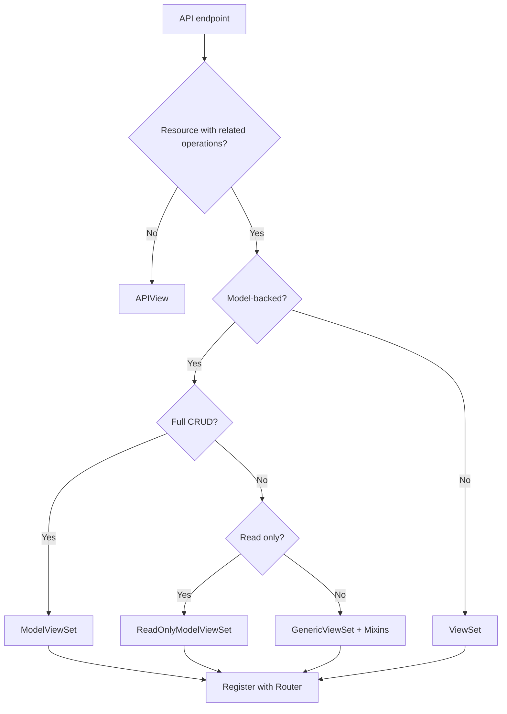
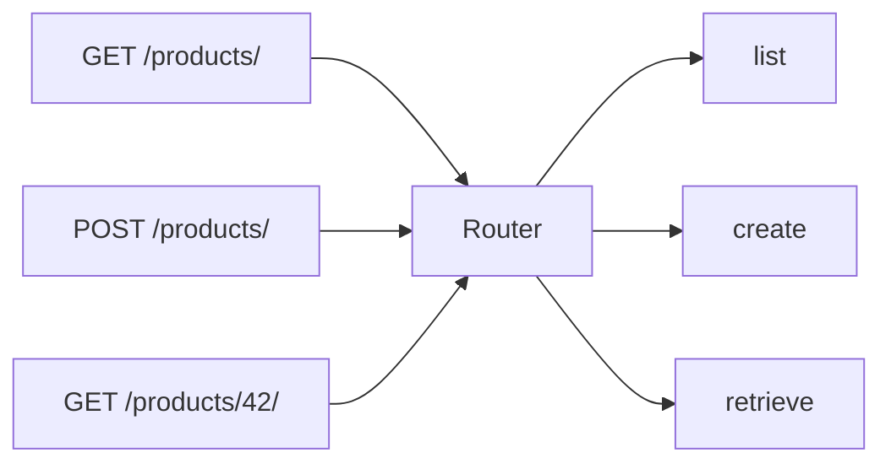
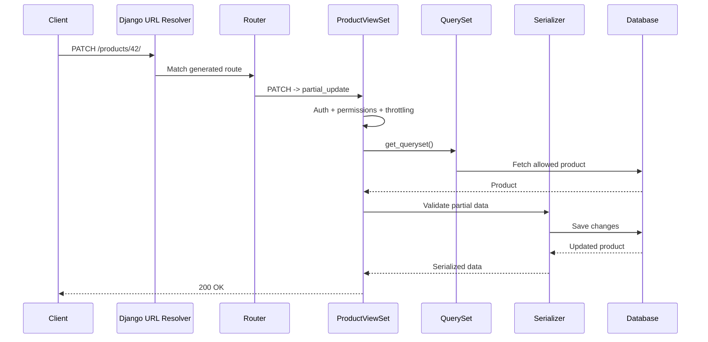

# DRF ViewSets & Routers

> A **ViewSet** groups related API actions in one class, while a **Router** automatically creates the URL patterns that connect HTTP requests to those actions.

> [!NOTE]
> As of **August 19, 2026**, the latest official Django REST Framework release is **3.18.0**, released on **August 7, 2026**. DRF 3.18 also changed its supported Django versions, so always check compatibility before upgrading an existing project.

## In short

- A ViewSet defines **actions** such as `list`, `create`, `retrieve`, `update`, `partial_update`, and `destroy` instead of HTTP handlers such as `get()` and `post()`.
- A router maps HTTP methods and URLs to those actions.
- Use `ModelViewSet` for full CRUD, `ReadOnlyModelViewSet` for read-only APIs, and `GenericViewSet` + mixins when only selected operations are required.
- `router.register(prefix, viewset, basename)` uses `prefix` for the URL path and `basename` for generated URL names.
- Use `@action` for resource-specific operations that do not fit standard CRUD.
- Use `self.action` when serializers, permissions, querysets, or throttles need to vary by action.
- Prefer DRF helpers such as `self.get_object()`, `self.get_serializer()`, and `self.get_queryset()` instead of bypassing the ViewSet pipeline.



---

# 1. Core Mental Model

A normal DRF `APIView` works with HTTP methods directly:

```python
class ProductView(APIView):
    def get(self, request):
        ...

    def post(self, request):
        ...
```

A ViewSet works with **resource actions**:

```python
class ProductViewSet(ViewSet):
    def list(self, request):
        ...

    def create(self, request):
        ...
```

The router connects the HTTP request to the correct action.



## Standard action mapping

| HTTP method | URL | ViewSet action | Purpose |
|---|---|---|---|
| `GET` | `/products/` | `list` | Return multiple products |
| `POST` | `/products/` | `create` | Create a product |
| `GET` | `/products/{pk}/` | `retrieve` | Return one product |
| `PUT` | `/products/{pk}/` | `update` | Full update |
| `PATCH` | `/products/{pk}/` | `partial_update` | Partial update |
| `DELETE` | `/products/{pk}/` | `destroy` | Delete a product |

The important idea is:

> **ViewSet = what the resource can do**  
> **Router = which URLs expose those actions**

---

# 2. Types of ViewSets

DRF provides several ViewSet classes. Use the smallest one that matches the API requirement.

## 2.1 `ViewSet`

`ViewSet` provides ViewSet-style dispatch but no model CRUD behavior.

Use it when you need grouped custom actions but generic model behavior is not useful. You implement the required actions yourself.

## 2.2 `GenericViewSet`

`GenericViewSet` gives access to generic helpers such as:

- `get_queryset()`
- `get_object()`
- `get_serializer()`
- Filtering
- Pagination

It does **not** provide CRUD actions by itself. Add only the mixins you need.

```python
from rest_framework import mixins
from rest_framework.viewsets import GenericViewSet


class ProductViewSet(
    mixins.ListModelMixin,
    mixins.RetrieveModelMixin,
    GenericViewSet,
):
    queryset = Product.objects.all()
    serializer_class = ProductSerializer
```

This exposes only list and retrieve behavior.

## 2.3 `ModelViewSet`

`ModelViewSet` provides the common CRUD actions:

```text
list
create
retrieve
update
partial_update
destroy
```

```python
from rest_framework.viewsets import ModelViewSet


class ProductViewSet(ModelViewSet):
    queryset = Product.objects.all()
    serializer_class = ProductSerializer
```

Use it when the resource genuinely needs standard CRUD.

## 2.4 `ReadOnlyModelViewSet`

Provides only:

```text
list
retrieve
```

```python
from rest_framework.viewsets import ReadOnlyModelViewSet


class CategoryViewSet(ReadOnlyModelViewSet):
    queryset = Category.objects.all()
    serializer_class = CategorySerializer
```

## Quick comparison

| Class | Generic model helpers | Built-in actions |
|---|---:|---|
| `ViewSet` | No | None |
| `GenericViewSet` | Yes | None |
| `ModelViewSet` | Yes | Full CRUD |
| `ReadOnlyModelViewSet` | Yes | `list`, `retrieve` |

---

# 3. Routers

Routers remove repetitive URL configuration by generating routes from a ViewSet.

```python
from rest_framework.routers import DefaultRouter

from .views import ProductViewSet

router = DefaultRouter()
router.register("products", ProductViewSet, basename="product")

urlpatterns = router.urls
```

This creates routes such as:

```text
GET     /products/          -> list
POST    /products/          -> create
GET     /products/42/       -> retrieve
PUT     /products/42/       -> update
PATCH   /products/42/       -> partial_update
DELETE  /products/42/       -> destroy
```

## `prefix` vs `basename`

```python
router.register(
    prefix="products",
    viewset=ProductViewSet,
    basename="product",
)
```

| Value | Controls | Example |
|---|---|---|
| `prefix="products"` | URL path | `/products/` |
| `basename="product"` | URL name | `product-list`, `product-detail` |

Do not include a leading or trailing slash in the router prefix.

## When `basename` is required

If a ViewSet has no class-level `queryset`, DRF cannot automatically derive the model name.

```python
class ProductViewSet(ModelViewSet):
    serializer_class = ProductSerializer

    def get_queryset(self):
        return Product.objects.filter(
            organization=self.request.user.organization
        )
```

Register it explicitly:

```python
router.register("products", ProductViewSet, basename="product")
```

This is common in multi-tenant APIs.

---

# 4. `SimpleRouter` vs `DefaultRouter`

Both routers generate standard ViewSet routes and `@action` routes.

| Feature | `SimpleRouter` | `DefaultRouter` |
|---|---:|---:|
| Standard ViewSet routes | Yes | Yes |
| `@action` routes | Yes | Yes |
| API root view | No | Yes |
| Optional format suffix routes | No | Yes |

## Practical choice

Use `DefaultRouter` when a discoverable API root is useful, especially for internal or browsable APIs.

Use `SimpleRouter` when you want a smaller URL surface or already have your own API root.

Routers use regular-expression paths by default. Modern DRF also supports Django path converters:

```python
from rest_framework.routers import SimpleRouter

router = SimpleRouter(use_regex_path=False)
```

---

# 5. Complete Product Example

The following single example shows the most common production usage of ViewSets and routers.

## 5.1 Model

```python
# products/models.py
from django.conf import settings
from django.db import models


class Product(models.Model):
    name = models.CharField(max_length=150)
    price = models.DecimalField(max_digits=10, decimal_places=2)
    is_active = models.BooleanField(default=True)
    created_by = models.ForeignKey(
        settings.AUTH_USER_MODEL,
        on_delete=models.PROTECT,
        related_name="products",
    )
    created_at = models.DateTimeField(auto_now_add=True)
```

## 5.2 Serializer

```python
# products/serializers.py
from rest_framework import serializers

from .models import Product


class ProductSerializer(serializers.ModelSerializer):
    class Meta:
        model = Product
        fields = [
            "id",
            "name",
            "price",
            "is_active",
            "created_by",
            "created_at",
        ]
        read_only_fields = ["id", "created_by", "created_at"]
```

## 5.3 ViewSet

```python
# products/views.py
from rest_framework.decorators import action
from rest_framework.permissions import IsAuthenticatedOrReadOnly
from rest_framework.response import Response
from rest_framework.viewsets import ModelViewSet

from .models import Product
from .serializers import ProductSerializer


class ProductViewSet(ModelViewSet):
    serializer_class = ProductSerializer
    permission_classes = [IsAuthenticatedOrReadOnly]

    def get_queryset(self):
        return Product.objects.select_related("created_by")

    def perform_create(self, serializer):
        serializer.save(created_by=self.request.user)

    @action(detail=True, methods=["post"])
    def activate(self, request, pk=None):
        product = self.get_object()
        product.is_active = True
        product.save(update_fields=["is_active"])

        serializer = self.get_serializer(product)
        return Response(serializer.data)
```

## 5.4 Router

```python
# products/urls.py
from rest_framework.routers import DefaultRouter

from .views import ProductViewSet

router = DefaultRouter()
router.register("products", ProductViewSet, basename="product")

urlpatterns = router.urls
```

```python
# config/urls.py
from django.urls import include, path

urlpatterns = [
    path("api/v1/", include("products.urls")),
]
```

The router now creates the standard CRUD routes plus:

```text
POST /api/v1/products/{pk}/activate/
```

---

# 6. Custom Actions with `@action`

Use `@action` for a **domain operation** that does not fit normal CRUD.

Examples:

```text
/orders/{id}/cancel/
/invoices/{id}/send/
/users/{id}/deactivate/
/products/{id}/activate/
```

## `detail=True`

Works with one object and includes the lookup value in the URL.

```python
@action(detail=True, methods=["post"])
def activate(self, request, pk=None):
    product = self.get_object()
    ...
```

Generated route:

```text
POST /products/{pk}/activate/
```

## `detail=False`

Works with the collection rather than one object.

```python
@action(detail=False, methods=["get"])
def featured(self, request):
    queryset = self.get_queryset().filter(is_active=True)
    ...
```

Generated route:

```text
GET /products/featured/
```

## Custom URL path

```python
@action(
    detail=True,
    methods=["post"],
    url_path="change-status",
    url_name="change-status",
)
def change_status(self, request, pk=None):
    ...
```

Generated path and name:

```text
/products/{pk}/change-status/
product-change-status
```

> [!IMPORTANT]
> Use `GET` only for operations that do not change server state. State-changing actions should normally use `POST`, `PUT`, `PATCH`, or `DELETE` as appropriate.

---

# 7. Action-Specific Behavior with `self.action`

During normal ViewSet dispatch, DRF exposes the current action through `self.action`.

Typical values are:

```text
list
create
retrieve
update
partial_update
destroy
activate
featured
```

## Different serializer by action

```python
class ProductViewSet(ModelViewSet):
    serializer_class = ProductDetailSerializer

    def get_serializer_class(self):
        if self.action == "list":
            return ProductListSerializer

        if self.action in {"create", "update", "partial_update"}:
            return ProductWriteSerializer

        return ProductDetailSerializer
```

## Different permissions by action

```python
from rest_framework.permissions import AllowAny, IsAdminUser, IsAuthenticated


def get_permissions(self):
    if self.action in {"list", "retrieve"}:
        permission_classes = [AllowAny]
    elif self.action == "destroy":
        permission_classes = [IsAdminUser]
    else:
        permission_classes = [IsAuthenticated]

    return [permission() for permission in permission_classes]
```

> [!NOTE]
> `self.action` is not available early enough inside `get_parsers()`, `get_authenticators()`, or `get_content_negotiator()`.

---

# 8. QuerySets, Objects, and Save Hooks

These hooks are used frequently in real DRF projects.

## `get_queryset()` — control visible records

Use it when the queryset depends on the current request or user.

```python
def get_queryset(self):
    return Product.objects.filter(
        organization=self.request.user.organization
    )
```

For multi-tenant applications, tenant isolation should happen in the queryset so it applies consistently to list, retrieve, update, delete, and `get_object()`.

## `get_object()` — fetch one permitted object

Inside detail actions, prefer:

```python
product = self.get_object()
```

Instead of:

```python
product = Product.objects.get(pk=pk)
```

`get_object()` respects the ViewSet queryset, lookup configuration, filtering, object permissions, and standard not-found handling.

## `get_serializer()` — preserve serializer context

Prefer:

```python
serializer = self.get_serializer(product)
```

It respects `get_serializer_class()`, request context, and custom serializer context.

## Persistence hooks

| Hook | Used by |
|---|---|
| `perform_create()` | `create` |
| `perform_update()` | `update`, `partial_update` |
| `perform_destroy()` | `destroy` |

Example:

```python
def perform_create(self, serializer):
    serializer.save(
        owner=self.request.user,
        organization=self.request.user.organization,
    )
```

### Choose the smallest override

| Requirement | Preferred place |
|---|---|
| Add owner/tenant while saving | `perform_create()` |
| Change serializer by action | `get_serializer_class()` |
| Restrict visible records | `get_queryset()` |
| Change permissions | `get_permissions()` |
| Change the full request/response flow | Override the action |

---

# 9. Custom Lookup Fields

Detail routes use `pk` by default:

```text
/products/42/
```

Use `lookup_field` when the API should identify resources differently.

```python
class ProductViewSet(ModelViewSet):
    queryset = Product.objects.all()
    serializer_class = ProductSerializer
    lookup_field = "slug"
```

Now a detail route can look like:

```text
/products/mechanical-keyboard/
```

The lookup field should normally be unique when it identifies a single resource.

With path-converter routing, UUID lookups can be restricted cleanly:

```python
router = SimpleRouter(use_regex_path=False)


class ProductViewSet(ModelViewSet):
    lookup_value_converter = "uuid"
```

---

# 10. Request Lifecycle

For a request such as:

```text
PATCH /api/v1/products/42/
```

A simplified flow is:



This model helps you decide where code belongs:

| Problem | Check |
|---|---|
| Wrong URL | Router / URL configuration |
| Wrong action | HTTP-to-action mapping |
| Wrong records | `get_queryset()` |
| Object cannot be found | Lookup field / queryset scoping |
| Unauthorized request | Authentication / permissions |
| Invalid input | Serializer validation |
| Wrong save behavior | `perform_create()` / `perform_update()` |
| Wrong response shape | Serializer / action override |

---

# 11. ViewSets vs Generic Views vs `APIView`

| Requirement | Recommended choice |
|---|---|
| Full CRUD resource | `ModelViewSet` + router |
| Read-only resource | `ReadOnlyModelViewSet` + router |
| Selected CRUD operations | `GenericViewSet` + mixins |
| Grouped non-model operations | `ViewSet` |
| Highly custom workflow | `APIView` |
| Standard REST URL conventions | Router |
| Unusual URL mapping | Explicit URL configuration |

## Use ViewSets when

- The API represents a resource with related operations.
- Standard CRUD or mostly REST-style behavior is required.
- Consistent URL conventions matter.
- The project contains many similar resources.

## Prefer `APIView` when

The endpoint behaves more like a workflow or command than a normal resource, for example:

```text
POST /auth/verify-otp/
POST /payments/webhook/
POST /reports/generate/
GET  /health/
```

The important design rule is not to force every endpoint into a `ModelViewSet`.

---

# 12. Production Best Practices

## Keep ViewSets focused

A ViewSet should coordinate the HTTP layer. Large business workflows are usually better placed in a service layer.

```python
@action(detail=True, methods=["post"])
def publish(self, request, pk=None):
    product = self.get_object()
    published_product = product_service.publish(
        product=product,
        published_by=request.user,
    )
    return Response(self.get_serializer(published_product).data)
```

## Scope sensitive data in `get_queryset()`

Do not fetch every tenant's data and rely only on the frontend to hide it.

```python
def get_queryset(self):
    return Project.objects.filter(
        organization=self.request.user.organization
    )
```

## Optimize list and detail queries separately

List endpoints often need fewer joins than detail endpoints.

```python
def get_queryset(self):
    queryset = Product.objects.all()

    if self.action == "list":
        return queryset.select_related("category")

    if self.action == "retrieve":
        return queryset.select_related(
            "category",
            "created_by",
        ).prefetch_related("images", "tags")

    return queryset
```

## Preserve pagination in collection actions

```python
@action(detail=False, methods=["get"])
def inactive(self, request):
    queryset = self.filter_queryset(
        self.get_queryset().filter(is_active=False)
    )

    page = self.paginate_queryset(queryset)
    if page is not None:
        serializer = self.get_serializer(page, many=True)
        return self.get_paginated_response(serializer.data)

    serializer = self.get_serializer(queryset, many=True)
    return Response(serializer.data)
```

## Use domain-oriented custom action names

Good:

```text
/orders/{id}/cancel/
/invoices/{id}/send/
/users/{id}/deactivate/
```

Avoid duplicating CRUD semantics:

```text
/products/{id}/update-product/
/products/{id}/delete-product/
```

`PATCH` and `DELETE` already express those operations.

---

# Quick Revision

```text
ViewSet
  -> groups related resource actions

Router
  -> generates URLs and maps HTTP methods to actions

ModelViewSet
  -> full CRUD

ReadOnlyModelViewSet
  -> list + retrieve

GenericViewSet + mixins
  -> selected CRUD actions only

@action(detail=True)
  -> custom operation on one object

@action(detail=False)
  -> custom collection operation

self.action
  -> action-specific serializer / permission / queryset behavior

get_queryset()
  -> control visible records

get_object()
  -> fetch one object through DRF's permission-aware pipeline

perform_create()
  -> customize save behavior without replacing create()

basename
  -> controls generated route names
```

> The interview-level takeaway: use ViewSets for resource-oriented APIs, routers for consistent URL generation, and choose the smallest ViewSet class and smallest override that satisfy the endpoint's real requirements.
