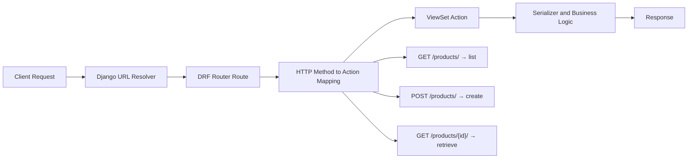
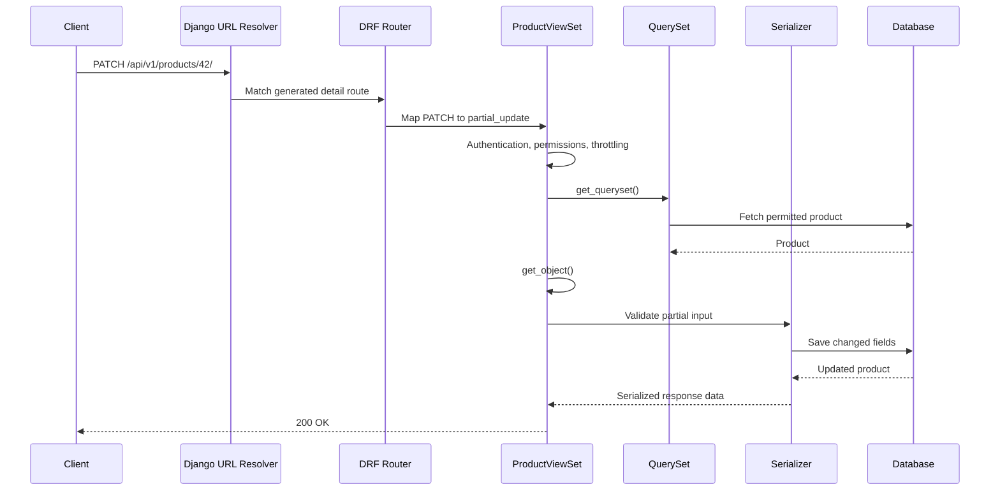
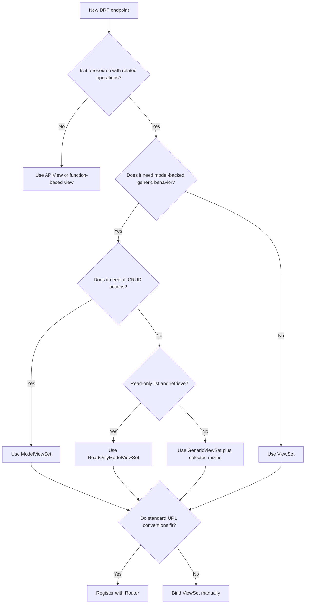

# DRF ViewSets & Routers

> **Core idea:** A **ViewSet** keeps related API actions in one class, while a **Router** automatically creates the URL patterns that connect HTTP requests to those actions.

This topic is based on the current Django REST Framework documentation and is suitable for day-to-day API development and interview preparation.

> [!NOTE]
> As of **July 2026**, the latest documented Django REST Framework release is **3.17.1**. Always verify framework compatibility before upgrading an existing project.

---

# 1. Why ViewSets and Routers Exist

Without a ViewSet, a resource commonly needs separate views for:

- Listing objects
- Creating an object
- Retrieving one object
- Updating an object
- Deleting an object

For example, a product API may require:

```text
GET     /api/products/
POST    /api/products/
GET     /api/products/42/
PUT     /api/products/42/
PATCH   /api/products/42/
DELETE  /api/products/42/
```

Using generic class-based views, this is often implemented with at least two view classes:

```python
from rest_framework.generics import (
    ListCreateAPIView,
    RetrieveUpdateDestroyAPIView,
)

from .models import Product
from .serializers import ProductSerializer


class ProductListCreateView(ListCreateAPIView):
    queryset = Product.objects.all()
    serializer_class = ProductSerializer


class ProductDetailView(RetrieveUpdateDestroyAPIView):
    queryset = Product.objects.all()
    serializer_class = ProductSerializer
```

A `ModelViewSet` combines these related operations into one class:

```python
from rest_framework.viewsets import ModelViewSet

from .models import Product
from .serializers import ProductSerializer


class ProductViewSet(ModelViewSet):
    queryset = Product.objects.all()
    serializer_class = ProductSerializer
```

A router can then generate the standard URL patterns automatically:

```python
from rest_framework.routers import DefaultRouter

from .views import ProductViewSet


router = DefaultRouter()
router.register("products", ProductViewSet, basename="product")

urlpatterns = router.urls
```

## Main benefits

| Benefit | Meaning |
|---|---|
| Less repeated code | Related CRUD behavior lives in one class |
| Consistent URLs | Routers apply the same URL conventions everywhere |
| Easier maintenance | QuerySet, permissions, filters, and serializers are centralized |
| Faster development | Standard CRUD endpoints require very little boilerplate |
| Easy extension | Add non-CRUD endpoints using `@action` |

## Trade-off

ViewSets and routers are convention-based abstractions. They reduce boilerplate, but they can hide some URL-to-view mapping details.

Use them when the resource naturally follows REST-style actions. Prefer explicit views when the endpoint workflow is unusual or does not represent a normal resource.

---

# 2. The Core Mental Model

A ViewSet does not normally define handlers such as `get()` and `post()`.

It defines **actions** such as:

- `list()`
- `create()`
- `retrieve()`
- `update()`
- `partial_update()`
- `destroy()`

The router decides which HTTP method and URL should call each action.



Think of the responsibilities like this:

```text
ViewSet = What the API can do
Router  = Which URLs expose those operations
```

---

# 3. ViewSet Actions and HTTP Methods

The standard action mapping is:

| HTTP method | URL type | ViewSet action | Purpose |
|---|---|---|---|
| `GET` | Collection | `list` | Return multiple objects |
| `POST` | Collection | `create` | Create an object |
| `GET` | Detail | `retrieve` | Return one object |
| `PUT` | Detail | `update` | Fully update one object |
| `PATCH` | Detail | `partial_update` | Partially update one object |
| `DELETE` | Detail | `destroy` | Delete one object |

## Collection and detail routes

### Collection route

Operates on the resource collection:

```text
/api/products/
```

Examples:

```text
GET  /api/products/
POST /api/products/
```

### Detail route

Operates on one resource:

```text
/api/products/42/
```

Examples:

```text
GET    /api/products/42/
PATCH  /api/products/42/
DELETE /api/products/42/
```

## Important distinction

In an `APIView`, you normally write:

```python
def get(self, request):
    ...
```

In a `ViewSet`, you normally write:

```python
def list(self, request):
    ...
```

The HTTP method is mapped to the action when the ViewSet is bound to a URL.

---

# 4. Types of ViewSets

DRF provides multiple ViewSet classes. Choose the smallest abstraction that fits the endpoint.

## 4.1 `ViewSet`

`ViewSet` provides ViewSet dispatch behavior but does not automatically provide database actions.

You implement every required action yourself.

```python
from rest_framework.response import Response
from rest_framework.viewsets import ViewSet


class HealthViewSet(ViewSet):
    def list(self, request):
        return Response({"status": "healthy"})
```

### Use it when

- The endpoint is not directly model-backed
- You are calling another service
- You need fully custom action logic
- Standard generic-model behavior is not useful

---

## 4.2 `GenericViewSet`

`GenericViewSet` adds generic-view functionality such as:

- `get_queryset()`
- `get_object()`
- `get_serializer()`
- Filtering
- Pagination

It does not include CRUD actions by itself. Add only the mixins you need.

```python
from rest_framework import mixins
from rest_framework.viewsets import GenericViewSet

from .models import Product
from .serializers import ProductSerializer


class ProductViewSet(
    mixins.ListModelMixin,
    mixins.RetrieveModelMixin,
    GenericViewSet,
):
    queryset = Product.objects.all()
    serializer_class = ProductSerializer
```

This ViewSet exposes only:

```text
GET /products/
GET /products/{id}/
```

### Use it when

- You need only selected CRUD actions
- You want explicit control over supported operations
- `ModelViewSet` would expose more behavior than needed

---

## 4.3 `ModelViewSet`

`ModelViewSet` provides the complete common CRUD action set:

```text
list
create
retrieve
update
partial_update
destroy
```

```python
from rest_framework.viewsets import ModelViewSet

from .models import Product
from .serializers import ProductSerializer


class ProductViewSet(ModelViewSet):
    queryset = Product.objects.all()
    serializer_class = ProductSerializer
```

Conceptually, it combines these mixins:

```text
CreateModelMixin
RetrieveModelMixin
UpdateModelMixin
DestroyModelMixin
ListModelMixin
GenericViewSet
```

### Use it when

- The resource needs standard read and write CRUD operations
- Your API follows normal REST resource conventions
- You want the fastest maintainable implementation

---

## 4.4 `ReadOnlyModelViewSet`

`ReadOnlyModelViewSet` provides only:

```text
list
retrieve
```

```python
from rest_framework.viewsets import ReadOnlyModelViewSet

from .models import Category
from .serializers import CategorySerializer


class CategoryViewSet(ReadOnlyModelViewSet):
    queryset = Category.objects.all()
    serializer_class = CategorySerializer
```

### Use it when

- Clients can read data but cannot modify it
- The resource is reference or configuration data
- Writes happen through an internal process

---

## ViewSet class comparison

| Class | Generic helpers | Built-in actions |
|---|---:|---|
| `ViewSet` | No model-specific generic helpers | None |
| `GenericViewSet` | Yes | None |
| `ModelViewSet` | Yes | Full CRUD |
| `ReadOnlyModelViewSet` | Yes | `list`, `retrieve` |

---

# 5. Building a Complete CRUD API

The following example creates a production-style Product API.

## 5.1 Model

```python
# products/models.py

from django.conf import settings
from django.db import models


class Product(models.Model):
    name = models.CharField(max_length=150)
    slug = models.SlugField(unique=True)
    description = models.TextField(blank=True)
    price = models.DecimalField(max_digits=10, decimal_places=2)
    is_active = models.BooleanField(default=True)
    created_by = models.ForeignKey(
        settings.AUTH_USER_MODEL,
        on_delete=models.PROTECT,
        related_name="products",
    )
    created_at = models.DateTimeField(auto_now_add=True)
    updated_at = models.DateTimeField(auto_now=True)

    class Meta:
        ordering = ["-created_at"]

    def __str__(self):
        return self.name
```

## 5.2 Serializer

```python
# products/serializers.py

from rest_framework import serializers

from .models import Product


class ProductSerializer(serializers.ModelSerializer):
    created_by = serializers.StringRelatedField(read_only=True)

    class Meta:
        model = Product
        fields = [
            "id",
            "name",
            "slug",
            "description",
            "price",
            "is_active",
            "created_by",
            "created_at",
            "updated_at",
        ]
        read_only_fields = [
            "id",
            "created_by",
            "created_at",
            "updated_at",
        ]
```

## 5.3 ViewSet

```python
# products/views.py

from rest_framework.permissions import IsAuthenticatedOrReadOnly
from rest_framework.viewsets import ModelViewSet

from .models import Product
from .serializers import ProductSerializer


class ProductViewSet(ModelViewSet):
    queryset = Product.objects.select_related("created_by")
    serializer_class = ProductSerializer
    permission_classes = [IsAuthenticatedOrReadOnly]

    def perform_create(self, serializer):
        serializer.save(created_by=self.request.user)
```

## 5.4 App router

```python
# products/urls.py

from rest_framework.routers import DefaultRouter

from .views import ProductViewSet


router = DefaultRouter()
router.register("products", ProductViewSet, basename="product")

urlpatterns = router.urls
```

## 5.5 Project URL configuration

```python
# config/urls.py

from django.contrib import admin
from django.urls import include, path


urlpatterns = [
    path("admin/", admin.site.urls),
    path("api/v1/", include("products.urls")),
]
```

## Generated endpoints

| Method | Endpoint | Action |
|---|---|---|
| `GET` | `/api/v1/products/` | `list` |
| `POST` | `/api/v1/products/` | `create` |
| `GET` | `/api/v1/products/{pk}/` | `retrieve` |
| `PUT` | `/api/v1/products/{pk}/` | `update` |
| `PATCH` | `/api/v1/products/{pk}/` | `partial_update` |
| `DELETE` | `/api/v1/products/{pk}/` | `destroy` |

## Generated URL names

```text
product-list
product-detail
```

These names are important for:

- `reverse()`
- Hyperlinked serializers
- Tests
- API documentation
- Internal links

---

# 6. How Routers Generate URLs

A router reads:

1. The registered URL prefix
2. The ViewSet class
3. The ViewSet's available actions
4. Extra methods decorated with `@action`
5. The configured basename and lookup behavior

It then produces Django URL patterns.

```python
router.register(
    prefix="products",
    viewset=ProductViewSet,
    basename="product",
)
```

## `register()` arguments

| Argument | Required? | Meaning |
|---|---:|---|
| `prefix` | Yes | URL prefix for the resource |
| `viewset` | Yes | ViewSet class to connect |
| `basename` | Sometimes | Base used to generate URL names |

> [!IMPORTANT]
> Do not include a leading or trailing slash in the prefix.

Recommended:

```python
router.register("products", ProductViewSet)
```

Avoid:

```python
router.register("/products/", ProductViewSet)
```

## Router registry

You can inspect registered resources:

```python
for prefix, viewset, basename in router.registry:
    print(prefix, viewset, basename)
```

This can be useful during debugging or custom schema generation.

---

# 7. `SimpleRouter` vs `DefaultRouter`

DRF provides two commonly used built-in routers.

## 7.1 `SimpleRouter`

`SimpleRouter` generates routes for registered ViewSets but does not provide an API root page.

```python
from rest_framework.routers import SimpleRouter


router = SimpleRouter()
router.register("products", ProductViewSet, basename="product")
```

## 7.2 `DefaultRouter`

`DefaultRouter` includes the normal ViewSet routes and also provides:

- A browsable API root
- Optional format suffix routes

```python
from rest_framework.routers import DefaultRouter


router = DefaultRouter()
router.register("products", ProductViewSet, basename="product")
```

## Comparison

| Feature | `SimpleRouter` | `DefaultRouter` |
|---|---:|---:|
| Standard ViewSet routes | Yes | Yes |
| Extra `@action` routes | Yes | Yes |
| API root view | No | Yes |
| Format suffix support | No | Yes |
| Good for public API navigation | Basic | Better |
| More minimal URL configuration | Yes | No |

## Practical choice

Use `DefaultRouter` when:

- You want a discoverable browsable API
- You are building an internal API
- The generated API root is useful to developers

Use `SimpleRouter` when:

- You want a minimal URL surface
- You already maintain a custom API root
- You do not want format suffix routes

---

# 8. Understanding `basename`

The `basename` controls generated URL names.

```python
router.register(
    "products",
    ProductViewSet,
    basename="product",
)
```

The router generates names such as:

```text
product-list
product-detail
product-activate
```

## Automatic basename detection

When the ViewSet has a class-level `queryset`, DRF can usually derive the basename from its model:

```python
class ProductViewSet(ModelViewSet):
    queryset = Product.objects.all()
    serializer_class = ProductSerializer
```

The following may work without an explicit basename:

```python
router.register("products", ProductViewSet)
```

## When basename must be supplied

A common pattern is to define only `get_queryset()`:

```python
class ProductViewSet(ModelViewSet):
    serializer_class = ProductSerializer

    def get_queryset(self):
        return Product.objects.filter(
            organization=self.request.user.organization
        )
```

The router cannot inspect a class-level queryset to determine the model. Register it with an explicit basename:

```python
router.register(
    "products",
    ProductViewSet,
    basename="product",
)
```

> [!KEY]
> `prefix` controls the URL path.  
> `basename` controls the URL name.

```text
prefix="products"  → /products/
basename="product" → product-list
```

---

# 9. Custom Actions with `@action`

Not every operation fits standard CRUD.

Examples:

- Activate a product
- Publish an article
- Cancel an order
- Resend an invitation
- Return a report
- Mark a notification as read

Use the `@action` decorator for resource-specific operations.

```python
from rest_framework.decorators import action
from rest_framework.response import Response
from rest_framework.viewsets import ModelViewSet


class ProductViewSet(ModelViewSet):
    queryset = Product.objects.all()
    serializer_class = ProductSerializer

    @action(detail=True, methods=["post"])
    def activate(self, request, pk=None):
        product = self.get_object()
        product.is_active = True
        product.save(update_fields=["is_active"])

        serializer = self.get_serializer(product)
        return Response(serializer.data)
```

The router generates:

```text
POST /products/{pk}/activate/
```

## 9.1 `detail=True`

Use `detail=True` when the action operates on one object.

```python
@action(detail=True, methods=["post"])
def activate(self, request, pk=None):
    product = self.get_object()
    ...
```

Generated route:

```text
POST /products/{pk}/activate/
```

## 9.2 `detail=False`

Use `detail=False` when the action operates on the collection.

```python
from rest_framework.decorators import action
from rest_framework.response import Response


class ProductViewSet(ModelViewSet):
    queryset = Product.objects.all()
    serializer_class = ProductSerializer

    @action(detail=False, methods=["get"])
    def featured(self, request):
        products = self.get_queryset().filter(
            is_active=True,
            price__gte=100,
        )[:10]

        serializer = self.get_serializer(products, many=True)
        return Response(serializer.data)
```

Generated route:

```text
GET /products/featured/
```

## 9.3 Multiple HTTP methods

```python
@action(detail=True, methods=["get", "post"])
def status(self, request, pk=None):
    product = self.get_object()

    if request.method == "POST":
        product.is_active = not product.is_active
        product.save(update_fields=["is_active"])

    return Response({"is_active": product.is_active})
```

Prefer separate actions when GET and POST perform conceptually different operations. It usually produces clearer permissions, documentation, and tests.

## 9.4 Custom `url_path` and `url_name`

```python
@action(
    detail=True,
    methods=["post"],
    url_path="change-status",
    url_name="change-status",
)
def change_status(self, request, pk=None):
    ...
```

Generated route:

```text
POST /products/{pk}/change-status/
```

Generated URL name:

```text
product-change-status
```

## 9.5 Additional method mappings

A single logical action can support related methods using `.mapping`:

```python
from rest_framework.decorators import action
from rest_framework.response import Response


class ProductViewSet(ModelViewSet):
    queryset = Product.objects.all()
    serializer_class = ProductSerializer

    @action(detail=True, methods=["put"], url_path="featured")
    def featured(self, request, pk=None):
        product = self.get_object()
        product.is_featured = True
        product.save(update_fields=["is_featured"])
        return Response({"is_featured": True})

    @featured.mapping.delete
    def remove_featured(self, request, pk=None):
        product = self.get_object()
        product.is_featured = False
        product.save(update_fields=["is_featured"])
        return Response({"is_featured": False})
```

This maps:

```text
PUT    /products/{pk}/featured/
DELETE /products/{pk}/featured/
```

---

# 10. Action-Specific Behavior

During normal action execution, DRF exposes `self.action`.

Possible values include:

```text
list
create
retrieve
update
partial_update
destroy
activate
featured
```

It is useful for changing:

- Serializer
- Permission
- QuerySet optimization
- Filtering behavior
- Throttling
- Business rules

> [!WARNING]
> `self.action` is not available early enough inside methods such as `get_parsers()`, `get_authenticators()`, and `get_content_negotiator()`.

---

## 10.1 Different serializers by action

A common production pattern uses:

- A lightweight serializer for list endpoints
- A detailed serializer for retrieval
- A dedicated input serializer for creation or updates

```python
class ProductViewSet(ModelViewSet):
    queryset = Product.objects.all()
    serializer_class = ProductDetailSerializer

    def get_serializer_class(self):
        if self.action == "list":
            return ProductListSerializer

        if self.action in {"create", "update", "partial_update"}:
            return ProductWriteSerializer

        return ProductDetailSerializer
```

A dictionary-based implementation can be cleaner:

```python
class ProductViewSet(ModelViewSet):
    queryset = Product.objects.all()
    serializer_class = ProductDetailSerializer

    serializer_action_classes = {
        "list": ProductListSerializer,
        "create": ProductWriteSerializer,
        "update": ProductWriteSerializer,
        "partial_update": ProductWriteSerializer,
    }

    def get_serializer_class(self):
        return self.serializer_action_classes.get(
            self.action,
            self.serializer_class,
        )
```

---

## 10.2 Different permissions by action

```python
from rest_framework.permissions import AllowAny, IsAdminUser, IsAuthenticated


class ProductViewSet(ModelViewSet):
    queryset = Product.objects.all()
    serializer_class = ProductSerializer

    def get_permissions(self):
        if self.action in {"list", "retrieve"}:
            permission_classes = [AllowAny]
        elif self.action == "destroy":
            permission_classes = [IsAdminUser]
        else:
            permission_classes = [IsAuthenticated]

        return [permission() for permission in permission_classes]
```

You can also configure permissions directly on a custom action:

```python
from rest_framework.decorators import action
from rest_framework.permissions import IsAdminUser
from rest_framework.response import Response


class ProductViewSet(ModelViewSet):
    queryset = Product.objects.all()
    serializer_class = ProductSerializer

    @action(
        detail=True,
        methods=["post"],
        permission_classes=[IsAdminUser],
    )
    def archive(self, request, pk=None):
        product = self.get_object()
        product.is_active = False
        product.save(update_fields=["is_active"])

        return Response({"status": "archived"})
```

---

## 10.3 Different throttles by action

```python
class ProductViewSet(ModelViewSet):
    queryset = Product.objects.all()
    serializer_class = ProductSerializer

    def get_throttles(self):
        if self.action == "export":
            throttle_classes = [ExportRateThrottle]
        else:
            throttle_classes = self.throttle_classes

        return [throttle() for throttle in throttle_classes]
```

---

## 10.4 Different filter behavior

```python
class ProductViewSet(ModelViewSet):
    queryset = Product.objects.all()
    serializer_class = ProductSerializer
    filter_backends = [DjangoFilterBackend, SearchFilter]
    filterset_fields = ["is_active"]
    search_fields = ["name", "description"]

    def filter_queryset(self, queryset):
        if self.action == "featured":
            return queryset

        return super().filter_queryset(queryset)
```

---

# 11. QuerySet Patterns in ViewSets

## 11.1 Use `get_queryset()` for request-dependent data

```python
class ProductViewSet(ModelViewSet):
    serializer_class = ProductSerializer

    def get_queryset(self):
        return Product.objects.filter(
            organization=self.request.user.organization
        )
```

This is essential for multi-tenant systems.

> [!IMPORTANT]
> Object isolation should happen in the QuerySet, not only in the serializer or frontend.

---

## 11.2 Optimize relationships by action

A list endpoint may require fewer joins than a detail endpoint.

```python
class ProductViewSet(ModelViewSet):
    serializer_class = ProductSerializer

    def get_queryset(self):
        queryset = Product.objects.all()

        if self.action == "list":
            return queryset.select_related("category")

        if self.action == "retrieve":
            return queryset.select_related(
                "category",
                "created_by",
            ).prefetch_related(
                "images",
                "tags",
            )

        return queryset
```

This helps prevent N+1 queries and avoids unnecessary prefetching.

---

## 11.3 Filter by authenticated user

```python
class OrderViewSet(ModelViewSet):
    serializer_class = OrderSerializer

    def get_queryset(self):
        return Order.objects.filter(
            customer=self.request.user
        ).select_related("customer")
```

Never return all user-owned records and depend on object permissions alone unless that behavior is deliberately designed and tested.

---

## 11.4 Use `perform_create()` for request-derived values

```python
def perform_create(self, serializer):
    serializer.save(
        customer=self.request.user,
        organization=self.request.user.organization,
    )
```

Use hooks for persistence-related behavior:

| Hook | Called during |
|---|---|
| `perform_create()` | `create` |
| `perform_update()` | `update` and `partial_update` |
| `perform_destroy()` | `destroy` |

Example:

```python
def perform_update(self, serializer):
    serializer.save(updated_by=self.request.user)
```

For soft delete:

```python
def perform_destroy(self, instance):
    instance.is_deleted = True
    instance.save(update_fields=["is_deleted"])
```

---

## 11.5 Override an action only when needed

Use `perform_create()` when you only need to modify saving behavior.

Override `create()` when you need to change the complete request-response flow.

```python
from rest_framework import status
from rest_framework.response import Response


class ProductViewSet(ModelViewSet):
    queryset = Product.objects.all()
    serializer_class = ProductSerializer

    def create(self, request, *args, **kwargs):
        serializer = self.get_serializer(data=request.data)
        serializer.is_valid(raise_exception=True)
        self.perform_create(serializer)

        return Response(
            {
                "message": "Product created successfully",
                "data": serializer.data,
            },
            status=status.HTTP_201_CREATED,
        )
```

> [!KEY]
> Prefer the smallest override:
>
> - Change save values → `perform_create()`
> - Change serializer selection → `get_serializer_class()`
> - Change records → `get_queryset()`
> - Change the full response flow → override the action

---

# 12. Custom Lookup Fields

By default, detail routes use `pk`:

```text
/products/42/
```

You can use a slug:

```python
class ProductViewSet(ModelViewSet):
    queryset = Product.objects.all()
    serializer_class = ProductSerializer
    lookup_field = "slug"
```

Generated route:

```text
/products/wireless-keyboard/
```

Your model should normally enforce uniqueness for the lookup field:

```python
slug = models.SlugField(unique=True)
```

## Restricting lookup values

Routers traditionally use regular expressions for URL matching.

```python
class ProductViewSet(ModelViewSet):
    queryset = Product.objects.all()
    serializer_class = ProductSerializer
    lookup_value_regex = "[0-9a-f-]{36}"
```

For UUID values, a model may use:

```python
import uuid

from django.db import models


class Product(models.Model):
    id = models.UUIDField(
        primary_key=True,
        default=uuid.uuid4,
        editable=False,
    )
```

## Path converter mode

Modern DRF routers can use Django `path()` converters:

```python
from rest_framework.routers import SimpleRouter


router = SimpleRouter(use_regex_path=False)
```

Then a ViewSet can specify:

```python
class ProductViewSet(ModelViewSet):
    queryset = Product.objects.all()
    serializer_class = ProductSerializer
    lookup_value_converter = "uuid"
```

Example route:

```text
/products/550e8400-e29b-41d4-a716-446655440000/
```

---

# 13. Limiting Supported Operations

A full `ModelViewSet` may expose more operations than your API should allow.

## 13.1 Use `ReadOnlyModelViewSet`

```python
class CategoryViewSet(ReadOnlyModelViewSet):
    queryset = Category.objects.all()
    serializer_class = CategorySerializer
```

Supported:

```text
GET /categories/
GET /categories/{pk}/
```

---

## 13.2 Compose only required mixins

For list, create, and retrieve only:

```python
from rest_framework import mixins
from rest_framework.viewsets import GenericViewSet


class ProductViewSet(
    mixins.ListModelMixin,
    mixins.CreateModelMixin,
    mixins.RetrieveModelMixin,
    GenericViewSet,
):
    queryset = Product.objects.all()
    serializer_class = ProductSerializer
```

Supported:

```text
GET  /products/
POST /products/
GET  /products/{pk}/
```

Not supported:

```text
PUT    /products/{pk}/
PATCH  /products/{pk}/
DELETE /products/{pk}/
```

This is clearer than exposing all actions and blocking them later.

---

## 13.3 Disable an inherited method carefully

You could technically reject an action:

```python
from rest_framework.exceptions import MethodNotAllowed


class ProductViewSet(ModelViewSet):
    queryset = Product.objects.all()
    serializer_class = ProductSerializer

    def destroy(self, request, *args, **kwargs):
        raise MethodNotAllowed("DELETE")
```

However, composing the correct mixins is usually a cleaner design because unsupported routes are not generated as valid operations.

---

# 14. Manual URL Binding Without a Router

A ViewSet can be used without a router.

```python
from django.urls import path

from .views import ProductViewSet


product_list = ProductViewSet.as_view(
    {
        "get": "list",
        "post": "create",
    }
)

product_detail = ProductViewSet.as_view(
    {
        "get": "retrieve",
        "put": "update",
        "patch": "partial_update",
        "delete": "destroy",
    }
)


urlpatterns = [
    path("products/", product_list, name="product-list"),
    path(
        "products/<int:pk>/",
        product_detail,
        name="product-detail",
    ),
]
```

This explicitly maps HTTP methods to actions:

```python
{
    "get": "list",
    "post": "create",
}
```

## When manual binding is useful

- You need unusual URL patterns
- You want only specific mappings
- You are integrating ViewSets into an existing URL structure
- You need maximum URL transparency
- A router's conventions do not match the API contract

## Trade-off

Manual binding gives more control, but you lose the main URL automation benefit of routers.

---

# 15. Reversing ViewSet URLs

Use generated route names instead of hardcoding paths.

## Standard actions

```python
from django.urls import reverse


list_url = reverse("product-list")
detail_url = reverse(
    "product-detail",
    kwargs={"pk": 42},
)
```

## Namespaced router

Project URLs:

```python
path(
    "api/v1/",
    include(("products.urls", "products"), namespace="v1"),
)
```

Reverse:

```python
reverse("v1:product-list")
```

## `reverse_action()`

Inside a ViewSet:

```python
from rest_framework.decorators import action
from rest_framework.response import Response


class ProductViewSet(ModelViewSet):
    queryset = Product.objects.all()
    serializer_class = ProductSerializer

    @action(detail=True, methods=["get"])
    def links(self, request, pk=None):
        return Response(
            {
                "detail": self.reverse_action(
                    "detail",
                    args=[pk],
                ),
                "activate": self.reverse_action(
                    "activate",
                    args=[pk],
                ),
            }
        )

    @action(detail=True, methods=["post"])
    def activate(self, request, pk=None):
        return Response({"status": "active"})
```

`reverse_action()` automatically uses the ViewSet's basename.

---

# 16. Nested Resource Design

Suppose orders contain items:

```text
/orders/{order_id}/items/
```

DRF's built-in routers are primarily designed for flat resources.

## Option 1: Flat endpoints with filtering

```text
GET /order-items/?order=42
```

This is simple and works well for many APIs.

## Option 2: Custom action

```python
from rest_framework.decorators import action
from rest_framework.response import Response


class OrderViewSet(ModelViewSet):
    queryset = Order.objects.all()
    serializer_class = OrderSerializer

    @action(detail=True, methods=["get"])
    def items(self, request, pk=None):
        order = self.get_object()
        queryset = order.items.all()

        page = self.paginate_queryset(queryset)
        if page is not None:
            serializer = OrderItemSerializer(page, many=True)
            return self.get_paginated_response(serializer.data)

        serializer = OrderItemSerializer(queryset, many=True)
        return Response(serializer.data)
```

Generated endpoint:

```text
GET /orders/{pk}/items/
```

## Option 3: Nested router package

For a strongly nested API structure, a third-party nested-router package can generate routes such as:

```text
/orders/{order_pk}/items/{pk}/
```

## Design guidance

Use nesting when the child resource is meaningfully scoped by the parent.

Avoid excessive nesting such as:

```text
/organizations/{id}/projects/{id}/tasks/{id}/comments/{id}/
```

Deep nesting makes:

- URLs harder to maintain
- Permissions harder to reason about
- Reversing URLs more complex
- Client integration more fragile

One or two levels is usually sufficient.

---

# 17. Request Lifecycle

Consider this request:

```text
PATCH /api/v1/products/42/
```

A simplified lifecycle is:



## Why this matters

When debugging a ViewSet, ask where the behavior belongs:

| Symptom | Where to look |
| --- | --- |
| URL problem | Router or URL configuration |
| Wrong action | HTTP-method mapping |
| Wrong records | `get_queryset()` |
| Object not found | Lookup field or tenant filtering |
| Unauthorized | Authentication or permission |
| Invalid request body | Serializer validation |
| Wrong save behavior | `perform_create`/`perform_update` |
| Wrong response shape | Serializer or action override |

---

# 18. Testing ViewSets and Router URLs

ViewSets should be tested at both the API behavior level and the URL-generation level.

## 18.1 API client test

```python
# products/tests/test_product_api.py

import pytest
from django.urls import reverse
from rest_framework import status
from rest_framework.test import APIClient

from products.models import Product


@pytest.mark.django_db
def test_authenticated_user_can_create_product(user):
    client = APIClient()
    client.force_authenticate(user=user)

    url = reverse("product-list")
    payload = {
        "name": "Mechanical Keyboard",
        "slug": "mechanical-keyboard",
        "description": "Compact keyboard",
        "price": "129.99",
        "is_active": True,
    }

    response = client.post(url, payload, format="json")

    assert response.status_code == status.HTTP_201_CREATED
    assert Product.objects.filter(
        slug="mechanical-keyboard",
        created_by=user,
    ).exists()
```

## 18.2 Test a custom action

```python
@pytest.mark.django_db
def test_admin_can_archive_product(admin_user, product):
    client = APIClient()
    client.force_authenticate(user=admin_user)

    url = reverse(
        "product-archive",
        kwargs={"pk": product.pk},
    )

    response = client.post(url, format="json")

    assert response.status_code == status.HTTP_200_OK

    product.refresh_from_db()
    assert product.is_active is False
```

## 18.3 Test URL resolution

```python
from django.urls import resolve, reverse


def test_product_list_route_resolves_to_list_action():
    url = reverse("product-list")
    match = resolve(url)

    assert match.func.actions["get"] == "list"
    assert match.func.actions["post"] == "create"
```

## 18.4 Test tenant isolation

```python
@pytest.mark.django_db
def test_user_cannot_retrieve_another_organizations_product(
    user,
    another_organization_product,
):
    client = APIClient()
    client.force_authenticate(user=user)

    url = reverse(
        "product-detail",
        kwargs={"pk": another_organization_product.pk},
    )

    response = client.get(url)

    assert response.status_code == status.HTTP_404_NOT_FOUND
```

A `404` is often preferred for cross-tenant access because it does not reveal that the object exists.

---

# 19. APIView vs Generic Views vs ViewSets

| Feature | `APIView` | Generic views | ViewSets |
|---|---|---|---|
| Methods normally written as | `get`, `post`, `put` | Inherited handlers/hooks | `list`, `create`, `retrieve` |
| URL configuration | Manual | Manual | Usually automatic |
| CRUD boilerplate | High | Low | Lowest |
| Explicit request flow | Highest | Medium | Lower |
| Best for standard model CRUD | Possible | Very good | Excellent |
| Best for unusual workflows | Excellent | Good | Sometimes awkward |
| Router support | No | No | Yes |
| Custom resource actions | Manual endpoint | Manual endpoint | `@action` |

## Practical rule

### Use `APIView` when

- The endpoint represents a workflow, not a resource
- Request and response shapes are highly custom
- Multiple unrelated services are coordinated
- You need complete control over HTTP handling

Examples:

```text
POST /auth/verify-otp/
POST /payments/webhook/
POST /reports/generate/
GET  /health/
```

### Use generic views when

- The endpoint is model-backed
- You want explicit URLs
- One or two operations are needed
- Separate list and detail classes improve clarity

### Use ViewSets when

- The API exposes a resource with related operations
- Standard CRUD routes are needed
- Consistent URL conventions matter
- The project has many resources
- Router-generated URLs reduce repetitive configuration

---

# 20. Production Best Practices

## 20.1 Keep ViewSets focused

A ViewSet should coordinate the HTTP layer, not contain all domain logic.

Avoid placing large business workflows directly inside actions:

```python
def approve(self, request, pk=None):
    # Hundreds of lines of validation, calculations,
    # notifications, billing, and audit logic...
    ...
```

Move reusable business behavior into a service:

```python
@action(detail=True, methods=["post"])
def approve(self, request, pk=None):
    order = self.get_object()
    approved_order = order_service.approve(
        order=order,
        approved_by=request.user,
    )

    serializer = self.get_serializer(approved_order)
    return Response(serializer.data)
```

A good separation is:

| Layer | Responsibility |
| --- | --- |
| ViewSet | HTTP coordination |
| Serializer | Input validation and representation |
| Service | Business use case |
| Model | Domain state and persistence rules |
| Permission | Access decision |
| QuerySet | Data visibility and query optimization |

---

## 20.2 Scope data in `get_queryset()`

```python
def get_queryset(self):
    return Project.objects.filter(
        organization=self.request.user.organization
    )
```

This protects:

- List endpoints
- Retrieve endpoints
- Update endpoints
- Delete endpoints
- `self.get_object()` inside custom actions

---

## 20.3 Use `self.get_object()`

Inside a detail action, prefer:

```python
product = self.get_object()
```

Avoid:

```python
product = Product.objects.get(pk=pk)
```

`self.get_object()` applies:

- The ViewSet QuerySet
- Lookup configuration
- Filter backends
- Object-level permissions
- Standard not-found handling

---

## 20.4 Use `self.get_serializer()`

Prefer:

```python
serializer = self.get_serializer(product)
```

Instead of:

```python
serializer = ProductSerializer(product)
```

`self.get_serializer()` preserves:

- Serializer context
- Request context
- View context
- Action-specific serializer selection
- Custom `get_serializer_context()` behavior

---

## 20.5 Preserve pagination in collection actions

A custom collection action may return many records. Use DRF's pagination helpers:

```python
@action(detail=False, methods=["get"])
def inactive(self, request):
    queryset = self.filter_queryset(
        self.get_queryset().filter(is_active=False)
    )

    page = self.paginate_queryset(queryset)
    if page is not None:
        serializer = self.get_serializer(page, many=True)
        return self.get_paginated_response(serializer.data)

    serializer = self.get_serializer(queryset, many=True)
    return Response(serializer.data)
```

---

## 20.6 Make action names domain-oriented

Good custom actions:

```text
/orders/{id}/cancel/
/invoices/{id}/send/
/users/{id}/deactivate/
/reports/export/
```

Avoid action names that simply repeat generic CRUD:

```text
/products/{id}/update-product/
/products/{id}/delete-product/
```

Standard `PATCH`, `PUT`, and `DELETE` already express these operations.

---

## 20.7 Use correct HTTP semantics

| Operation | Recommended method |
|---|---|
| Read resource or calculation without changing state | `GET` |
| Create a subordinate operation or trigger command | `POST` |
| Replace a resource or idempotently set state | `PUT` |
| Partially modify state | `PATCH` |
| Remove resource or relationship | `DELETE` |

Do not use `GET` for a state-changing action:

```python
# Avoid
@action(detail=True, methods=["get"])
def activate(self, request, pk=None):
    ...
```

Use:

```python
@action(detail=True, methods=["post"])
def activate(self, request, pk=None):
    ...
```

---

## 20.8 Prevent accidental field updates

Use dedicated write serializers and `read_only_fields`.

Do not trust the client to provide:

- Owner
- Organization
- Audit fields
- Approval state
- Privileged flags

Set trusted values from the request or service layer:

```python
def perform_create(self, serializer):
    serializer.save(
        owner=self.request.user,
        organization=self.request.user.organization,
    )
```

---

## 20.9 Optimize list and detail queries separately

```python
def get_queryset(self):
    queryset = Product.objects.all()

    if self.action == "list":
        return queryset.select_related("category").only(
            "id",
            "name",
            "price",
            "category__name",
        )

    return queryset.select_related(
        "category",
        "created_by",
    ).prefetch_related(
        "images",
        "tags",
    )
```

Validate query counts in tests for important endpoints.

---

## 20.10 Keep router registration close to the app

A scalable project structure:

```text
products/
├── models.py
├── serializers.py
├── services.py
├── permissions.py
├── views.py
├── urls.py
└── tests/
```

App router:

```python
# products/urls.py

router = DefaultRouter()
router.register("products", ProductViewSet, basename="product")

urlpatterns = router.urls
```

Root URL configuration:

```python
path("api/v1/", include("products.urls"))
```

For very large systems, you may instead maintain one central API router. Choose one consistent project convention.

---

# 21. Practical Decision Guide

Use this decision flow:



## Fast reference

| Requirement | Recommended choice |
|---|---|
| Full CRUD model resource | `ModelViewSet` + router |
| Read-only model resource | `ReadOnlyModelViewSet` + router |
| Only selected CRUD operations | `GenericViewSet` + mixins |
| Non-model grouped actions | `ViewSet` |
| Highly unusual endpoint | `APIView` |
| Standard URL conventions | Router |
| Unusual URL-to-action mapping | Manual `.as_view()` binding |
| One-object custom operation | `@action(detail=True)` |
| Collection-level custom operation | `@action(detail=False)` |
| Request-specific records | Override `get_queryset()` |
| Different output by action | Override `get_serializer_class()` |
| Different access rules by action | Override `get_permissions()` |
| Add owner during creation | Override `perform_create()` |

---

# 22. Final Summary

| `ViewSet` | `Router` |
| --- | --- |
| Groups related API actions | Registers a URL prefix and a ViewSet |
| Uses `list`/`create`/`retrieve`/`update`/`destroy` | Maps HTTP methods to ViewSet actions |
| Can use generic QuerySet and serializer behavior | Generates collection and detail routes |
| Can expose custom actions with `@action` | Generates route names from `basename` |
| — | Includes routes for custom actions |

The most common implementation is:

```python
class ProductViewSet(ModelViewSet):
    queryset = Product.objects.all()
    serializer_class = ProductSerializer
```

```python
router = DefaultRouter()
router.register("products", ProductViewSet, basename="product")
```

Remember these core rules:

1. Use `ModelViewSet` for standard CRUD resources.
2. Use selected mixins when not every CRUD operation should exist.
3. Use `@action(detail=True)` for one-object operations.
4. Use `@action(detail=False)` for collection operations.
5. Scope user-visible data in `get_queryset()`.
6. Use `self.get_object()` and `self.get_serializer()`.
7. Use `perform_create()` and related hooks for save-time behavior.
8. Set `basename` explicitly when it cannot be inferred.
9. Use routers for consistency, but manual binding when explicit control is more important.
10. Keep complex business workflows outside the ViewSet.

---

# Official References

- [DRF ViewSets](https://www.django-rest-framework.org/api-guide/viewsets/)
- [DRF Routers](https://www.django-rest-framework.org/api-guide/routers/)
- [DRF Tutorial: ViewSets and Routers](https://www.django-rest-framework.org/tutorial/6-viewsets-and-routers/)
- [DRF Generic Views](https://www.django-rest-framework.org/api-guide/generic-views/)
- [DRF Release Notes](https://www.django-rest-framework.org/community/release-notes/)
