# Async Endpoints and Why FastAPI Is Fast

> FastAPI is fast mainly because it runs on the asynchronous ASGI ecosystem and can serve other requests while one request is waiting for network or database I/O. However, writing `async def` alone does not make code faster. The complete call chain must avoid blocking the event loop.

---

# 1. Core Idea

Most API requests spend a large amount of time **waiting**:

- Waiting for a database query
- Waiting for another API
- Waiting for Redis
- Waiting for object storage
- Waiting for a message broker
- Waiting for the client to send or receive data

During this waiting period, the CPU is usually not doing useful work.

With asynchronous programming, the endpoint can pause at an `await` expression. The event loop can then continue processing other requests. When the awaited operation finishes, the endpoint resumes from the same location.

```python
@app.get("/users/{user_id}")
async def get_user(user_id: int):
    user = await user_repository.get(user_id)
    return user
```

The important line is:

```python
user = await user_repository.get(user_id)
```

While the database is processing the query, the server can work on other requests.

> **Key point:** Async does not remove waiting. It uses waiting time more efficiently.

---

# 2. Synchronous vs Asynchronous Execution

## 2.1 Synchronous execution

In synchronous code, one operation normally completes before the next operation starts.

```text
Request A: [database wait................][response]
Request B:                               [database wait................][response]
```

If the same execution thread handles both requests, Request B cannot progress while Request A is blocking.

## 2.2 Asynchronous execution

In asynchronous code, a task can pause while waiting, allowing another task to run.

```text
Request A: [start][wait...................][resume][response]
Request B:        [start][wait.......][resume][response]
Request C:              [start][wait.............][resume][response]
```

The requests are **concurrent**. Their execution overlaps, although they are not necessarily executing Python instructions at the exact same instant.

## 2.3 Concurrency vs parallelism

| Concept | Meaning | Common FastAPI use |
|---|---|---|
| Concurrency | Multiple tasks make progress during overlapping time | Network calls, database queries, Redis, WebSockets |
| Parallelism | Multiple tasks execute at the same instant on different CPU cores | Image processing, ML inference, data transformation |
| Async I/O | One thread switches between tasks when they wait | High-concurrency API endpoints |
| Multiprocessing | Multiple processes use multiple CPU cores | CPU-heavy workloads |

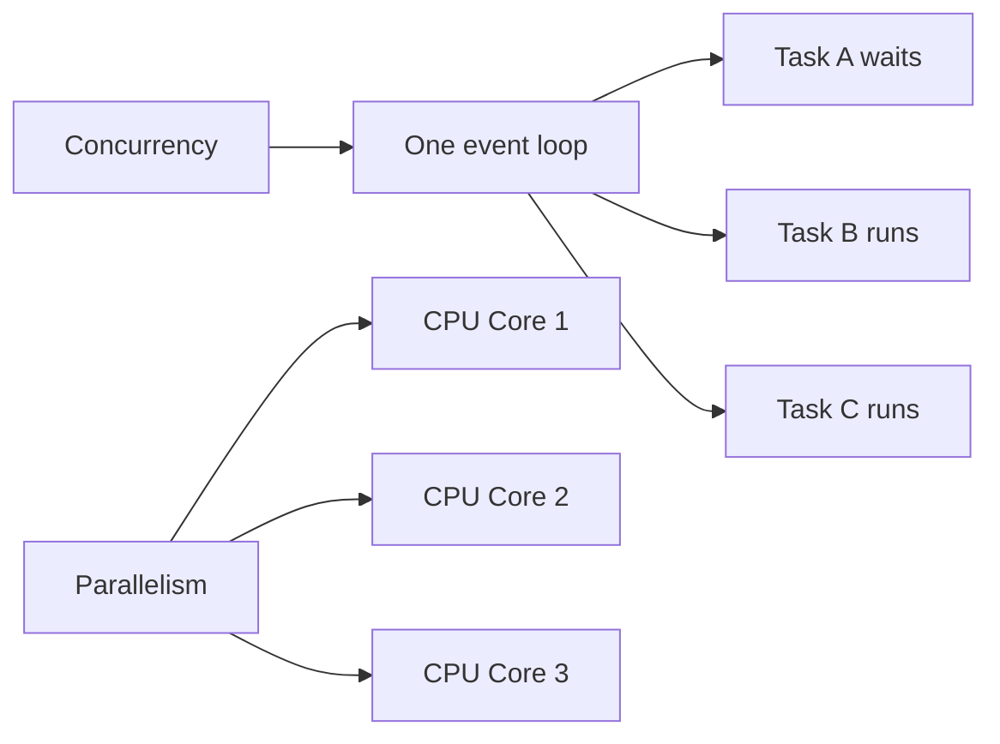

> `async` is mainly a concurrency mechanism. It does not automatically provide CPU parallelism.

---

# 3. How an Async FastAPI Endpoint Works

A typical FastAPI application uses the following stack:

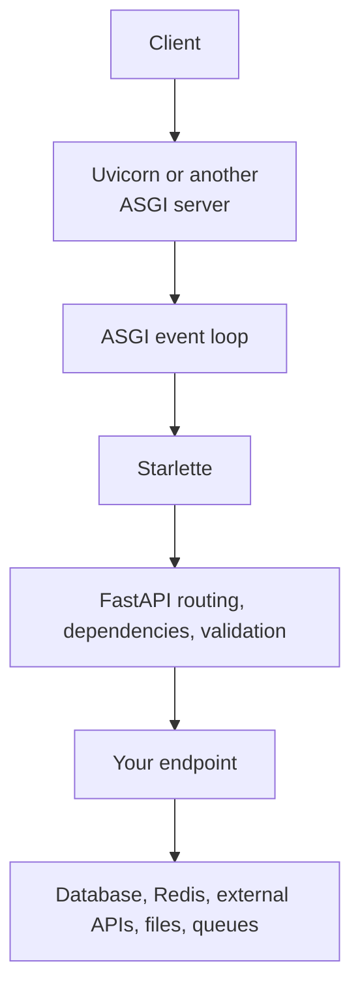

FastAPI is built on Starlette, while Uvicorn is commonly used as the ASGI server.

## 3.1 Request lifecycle

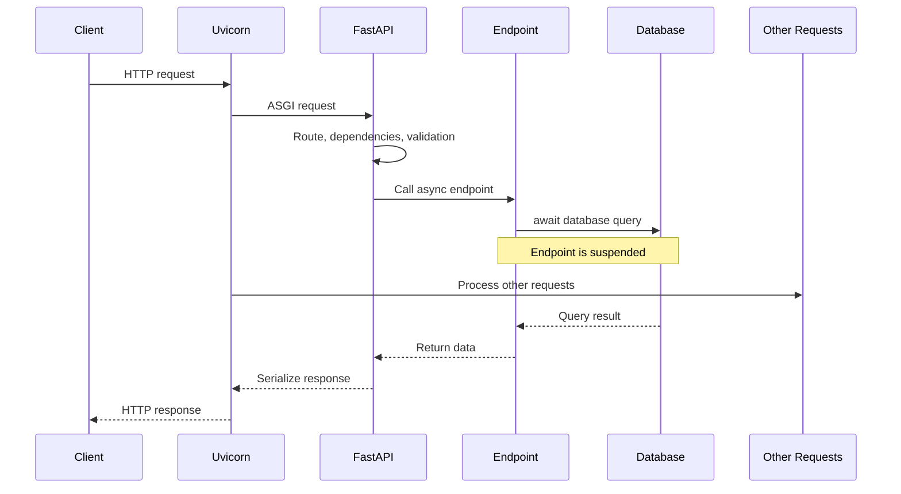

## 3.2 The event loop

The event loop manages asynchronous tasks. A task keeps running until it:

- Reaches an `await` that is not immediately complete
- Finishes
- Raises an exception
- Is cancelled

When a task pauses at `await`, the loop can run another ready task.

A simplified mental model is:

```python
while application_is_running:
    ready_task = get_next_ready_task()
    run_task_until_it_waits_or_finishes(ready_task)
```

The actual event loop is more sophisticated, but this model is useful for understanding endpoint behaviour.

---

# 4. `def` vs `async def` in FastAPI

FastAPI supports both styles.

## 4.1 Async endpoint

```python
@app.get("/products")
async def list_products():
    products = await product_repository.list_all()
    return products
```

Use `async def` when the libraries called by the endpoint provide awaitable APIs.

Typical examples:

- `httpx.AsyncClient`
- SQLAlchemy `AsyncSession`
- `asyncpg`
- Async Redis clients
- Async message broker clients
- Async cloud SDK operations

## 4.2 Synchronous endpoint

```python
@app.get("/legacy-report")
def generate_legacy_report():
    return legacy_sdk.generate_report()
```

A normal `def` path operation is executed by FastAPI/Starlette in an external thread pool. This prevents the synchronous handler from directly blocking the main event loop.

Use `def` when the endpoint mainly calls a blocking library that has no async API.

## 4.3 Decision table

| Endpoint work | Recommended style | Reason |
|---|---|---|
| Async database driver | `async def` | The query can be awaited |
| Async HTTP client | `async def` | Network waiting does not block the loop |
| Blocking database driver | `def` | FastAPI runs the handler in a thread pool |
| Blocking vendor SDK | `def` | Isolates blocking I/O from the event loop |
| Small in-memory calculation | Either | Execution is brief |
| Heavy CPU calculation | Neither alone is enough | Use a process, worker, or task queue |
| Mixed async and blocking calls | `async def` plus explicit offloading | Keep the event loop unblocked |

## 4.4 Important detail about helper functions

FastAPI automatically manages path operation functions and dependencies. It does not automatically inspect and offload every helper function you call.

```python
def blocking_helper() -> str:
    # Blocking operation
    return legacy_client.fetch_data()

@app.get("/data")
async def get_data():
    # Called directly on the event-loop thread: dangerous.
    return blocking_helper()
```

A normal helper called inside `async def` runs normally on the same thread. It is **not** automatically moved to FastAPI's thread pool.

---

# 5. Why FastAPI Is Fast

FastAPI's performance comes from several layers working together.

## 5.1 ASGI architecture

ASGI supports asynchronous applications, long-lived connections, streaming, and WebSockets.

Unlike the traditional synchronous WSGI model, an ASGI application can wait for I/O without dedicating one application thread to doing nothing for the entire wait.

## 5.2 Efficient server layer

Uvicorn is a lightweight ASGI server. It handles the network protocol and passes ASGI messages to the application.

Depending on installation and platform, Uvicorn can use efficient event-loop and protocol implementations. The actual configuration must be measured in the target environment rather than assumed.

## 5.3 Starlette

FastAPI uses Starlette for the core web framework features, including:

- ASGI request and response handling
- Routing
- Middleware
- WebSockets
- Streaming
- Background tasks
- Thread-pool integration

Starlette is intentionally lightweight and designed for asynchronous web services.

## 5.4 Async I/O concurrency

FastAPI can keep many I/O-bound requests in progress without creating one operating-system thread for every request.

This is especially valuable when request latency is dominated by external systems.

For example, assume each request spends:

```text
5 ms  executing Python code
95 ms waiting for a database or API
```

A synchronous design may keep a worker occupied for approximately 100 ms. An async design can use much of the 95 ms waiting period to progress other requests.

## 5.5 Pydantic validation and serialization

FastAPI uses Pydantic for request validation, response serialization, and schema generation. Modern Pydantic uses `pydantic-core`, whose core validation logic is implemented in Rust.

This helps FastAPI provide strong validation without requiring a large amount of manually written parsing code.

## 5.6 Low framework overhead

FastAPI is built close to Starlette and Uvicorn. It adds API-oriented features such as:

- Type-based request parsing
- Dependency injection
- Validation
- OpenAPI generation
- Response models

These features add some overhead compared with raw Uvicorn or Starlette, but FastAPI remains one of the faster Python API frameworks in common benchmark suites.

## 5.7 What “FastAPI is fast” does not mean

FastAPI cannot make slow application logic disappear.

The following can still make an application slow:

- Unindexed database queries
- N+1 queries
- Slow downstream APIs
- Blocking calls inside async endpoints
- Excessive response validation
- Large JSON payloads
- CPU-heavy work
- Connection-pool exhaustion
- Too many retries
- Logging large request or response bodies
- Network latency

> Framework performance matters, but application architecture and external dependencies normally matter more.

---

# 6. Blocking the Event Loop

The most important rule of async FastAPI development is:

> Do not execute slow blocking operations directly inside `async def`.

## 6.1 Incorrect: blocking sleep

```python
import time
from fastapi import FastAPI

app = FastAPI()

@app.get("/bad")
async def bad_endpoint():
    time.sleep(5)
    return {"status": "done"}
```

`time.sleep(5)` blocks the event-loop thread. During that time, other tasks assigned to that event loop cannot make normal progress.

## 6.2 Correct: asynchronous sleep

```python
import asyncio
from fastapi import FastAPI

app = FastAPI()

@app.get("/good")
async def good_endpoint():
    await asyncio.sleep(5)
    return {"status": "done"}
```

`asyncio.sleep()` suspends the current task and allows the loop to run other tasks.

## 6.3 Blocking library inside an async endpoint

Suppose a legacy SDK is synchronous:

```python
def fetch_customer_from_legacy_sdk(customer_id: int) -> dict:
    return legacy_sdk.get_customer(customer_id)
```

You can explicitly offload it:

```python
from starlette.concurrency import run_in_threadpool

@app.get("/customers/{customer_id}")
async def get_customer(customer_id: int):
    customer = await run_in_threadpool(
        fetch_customer_from_legacy_sdk,
        customer_id,
    )
    return customer
```

Another Python-level option is `asyncio.to_thread()`:

```python
import asyncio

@app.get("/customers/{customer_id}")
async def get_customer(customer_id: int):
    customer = await asyncio.to_thread(
        fetch_customer_from_legacy_sdk,
        customer_id,
    )
    return customer
```

Use offloading deliberately. A thread pool has finite capacity and is not a solution for unlimited blocking work.

## 6.4 Common blocking operations

Be careful with:

```python
requests.get(...)
time.sleep(...)
subprocess.run(...)
open(...).read()
pandas.read_csv(...)
boto3_client.some_operation(...)
synchronous_database_session.execute(...)
```

Some operations are very quick for small inputs, but they are still synchronous. Their effect must be evaluated based on latency, input size, concurrency, and frequency.

## 6.5 Async replacements

| Blocking operation | Async-friendly alternative |
|---|---|
| `requests` | `httpx.AsyncClient` or `aiohttp` |
| `time.sleep` | `asyncio.sleep` |
| Sync SQLAlchemy session | SQLAlchemy `AsyncSession` |
| `psycopg2` | `asyncpg` or an async SQLAlchemy-compatible driver |
| Sync Redis client | Async Redis client |
| Blocking helper | `run_in_threadpool()` or `asyncio.to_thread()` |
| Heavy CPU calculation | Process pool or external worker |

---

# 7. Async I/O in Real Applications

## 7.1 Calling an external API

```python
import httpx
from fastapi import FastAPI, HTTPException

app = FastAPI()

@app.get("/exchange-rates")
async def get_exchange_rates():
    timeout = httpx.Timeout(5.0)

    async with httpx.AsyncClient(timeout=timeout) as client:
        response = await client.get("https://example.com/api/rates")

    if response.is_error:
        raise HTTPException(
            status_code=502,
            detail="Rate provider failed",
        )

    return response.json()
```

This works, but creating a new client for every request prevents effective connection reuse.

## 7.2 Reusing an HTTP client with lifespan

```python
from contextlib import asynccontextmanager

import httpx
from fastapi import FastAPI, Request


@asynccontextmanager
async def lifespan(app: FastAPI):
    app.state.http_client = httpx.AsyncClient(
        timeout=httpx.Timeout(5.0),
        limits=httpx.Limits(
            max_connections=100,
            max_keepalive_connections=20,
        ),
    )

    try:
        yield
    finally:
        await app.state.http_client.aclose()


app = FastAPI(lifespan=lifespan)


@app.get("/catalog")
async def get_catalog(request: Request):
    client: httpx.AsyncClient = request.app.state.http_client
    response = await client.get("https://example.com/api/catalog")
    response.raise_for_status()
    return response.json()
```

Benefits:

- Reuses TCP connections
- Reuses TLS sessions where possible
- Controls connection-pool limits
- Centralizes timeout configuration
- Closes resources during shutdown

## 7.3 Add explicit timeouts

Never allow a downstream request to wait forever.

```python
timeout = httpx.Timeout(
    connect=2.0,
    read=5.0,
    write=5.0,
    pool=1.0,
)
```

Different timeout types protect against different failures:

| Timeout | Protects against |
|---|---|
| Connect | Slow or unreachable connection establishment |
| Read | Downstream stops returning response data |
| Write | Request upload stalls |
| Pool | Waiting too long for a free connection |

---

# 8. Running Independent Operations Concurrently

Async code is not automatically concurrent just because it uses `await`.

## 8.1 Sequential awaits

```python
user = await get_user(user_id)
orders = await get_orders(user_id)
recommendations = await get_recommendations(user_id)
```

If each operation takes 200 ms, the total waiting time may be approximately:

```text
200 ms + 200 ms + 200 ms = 600 ms
```

This is correct when later operations depend on earlier results.

## 8.2 Concurrent independent operations

```python
import asyncio

user, orders, recommendations = await asyncio.gather(
    get_user(user_id),
    get_orders(user_id),
    get_recommendations(user_id),
)
```

If the operations are independent and each takes around 200 ms, the combined waiting time may be closer to the slowest operation rather than their sum.


Actual latency also includes scheduling, connection acquisition, serialization, network variation, and downstream processing.

## 8.3 Do not create unbounded concurrency

This is dangerous:

```python
results = await asyncio.gather(
    *(fetch_item(item_id) for item_id in thousands_of_ids)
)
```

It may create thousands of simultaneous operations and exhaust:

- Database connections
- HTTP connections
- Memory
- File descriptors
- Downstream service capacity

Use bounded concurrency:

```python
import asyncio

semaphore = asyncio.Semaphore(20)


async def fetch_with_limit(item_id: int):
    async with semaphore:
        return await fetch_item(item_id)


results = await asyncio.gather(
    *(fetch_with_limit(item_id) for item_id in item_ids)
)
```

The correct limit depends on downstream capacity, connection pools, latency, and service-level objectives.

## 8.4 Error behaviour

By default, an exception from one `asyncio.gather()` operation is propagated to the caller.

Handle failures based on business requirements:

- Fail the entire request
- Return partial results
- Retry selected transient errors
- Replace failed optional data with a fallback
- Cancel unnecessary sibling operations

Do not hide errors by using broad `except Exception` blocks without logging and a clear fallback policy.

---

# 9. CPU-Bound Work

Async performs best for I/O-bound workloads. It does not make CPU-heavy Python code non-blocking.

Examples of CPU-bound work:

- Image resizing
- Video conversion
- PDF rendering
- Large data transformations
- Compression
- Password hashing with expensive settings
- Machine-learning inference
- Complex report generation
- Large cryptographic operations

## 9.1 Incorrect

```python
@app.post("/generate-report")
async def generate_report(payload: ReportInput):
    report = build_large_report(payload)  # CPU-heavy
    return report
```

The CPU-heavy function blocks the event loop until it finishes.

## 9.2 Better architectures

### Small or occasional CPU work

Use a process pool after measuring the overhead:

```python
import asyncio
from concurrent.futures import ProcessPoolExecutor

process_pool = ProcessPoolExecutor()


@app.post("/generate-report")
async def generate_report(payload: ReportInput):
    loop = asyncio.get_running_loop()

    report = await loop.run_in_executor(
        process_pool,
        build_large_report,
        payload,
    )

    return report
```

### Long-running or business-critical work

Use an external job system:

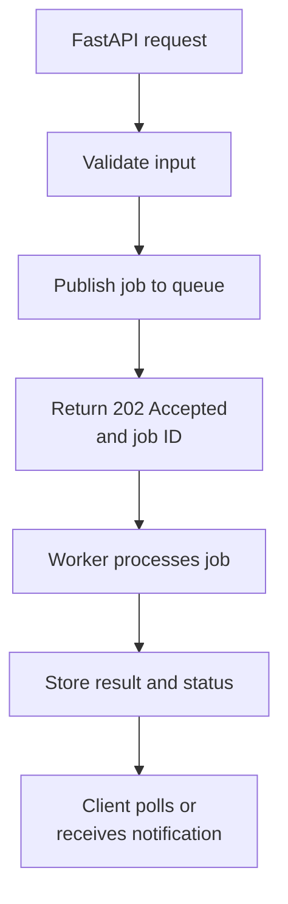

Suitable technologies include task queues, message brokers, managed queues, and dedicated worker services.

Advantages:

- Durable execution
- Retry policy
- Independent scaling
- Failure isolation
- Job status tracking
- Better request latency
- Easier resource control

> Threads help isolate blocking I/O. Processes or separate workers are normally better for CPU-heavy work.

---

# 10. Dependencies and Async Resource Management

FastAPI dependencies may also use `def` or `async def`.

## 10.1 Async dependency

```python
from typing import Annotated

from fastapi import Depends


async def get_current_user(
    token: Annotated[str, Depends(read_access_token)],
):
    return await user_service.find_by_token(token)
```

## 10.2 Sync dependency

```python
def read_settings() -> Settings:
    return load_settings_from_legacy_source()
```

A synchronous dependency managed by FastAPI is run in the external thread pool.

## 10.3 Dependency with `yield`

Use an async dependency to acquire and release an async resource.

```python
from collections.abc import AsyncIterator
from typing import Annotated

from fastapi import Depends
from sqlalchemy.ext.asyncio import AsyncSession


async def get_db_session() -> AsyncIterator[AsyncSession]:
    async with async_session_factory() as session:
        yield session


DbSession = Annotated[AsyncSession, Depends(get_db_session)]
```

FastAPI runs the setup code before the endpoint and the cleanup code after the endpoint finishes.


## 10.4 Match the whole call chain

An endpoint is only safely asynchronous when its important I/O dependencies are also async.

```text
async endpoint
  ├── async dependency
  ├── async database driver
  ├── async HTTP client
  └── async Redis client
```

A single slow blocking operation can still block the event loop.

---

# 11. Database Considerations

Async database access can increase concurrency, but it does not repair inefficient data access.

## 11.1 Async SQLAlchemy example

```python
from sqlalchemy import select
from sqlalchemy.ext.asyncio import AsyncSession


async def find_active_users(
    session: AsyncSession,
) -> list[User]:
    statement = select(User).where(User.is_active.is_(True))
    result = await session.execute(statement)
    return list(result.scalars().all())
```

Endpoint:

```python
@app.get("/users", response_model=list[UserResponse])
async def list_users(session: DbSession):
    return await find_active_users(session)
```

## 11.2 Important database rules

- Use an async-compatible database driver.
- Create a session per request or unit of work.
- Do not share one `AsyncSession` across unrelated concurrent tasks.
- Configure the connection pool intentionally.
- Keep transactions as short as practical.
- Add indexes based on actual query patterns.
- Avoid N+1 query patterns.
- Paginate large result sets.
- Select only required columns where appropriate.
- Measure query execution time separately from API time.

## 11.3 Connection-pool bottleneck

Suppose the API accepts 500 concurrent requests but the database pool allows only 20 active connections.

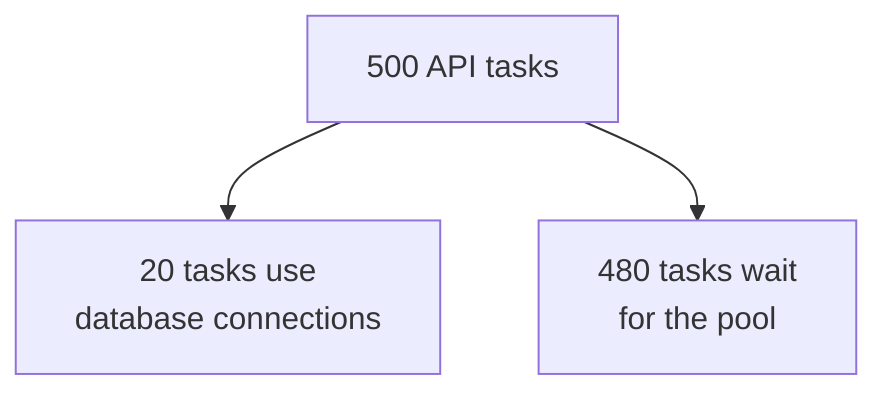

Async allows waiting tasks to avoid blocking the event loop, but it does not increase database capacity.

The pool should protect the database, not simply match the number of incoming requests.

---

# 12. Thread Pool Behaviour

When a path operation or dependency is defined using normal `def`, FastAPI/Starlette runs it in a thread pool.

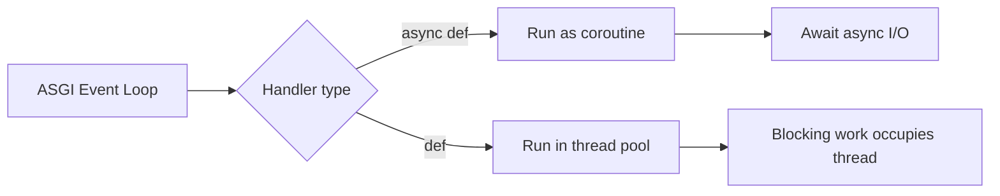

## 12.1 Thread-pool capacity is limited

Starlette currently uses AnyIO's thread-pool limiter. Its documented default limit is 40 tokens, shared with other synchronous work using the same limiter.

This means synchronous routes are not infinitely scalable. If many blocking handlers occupy all available thread slots, additional work must wait.

Do not increase the limit blindly. More threads can increase:

- Memory usage
- Context switching
- Downstream pressure
- Database connections
- Lock contention

Measure first and prefer native async clients for high-volume I/O when practical.

## 12.2 Thread pool and the GIL

Python threads can help with blocking I/O because the thread spends time waiting. For CPU-heavy Python code, threads usually do not provide reliable multi-core parallelism because of the Global Interpreter Lock and other workload-specific factors.

Use processes or native code that releases the GIL for CPU-bound scaling.

---

# 13. Background Tasks

FastAPI supports in-process background tasks that run after the response is sent.

```python
from fastapi import BackgroundTasks, FastAPI

app = FastAPI()


def write_audit_record(user_id: int) -> None:
    audit_repository.write(user_id)


@app.post("/users/{user_id}/notify")
async def notify_user(
    user_id: int,
    background_tasks: BackgroundTasks,
):
    background_tasks.add_task(write_audit_record, user_id)
    return {"accepted": True}
```

Good use cases:

- Small audit writes
- Non-critical notification work
- Lightweight cleanup
- Small post-response actions

Avoid using in-process background tasks for:

- Long-running jobs
- CPU-heavy processing
- Tasks that must survive a process restart
- Financial or transactional operations requiring guaranteed execution
- Large batches
- Complex retry workflows

The task runs in the application process. If that process stops, unfinished work may be lost.

Use a durable queue and separate worker when execution must be reliable.

---

# 14. Workers, Event Loops, and Scaling

One process normally has its own event loop and memory space.

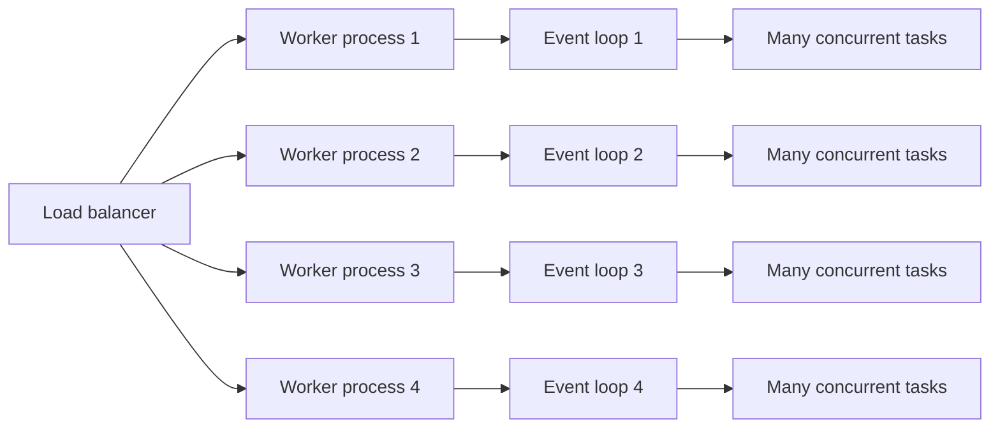

## 14.1 Why use multiple workers?

Multiple processes can:

- Use multiple CPU cores
- Isolate process failures
- Increase capacity for mixed workloads
- Reduce the effect of one blocked event loop

Example:

```bash
uvicorn app.main:app --host 0.0.0.0 --port 8000 --workers 4
```

Current FastAPI documentation also describes worker support through the `fastapi` CLI.

## 14.2 Workers are not free

Each worker has separate:

- Python interpreter
- Event loop
- Memory
- Application state
- Connection pools
- In-memory caches
- Model instances

Four workers may create four independent database pools. Pool configuration must therefore be considered across all workers and all application replicas.

## 14.3 Container environments

In orchestrated environments, a common design is:

```text
One application process per container
   +
Multiple container replicas
```

This allows the platform to manage replication, restarts, health checks, and scaling. The correct approach depends on the deployment platform and operational requirements.

## 14.4 Measure instead of guessing

Worker count depends on:

- CPU cores
- Memory
- I/O wait
- Blocking code
- Database limits
- Payload sizes
- Downstream capacity
- Required latency
- Traffic pattern

Load testing is more reliable than a fixed formula.

---

# 15. Testing Async Endpoints

FastAPI supports asynchronous tests using HTTPX.

```python
import pytest
from httpx import ASGITransport, AsyncClient

from app.main import app


@pytest.mark.anyio
async def test_health_endpoint():
    transport = ASGITransport(app=app)

    async with AsyncClient(
        transport=transport,
        base_url="http://test",
    ) as client:
        response = await client.get("/health")

    assert response.status_code == 200
    assert response.json() == {"status": "ok"}
```

Async tests are useful when the test must also await:

- Async repository methods
- Async fixture setup
- Database operations
- Message-broker operations
- Async external-service mocks

## 15.1 What to test

Test more than successful responses:

- Timeout handling
- Downstream service failure
- Cancellation
- Connection-pool exhaustion
- Concurrent requests
- Partial failure in `gather`
- Validation failures
- Cleanup after exceptions
- Transaction rollback
- Application shutdown

## 15.2 Load testing

Unit tests cannot prove concurrency performance.

Use load tests to measure:

- Requests per second
- p50, p95, and p99 latency
- Error rate
- Event-loop lag
- Thread-pool saturation
- Database pool wait time
- CPU and memory
- Downstream latency
- Timeouts and retries

Test realistic payloads and downstream behaviour.

---

# 16. Performance and Reliability Practices

## 16.1 Use async end to end

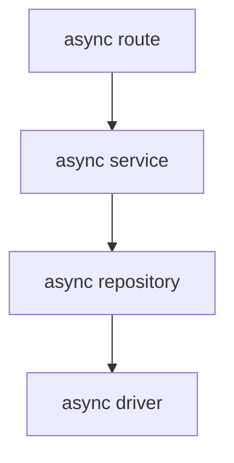

Avoid mixing in hidden blocking libraries.

## 16.2 Set timeouts everywhere

Apply timeouts to:

- HTTP clients
- Database queries where supported
- Connection-pool acquisition
- Redis
- Message brokers
- File storage
- Internal service calls

## 16.3 Reuse clients and pools

Create long-lived clients during application startup and close them during shutdown.

Examples:

- HTTP client
- Database engine
- Redis pool
- Message-broker connection

Do not create an expensive network client for every request unless isolation is specifically required.

## 16.4 Bound concurrency

Protect downstream systems with:

- Semaphores
- Connection-pool limits
- Queue limits
- Rate limits
- Server concurrency limits
- Backpressure
- Circuit breakers where appropriate

## 16.5 Keep endpoints thin

A clean structure is:

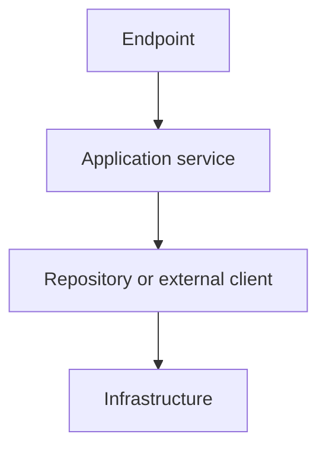

The endpoint should focus on HTTP concerns. Async decisions should be consistent across the service and infrastructure layers.

## 16.6 Avoid unnecessary concurrency

Do not use `gather()` when:

- Operation B depends on Operation A
- All tasks compete for the same locked resource
- The downstream service cannot handle the fan-out
- The result set is very large
- Sequential execution is required by business rules

## 16.7 Handle cancellation

A client may disconnect or a timeout may cancel a task. Cleanup should use `finally`, context managers, or dependency cleanup.

```python
async def use_resource():
    resource = await acquire_resource()

    try:
        return await perform_work(resource)
    finally:
        await resource.close()
```

Do not suppress `asyncio.CancelledError` unless there is a specific reason and cancellation is correctly propagated afterward.

## 16.8 Observe event-loop health

Useful production signals include:

- Event-loop lag
- Number of in-flight requests
- Thread-pool queueing
- Database connection wait
- Downstream timeout counts
- Task cancellations
- Worker restarts
- Request duration by route

A service may show low CPU while still being overloaded because it is waiting on exhausted pools or downstream systems.

## 16.9 Optimize only after measuring

Recommended order:

1. Measure endpoint latency.
2. Separate application time from database and external-service time.
3. Find blocking operations.
4. Inspect query count and query plans.
5. Check connection-pool waiting.
6. Check CPU, memory, and event-loop lag.
7. Change one bottleneck.
8. Load test again.

---

# 17. Practical Decision Guide

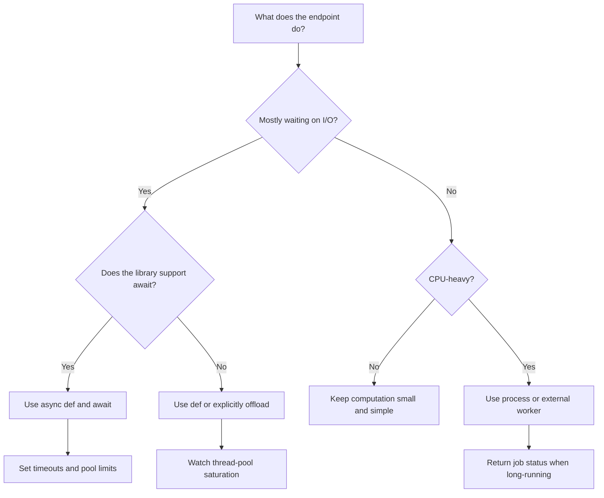

## 17.1 Quick reference

| Situation | Recommended action |
|---|---|
| Awaitable network or database library | Use `async def` |
| Synchronous blocking SDK | Use `def` or offload explicitly |
| Blocking call accidentally inside `async def` | Replace it or move it to a thread |
| Several independent async calls | Run concurrently with a safe limit |
| Heavy CPU processing | Use processes or a worker service |
| Long, durable task | Queue it and return a job ID |
| Many sync endpoints | Monitor thread-pool capacity |
| High API concurrency | Tune downstream pools and apply backpressure |
| Slow API despite async | Profile database, network, serialization, and blocking code |

---

# 18. Complete Example

This example demonstrates:

- Reusable async HTTP client
- Async endpoint
- Concurrent independent calls
- Timeout handling
- Controlled error mapping
- Lightweight dependency usage

```python
from contextlib import asynccontextmanager
from typing import Annotated, Any

import asyncio
import httpx
from fastapi import Depends, FastAPI, HTTPException, Request
from pydantic import BaseModel


class ProductSummary(BaseModel):
    product: dict[str, Any]
    inventory: dict[str, Any]
    pricing: dict[str, Any]


@asynccontextmanager
async def lifespan(app: FastAPI):
    app.state.http = httpx.AsyncClient(
        timeout=httpx.Timeout(
            connect=2.0,
            read=4.0,
            write=4.0,
            pool=1.0,
        ),
        limits=httpx.Limits(
            max_connections=100,
            max_keepalive_connections=20,
        ),
    )

    try:
        yield
    finally:
        await app.state.http.aclose()


app = FastAPI(lifespan=lifespan)


def get_http_client(request: Request) -> httpx.AsyncClient:
    return request.app.state.http


HttpClient = Annotated[
    httpx.AsyncClient,
    Depends(get_http_client),
]


async def fetch_json(
    client: httpx.AsyncClient,
    url: str,
) -> dict[str, Any]:
    response = await client.get(url)
    response.raise_for_status()
    return response.json()


@app.get(
    "/products/{product_id}/summary",
    response_model=ProductSummary,
)
async def get_product_summary(
    product_id: int,
    client: HttpClient,
) -> ProductSummary:
    base_url = "https://example.com/internal"

    try:
        product, inventory, pricing = await asyncio.gather(
            fetch_json(
                client,
                f"{base_url}/products/{product_id}",
            ),
            fetch_json(
                client,
                f"{base_url}/inventory/{product_id}",
            ),
            fetch_json(
                client,
                f"{base_url}/pricing/{product_id}",
            ),
        )
    except httpx.TimeoutException as exc:
        raise HTTPException(
            status_code=504,
            detail="A downstream service timed out",
        ) from exc
    except httpx.HTTPStatusError as exc:
        raise HTTPException(
            status_code=502,
            detail="A downstream service returned an error",
        ) from exc
    except httpx.RequestError as exc:
        raise HTTPException(
            status_code=502,
            detail="A downstream service could not be reached",
        ) from exc

    return ProductSummary(
        product=product,
        inventory=inventory,
        pricing=pricing,
    )
```

## 18.1 Execution flow

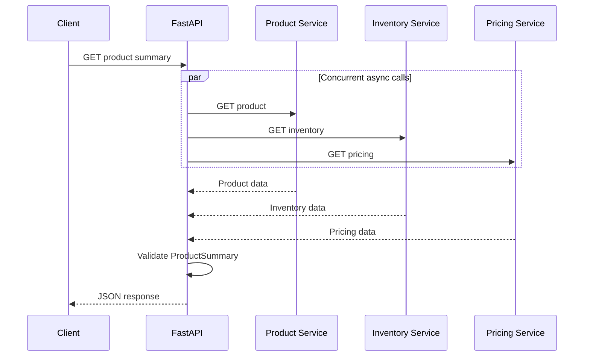

## 18.2 Production improvements

Depending on requirements, add:

- Authentication and authorization
- Correlation IDs
- Structured logging
- Tracing
- Retry rules for safe, transient failures
- Circuit breaking
- Per-service concurrency limits
- Response caching
- Metrics
- Partial-result policy
- Contract tests for downstream services

---

# 19. Interview-Ready Mental Model

Use this explanation:

> FastAPI runs on ASGI, commonly through Uvicorn, and uses Starlette underneath. An `async def` endpoint runs as a coroutine on an event loop. When it awaits non-blocking I/O, the event loop can process other requests instead of leaving a thread idle. A normal `def` endpoint is moved to a thread pool so blocking synchronous code does not directly stop the event loop. Async improves throughput for I/O-bound workloads, but it does not speed up CPU-heavy work. Blocking calls inside `async def` can still freeze that worker's event loop, so the full call chain should use async-compatible libraries or explicitly offload blocking work.

Remember these points:

1. `async def` creates a coroutine function.
2. `await` pauses the current task, not the entire server.
3. Async is most useful for I/O-bound work.
4. Async does not automatically mean parallel execution.
5. Blocking code inside `async def` blocks the event loop.
6. FastAPI runs managed `def` routes and dependencies in a thread pool.
7. Directly called sync helper functions are not automatically offloaded.
8. Independent async operations can be run concurrently.
9. Concurrency must be bounded to protect downstream systems.
10. CPU-heavy tasks need processes or worker services.
11. Multiple worker processes help use multiple CPU cores.
12. Database design and downstream performance usually matter more than framework benchmark numbers.

---

# 20. Official References

Content reviewed against current official documentation on **July 27, 2026**.

- FastAPI — Concurrency and `async` / `await`  
  https://fastapi.tiangolo.com/async/

- FastAPI — Benchmarks  
  https://fastapi.tiangolo.com/benchmarks/

- FastAPI — Async Tests  
  https://fastapi.tiangolo.com/advanced/async-tests/

- FastAPI — Dependencies  
  https://fastapi.tiangolo.com/tutorial/dependencies/

- FastAPI — Dependencies with `yield`  
  https://fastapi.tiangolo.com/tutorial/dependencies/dependencies-with-yield/

- FastAPI — Server Workers  
  https://fastapi.tiangolo.com/deployment/server-workers/

- FastAPI — Deployment Concepts  
  https://fastapi.tiangolo.com/deployment/concepts/

- Starlette — Thread Pool  
  https://www.starlette.io/threadpool/

- Starlette — Introduction  
  https://www.starlette.io/

- Uvicorn — ASGI  
  https://www.uvicorn.org/concepts/asgi/

- Uvicorn — Event Loop  
  https://www.uvicorn.org/concepts/event-loop/

- Python — `asyncio`  
  https://docs.python.org/3/library/asyncio.html

- Pydantic — Documentation  
  https://docs.pydantic.dev/
